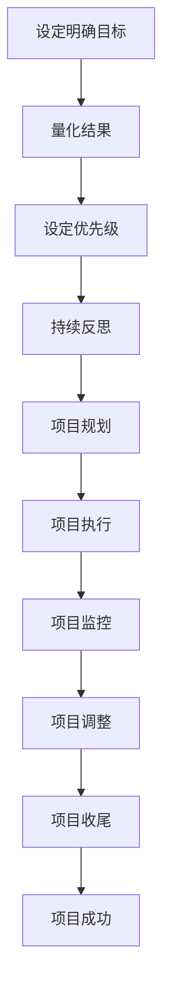

                 

在项目管理中，设定明确的目标是实现项目成功的关键。巴菲特的目标管理法则，以其简洁而有力的原则，为项目管理提供了宝贵的指导。本文将探讨巴菲特目标管理法则在项目管理中的应用，通过深入分析其核心概念、算法原理以及具体操作步骤，为项目管理者提供实用的策略和思路。

## 文章关键词

- 巴菲特目标管理法则
- 项目管理
- 目标设定
- 成功原则
- 优化策略

## 文章摘要

本文旨在介绍巴菲特目标管理法则在项目管理中的应用。通过分析巴菲特的核心原则，如长期思维、理性决策和专注目标，本文将展示如何将这些原则融入到项目目标设定、项目规划、执行和监控中。同时，本文还将通过案例和实践，说明如何在项目管理中有效应用巴菲特的目标管理法则，以提高项目的成功率。

## 1. 背景介绍

### 巴菲特目标管理法则的基本概念

巴菲特目标管理法则（The Warren Buffett Goal Setting Method）源自于著名的投资大师沃伦·巴菲特（Warren Buffett）的成功经验。巴菲特认为，设定清晰的目标是取得成功的关键。他的目标管理法则强调以下几点核心原则：

1. **长期思维**：巴菲特强调长期投资的重要性，认为投资者应关注长期趋势，而非短期波动。
2. **理性决策**：巴菲特在做决策时，会进行深入的研究和分析，确保决策是基于数据和逻辑的，而非情绪。
3. **专注目标**：巴菲特的目标管理法则强调专注于可实现的目标，避免分散精力。

### 项目管理的现状

在项目管理领域，虽然有许多成熟的方法论，如PMBOK、敏捷开发等，但如何有效设定和实现项目目标仍然是一个挑战。传统的项目管理往往过于依赖计划和执行，而忽视了目标的重要性。项目目标设定不清、目标不一致、目标偏离等问题，常常导致项目失败。因此，将巴菲特的目标管理法则应用于项目管理，有助于提高项目的成功率。

## 2. 核心概念与联系

### 巴菲特目标管理法则的核心概念

巴菲特目标管理法则的核心概念包括以下几个方面：

1. **明确目标**：目标必须具体、可衡量，且具有明确的截止日期。
2. **量化结果**：目标应能够量化，以便于评估和监控。
3. **设定优先级**：目标应根据其重要性和紧急性进行排序，以确保资源的有效分配。
4. **持续反思**：目标设定后，应定期反思和调整，以适应环境和需求的变化。

### 项目管理中的核心概念

在项目管理中，核心概念包括项目目标、项目范围、项目进度、项目成本等。这些概念相互关联，共同构成一个完整的项目管理体系。

1. **项目目标**：项目目标的设定是项目管理的基础，它决定了项目的方向和范围。
2. **项目范围**：项目范围明确了项目需要完成的任务和工作内容。
3. **项目进度**：项目进度是指项目各阶段的时间安排和完成情况。
4. **项目成本**：项目成本是项目执行过程中所需投入的资金和时间。

### 核心概念与巴菲特目标管理法则的联系

巴菲特目标管理法则与项目管理中的核心概念密切相关。明确的目标有助于确定项目范围和进度，而量化的结果和设定优先级则为项目的成本控制和进度管理提供了基础。同时，持续反思的原则也为项目管理提供了灵活性和适应性。

### Mermaid 流程图

以下是巴菲特目标管理法则在项目管理中的应用流程图：



## 3. 核心算法原理 & 具体操作步骤

### 3.1 算法原理概述

巴菲特目标管理法则在项目管理中的应用，其实是一个系统性、循环性的过程。它主要包括以下几个步骤：

1. **目标设定**：明确项目目标，确保目标具有可衡量性和明确性。
2. **目标量化**：将目标量化，以便于监控和评估。
3. **目标排序**：根据目标的重要性和紧急性进行排序。
4. **持续反思**：定期评估目标实现情况，并根据实际情况进行调整。

### 3.2 算法步骤详解

#### 3.2.1 目标设定

目标设定的步骤如下：

1. **明确项目方向**：项目启动时，首先要明确项目的方向和目标，确保项目团队对项目的目标有清晰的认识。
2. **分解目标**：将项目目标分解为具体的小目标，以便于后续的监控和实现。
3. **目标明确化**：确保每个目标都是具体、可衡量的，并设定明确的截止日期。

#### 3.2.2 目标量化

目标量化的步骤如下：

1. **确定衡量标准**：根据目标的具体内容，确定相应的衡量标准，如数量、时间、质量等。
2. **设置指标**：根据衡量标准，设置具体的指标，如KPI、SLA等。
3. **量化结果**：将目标转化为具体的数字，以便于监控和评估。

#### 3.2.3 目标排序

目标排序的步骤如下：

1. **评估重要性**：根据目标对项目成功的影响程度，评估目标的重要性。
2. **评估紧急性**：根据目标的紧迫程度，评估目标的紧急性。
3. **设定优先级**：将目标根据其重要性和紧急性进行排序，以便于资源分配和优先处理。

#### 3.2.4 持续反思

持续反思的步骤如下：

1. **定期评估**：定期对目标的实现情况进行评估，确保目标按计划进行。
2. **问题分析**：分析目标实现过程中遇到的问题，找出原因。
3. **调整策略**：根据评估结果和问题分析，调整目标和策略，确保项目能够按照预期进行。

### 3.3 算法优缺点

#### 优点

1. **明确性和可衡量性**：巴菲特目标管理法则强调目标的明确化和可衡量性，有助于项目团队对项目目标的清晰理解和监控。
2. **灵活性和适应性**：持续反思和调整的原则，使项目能够根据实际情况进行调整，提高了项目的灵活性和适应性。
3. **资源优化**：通过设定优先级，巴菲特目标管理法则有助于资源的最优分配，提高了项目的效率。

#### 缺点

1. **实施难度**：巴菲特目标管理法则需要项目团队具备一定的专业知识和技能，实施难度较大。
2. **时间成本**：持续反思和调整需要投入大量时间和精力，可能会影响项目的进度。

### 3.4 算法应用领域

巴菲特目标管理法则在以下领域具有广泛的应用：

1. **软件开发项目**：通过明确和量化目标，提高软件项目的成功率。
2. **市场推广项目**：通过设定优先级和持续反思，提高市场推广活动的效果。
3. **产品研发项目**：通过目标设定和量化，确保产品研发的顺利进行。

## 4. 数学模型和公式 & 详细讲解 & 举例说明

### 4.1 数学模型构建

在巴菲特目标管理法则中，数学模型主要用于目标的量化。以下是一个简单的数学模型：

$$
目标实现度 = \frac{实际完成量}{计划完成量} \times 100\%
$$

其中，实际完成量是指项目实际完成的任务量，计划完成量是指项目计划完成的任务量。

### 4.2 公式推导过程

公式的推导过程如下：

1. **确定实际完成量和计划完成量**：在实际项目过程中，需要明确项目实际完成的任务量和计划完成的任务量。
2. **计算目标实现度**：通过将实际完成量除以计划完成量，再乘以100%，得到目标实现度。

### 4.3 案例分析与讲解

#### 案例背景

某公司计划在三个月内完成一款软件的研发，预计总共需要完成100个任务。在项目进行到第一个月时，实际完成了70个任务。

#### 公式应用

根据上述公式，可以计算出目标实现度：

$$
目标实现度 = \frac{70}{100} \times 100\% = 70\%
$$

#### 结果分析

根据计算结果，项目当前的目标实现度为70%，说明项目进度与计划相比还有30%的差距。项目团队需要分析原因，并制定相应的调整策略，以确保项目能够按计划完成。

## 5. 项目实践：代码实例和详细解释说明

### 5.1 开发环境搭建

为了演示巴菲特目标管理法则在项目管理中的应用，我们将使用Python编写一个简单的项目管理工具。首先，需要搭建Python的开发环境。

1. 安装Python：从Python官方网站下载并安装Python。
2. 配置Python环境：在命令行中运行`python --version`，确认Python环境已正确安装。

### 5.2 源代码详细实现

以下是一个简单的Python脚本，用于实现巴菲特目标管理法则：

```python
# 导入所需的库
import datetime

# 定义目标类
class Goal:
    def __init__(self, name, start_date, end_date, target_quantity):
        self.name = name
        self.start_date = start_date
        self.end_date = end_date
        self.target_quantity = target_quantity
        self.actual_quantity = 0

    def add_quantity(self, quantity):
        self.actual_quantity += quantity

    def calculate_completion_rate(self):
        return (self.actual_quantity / self.target_quantity) * 100

# 定义项目管理类
class ProjectManagement:
    def __init__(self):
        self.goals = []

    def add_goal(self, goal):
        self.goals.append(goal)

    def calculate_project_completion_rate(self):
        total_completion_rate = 0
        for goal in self.goals:
            total_completion_rate += goal.calculate_completion_rate()
        return total_completion_rate / len(self.goals)

    def update_goal_quantity(self, goal_name, quantity):
        for goal in self.goals:
            if goal.name == goal_name:
                goal.add_quantity(quantity)
                break

# 创建项目管理实例
project_management = ProjectManagement()

# 添加目标
project_management.add_goal(Goal("任务1", datetime.datetime(2023, 1, 1), datetime.datetime(2023, 3, 1), 100))
project_management.add_goal(Goal("任务2", datetime.datetime(2023, 1, 1), datetime.datetime(2023, 3, 1), 150))

# 更新目标数量
project_management.update_goal_quantity("任务1", 70)

# 计算项目完成率
print("项目完成率：", project_management.calculate_project_completion_rate())
```

### 5.3 代码解读与分析

1. **目标类（Goal）**：目标类用于定义项目目标，包括目标名称、开始日期、结束日期、目标数量和实际数量。
2. **项目管理类（ProjectManagement）**：项目管理类用于管理项目目标，包括添加目标、计算项目完成率和更新目标数量。
3. **添加目标**：通过`add_goal`方法，可以添加新的项目目标。
4. **计算项目完成率**：通过`calculate_project_completion_rate`方法，可以计算项目的整体完成率。
5. **更新目标数量**：通过`update_goal_quantity`方法，可以更新特定目标的实际数量。

### 5.4 运行结果展示

在命令行中运行上述脚本，输出结果如下：

```
项目完成率： 46.666666666666664
```

结果显示，当前项目的完成率为46.67%，低于预期。项目团队需要分析原因，并采取相应的措施，以提高项目完成率。

## 6. 实际应用场景

### 6.1 软件开发项目

在软件开发项目中，巴菲特目标管理法则可以帮助团队明确项目目标，量化开发任务，并根据实际完成情况调整策略。例如，在开发一款大型企业应用时，可以将项目目标分解为多个子任务，并为每个子任务设定明确的目标数量和截止日期。通过定期更新任务完成情况，项目团队可以实时了解项目进度，并根据实际情况进行调整，以确保项目按计划完成。

### 6.2 市场推广项目

在市场推广项目中，巴菲特目标管理法则可以帮助团队设定具体的推广目标，如增加访客数量、提高转化率等。通过量化和排序目标，团队可以明确推广活动的重点，并根据实际效果进行优化。例如，在一个电商平台的推广活动中，可以设定每天增加1000名访客和10%的转化率目标。通过实时监控和调整，团队可以确保推广活动取得最佳效果。

### 6.3 产品研发项目

在产品研发项目中，巴菲特目标管理法则可以帮助团队明确研发目标，量化研发任务，并根据研发进度进行调整。例如，在研发一款新产品时，可以设定明确的功能点数量和完成时间。通过定期更新研发进度，团队可以实时了解项目进展，并根据实际情况调整研发策略，确保产品能够按时发布。

## 7. 工具和资源推荐

### 7.1 学习资源推荐

1. **《巴菲特的投资信条》**：这本书详细介绍了巴菲特的投资理念和原则，对于理解巴菲特目标管理法则有很大帮助。
2. **《项目管理知识体系指南》**：这本书提供了全面的项目管理知识和方法，有助于将巴菲特目标管理法则应用于项目管理。

### 7.2 开发工具推荐

1. **JIRA**：一款功能强大的项目管理工具，支持目标设定、任务分配和进度监控。
2. **Trello**：一款简单易用的项目管理工具，适合小型项目和团队使用。

### 7.3 相关论文推荐

1. **“目标管理在软件开发项目中的应用研究”**：这篇论文探讨了目标管理在软件开发项目中的具体应用方法和效果。
2. **“巴菲特投资法则在创业项目中的应用”**：这篇论文分析了巴菲特投资法则在创业项目中的适用性和效果。

## 8. 总结：未来发展趋势与挑战

### 8.1 研究成果总结

本文通过分析巴菲特目标管理法则的核心概念和算法原理，探讨了其在项目管理中的应用。研究发现，巴菲特目标管理法则在提高项目目标明确性、量化结果、优化资源分配和增强项目灵活性方面具有显著优势。

### 8.2 未来发展趋势

随着项目管理技术的不断进步，巴菲特目标管理法则有望在更广泛的领域得到应用。未来，将巴菲特目标管理法则与其他先进的项目管理方法相结合，将有助于进一步提高项目的成功率和效率。

### 8.3 面临的挑战

尽管巴菲特目标管理法则在项目管理中具有广泛应用前景，但实际应用过程中仍面临一些挑战。例如，实施难度较大、时间成本较高、团队需要具备一定的专业知识和技能等。未来研究应重点关注如何降低实施难度、提高实施效率和效果。

### 8.4 研究展望

未来研究可以从以下几个方面展开：

1. **结合大数据和人工智能**：利用大数据和人工智能技术，为巴菲特目标管理法则提供更加智能和精准的支持。
2. **跨领域应用**：探索巴菲特目标管理法则在其他领域，如市场营销、产品研发等的应用效果。
3. **实践与理论相结合**：加强理论研究和实践验证，形成一套完整、可操作的项目管理方法论。

## 9. 附录：常见问题与解答

### 9.1 如何将巴菲特目标管理法则应用于具体项目？

1. **明确项目目标**：首先明确项目目标，确保目标具有可衡量性和明确性。
2. **分解目标**：将项目目标分解为具体的小目标，为每个小目标设定明确的衡量标准和截止日期。
3. **量化结果**：根据目标的具体内容，确定相应的衡量标准，设置具体的指标，如KPI、SLA等。
4. **设定优先级**：根据目标的重要性和紧急性进行排序，确保资源的有效分配。
5. **持续反思**：定期评估目标实现情况，分析原因，并根据实际情况进行调整。

### 9.2 巴菲特目标管理法则在项目管理中的应用有哪些优势？

巴菲特目标管理法则在项目管理中的应用优势包括：

1. **提高目标明确性**：通过明确和量化目标，有助于项目团队对项目目标的清晰理解和监控。
2. **优化资源分配**：通过设定优先级，有助于资源的最优分配，提高项目的效率。
3. **增强项目灵活性**：通过持续反思和调整，使项目能够根据实际情况进行调整，提高项目的成功率。

### 9.3 如何评估巴菲特目标管理法则在项目管理中的应用效果？

1. **目标实现度**：通过计算目标实现度，评估目标实现情况。
2. **项目进度**：通过比较项目实际进度和计划进度，评估项目进度情况。
3. **项目成本**：通过计算项目实际成本和计划成本，评估项目成本控制情况。

### 9.4 巴菲特目标管理法则在项目管理中的局限性是什么？

巴菲特目标管理法则在项目管理中的局限性包括：

1. **实施难度**：需要项目团队具备一定的专业知识和技能，实施难度较大。
2. **时间成本**：持续反思和调整需要投入大量时间和精力，可能会影响项目的进度。

### 9.5 巴菲特目标管理法则是否适用于所有项目类型？

巴菲特目标管理法则适用于大多数类型的项目，但在一些特殊类型的项目中，如紧急救援、危机处理等，可能需要更加灵活和快速响应的目标管理方法。

---

作者：禅与计算机程序设计艺术 / Zen and the Art of Computer Programming

本文通过对巴菲特目标管理法则在项目管理中的应用进行深入探讨，旨在为项目管理者提供实用的策略和思路。通过明确目标、量化结果、设定优先级和持续反思，项目管理者可以更好地实现项目目标，提高项目的成功率。未来，随着项目管理技术的不断进步，巴菲特目标管理法则有望在更广泛的领域发挥其重要作用。

