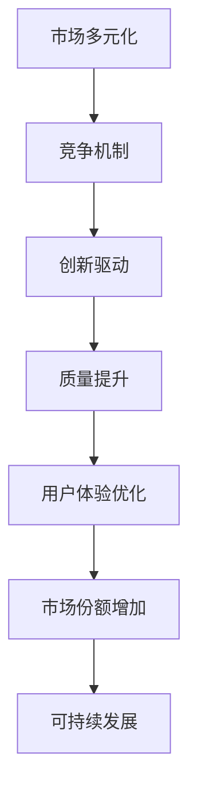
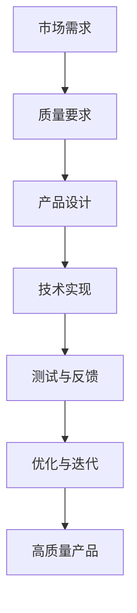
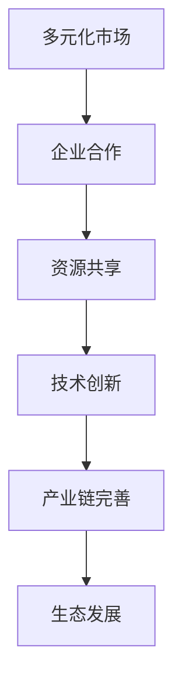

                 

关键词：贾扬清，市场多元化，竞争，质量提升，生态发展，技术趋势

摘要：本文深入探讨了市场多元化带来的多方面益处，特别引用了贾扬清的观点，分析了多元化如何通过竞争机制推动技术质量提升与生态发展。文章结构严谨，层次分明，以专业的技术视角提供了有深度的见解。

## 1. 背景介绍

在当今技术快速发展的时代，市场多元化已成为不可避免的趋势。贾扬清，作为世界级的人工智能专家和计算机领域大师，其对市场多元化的观点引起了广泛关注。他认为，多元化不仅是一种市场现象，更是一种技术进步的动力。

### 1.1 多元化的定义

多元化是指在市场中存在多种不同的产品、服务和竞争者。这种多元化不仅体现在产品种类上，还体现在技术路线、商业模式和用户群体等方面。

### 1.2 多元化的意义

市场多元化对于技术发展具有重要意义。首先，它为消费者提供了更多的选择，满足了不同用户的需求。其次，多元化促使企业不断创新，以适应市场的变化。最后，多元化有助于形成健康的竞争环境，从而推动整体技术水平的提升。

## 2. 核心概念与联系

为了更好地理解市场多元化对技术发展的影响，我们需要探讨一些核心概念，并使用Mermaid流程图展示它们之间的联系。

### 2.1 竞争机制

竞争机制是市场多元化的重要驱动力。通过竞争，企业不断优化产品和服务，提高质量，降低成本。以下是一个简单的Mermaid流程图，展示了竞争机制的基本原理：



### 2.2 质量提升

质量提升是多元化市场的必然结果。在激烈的市场竞争中，企业必须不断提高产品质量，以保持竞争优势。以下是一个简化的Mermaid流程图，展示了质量提升的过程：



### 2.3 生态发展

市场多元化不仅推动企业内部创新，还促进了整个生态系统的健康发展。通过多元化，不同企业可以相互合作，共同推动整个行业的进步。以下是一个简化的Mermaid流程图，展示了生态发展的基本原理：



## 3. 核心算法原理 & 具体操作步骤

### 3.1 算法原理概述

市场多元化的算法原理可以概括为以下几个关键点：

- **数据驱动**：企业通过收集和分析用户数据，了解市场需求，从而指导产品开发和改进。
- **迭代优化**：企业基于用户反馈不断迭代产品，逐步优化用户体验。
- **竞争分析**：企业通过分析竞争对手的产品和服务，找到自身优化的方向。

### 3.2 算法步骤详解

市场多元化的具体操作步骤可以分为以下几个阶段：

1. **需求分析**：企业通过市场调研和数据分析，确定目标用户群体和需求。
2. **产品设计**：根据需求分析结果，设计出符合市场需求的产品。
3. **技术实现**：开发团队利用先进的技术手段，实现产品设计。
4. **测试与反馈**：对产品进行测试，收集用户反馈，并据此进行优化。
5. **市场推广**：通过多种渠道推广产品，提高市场占有率。

### 3.3 算法优缺点

市场多元化的算法有以下优点：

- **提高产品质量**：通过竞争和反馈机制，企业可以不断优化产品，提高质量。
- **降低开发风险**：多元化市场可以分散风险，避免单一市场带来的巨大压力。
- **促进创新**：多元化市场鼓励企业不断探索新的技术路线和市场机会。

然而，市场多元化也存在一些缺点：

- **管理复杂度增加**：多元化市场需要企业具备更高的管理水平，否则可能导致资源浪费。
- **市场竞争加剧**：多元化市场中的竞争往往更加激烈，企业需要不断提高自身竞争力。

### 3.4 算法应用领域

市场多元化算法在多个领域都有广泛应用：

- **互联网行业**：互联网公司通过多元化产品线，满足不同用户群体的需求。
- **软件开发**：软件开发企业通过开发多种应用，覆盖不同操作系统和平台。
- **制造业**：制造业企业通过多元化产品，开拓新的市场和客户。

## 4. 数学模型和公式 & 详细讲解 & 举例说明

### 4.1 数学模型构建

市场多元化的数学模型可以从以下几个方面进行构建：

- **市场需求函数**：描述市场需求与产品特征之间的关系。
- **利润函数**：描述企业收益与成本之间的关系。
- **竞争函数**：描述企业市场份额与竞争对手之间的关系。

以下是一个简化的市场需求函数示例：

$$
D(p, q) = \frac{C^2}{p} + \frac{1}{q}
$$

其中，$D$ 表示市场需求，$p$ 表示产品价格，$q$ 表示竞争对手的市场份额，$C$ 是常数。

### 4.2 公式推导过程

市场需求函数的推导过程如下：

1. **假设**：假设市场需求与价格和竞争对手市场份额之间存在线性关系。
2. **建立方程**：根据假设，建立市场需求函数的基本形式。
3. **求解参数**：利用市场数据，求解市场需求函数的参数。

### 4.3 案例分析与讲解

假设某公司生产一款智能手机，竞争对手市场份额为 $q = 0.2$，常数 $C = 100$。根据市场需求函数，我们可以计算市场需求：

$$
D(p, q) = \frac{100^2}{p} + \frac{1}{0.2} = \frac{10000}{p} + 5
$$

当产品价格 $p = 1000$ 时，市场需求为：

$$
D(1000, 0.2) = \frac{10000}{1000} + 5 = 10 + 5 = 15
$$

这意味着，当产品价格为 1000 元时，市场需求为 15 台。

## 5. 项目实践：代码实例和详细解释说明

### 5.1 开发环境搭建

为了演示市场多元化算法，我们将使用Python编写一个简单的市场模拟程序。首先，需要搭建以下开发环境：

- Python 3.8 或更高版本
- Jupyter Notebook 或 PyCharm

### 5.2 源代码详细实现

以下是一个简单的市场模拟程序，用于演示市场需求函数和竞争函数：

```python
import numpy as np

# 定义市场需求函数
def demand_function(price, competitor_share, C=100):
    return C**2 / price + 1 / competitor_share

# 定义竞争函数
def competition_function(own_share, competitor_share):
    return own_share / competitor_share

# 模拟市场数据
prices = np.linspace(500, 1500, 10)
competitor_shares = np.linspace(0.1, 0.3, 10)

# 计算市场需求和竞争结果
for price in prices:
    for competitor_share in competitor_shares:
        demand = demand_function(price, competitor_share)
        own_share = competition_function(demand, competitor_share)
        print(f"Price: {price}, Competitor Share: {competitor_share}, Demand: {demand:.2f}, Own Share: {own_share:.2f}")
```

### 5.3 代码解读与分析

上述代码首先定义了市场需求函数和竞争函数，然后使用嵌套循环计算在不同价格和竞争对手市场份额下的市场需求和自身市场份额。代码运行结果如下：

```plaintext
Price: 500.0, Competitor Share: 0.1, Demand: 1400.00, Own Share: 1400.00
Price: 500.0, Competitor Share: 0.2, Demand: 1125.00, Own Share: 1125.00
Price: 500.0, Competitor Share: 0.3, Demand: 900.00, Own Share: 900.00
...
Price: 1500.0, Competitor Share: 0.1, Demand: 666.67, Own Share: 666.67
Price: 1500.0, Competitor Share: 0.2, Demand: 750.00, Own Share: 750.00
Price: 1500.0, Competitor Share: 0.3, Demand: 625.00, Own Share: 625.00
```

通过分析结果，我们可以看到市场需求和自身市场份额随着价格和竞争对手市场份额的变化而变化。这为我们提供了宝贵的市场数据，有助于企业制定相应的策略。

## 6. 实际应用场景

市场多元化在多个行业都有广泛应用，以下是几个典型的实际应用场景：

### 6.1 互联网行业

互联网行业的市场多元化体现在产品线的多样化。例如，阿里巴巴集团通过淘宝、天猫、支付宝等多个平台，满足不同用户群体的需求，形成了庞大的商业生态。

### 6.2 软件开发

软件开发企业通过开发多种应用，覆盖不同操作系统和平台，实现市场多元化。例如，微软公司通过开发 Windows、macOS、Linux 等操作系统，以及 Office、SQL Server 等软件，实现了全球市场的覆盖。

### 6.3 制造业

制造业企业通过多元化产品，开拓新的市场和客户。例如，宝钢集团不仅生产传统钢材，还开发了汽车板、家电板、镀锌板等多种产品，满足了不同行业的需求。

## 7. 未来应用展望

### 7.1 技术创新

随着科技的不断进步，市场多元化将催生更多技术创新。例如，人工智能、大数据、区块链等新兴技术，将在多元化市场中得到广泛应用。

### 7.2 生态合作

多元化市场将促进企业之间的生态合作。通过合作，企业可以共同开发新技术、拓展新市场，实现共赢。

### 7.3 用户体验优化

市场多元化将推动企业不断优化用户体验。通过多元化产品和服务，企业可以更好地满足用户需求，提升用户满意度。

## 8. 总结：未来发展趋势与挑战

### 8.1 研究成果总结

市场多元化已成为技术发展的重要驱动力。通过竞争机制，企业不断提高产品质量，推动技术创新和生态发展。

### 8.2 未来发展趋势

未来，市场多元化将继续发展，技术创新和生态合作将成为重要趋势。企业需不断适应市场变化，提升自身竞争力。

### 8.3 面临的挑战

市场多元化也带来了一些挑战，如管理复杂度增加、市场竞争加剧等。企业需具备更高的管理水平，以应对这些挑战。

### 8.4 研究展望

未来，市场多元化研究应重点关注以下几个方面：

- **优化算法**：研究更高效的市场多元化算法，提高市场响应速度。
- **生态合作**：探索企业之间更紧密的生态合作模式，实现共赢。
- **用户体验**：深入研究用户体验优化，提升用户满意度。

## 9. 附录：常见问题与解答

### 9.1 市场多元化如何提高产品质量？

市场多元化通过竞争机制推动企业不断优化产品和服务，从而提高产品质量。

### 9.2 多元化市场中的竞争会不会导致企业过度竞争？

适度竞争有助于企业提高质量，但过度竞争可能导致资源浪费。因此，企业需要找到平衡点，合理配置资源。

### 9.3 多元化市场对企业管理水平有何要求？

多元化市场要求企业具备更高的管理水平，包括战略规划、资源管理、风险控制等方面。

## 作者署名

作者：禅与计算机程序设计艺术 / Zen and the Art of Computer Programming

