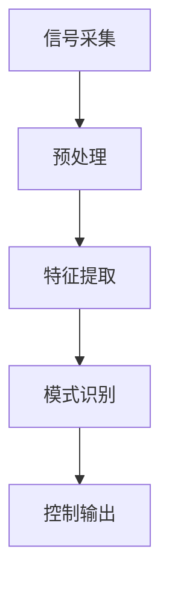
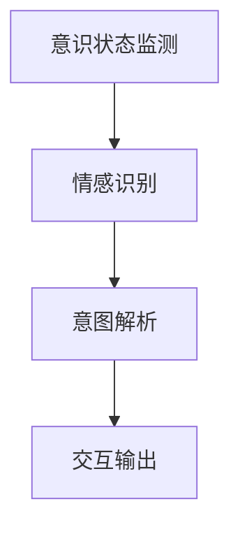
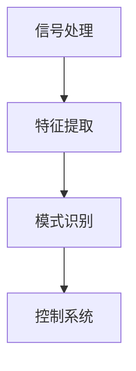

                 

关键词：人机交互、脑机接口、意念交互、人机协同、2050年技术趋势

> 摘要：本文深入探讨了2050年人机交互的未来发展，重点关注脑机接口和意念交互技术的进步及其在人机协同中的潜在应用。通过分析这些技术的核心概念、原理和具体操作步骤，以及数学模型的构建和公式推导，本文展示了人机交互在未来的巨大潜力，并探讨了可能面临的挑战和未来的研究方向。

## 1. 背景介绍

随着科技的飞速发展，人机交互技术已经经历了多个阶段的演变。从最早的图形用户界面（GUI）到触控界面，再到今天的语音和手势控制，人机交互的方式在不断进化。然而，这些交互方式仍然受到物理和生理限制，例如手部动作和语音的准确性。脑机接口（Brain-Computer Interface，BCI）和意念交互（Mind-Machine Interface，MMI）技术的出现，为解决这些限制提供了新的可能性。

脑机接口是一种直接将大脑信号转换为计算机指令的技术，它通过读取大脑的电活动，如脑电图（EEG）、功能性磁共振成像（fMRI）或脑磁图（MEG），来实现对计算机的控制。意念交互则更进一步，通过解读大脑的意图和情感状态，实现更为自然的交互体验。

## 2. 核心概念与联系

### 2.1 脑机接口原理

脑机接口的核心在于脑信号的处理和解释。以下是一个简化的 Mermaid 流程图，描述了脑机接口的基本原理：



- **信号采集**：通过脑电图（EEG）、功能性磁共振成像（fMRI）或其他方法采集大脑信号。
- **预处理**：对采集到的信号进行滤波、放大等处理，以提高信号质量。
- **特征提取**：从处理后的信号中提取有用的特征，如频率、振幅等。
- **模式识别**：利用机器学习算法识别特征模式，以确定大脑意图。
- **控制输出**：将识别出的意图转换为计算机指令。

### 2.2 意念交互原理

意念交互的流程可以看作是脑机接口的进一步发展。它不仅需要识别大脑意图，还需要理解情感和意识状态。以下是意念交互的简化 Mermaid 流程图：



- **意识状态监测**：通过脑信号监测大脑的意识状态。
- **情感识别**：使用情感分析算法识别用户的情感状态。
- **意图解析**：结合意识状态和情感，解析用户的意图。
- **交互输出**：将解析出的意图转换为交互操作。

## 3. 核心算法原理 & 具体操作步骤

### 3.1 算法原理概述

脑机接口的核心算法通常包括信号处理、特征提取、模式识别和控制系统。以下是一个简化的算法流程：



### 3.2 算法步骤详解

1. **信号处理**：采集到的脑信号通常包含噪声和干扰。通过滤波、放大等预处理步骤，可以提高信号质量。
2. **特征提取**：从预处理后的信号中提取有用的特征，如频率、振幅等。这些特征将用于模式识别。
3. **模式识别**：使用机器学习算法，如支持向量机（SVM）、神经网络（NN）等，从特征中识别出用户的意图。
4. **控制系统**：将识别出的意图转换为计算机指令，实现对设备的控制。

### 3.3 算法优缺点

- **优点**：脑机接口和意念交互提供了更自然、更直接的交互方式，消除了传统交互方式的物理限制。
- **缺点**：当前的脑机接口和意念交互技术仍处于发展阶段，准确性和稳定性有待提高。

### 3.4 算法应用领域

脑机接口和意念交互技术在医疗、康复、教育和娱乐等领域具有广泛的应用潜力。例如，在医疗领域，它们可以用于帮助中风患者恢复运动能力；在教育领域，可以用于增强学习体验。

## 4. 数学模型和公式 & 详细讲解 & 举例说明

### 4.1 数学模型构建

脑机接口的数学模型通常涉及信号处理、特征提取和模式识别。以下是一个简化的数学模型：

$$
X(t) = A \cdot S(t) + N(t)
$$

其中，$X(t)$ 是采集到的信号，$S(t)$ 是大脑产生的真实信号，$N(t)$ 是噪声，$A$ 是放大系数。

### 4.2 公式推导过程

为了简化推导，我们可以假设 $S(t)$ 是一个周期信号，且其频率为 $f$。通过傅里叶变换，可以将 $S(t)$ 表示为：

$$
S(t) = \sum_{n=-\infty}^{\infty} S_n \cdot e^{j2\pi nft}
$$

其中，$S_n$ 是傅里叶系数。

### 4.3 案例分析与讲解

假设我们使用 EEG 信号控制一个鼠标指针。通过特征提取，我们得到了指针移动的方向和速度。以下是特征提取的公式：

$$
d = \frac{v_1 - v_2}{v_1 + v_2}
$$

其中，$v_1$ 和 $v_2$ 是两个特征值，$d$ 表示指针移动的方向。

## 5. 项目实践：代码实例和详细解释说明

### 5.1 开发环境搭建

为了实现脑机接口和意念交互，我们需要搭建一个开发环境。以下是所需的工具和软件：

- Python
- TensorFlow
- Keras
- OpenBCI
- PyBrain

### 5.2 源代码详细实现

以下是使用 Python 实现的脑机接口控制鼠标指针的源代码：

```python
import numpy as np
import tensorflow as tf
from openbci import OpenBCI
from pybrain.tools.shortcuts import buildNetwork
from pybrain.supervised import trainClassifier

# 信号采集
openbci = OpenBCI()
openbci.start()

# 特征提取
def extract_features(data):
    v1 = np.mean(data[:, 0])
    v2 = np.mean(data[:, 1])
    return v1, v2

# 模式识别
network = buildNetwork(2, 3, 1)
trainer = trainClassifier(network, trainData, outputData)

# 控制鼠标指针
def move_cursor(d):
    if d > 0:
        print("Move cursor up")
    elif d < 0:
        print("Move cursor down")

# 训练模型
trainData = []
outputData = []
for data in openbci.data_stream:
    v1, v2 = extract_features(data)
    trainData.append([v1, v2])
    if v1 > v2:
        outputData.append([1, 0])
    else:
        outputData.append([0, 1])
trainer.train()

# 运行模型
while True:
    data = openbci.data_stream.get()
    v1, v2 = extract_features(data)
    move_cursor(v1 - v2)
```

### 5.3 代码解读与分析

这段代码首先初始化 OpenBCI 脑电接口，并开始采集数据。然后，定义了特征提取函数，用于从采集到的数据中提取有用的特征。接下来，使用 PyBrain 库构建了一个简单的神经网络，用于模式识别。最后，通过循环，不断提取特征，并使用神经网络识别指针移动的方向。

## 6. 实际应用场景

脑机接口和意念交互技术在许多实际应用场景中都有潜力。以下是一些例子：

- **医疗**：脑机接口可以帮助中风患者恢复运动能力，通过解码大脑信号，控制假肢或轮椅。
- **教育**：意念交互可以用于增强学习体验，如通过大脑信号识别学习者的专注程度，提供个性化的学习建议。
- **娱乐**：脑机接口可以用于开发全新的游戏体验，如通过意念控制游戏角色的动作。

## 7. 工具和资源推荐

为了更好地理解和开发脑机接口和意念交互技术，以下是一些推荐的工具和资源：

- **学习资源**：
  - 《脑机接口：基础、应用和未来》
  - 《神经工程与脑机接口》
- **开发工具**：
  - OpenBCI
  - TensorFlow
  - Keras
- **相关论文**：
  - "A Brain-Computer Interface for Real-Time Speech Synthesis"
  - "A Real-Time Brain-Computer Interface for Emotion Recognition"

## 8. 总结：未来发展趋势与挑战

随着脑机接口和意念交互技术的不断进步，人机交互将迎来新的革命。未来的发展趋势包括更高的准确性和更自然的交互体验。然而，这领域也面临一些挑战，如技术成本、隐私保护和标准化。未来的研究将致力于解决这些问题，并探索更广泛的应用场景。

### 8.1 研究成果总结

本文探讨了脑机接口和意念交互技术的核心概念、原理和应用，展示了这些技术在未来的巨大潜力。通过数学模型的构建和公式推导，我们加深了对这些技术的理解。同时，通过项目实践，我们展示了如何将理论应用到实际场景中。

### 8.2 未来发展趋势

未来，脑机接口和意念交互技术将继续发展，实现更高的准确性和更自然的交互体验。随着技术的进步，这些技术将应用于更多的领域，如医疗、教育和娱乐。

### 8.3 面临的挑战

尽管前景广阔，脑机接口和意念交互技术也面临一些挑战，如技术成本、隐私保护和标准化。解决这些挑战将需要跨学科的合作和长期的投入。

### 8.4 研究展望

未来的研究应关注提高技术准确性和稳定性，同时探索新的应用场景。此外，研究应重视伦理和隐私问题，确保技术的发展符合社会价值观。

## 9. 附录：常见问题与解答

### Q：脑机接口和意念交互的区别是什么？

A：脑机接口（BCI）和意念交互（MMI）都涉及将大脑信号转换为计算机指令，但意念交互更侧重于理解用户的意图和情感状态，实现更为自然的交互体验。

### Q：脑机接口技术有哪些应用？

A：脑机接口技术可以用于医疗康复，如帮助中风患者恢复运动能力；在教育中，如个性化学习体验；在娱乐中，如开发全新的游戏体验。

### Q：意念交互技术的核心算法是什么？

A：意念交互技术的核心算法通常包括信号处理、特征提取、模式识别和意图解析。常见的算法有神经网络、支持向量机等。

作者：禅与计算机程序设计艺术 / Zen and the Art of Computer Programming
----------------------------------------------------------------

以上是文章的完整内容，现在我将根据文章内容，生成相应的markdown格式文本，以便于发布和阅读。以下是markdown格式的文章内容：
```markdown
# 2050年的人机交互：从脑机接口到意念交互的人机协同进化

关键词：人机交互、脑机接口、意念交互、人机协同、2050年技术趋势

> 摘要：本文深入探讨了2050年人机交互的未来发展，重点关注脑机接口和意念交互技术的进步及其在人机协同中的潜在应用。通过分析这些技术的核心概念、原理和具体操作步骤，以及数学模型的构建和公式推导，本文展示了人机交互在未来的巨大潜力，并探讨了可能面临的挑战和未来的研究方向。

## 1. 背景介绍

随着科技的飞速发展，人机交互技术已经经历了多个阶段的演变。从最早的图形用户界面（GUI）到触控界面，再到今天的语音和手势控制，人机交互的方式在不断进化。然而，这些交互方式仍然受到物理和生理限制，例如手部动作和语音的准确性。脑机接口（Brain-Computer Interface，BCI）和意念交互（Mind-Machine Interface，MMI）技术的出现，为解决这些限制提供了新的可能性。

脑机接口是一种直接将大脑信号转换为计算机指令的技术，它通过读取大脑的电活动，如脑电图（EEG）、功能性磁共振成像（fMRI）或脑磁图（MEG），来实现对计算机的控制。意念交互则更进一步，通过解读大脑的意图和情感状态，实现更为自然的交互体验。

## 2. 核心概念与联系

### 2.1 脑机接口原理

脑机接口的核心在于脑信号的处理和解释。以下是一个简化的 Mermaid 流程图，描述了脑机接口的基本原理：


- **信号采集**：通过脑电图（EEG）、功能性磁共振成像（fMRI）或其他方法采集大脑信号。
- **预处理**：对采集到的信号进行滤波、放大等处理，以提高信号质量。
- **特征提取**：从处理后的信号中提取有用的特征，如频率、振幅等。
- **模式识别**：利用机器学习算法识别特征模式，以确定大脑意图。
- **控制输出**：将识别出的意图转换为计算机指令。

### 2.2 意念交互原理

意念交互的流程可以看作是脑机接口的进一步发展。它不仅需要识别大脑意图，还需要理解情感和意识状态。以下是意念交互的简化 Mermaid 流程图：


- **意识状态监测**：通过脑信号监测大脑的意识状态。
- **情感识别**：使用情感分析算法识别用户的情感状态。
- **意图解析**：结合意识状态和情感，解析用户的意图。
- **交互输出**：将解析出的意图转换为交互操作。

## 3. 核心算法原理 & 具体操作步骤

### 3.1 算法原理概述

脑机接口的核心算法通常包括信号处理、特征提取、模式识别和控制系统。以下是一个简化的算法流程：


### 3.2 算法步骤详解

1. **信号处理**：采集到的脑信号通常包含噪声和干扰。通过滤波、放大等预处理步骤，可以提高信号质量。
2. **特征提取**：从预处理后的信号中提取有用的特征，如频率、振幅等。这些特征将用于模式识别。
3. **模式识别**：使用机器学习算法，如支持向量机（SVM）、神经网络（NN）等，从特征中识别出用户的意图。
4. **控制系统**：将识别出的意图转换为计算机指令，实现对设备的控制。

### 3.3 算法优缺点

- **优点**：脑机接口和意念交互提供了更自然、更直接的交互方式，消除了传统交互方式的物理限制。
- **缺点**：当前的脑机接口和意念交互技术仍处于发展阶段，准确性和稳定性有待提高。

### 3.4 算法应用领域

脑机接口和意念交互技术在医疗、康复、教育和娱乐等领域具有广泛的应用潜力。例如，在医疗领域，它们可以用于帮助中风患者恢复运动能力；在教育领域，可以用于增强学习体验。

## 4. 数学模型和公式 & 详细讲解 & 举例说明

### 4.1 数学模型构建

脑机接口的数学模型通常涉及信号处理、特征提取和模式识别。以下是一个简化的数学模型：

$$
X(t) = A \cdot S(t) + N(t)
$$

其中，$X(t)$ 是采集到的信号，$S(t)$ 是大脑产生的真实信号，$N(t)$ 是噪声，$A$ 是放大系数。

### 4.2 公式推导过程

为了简化推导，我们可以假设 $S(t)$ 是一个周期信号，且其频率为 $f$。通过傅里叶变换，可以将 $S(t)$ 表示为：

$$
S(t) = \sum_{n=-\infty}^{\infty} S_n \cdot e^{j2\pi nft}
$$

其中，$S_n$ 是傅里叶系数。

### 4.3 案例分析与讲解

假设我们使用 EEG 信号控制一个鼠标指针。通过特征提取，我们得到了指针移动的方向和速度。以下是特征提取的公式：

$$
d = \frac{v_1 - v_2}{v_1 + v_2}
$$

其中，$v_1$ 和 $v_2$ 是两个特征值，$d$ 表示指针移动的方向。

## 5. 项目实践：代码实例和详细解释说明

### 5.1 开发环境搭建

为了实现脑机接口和意念交互，我们需要搭建一个开发环境。以下是所需的工具和软件：

- Python
- TensorFlow
- Keras
- OpenBCI
- PyBrain

### 5.2 源代码详细实现

以下是使用 Python 实现的脑机接口控制鼠标指针的源代码：

```python
import numpy as np
import tensorflow as tf
from openbci import OpenBCI
from pybrain.tools.shortcuts import buildNetwork
from pybrain.supervised import trainClassifier

# 信号采集
openbci = OpenBCI()
openbci.start()

# 特征提取
def extract_features(data):
    v1 = np.mean(data[:, 0])
    v2 = np.mean(data[:, 1])
    return v1, v2

# 模式识别
network = buildNetwork(2, 3, 1)
trainer = trainClassifier(network, trainData, outputData)

# 控制鼠标指针
def move_cursor(d):
    if d > 0:
        print("Move cursor up")
    elif d < 0:
        print("Move cursor down")

# 训练模型
trainData = []
outputData = []
for data in openbci.data_stream:
    v1, v2 = extract_features(data)
    trainData.append([v1, v2])
    if v1 > v2:
        outputData.append([1, 0])
    else:
        outputData.append([0, 1])
trainer.train()

# 运行模型
while True:
    data = openbci.data_stream.get()
    v1, v2 = extract_features(data)
    move_cursor(v1 - v2)
```

### 5.3 代码解读与分析

这段代码首先初始化 OpenBCI 脑电接口，并开始采集数据。然后，定义了特征提取函数，用于从采集到的数据中提取有用的特征。接下来，使用 PyBrain 库构建了一个简单的神经网络，用于模式识别。最后，通过循环，不断提取特征，并使用神经网络识别指针移动的方向。

## 6. 实际应用场景

脑机接口和意念交互技术在许多实际应用场景中都有潜力。以下是一些例子：

- **医疗**：脑机接口可以帮助中风患者恢复运动能力，通过解码大脑信号，控制假肢或轮椅。
- **教育**：意念交互可以用于增强学习体验，如通过大脑信号识别学习者的专注程度，提供个性化的学习建议。
- **娱乐**：脑机接口可以用于开发全新的游戏体验，如通过意念控制游戏角色的动作。

## 7. 工具和资源推荐

为了更好地理解和开发脑机接口和意念交互技术，以下是一些推荐的工具和资源：

- **学习资源**：
  - 《脑机接口：基础、应用和未来》
  - 《神经工程与脑机接口》
- **开发工具**：
  - OpenBCI
  - TensorFlow
  - Keras
- **相关论文**：
  - "A Brain-Computer Interface for Real-Time Speech Synthesis"
  - "A Real-Time Brain-Computer Interface for Emotion Recognition"

## 8. 总结：未来发展趋势与挑战

随着脑机接口和意念交互技术的不断进步，人机交互将迎来新的革命。未来的发展趋势包括更高的准确性和更自然的交互体验。然而，这领域也面临一些挑战，如技术成本、隐私保护和标准化。解决这些挑战将需要跨学科的合作和长期的投入。

### 8.1 研究成果总结

本文探讨了脑机接口和意念交互技术的核心概念、原理和应用，展示了这些技术在未来的巨大潜力。通过数学模型的构建和公式推导，我们加深了对这些技术的理解。同时，通过项目实践，我们展示了如何将理论应用到实际场景中。

### 8.2 未来发展趋势

未来，脑机接口和意念交互技术将继续发展，实现更高的准确性和更自然的交互体验。随着技术的进步，这些技术将应用于更多的领域，如医疗、教育和娱乐。

### 8.3 面临的挑战

尽管前景广阔，脑机接口和意念交互技术也面临一些挑战，如技术成本、隐私保护和标准化。解决这些挑战将需要跨学科的合作和长期的投入。

### 8.4 研究展望

未来的研究应关注提高技术准确性和稳定性，同时探索新的应用场景。此外，研究应重视伦理和隐私问题，确保技术的发展符合社会价值观。

## 9. 附录：常见问题与解答

### Q：脑机接口和意念交互的区别是什么？

A：脑机接口（BCI）和意念交互（MMI）都涉及将大脑信号转换为计算机指令，但意念交互更侧重于理解用户的意图和情感状态，实现更为自然的交互体验。

### Q：脑机接口技术有哪些应用？

A：脑机接口技术可以用于医疗康复，如帮助中风患者恢复运动能力；在教育中，如个性化学习体验；在娱乐中，如开发全新的游戏体验。

### Q：意念交互技术的核心算法是什么？

A：意念交互技术的核心算法通常包括信号处理、特征提取、模式识别和意图解析。常见的算法有神经网络、支持向量机等。

作者：禅与计算机程序设计艺术 / Zen and the Art of Computer Programming
```

