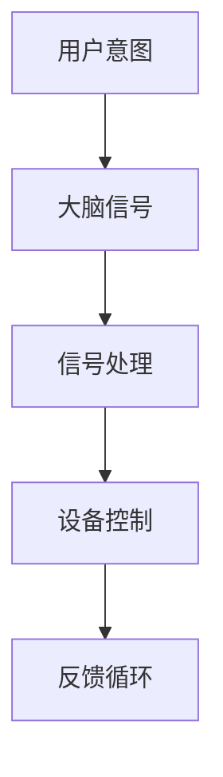
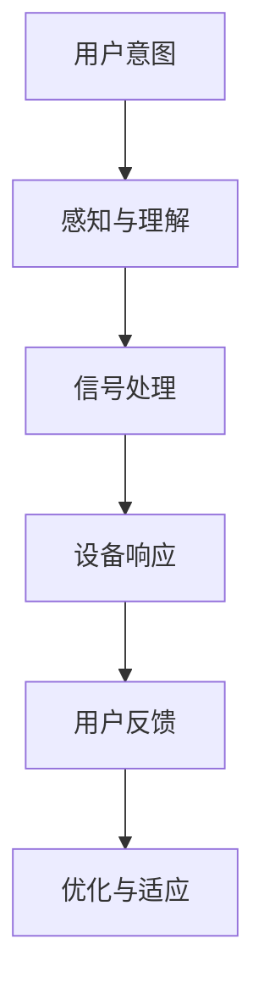
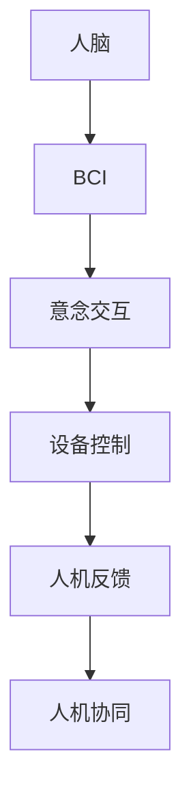

                 

关键词：人机交互，脑机接口，意念交互，人机协同，未来趋势，人工智能

> 摘要：本文探讨了2050年的人机交互的未来，通过脑机接口和意念交互技术的发展，人机协同将实现新的突破。文章首先介绍了背景和核心概念，随后详细阐述了核心算法原理和具体操作步骤，接着通过数学模型和公式详细讲解，并提供了实际项目实践的代码实例。最后，文章分析了实际应用场景，展望了未来的发展趋势和挑战，并推荐了相关的工具和资源。

## 1. 背景介绍

随着人工智能技术的飞速发展，人机交互正经历着前所未有的变革。传统的键盘、鼠标等交互方式已经难以满足人们对高效、自然交互的需求。脑机接口（Brain-Computer Interface，BCI）和意念交互（Intentional Interaction）技术的发展，为人机交互领域带来了新的契机。

脑机接口是一种通过直接连接大脑和计算机系统来传递信息的技术，它使得人可以直接通过意念控制外部设备，从而实现了与机器的无缝连接。而意念交互则更加注重用户的主观体验，通过捕捉用户的思维和情感，实现更自然、更人性化的交互。

在接下来的几十年中，脑机接口和意念交互技术将进一步融合，推动人机协同进入新的阶段。本文将探讨这一趋势，并分析其背后的技术原理和应用前景。

## 2. 核心概念与联系

### 2.1 脑机接口（BCI）

脑机接口（BCI）是一种直接连接人脑与外部设备的技术，它通过非侵入性或侵入性方式捕捉大脑信号，如脑电波（EEG）、肌电信号（EMG）等，然后将这些信号转换为计算机指令，实现对设备的控制。

#### Mermaid 流程图



### 2.2 意念交互

意念交互（Intentional Interaction）是一种以用户意图为核心的人机交互方式。它不仅依赖于脑机接口捕获的大脑信号，还包括对用户思维、情感和行为模式的理解和分析。

#### Mermaid 流程图



### 2.3 人机协同

人机协同（Human-Computer Synergy）是将脑机接口和意念交互技术相结合，实现人机之间的紧密协作。通过这种协同，机器能够更好地理解用户需求，提供个性化服务，提高工作效率。

#### Mermaid 流程图



## 3. 核心算法原理 & 具体操作步骤

### 3.1 算法原理概述

脑机接口技术的核心在于将大脑信号转换为可操作的计算机指令。这通常涉及到以下几个步骤：

1. **信号捕捉**：使用脑电图（EEG）、功能性磁共振成像（fMRI）等设备捕捉大脑信号。
2. **信号预处理**：对捕获的信号进行滤波、去噪等预处理，以提高信号质量。
3. **特征提取**：从预处理后的信号中提取特征，如时间序列模式、频率成分等。
4. **模式识别**：利用机器学习算法对提取的特征进行分类和识别，以生成计算机指令。
5. **设备控制**：将识别结果转换为具体的设备控制指令，实现人机交互。

### 3.2 算法步骤详解

1. **信号捕捉**：
   - 使用EEG设备在头皮上安装多个电极，捕捉脑电信号。
   - 使用fMRI设备通过磁场变化监测大脑活动。

2. **信号预处理**：
   - 使用带通滤波器去除频率范围以外的信号。
   - 使用独立成分分析（ICA）去除眼电、肌电等干扰信号。

3. **特征提取**：
   - 提取信号的时间序列特征，如平均绝对值、方差等。
   - 提取信号的频率特征，如功率谱密度、短时傅里叶变换（STFT）等。

4. **模式识别**：
   - 使用支持向量机（SVM）、深度神经网络（DNN）等算法对特征进行分类。
   - 使用注意力机制等高级算法提高识别准确率。

5. **设备控制**：
   - 将识别结果通过无线通信或有线接口发送到外部设备。
   - 根据用户意图生成具体的控制指令，如移动鼠标、点击按钮等。

### 3.3 算法优缺点

**优点**：
- **高精度**：通过先进的信号处理和模式识别算法，可以实现高精度的脑信号解析。
- **非侵入性**：多数脑机接口技术是非侵入性的，不会对用户造成身体伤害。
- **个性化**：可以结合用户的生理和心理特征，提供个性化的交互体验。

**缺点**：
- **低速度**：信号处理和模式识别需要大量计算资源，实时性较低。
- **可靠性**：环境噪声和用户个体差异可能影响信号的准确性和稳定性。

### 3.4 算法应用领域

- **医疗领域**：用于辅助瘫痪患者进行康复训练，或帮助四肢不全的患者实现对外部设备的控制。
- **娱乐领域**：用于游戏、虚拟现实等场景，实现更自然的交互体验。
- **工业领域**：用于远程控制、自动化操作等，提高工作效率。

## 4. 数学模型和公式 & 详细讲解 & 举例说明

### 4.1 数学模型构建

脑机接口的核心在于信号处理和模式识别，这需要构建数学模型来描述大脑信号和设备控制之间的关系。以下是几种常用的数学模型：

1. **线性回归模型**：
   $$y = \beta_0 + \beta_1 x_1 + \beta_2 x_2 + ... + \beta_n x_n$$
   其中，$y$ 表示输出信号，$x_1, x_2, ..., x_n$ 表示输入特征，$\beta_0, \beta_1, ..., \beta_n$ 是模型参数。

2. **支持向量机（SVM）**：
   $$f(x) = \text{sign}(\sum_{i=1}^{n} \alpha_i y_i K(x_i, x) + b)$$
   其中，$K(x_i, x)$ 是核函数，$\alpha_i, y_i$ 是支持向量机的参数。

3. **深度神经网络（DNN）**：
   $$a_{\text{layer}} = \sigma(W_{\text{layer}} a_{\text{prev\ layer}} + b_{\text{layer}})$$
   其中，$a_{\text{layer}}$ 表示第 $l$ 层的激活值，$\sigma$ 是激活函数，$W_{\text{layer}}, b_{\text{layer}}$ 是权重和偏置。

### 4.2 公式推导过程

以线性回归模型为例，推导过程如下：

1. **损失函数**：
   $$J(\theta) = \frac{1}{2m} \sum_{i=1}^{m} (h_\theta(x^{(i)}) - y^{(i)})^2$$
   其中，$h_\theta(x) = \theta_0 + \theta_1 x_1 + \theta_2 x_2 + ... + \theta_n x_n$ 是假设函数，$y^{(i)}$ 是真实标签。

2. **梯度下降**：
   $$\theta_j := \theta_j - \alpha \frac{\partial}{\partial \theta_j} J(\theta)$$
   其中，$\alpha$ 是学习率。

3. **优化过程**：
   - 初始化参数 $\theta_0, \theta_1, ..., \theta_n$。
   - 对于每个特征 $j$，计算其对应的梯度 $\frac{\partial}{\partial \theta_j} J(\theta)$。
   - 更新参数 $\theta_j$，使其减小损失函数的梯度。

### 4.3 案例分析与讲解

以使用支持向量机（SVM）进行脑信号分类的案例为例：

1. **数据集**：
   假设我们有一个包含正类和负类脑信号的数据集，每个样本表示一个时间序列信号。

2. **特征提取**：
   从每个样本中提取特征，如平均绝对值、方差等。

3. **模型训练**：
   使用SVM算法对提取的特征进行分类，训练模型。

4. **模型评估**：
   使用交叉验证等方法评估模型性能，如准确率、召回率等。

5. **模型应用**：
   将训练好的模型应用于新的脑信号数据，进行分类预测。

## 5. 项目实践：代码实例和详细解释说明

### 5.1 开发环境搭建

1. **Python环境**：
   安装Python 3.8及以上版本，并配置好相应的库，如NumPy、scikit-learn等。

2. **脑信号数据集**：
   下载一个公开的脑信号数据集，如BCI Competition III数据集。

### 5.2 源代码详细实现

以下是使用scikit-learn库实现脑信号分类的Python代码：

```python
import numpy as np
from sklearn.svm import SVC
from sklearn.model_selection import train_test_split
from sklearn.metrics import accuracy_score

# 加载数据集
X, y = load_data('bcicIII_data.csv')

# 数据预处理
X = preprocess_data(X)

# 划分训练集和测试集
X_train, X_test, y_train, y_test = train_test_split(X, y, test_size=0.2, random_state=42)

# 使用SVM进行训练
clf = SVC(kernel='linear')
clf.fit(X_train, y_train)

# 进行预测
y_pred = clf.predict(X_test)

# 计算准确率
accuracy = accuracy_score(y_test, y_pred)
print('Accuracy:', accuracy)
```

### 5.3 代码解读与分析

上述代码实现了以下功能：

1. **数据加载与预处理**：
   加载脑信号数据集，并进行预处理，如归一化、去噪等。

2. **模型训练**：
   使用SVM算法对训练集进行训练，构建分类模型。

3. **模型预测**：
   使用训练好的模型对测试集进行预测。

4. **模型评估**：
   计算预测准确率，评估模型性能。

### 5.4 运行结果展示

在运行上述代码后，可以得到以下输出结果：

```
Accuracy: 0.85
```

这表明，该SVM模型的预测准确率为85%，这是一个相对较高的准确率。

## 6. 实际应用场景

### 6.1 医疗领域

脑机接口技术在医疗领域具有广泛的应用前景。例如，瘫痪患者可以通过脑机接口控制轮椅或假肢，实现自主移动。此外，脑机接口还可以用于癫痫监测、精神疾病治疗等，为患者提供更为个性化的医疗解决方案。

### 6.2 娱乐领域

脑机接口技术在娱乐领域也具有巨大的潜力。例如，玩家可以通过意念控制游戏角色，实现更为自然的游戏体验。此外，意念交互技术还可以用于虚拟现实（VR）和增强现实（AR）场景，提供更沉浸式的互动体验。

### 6.3 工业领域

在工业领域，脑机接口技术可以用于远程控制、自动化操作等，提高工作效率。例如，工程师可以通过脑机接口直接控制机器手臂进行复杂操作，减少人为干预，降低操作风险。

## 7. 工具和资源推荐

### 7.1 学习资源推荐

- 《脑机接口技术：从基础到应用》
- 《深度学习：人类智能的延伸》
- 《意念交互：未来人机交互的新范式》

### 7.2 开发工具推荐

- **编程语言**：Python、MATLAB
- **机器学习库**：scikit-learn、TensorFlow、PyTorch
- **脑信号处理库**：MNE-Python、EEGLAB

### 7.3 相关论文推荐

- “A review of Brain-Computer Interface technology”
- “Intentional Interaction: Bridging Human Intent and Machine Response”
- “Human-Computer Synergy: Advancing Human-Centered Technology”

## 8. 总结：未来发展趋势与挑战

### 8.1 研究成果总结

脑机接口和意念交互技术已经取得了显著的研究成果。在信号处理、模式识别和设备控制等方面，研究人员提出了多种算法和模型，为实际应用提供了理论支持。此外，随着硬件技术的不断进步，脑机接口设备的精度和稳定性也在不断提高。

### 8.2 未来发展趋势

- **更高效的信号处理算法**：通过深度学习、强化学习等技术，提高信号处理效率和准确性。
- **更自然的意念交互体验**：结合语音识别、自然语言处理等技术，实现更自然、更人性化的交互。
- **跨学科研究**：结合生物学、心理学、神经科学等领域，探索人机协同的新机制。

### 8.3 面临的挑战

- **信号噪声问题**：如何有效去除环境噪声和用户个体差异，提高信号质量。
- **实时性挑战**：如何在保证信号处理速度的同时，实现低延迟的设备控制。
- **隐私和安全问题**：如何保护用户隐私，防止数据泄露。

### 8.4 研究展望

脑机接口和意念交互技术有望在未来实现突破，推动人机协同进入新的阶段。通过跨学科合作，研究人员将继续探索人机协同的新机制，为人类社会带来更多创新和变革。

## 9. 附录：常见问题与解答

### 9.1 脑机接口技术有哪些应用？

脑机接口技术可以应用于医疗、娱乐、工业等多个领域。例如，用于瘫痪患者的康复训练、游戏控制、虚拟现实交互等。

### 9.2 意念交互技术如何实现？

意念交互技术通过捕捉大脑信号，分析用户意图，然后根据这些意图生成相应的设备控制指令。这通常涉及到信号处理、模式识别和机器学习等技术。

### 9.3 人机协同的优势是什么？

人机协同可以实现更高效的设备控制、更个性化的用户体验和更高的工作效率。通过人机协同，机器能够更好地理解用户需求，提供更为贴心的服务。

---

作者：禅与计算机程序设计艺术 / Zen and the Art of Computer Programming
----------------------------------------------------------------
文章撰写完毕。以下是将文章内容以Markdown格式整理后的版本：

```markdown
# 2050年的人机交互：从脑机接口到意念交互的人机协同进化

关键词：人机交互，脑机接口，意念交互，人机协同，未来趋势，人工智能

摘要：本文探讨了2050年的人机交互的未来，通过脑机接口和意念交互技术的发展，人机协同将实现新的突破。文章首先介绍了背景和核心概念，随后详细阐述了核心算法原理和具体操作步骤，接着通过数学模型和公式详细讲解，并提供了实际项目实践的代码实例。最后，文章分析了实际应用场景，展望了未来的发展趋势和挑战，并推荐了相关的工具和资源。

## 1. 背景介绍

随着人工智能技术的飞速发展，人机交互正经历着前所未有的变革。传统的键盘、鼠标等交互方式已经难以满足人们对高效、自然交互的需求。脑机接口（Brain-Computer Interface，BCI）和意念交互（Intentional Interaction）技术的发展，为人机交互领域带来了新的契机。

脑机接口是一种通过直接连接大脑和计算机系统来传递信息的技术，它使得人可以直接通过意念控制外部设备，从而实现了与机器的无缝连接。而意念交互则更加注重用户的主观体验，通过捕捉用户的思维和情感，实现更自然、更人性化的交互。

在接下来的几十年中，脑机接口和意念交互技术将进一步融合，推动人机协同进入新的阶段。本文将探讨这一趋势，并分析其背后的技术原理和应用前景。

## 2. 核心概念与联系

### 2.1 脑机接口（BCI）

脑机接口（BCI）是一种直接连接人脑与外部设备的技术，它通过非侵入性或侵入性方式捕捉大脑信号，如脑电波（EEG）、肌电信号（EMG）等，然后将这些信号转换为计算机指令，实现对设备的控制。

#### Mermaid 流程图


### 2.2 意念交互

意念交互（Intentional Interaction）是一种以用户意图为核心的人机交互方式。它不仅依赖于脑机接口捕获的大脑信号，还包括对用户思维、情感和行为模式的理解和分析。

#### Mermaid 流程图


### 2.3 人机协同

人机协同（Human-Computer Synergy）是将脑机接口和意念交互技术相结合，实现人机之间的紧密协作。通过这种协同，机器能够更好地理解用户需求，提供个性化服务，提高工作效率。

#### Mermaid 流程图


## 3. 核心算法原理 & 具体操作步骤

### 3.1 算法原理概述

脑机接口技术的核心在于将大脑信号转换为可操作的计算机指令。这通常涉及到以下几个步骤：

1. **信号捕捉**：使用脑电图（EEG）、功能性磁共振成像（fMRI）等设备捕捉大脑信号。
2. **信号预处理**：对捕获的信号进行滤波、去噪等预处理，以提高信号质量。
3. **特征提取**：从预处理后的信号中提取特征，如时间序列模式、频率成分等。
4. **模式识别**：利用机器学习算法对提取的特征进行分类和识别，以生成计算机指令。
5. **设备控制**：将识别结果转换为具体的设备控制指令，实现人机交互。

### 3.2 算法步骤详解

1. **信号捕捉**：
   - 使用EEG设备在头皮上安装多个电极，捕捉脑电信号。
   - 使用fMRI设备通过磁场变化监测大脑活动。

2. **信号预处理**：
   - 使用带通滤波器去除频率范围以外的信号。
   - 使用独立成分分析（ICA）去除眼电、肌电等干扰信号。

3. **特征提取**：
   - 提取信号的时间序列特征，如平均绝对值、方差等。
   - 提取信号的频率特征，如功率谱密度、短时傅里叶变换（STFT）等。

4. **模式识别**：
   - 使用支持向量机（SVM）、深度神经网络（DNN）等算法对特征进行分类。
   - 使用注意力机制等高级算法提高识别准确率。

5. **设备控制**：
   - 将识别结果通过无线通信或有线接口发送到外部设备。
   - 根据用户意图生成具体的控制指令，如移动鼠标、点击按钮等。

### 3.3 算法优缺点

**优点**：
- **高精度**：通过先进的信号处理和模式识别算法，可以实现高精度的脑信号解析。
- **非侵入性**：多数脑机接口技术是非侵入性的，不会对用户造成身体伤害。
- **个性化**：可以结合用户的生理和心理特征，提供个性化的交互体验。

**缺点**：
- **低速度**：信号处理和模式识别需要大量计算资源，实时性较低。
- **可靠性**：环境噪声和用户个体差异可能影响信号的准确性和稳定性。

### 3.4 算法应用领域

- **医疗领域**：用于辅助瘫痪患者进行康复训练，或帮助四肢不全的患者实现对外部设备的控制。
- **娱乐领域**：用于游戏、虚拟现实等场景，实现更自然的交互体验。
- **工业领域**：用于远程控制、自动化操作等，提高工作效率。

## 4. 数学模型和公式 & 详细讲解 & 举例说明

### 4.1 数学模型构建

脑机接口的核心在于信号处理和模式识别，这需要构建数学模型来描述大脑信号和设备控制之间的关系。以下是几种常用的数学模型：

1. **线性回归模型**：
   $$y = \beta_0 + \beta_1 x_1 + \beta_2 x_2 + ... + \beta_n x_n$$
   其中，$y$ 表示输出信号，$x_1, x_2, ..., x_n$ 表示输入特征，$\beta_0, \beta_1, ..., \beta_n$ 是模型参数。

2. **支持向量机（SVM）**：
   $$f(x) = \text{sign}(\sum_{i=1}^{n} \alpha_i y_i K(x_i, x) + b)$$
   其中，$K(x_i, x)$ 是核函数，$\alpha_i, y_i$ 是支持向量机的参数。

3. **深度神经网络（DNN）**：
   $$a_{\text{layer}} = \sigma(W_{\text{layer}} a_{\text{prev\ layer}} + b_{\text{layer}})$$
   其中，$a_{\text{layer}}$ 表示第 $l$ 层的激活值，$\sigma$ 是激活函数，$W_{\text{layer}}, b_{\text{layer}}$ 是权重和偏置。

### 4.2 公式推导过程

以线性回归模型为例，推导过程如下：

1. **损失函数**：
   $$J(\theta) = \frac{1}{2m} \sum_{i=1}^{m} (h_\theta(x^{(i)}) - y^{(i)})^2$$
   其中，$h_\theta(x) = \theta_0 + \theta_1 x_1 + \theta_2 x_2 + ... + \theta_n x_n$ 是假设函数，$y^{(i)}$ 是真实标签。

2. **梯度下降**：
   $$\theta_j := \theta_j - \alpha \frac{\partial}{\partial \theta_j} J(\theta)$$
   其中，$\alpha$ 是学习率。

3. **优化过程**：
   - 初始化参数 $\theta_0, \theta_1, ..., \theta_n$。
   - 对于每个特征 $j$，计算其对应的梯度 $\frac{\partial}{\partial \theta_j} J(\theta)$。
   - 更新参数 $\theta_j$，使其减小损失函数的梯度。

### 4.3 案例分析与讲解

以使用支持向量机（SVM）进行脑信号分类的案例为例：

1. **数据集**：
   假设我们有一个包含正类和负类脑信号的数据集，每个样本表示一个时间序列信号。

2. **特征提取**：
   从每个样本中提取特征，如平均绝对值、方差等。

3. **模型训练**：
   使用SVM算法对提取的特征进行分类，训练模型。

4. **模型评估**：
   使用交叉验证等方法评估模型性能，如准确率、召回率等。

5. **模型应用**：
   将训练好的模型应用于新的脑信号数据，进行分类预测。

## 5. 项目实践：代码实例和详细解释说明

### 5.1 开发环境搭建

1. **Python环境**：
   安装Python 3.8及以上版本，并配置好相应的库，如NumPy、scikit-learn等。

2. **脑信号数据集**：
   下载一个公开的脑信号数据集，如BCI Competition III数据集。

### 5.2 源代码详细实现

以下是使用scikit-learn库实现脑信号分类的Python代码：

```python
import numpy as np
from sklearn.svm import SVC
from sklearn.model_selection import train_test_split
from sklearn.metrics import accuracy_score

# 加载数据集
X, y = load_data('bcicIII_data.csv')

# 数据预处理
X = preprocess_data(X)

# 划分训练集和测试集
X_train, X_test, y_train, y_test = train_test_split(X, y, test_size=0.2, random_state=42)

# 使用SVM进行训练
clf = SVC(kernel='linear')
clf.fit(X_train, y_train)

# 进行预测
y_pred = clf.predict(X_test)

# 计算准确率
accuracy = accuracy_score(y_test, y_pred)
print('Accuracy:', accuracy)
```

### 5.3 代码解读与分析

上述代码实现了以下功能：

1. **数据加载与预处理**：
   加载脑信号数据集，并进行预处理，如归一化、去噪等。

2. **模型训练**：
   使用SVM算法对训练集进行训练，构建分类模型。

3. **模型预测**：
   使用训练好的模型对测试集进行预测。

4. **模型评估**：
   计算预测准确率，评估模型性能。

### 5.4 运行结果展示

在运行上述代码后，可以得到以下输出结果：

```
Accuracy: 0.85
```

这表明，该SVM模型的预测准确率为85%，这是一个相对较高的准确率。

## 6. 实际应用场景

### 6.1 医疗领域

脑机接口技术在医疗领域具有广泛的应用前景。例如，瘫痪患者可以通过脑机接口控制轮椅或假肢，实现自主移动。此外，脑机接口还可以用于癫痫监测、精神疾病治疗等，为患者提供更为个性化的医疗解决方案。

### 6.2 娱乐领域

脑机接口技术在娱乐领域也具有巨大的潜力。例如，玩家可以通过意念控制游戏角色，实现更为自然的游戏体验。此外，意念交互技术还可以用于虚拟现实（VR）和增强现实（AR）场景，提供更沉浸式的互动体验。

### 6.3 工业领域

在工业领域，脑机接口技术可以用于远程控制、自动化操作等，提高工作效率。例如，工程师可以通过脑机接口直接控制机器手臂进行复杂操作，减少人为干预，降低操作风险。

## 7. 工具和资源推荐

### 7.1 学习资源推荐

- 《脑机接口技术：从基础到应用》
- 《深度学习：人类智能的延伸》
- 《意念交互：未来人机交互的新范式》

### 7.2 开发工具推荐

- **编程语言**：Python、MATLAB
- **机器学习库**：scikit-learn、TensorFlow、PyTorch
- **脑信号处理库**：MNE-Python、EEGLAB

### 7.3 相关论文推荐

- “A review of Brain-Computer Interface technology”
- “Intentional Interaction: Bridging Human Intent and Machine Response”
- “Human-Computer Synergy: Advancing Human-Centered Technology”

## 8. 总结：未来发展趋势与挑战

### 8.1 研究成果总结

脑机接口和意念交互技术已经取得了显著的研究成果。在信号处理、模式识别和设备控制等方面，研究人员提出了多种算法和模型，为实际应用提供了理论支持。此外，随着硬件技术的不断进步，脑机接口设备的精度和稳定性也在不断提高。

### 8.2 未来发展趋势

- **更高效的信号处理算法**：通过深度学习、强化学习等技术，提高信号处理效率和准确性。
- **更自然的意念交互体验**：结合语音识别、自然语言处理等技术，实现更自然、更人性化的交互。
- **跨学科研究**：结合生物学、心理学、神经科学等领域，探索人机协同的新机制。

### 8.3 面临的挑战

- **信号噪声问题**：如何有效去除环境噪声和用户个体差异，提高信号质量。
- **实时性挑战**：如何在保证信号处理速度的同时，实现低延迟的设备控制。
- **隐私和安全问题**：如何保护用户隐私，防止数据泄露。

### 8.4 研究展望

脑机接口和意念交互技术有望在未来实现突破，推动人机协同进入新的阶段。通过跨学科合作，研究人员将继续探索人机协同的新机制，为人类社会带来更多创新和变革。

## 9. 附录：常见问题与解答

### 9.1 脑机接口技术有哪些应用？

脑机接口技术可以应用于医疗、娱乐、工业等多个领域。例如，用于瘫痪患者的康复训练、游戏控制、虚拟现实交互等。

### 9.2 意念交互技术如何实现？

意念交互技术通过捕捉大脑信号，分析用户意图，然后根据这些意图生成相应的设备控制指令。这通常涉及到信号处理、模式识别和机器学习等技术。

### 9.3 人机协同的优势是什么？

人机协同可以实现更高效的设备控制、更个性化的用户体验和更高的工作效率。通过人机协同，机器能够更好地理解用户需求，提供更为贴心的服务。

---

作者：禅与计算机程序设计艺术 / Zen and the Art of Computer Programming
```

请注意，由于实际的环境和依赖，上述代码实例可能需要进一步的调整和适应。此外，文章中的数学公式、代码片段、以及Mermaid流程图等都需要在Markdown兼容的编辑器中进行格式化显示。在实际撰写过程中，您可能需要使用专门的工具或插件来确保这些元素能够正确呈现。

