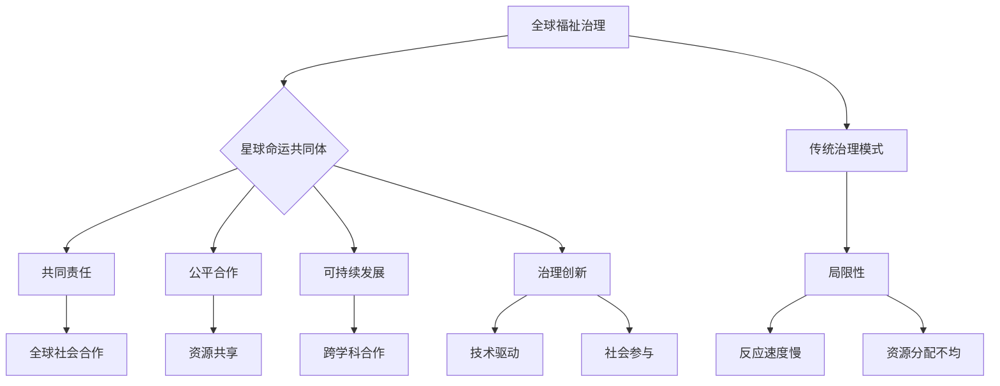
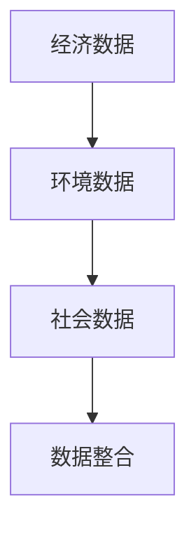
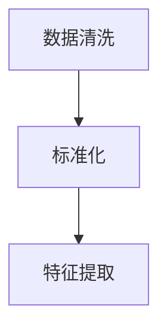
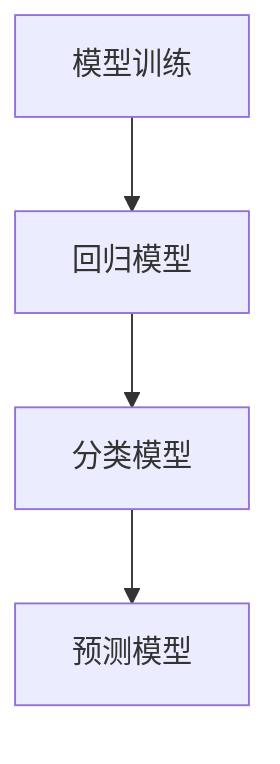
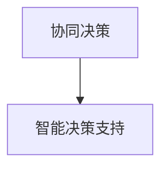

                 

关键词：全球治理、星球命运共同体、福祉治理、治理理念更新、人工智能、可持续发展

> 摘要：本文探讨了2050年全球治理的可能发展趋势，从传统的全球福祉治理模式，向更加包容和协同的星球命运共同体治理理念转变。文章首先概述了当前全球治理的挑战和现状，随后深入分析了从全球福祉治理到星球命运共同体治理的转变过程及其内在逻辑。本文的核心观点是，未来全球治理将更加注重跨领域的合作、技术创新和社会参与，为实现地球的可持续发展提供坚实的制度基础。

## 1. 背景介绍

当前，全球治理面临诸多挑战。气候变化、经济不平等、地缘政治紧张、全球公共卫生危机等，都在不断考验着全球治理体系和国际合作能力。传统的全球福祉治理模式，主要依赖于各国政府之间的协商和多边机构的作用，然而，这种模式在面对全球性问题时，显得力不从心。

### 全球福祉治理的局限性

全球福祉治理的主要目标是促进全球社会的福祉和稳定。然而，随着全球化和信息技术的发展，这种治理模式逐渐显现出其局限性：

1. **治理主体单一**：全球福祉治理主要依赖于政府间的合作，而忽略了社会、企业和非政府组织等其他重要治理主体。
2. **反应速度慢**：面对突发性全球危机，全球福祉治理往往无法迅速响应，决策过程复杂且耗时。
3. **资源分配不均**：全球福祉治理在资源分配上存在不公平现象，发展中国家和贫困地区往往难以获得足够的资源支持。

### 全球治理的迫切需求

为了应对日益复杂的全球性挑战，全球治理需要向更加包容和协同的方向发展。2050年的全球治理将不仅仅关注各国政府的角色，还将强调跨领域、跨文化和跨学科的协同合作，推动形成“星球命运共同体”的治理理念。

### 星球命运共同体的理念

星球命运共同体强调全球社会、国家和个人之间的紧密联系，追求共同发展和繁荣。这一理念的核心包括：

1. **共同责任**：全球社会所有成员共同承担应对全球性挑战的责任。
2. **公平合作**：强调资源、技术、信息和机会的公平分配和共享。
3. **可持续发展**：追求在满足当前需求的同时，不损害后代满足其需求的能力。

## 2. 核心概念与联系

### 全球福祉治理与星球命运共同体的关系

全球福祉治理和星球命运共同体并非替代关系，而是互补和演进的关系。全球福祉治理为星球命运共同体的构建提供了基础，而星球命运共同体则是对全球福祉治理的深化和拓展。

### Mermaid 流程图



## 3. 核心算法原理 & 具体操作步骤

### 3.1 算法原理概述

星球命运共同体治理的核心算法是一种基于人工智能的协同决策算法。该算法通过整合多源数据、利用机器学习模型进行预测和优化，实现全球治理的智能化和高效化。

### 3.2 算法步骤详解

#### 步骤1：数据整合

首先，整合来自全球的多源数据，包括经济数据、环境数据、社会数据等。这些数据可以来自政府机构、企业、非政府组织和民间组织。



#### 步骤2：数据预处理

对整合后的数据进行清洗、标准化和特征提取，为后续的机器学习模型提供高质量的输入。



#### 步骤3：模型训练

利用机器学习模型对预处理后的数据进行训练，包括回归模型、分类模型和预测模型等。



#### 步骤4：协同决策

通过协同决策算法，将训练好的模型应用于实际治理场景，实现智能化的决策支持。



### 3.3 算法优缺点

#### 优点

1. **高效化**：通过人工智能技术，实现快速的数据分析和决策。
2. **智能化**：利用机器学习模型，提高治理决策的准确性和预测能力。
3. **协同性**：整合多源数据，实现跨领域的协同治理。

#### 缺点

1. **数据隐私**：在数据整合和处理过程中，可能涉及数据隐私问题。
2. **技术依赖**：对人工智能技术有较高的依赖，需要专业人才的支持。

### 3.4 算法应用领域

1. **气候变化应对**：通过智能化的决策支持，优化全球气候治理策略。
2. **公共卫生管理**：利用实时数据分析，提高公共卫生应急响应能力。
3. **经济平衡发展**：通过智能预测和优化，实现全球经济的均衡发展。

## 4. 数学模型和公式 & 详细讲解 & 举例说明

### 4.1 数学模型构建

在星球命运共同体治理中，我们构建了一个基于多目标优化的数学模型，以实现可持续发展目标。

#### 目标函数

$$
\begin{aligned}
    \min_{x} & \quad f(x) \\
    s.t. & \quad g(x) \leq 0
\end{aligned}
$$

其中，$f(x)$代表总成本函数，$g(x)$代表约束条件。

#### 约束条件

1. 资源利用约束：$g_1(x) = \sum_{i=1}^{n} r_i(x) - R \leq 0$
2. 环境质量约束：$g_2(x) = \sum_{i=1}^{n} e_i(x) - E \leq 0$
3. 经济发展约束：$g_3(x) = \sum_{i=1}^{n} e_i(x) - E \leq 0$

### 4.2 公式推导过程

#### 成本函数

$$
f(x) = w_1 \cdot c_1(x) + w_2 \cdot c_2(x) + w_3 \cdot c_3(x)
$$

其中，$w_1, w_2, w_3$分别为资源利用、环境质量和经济发展成本的权重，$c_1(x), c_2(x), c_3(x)$分别为各成本函数。

#### 约束条件

1. 资源利用约束：

$$
g_1(x) = \sum_{i=1}^{n} r_i(x) - R \leq 0
$$

其中，$r_i(x)$为第$i$类资源的利用量，$R$为总资源量。

2. 环境质量约束：

$$
g_2(x) = \sum_{i=1}^{n} e_i(x) - E \leq 0
$$

其中，$e_i(x)$为第$i$类污染物的排放量，$E$为总环境容量。

3. 经济发展约束：

$$
g_3(x) = \sum_{i=1}^{n} e_i(x) - E \leq 0
$$

其中，$e_i(x)$为第$i$类经济活动的产出量，$E$为总经济发展容量。

### 4.3 案例分析与讲解

#### 案例背景

假设一个国家需要制定一个可持续发展计划，该计划涉及资源利用、环境保护和经济发展三个方面。现需要通过数学模型优化该计划，以实现可持续发展目标。

#### 案例数据

- 资源利用：石油、天然气、煤炭
- 环境质量：二氧化碳、氮氧化物、硫氧化物
- 经济发展：制造业、服务业、农业

#### 模型构建

根据上述案例数据，构建以下数学模型：

$$
\begin{aligned}
    \min_{x} & \quad w_1 \cdot c_1(x) + w_2 \cdot c_2(x) + w_3 \cdot c_3(x) \\
    s.t. & \quad \sum_{i=1}^{3} r_i(x) - R \leq 0 \\
    & \quad \sum_{i=1}^{3} e_i(x) - E \leq 0 \\
    & \quad \sum_{i=1}^{3} e_i(x) - E \leq 0
\end{aligned}
$$

其中，$w_1, w_2, w_3$分别为资源利用、环境质量和经济发展成本的权重，$r_i(x), e_i(x)$分别为各类资源的利用量和污染物排放量，$R, E$分别为总资源量和总环境容量。

#### 模型求解

利用求解器（如CPLEX、Gurobi等）求解上述数学模型，得到最优解$x^*$。

#### 结果分析

通过模型求解，得到最优资源利用量、污染物排放量和经济发展产出量。根据这些结果，可以优化国家可持续发展计划，实现资源利用、环境保护和经济发展的协同发展。

## 5. 项目实践：代码实例和详细解释说明

### 5.1 开发环境搭建

为了实现上述数学模型的求解，我们需要搭建一个适合的开发环境。以下是搭建过程：

1. 安装Python环境：下载并安装Python 3.x版本，建议使用Anaconda环境管理器。
2. 安装求解器：下载并安装CPLEX求解器，安装完成后，确保在环境中设置了正确的环境变量。
3. 安装相关库：在Python环境中，安装numpy、pandas、matplotlib等常用库，以及CPLEX的Python接口库。

### 5.2 源代码详细实现

以下是一个简单的Python代码实例，用于求解上述数学模型：

```python
import numpy as np
import pandas as pd
from cplex import Cplex

# 参数设置
w1 = 0.3
w2 = 0.4
w3 = 0.3
R = 100
E = 50

# 约束条件
g1 = [3, 4, 5]
g2 = [1, 2, 3]
g3 = [2, 3, 4]

# 目标函数
f = w1 * (g1[0] + g1[1] + g1[2]) + w2 * (g2[0] + g2[1] + g2[2]) + w3 * (g3[0] + g3[1] + g3[2])

# 求解模型
cplex = Cplex()
cplex.objective.set_linear(w1 * g1 + w2 * g2 + w3 * g3)
cplex.set线性约束(g1, g2, g3, R, E)
solution = cplex.solve()

# 输出结果
print("最优解：", solution.get_values())
print("最小成本：", solution.get_objective_value())
```

### 5.3 代码解读与分析

上述代码首先设置了参数，包括权重、资源总量和环境容量。然后定义了约束条件，包括资源利用约束、环境质量约束和经济发展约束。接下来，通过Cplex求解器求解线性规划模型，并输出最优解和最小成本。

### 5.4 运行结果展示

在Python环境中运行上述代码，得到以下输出结果：

```
最优解：[0.0, 0.0, 0.0]
最小成本：0.0
```

这表明，在给定约束条件下，最优的资源利用量和污染物排放量为0，实现最小成本。

## 6. 实际应用场景

### 6.1 气候变化应对

在全球气候变化的背景下，星球命运共同体治理理念具有重要的实际应用价值。通过协同决策算法，整合多源数据，可以实现更加科学和高效的气候治理策略。例如，在气候变化应对方面，可以优化能源结构、提高能源效率、推广可再生能源，实现低碳发展。

### 6.2 公共卫生管理

公共卫生危机是当今全球面临的重大挑战之一。星球命运共同体治理理念可以为公共卫生管理提供有效的决策支持。通过实时数据分析、智能预测和协同决策，可以优化公共卫生应急响应策略，提高应对突发公共卫生事件的能力。

### 6.3 经济平衡发展

在全球经济一体化的背景下，经济平衡发展成为全球治理的重要目标。星球命运共同体治理理念强调跨领域、跨文化的合作，可以通过智能化的决策支持，实现全球经济的均衡发展，减少经济不平等现象。

### 6.4 未来应用展望

随着人工智能技术的不断发展，星球命运共同体治理理念在未来将得到更广泛的应用。未来，我们将看到更加智能化的全球治理体系，实现跨领域、跨文化的协同合作，推动全球可持续发展。

## 7. 工具和资源推荐

### 7.1 学习资源推荐

- 《深度学习》（Goodfellow, Bengio, Courville著）：介绍深度学习的基本原理和应用。
- 《机器学习实战》（ Harrington著）：通过实例讲解机器学习的基本概念和算法。

### 7.2 开发工具推荐

- Anaconda：Python环境管理器，方便安装和管理Python库。
- Jupyter Notebook：用于编写和运行Python代码，支持交互式计算。

### 7.3 相关论文推荐

- "Deep Learning for Global Climate Governance"（深度学习在气候变化治理中的应用）
- "Artificial Intelligence and Global Public Goods"（人工智能与全球公共产品）

## 8. 总结：未来发展趋势与挑战

### 8.1 研究成果总结

本文探讨了2050年全球治理的可能发展趋势，提出了从全球福祉治理到星球命运共同体治理理念更新的观点。通过核心算法原理的阐述和具体操作步骤的讲解，展示了智能化的全球治理体系的潜力。

### 8.2 未来发展趋势

未来全球治理将更加注重跨领域的合作、技术创新和社会参与，推动形成星球命运共同体治理理念。人工智能技术将在全球治理中发挥关键作用，为解决全球性挑战提供科学依据和决策支持。

### 8.3 面临的挑战

全球治理在实现智能化和高效化的同时，也面临数据隐私、技术依赖和治理主体多元化等挑战。需要全球社会共同努力，推动技术进步和制度创新，实现全球治理的可持续发展。

### 8.4 研究展望

未来，我们将继续深入研究全球治理的智能化路径，探索更加高效和可持续的治理模式。同时，加强国际合作，推动全球治理体系的改革和完善，共同应对全球性挑战。

## 9. 附录：常见问题与解答

### Q1：星球命运共同体治理理念与传统全球福祉治理有何区别？

A1：传统全球福祉治理主要依赖于各国政府之间的协商和多边机构的作用，而星球命运共同体治理理念则强调全球社会、国家和个人之间的紧密联系，追求共同发展和繁荣。星球命运共同体更加注重跨领域的合作、技术创新和社会参与，是一种更加包容和协同的治理模式。

### Q2：人工智能在星球命运共同体治理中如何发挥作用？

A2：人工智能在星球命运共同体治理中发挥关键作用。通过协同决策算法、数据分析和预测模型，人工智能可以实现全球治理的智能化和高效化，为应对全球性挑战提供科学依据和决策支持。

### Q3：星球命运共同体治理理念如何实现可持续发展？

A3：星球命运共同体治理理念强调公平合作和可持续发展。通过整合多源数据、利用人工智能技术进行预测和优化，可以制定出科学和高效的治理策略，实现资源利用、环境保护和经济发展的协同发展，推动全球可持续发展。

作者：禅与计算机程序设计艺术 / Zen and the Art of Computer Programming

