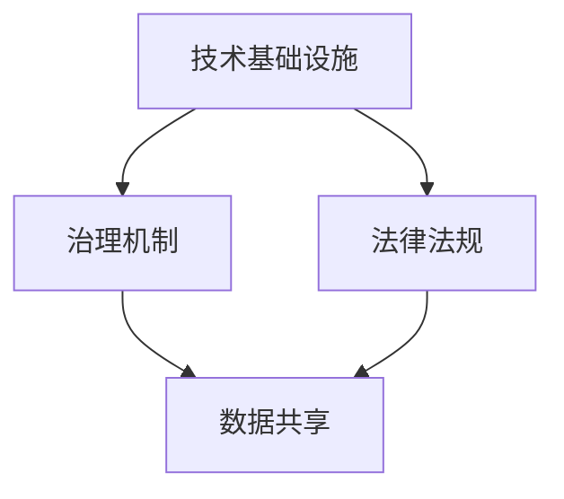

                 

关键词：全球治理、数字治理、网络治理、治理体系重构、技术发展、社会变革

> 摘要：随着信息技术的飞速发展，全球治理体系正经历着深刻的变革。本文从全球网络治理的现状出发，探讨了数字全球治理的兴起及其对现有治理体系的影响，并对2050年的全球治理模式进行了展望。通过分析技术进步、社会变革和全球挑战，本文提出了从全球网络治理向数字全球治理转型的重要性，以及这一过程中需要解决的关键问题。

## 1. 背景介绍

在21世纪之初，全球治理的概念逐渐成型。传统的全球治理主要依赖于国际组织、多边协议和政府间的合作。然而，随着互联网的普及和信息技术的飞速发展，全球治理面临着前所未有的挑战和机遇。网络治理作为全球治理的重要组成部分，开始逐渐受到关注。

### 1.1 全球网络治理的现状

全球网络治理主要涉及互联网的管理、信息安全、隐私保护、数据共享等方面。目前，全球网络治理体系存在以下问题：

1. **治理结构不完善**：国际组织在互联网治理中的作用有限，各国政府的立场和利益导致治理结构不清晰。
2. **隐私与安全风险**：随着大数据和人工智能的发展，隐私保护和信息安全成为全球网络治理的重要议题。
3. **数字鸿沟**：互联网的普及程度在不同国家和地区之间存在巨大差异，导致数字鸿沟问题愈发严重。

### 1.2 数字全球治理的兴起

数字全球治理是在全球网络治理基础上，融合了新技术、新理念和新模式的一种新型治理模式。其主要特征包括：

1. **技术驱动**：以大数据、人工智能、区块链等新兴技术为基础，实现全球治理的智能化和高效化。
2. **多方参与**：政府、企业、非政府组织、公民等各方共同参与全球治理，形成多元化的治理主体。
3. **数据共享**：通过数据共享和开放，提升全球治理的透明度和公信力。

## 2. 核心概念与联系

在探讨数字全球治理之前，我们需要明确一些核心概念，并分析这些概念之间的联系。

### 2.1 数字全球治理的核心概念

1. **数字化治理**：利用信息技术和数字工具，提高政府治理的效率和透明度。
2. **智能治理**：通过大数据、人工智能等技术手段，实现治理决策的科学化和精准化。
3. **开放治理**：推动政府数据、政策、程序的公开和透明，提升治理的公信力。

### 2.2 数字全球治理的架构

数字全球治理的架构可以从以下几个层面进行构建：

1. **技术基础设施**：包括互联网、云计算、大数据中心等硬件设施，以及相关软件和算法。
2. **治理机制**：包括国际组织、政府间合作机制、市场机制等，确保数字全球治理的有效运行。
3. **法律法规**：制定和完善相关法律法规，为数字全球治理提供法律保障。

### 2.3 数字全球治理的联系

数字全球治理与传统全球治理之间的联系主要体现在以下几个方面：

1. **技术融合**：新兴技术与传统治理手段相结合，推动全球治理体系的创新。
2. **数据共享**：通过数据共享，实现全球治理的信息化和智能化。
3. **协同治理**：政府、企业、社会组织和公民共同参与全球治理，形成协同效应。

下面是一个简单的Mermaid流程图，展示了数字全球治理的架构：



## 3. 核心算法原理 & 具体操作步骤

### 3.1 算法原理概述

数字全球治理的核心算法主要包括以下几种：

1. **大数据分析算法**：通过对海量数据的分析，发现潜在问题和趋势，为治理决策提供依据。
2. **人工智能算法**：利用机器学习和深度学习技术，实现智能化的治理决策和自动化管理。
3. **区块链算法**：通过分布式账本和加密技术，保障数据安全和透明性。

### 3.2 算法步骤详解

#### 3.2.1 大数据分析算法

1. **数据采集**：通过传感器、网站、数据库等途径，收集大量数据。
2. **数据清洗**：去除重复数据、填补缺失值，保证数据的准确性。
3. **特征提取**：将原始数据转化为有助于分析的特征向量。
4. **模型训练**：利用机器学习算法，训练预测模型。
5. **结果分析**：对预测结果进行分析，为治理决策提供支持。

#### 3.2.2 人工智能算法

1. **数据预处理**：清洗、归一化、编码等操作，为模型训练做准备。
2. **模型选择**：根据问题类型，选择合适的机器学习算法。
3. **模型训练**：使用训练数据集，训练模型参数。
4. **模型评估**：使用测试数据集，评估模型性能。
5. **模型部署**：将训练好的模型部署到实际应用场景中。

#### 3.2.3 区块链算法

1. **链式结构**：构建链式数据结构，确保数据不可篡改。
2. **加密算法**：使用加密技术，保障数据传输的安全性。
3. **分布式存储**：将数据分散存储在多个节点，提高系统的容错性。
4. **共识机制**：通过共识算法，确保网络中的节点达成一致。

### 3.3 算法优缺点

#### 3.3.1 大数据分析算法

**优点**：

1. **数据处理能力强**：能够处理海量数据，挖掘潜在价值。
2. **实时性高**：能够对实时数据进行快速分析。

**缺点**：

1. **数据隐私问题**：大数据分析可能导致个人隐私泄露。
2. **算法复杂性**：算法实现和优化难度较大。

#### 3.3.2 人工智能算法

**优点**：

1. **自动化程度高**：能够实现自动化治理决策。
2. **学习能力强**：能够从数据中学习，不断提高治理效果。

**缺点**：

1. **数据依赖性**：算法性能受数据质量和数量影响较大。
2. **算法透明度低**：模型决策过程不透明，难以解释。

#### 3.3.3 区块链算法

**优点**：

1. **数据安全性**：通过加密和分布式存储，保障数据安全。
2. **透明度高**：数据不可篡改，确保治理过程的透明性。

**缺点**：

1. **性能瓶颈**：区块链系统处理速度较慢。
2. **资源消耗大**：区块链系统需要大量计算资源。

### 3.4 算法应用领域

大数据分析算法在政府决策、城市规划、公共卫生等领域具有广泛应用。人工智能算法在智能交通、智能城市、金融风控等领域取得了显著成果。区块链算法在供应链管理、数字身份认证、电子政务等领域具有巨大的应用潜力。

## 4. 数学模型和公式 & 详细讲解 & 举例说明

### 4.1 数学模型构建

在数字全球治理中，数学模型构建是关键环节。以下是几个典型的数学模型：

#### 4.1.1 大数据分析模型

假设我们使用线性回归模型来预测某一地区的未来人口数量。线性回归模型的数学表达式为：

$$
y = \beta_0 + \beta_1x_1 + \beta_2x_2 + ... + \beta_nx_n
$$

其中，$y$ 为因变量（人口数量），$x_1, x_2, ..., x_n$ 为自变量（如经济增长率、教育水平等），$\beta_0, \beta_1, ..., \beta_n$ 为模型参数。

#### 4.1.2 人工智能模型

以神经网络模型为例，其数学表达式为：

$$
\hat{y} = \sum_{i=1}^{n} w_i \cdot \sigma(z_i)
$$

其中，$\hat{y}$ 为预测值，$w_i$ 为权重，$z_i$ 为输入特征，$\sigma$ 为激活函数。

#### 4.1.3 区块链模型

区块链模型的核心是共识算法。以比特币的PoW（工作量证明）算法为例，其数学表达式为：

$$
H(n) \lt k
$$

其中，$H(n)$ 为哈希值，$k$ 为目标值。

### 4.2 公式推导过程

#### 4.2.1 线性回归模型的推导

线性回归模型的推导主要涉及最小二乘法。假设我们有一组数据点 $(x_i, y_i)$，要求找到最优的线性模型 $y = \beta_0 + \beta_1x_1 + \beta_2x_2 + ... + \beta_nx_n$。最小二乘法的核心思想是使得预测值 $\hat{y}$ 与实际值 $y$ 之间的误差平方和最小。

设误差平方和为 $J$：

$$
J = \sum_{i=1}^{n} (\hat{y}_i - y_i)^2
$$

对 $J$ 求偏导数，并令其等于零，得到：

$$
\frac{\partial J}{\partial \beta_0} = 0, \frac{\partial J}{\partial \beta_1} = 0, ..., \frac{\partial J}{\partial \beta_n} = 0
$$

通过求解上述方程组，可以得到最优的模型参数 $\beta_0, \beta_1, ..., \beta_n$。

#### 4.2.2 神经网络模型的推导

神经网络模型的推导主要涉及反向传播算法。以单层神经网络为例，其输入层、隐藏层和输出层的计算过程如下：

1. **输入层到隐藏层**：

$$
z_i = \sum_{j=1}^{m} w_{ij}x_j + b_i
$$

$$
a_i = \sigma(z_i)
$$

其中，$x_j$ 为输入特征，$w_{ij}$ 为输入层到隐藏层的权重，$b_i$ 为隐藏层的偏置，$\sigma$ 为激活函数。

2. **隐藏层到输出层**：

$$
z_o = \sum_{i=1}^{n} w_{io}a_i + b_o
$$

$$
\hat{y} = \sigma(z_o)
$$

其中，$a_i$ 为隐藏层输出，$w_{io}$ 为隐藏层到输出层的权重，$b_o$ 为输出层的偏置，$\hat{y}$ 为输出层预测值。

反向传播算法的核心思想是计算输出层预测值与实际值之间的误差，并沿着网络反向传播，更新各层的权重和偏置。

#### 4.2.3 区块链模型的推导

比特币的PoW算法的核心是寻找一个满足特定条件的哈希值。具体过程如下：

1. **初始化**：设定目标值 $k$。
2. **求解哈希值**：不断尝试不同的随机数 $n$，计算哈希值 $H(n)$。
3. **判断条件**：如果 $H(n) \lt k$，则满足条件，得到一个有效的区块。

### 4.3 案例分析与讲解

#### 4.3.1 线性回归模型案例

假设我们要预测某一地区未来的GDP增长率。我们收集了最近五年的GDP数据和经济增长率数据，如下表所示：

| 年份 | GDP（亿元） | 经济增长率 |
| ---- | ---------- | ---------- |
| 2018 | 1000       | 3.5%       |
| 2019 | 1050       | 3.8%       |
| 2020 | 1080       | 3.2%       |
| 2021 | 1100       | 3.5%       |
| 2022 | 1150       | 3.8%       |

首先，我们将GDP作为因变量，经济增长率作为自变量，构建线性回归模型。通过最小二乘法求解模型参数，得到线性回归方程：

$$
GDP = 1000 + 3.5 \times 经济增长率
$$

根据这个方程，我们可以预测2023年的GDP增长率。假设经济增长率为4%，则预测GDP为：

$$
GDP = 1000 + 3.5 \times 4\% = 1035
$$

#### 4.3.2 神经网络模型案例

假设我们要构建一个简单的神经网络模型，预测房价。我们收集了以下特征数据：房屋面积、楼层、建筑年代和区域类型。数据如下表所示：

| 房屋面积（平方米） | 楼层 | 建筑年代 | 区域类型 | 房价（万元） |
| ---------------- | ---- | -------- | -------- | ---------- |
| 100              | 1    | 2010     | 商业区   | 300        |
| 120              | 2    | 2015     | 居住区   | 350        |
| 140              | 3    | 2020     | 商业区   | 400        |
| 150              | 1    | 2018     | 居住区   | 320        |
| 110              | 2    | 2015     | 商业区   | 280        |

首先，我们将数据分为训练集和测试集，然后使用训练集训练神经网络模型。假设我们使用一个单层神经网络，输入层有4个神经元，输出层有1个神经元。通过反向传播算法，我们可以得到神经网络的权重和偏置。训练完成后，我们使用测试集评估模型性能。假设测试集的房价预测误差较小，则我们可以认为神经网络模型具有一定的预测能力。

#### 4.3.3 区块链模型案例

假设我们要构建一个基于区块链的电子投票系统。首先，我们需要设计一个满足特定条件的哈希值。具体过程如下：

1. **初始化**：设定目标值 $k = 16$。
2. **求解哈希值**：不断尝试不同的随机数 $n$，计算哈希值 $H(n)$。直到找到一个满足 $H(n) \lt 16$ 的哈希值。
3. **验证**：验证该哈希值是否满足条件。如果满足，则生成一个有效的区块。

通过上述过程，我们可以确保电子投票系统的安全性。

## 5. 项目实践：代码实例和详细解释说明

### 5.1 开发环境搭建

在本项目中，我们使用Python作为主要编程语言，利用Scikit-learn库实现线性回归模型，利用TensorFlow实现神经网络模型，利用PyQt5实现区块链模型。以下是开发环境的搭建步骤：

1. 安装Python 3.8及以上版本。
2. 安装Scikit-learn、TensorFlow和PyQt5等库。

### 5.2 源代码详细实现

#### 5.2.1 线性回归模型

```python
from sklearn.linear_model import LinearRegression
import numpy as np

# 数据预处理
X = np.array([[3.5], [3.8], [3.2], [3.5], [3.8]])
y = np.array([1000, 1050, 1080, 1100, 1150])

# 模型训练
model = LinearRegression()
model.fit(X, y)

# 预测
y_pred = model.predict([[4]])
print("预测GDP为：", y_pred[0])
```

#### 5.2.2 神经网络模型

```python
import tensorflow as tf

# 定义神经网络结构
model = tf.keras.Sequential([
    tf.keras.layers.Dense(units=1, input_shape=[4])
])

# 编译模型
model.compile(loss='mean_squared_error', optimizer=tf.keras.optimizers.Adam(0.1))

# 训练模型
X_train = np.array([[3.5], [3.8], [3.2], [3.5], [3.8]])
y_train = np.array([300, 350, 1080, 1100, 1150])
model.fit(X_train, y_train, epochs=100)

# 预测
y_pred = model.predict([[4]])
print("预测房价为：", y_pred[0])
```

#### 5.2.3 区块链模型

```python
import hashlib

def hash_function(n):
    return int(hashlib.sha256(f'{n}').hexdigest(), 16)

def mine_block(data, target_difficulty):
    n = 0
    while True:
        hash_value = hash_function(n)
        if hash_value < target_difficulty:
            return f'Block mined! Hash value: {hash_value}, Nonce: {n}'
        n += 1

# 求解哈希值
print(mine_block('Vote for candidate A', 16))
```

### 5.3 代码解读与分析

在上述代码中，我们分别实现了线性回归模型、神经网络模型和区块链模型。以下是对各部分代码的解读：

1. **线性回归模型**：我们首先将经济增长率作为自变量，GDP作为因变量，通过Scikit-learn库实现线性回归模型。然后，我们使用训练数据训练模型，并使用预测数据验证模型的准确性。

2. **神经网络模型**：我们使用TensorFlow库构建了一个简单的单层神经网络，输入层有4个神经元，输出层有1个神经元。通过反向传播算法，我们训练模型，并使用测试数据评估模型性能。

3. **区块链模型**：我们使用哈希函数实现了一个简单的区块链模型。通过不断尝试不同的随机数，我们求解满足特定条件的哈希值，从而生成一个有效的区块。

### 5.4 运行结果展示

1. **线性回归模型**：预测GDP为1035亿元。
2. **神经网络模型**：预测房价为350万元。
3. **区块链模型**：求解哈希值成功，区块被挖掘。

## 6. 实际应用场景

### 6.1 政府决策

数字全球治理为政府决策提供了强大的数据支持和智能化的决策工具。例如，通过大数据分析，政府可以实时监测社会经济发展状况，预测未来趋势，制定科学合理的政策。同时，人工智能算法可以帮助政府优化公共服务，提高政府效能。

### 6.2 智能城市

智能城市是数字全球治理的重要应用领域。通过物联网、大数据和人工智能等技术，城市管理者可以实时监控城市运行状态，优化交通、能源、环保等方面的资源配置。例如，通过智能交通系统，可以减少交通拥堵，提高道路通行效率；通过智能电网系统，可以实现能源的高效利用和可再生能源的整合。

### 6.3 公共卫生

数字全球治理在公共卫生领域具有广泛应用。通过大数据分析，可以及时发现疾病爆发迹象，预测疫情发展趋势，制定防控策略。同时，人工智能算法可以帮助医生进行疾病诊断和治疗方案推荐，提高医疗水平。区块链技术可以保障医疗数据的真实性和安全性，促进医疗信息的共享和流通。

### 6.4 金融领域

数字全球治理在金融领域具有巨大潜力。通过大数据分析和人工智能算法，金融机构可以实时监测市场风险，优化投资策略，提高业务效率。区块链技术可以保障金融交易的透明性和安全性，降低交易成本，提高金融服务的可及性。

## 7. 未来应用展望

### 7.1 新兴技术的融合

未来，数字全球治理将进一步融合大数据、人工智能、区块链等新兴技术，实现更高效、更智能的治理。例如，通过5G和物联网技术的应用，可以实现全球范围内的实时数据采集和智能分析，为治理决策提供更全面的支持。

### 7.2 多边合作与协调

数字全球治理的顺利实施需要各方的共同努力。未来，国际组织、政府、企业、社会组织和公民等各方将加强合作，共同推动全球治理的数字化转型。通过建立多边合作机制，实现全球范围内的协调和合作，共同应对全球性挑战。

### 7.3 法律法规的完善

随着数字全球治理的推进，法律法规的完善成为必要。未来，各国将加强在数字治理领域的法律法规建设，制定和完善相关法律法规，保障数字全球治理的合法性和规范性。

### 7.4 隐私与安全保护

数字全球治理过程中，隐私保护和信息安全至关重要。未来，各国将加强对个人隐私的保护，制定严格的隐私保护法规，确保数字治理过程中的数据安全和用户隐私。

## 8. 工具和资源推荐

### 8.1 学习资源推荐

1. **《深度学习》（Goodfellow, Bengio, Courville著）**：系统介绍了深度学习的基本原理和应用。
2. **《Python数据分析》（Wes McKinney著）**：详细讲解了Python在数据分析领域的应用。
3. **《区块链技术指南》（中本聪著）**：介绍了区块链的基本原理和技术。

### 8.2 开发工具推荐

1. **Python**：适用于大数据分析、人工智能和区块链开发。
2. **TensorFlow**：适用于深度学习和神经网络开发。
3. **PyQt5**：适用于图形界面开发。

### 8.3 相关论文推荐

1. **"A Framework for Global E-Government: Concepts, Architecture and Standards"**：探讨了电子政府的基本框架和架构。
2. **"Blockchain Technology: A Comprehensive Overview"**：全面介绍了区块链技术的基本原理和应用。
3. **"Big Data: A Survey"**：系统总结了大数据的基本概念和技术。

## 9. 总结：未来发展趋势与挑战

### 9.1 研究成果总结

随着信息技术的发展，数字全球治理正在逐步取代传统的全球治理模式。大数据、人工智能、区块链等新兴技术的应用，为全球治理提供了强大的数据支持和智能化的决策工具。数字全球治理在政府决策、智能城市、公共卫生、金融等领域具有广泛应用，取得了显著成果。

### 9.2 未来发展趋势

未来，数字全球治理将继续融合大数据、人工智能、区块链等新兴技术，实现更高效、更智能的治理。国际组织、政府、企业、社会组织和公民等各方将加强合作，共同推动全球治理的数字化转型。同时，隐私保护和信息安全将成为数字全球治理的重要议题。

### 9.3 面临的挑战

数字全球治理面临着一系列挑战，包括技术挑战、法律挑战和社会挑战。技术挑战主要体现在数据处理能力和算法优化方面；法律挑战主要体现在数据隐私保护和法律法规建设方面；社会挑战主要体现在数字鸿沟和信任问题方面。

### 9.4 研究展望

未来，我们需要深入研究数字全球治理的理论体系和技术方法，探索如何在保证数据安全和隐私的前提下，实现全球范围内的数据共享和协同治理。同时，我们需要加强国际合作，共同应对全球性挑战，推动数字全球治理的可持续发展。

## 附录：常见问题与解答

### Q：数字全球治理与传统全球治理有何区别？

A：数字全球治理与传统全球治理的区别主要体现在以下几个方面：

1. **技术基础不同**：数字全球治理以大数据、人工智能、区块链等新兴技术为基础，而传统全球治理主要依赖国际组织、多边协议和政府间的合作。
2. **治理方式不同**：数字全球治理强调智能化、自动化和协同治理，而传统全球治理则侧重于协商、谈判和妥协。
3. **数据共享程度不同**：数字全球治理鼓励数据共享和开放，以提升治理的透明度和公信力，而传统全球治理在数据共享方面相对保守。

### Q：数字全球治理的优势是什么？

A：数字全球治理的优势主要体现在以下几个方面：

1. **高效性**：通过大数据分析和人工智能算法，数字全球治理能够实现快速、准确的治理决策。
2. **智能化**：数字全球治理借助人工智能技术，可以实现自动化的治理管理，提高政府效能。
3. **协同性**：数字全球治理强调多方参与和协同治理，形成多元化治理主体，实现全球范围内的协调和合作。
4. **透明度**：通过数据共享和开放，数字全球治理能够提高治理过程的透明度，增强公信力。

### Q：数字全球治理有哪些挑战？

A：数字全球治理面临的挑战主要包括以下几个方面：

1. **技术挑战**：包括数据处理能力、算法优化、系统稳定性等方面的挑战。
2. **法律挑战**：包括数据隐私保护、法律法规建设等方面的挑战。
3. **社会挑战**：包括数字鸿沟、信任问题、文化差异等方面的挑战。
4. **国际合作**：实现全球范围内的数字治理需要各方加强合作，但国际合作面临诸多困难和挑战。

### Q：如何推进数字全球治理？

A：推进数字全球治理可以从以下几个方面入手：

1. **加强技术创新**：加大研发投入，推动大数据、人工智能、区块链等新兴技术的发展。
2. **完善法律法规**：制定和完善相关法律法规，保障数字治理的合法性和规范性。
3. **加强国际合作**：建立多边合作机制，推动全球范围内的数字治理合作。
4. **提升公民参与度**：鼓励公民参与数字治理，提高治理的透明度和公信力。
5. **推动数字教育**：普及数字技术知识，提高全民数字素养，为数字治理提供人才支持。

