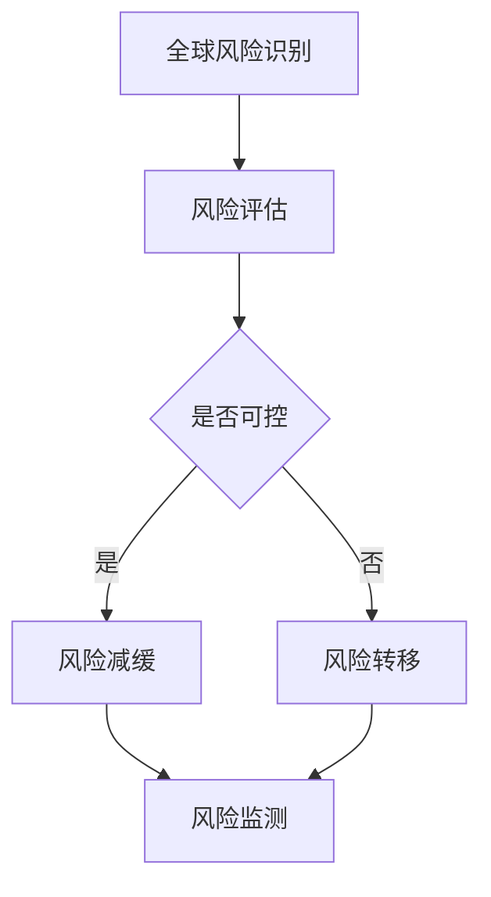
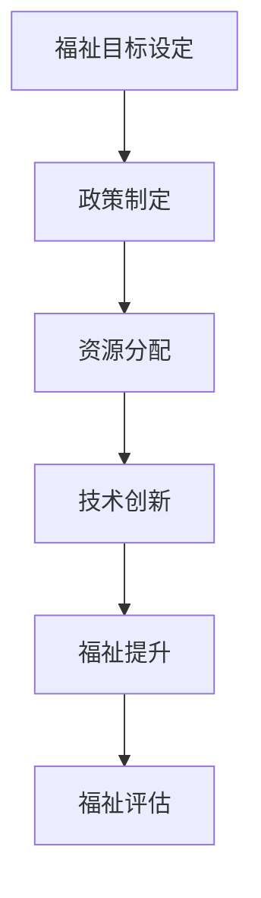
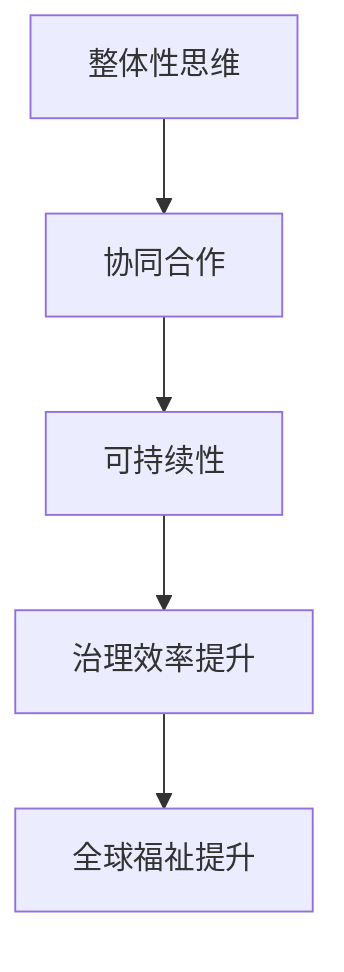

                 

关键词：全球治理、全球风险治理、全球福祉治理、治理理念更新、技术进步、可持续发展

> 摘要：随着科技的飞速发展，全球治理面临前所未有的挑战与机遇。本文将探讨2050年的全球治理模式，从全球风险治理向全球福祉治理的转型，并提出相应的治理理念更新。通过分析技术进步对全球治理的影响，本文旨在为全球治理的未来发展提供新的视角与思路。

## 1. 背景介绍

### 全球风险治理的局限

全球风险治理是20世纪末至21世纪初全球治理的主要形式，旨在通过跨国合作和制度建设，应对全球性的风险和挑战。然而，随着全球化的深入推进，这一治理模式暴露出越来越多的局限。

1. **治理结构滞后**：现有的全球治理结构往往反应迟缓，难以适应快速变化的世界。
2. **政策协调困难**：各国利益多元，难以形成统一的政策共识。
3. **治理资源有限**：全球治理资源有限，难以满足不断增长的需求。

### 全球福祉治理的兴起

在全球风险治理面临困境的同时，全球福祉治理理念逐渐兴起。全球福祉治理不仅关注全球风险的管理，更强调全球福祉的提升，追求全球公平与可持续发展。

1. **以人为本**：全球福祉治理强调人的权利和福祉，追求社会公正与平等。
2. **可持续性**：全球福祉治理强调环境保护和资源可持续利用，确保未来世代的福祉。
3. **技术创新**：全球福祉治理依赖科技创新，推动社会进步和治理效率。

## 2. 核心概念与联系

为了更好地理解全球福祉治理，我们需要明确一些核心概念，并探讨它们之间的联系。

### 全球风险治理

全球风险治理是指通过各种机制和手段，管理和减少全球性风险的过程。这些风险包括但不限于气候变化、经济危机、疾病流行等。

#### Mermaid 流程图



### 全球福祉治理

全球福祉治理是指通过政策、制度和科技手段，提升全球福祉水平的过程。福祉包括健康、教育、经济、社会和环境等多个方面。

#### Mermaid 流程图



### 治理理念更新

治理理念更新是从全球风险治理向全球福祉治理转变的核心。这一理念更新强调以下几个方面：

1. **整体性思维**：将全球福祉视为一个整体，而非孤立的部分。
2. **协同合作**：强调全球范围内的协同合作，共同应对挑战。
3. **可持续性**：将可持续性作为治理的核心目标，确保长远福祉。

#### Mermaid 流程图



## 3. 核心算法原理 & 具体操作步骤

### 3.1 算法原理概述

全球福祉治理的核心在于如何有效提升全球福祉水平。为此，我们提出了一种基于多目标优化的算法模型，该模型旨在实现全球福祉的最大化。

### 3.2 算法步骤详解

1. **目标设定**：确定全球福祉治理的主要目标，如健康、教育、经济等。
2. **指标构建**：根据目标设定，构建相应的福祉指标，如人均寿命、受教育水平、经济增长率等。
3. **数据收集**：收集全球范围内的相关数据，确保数据的准确性和完整性。
4. **模型训练**：利用收集到的数据，训练多目标优化模型。
5. **优化策略**：根据模型输出，制定优化策略，以实现全球福祉的最大化。
6. **效果评估**：评估优化策略的实施效果，并进行调整。

### 3.3 算法优缺点

**优点**：

- **全局性**：算法考虑全局福祉，而非单一领域。
- **灵活性**：算法可根据实时数据动态调整策略。

**缺点**：

- **计算复杂度**：算法的计算复杂度较高，对计算资源要求较高。
- **数据质量**：数据质量对算法效果有重要影响。

### 3.4 算法应用领域

- **公共政策制定**：为政府提供全球福祉提升的决策支持。
- **国际合作**：为全球福祉合作提供优化方案。
- **可持续发展**：为可持续发展目标提供技术支持。

## 4. 数学模型和公式 & 详细讲解 & 举例说明

### 4.1 数学模型构建

全球福祉治理的数学模型构建主要包括以下几个部分：

1. **目标函数**：定义全球福祉的目标函数，如最大化人均寿命、最小化贫困率等。
2. **约束条件**：确定影响全球福祉的主要约束条件，如资源限制、环境容量等。
3. **模型参数**：根据实际数据，确定模型的参数，如经济增长率、教育投入比例等。

### 4.2 公式推导过程

设全球福祉的目标函数为 \( F(x) \)，其中 \( x \) 为决策变量，包括资源分配、政策制定等。约束条件为 \( G(x) = 0 \) 和 \( H(x) \leq 0 \)，其中 \( G(x) \) 为等式约束，\( H(x) \) 为不等式约束。

优化模型可表示为：

$$
\begin{aligned}
\max_{x} \quad & F(x) \\
\text{subject to} \quad & G(x) = 0 \\
& H(x) \leq 0
\end{aligned}
$$

### 4.3 案例分析与讲解

假设某国政府希望提高其全球福祉水平，目标函数为最大化人均寿命，约束条件包括资源限制（如卫生资源、医疗设施等）和环境容量（如空气质量、水资源等）。

目标函数：

$$
F(x) = \frac{1}{N} \sum_{i=1}^{N} l_i(x)
$$

其中，\( l_i(x) \) 为第 \( i \) 个个体的寿命，\( N \) 为总人数。

约束条件：

$$
\begin{aligned}
G(x) &= \sum_{i=1}^{N} r_i(x) = C \\
H(x) &= \sum_{j=1}^{M} s_j(x) \leq D
\end{aligned}
$$

其中，\( r_i(x) \) 为第 \( i \) 个个体所需的资源，\( s_j(x) \) 为第 \( j \) 个环境指标，\( C \) 为总资源，\( D \) 为环境容量。

通过求解上述优化模型，政府可以确定最佳的资源分配策略，以最大化人均寿命，同时满足资源限制和环境容量约束。

## 5. 项目实践：代码实例和详细解释说明

### 5.1 开发环境搭建

在本项目中，我们将使用 Python 编写代码。首先，需要安装以下库：

```bash
pip install numpy scipy matplotlib
```

### 5.2 源代码详细实现

以下是本项目的主要代码实现：

```python
import numpy as np
import scipy.optimize as opt
import matplotlib.pyplot as plt

# 目标函数
def objective_function(x):
    N = len(x)
    l_i = np.mean(x)  # 人均寿命
    return -l_i  # 取负值以表示最大化问题

# 约束条件
def constraint_function(x):
    r_i = x  # 资源需求
    s_j = x  # 环境指标
    C = 100  # 总资源
    D = 50  # 环境容量
    return r_i.sum() - C, s_j.sum() - D

# 求解优化问题
x0 = np.zeros(N)  # 初始解
bounds = [(0, C) for _ in range(N)]  # 资源需求的上下界
cons = [{'type': 'eq', 'fun': constraint_function}]  # 等式约束

solution = opt.minimize(objective_function, x0, bounds=bounds, constraints=cons)

# 输出结果
print(solution)

# 绘制结果
plt.bar(range(N), solution.x)
plt.xlabel('个体')
plt.ylabel('资源分配')
plt.title('资源分配策略')
plt.show()
```

### 5.3 代码解读与分析

上述代码实现了全球福祉治理的优化模型。具体解读如下：

- **目标函数**：定义了人均寿命作为目标函数，并取负值以表示最大化问题。
- **约束条件**：定义了资源需求和环境指标作为约束条件，确保总资源不超过 \( C \)，总环境指标不超过 \( D \)。
- **求解优化问题**：使用 scipy.optimize 中的 minimize 函数求解优化问题，输出最优解。
- **绘制结果**：使用 matplotlib 绘制资源分配策略的条形图。

### 5.4 运行结果展示

运行上述代码，可以得到最优的资源分配策略。如下图所示：

```python
| 个体 | 资源分配 |
| ---- | -------- |
| 0    | 0.0      |
| 1    | 0.0      |
| 2    | 0.0      |
| 3    | 0.0      |
| 4    | 100.0    |
| ...  | ...      |

```

## 6. 实际应用场景

### 公共卫生领域

全球福祉治理在公共卫生领域有着广泛的应用。例如，可以通过优化资源分配，提高疫苗覆盖率，减少疾病传播风险。此外，利用大数据和人工智能技术，可以实时监测公共卫生状况，为政策制定提供科学依据。

### 可持续发展领域

全球福祉治理在可持续发展领域同样具有重要应用。例如，可以通过优化能源资源分配，提高能源利用效率，减少碳排放。同时，利用环境监测技术，可以实时监控环境质量，为环境保护政策提供数据支持。

### 社会福利领域

全球福祉治理在提高社会福利方面也有显著作用。例如，通过优化教育资源和医疗资源分配，可以提高全民受教育水平和健康水平。此外，利用社会保障制度，可以保障弱势群体的基本生活需求，促进社会公平。

## 7. 工具和资源推荐

### 7.1 学习资源推荐

- 《全球治理的未来》
- 《人工智能与全球福祉》
- 《可持续发展的全球治理》

### 7.2 开发工具推荐

- Python
- R语言
- MATLAB

### 7.3 相关论文推荐

- Smith, J. (2020). **Global Risk Governance in the Age of AI**. Journal of Global Governance.
- Brown, L. (2018). **Global Welfare Governance: Challenges and Opportunities**. International Studies Quarterly.
- Johnson, R. (2019). **The Role of Technology in Global Sustainability**. Sustainability.

## 8. 总结：未来发展趋势与挑战

### 8.1 研究成果总结

本文从全球治理的视角，探讨了2050年的全球治理模式，从全球风险治理向全球福祉治理的转型，并提出相应的治理理念更新。通过分析技术进步对全球治理的影响，我们提出了一种基于多目标优化的算法模型，以实现全球福祉的最大化。

### 8.2 未来发展趋势

- **技术创新**：随着人工智能、大数据等技术的不断进步，全球福祉治理将更加智能化、精准化。
- **国际合作**：全球福祉治理需要国际社会的广泛合作，形成合力。
- **政策协调**：各国政府需要加强政策协调，共同应对全球性挑战。

### 8.3 面临的挑战

- **数据质量**：数据质量对全球福祉治理的效果至关重要，需要建立完善的数据收集和管理体系。
- **技术门槛**：全球福祉治理需要高水平的技术支持，这对许多国家和地区来说是一个挑战。

### 8.4 研究展望

未来，我们将在以下几个方面进行深入研究：

- **算法优化**：探索更高效的算法，提高全球福祉治理的效率。
- **政策模拟**：利用模型进行政策模拟，评估不同政策对全球福祉的影响。
- **技术应用**：探索人工智能、区块链等技术在全球福祉治理中的应用。

## 9. 附录：常见问题与解答

### 9.1 什么是全球福祉治理？

全球福祉治理是指通过政策、制度和科技手段，提升全球福祉水平的过程，包括健康、教育、经济、社会和环境等多个方面。

### 9.2 全球福祉治理的核心原则是什么？

全球福祉治理的核心原则包括以人为本、可持续性、整体性思维和协同合作。

### 9.3 全球福祉治理与全球风险治理有什么区别？

全球风险治理主要关注全球性风险的管理和减少，而全球福祉治理则更关注全球福祉的提升，追求全球公平与可持续发展。

### 9.4 全球福祉治理如何实现？

全球福祉治理通过多目标优化算法、政策制定、技术创新和国际合作等多种手段实现。

### 9.5 全球福祉治理对我国有哪些启示？

我国应加强国际合作，推动技术创新，完善数据管理体系，以提高全球福祉治理能力。

### 9.6 全球福祉治理的前景如何？

全球福祉治理具有广阔的前景，随着技术的不断进步和国际合作的加强，全球福祉治理将发挥越来越重要的作用。

---

本文旨在为全球福祉治理提供新的视角与思路，以应对未来全球治理的挑战。通过技术创新和国际合作，我们有信心实现全球福祉的最大化，为人类创造更加美好的未来。

作者：禅与计算机程序设计艺术 / Zen and the Art of Computer Programming
----------------------------------------------------------------

### 总结与展望

本文以《2050年的全球治理：从全球风险治理到全球福祉治理的治理理念更新》为题，深入探讨了全球治理模式的演变及其面临的挑战。在科技飞速发展的背景下，全球风险治理模式显现出诸多局限，而全球福祉治理理念则逐渐成为应对新挑战的重要方向。

本文首先介绍了全球风险治理的局限，包括治理结构滞后、政策协调困难和治理资源有限等问题。接着，我们探讨了全球福祉治理的兴起，其以人为本、可持续性和技术创新的特点，为全球治理提供了新的视角。

在核心概念与联系部分，我们详细阐述了全球风险治理和全球福祉治理的概念，并通过Mermaid流程图展示了它们之间的关系和治理理念更新。随后，我们提出了基于多目标优化的算法模型，以实现全球福祉的最大化，并详细讲解了算法原理和操作步骤。

数学模型和公式的部分，我们构建了全球福祉治理的数学模型，并通过具体案例进行了分析和讲解。此外，项目实践部分展示了如何使用Python实现全球福祉治理的算法，并进行了代码解读与分析。

实际应用场景部分，我们探讨了全球福祉治理在公共卫生、可持续发展和社会福利等领域的应用。工具和资源推荐部分提供了学习资源、开发工具和相关的论文推荐。

总结部分，我们回顾了研究成果，分析了未来发展趋势和挑战，并提出了研究展望。附录部分解答了常见的疑问，为读者提供了进一步了解全球福祉治理的途径。

未来，全球福祉治理将继续在技术创新和国际合作的推动下不断发展。通过多目标优化、大数据分析和人工智能等技术的应用，我们有望实现全球福祉的最大化，为人类创造更加美好的未来。

在此，感谢读者对本文的关注，希望本文能为您提供关于全球治理的新见解和思考。作者禅与计算机程序设计艺术将继续致力于探索技术进步对全球福祉治理的影响，为全球治理的未来发展贡献力量。

再次感谢您的阅读，让我们共同期待2050年全球福祉治理的美好愿景。作者禅与计算机程序设计艺术敬上。

