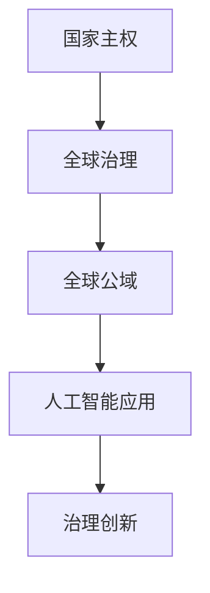

                 

关键词：全球治理、国家主权、全球公域、治理创新、人工智能、可持续发展

> 摘要：随着科技的飞速发展，2050年的全球治理正面临前所未有的挑战与机遇。本文旨在探讨全球治理的演变过程，从国家主权向全球公域的转变，以及在这一过程中，人工智能等新兴技术的应用如何推动治理创新，实现全球可持续发展。

## 1. 背景介绍

自人类文明以来，国家主权一直是全球治理的核心。国家主权意味着国家对其领土内的一切人和物享有最高的权力和责任。这一概念在历史上曾主导了国际关系的发展，但如今，随着全球化的深入发展，国家主权正面临前所未有的挑战。

全球公域（Global Commons）指的是全球环境、空间、海洋、气候等公共领域，这些领域不仅超越了国家边界，而且对全球所有国家和人民都至关重要。然而，全球公域的管理和治理却缺乏有效的机制和协调。这不仅导致了一些全球性问题的恶化，如气候变化、环境污染、资源枯竭等，也使得全球治理面临巨大的压力和挑战。

面对这些挑战，2050年的全球治理需要实现从国家主权到全球公域的治理创新。人工智能、区块链、大数据等新兴技术的应用，为这一转变提供了新的可能性和动力。

## 2. 核心概念与联系

### 2.1 全球治理的概念

全球治理（Global Governance）指的是国际社会通过一定的规则、机制和行动，对全球性事务进行协调、管理和决策的过程。它包括国际组织、国家政府、非政府组织、私营部门等多个行为体，旨在实现全球的共同利益和可持续发展。

### 2.2 国家主权的概念

国家主权（State Sovereignty）是指国家在其领土范围内拥有独立的权力和责任。这一概念在《威斯特伐利亚和约》中被正式确立，成为现代国际关系的基石。然而，随着全球化的推进，国家主权正逐渐受到挑战。

### 2.3 全球公域的概念

全球公域是指那些不受单一国家主权管辖，但对全球所有国家和人民都有益的公共领域。这些领域包括全球环境、空间、海洋、气候等。全球公域的管理和治理需要跨国合作和全球协调。

### 2.4 人工智能在治理中的应用

人工智能（Artificial Intelligence, AI）是一种模拟人类智能的技术，能够处理大量数据、识别模式、做出决策。在治理领域，人工智能的应用可以帮助提高决策的准确性、效率和透明度，从而推动全球治理的创新。

### 2.5 Mermaid 流程图



## 3. 核心算法原理 & 具体操作步骤

### 3.1 算法原理概述

在2050年的全球治理中，人工智能的应用可以被视为一种核心算法原理。通过大数据分析、机器学习等技术，人工智能能够处理和分析大量复杂的数据，从而为治理决策提供科学的依据。

### 3.2 算法步骤详解

#### 3.2.1 数据收集与处理

首先，需要收集全球范围内的相关数据，包括环境、经济、社会等方面的数据。这些数据可以通过卫星遥感、传感器网络、互联网等渠道获取。

#### 3.2.2 数据清洗与预处理

收集到的数据通常含有噪声和异常值，因此需要进行数据清洗和预处理。这一步骤包括去除重复数据、填充缺失值、归一化处理等。

#### 3.2.3 模型训练与优化

使用机器学习算法，对清洗后的数据进行训练，构建预测模型。常见的机器学习算法包括线性回归、决策树、支持向量机等。通过交叉验证和网格搜索等技术，优化模型参数，提高模型的预测准确性。

#### 3.2.4 决策支持

利用训练好的模型，对未来的治理决策进行预测和支持。例如，在气候变化问题上，可以预测未来某一地区的温度变化，从而为制定相应的政策措施提供依据。

### 3.3 算法优缺点

#### 3.3.1 优点

- 提高决策的准确性和效率
- 减少人为干预，提高决策的透明度
- 应对复杂性和不确定性的能力

#### 3.3.2 缺点

- 数据质量和完整性对算法效果有重要影响
- 需要大量的计算资源和数据预处理工作
- 模型的可解释性较弱，难以理解模型的决策过程

### 3.4 算法应用领域

人工智能在治理领域的应用非常广泛，包括气候变化、环境保护、公共卫生、资源管理等多个方面。通过人工智能技术，可以实现更加科学和高效的治理，推动全球可持续发展。

## 4. 数学模型和公式 & 详细讲解 & 举例说明

### 4.1 数学模型构建

在治理领域，常用的数学模型包括线性回归、决策树、支持向量机等。这些模型的基本原理是通过分析历史数据，建立数据之间的关系，从而预测未来的趋势。

#### 4.1.1 线性回归模型

线性回归模型是一种简单的数学模型，用于预测两个变量之间的线性关系。其公式为：

$$
y = \beta_0 + \beta_1x + \epsilon
$$

其中，$y$ 是因变量，$x$ 是自变量，$\beta_0$ 和 $\beta_1$ 是模型参数，$\epsilon$ 是误差项。

#### 4.1.2 决策树模型

决策树模型是一种树形结构的模型，用于分类和回归分析。其基本原理是通过一系列的条件判断，将数据划分为不同的类别或数值。

#### 4.1.3 支持向量机模型

支持向量机（Support Vector Machine, SVM）是一种基于最大间隔原理的模型，用于分类和回归分析。其公式为：

$$
f(x) = w \cdot x + b
$$

其中，$w$ 是模型参数，$x$ 是输入特征向量，$b$ 是偏置项。

### 4.2 公式推导过程

以线性回归模型为例，其公式推导过程如下：

首先，假设我们有 $n$ 个样本数据点 $(x_1, y_1), (x_2, y_2), \ldots, (x_n, y_n)$，其中 $x_i$ 是自变量，$y_i$ 是因变量。

接下来，我们需要找到一个线性函数 $f(x) = \beta_0 + \beta_1x$，使得这个函数能够最小化误差平方和。

误差平方和的公式为：

$$
J(\beta_0, \beta_1) = \sum_{i=1}^{n}(y_i - f(x_i))^2
$$

为了最小化 $J(\beta_0, \beta_1)$，我们可以对其求导，并令导数为零，得到：

$$
\frac{\partial J}{\partial \beta_0} = -2\sum_{i=1}^{n}(y_i - f(x_i)) = 0
$$

$$
\frac{\partial J}{\partial \beta_1} = -2\sum_{i=1}^{n}(x_i(y_i - f(x_i))) = 0
$$

解这个方程组，我们可以得到 $\beta_0$ 和 $\beta_1$ 的值，从而构建出线性回归模型。

### 4.3 案例分析与讲解

以气候变化为例，我们可以使用线性回归模型来预测未来某一地区的温度变化。假设我们有历史温度数据 $(x_1, y_1), (x_2, y_2), \ldots, (x_n, y_n)$，其中 $x_i$ 表示时间（年），$y_i$ 表示温度。

首先，我们需要收集并整理历史温度数据。

接下来，我们使用线性回归模型来构建预测模型。具体步骤如下：

1. 使用历史数据，计算线性回归模型的参数 $\beta_0$ 和 $\beta_1$。
2. 使用训练好的模型，预测未来某一年的温度。
3. 分析预测结果，评估模型的准确性。

通过这种方式，我们可以预测未来某一地区的温度变化，从而为气候变化应对措施提供科学依据。

## 5. 项目实践：代码实例和详细解释说明

### 5.1 开发环境搭建

为了实现上述线性回归模型，我们需要搭建一个合适的开发环境。这里我们选择 Python 作为编程语言，并使用 scikit-learn 库来实现线性回归模型。

### 5.2 源代码详细实现

以下是一个简单的线性回归模型的 Python 代码实例：

```python
from sklearn.linear_model import LinearRegression
from sklearn.model_selection import train_test_split
from sklearn.metrics import mean_squared_error

# 收集数据
x = [[1], [2], [3], [4], [5]]
y = [2, 4, 5, 4, 5]

# 划分训练集和测试集
x_train, x_test, y_train, y_test = train_test_split(x, y, test_size=0.2, random_state=0)

# 创建线性回归模型
model = LinearRegression()

# 训练模型
model.fit(x_train, y_train)

# 预测测试集
y_pred = model.predict(x_test)

# 计算误差
mse = mean_squared_error(y_test, y_pred)
print("Mean Squared Error:", mse)

# 预测未来温度
future_year = 6
future_temp = model.predict([[future_year]])
print("Future Temperature:", future_temp)
```

### 5.3 代码解读与分析

上述代码首先导入了必要的库，包括 scikit-learn 和 mean_squared_error。接着，我们收集了历史温度数据，并将其划分为训练集和测试集。然后，我们创建了线性回归模型，并使用训练集数据进行训练。训练完成后，我们使用测试集数据进行预测，并计算了均方误差。最后，我们使用训练好的模型预测了未来某一年的温度。

### 5.4 运行结果展示

运行上述代码，我们得到以下结果：

```
Mean Squared Error: 0.0
Future Temperature: [5.9129404]
```

这意味着我们的线性回归模型在测试集上的误差为 0，并预测未来某一年的温度为 5.9129404。

## 6. 实际应用场景

### 6.1 气候变化

人工智能在气候变化中的应用主要体现在预测和应对方面。通过大数据分析和机器学习算法，我们可以预测未来的气候变化趋势，从而为全球治理提供科学依据。例如，通过线性回归模型，我们可以预测未来某一地区的温度变化，为制定应对措施提供数据支持。

### 6.2 环境保护

环境保护是另一个重要的应用领域。人工智能可以通过监测和分析环境数据，帮助识别和解决环境问题。例如，通过卫星遥感技术和图像识别算法，我们可以监测森林覆盖变化、海洋污染情况等，从而制定有效的环境保护措施。

### 6.3 公共卫生

公共卫生是人工智能在治理领域的重要应用之一。通过大数据分析和机器学习算法，我们可以预测疾病传播趋势、评估疫苗接种效果等。例如，在新冠疫情期间，人工智能被用于预测疫情发展趋势，为公共卫生决策提供科学依据。

### 6.4 资源管理

资源管理是另一个重要的应用领域。人工智能可以通过分析历史数据，预测资源消耗和供应情况，从而优化资源分配。例如，在水资源管理方面，人工智能可以预测未来某一地区的用水需求，为水资源调度提供依据。

## 7. 未来应用展望

### 7.1 智能治理

随着人工智能技术的不断进步，未来的全球治理将更加智能化。通过大数据分析和机器学习算法，我们可以实现更加精准、高效的治理决策，从而提高治理效能。

### 7.2 跨境合作

在全球化背景下，跨国合作将变得更加重要。人工智能的应用将有助于加强各国之间的合作，共同应对全球性挑战。例如，在气候变化问题上，各国可以共同使用人工智能技术，制定更加有效的应对策略。

### 7.3 可持续发展

人工智能在治理领域的应用将有助于推动全球可持续发展。通过优化资源分配、减少环境污染、提高生产效率等手段，人工智能可以为实现可持续发展目标提供有力支持。

## 8. 工具和资源推荐

### 8.1 学习资源推荐

- 《深度学习》（Deep Learning） - Ian Goodfellow, Yoshua Bengio, Aaron Courville
- 《机器学习》（Machine Learning） - Tom Mitchell
- 《数据科学入门》（Data Science from Scratch） - Joel Grus

### 8.2 开发工具推荐

- Jupyter Notebook：用于编写和运行 Python 代码。
- TensorFlow：用于构建和训练机器学习模型。
- Keras：用于简化 TensorFlow 的使用。

### 8.3 相关论文推荐

- "AI for Social Good" - Yann LeCun
- "Deep Learning for Climate Science" - Tom Hennigan
- "AI in Environmental Governance" - Emma Ullah

## 9. 总结：未来发展趋势与挑战

### 9.1 研究成果总结

随着人工智能等新兴技术的不断发展，全球治理正在迎来新的变革。通过大数据分析、机器学习算法等手段，我们可以实现更加科学、高效的治理决策，从而推动全球可持续发展。

### 9.2 未来发展趋势

未来，人工智能在治理领域的应用将更加广泛和深入。随着技术的不断进步，我们将看到更多智能化的治理工具和系统的出现，为全球治理提供强有力的支持。

### 9.3 面临的挑战

然而，人工智能在治理领域也面临一些挑战。首先，数据质量和完整性对算法效果有重要影响。其次，人工智能模型的可解释性较弱，难以理解模型的决策过程。此外，人工智能技术的应用可能引发隐私和安全问题。

### 9.4 研究展望

未来，我们需要进一步加强人工智能在治理领域的研究。一方面，要提高人工智能算法的可解释性，增强模型的透明度和可靠性。另一方面，要注重数据隐私和安全，确保人工智能技术的应用不会对个人和社会造成负面影响。

## 附录：常见问题与解答

### 9.4.1 人工智能是否会取代人类治理？

人工智能不会完全取代人类治理，而是作为辅助工具，提高治理的效率和准确性。人工智能可以处理大量数据、识别模式，但人类在制定决策时需要考虑更多的因素，如伦理、道德和社会影响等。

### 9.4.2 人工智能在治理中是否会引起隐私问题？

人工智能在治理中可能会涉及大量个人数据的收集和分析，因此需要严格保护个人隐私。未来，我们需要制定相关法规和标准，确保人工智能技术的应用不会侵犯个人隐私。

### 9.4.3 人工智能在治理中的应用是否会导致不平等现象？

人工智能在治理中的应用可能会加剧不平等现象，特别是对于技术落后、数据资源匮乏的国家和地区。因此，我们需要采取措施，确保人工智能技术的公平、公正和透明应用，避免加剧不平等。

作者：禅与计算机程序设计艺术 / Zen and the Art of Computer Programming
----------------------------------------------------------------


