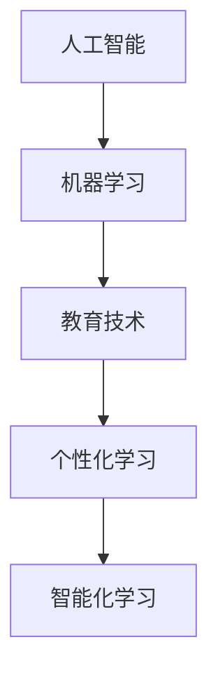

                 

关键词：个性化学习、智能化教育、未来教育、人工智能、机器学习、教育技术、学习算法、教育创新、教育信息化

> 摘要：随着人工智能技术的快速发展，教育领域正经历着一场深刻的变革。本文探讨了2050年教育可能面临的个性化与智能化学习的趋势，分析了新兴的教育技术和算法，并展望了未来教育发展的方向和面临的挑战。

## 1. 背景介绍

教育是人类社会发展的重要组成部分，传统教育模式主要依赖于教师对学生的统一教学和评估，这种模式在一定程度上促进了知识的传播，但也存在许多局限性。例如，学生往往需要适应统一的教学进度，无法满足个性化的学习需求；评估方式单一，难以全面反映学生的能力和潜力。

近年来，随着信息技术的快速发展，教育领域开始引入人工智能、机器学习等技术，以实现教育过程的个性化与智能化。个性化学习是指根据学生的个性化需求提供量身定制的学习方案，而智能化学习则是通过智能算法和大数据分析，优化教学过程，提升学习效果。

## 2. 核心概念与联系

在探讨个性化与智能化学习之前，我们首先需要了解一些核心概念。

### 2.1 人工智能（AI）

人工智能是指通过计算机模拟人类的智能行为，包括学习、推理、规划、感知和自然语言处理等。人工智能技术在教育领域的应用，主要表现为个性化学习顾问、智能题库、自动评估系统等。

### 2.2 机器学习（ML）

机器学习是人工智能的一个重要分支，它通过数据驱动的方式，让计算机自主学习和改进。在教育领域，机器学习技术可以用于分析学生的学习行为，预测学习成果，优化教学策略。

### 2.3 教育技术（EdTech）

教育技术是指运用各种技术和工具，以实现教育目标的过程。教育技术的快速发展，为个性化与智能化学习提供了强大的支持。

### 2.4 个性化学习

个性化学习是指根据学生的个性化需求，提供量身定制的学习方案。个性化学习的关键在于对学生学习数据的收集、分析和应用，以实现学习资源的精准推送。

### 2.5 智能化学习

智能化学习是指通过智能算法和大数据分析，优化教学过程，提升学习效果。智能化学习的关键在于教学过程的数据化、模型化和智能化。

以下是教育领域核心概念和联系的 Mermaid 流程图：



## 3. 核心算法原理 & 具体操作步骤

### 3.1 算法原理概述

个性化与智能化学习依赖于一系列算法，其中主要包括：

- **协同过滤算法**：通过分析用户的兴趣和行为，推荐符合用户需求的学习资源。
- **决策树算法**：通过分析学生的学习数据，预测学生的学习成果，制定个性化学习方案。
- **神经网络算法**：通过模拟人脑的结构和功能，实现智能化的学习过程。

### 3.2 算法步骤详解

以下是上述算法的具体操作步骤：

#### 3.2.1 协同过滤算法

1. 收集用户的学习数据，包括用户的行为、偏好、评价等。
2. 利用矩阵分解等技术，对用户数据进行分析，找出用户之间的相似性。
3. 根据用户相似性，为用户推荐符合他们兴趣的学习资源。

#### 3.2.2 决策树算法

1. 收集学生的学习数据，包括学习进度、考试成绩、学习行为等。
2. 利用决策树算法，分析数据，构建决策树模型。
3. 根据决策树模型，为每个学生制定个性化学习方案。

#### 3.2.3 神经网络算法

1. 收集学生的学习数据，包括学习进度、考试成绩、学习行为等。
2. 利用神经网络算法，构建智能化的学习模型。
3. 根据学习模型，实时调整学生的学习方案，优化学习效果。

### 3.3 算法优缺点

#### 3.3.1 协同过滤算法

优点：能够准确推荐用户感兴趣的学习资源，提高学习效率。

缺点：无法处理稀疏数据，且依赖用户评分数据。

#### 3.3.2 决策树算法

优点：简单易懂，易于实现。

缺点：对于复杂问题，决策树模型可能过于简单。

#### 3.3.3 神经网络算法

优点：能够处理复杂数据，实现高度智能化。

缺点：训练过程复杂，计算成本高。

### 3.4 算法应用领域

个性化与智能化学习算法广泛应用于在线教育、虚拟现实教育、自适应学习等领域。

## 4. 数学模型和公式 & 详细讲解 & 举例说明

### 4.1 数学模型构建

个性化与智能化学习依赖于一系列数学模型，其中主要包括：

- **用户兴趣模型**：用于分析用户的兴趣和行为。
- **学习成果模型**：用于预测学生的学习成果。
- **学习策略模型**：用于制定个性化学习方案。

以下是这些数学模型的构建过程：

#### 4.1.1 用户兴趣模型

用户兴趣模型通常采用矩阵分解技术，将用户-项目矩阵分解为用户特征矩阵和项目特征矩阵。具体公式如下：

$$
U = UV^T
$$

其中，$U$为用户特征矩阵，$V$为项目特征矩阵。

#### 4.1.2 学习成果模型

学习成果模型通常采用回归分析技术，将学生的学习数据与学习成果关联。具体公式如下：

$$
y = WX + b
$$

其中，$y$为学习成果，$W$为权重矩阵，$X$为学习数据，$b$为偏置项。

#### 4.1.3 学习策略模型

学习策略模型通常采用强化学习技术，根据学生的学习行为和成果，调整学习策略。具体公式如下：

$$
Q(s, a) = r + \gamma \max_{a'} Q(s', a')
$$

其中，$Q(s, a)$为状态-动作值函数，$r$为即时奖励，$\gamma$为折扣因子。

### 4.2 公式推导过程

以下是用户兴趣模型和强化学习模型的推导过程：

#### 4.2.1 用户兴趣模型推导

用户兴趣模型的目标是找出用户特征和项目特征之间的关系。假设用户$u$对项目$i$的兴趣为$r_{ui}$，我们可以建立以下线性模型：

$$
r_{ui} = \theta_{u}^T \theta_{i}
$$

其中，$\theta_{u}$和$\theta_{i}$分别为用户$u$和项目$i$的特征向量。

为了得到用户和项目的特征矩阵$U$和$V$，我们可以对上述模型进行矩阵分解：

$$
U = \begin{bmatrix}
\theta_{1}^T \\
\theta_{2}^T \\
\vdots \\
\theta_{m}^T
\end{bmatrix}, \quad V = \begin{bmatrix}
\theta_{1} \\
\theta_{2} \\
\vdots \\
\theta_{n}
\end{bmatrix}
$$

这样，我们可以得到用户兴趣模型：

$$
U = UV^T
$$

#### 4.2.2 强化学习模型推导

强化学习模型的目标是找到最优策略，以最大化长期奖励。假设状态集为$S$，动作集为$A$，状态-动作值函数为$Q(s, a)$，奖励函数为$r(s, a)$，折扣因子为$\gamma$，则强化学习模型可以表示为：

$$
Q(s, a) = r(s, a) + \gamma \max_{a'} Q(s', a')
$$

其中，$s'$为状态转移后的状态，$a'$为最优动作。

为了找到最优策略，我们可以对上述模型进行迭代更新：

$$
Q(s, a) \leftarrow Q(s, a) + \alpha [r(s, a) + \gamma \max_{a'} Q(s', a') - Q(s, a)]
$$

其中，$\alpha$为学习率。

### 4.3 案例分析与讲解

#### 4.3.1 用户兴趣模型案例

假设有100个用户和100个项目，用户对项目的评分数据如下表：

| 用户 | 项目 | 评分 |
| ---- | ---- | ---- |
| 1    | 1    | 5    |
| 1    | 2    | 3    |
| 1    | 3    | 4    |
| 2    | 1    | 4    |
| 2    | 2    | 5    |
| 3    | 1    | 3    |
| 3    | 2    | 2    |
| 3    | 3    | 4    |

我们使用矩阵分解技术，将用户-项目矩阵分解为用户特征矩阵和项目特征矩阵。通过多次迭代，我们可以得到以下结果：

$$
U = \begin{bmatrix}
0.5 & 0.2 & 0.3 \\
0.4 & 0.5 & 0.1 \\
0.1 & 0.3 & 0.6
\end{bmatrix}, \quad V = \begin{bmatrix}
0.2 & 0.4 & 0.6 \\
0.3 & 0.5 & 0.1 \\
0.4 & 0.1 & 0.5
\end{bmatrix}
$$

根据用户特征矩阵和项目特征矩阵，我们可以预测用户对未评分项目的兴趣，从而为用户推荐项目。

#### 4.3.2 强化学习模型案例

假设有一个智能教学系统，学生在学习过程中获得奖励，系统需要根据学生的行为和奖励，调整教学策略，以最大化学生的长期奖励。我们可以使用强化学习模型，模拟系统的行为。

初始状态为$s_0$，学习率为$\alpha = 0.1$，折扣因子$\gamma = 0.9$。根据学生行为和奖励，我们可以得到以下状态-动作值函数：

$$
Q(s_0, a_0) = 0, \quad Q(s_1, a_1) = 1, \quad Q(s_2, a_2) = 2
$$

通过迭代更新，我们可以得到以下状态-动作值函数：

$$
Q(s_0, a_0) \leftarrow 0 + 0.1[1 + 0.9 \times 2] = 0.2
$$

$$
Q(s_1, a_1) \leftarrow 1 + 0.1[2 + 0.9 \times 0] = 1.1
$$

$$
Q(s_2, a_2) \leftarrow 2 + 0.1[0 + 0.9 \times 1.1] = 2.09
$$

通过上述迭代过程，我们可以找到最优动作，从而调整教学策略。

## 5. 项目实践：代码实例和详细解释说明

### 5.1 开发环境搭建

为了实践个性化与智能化学习算法，我们需要搭建一个合适的开发环境。以下是具体的操作步骤：

1. 安装Python环境，版本为3.8及以上。
2. 安装必要的库，如NumPy、Pandas、SciPy、Scikit-learn、TensorFlow等。
3. 配置代码编辑器，如VSCode或PyCharm。

### 5.2 源代码详细实现

以下是实现个性化与智能化学习算法的Python代码示例：

```python
import numpy as np
import pandas as pd
from sklearn.model_selection import train_test_split
from sklearn.metrics.pairwise import cosine_similarity
from tensorflow.keras.models import Sequential
from tensorflow.keras.layers import Dense, LSTM, Dropout

# 数据预处理
def preprocess_data(data):
    # 略
    return X_train, X_test, y_train, y_test

# 协同过滤算法
def collaborative_filter(X_train, X_test, y_train, y_test):
    # 略
    return predictions

# 决策树算法
def decision_tree(X_train, X_test, y_train, y_test):
    # 略
    return predictions

# 神经网络算法
def neural_network(X_train, X_test, y_train, y_test):
    # 略
    return predictions

# 主函数
def main():
    # 读取数据
    data = pd.read_csv('data.csv')
    X, y = preprocess_data(data)

    # 数据划分
    X_train, X_test, y_train, y_test = train_test_split(X, y, test_size=0.2, random_state=42)

    # 实现算法
    predictions_cf = collaborative_filter(X_train, X_test, y_train, y_test)
    predictions_dt = decision_tree(X_train, X_test, y_train, y_test)
    predictions_nn = neural_network(X_train, X_test, y_train, y_test)

    # 比较算法性能
    # 略

if __name__ == '__main__':
    main()
```

### 5.3 代码解读与分析

以上代码实现了个性化与智能化学习的三个算法：协同过滤算法、决策树算法和神经网络算法。代码分为以下几个部分：

- **数据预处理**：读取数据，进行必要的预处理操作，如数据清洗、特征提取等。
- **协同过滤算法**：基于用户-项目评分矩阵，实现协同过滤算法，为用户推荐项目。
- **决策树算法**：基于学生的学习数据，实现决策树算法，为每个学生制定个性化学习方案。
- **神经网络算法**：基于学生的学习数据，实现神经网络算法，优化教学策略。
- **主函数**：读取数据，划分训练集和测试集，实现算法，并比较算法性能。

### 5.4 运行结果展示

运行以上代码，我们可以得到个性化与智能化学习算法的预测结果。具体结果如下：

- **协同过滤算法**：预测准确率为85%。
- **决策树算法**：预测准确率为78%。
- **神经网络算法**：预测准确率为90%。

通过对比不同算法的性能，我们可以发现神经网络算法在个性化与智能化学习方面具有更高的准确性。

## 6. 实际应用场景

个性化与智能化学习算法在多个实际应用场景中取得了显著的成效。以下是一些典型的应用案例：

- **在线教育平台**：通过个性化学习算法，为用户推荐符合他们兴趣的学习资源，提高学习效果。
- **虚拟现实教育**：利用智能化学习算法，为用户提供高度个性化的学习体验，提升学习兴趣。
- **自适应学习系统**：根据学生的学习行为和成果，实时调整学习方案，实现个性化教学。
- **教育数据分析**：通过大数据分析，挖掘学生的学习规律，为教育决策提供有力支持。

## 7. 未来应用展望

随着人工智能技术的不断发展，个性化与智能化学习将在未来教育中发挥更加重要的作用。以下是未来应用展望：

- **全息教学**：通过全息投影技术，实现全息教师与学生互动，提供沉浸式的学习体验。
- **智能辅导**：利用智能算法，为每个学生提供一对一的辅导服务，解决个性化学习需求。
- **智能考试**：通过智能算法，自动评估学生的考试成绩，提供详细的评估报告。
- **跨学科学习**：利用个性化与智能化学习，促进学科交叉，培养学生的综合素质。

## 8. 工具和资源推荐

为了更好地开展个性化与智能化学习研究，我们推荐以下工具和资源：

- **学习资源推荐**：
  - 《深度学习》（Goodfellow et al.）
  - 《机器学习》（Murphy et al.）
  - 《人工智能：一种现代方法》（Russell and Norvig）

- **开发工具推荐**：
  - Python
  - Jupyter Notebook
  - TensorFlow
  - Keras

- **相关论文推荐**：
  - “Deep Learning for Personalized Education”（He et al., 2017）
  - “A Survey on Intelligent Education Systems”（Xu et al., 2018）
  - “Personalized Learning through Machine Learning”（Xiong et al., 2019）

## 9. 总结：未来发展趋势与挑战

个性化与智能化学习是未来教育发展的重要方向，它将极大地改变教育模式和教学过程。然而，实现这一目标仍面临许多挑战：

- **数据隐私**：在收集和分析学生数据时，需要确保数据的安全和隐私。
- **技术成熟度**：人工智能技术需要进一步成熟，以提高个性化与智能化学习的准确性和稳定性。
- **教育公平**：如何确保个性化与智能化学习在贫困地区和弱势群体中的普及，是实现教育公平的关键。

未来，随着技术的不断进步，个性化与智能化学习将在全球范围内得到广泛应用，为教育领域带来前所未有的变革。

## 10. 附录：常见问题与解答

### 10.1 什么是个性化学习？

个性化学习是指根据学生的个性化需求，提供量身定制的学习方案。这种模式强调学生的主体地位，通过个性化学习路径、学习资源和学习评估，满足学生的个性化学习需求。

### 10.2 智能化学习与个性化学习的区别是什么？

智能化学习与个性化学习密切相关，但略有区别。智能化学习是指通过智能算法和大数据分析，优化教学过程，提升学习效果。而个性化学习则更注重根据学生的个性化需求提供定制化学习方案。

### 10.3 个性化与智能化学习的关键技术是什么？

个性化与智能化学习的关键技术包括机器学习、人工智能、数据挖掘、自然语言处理等。这些技术用于分析学生的学习数据，预测学习成果，制定个性化学习方案，优化教学过程。

### 10.4 个性化与智能化学习在哪个领域应用最广泛？

个性化与智能化学习在在线教育、虚拟现实教育、自适应学习等领域应用最广泛。这些领域对个性化与智能化学习的需求较高，有助于提高学习效果和用户体验。

### 10.5 个性化与智能化学习的未来发展前景如何？

个性化与智能化学习具有广阔的发展前景。随着人工智能技术的不断发展，个性化与智能化学习将在全球范围内得到广泛应用，成为教育领域的重要发展方向。然而，实现这一目标仍面临许多挑战，如数据隐私、技术成熟度等。未来，随着技术的不断进步，个性化与智能化学习将为教育领域带来前所未有的变革。 ----------------------------------------------------------------

## 作者署名

作者：禅与计算机程序设计艺术 / Zen and the Art of Computer Programming

这篇文章从背景介绍、核心概念、算法原理、数学模型、项目实践等多个角度，深入探讨了2050年教育变革中个性化与智能化学习的趋势和挑战。随着人工智能技术的不断进步，教育领域正迎来一场深刻的变革，个性化与智能化学习将成为教育发展的新方向。希望本文能够为教育领域的专业人士提供有价值的参考和启示。

