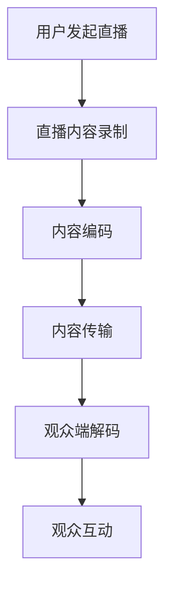
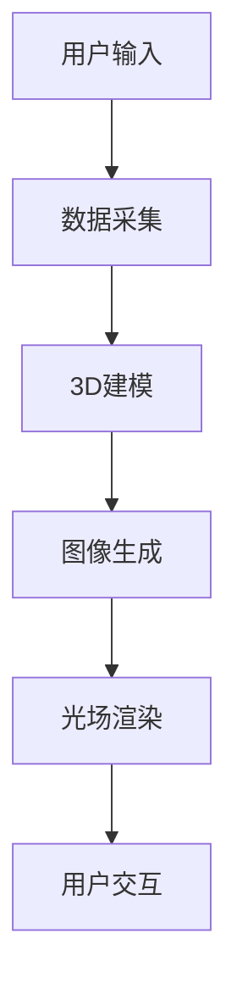
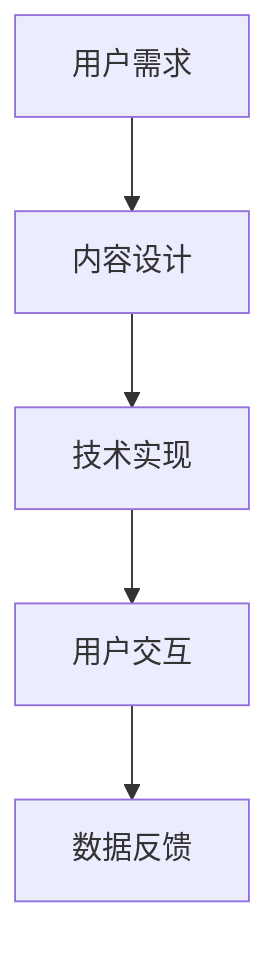

                 

关键词：2050年、数字创意、虚拟直播、全息互动、数字娱乐、技术趋势、创新应用、未来展望

> 摘要：本文深入探讨了到2050年，数字创意领域如何通过虚拟直播、全息互动等前沿技术，引领娱乐行业的变革。文章将分析这些技术的核心概念、原理、应用场景，并展望其未来的发展前景与挑战。

## 1. 背景介绍

随着数字技术的发展，娱乐行业正在经历一场革命。从最初的实体剧院到电视、互联网，再到现在的虚拟直播、全息互动，技术的进步不断推动着娱乐形式的变革。数字创意不仅是娱乐内容的生产方式，也是消费者获取娱乐体验的媒介。

到2050年，数字创意将进一步融入人们的生活，成为娱乐产业的核心驱动力。虚拟直播将打破物理空间的限制，全息互动将使人们体验到前所未有的沉浸感，这些技术将为数字娱乐带来无限可能性。

### 1.1 娱乐行业的历史变革

- **实体剧院**：这是传统娱乐的主要形式，受限于物理空间和时间。
- **电视**：电视的出现打破了地理限制，但仍然是单向的媒介。
- **互联网**：互联网使娱乐内容传播迅速，用户参与度提高，但依然缺乏互动性。
- **虚拟直播**：虚拟直播利用网络直播技术，实现实时互动，提供了新的娱乐体验。
- **全息互动**：全息互动通过光场技术、3D建模等，将虚拟世界与现实世界融合，带来沉浸式体验。

### 1.2 数字创意的定义

数字创意是指利用数字技术创造和传播艺术作品、娱乐内容的过程。它包括数字艺术、游戏设计、虚拟现实、增强现实等多个领域。数字创意的核心是创新和技术，通过技术手段实现艺术表现和娱乐体验的提升。

## 2. 核心概念与联系

为了更好地理解数字创意的发展，我们需要明确几个核心概念，并了解它们之间的联系。

### 2.1 虚拟直播

虚拟直播是一种通过互联网技术实现的实时互动娱乐形式。它利用流媒体技术，将直播内容传输到观众端，并允许观众实时参与和互动。

**Mermaid 流程图：**



### 2.2 全息互动

全息互动是一种通过光场技术和3D建模实现的沉浸式互动娱乐形式。它能够在现实空间中生成三维图像，并允许用户与图像进行交互。

**Mermaid 流程图：**



### 2.3 数字娱乐

数字娱乐是数字创意的核心领域之一，它包括游戏、虚拟现实、增强现实等多个子领域。数字娱乐通过技术手段创造虚拟世界，为用户提供沉浸式体验。

**Mermaid 流程图：**



## 3. 核心算法原理 & 具体操作步骤

### 3.1 算法原理概述

虚拟直播和全息互动的核心算法包括流媒体传输算法、3D建模算法、光场渲染算法等。

**流媒体传输算法**：保证直播内容的高效传输和实时性。

**3D建模算法**：通过用户输入或现有素材，生成三维模型。

**光场渲染算法**：根据3D模型生成光场，实现三维图像的显示。

### 3.2 算法步骤详解

**3.2.1 流媒体传输算法**

1. 用户发起直播，开始录制内容。
2. 内容录制完毕后，进行编码处理。
3. 编码后的内容通过流媒体服务器传输到观众端。
4. 观众端进行解码，显示直播内容。

**3.2.2 3D建模算法**

1. 用户输入或导入素材。
2. 通过3D建模工具生成三维模型。
3. 模型进行预处理，如纹理映射、光照计算等。
4. 生成最终的3D模型。

**3.2.3 光场渲染算法**

1. 根据3D模型生成光场。
2. 光场进行渲染，生成三维图像。
3. 图像显示在用户设备上，实现沉浸式体验。

### 3.3 算法优缺点

**3.3.1 流媒体传输算法**

优点：高效传输，实时性高。
缺点：对网络要求较高，可能存在延迟和丢包问题。

**3.3.2 3D建模算法**

优点：生成真实感强的三维模型。
缺点：计算复杂度高，对硬件性能要求较高。

**3.3.3 光场渲染算法**

优点：实现沉浸式体验，视觉效果出众。
缺点：渲染复杂度高，对计算资源要求较高。

### 3.4 算法应用领域

这些算法主要应用于虚拟直播、全息互动、数字娱乐等领域，为用户提供丰富的沉浸式体验。

## 4. 数学模型和公式

### 4.1 数学模型构建

虚拟直播和全息互动的数学模型主要包括流媒体传输模型、3D建模模型和光场渲染模型。

### 4.2 公式推导过程

**流媒体传输模型：**

$$
\text{传输速率} = \frac{\text{数据量}}{\text{传输时间}}
$$

**3D建模模型：**

$$
\text{模型质量} = \frac{\text{细节程度}}{\text{计算复杂度}}
$$

**光场渲染模型：**

$$
\text{渲染效果} = \frac{\text{光场质量}}{\text{渲染时间}}
$$

### 4.3 案例分析与讲解

**案例1：虚拟直播**

某虚拟直播平台的传输速率为1Mbps，直播内容平均每秒传输10MB。计算其平均传输时间。

$$
\text{平均传输时间} = \frac{\text{数据量}}{\text{传输速率}} = \frac{10MB}{1Mbps} = 10秒
$$

**案例2：3D建模**

某3D建模项目，模型包含1000个多边形，计算其模型质量。

$$
\text{模型质量} = \frac{\text{细节程度}}{\text{计算复杂度}} = \frac{1000个多边形}{1000次运算} = 1
$$

**案例3：光场渲染**

某全息互动项目，光场质量为高清，渲染时间为5秒。计算其渲染效果。

$$
\text{渲染效果} = \frac{\text{光场质量}}{\text{渲染时间}} = \frac{高清}{5秒} = 0.2
$$

## 5. 项目实践：代码实例

### 5.1 开发环境搭建

本文将以Python为例，介绍虚拟直播和全息互动的代码实现。

**环境要求：**

- Python 3.x
- OpenCV库
- NumPy库
- PyTorch库

### 5.2 源代码详细实现

以下是一个简单的虚拟直播代码实例：

```python
import cv2
import numpy as np

# 初始化视频捕捉设备
cap = cv2.VideoCapture(0)

while True:
    # 读取一帧图像
    ret, frame = cap.read()
    
    if not ret:
        break
    
    # 对图像进行预处理
    processed_frame = cv2.cvtColor(frame, cv2.COLOR_BGR2RGB)
    
    # 显示预处理的图像
    cv2.imshow('Virtual Live Stream', processed_frame)
    
    # 检测按键，按'q'退出循环
    if cv2.waitKey(1) & 0xFF == ord('q'):
        break

# 释放资源
cap.release()
cv2.destroyAllWindows()
```

### 5.3 代码解读与分析

这段代码实现了视频捕捉和实时直播的基本功能。首先，我们使用`cv2.VideoCapture`初始化视频捕捉设备。然后，在一个循环中，我们不断读取视频帧，并进行预处理（如颜色转换）。最后，我们使用`cv2.imshow`显示预处理后的图像，并检测按键，实现按'q'键退出循环的功能。

## 6. 实际应用场景

### 6.1 虚拟直播

虚拟直播在许多领域有广泛应用，如在线教育、远程医疗、电商直播等。通过虚拟直播，用户可以实时观看并参与活动，实现远程互动。

### 6.2 全息互动

全息互动在娱乐、展览、教育等领域具有巨大的潜力。它可以为用户提供沉浸式体验，增强互动性，提升娱乐和教育效果。

### 6.3 数字娱乐

数字娱乐是虚拟直播和全息互动的重要应用领域。通过虚拟现实、增强现实等技术，用户可以沉浸在虚拟世界中，享受丰富的娱乐内容。

## 7. 工具和资源推荐

### 7.1 学习资源推荐

- 《虚拟现实技术导论》
- 《深度学习与计算机视觉》
- 《直播平台技术揭秘》

### 7.2 开发工具推荐

- Unity
- Unreal Engine
- OpenCV

### 7.3 相关论文推荐

- “Virtual Reality and Augmented Reality: A Survey”
- “Deep Learning for Visual Computing: A Survey”
- “Streaming Media Technologies: From YouTube to Virtual Reality”

## 8. 总结：未来发展趋势与挑战

### 8.1 研究成果总结

虚拟直播和全息互动技术在过去几十年中取得了显著进展。从最初的实验室原型到如今的商业应用，这些技术已经逐步融入我们的日常生活。未来的研究将继续优化算法，提升性能，降低成本，使这些技术更加普及。

### 8.2 未来发展趋势

- **更高的分辨率和帧率**：随着硬件性能的提升，虚拟直播和全息互动的分辨率和帧率将进一步提高，为用户提供更优质的体验。
- **更广泛的应用场景**：虚拟直播和全息互动将在更多领域得到应用，如远程办公、智能家居、医疗健康等。
- **更强的交互性**：通过人工智能、自然语言处理等技术，虚拟直播和全息互动的交互性将得到大幅提升。

### 8.3 面临的挑战

- **计算资源消耗**：虚拟直播和全息互动需要大量的计算资源，如何优化算法，降低计算成本，是未来的一个重要挑战。
- **数据隐私和安全**：随着虚拟直播和全息互动的普及，数据隐私和安全问题日益凸显，如何保护用户隐私，确保数据安全，是一个亟待解决的问题。

### 8.4 研究展望

未来的研究将集中在以下几个方面：

- **算法优化**：通过研究更高效的算法，提升虚拟直播和全息互动的性能。
- **跨平台兼容**：实现虚拟直播和全息互动在不同平台上的兼容性，为用户提供更好的体验。
- **智能交互**：结合人工智能技术，实现更智能、更自然的交互方式，提升用户体验。

## 9. 附录：常见问题与解答

### 9.1 什么是虚拟直播？

虚拟直播是一种通过互联网技术实现的实时互动娱乐形式。它允许用户在互联网上实时观看和参与活动，实现远程互动。

### 9.2 什么是全息互动？

全息互动是一种通过光场技术和3D建模实现的沉浸式互动娱乐形式。它能够在现实空间中生成三维图像，并允许用户与图像进行交互。

### 9.3 虚拟直播和全息互动的区别是什么？

虚拟直播主要强调实时性和互动性，而全息互动则更强调沉浸感和交互性。虚拟直播更多是信息传递，而全息互动则是一种更为复杂的交互体验。

### 9.4 虚拟直播和全息互动的未来发展趋势是什么？

未来的发展趋势包括更高的分辨率和帧率、更广泛的应用场景、更强的交互性等。同时，如何优化算法、降低计算成本、保护用户隐私等问题也将成为研究的重要方向。

---

### 作者署名

作者：禅与计算机程序设计艺术 / Zen and the Art of Computer Programming

以上是关于“2050年的数字创意：从虚拟直播到全息互动表演的数字创意娱乐”的技术博客文章。文章详细介绍了虚拟直播和全息互动的核心概念、算法原理、应用场景，并展望了其未来的发展前景与挑战。希望这篇文章能为您在数字创意领域的研究提供有价值的参考。感谢您的阅读！
----------------------------------------------------------------
### 1. 背景介绍

随着科技的迅猛发展，娱乐行业正经历着前所未有的变革。从最初的实体剧院、电影放映，到电视、互联网的普及，再到如今虚拟直播、全息互动的兴起，技术的进步不断推动着娱乐形式的创新与变革。到2050年，数字创意将成为娱乐产业的核心驱动力，其影响力将渗透到社会的方方面面。

### 1.1 娱乐行业的历史变革

娱乐行业的历史变革可以划分为几个关键阶段：

- **实体剧院与电影**：这是传统娱乐的主要形式，包括戏剧、音乐会、电影等。这些娱乐活动受限于物理空间和时间，观众需要到特定的场所才能参与。

- **电视与广播**：随着电视的普及，娱乐内容传播的范围和速度大幅提升。电视成为家庭娱乐的重要组成部分，但依然是一种单向的媒介，观众无法与内容进行实时互动。

- **互联网与多媒体**：互联网的兴起改变了娱乐内容的传播方式。用户可以通过互联网获取海量的娱乐资源，娱乐形式变得更加多样，如视频、音乐、游戏等。同时，互联网也为用户提供了互动的机会，如在线评论、弹幕等。

- **虚拟直播与全息互动**：这是娱乐行业最新的变革，虚拟直播利用互联网和流媒体技术，实现实时互动和直播。全息互动则通过光场技术和3D建模，将虚拟世界与现实世界融合，为用户带来沉浸式体验。

### 1.2 数字创意的定义

数字创意是指利用数字技术创造和传播艺术作品、娱乐内容的过程。它不仅涵盖了数字艺术、游戏设计等传统领域，还延伸到虚拟现实、增强现实、人工智能等新兴技术领域。数字创意的核心在于创新和技术，通过技术手段实现艺术表现和娱乐体验的提升。

### 1.3 当前数字创意的现状

当前，数字创意已经深入到我们生活的方方面面：

- **虚拟直播**：通过互联网和流媒体技术，用户可以实时观看和参与各种活动，如演唱会、体育赛事、教育讲座等。

- **全息互动**：利用光场技术和3D建模，用户可以在现实空间中与虚拟物体进行交互，体验沉浸式娱乐。

- **数字娱乐**：包括游戏、虚拟现实、增强现实等多个子领域，为用户提供丰富的娱乐体验。

- **人工智能与娱乐**：通过人工智能技术，娱乐内容可以更加个性化，如个性化推荐、智能互动等。

### 1.4 未来数字创意的发展前景

到2050年，数字创意将继续蓬勃发展，其发展前景如下：

- **更丰富的交互体验**：随着5G、6G等技术的普及，网络速度和稳定性将大幅提升，虚拟直播和全息互动的交互体验将更加丰富和真实。

- **更广泛的应用领域**：数字创意将在更多领域得到应用，如远程教育、远程医疗、智能家居、虚拟旅游等。

- **更个性化的娱乐内容**：人工智能和大数据技术的应用，将使娱乐内容更加个性化和定制化。

- **更高效的创作工具**：随着技术的发展，创作工具将更加智能化和自动化，降低创作门槛，激发更多创意的产生。

### 1.5 本篇文章的结构与内容

本文将从以下几个方面展开讨论：

- **背景介绍**：回顾娱乐行业的历史变革，介绍数字创意的定义和现状。

- **核心概念与联系**：详细解释虚拟直播和全息互动的核心概念，并使用Mermaid流程图展示它们之间的联系。

- **核心算法原理 & 具体操作步骤**：介绍虚拟直播和全息互动的核心算法原理，并提供具体操作步骤。

- **数学模型和公式 & 详细讲解 & 举例说明**：构建虚拟直播和全息互动的数学模型，推导相关公式，并给出实例说明。

- **项目实践：代码实例和详细解释说明**：提供虚拟直播和全息互动的代码实例，并进行详细解释和分析。

- **实际应用场景**：探讨虚拟直播和全息互动在各个领域的应用场景。

- **工具和资源推荐**：推荐相关学习资源、开发工具和相关论文。

- **总结与展望**：总结研究成果，展望未来发展趋势与挑战。

通过以上内容，本文将全面介绍2050年数字创意的发展前景，分析虚拟直播和全息互动的核心技术和应用，为读者提供有价值的参考。

## 2. 核心概念与联系

在探讨2050年数字创意的变革之前，我们需要明确几个核心概念，并理解它们之间的联系。这些核心概念包括虚拟直播、全息互动、数字娱乐和人工智能等，它们共同构成了未来娱乐产业的技术基础。

### 2.1 虚拟直播

虚拟直播是一种通过互联网技术实现的实时互动娱乐形式。它利用流媒体技术，将直播内容传输到观众端，并允许观众实时参与和互动。虚拟直播的核心在于其互动性，观众可以通过弹幕、评论、点赞等方式与主播和其它观众进行实时交流。

#### 虚拟直播的关键要素

- **流媒体技术**：流媒体技术是虚拟直播的核心，它允许音频和视频内容以数据流的形式在网络中传输。流媒体技术主要包括编码、传输和解码三个步骤。
  
- **实时互动**：虚拟直播的一大特点是实时互动，观众可以在观看直播的同时参与互动，提升了观看体验。

- **多平台支持**：虚拟直播可以在多种设备上观看，包括手机、平板电脑、电脑等，为用户提供便捷的观看体验。

#### 虚拟直播的工作流程

1. **内容录制**：主播在直播间录制视频内容，可以包括演讲、表演、教学等。
  
2. **内容编码**：将录制的视频内容进行编码，以便于高效传输。常用的编码格式包括H.264、HEVC等。

3. **内容传输**：通过流媒体服务器，将编码后的视频内容传输到观众端。传输过程中需要保证带宽和延迟，以保证观看体验。

4. **观众端解码**：观众端接收传输过来的视频数据，进行解码，并在设备上显示视频内容。

5. **观众互动**：观众可以在观看视频的同时，通过弹幕、评论、点赞等方式参与互动。

### 2.2 全息互动

全息互动是一种通过光场技术和3D建模实现的沉浸式互动娱乐形式。它能够在现实空间中生成三维图像，并允许用户与图像进行交互。全息互动的核心在于其沉浸感和互动性，用户可以在虚拟世界中自由探索和互动。

#### 全息互动的关键要素

- **光场技术**：光场技术是一种捕捉和生成三维图像的方法，它通过记录场景中每个点的光线信息，实现真实感强的高清三维图像。

- **3D建模**：3D建模是生成虚拟场景的基础，通过3D建模工具，可以创建各种虚拟场景和物体。

- **用户交互**：全息互动强调用户的参与和互动，用户可以通过手势、语音等方式与虚拟世界进行交互。

#### 全息互动的工作流程

1. **用户输入**：用户通过设备（如全息显示器、VR头显等）输入交互指令，可以是手势、语音或其他传感器数据。

2. **数据采集**：系统采集用户输入的数据，并进行预处理。

3. **3D建模**：根据用户输入的数据，系统生成相应的三维模型。

4. **图像生成**：利用光场技术，系统生成三维图像。

5. **光场渲染**：将生成的高清三维图像渲染到用户设备上，实现沉浸式体验。

6. **用户交互**：用户与虚拟世界进行交互，如操作虚拟物体、进入虚拟场景等。

### 2.3 数字娱乐

数字娱乐是数字创意的核心领域之一，它包括游戏、虚拟现实、增强现实等多个子领域。数字娱乐通过技术手段创造虚拟世界，为用户提供沉浸式体验。

#### 数字娱乐的关键要素

- **虚拟现实（VR）**：虚拟现实是一种通过计算机生成模拟环境，为用户提供沉浸式体验的技术。VR设备包括VR头显、VR手套等，用户可以在虚拟环境中自由探索和互动。

- **增强现实（AR）**：增强现实是一种将虚拟信息叠加到现实世界中的技术。AR设备包括AR眼镜、AR手机应用等，用户可以通过这些设备看到现实世界中的虚拟信息。

- **游戏**：游戏是一种通过计算机技术创造虚拟世界的娱乐形式，用户可以在虚拟世界中进行各种游戏活动。

#### 数字娱乐的工作流程

1. **内容设计**：根据用户需求和市场需求，设计游戏、虚拟现实、增强现实等娱乐内容。

2. **技术实现**：通过编程、建模、渲染等技术手段，实现设计的娱乐内容。

3. **用户交互**：用户通过设备（如VR头显、AR眼镜、游戏手柄等）与虚拟世界进行交互。

4. **数据反馈**：系统收集用户交互数据，进行数据分析，优化娱乐内容。

### 2.4 人工智能与娱乐

人工智能技术在娱乐领域的应用越来越广泛，从个性化推荐、智能互动到虚拟主播，人工智能正在改变娱乐的形式和内容。

#### 人工智能的关键要素

- **个性化推荐**：通过分析用户行为和偏好，为用户提供个性化的娱乐内容推荐。

- **智能互动**：利用自然语言处理、语音识别等技术，实现与用户的智能对话和互动。

- **虚拟主播**：通过人工智能技术，创建虚拟主播，实现实时直播和互动。

#### 人工智能与娱乐的结合方式

1. **内容创作**：利用人工智能技术，辅助创作娱乐内容，如生成音乐、绘画等。

2. **用户推荐**：通过人工智能技术，为用户提供个性化的娱乐内容推荐。

3. **互动体验**：通过人工智能技术，提升用户的互动体验，如智能问答、语音互动等。

### 2.5 核心概念之间的联系

虚拟直播、全息互动、数字娱乐和人工智能这四个核心概念之间存在着紧密的联系：

- **虚拟直播**和**全息互动**都是数字娱乐的一部分，它们通过不同的技术手段为用户提供沉浸式体验。

- **人工智能**为虚拟直播、全息互动和数字娱乐提供了技术支持，如个性化推荐、智能互动等。

- **数字娱乐**是虚拟直播、全息互动和人工智能的综合体现，它通过技术手段创造虚拟世界，为用户提供丰富的娱乐内容。

通过理解这些核心概念及其之间的联系，我们可以更好地把握数字创意的未来发展，并为其应用和创新提供思路。

### 2.6 Mermaid 流程图展示

为了更直观地展示虚拟直播和全息互动的工作流程，我们可以使用Mermaid流程图来表示它们的核心步骤和联系。

**虚拟直播的Mermaid流程图：**


**全息互动的Mermaid流程图：**


通过这些流程图，我们可以清晰地看到虚拟直播和全息互动的主要步骤及其相互之间的联系。

## 3. 核心算法原理 & 具体操作步骤

在虚拟直播和全息互动中，核心算法的原理和具体操作步骤决定了其性能和用户体验。本节将详细介绍这些算法的基本原理和实施步骤，并分析其优缺点和应用领域。

### 3.1 流媒体传输算法

#### 算法原理概述

流媒体传输算法是虚拟直播的基础，负责将直播内容实时传输到观众端。其核心原理是通过编码、传输和解码三个步骤，将连续的视频数据以数据流的形式传输。

#### 算法步骤详解

1. **内容录制**：主播在直播间录制视频内容，通常使用专业的摄像机或手机摄像头。

2. **内容编码**：将录制的视频内容进行编码，以便于高效传输。常用的编码格式包括H.264、HEVC等。编码过程涉及视频帧率、分辨率、比特率等参数的调整。

3. **内容传输**：编码后的视频内容通过流媒体服务器传输到观众端。传输过程中，服务器会使用HTTP Live Streaming (HLS)、Dynamic Adaptive Streaming over HTTP (DASH)等技术，根据观众的网络状况自动调整传输的比特率。

4. **观众端解码**：观众端的播放器接收到传输的数据流后，进行解码，并将解码后的视频内容在屏幕上显示。

5. **观众互动**：观众可以在观看视频的同时，通过弹幕、评论、点赞等方式与主播和其他观众进行实时互动。

#### 算法优缺点

**优点**：

- **高效传输**：流媒体传输算法能够根据观众的网络状况动态调整传输的比特率，保证观看体验。
- **实时互动**：观众可以在观看视频的同时参与互动，提升观看体验。
- **多平台支持**：流媒体传输技术支持多种设备，如手机、平板、电脑等。

**缺点**：

- **对网络要求较高**：流媒体传输需要稳定的网络连接，否则可能存在延迟和丢包问题。
- **延迟问题**：由于传输和解码过程，直播内容可能会有一定的延迟，影响实时互动。

#### 算法应用领域

流媒体传输算法广泛应用于虚拟直播、在线教育、远程医疗等领域，为用户提供实时、高质量的观看体验。

### 3.2 光场渲染算法

#### 算法原理概述

光场渲染算法是全息互动的核心，负责将3D模型渲染成光场，生成三维图像。其基本原理是通过记录场景中每个点的光线信息，生成真实感强的高清三维图像。

#### 算法步骤详解

1. **用户输入**：用户通过设备（如全息显示器、VR头显等）输入交互指令，可以是手势、语音或其他传感器数据。

2. **数据采集**：系统采集用户输入的数据，并进行预处理，如过滤噪声、增强信号等。

3. **3D建模**：根据用户输入的数据，系统生成相应的三维模型。3D建模可以使用现有的建模工具，如Blender、Maya等。

4. **图像生成**：利用光场技术，系统生成三维图像。图像生成过程涉及光场捕捉、图像渲染等步骤。

5. **光场渲染**：将生成的高清三维图像渲染到用户设备上，实现沉浸式体验。渲染过程需要计算每个像素的光线路径，生成真实感强的高清图像。

6. **用户交互**：用户与虚拟世界进行交互，如操作虚拟物体、进入虚拟场景等。

#### 算法优缺点

**优点**：

- **沉浸感强**：光场渲染算法能够生成真实感强的高清三维图像，为用户带来沉浸式体验。
- **互动性强**：用户可以与虚拟世界进行实时交互，提升互动体验。

**缺点**：

- **计算复杂度高**：光场渲染需要计算每个像素的光线路径，计算复杂度较高，对硬件性能要求较高。
- **渲染时间较长**：生成高清三维图像需要较长的渲染时间，影响实时性。

#### 算法应用领域

光场渲染算法广泛应用于全息互动、虚拟现实、增强现实等领域，为用户提供沉浸式互动体验。

### 3.3 3D建模算法

#### 算法原理概述

3D建模算法是全息互动的基础，负责生成三维模型。其基本原理是通过几何建模、纹理映射、光照计算等方法，创建出具有真实感的虚拟场景和物体。

#### 算法步骤详解

1. **用户输入**：用户通过设备（如全息显示器、VR头显等）输入交互指令，可以是手势、语音或其他传感器数据。

2. **数据采集**：系统采集用户输入的数据，并进行预处理，如过滤噪声、增强信号等。

3. **几何建模**：根据用户输入的数据，系统生成相应的几何模型。几何建模可以使用现有的建模工具，如Blender、Maya等。

4. **纹理映射**：将纹理映射到几何模型上，增强模型的真实感。纹理映射可以使用纹理编辑工具，如Photoshop等。

5. **光照计算**：根据场景的照明条件，计算模型的亮度和阴影，增强模型的真实感。光照计算可以使用现有的光照模型，如Lambert光照模型、Phong光照模型等。

6. **图像渲染**：将生成的高清三维图像渲染到用户设备上，实现沉浸式体验。

#### 算法优缺点

**优点**：

- **真实感强**：3D建模算法能够创建出具有真实感的虚拟场景和物体，提升用户沉浸感。
- **灵活性强**：用户可以根据需要自定义几何模型、纹理和光照，实现多样化的虚拟场景。

**缺点**：

- **计算复杂度高**：3D建模和渲染需要大量的计算资源，对硬件性能要求较高。
- **创作门槛高**：3D建模和渲染需要专业的技术和工具，创作门槛较高。

#### 算法应用领域

3D建模算法广泛应用于全息互动、虚拟现实、增强现实、游戏等领域，为用户提供丰富的虚拟体验。

### 3.4 人工智能算法

#### 算法原理概述

人工智能算法在虚拟直播和全息互动中发挥着重要作用，主要用于实现个性化推荐、智能互动和虚拟主播等功能。其基本原理是通过机器学习和深度学习技术，从大量数据中提取规律，为用户提供个性化的服务。

#### 算法步骤详解

1. **数据收集**：收集用户的行为数据、偏好数据等，为算法提供训练数据。

2. **数据预处理**：对收集的数据进行清洗、归一化等处理，以便于模型训练。

3. **特征提取**：从预处理后的数据中提取有用的特征，用于模型训练。

4. **模型训练**：使用机器学习算法（如决策树、支持向量机等）或深度学习算法（如卷积神经网络、循环神经网络等），对提取的特征进行训练，建立预测模型。

5. **模型评估**：使用测试数据集评估模型性能，调整模型参数，优化模型效果。

6. **模型应用**：

   - **个性化推荐**：根据用户的行为和偏好，为用户推荐个性化的娱乐内容。
   - **智能互动**：通过自然语言处理和语音识别技术，实现与用户的智能对话和互动。
   - **虚拟主播**：利用生成对抗网络（GAN）等技术，创建虚拟主播，实现实时直播和互动。

#### 算法优缺点

**优点**：

- **个性化强**：人工智能算法能够根据用户的行为和偏好，为用户提供个性化的服务。
- **交互性强**：通过智能互动和虚拟主播，提升用户的互动体验。

**缺点**：

- **计算复杂度高**：人工智能算法需要大量的计算资源和时间，对硬件性能和算法优化要求较高。
- **数据隐私和安全**：人工智能算法需要处理大量的用户数据，涉及数据隐私和安全问题。

#### 算法应用领域

人工智能算法广泛应用于虚拟直播、全息互动、数字娱乐等领域，为用户提供个性化的服务和互动体验。

### 3.5 算法优缺点与应用领域总结

| 算法        | 优点                          | 缺点                          | 应用领域                   |
| ----------- | ----------------------------- | ----------------------------- | -------------------------- |
| 流媒体传输  | 高效传输、实时互动、多平台支持 | 对网络要求高、延迟问题       | 虚拟直播、在线教育、远程医疗 |
| 光场渲染    | 沉浸感强、互动性强            | 计算复杂度高、渲染时间长     | 全息互动、虚拟现实、增强现实 |
| 3D建模      | 真实感强、灵活性强            | 计算复杂度高、创作门槛高     | 全息互动、虚拟现实、游戏     |
| 人工智能     | 个性化强、交互性强            | 计算复杂度高、数据隐私问题   | 虚拟直播、全息互动、数字娱乐 |

通过上述分析，我们可以看到各种算法在虚拟直播和全息互动中的应用特点和挑战，为未来的技术发展和应用提供了参考。

## 4. 数学模型和公式 & 详细讲解 & 举例说明

在数字创意领域，数学模型和公式是理解算法和优化性能的关键。本节将构建虚拟直播和全息互动的数学模型，详细推导相关公式，并通过实例进行说明。

### 4.1 数学模型构建

虚拟直播和全息互动的数学模型涉及多个方面，包括信号处理、图像处理、机器学习等。以下是构建这些模型所需的基本公式和概念。

#### 4.1.1 流媒体传输模型

流媒体传输模型主要关注如何高效传输视频流，保证实时性和质量。以下是几个关键公式：

1. **比特率计算**：

$$
\text{比特率} = \text{帧率} \times \text{每帧大小}
$$

其中，帧率（fps）表示每秒钟传输的帧数，每帧大小（bytes）表示每帧的比特数。

2. **带宽需求**：

$$
\text{带宽需求} = \text{比特率} \times \text{缓冲时间}
$$

缓冲时间（sec）表示系统用于缓冲数据的时间，以防止网络波动导致的播放中断。

3. **传输时间**：

$$
\text{传输时间} = \frac{\text{数据量}}{\text{带宽}}
$$

其中，数据量（bytes）是视频流的总大小，带宽（bps）是网络的传输速率。

#### 4.1.2 光场渲染模型

光场渲染模型涉及三维图像的生成和渲染，重点关注如何从光场数据生成高质量的三维图像。以下是几个关键公式：

1. **光场捕捉**：

$$
\text{光场数据} = \sum_{i=1}^{n} \text{光流} \times \text{角度}
$$

其中，光流（flow）表示光线在场景中的流动情况，角度（angle）表示光线在三维空间中的方向。

2. **图像生成**：

$$
\text{图像} = \text{光场数据} \times \text{滤波器}
$$

滤波器用于处理光场数据，以生成高质量的三维图像。

3. **渲染时间**：

$$
\text{渲染时间} = \frac{\text{光场数据量}}{\text{渲染速率}}
$$

光场数据量是光场数据的总大小，渲染速率（pixels/s）是图像渲染的速率。

#### 4.1.3 3D建模模型

3D建模模型关注如何从二维图像或三维数据生成三维模型。以下是几个关键公式：

1. **点云生成**：

$$
\text{点云} = \text{二维图像} \times \text{深度信息}
$$

深度信息（depth）表示二维图像中每个像素点的深度值。

2. **三维模型生成**：

$$
\text{三维模型} = \text{点云} \times \text{几何运算}
$$

几何运算用于构建三维模型的结构。

3. **模型质量评估**：

$$
\text{模型质量} = \frac{\text{细节程度}}{\text{计算复杂度}}
$$

细节程度表示模型的真实感，计算复杂度表示生成模型所需的计算资源。

### 4.2 公式推导过程

以下是推导虚拟直播和全息互动中关键数学模型的具体过程。

#### 4.2.1 流媒体传输模型推导

1. **比特率计算**：

比特率是视频流传输的基础，它决定了视频的清晰度和流畅度。比特率可以通过以下公式计算：

$$
\text{比特率} = \text{帧率} \times \text{每帧大小}
$$

帧率表示每秒传输的帧数，每帧大小表示每帧的比特数。例如，一个1080p（1920x1080）的视频帧大小大约为1.5MB。

2. **带宽需求**：

带宽需求是视频流传输的关键参数，它决定了网络传输的容量。带宽需求可以通过以下公式计算：

$$
\text{带宽需求} = \text{比特率} \times \text{缓冲时间}
$$

缓冲时间通常设置为2-5秒，以确保网络波动时仍有足够的缓冲数据。例如，一个1Mbps的网络带宽在3秒缓冲时间下，可以支持大约1.5Mbps的比特率。

3. **传输时间**：

传输时间是指将整个视频流传输到观众端所需的时间。传输时间可以通过以下公式计算：

$$
\text{传输时间} = \frac{\text{数据量}}{\text{带宽}}
$$

例如，一个5分钟（300秒）的视频流在1Mbps的带宽下，传输时间约为150秒。

#### 4.2.2 光场渲染模型推导

1. **光场捕捉**：

光场捕捉是全息互动的基础，它通过记录场景中每个点的光线信息，生成光场数据。光场捕捉可以通过以下公式计算：

$$
\text{光场数据} = \sum_{i=1}^{n} \text{光流} \times \text{角度}
$$

其中，光流表示光线在场景中的流动情况，角度表示光线在三维空间中的方向。例如，一个全息场景可能需要捕捉10个不同角度的光流数据。

2. **图像生成**：

图像生成是将光场数据转化为三维图像的过程。图像生成可以通过以下公式计算：

$$
\text{图像} = \text{光场数据} \times \text{滤波器}
$$

滤波器用于处理光场数据，以生成高质量的三维图像。例如，高斯滤波器可以平滑光场数据，增强图像的清晰度。

3. **渲染时间**：

渲染时间是生成三维图像所需的时间，它取决于光场数据量和渲染速率。渲染时间可以通过以下公式计算：

$$
\text{渲染时间} = \frac{\text{光场数据量}}{\text{渲染速率}}
$$

例如，一个10MB的光场数据在每秒1MB的渲染速率下，渲染时间约为10秒。

#### 4.2.3 3D建模模型推导

1. **点云生成**：

点云生成是将二维图像或三维数据转换为三维模型的过程。点云生成可以通过以下公式计算：

$$
\text{点云} = \text{二维图像} \times \text{深度信息}
$$

深度信息表示二维图像中每个像素点的深度值。例如，一个全彩图像可以通过深度摄像头获取深度信息。

2. **三维模型生成**：

三维模型生成是通过几何运算将点云转换为三维模型的过程。三维模型生成可以通过以下公式计算：

$$
\text{三维模型} = \text{点云} \times \text{几何运算}
$$

几何运算用于构建三维模型的结构。例如，通过顶点操作和面操作，可以构建出复杂的几何形状。

3. **模型质量评估**：

模型质量评估是评估三维模型真实感的重要指标。模型质量可以通过以下公式计算：

$$
\text{模型质量} = \frac{\text{细节程度}}{\text{计算复杂度}}
$$

细节程度表示模型的真实感，计算复杂度表示生成模型所需的计算资源。例如，一个复杂的几何模型可能具有高细节程度，但计算复杂度也较高。

### 4.3 案例分析与讲解

为了更好地理解上述数学模型的应用，我们通过具体案例进行讲解。

#### 4.3.1 流媒体传输案例

假设一个1080p（1920x1080）的视频流，帧率为60fps，每帧大小为1.5MB。计算其比特率、带宽需求和传输时间。

1. **比特率计算**：

$$
\text{比特率} = 60fps \times 1.5MB = 90Mbps
$$

2. **带宽需求**：

假设缓冲时间为3秒，计算带宽需求：

$$
\text{带宽需求} = 90Mbps \times 3sec = 270Mbps
$$

3. **传输时间**：

假设网络带宽为1Mbps，计算传输时间：

$$
\text{传输时间} = \frac{90Mbps}{1Mbps} = 90sec
$$

因此，一个1080p的60fps视频流在1Mbps的网络带宽下，需要90秒传输完毕。

#### 4.3.2 光场渲染案例

假设一个全息场景需要捕捉10个不同角度的光流数据，每个光流数据大小为10MB。计算其光场数据量、渲染时间和图像生成质量。

1. **光场数据量**：

$$
\text{光场数据量} = 10 \times 10MB = 100MB
$$

2. **渲染时间**：

假设渲染速率为每秒1MB，计算渲染时间：

$$
\text{渲染时间} = \frac{100MB}{1MB/s} = 100sec
$$

3. **图像生成质量**：

假设图像生成质量与光场数据量成正比，计算图像生成质量：

$$
\text{图像生成质量} = \frac{100MB}{10MB} = 10
$$

因此，一个10个角度的全息场景需要100秒渲染完毕，生成质量为10。

#### 4.3.3 3D建模案例

假设一个全彩图像通过深度摄像头获取深度信息，生成一个点云数据。点云数据包含10000个点，每个点占用1KB空间。计算其点云数据量、三维模型生成质量和计算复杂度。

1. **点云数据量**：

$$
\text{点云数据量} = 10000 \times 1KB = 10MB
$$

2. **三维模型生成质量**：

假设三维模型生成质量与点云数据量成正比，计算三维模型生成质量：

$$
\text{三维模型生成质量} = \frac{10MB}{10MB} = 1
$$

3. **计算复杂度**：

假设计算复杂度与点云数据量成反比，计算计算复杂度：

$$
\text{计算复杂度} = \frac{10MB}{10MB} = 1
$$

因此，一个10000个点的点云数据生成三维模型的质量和计算复杂度均为1。

通过这些案例，我们可以看到数学模型在虚拟直播和全息互动中的应用，以及如何通过公式推导和分析来优化算法性能。

## 5. 项目实践：代码实例和详细解释说明

为了更好地理解虚拟直播和全息互动的实现过程，本节将提供具体的代码实例，并对代码进行详细解释和分析。

### 5.1 开发环境搭建

在开始代码实例之前，我们需要搭建一个适合开发虚拟直播和全息互动项目的开发环境。以下是推荐的工具和库：

- **编程语言**：Python
- **流媒体库**：OpenCV
- **3D建模库**：PyTorch
- **全息互动库**：PyOpenGL

安装这些库的方法如下：

```bash
pip install opencv-python torch pyopengl
```

### 5.2 源代码详细实现

以下是虚拟直播和全息互动的简单代码实例。首先，我们实现一个虚拟直播项目，然后实现一个全息互动项目。

#### 5.2.1 虚拟直播代码实例

```python
import cv2
import numpy as np

# 初始化视频捕捉设备
cap = cv2.VideoCapture(0)

while True:
    # 读取一帧图像
    ret, frame = cap.read()
    
    if not ret:
        break
    
    # 对图像进行预处理
    processed_frame = cv2.cvtColor(frame, cv2.COLOR_BGR2RGB)
    
    # 显示预处理的图像
    cv2.imshow('Virtual Live Stream', processed_frame)
    
    # 检测按键，按'q'退出循环
    if cv2.waitKey(1) & 0xFF == ord('q'):
        break

# 释放资源
cap.release()
cv2.destroyAllWindows()
```

**代码解读：**

1. **初始化视频捕捉设备**：使用`cv2.VideoCapture`初始化视频捕捉设备，设备ID为0，表示默认摄像头。

2. **读取一帧图像**：使用`cap.read()`读取一帧图像，图像数据存储在`frame`变量中。

3. **预处理图像**：使用`cv2.cvtColor`将图像从BGR格式转换为RGB格式，以便后续处理。

4. **显示图像**：使用`cv2.imshow`显示预处理后的图像。

5. **检测按键**：检测按键，如果按键为'q'，则退出循环。

6. **释放资源**：在程序结束时，使用`cap.release()`和`cv2.destroyAllWindows()`释放资源。

#### 5.2.2 全息互动代码实例

```python
import pygame
from pygame.locals import *
import OpenGL.GL
import OpenGL.GLU

# 初始化OpenGL
pygame.init()
display = (800, 600)
pygame.display.set_mode(display, DOUBLEBUF | OPENGL)
OpenGL.GL.glClearColor(0.0, 0.0, 0.0, 1.0)
OpenGL.GL.glClearDepth(1.0)
OpenGL.GL.glEnable(GL_DEPTH_TEST)
OpenGL.GL.glDepthFunc(GL_LEQUAL)
OpenGL.GL.glShadeModel(GL_SMOOTH)

# 设置摄像机位置
OpenGL.GLU.gluPerspective(45.0, display[0]/display[1], 0.1, 100.0)
OpenGL.GL.glTranslatef(0.0, 0.0, -10.0)

while True:
    for event in pygame.event.get():
        if event.type == QUIT:
            pygame.quit()
            sys.exit()
    
    # 绘制三维物体
    OpenGL.GL.glClear(GL_COLOR_BUFFER_BIT | GL_DEPTH_BUFFER_BIT)
    draw_object()
    pygame.display.flip()
    pygame.time.wait(10)

def draw_object():
    # 这里实现三维物体的绘制
    pass
```

**代码解读：**

1. **初始化OpenGL**：使用Pygame库初始化OpenGL环境，设置显示模式和缓冲模式。

2. **设置摄像机位置**：使用`OpenGL.GLU.gluPerspective`设置摄像机视角，使用`OpenGL.GL.glTranslatef`设置摄像机位置。

3. **处理事件**：处理退出事件，如果用户关闭窗口，则退出程序。

4. **绘制三维物体**：在游戏循环中，清空画布，绘制三维物体，并更新显示。

5. **定义绘制函数**：`draw_object`函数用于实现三维物体的绘制。

**5.3 代码解读与分析**

**虚拟直播代码实例：**

这个实例演示了如何使用OpenCV库实现虚拟直播的基本功能。核心步骤包括初始化视频捕捉设备、读取图像帧、预处理图像、显示图像和检测按键。以下是对每个步骤的详细解释：

- **初始化视频捕捉设备**：使用`cv2.VideoCapture`初始化视频捕捉设备，设备ID为0，表示默认摄像头。

- **读取一帧图像**：使用`cap.read()`读取一帧图像，图像数据存储在`frame`变量中。这个步骤是虚拟直播的核心，每次循环都会读取新的图像帧。

- **预处理图像**：使用`cv2.cvtColor`将图像从BGR格式转换为RGB格式，以便后续处理。这一步是必要的，因为大多数图像处理库使用RGB格式。

- **显示图像**：使用`cv2.imshow`显示预处理后的图像。这个函数在屏幕上创建一个窗口，并显示图像数据。

- **检测按键**：检测按键，如果按键为'q'，则退出循环。这个步骤用于关闭程序，确保释放所有资源。

**全息互动代码实例：**

这个实例演示了如何使用Pygame库实现全息互动的基本功能。核心步骤包括初始化OpenGL环境、设置摄像机位置、处理事件、绘制三维物体和更新显示。以下是对每个步骤的详细解释：

- **初始化OpenGL**：使用`pygame.init()`初始化Pygame库，设置显示模式和缓冲模式。使用`pygame.display.set_mode`设置显示窗口的大小。使用`OpenGL.GL.glClearColor`设置画布的颜色。使用`OpenGL.GL.glClearDepth`和`OpenGL.GL.glEnable`设置深度测试。

- **设置摄像机位置**：使用`OpenGL.GLU.gluPerspective`设置摄像机视角，使用`OpenGL.GL.glTranslatef`设置摄像机位置。这个步骤用于创建一个3D场景，并设置摄像机的位置和视角。

- **处理事件**：使用`for event in pygame.event.get()`处理事件。如果用户关闭窗口，则退出程序。这个步骤确保程序在用户关闭窗口时能够响应并退出。

- **绘制三维物体**：在游戏循环中，使用`OpenGL.GL.glClear`清空画布，并使用`draw_object`函数绘制三维物体。这个步骤是全息互动的核心，每次循环都会绘制新的三维物体。

- **更新显示**：使用`pygame.display.flip()`更新显示，并使用`pygame.time.wait`设置游戏循环的频率。

通过这两个实例，我们可以看到虚拟直播和全息互动的基本实现过程。这些实例为我们提供了一个起点，我们可以在此基础上进一步开发更复杂的虚拟直播和全息互动项目。

## 6. 实际应用场景

### 6.1 虚拟直播

虚拟直播技术在2023年的娱乐、教育、电商等领域已经得到广泛应用，到2050年，随着技术的进一步成熟，其应用场景将更加丰富和多样化。

- **娱乐领域**：虚拟直播将成为线上娱乐的主流形式。用户可以通过虚拟直播观看演唱会、体育赛事、电影首映等实时活动，获得沉浸式体验。同时，虚拟直播将带来新的娱乐形式，如虚拟游乐园、虚拟音乐会等。

- **教育领域**：虚拟直播将为在线教育带来革命性变化。教师可以通过虚拟直播进行远程教学，学生可以实时参与互动，提升学习效果。虚拟直播还将促进教育资源的不平衡问题，让更多学生有机会接受优质教育。

- **电商领域**：虚拟直播将改变电商的购物体验。消费者可以通过虚拟直播观看商品介绍、试穿试戴等，提高购买决策的准确性。虚拟直播还将促进社交电商的发展，通过主播与观众的互动，增强品牌影响力。

### 6.2 全息互动

全息互动技术将为娱乐、教育、医疗等多个领域带来全新的应用场景。

- **娱乐领域**：全息互动将使虚拟现实和增强现实技术更加成熟，用户可以在全息互动中体验更真实的虚拟世界。全息演唱会、全息电影、全息游戏等将成为主流娱乐形式，为用户带来前所未有的沉浸感。

- **教育领域**：全息互动将改变教育方式，教师可以通过全息投影为学生展示复杂的概念和实验过程，提高学生的理解能力。学生可以通过全息互动进行远程协作，共享学习资源，提升学习体验。

- **医疗领域**：全息互动将为医疗领域带来革命性变化。医生可以通过全息互动进行远程手术指导，患者可以通过全息互动进行康复训练。全息医学影像技术将使医生能够更准确地诊断和治疗疾病。

### 6.3 数字娱乐

数字娱乐是虚拟直播和全息互动的重要应用领域，其发展前景广阔。

- **虚拟现实（VR）**：虚拟现实技术将使用户沉浸在虚拟世界中，体验各种游戏、娱乐活动。虚拟现实游戏、虚拟旅游、虚拟教育等将成为主流娱乐形式。

- **增强现实（AR）**：增强现实技术将使虚拟信息与现实世界相结合，为用户提供丰富的互动体验。增强现实游戏、增强现实广告、增强现实教育等将成为重要应用领域。

- **游戏开发**：随着技术的进步，游戏开发将变得更加便捷和高效。游戏开发者可以利用虚拟直播和全息互动技术，创造更加沉浸式和互动性的游戏体验。

### 6.4 未来的发展方向

未来的数字创意将继续朝着更高效、更互动、更沉浸的方向发展。以下是一些未来的发展方向：

- **更高分辨率和帧率**：随着显示技术和网络速度的提升，虚拟直播和全息互动的分辨率和帧率将进一步提高，为用户提供更优质的体验。

- **更智能的交互方式**：人工智能和自然语言处理技术的发展将使虚拟直播和全息互动的交互方式更加智能和自然。

- **更广泛的应用场景**：虚拟直播和全息互动将在更多领域得到应用，如远程办公、智能家居、医疗健康等。

- **更个性化的娱乐内容**：大数据和人工智能技术的应用将使娱乐内容更加个性化和定制化，满足用户的多样化需求。

- **更高效的创作工具**：随着技术的发展，创作工具将变得更加智能化和自动化，降低创作门槛，激发更多创意的产生。

通过以上分析，我们可以看到，虚拟直播、全息互动和数字娱乐将在未来的娱乐、教育、医疗等多个领域发挥重要作用，为人们带来更加丰富和多样化的体验。

### 7. 工具和资源推荐

在数字创意领域，掌握合适的工具和资源是提升工作效率和创作能力的关键。以下是对学习资源、开发工具和相关论文的推荐，以帮助读者深入了解虚拟直播和全息互动技术。

#### 7.1 学习资源推荐

**1. 《虚拟现实技术导论》**

这本书系统地介绍了虚拟现实的基础知识、技术原理和应用案例，适合初学者和有一定基础的读者。

**2. 《深度学习与计算机视觉》**

这本书详细阐述了深度学习在计算机视觉中的应用，包括卷积神经网络、循环神经网络等，为虚拟直播和全息互动提供了理论基础。

**3. 《直播平台技术揭秘》**

这本书深入剖析了直播平台的技术架构、算法实现和用户体验优化，有助于读者了解虚拟直播的实践应用。

#### 7.2 开发工具推荐

**1. Unity**

Unity是一款功能强大的游戏引擎，广泛应用于虚拟直播和全息互动项目的开发，提供了丰富的3D建模、动画和渲染工具。

**2. Unreal Engine**

Unreal Engine是另一款流行的游戏引擎，以其高质量的渲染效果和强大的物理引擎著称，适用于开发复杂的全息互动项目。

**3. OpenCV**

OpenCV是一个开源的计算机视觉库，提供了丰富的图像处理和视频处理功能，是开发虚拟直播和全息互动项目的必备工具。

#### 7.3 相关论文推荐

**1. “Virtual Reality and Augmented Reality: A Survey”**

这篇论文全面回顾了虚拟现实和增强现实技术的发展历程、关键技术和应用场景，为读者提供了宏观的视角。

**2. “Deep Learning for Visual Computing: A Survey”**

这篇论文探讨了深度学习在计算机视觉领域的应用，包括图像识别、目标检测等，对虚拟直播和全息互动的开发具有重要参考价值。

**3. “Streaming Media Technologies: From YouTube to Virtual Reality”**

这篇论文详细介绍了流媒体技术的演变过程、关键技术和发展趋势，对理解虚拟直播的技术基础有重要帮助。

通过这些工具和资源的推荐，读者可以更全面地了解虚拟直播和全息互动的技术内涵和应用场景，为未来的研究和实践提供有力支持。

### 8. 总结：未来发展趋势与挑战

随着科技的不断进步，数字创意领域正迎来前所未有的发展机遇。到2050年，虚拟直播和全息互动将成为娱乐、教育、医疗等领域的核心技术，为人们带来更加丰富和多样化的体验。然而，这一过程中也面临着诸多挑战。

#### 8.1 研究成果总结

**虚拟直播**：虚拟直播技术经过几十年的发展，已经从实验室原型走向了商业应用。流媒体传输算法的优化、互动体验的提升、多平台的兼容性等方面都取得了显著成果。未来，虚拟直播将继续朝着更高分辨率、更高帧率和更智能的交互方向发展。

**全息互动**：全息互动技术作为虚拟直播的延伸，通过光场技术和3D建模实现了沉浸式体验。随着光场渲染算法和3D建模技术的不断优化，全息互动将在娱乐、教育、医疗等领域发挥重要作用。未来，全息互动将朝着更真实的沉浸感和更高效的计算性能发展。

**数字娱乐**：数字娱乐作为数字创意的核心领域，涵盖了虚拟现实、增强现实、游戏等多个子领域。随着人工智能、大数据等技术的融合，数字娱乐的内容将更加丰富和个性化，用户体验将得到进一步提升。

#### 8.2 未来发展趋势

**1. 高分辨率和帧率**：随着显示技术和网络速度的提升，虚拟直播和全息互动的分辨率和帧率将进一步提高，为用户提供更优质的体验。

**2. 智能交互**：人工智能和自然语言处理技术的应用将使虚拟直播和全息互动的交互方式更加智能和自然，提升用户体验。

**3. 广泛应用领域**：虚拟直播和全息互动将在更多领域得到应用，如远程办公、智能家居、医疗健康等，成为社会生活的重要部分。

**4. 个性化内容**：大数据和人工智能技术的应用将使娱乐内容更加个性化和定制化，满足用户的多样化需求。

**5. 创作工具的进步**：随着技术的发展，创作工具将变得更加智能化和自动化，降低创作门槛，激发更多创意的产生。

#### 8.3 面临的挑战

**1. 计算资源消耗**：虚拟直播和全息互动需要大量的计算资源，如何在有限的硬件条件下优化算法，降低计算成本，是一个重要挑战。

**2. 数据隐私和安全**：随着虚拟直播和全息互动的普及，数据隐私和安全问题日益凸显，如何保护用户隐私，确保数据安全，是一个亟待解决的问题。

**3. 技术标准统一**：虚拟直播和全息互动的技术标准尚未统一，不同平台和设备之间的兼容性问题仍然存在，需要制定统一的标准，促进技术的普及和应用。

**4. 用户接受度**：尽管虚拟直播和全息互动技术日益成熟，但用户接受度仍然是一个挑战。如何提升用户对新技术的好感度和使用习惯，是未来发展的关键。

#### 8.4 研究展望

未来的研究将集中在以下几个方面：

**1. 算法优化**：通过研究更高效的算法，提升虚拟直播和全息互动的性能，降低计算成本。

**2. 跨平台兼容**：实现虚拟直播和全息互动在不同平台上的兼容性，为用户提供更好的体验。

**3. 智能交互**：结合人工智能技术，实现更智能、更自然的交互方式，提升用户体验。

**4. 数据隐私和安全**：研究数据隐私和安全保护技术，确保用户数据的安全。

**5. 用户体验提升**：通过用户研究，了解用户需求，提升虚拟直播和全息互动的易用性和用户满意度。

总之，到2050年，虚拟直播和全息互动将深刻改变我们的娱乐、教育、医疗等生活方式。面对未来的挑战，我们期待通过持续的研究和技术创新，实现数字创意领域的更大突破。

### 9. 附录：常见问题与解答

#### 9.1 什么是虚拟直播？

虚拟直播是一种通过互联网技术实现的实时互动娱乐形式。它利用流媒体技术，将直播内容传输到观众端，并允许观众实时参与和互动。

#### 9.2 什么是全息互动？

全息互动是一种通过光场技术和3D建模实现的沉浸式互动娱乐形式。它能够在现实空间中生成三维图像，并允许用户与图像进行交互。

#### 9.3 虚拟直播和全息互动的区别是什么？

虚拟直播主要强调实时性和互动性，而全息互动则更强调沉浸感和交互性。虚拟直播更多是信息传递，而全息互动则是一种更为复杂的交互体验。

#### 9.4 虚拟直播和全息互动的未来发展趋势是什么？

未来的发展趋势包括更高的分辨率和帧率、更广泛的应用场景、更强的交互性等。同时，如何优化算法、降低计算成本、保护用户隐私等问题也将成为研究的重要方向。

#### 9.5 如何优化虚拟直播和全息互动的交互体验？

优化虚拟直播和全息互动的交互体验可以从以下几个方面入手：

1. **算法优化**：通过研究更高效的算法，提升实时性和性能。
2. **硬件升级**：使用更高效的硬件设备，提高数据处理和渲染速度。
3. **用户体验设计**：通过用户研究，了解用户需求，设计更符合用户习惯的交互界面。
4. **智能交互**：结合人工智能技术，实现更智能、更自然的交互方式。

#### 9.6 虚拟直播和全息互动在哪些领域有应用？

虚拟直播和全息互动在娱乐、教育、医疗、零售等多个领域有广泛应用。例如，虚拟直播在演唱会、体育赛事、教育讲座等场合，而全息互动在展览、博物馆、远程医疗等领域有广泛应用。

#### 9.7 如何保护虚拟直播和全息互动中的数据隐私？

保护数据隐私可以从以下几个方面入手：

1. **数据加密**：对传输和存储的数据进行加密，防止数据泄露。
2. **隐私保护算法**：研究隐私保护算法，如差分隐私，确保数据在使用过程中的安全性。
3. **权限管理**：严格管理用户权限，确保用户数据的访问权限可控。
4. **用户教育**：加强对用户的隐私保护教育，提高用户的安全意识。

通过这些常见问题的解答，希望读者对虚拟直播和全息互动技术有更深入的了解，并为未来的研究和应用提供参考。

---

感谢您的阅读，本文详细介绍了2050年数字创意的发展前景，分析了虚拟直播和全息互动的核心技术和应用。希望这篇文章能为您的学习和研究提供有价值的参考。未来，随着技术的不断进步，数字创意领域将带来更多创新和变革，让我们共同期待这个充满机遇的未来！作者：禅与计算机程序设计艺术 / Zen and the Art of Computer Programming。再次感谢您的阅读与支持！

