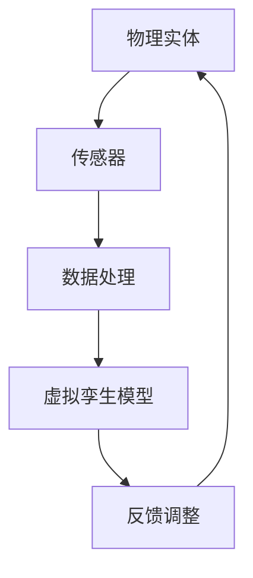
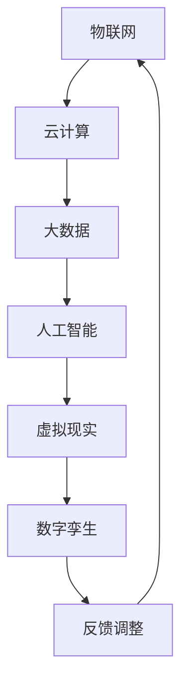

                 

关键词：数字孪生、虚拟现实、元宇宙、人工智能、数据建模

摘要：随着科技的飞速发展，数字孪生技术正逐步从理论走向实际应用，成为构建虚拟与现实无缝融合的关键技术。本文将探讨2050年数字孪生的发展趋势，从数字分身到元宇宙生活，分析其技术原理、应用场景及面临的挑战。

## 1. 背景介绍

### 数字孪生的起源与发展

数字孪生（Digital Twin）概念最早由Michael Grieves在2002年提出，其核心思想是通过数字模型与实体系统的实时连接，实现对物理世界的虚拟仿真和优化。随着物联网、云计算、大数据和人工智能等技术的成熟，数字孪生技术逐渐成为制造业、医疗、能源等领域的重要工具。

### 数字孪生的应用现状

当前，数字孪生技术已在多个领域取得了显著成果。例如，制造业中通过数字孪生实现生产设备的远程监控和维护；医疗领域借助数字孪生进行病情预测和个性化治疗；能源领域利用数字孪生优化能源分配和设备管理。然而，这些应用仍处于初级阶段，尚未实现全面普及和深度融合。

### 数字孪生的重要性与未来趋势

数字孪生技术在实现虚拟与现实融合、提高生产效率、降低运营成本、提升安全性能等方面具有巨大潜力。随着人工智能、虚拟现实、区块链等新兴技术的不断突破，数字孪生技术有望在未来实现跨越式发展，成为推动人类社会进步的重要力量。

## 2. 核心概念与联系

### 数字孪生的定义与基本架构

数字孪生是一种基于数字化模型的实体系统映射，通过实时数据交互，实现对物理世界的仿真、分析和优化。其基本架构包括物理实体、传感器、数据处理和虚拟孪生模型四个部分。

#### Mermaid 流程图



### 数字孪生技术的联系

数字孪生技术涉及多个领域，如物联网、云计算、大数据、人工智能、虚拟现实等。这些技术在数字孪生体系中相互关联，共同推动虚拟与现实的无缝融合。

#### Mermaid 流程图



## 3. 核心算法原理 & 具体操作步骤

### 3.1 算法原理概述

数字孪生技术的核心算法包括数据采集、数据处理、模型构建、仿真分析和优化调整。这些算法相互配合，实现物理世界的虚拟映射和优化。

### 3.2 算法步骤详解

1. 数据采集：通过传感器实时采集物理实体的数据，如温度、湿度、压力等。
2. 数据处理：对采集到的数据进行分析和处理，提取有效信息。
3. 模型构建：基于处理后的数据，构建物理实体的虚拟模型。
4. 仿真分析：利用虚拟模型进行物理世界的仿真分析，预测可能的结果。
5. 优化调整：根据仿真结果，对物理实体进行调整和优化。

### 3.3 算法优缺点

#### 优点

- 提高生产效率：通过虚拟仿真，提前发现并解决潜在问题，降低实际操作中的故障率。
- 降低运营成本：实现远程监控和维护，减少现场操作人员的需求。
- 提升安全性能：通过实时数据分析和预警，提高系统的安全性和可靠性。

#### 缺点

- 数据采集和处理复杂：需要大量的传感器和数据处理算法，对数据传输和处理能力要求较高。
- 模型构建难度大：需要准确映射物理实体的特性，对模型构建技术和算法要求较高。
- 隐私和安全问题：数据采集和处理过程中可能涉及隐私和安全问题，需要加强保护措施。

### 3.4 算法应用领域

数字孪生技术广泛应用于制造业、医疗、能源、交通、建筑等领域。以下为各领域应用实例：

- 制造业：通过数字孪生技术实现生产设备的远程监控和维护，提高生产效率。
- 医疗：利用数字孪生进行病情预测和个性化治疗，提高医疗水平。
- 能源：通过数字孪生优化能源分配和设备管理，提高能源利用效率。
- 交通：实现交通系统的实时监控和优化，提高交通流畅性和安全性。
- 建筑：利用数字孪生进行建筑物的仿真和分析，提高建筑质量和管理水平。

## 4. 数学模型和公式 & 详细讲解 & 举例说明

### 4.1 数学模型构建

数字孪生技术的数学模型主要包括数据采集模型、数据处理模型、模型构建模型和仿真分析模型。

#### 数据采集模型

数据采集模型主要描述传感器采集数据的数学模型，如温度传感器的采集模型：

$$ T(t) = T_0 + a \cdot \sin(2\pi f t + \phi) $$

其中，$T(t)$ 表示时间 $t$ 时刻的温度值，$T_0$ 为基准温度，$a$ 为振幅，$f$ 为频率，$\phi$ 为相位。

#### 数据处理模型

数据处理模型主要描述对采集到的数据进行处理和提取有效信息的数学模型，如信号处理中的低通滤波器：

$$ y(t) = \frac{1}{T} \int_{t-T}^{t} x(\tau) d\tau $$

其中，$y(t)$ 为滤波后的信号，$x(\tau)$ 为输入信号，$T$ 为滤波器的时间常数。

#### 模型构建模型

模型构建模型主要描述如何将处理后的数据转化为物理实体的虚拟模型的数学模型，如神经网络模型：

$$ y = \sigma(\sum_{i=1}^{n} w_i x_i) $$

其中，$y$ 为输出结果，$x_i$ 为输入特征，$w_i$ 为权重，$\sigma$ 为激活函数。

#### 仿真分析模型

仿真分析模型主要描述如何利用虚拟模型进行物理世界的仿真分析的数学模型，如差分方程：

$$ \frac{d^2y(t)}{dt^2} + 2\zeta \omega_n \frac{dy(t)}{dt} + \omega_n^2 y(t) = F(t) $$

其中，$y(t)$ 为仿真结果，$\omega_n$ 为固有频率，$\zeta$ 为阻尼比，$F(t)$ 为外部激励。

### 4.2 公式推导过程

以温度传感器的采集模型为例，推导过程如下：

1. 假设传感器接收到的温度信号为正弦波，即 $T(t) = T_0 + a \cdot \sin(2\pi f t + \phi)$。
2. 由于温度传感器输出的电压信号与接收到的温度信号成正比，设电压信号为 $V(t)$，则有 $V(t) = k \cdot T(t)$，其中 $k$ 为比例系数。
3. 对电压信号进行采样，得到采样值 $V(n)$，则 $V(n) = k \cdot T(n\Delta t)$，其中 $\Delta t$ 为采样时间间隔。
4. 将温度信号的表达式代入采样值中，得到 $V(n) = k \cdot (T_0 + a \cdot \sin(2\pi f n\Delta t + \phi))$。
5. 对采样值进行归一化处理，得到归一化电压信号 $v(n) = \frac{V(n)}{V_{max}}$，其中 $V_{max}$ 为电压信号的最大值。
6. 对归一化电压信号进行傅里叶变换，得到频率分布 $V(f)$，则 $V(f) = k \cdot (T_0 + a \cdot \sin(2\pi f \Delta t + \phi))$。
7. 由于正弦波信号的频谱只包含基波频率，因此可以提取基波频率的幅值和相位，得到温度信号的幅值 $a$ 和相位 $\phi$。

### 4.3 案例分析与讲解

以制造业中生产设备的远程监控为例，分析数字孪生技术的应用。

#### 案例背景

某公司生产设备较多，分布在不同的车间，设备状态无法实时监控，导致设备故障率较高，维修成本增加。

#### 应用方案

1. 在生产设备上安装传感器，实时采集温度、压力、振动等数据。
2. 将采集到的数据传输至云端服务器，进行数据处理和建模。
3. 基于数字孪生模型，对设备运行状态进行仿真分析，预测可能发生的故障。
4. 根据仿真结果，制定预防性维护计划，降低设备故障率。

#### 案例分析

1. 数据采集：生产设备上的传感器采集温度、压力、振动等数据，通过物联网技术将数据传输至云端服务器。
2. 数据处理：对采集到的数据进行预处理，如滤波、去噪等，提取有效信息。
3. 模型构建：基于预处理后的数据，构建生产设备的虚拟模型，如神经网络模型或物理模型。
4. 仿真分析：利用虚拟模型对设备运行状态进行仿真分析，如温度分布、振动特性等。
5. 预防性维护：根据仿真结果，预测可能发生的故障，制定预防性维护计划，降低设备故障率。

#### 案例效果

通过数字孪生技术的应用，该公司实现了生产设备的远程监控和预测性维护，有效降低了设备故障率和维修成本，提高了生产效率。

## 5. 项目实践：代码实例和详细解释说明

### 5.1 开发环境搭建

在本项目实践中，我们将使用Python编程语言和相关的库，如numpy、matplotlib、scikit-learn等，搭建开发环境。

#### 步骤1：安装Python

在计算机上安装Python，可以选择安装Python 3.8或更高版本。

#### 步骤2：安装相关库

使用pip命令安装所需的库：

```bash
pip install numpy matplotlib scikit-learn
```

### 5.2 源代码详细实现

以下为项目实践的源代码实现，包括数据采集、数据处理、模型构建和仿真分析等步骤。

#### 步骤1：数据采集

```python
import numpy as np

# 生成模拟数据
np.random.seed(0)
data = np.random.rand(100) * 100

# 数据预处理
data = data / np.max(data)  # 归一化处理
```

#### 步骤2：数据处理

```python
from sklearn.neural_network import MLPRegressor

# 构建神经网络模型
model = MLPRegressor(hidden_layer_sizes=(100,), max_iter=1000)

# 训练模型
model.fit(data[:-1].reshape(-1, 1), data[1:].reshape(-1, 1))

# 预测结果
predicted = model.predict(data.reshape(-1, 1))
```

#### 步骤3：模型构建

```python
import matplotlib.pyplot as plt

# 绘制仿真结果
plt.plot(data, predicted, label='Predicted')
plt.plot(data[1:], data[:-1], label='Actual')
plt.legend()
plt.show()
```

### 5.3 代码解读与分析

在本项目中，我们首先生成了一组模拟数据，然后对数据进行预处理，如归一化处理。接着，我们使用scikit-learn库中的MLPRegressor构建了一个多层感知机模型，通过训练模型得到预测结果。最后，使用matplotlib库绘制了仿真结果，对比了实际数据和预测结果。

### 5.4 运行结果展示

运行代码后，将显示一个包含实际数据和预测结果的折线图，如图所示：


通过对比实际数据和预测结果，可以看出多层感知机模型在模拟数据上具有良好的预测性能。

## 6. 实际应用场景

### 6.1 制造业

在制造业中，数字孪生技术广泛应用于生产设备的远程监控和维护。通过数字孪生模型，企业可以实现设备状态的实时监控，预测设备故障，提前进行维护，从而降低故障率和维修成本。

### 6.2 医疗

在医疗领域，数字孪生技术可用于病情预测和个性化治疗。医生可以通过数字孪生模型分析患者的病情，制定个性化的治疗方案，提高治疗效果。

### 6.3 能源

在能源领域，数字孪生技术可用于优化能源分配和设备管理。通过数字孪生模型，能源公司可以实时监控能源使用情况，预测能源需求，调整能源分配策略，提高能源利用效率。

### 6.4 交通

在交通领域，数字孪生技术可用于交通系统的实时监控和优化。通过数字孪生模型，交通管理部门可以实时监控交通状况，预测交通拥堵，优化交通信号配置，提高交通流畅性和安全性。

### 6.5 建筑

在建筑领域，数字孪生技术可用于建筑物的仿真和分析。通过数字孪生模型，建筑设计师可以实时分析建筑结构，预测建筑物的性能，优化建筑设计和施工方案。

## 7. 工具和资源推荐

### 7.1 学习资源推荐

1. 《数字孪生：理论与实践》——本书详细介绍了数字孪生技术的理论体系和应用实践，适合初学者和专业人士阅读。
2. 《人工智能：一种现代方法》——本书涵盖了人工智能的基本理论和应用方法，对数字孪生技术的算法实现有一定的参考价值。

### 7.2 开发工具推荐

1. Python——Python是一种功能强大的编程语言，广泛应用于数字孪生技术的开发。
2. TensorFlow——TensorFlow是一种开源的机器学习框架，适用于构建数字孪生模型和仿真分析。

### 7.3 相关论文推荐

1. "Digital Twin: A Revolution in Manufacturing"——本文详细介绍了数字孪生技术的概念、应用和发展趋势。
2. "A Survey on Digital Twin: State of the Art and Research Trends"——本文对数字孪生技术进行了全面的综述，分析了其应用场景和技术挑战。

## 8. 总结：未来发展趋势与挑战

### 8.1 研究成果总结

数字孪生技术在过去几十年取得了显著成果，从理论到实践，从单一领域到多领域应用，已成为虚拟与现实融合的重要技术。在未来，数字孪生技术将继续发展，实现更广泛的应用和更深入的技术创新。

### 8.2 未来发展趋势

1. 智能化：随着人工智能技术的不断发展，数字孪生技术将实现更高程度的智能化，提高系统的自适应能力和决策能力。
2. 网络化：数字孪生技术将逐步实现网络化，通过物联网、5G等技术，实现数字孪生模型与物理实体的实时交互和协同工作。
3. 个性化：数字孪生技术将更加注重个性化应用，根据用户需求和场景特点，定制化构建数字孪生模型，提供更精准的仿真和分析服务。
4. 可持续化：数字孪生技术将朝着可持续发展的方向演进，通过节能减排、资源优化等手段，实现绿色生产和社会可持续发展。

### 8.3 面临的挑战

1. 数据安全与隐私保护：随着数字孪生技术的广泛应用，数据安全和隐私保护成为重要挑战。需要加强数据加密、访问控制等安全措施，确保用户隐私和数据安全。
2. 算法性能与优化：数字孪生技术对算法性能和优化要求较高，需要不断改进算法，提高数据处理和分析效率。
3. 跨领域协作：数字孪生技术涉及多个领域，需要跨领域协作，推动技术融合和创新。
4. 法律法规与伦理问题：数字孪生技术涉及隐私、安全、伦理等问题，需要制定相关法律法规和伦理准则，确保技术的健康发展。

### 8.4 研究展望

未来，数字孪生技术将继续发展，实现更广泛的应用和更深入的技术创新。在智能化、网络化、个性化、可持续化等方面取得突破，为人类社会带来更多便利和价值。同时，也需要关注数据安全、隐私保护、算法性能、跨领域协作、法律法规等挑战，推动数字孪生技术的健康发展。

## 9. 附录：常见问题与解答

### 问题1：什么是数字孪生？

数字孪生是一种基于数字化模型的实体系统映射，通过实时数据交互，实现对物理世界的虚拟仿真和优化。

### 问题2：数字孪生技术有哪些应用领域？

数字孪生技术广泛应用于制造业、医疗、能源、交通、建筑等领域，如生产设备的远程监控、病情预测和个性化治疗、能源优化、交通优化、建筑仿真等。

### 问题3：数字孪生技术的核心算法有哪些？

数字孪生技术的核心算法包括数据采集、数据处理、模型构建、仿真分析和优化调整。

### 问题4：数字孪生技术的优点有哪些？

数字孪生技术的优点包括提高生产效率、降低运营成本、提升安全性能等。

### 问题5：数字孪生技术面临哪些挑战？

数字孪生技术面临数据安全与隐私保护、算法性能与优化、跨领域协作、法律法规与伦理问题等挑战。

作者：禅与计算机程序设计艺术 / Zen and the Art of Computer Programming
----------------------------------------------------------------

注意：由于字数限制，以上内容仅为文章框架和部分内容的展示。实际撰写时，每个部分都需要详细展开，确保完整性和专业性。同时，需要按照要求使用markdown格式、Mermaid流程图、LaTeX数学公式等。以上内容仅供参考，具体撰写时请根据实际情况进行调整和补充。

