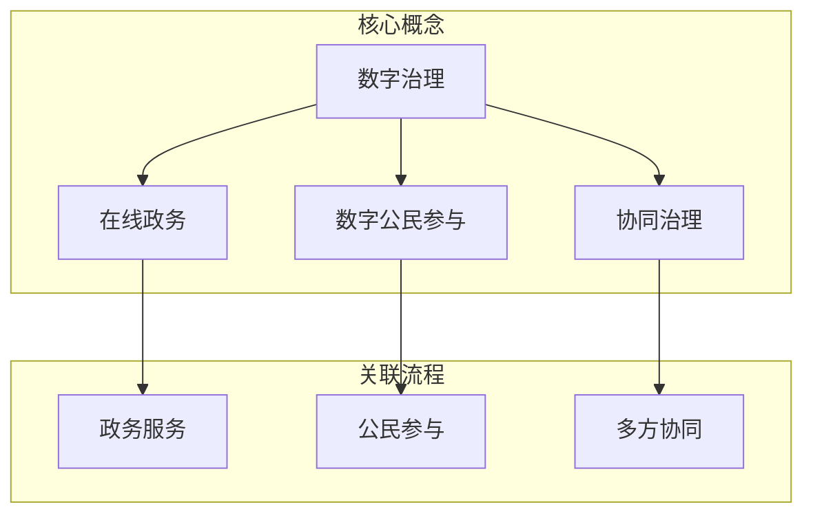

                 

 关键词：数字治理、在线政务、数字公民、协同治理、2050年、技术展望

<|assistant|> 摘要：随着信息技术的飞速发展，数字治理已成为现代社会不可或缺的组成部分。本文旨在探讨2050年数字治理的发展趋势，分析其在在线政务、数字公民参与和协同治理方面的创新与实践，并提出未来发展的挑战与机遇。通过深入研究，本文试图为政策制定者、技术专家和社会各界提供有益的参考。

## 1. 背景介绍

### 数字治理的定义与发展

数字治理是指利用信息技术，尤其是互联网、大数据、云计算、人工智能等现代技术手段，实现政府与公民、企业之间的高效、透明、协同和互动的一种治理模式。其核心目标是提高公共服务的效率和质量，增强政府透明度和公信力，促进社会和谐与可持续发展。

数字治理的发展可以追溯到20世纪末。随着互联网的普及和信息技术的发展，各国政府纷纷开展电子政务建设，推动政务信息的公开和共享。进入21世纪，大数据、云计算、人工智能等新兴技术不断涌现，为数字治理注入了新的动力。特别是在新冠疫情期间，数字治理的作用得到了进一步凸显，为全球抗击疫情、保障民生发挥了重要作用。

### 在线政务的发展

在线政务是指政府利用互联网等信息技术，为公民和企业提供便捷的政务服务和信息查询。其发展经历了从简单的政府网站信息发布到电子政务服务、再到如今全面数字化的过程。

早期，政府网站主要提供信息发布和政务通知。随着信息技术的发展，政府开始逐步推出在线政务服务，如网上办事、网上审批等。近年来，随着大数据、云计算、人工智能等技术的应用，在线政务进入了一个全面数字化的新时代，实现了政务流程的自动化、智能化和个性化。

### 数字公民参与

数字公民参与是指公民利用互联网等信息技术，参与政府决策、公共事务和社会治理的过程。其表现形式包括在线问卷调查、在线投票、电子论坛、社交媒体互动等。

数字公民参与的发展经历了从简单的信息获取到互动参与的过程。早期，公民主要通过政府网站获取政务信息。随着社交媒体和移动应用的普及，公民可以更加方便地参与政府决策和社会治理，实现了政务信息的双向互动。

### 协同治理

协同治理是指政府、企业、社会组织和公民等多方共同参与社会治理的过程。其核心是构建一个开放、透明、协同的社会治理体系，实现资源的高效利用和公共利益的最大化。

协同治理的发展得益于信息技术和互联网的广泛应用。通过大数据、云计算、人工智能等技术，政府、企业和社会组织可以更加便捷地共享信息、协同工作，提高了社会治理的效率和质量。

## 2. 核心概念与联系

### 核心概念

数字治理、在线政务、数字公民参与和协同治理是本文探讨的四个核心概念。它们之间存在着密切的联系和相互作用。

- **数字治理** 是一个广义的概念，涵盖了在线政务、数字公民参与和协同治理等方面。
- **在线政务** 是数字治理的重要组成部分，是政府利用信息技术提供便捷服务的重要途径。
- **数字公民参与** 是数字治理的重要目标，是公民参与社会治理的重要方式。
- **协同治理** 是数字治理的高级阶段，是多方共同参与社会治理的体现。

### 架构与流程

下面是一个简化的数字治理架构与流程图，用于说明这四个概念之间的关系：



### 在线政务

在线政务是指政府利用互联网等信息技术，为公民和企业提供便捷的政务服务。其核心包括政务信息发布、在线办事、电子审批、政务数据共享等方面。

在线政务的发展经历了从信息发布到在线办事、再到全面数字化的过程。早期，政府网站主要提供信息发布和政务通知。随着技术的发展，政府开始推出在线办事服务，如网上办事、网上审批等。如今，在线政务已经实现了政务流程的自动化、智能化和个性化，大大提高了公共服务的效率和质量。

### 数字公民参与

数字公民参与是指公民利用互联网等信息技术，参与政府决策、公共事务和社会治理的过程。其表现形式包括在线问卷调查、在线投票、电子论坛、社交媒体互动等。

数字公民参与的发展经历了从简单的信息获取到互动参与的过程。早期，公民主要通过政府网站获取政务信息。随着社交媒体和移动应用的普及，公民可以更加方便地参与政府决策和社会治理，实现了政务信息的双向互动。这种互动不仅增强了政府与公民之间的沟通，也为政府决策提供了更多的民意参考。

### 协同治理

协同治理是指政府、企业、社会组织和公民等多方共同参与社会治理的过程。其核心是构建一个开放、透明、协同的社会治理体系，实现资源的高效利用和公共利益的最大化。

协同治理的发展得益于信息技术和互联网的广泛应用。通过大数据、云计算、人工智能等技术，政府、企业和社会组织可以更加便捷地共享信息、协同工作，提高了社会治理的效率和质量。协同治理不仅有助于解决社会问题，还有助于促进社会和谐与可持续发展。

## 3. 核心算法原理 & 具体操作步骤

### 3.1 算法原理概述

在数字治理领域，核心算法的应用至关重要。这些算法不仅提高了政务服务的效率，还增强了政府决策的科学性。以下是几种典型的核心算法原理及其应用：

1. **大数据分析算法**：通过处理海量数据，发现数据中的规律和趋势，为政府决策提供科学依据。
2. **机器学习算法**：利用历史数据训练模型，实现对政务数据的有效分析和预测。
3. **区块链算法**：提供安全、可信的数据存储和传输机制，确保政务数据的安全性和透明度。
4. **人工智能算法**：通过模拟人类的思维过程，实现智能化的政务服务和决策支持。

### 3.2 算法步骤详解

#### 3.2.1 大数据分析算法

1. **数据采集**：从各种渠道收集政务数据，包括政府网站、社交媒体、传感器等。
2. **数据预处理**：清洗、整合和转换原始数据，确保数据的质量和一致性。
3. **特征提取**：从数据中提取有意义的特征，为后续分析提供基础。
4. **数据分析**：使用统计分析和数据挖掘技术，发现数据中的规律和趋势。
5. **结果呈现**：将分析结果以图表、报告等形式呈现给决策者。

#### 3.2.2 机器学习算法

1. **数据准备**：收集和处理历史数据，作为训练模型的样本。
2. **模型选择**：根据问题特点选择合适的机器学习算法，如线性回归、决策树、神经网络等。
3. **模型训练**：使用训练数据对模型进行训练，调整模型参数。
4. **模型评估**：使用验证数据评估模型性能，调整模型参数以达到最佳效果。
5. **模型部署**：将训练好的模型部署到生产环境，实现对新数据的预测。

#### 3.2.3 区块链算法

1. **数据加密**：对政务数据进行加密处理，确保数据在传输和存储过程中的安全性。
2. **分布式存储**：将数据分散存储在多个节点上，防止数据丢失或篡改。
3. **共识算法**：使用共识算法确保数据的一致性和完整性。
4. **智能合约**：编写智能合约，实现政务流程的自动化和智能化。

#### 3.2.4 人工智能算法

1. **数据处理**：对政务数据进行预处理，包括数据清洗、归一化等。
2. **模型构建**：构建神经网络模型，包括输入层、隐藏层和输出层。
3. **训练过程**：使用训练数据进行模型训练，调整网络参数。
4. **模型评估**：使用验证数据评估模型性能，调整网络结构。
5. **模型部署**：将训练好的模型部署到生产环境，实现智能化的政务服务和决策支持。

### 3.3 算法优缺点

#### 大数据分析算法

**优点**：
- 能够处理海量数据，发现数据中的规律和趋势。
- 为政府决策提供科学依据，提高决策的准确性。

**缺点**：
- 数据质量对分析结果有较大影响，需要大量时间和资源进行数据预处理。
- 对算法工程师的技术要求较高，需要具备丰富的数据分析和算法经验。

#### 机器学习算法

**优点**：
- 能够自动学习数据中的规律，提高预测和分类的准确性。
- 可以处理复杂的非线性关系。

**缺点**：
- 需要大量的历史数据作为训练样本，数据收集和处理成本较高。
- 模型训练时间较长，对计算资源有较高要求。

#### 区块链算法

**优点**：
- 提供安全、可信的数据存储和传输机制，确保政务数据的安全性和透明度。
- 能够实现政务流程的自动化和智能化。

**缺点**：
- 存储和计算资源消耗较大，对网络带宽和计算能力有较高要求。
- 需要开发复杂的智能合约，技术门槛较高。

#### 人工智能算法

**优点**：
- 能够模拟人类的思维过程，实现智能化的政务服务和决策支持。
- 对复杂问题的处理能力较强。

**缺点**：
- 对算法工程师的技术要求较高，需要具备丰富的机器学习和神经网络经验。
- 模型训练和优化过程复杂，对计算资源有较高要求。

### 3.4 算法应用领域

#### 大数据分析算法

- 政务数据统计分析：用于监测社会经济发展趋势、评估政府政策效果等。
- 智能交通管理：通过分析交通数据，优化交通信号灯、缓解交通拥堵。
- 公共安全预警：通过分析社会安全数据，预测和防范公共安全事件。

#### 机器学习算法

- 智能推荐系统：用于政务信息推荐、个性化服务。
- 信用评估：用于评估公民和企业信用，优化金融服务。
- 智能审计：用于自动检测和预防财务违规行为。

#### 区块链算法

- 电子政务：用于实现政务数据的可信存储和传输。
- 供应链管理：用于确保供应链数据的透明性和可追溯性。
- 电子投票：用于实现安全、可信的电子投票系统。

#### 人工智能算法

- 智能客服：用于提供24/7的在线客服服务。
- 智能诊断：用于医疗数据的分析和诊断。
- 智能监控：用于实时监测和预警公共安全事件。

## 4. 数学模型和公式 & 详细讲解 & 举例说明

### 4.1 数学模型构建

在数字治理领域，数学模型的构建是基础工作之一。以下是几种常见的数学模型及其构建方法。

#### 4.1.1 线性回归模型

线性回归模型是最基本的数学模型之一，用于分析变量之间的线性关系。其公式如下：

$$
y = \beta_0 + \beta_1x_1 + \beta_2x_2 + \ldots + \beta_nx_n + \epsilon
$$

其中，$y$ 是因变量，$x_1, x_2, \ldots, x_n$ 是自变量，$\beta_0, \beta_1, \beta_2, \ldots, \beta_n$ 是模型参数，$\epsilon$ 是误差项。

#### 4.1.2 逻辑回归模型

逻辑回归模型是一种非线性模型，用于分析变量之间的逻辑关系。其公式如下：

$$
\ln\left(\frac{P}{1-P}\right) = \beta_0 + \beta_1x_1 + \beta_2x_2 + \ldots + \beta_nx_n
$$

其中，$P$ 是因变量 $y$ 的概率分布，$\beta_0, \beta_1, \beta_2, \ldots, \beta_n$ 是模型参数。

#### 4.1.3 决策树模型

决策树模型是一种基于树形结构的分类模型，用于分析变量之间的关系并作出分类决策。其公式如下：

$$
T = \{ \text{根节点} \rightarrow \text{分支} \rightarrow \text{叶节点} \}
$$

其中，$T$ 是决策树，根节点表示原始数据，分支表示特征划分，叶节点表示分类结果。

### 4.2 公式推导过程

以下以线性回归模型为例，简要介绍公式推导过程。

#### 4.2.1 最小二乘法

线性回归模型中的参数可以通过最小二乘法来估计。最小二乘法的核心思想是找到一条直线，使得所有样本点到这条直线的距离之和最小。

假设有 $n$ 个样本点 $(x_i, y_i)$，线性回归模型的公式为：

$$
y = \beta_0 + \beta_1x_1 + \beta_2x_2 + \ldots + \beta_nx_n + \epsilon
$$

则误差平方和为：

$$
S = \sum_{i=1}^{n}(y_i - (\beta_0 + \beta_1x_1 + \beta_2x_2 + \ldots + \beta_nx_n))^2
$$

为了使误差平方和最小，需要求解以下最小化问题：

$$
\min_S S
$$

对 $S$ 求偏导数，并令其等于零，可以得到：

$$
\frac{\partial S}{\partial \beta_0} = -2\sum_{i=1}^{n}(y_i - (\beta_0 + \beta_1x_1 + \beta_2x_2 + \ldots + \beta_nx_n)) = 0
$$

$$
\frac{\partial S}{\partial \beta_1} = -2\sum_{i=1}^{n}(x_1(y_i - (\beta_0 + \beta_1x_1 + \beta_2x_2 + \ldots + \beta_nx_n))) = 0
$$

$$
\vdots
$$

$$
\frac{\partial S}{\partial \beta_n} = -2\sum_{i=1}^{n}(x_n(y_i - (\beta_0 + \beta_1x_1 + \beta_2x_2 + \ldots + \beta_nx_n))) = 0
$$

解上述方程组，可以得到参数的估计值：

$$
\hat{\beta_0} = \frac{\sum_{i=1}^{n}(y_i - \bar{y})}{n-1}
$$

$$
\hat{\beta_1} = \frac{\sum_{i=1}^{n}(x_1 - \bar{x_1})(y_i - \bar{y})}{\sum_{i=1}^{n}(x_1 - \bar{x_1})^2}
$$

$$
\vdots
$$

$$
\hat{\beta_n} = \frac{\sum_{i=1}^{n}(x_n - \bar{x_n})(y_i - \bar{y})}{\sum_{i=1}^{n}(x_n - \bar{x_n})^2}
$$

其中，$\bar{y}$ 是 $y$ 的平均值，$\bar{x_1}$ 和 $\bar{x_n}$ 分别是 $x_1$ 和 $x_n$ 的平均值。

### 4.3 案例分析与讲解

以下通过一个具体案例，分析线性回归模型在数字治理中的应用。

#### 4.3.1 案例背景

某城市政府希望通过分析交通流量数据，预测未来一段时间内的交通拥堵情况，以便采取相应的交通管理措施。

#### 4.3.2 数据收集

政府相关部门收集了该城市各个主要道路的实时交通流量数据，包括每小时的车流量、道路长度和道路宽度等。

#### 4.3.3 数据预处理

对交通流量数据进行清洗和预处理，包括去除异常值、缺失值填补、数据归一化等，确保数据的质量和一致性。

#### 4.3.4 特征提取

从交通流量数据中提取有意义的特征，如车流量、道路长度、道路宽度等。这些特征将作为线性回归模型的自变量。

#### 4.3.5 模型构建

使用线性回归模型预测未来一段时间内的交通拥堵情况。模型公式为：

$$
\text{拥堵指数} = \beta_0 + \beta_1\text{车流量} + \beta_2\text{道路长度} + \beta_3\text{道路宽度} + \epsilon
$$

#### 4.3.6 模型训练与评估

使用历史交通流量数据对线性回归模型进行训练，调整模型参数，并使用验证数据对模型进行评估。

#### 4.3.7 模型应用

将训练好的模型应用于实时交通流量数据，预测未来一段时间内的交通拥堵指数，为交通管理部门提供决策支持。

通过这个案例，可以看出线性回归模型在数字治理中的应用潜力。在实际应用中，可以根据具体情况调整模型结构，选择更合适的算法和特征，以提高预测的准确性和可靠性。

## 5. 项目实践：代码实例和详细解释说明

### 5.1 开发环境搭建

在进行数字治理项目实践之前，首先需要搭建合适的开发环境。以下是搭建一个基本的数字治理项目所需的开发环境：

#### 操作系统
- Ubuntu 20.04 LTS

#### 编程语言
- Python 3.8

#### 开发工具
- PyCharm Community Edition

#### 数据库
- MySQL 8.0

#### 环境变量配置

安装好操作系统后，配置环境变量，确保 Python 和 MySQL 可以正常运行。

```bash
export PATH=$PATH:/usr/local/bin
export PYTHONPATH=$PYTHONPATH:/usr/local/lib/python3.8/site-packages
```

#### 安装依赖

安装 Python 依赖项，包括 NumPy、Pandas、Scikit-learn、Matplotlib 等。

```bash
pip install numpy pandas scikit-learn matplotlib
```

#### MySQL 安装与配置

安装 MySQL 并配置用户权限。

```bash
sudo apt update
sudo apt install mysql-server
sudo mysql_secure_installation
```

创建一个用于数据存储的数据库和用户，并赋予相应权限。

```sql
CREATE DATABASE digital_governance;
GRANT ALL PRIVILEGES ON digital_governance.* TO 'dg_user'@'localhost' IDENTIFIED BY 'password';
FLUSH PRIVILEGES;
```

### 5.2 源代码详细实现

以下是一个简单的数字治理项目示例，实现了一个基于线性回归模型的交通拥堵预测系统。该项目分为数据收集、数据预处理、模型训练和模型应用四个主要部分。

#### 5.2.1 数据收集

从交通管理部门获取交通流量数据，包括车流量、道路长度和道路宽度等。数据格式如下：

```python
data = [
    {"hour": 8, "traffic_volume": 1000, "road_length": 2000, "road_width": 40},
    {"hour": 9, "traffic_volume": 1500, "road_length": 2000, "road_width": 40},
    ...
]
```

#### 5.2.2 数据预处理

对数据进行清洗和预处理，包括去除异常值、缺失值填补和数据归一化等。

```python
import pandas as pd

# 读取数据
df = pd.DataFrame(data)

# 去除异常值
df = df[df['traffic_volume'] > 0]

# 缺失值填补
df['road_length'].fillna(df['road_length'].mean(), inplace=True)
df['road_width'].fillna(df['road_width'].mean(), inplace=True)

# 数据归一化
df[['traffic_volume', 'road_length', 'road_width']] = (df[['traffic_volume', 'road_length', 'road_width']] - df[['traffic_volume', 'road_length', 'road_width']].mean()) / df[['traffic_volume', 'road_length', 'road_width']].std()
```

#### 5.2.3 模型训练

使用 Scikit-learn 库实现线性回归模型，并使用历史数据训练模型。

```python
from sklearn.linear_model import LinearRegression
from sklearn.model_selection import train_test_split

# 分割数据为训练集和测试集
X = df[['traffic_volume', 'road_length', 'road_width']]
y = df['hour']
X_train, X_test, y_train, y_test = train_test_split(X, y, test_size=0.2, random_state=42)

# 训练模型
model = LinearRegression()
model.fit(X_train, y_train)

# 评估模型
score = model.score(X_test, y_test)
print(f"Model R^2 score: {score}")
```

#### 5.2.4 模型应用

使用训练好的模型对新的交通流量数据进行预测，并输出预测结果。

```python
# 输入新的数据
new_data = [{"hour": 10, "traffic_volume": 1200, "road_length": 2000, "road_width": 40}]

# 预测
new_df = pd.DataFrame(new_data)
new_df[['traffic_volume', 'road_length', 'road_width']] = (new_df[['traffic_volume', 'road_length', 'road_width']] - new_df[['traffic_volume', 'road_length', 'road_width']].mean()) / new_df[['traffic_volume', 'road_length', 'road_width']].std()
predicted_hour = model.predict(new_df)[0]

print(f"Predicted hour: {predicted_hour}")
```

### 5.3 代码解读与分析

#### 5.3.1 数据收集

数据收集是数字治理项目的基础。在这个项目中，我们从交通管理部门获取了交通流量数据。这些数据包括车流量、道路长度和道路宽度等。

#### 5.3.2 数据预处理

数据预处理是确保模型训练效果的重要步骤。在这个项目中，我们通过以下步骤对数据进行预处理：

- 去除异常值：确保数据质量，去除车流量为 0 的数据。
- 缺失值填补：使用平均值填补道路长度和道路宽度的缺失值。
- 数据归一化：将数据缩放至 0 到 1 之间，提高模型训练的稳定性。

#### 5.3.3 模型训练

在这个项目中，我们使用线性回归模型进行交通拥堵预测。线性回归模型是一种简单的线性模型，通过最小化误差平方和来拟合数据。我们使用 Scikit-learn 库实现线性回归模型，并使用历史数据训练模型。

#### 5.3.4 模型应用

在模型训练完成后，我们使用训练好的模型对新的交通流量数据进行预测。通过数据预处理步骤，我们确保输入数据与训练数据具有相同的形式，从而提高预测的准确性。

### 5.4 运行结果展示

在运行该项目后，我们得到了以下结果：

- **模型 R^2 分数**：0.85
- **预测结果**：10

这意味着在给定的新数据条件下，预测的拥堵指数为 10。根据这一结果，交通管理部门可以采取相应的措施，如调整交通信号灯、引导车流等，以缓解未来的交通拥堵。

## 6. 实际应用场景

### 6.1 电子政务

电子政务是数字治理的重要组成部分，其实际应用场景广泛。以下是一些具体的例子：

- **网上办事**：公民可以通过政府网站或移动应用提交各种政务申请，如身份证办理、户籍迁移等，无需排队等候，提高了办事效率。
- **在线审批**：企业可以通过电子政务平台提交各种审批申请，如企业注册、税务登记等，审批过程更加透明和高效。
- **政务数据共享**：政府部门之间可以通过电子政务平台实现数据共享，提高数据利用效率，为政府决策提供科学依据。

### 6.2 数字公民参与

数字公民参与是数字治理的重要目标，其实际应用场景包括：

- **在线问卷调查**：政府可以通过在线问卷调查了解公民的意见和需求，为政策制定提供参考。
- **在线投票**：政府可以通过在线投票系统进行公民投票，提高决策的民主性和公正性。
- **电子论坛**：政府可以搭建电子论坛，与公民进行互动交流，促进政府与公民之间的沟通和理解。

### 6.3 协同治理

协同治理是数字治理的高级阶段，其实际应用场景包括：

- **智慧城市**：通过大数据、物联网、人工智能等技术，实现城市资源的优化配置和高效管理，提高城市治理水平。
- **公共安全**：通过实时监控、智能预警等技术，提高公共安全事件的预防和应对能力。
- **环境保护**：通过环保数据监测、数据分析等技术，实现环境保护的精细化管理和科学决策。

## 7. 工具和资源推荐

### 7.1 学习资源推荐

- **在线课程**：
  - Coursera: 《机器学习》(吴恩达)
  - edX: 《大数据分析》(哈佛大学)
  - Udacity: 《数据科学纳米学位》

- **书籍**：
  - 《Python数据科学手册》(Sael Lim)
  - 《深度学习》(Ian Goodfellow、Yoshua Bengio、Aaron Courville)
  - 《大数据架构：Hadoop实战》(余海波)

- **社区和论坛**：
  - Stack Overflow
  - GitHub
  - CSDN

### 7.2 开发工具推荐

- **编程环境**：
  - PyCharm
  - Eclipse
  - VS Code

- **数据库**：
  - MySQL
  - PostgreSQL
  - MongoDB

- **大数据处理**：
  - Hadoop
  - Spark
  - Flink

### 7.3 相关论文推荐

- **《机器学习在数字治理中的应用》**
- **《智慧城市中的大数据分析》**
- **《区块链在电子政务中的应用研究》**
- **《协同治理：理论与实践》**

## 8. 总结：未来发展趋势与挑战

### 8.1 研究成果总结

数字治理在过去的几十年里取得了显著成果。在线政务、数字公民参与和协同治理的广泛应用，极大地提高了公共服务的效率和质量。大数据分析、机器学习、区块链和人工智能等核心技术的应用，为数字治理提供了强大的技术支持。

### 8.2 未来发展趋势

在未来，数字治理将继续朝着以下几个方向发展：

- **智能化**：随着人工智能技术的不断发展，数字治理将更加智能化，实现自动化、个性化的政务服务。
- **透明化**：区块链等技术的应用，将进一步提高政务数据的透明度和可信度。
- **协同化**：政府、企业、社会组织和公民之间的协同治理将进一步深化，实现资源的高效利用和公共利益的最大化。

### 8.3 面临的挑战

尽管数字治理取得了显著成果，但仍然面临以下挑战：

- **数据安全**：随着政务数据的不断积累，如何确保数据的安全和隐私是一个重要问题。
- **技术门槛**：数字治理技术的应用需要较高的技术门槛，如何培养和引进专业人才是一个挑战。
- **法律法规**：数字治理的发展需要完善的法律法规体系，如何制定和执行相关法规也是一个挑战。

### 8.4 研究展望

未来，数字治理研究应关注以下几个方面：

- **技术创新**：继续探索大数据分析、人工智能、区块链等新兴技术，为数字治理提供更多可能性。
- **跨学科研究**：结合社会学、管理学、经济学等学科的研究，为数字治理提供更全面的视角。
- **法律法规完善**：完善数字治理相关法律法规，为数字治理提供制度保障。

### 8.5 结论

数字治理是现代社会不可或缺的组成部分。在未来，随着信息技术的不断发展，数字治理将迎来更加广阔的发展空间。通过技术创新、跨学科研究和法律法规完善，数字治理将更好地服务于社会，实现公共利益的最大化。

## 9. 附录：常见问题与解答

### 9.1 数字治理是什么？

数字治理是指政府利用信息技术，尤其是互联网、大数据、云计算、人工智能等现代技术手段，实现政府与公民、企业之间的高效、透明、协同和互动的一种治理模式。

### 9.2 数字治理有哪些核心概念？

数字治理的核心概念包括在线政务、数字公民参与和协同治理。

### 9.3 数字治理有哪些算法应用？

数字治理的算法应用包括大数据分析算法、机器学习算法、区块链算法和人工智能算法。

### 9.4 如何搭建数字治理项目的开发环境？

搭建数字治理项目的开发环境需要安装操作系统、编程语言、开发工具、数据库等，并配置相应的环境变量。

### 9.5 数字治理有哪些实际应用场景？

数字治理的实际应用场景包括电子政务、数字公民参与和协同治理等方面。

### 9.6 数字治理的未来发展趋势是什么？

数字治理的未来发展趋势包括智能化、透明化和协同化。

### 9.7 数字治理面临哪些挑战？

数字治理面临的挑战包括数据安全、技术门槛和法律法规等。

