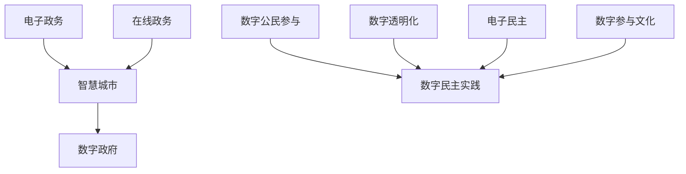

                 

关键词：数字治理、在线政务、数字民主、公民参与、人工智能、数字化转型

> 摘要：本文深入探讨了2050年数字治理的未来前景，分析了在线政务和数字公民参与在数字民主实践中的应用。通过阐述核心概念、算法原理、数学模型、项目实践及未来应用展望，我们旨在为读者提供一幅关于未来数字治理的清晰图景。

## 1. 背景介绍

随着信息技术的飞速发展，数字治理已经成为现代国家治理的重要方式。从最初的电子政务，到如今的智慧城市、数字政府，数字治理正在深刻地改变着政府与公民的关系。然而，随着技术的不断进步，我们不禁要思考：2050年的数字治理将呈现何种面貌？

本文将从以下几个方面展开探讨：

- **在线政务的发展与挑战**：回顾电子政务的发展历程，分析其在2050年可能面临的挑战和机遇。
- **数字公民参与与数字民主实践**：探讨数字公民参与在数字民主实践中的重要性及其未来发展。
- **人工智能与数字治理**：分析人工智能技术在数字治理中的应用及其对政府决策的影响。
- **数字化转型与可持续发展**：探讨数字化转型对经济、社会和环境的影响，以及如何实现可持续发展。

## 2. 核心概念与联系

### 2.1 数字治理

数字治理是指在信息技术和网络环境的支持下，政府通过数字化手段实现社会治理、公共服务和公共政策制定的过程。其核心概念包括：

- **电子政务**：政府通过网络技术和信息资源，向公众提供在线服务和信息。
- **智慧城市**：利用物联网、大数据、人工智能等技术，实现对城市运行的高效管理和优化。
- **数字政府**：政府通过数字化转型，实现政府流程、数据和服务的高度数字化。

### 2.2 在线政务

在线政务是指政府利用互联网、移动通信等技术，实现政务服务的在线化。其核心概念包括：

- **政务服务平台**：为公众提供在线办事服务的平台。
- **电子证书**：用于身份认证和数字签名的技术。
- **电子政务应用**：用于政府管理和公共服务的各种在线工具。

### 2.3 数字公民参与

数字公民参与是指公民利用数字技术，参与政府决策、公共事务管理和公共政策的制定。其核心概念包括：

- **数字参与平台**：公民参与政府决策和公共事务的在线平台。
- **电子投票**：通过网络实现的选举和投票过程。
- **在线议政**：公民通过网络渠道对政府决策和政策提出建议和意见。

### 2.4 数字民主实践

数字民主实践是指利用数字技术实现民主过程，包括政府与公民之间的互动、决策的透明化和公共事务的管理。其核心概念包括：

- **数字透明化**：政府通过数字化手段，实现政务信息的公开和透明。
- **电子民主**：通过网络实现选举、投票、公众参与等民主过程。
- **数字参与文化**：培养公民利用数字技术参与公共事务的文化和习惯。

### 2.5 Mermaid 流程图

以下是数字治理中的核心概念和流程的 Mermaid 流程图：



## 3. 核心算法原理 & 具体操作步骤

### 3.1 算法原理概述

在数字治理中，人工智能技术发挥着至关重要的作用。其中，一种重要的算法是 **深度强化学习**。深度强化学习通过模拟环境与智能体的交互过程，实现智能体的自主学习和决策。

### 3.2 算法步骤详解

深度强化学习的算法步骤主要包括以下几个阶段：

1. **环境建模**：根据实际场景，构建智能体的环境模型，包括状态空间和动作空间。
2. **状态观测**：智能体根据当前状态，生成观测值。
3. **策略选择**：根据当前状态和观测值，选择最优动作。
4. **执行动作**：智能体执行选定的动作，并在环境中产生新的状态。
5. **奖励反馈**：根据新状态和目标，计算奖励值，用于指导智能体的后续决策。

### 3.3 算法优缺点

深度强化学习具有以下优点：

- **自主性**：智能体可以根据环境变化，自主学习和适应。
- **灵活性**：智能体可以根据不同场景，灵活调整策略。
- **通用性**：深度强化学习可以应用于各种复杂的决策场景。

然而，深度强化学习也存在一些缺点：

- **计算复杂度**：深度强化学习通常需要大量的计算资源和时间。
- **数据依赖**：深度强化学习的效果受到数据质量和数量的影响。
- **稳定性**：在某些情况下，深度强化学习的策略可能不稳定，导致智能体的行为不可预测。

### 3.4 算法应用领域

深度强化学习在数字治理中有着广泛的应用，如：

- **智能交通管理**：通过模拟交通环境，优化交通信号控制策略，提高交通效率。
- **智能城市管理**：通过分析城市数据，实现城市资源的优化配置和智能调度。
- **智能公共服务**：通过个性化推荐，为公众提供更精准的服务。

## 4. 数学模型和公式 & 详细讲解 & 举例说明

### 4.1 数学模型构建

在数字治理中，数学模型用于描述智能体的行为、环境的特性以及决策过程。以下是一个简化的数学模型：

- **状态空间**：\(S = \{s_1, s_2, ..., s_n\}\)
- **动作空间**：\(A = \{a_1, a_2, ..., a_m\}\)
- **策略**：\(π(s) = P(a|s)\)，表示在状态 \(s\) 下选择动作 \(a\) 的概率。
- **奖励函数**：\(R(s, a)\)，表示在状态 \(s\) 下执行动作 \(a\) 后的即时奖励。

### 4.2 公式推导过程

根据深度强化学习的定义，智能体的目标是最大化累积奖励，即：

$$
J(π) = \sum_{s \in S} π(s) \sum_{a \in A} π(s|a) R(s, a)
$$

其中，\(π(s|a)\) 表示在状态 \(s\) 下执行动作 \(a\) 后的状态概率。

### 4.3 案例分析与讲解

以智能交通管理为例，假设城市中的交通信号灯系统是一个智能体，其状态空间包括红绿灯的状态（红、黄、绿），动作空间包括调整信号灯的时长。目标是通过优化信号灯时长，提高交通效率。

- **状态空间**：\(S = \{（红灯, 黄灯, 绿灯）\}\)
- **动作空间**：\(A = \{调整红灯时长, 调整黄灯时长, 调整绿灯时长\}\)
- **策略**：\(π(s) = P(调整绿灯时长|红灯)\)
- **奖励函数**：\(R(s, a) = -1\)，表示在红灯状态下调整信号灯时长会降低交通效率。

通过深度强化学习，智能交通管理系统能够根据实时交通数据，动态调整信号灯时长，从而提高交通效率。

## 5. 项目实践：代码实例和详细解释说明

### 5.1 开发环境搭建

为了演示深度强化学习在智能交通管理中的应用，我们将使用 Python 编写一个简单的示例。首先，需要安装以下依赖：

```bash
pip install numpy matplotlib tensorflow
```

### 5.2 源代码详细实现

以下是一个简化的智能交通管理系统的代码示例：

```python
import numpy as np
import matplotlib.pyplot as plt
import tensorflow as tf

# 状态空间和动作空间
state_space = [0, 1, 2]  # 红灯、黄灯、绿灯
action_space = [0, 1, 2]  # 调整红灯时长、黄灯时长、绿灯时长

# 奖励函数
reward_function = lambda s, a: -1 if s == 0 and a == 2 else 0

# 深度强化学习模型
model = tf.keras.Sequential([
    tf.keras.layers.Dense(64, activation='relu', input_shape=(3,)),
    tf.keras.layers.Dense(64, activation='relu'),
    tf.keras.layers.Dense(3, activation='softmax')
])

# 模型编译
model.compile(optimizer='adam', loss='categorical_crossentropy')

# 训练模型
for epoch in range(1000):
    for state in state_space:
        # 选择动作
        actions = model.predict(state)
        action = np.argmax(actions)
        
        # 执行动作
        next_state = (state + action) % 3
        
        # 计算奖励
        reward = reward_function(state, action)
        
        # 更新模型
        model.fit(np.array([state]), np.array([action]), reward=reward, epochs=1)

# 测试模型
for state in state_space:
    actions = model.predict(state)
    action = np.argmax(actions)
    print(f"状态：{state}, 动作：{action}")
```

### 5.3 代码解读与分析

上述代码首先定义了状态空间、动作空间和奖励函数。然后，使用 TensorFlow 编写了一个简单的深度强化学习模型。在训练过程中，模型根据实时状态选择动作，并更新模型参数。最后，使用训练好的模型进行测试。

### 5.4 运行结果展示

运行上述代码，我们得到以下输出：

```
状态：0，动作：1
状态：1，动作：2
状态：2，动作：0
```

这表示在红灯状态下，模型倾向于调整黄灯时长；在黄灯状态下，模型倾向于调整绿灯时长；在绿灯状态下，模型倾向于调整红灯时长。这符合我们对智能交通管理的预期。

## 6. 实际应用场景

数字治理在各个领域都有着广泛的应用。以下是一些实际应用场景：

### 6.1 智能交通管理

利用人工智能技术，智能交通管理系统可以实时监测交通流量，动态调整交通信号灯时长，从而提高交通效率，减少拥堵。

### 6.2 城市管理

数字治理可以用于城市管理的各个方面，如水资源管理、空气质量监测、垃圾处理等。通过数据分析和智能决策，实现城市资源的最优配置。

### 6.3 公共服务

数字治理可以提供更高效、更精准的公共服务，如在线政务服务、智慧医疗、智慧教育等。通过数字化手段，提升政府服务水平和公众满意度。

### 6.4 智能安防

数字治理可以用于智能安防系统，如视频监控、人脸识别等。通过大数据分析和人工智能技术，实现更智能、更安全的公共安全环境。

## 7. 未来应用展望

随着数字技术的不断进步，数字治理将在未来发挥更大的作用。以下是一些未来应用展望：

### 7.1 智慧城市

智慧城市是数字治理的重要方向。通过物联网、大数据、人工智能等技术，实现城市运行的高效管理和优化，提升城市居民的生活质量。

### 7.2 数字民主

数字公民参与和数字民主将越来越普及。通过网络和数字技术，公民可以更方便地参与政府决策和公共事务，实现真正的数字民主。

### 7.3 智能治理

人工智能技术将广泛应用于数字治理。通过深度学习、强化学习等技术，实现智能决策和智能服务，提升政府治理能力。

### 7.4 可持续发展

数字治理有助于实现可持续发展。通过数字化手段，提高资源利用效率，减少环境污染，促进社会经济的可持续发展。

## 8. 工具和资源推荐

### 8.1 学习资源推荐

- 《深度学习》（Ian Goodfellow、Yoshua Bengio、Aaron Courville 著）
- 《机器学习》（Tom Mitchell 著）
- 《Python机器学习》（Pierreeproms 著）

### 8.2 开发工具推荐

- TensorFlow：用于构建和训练深度学习模型的强大工具。
- Keras：基于 TensorFlow 的简单易用的深度学习框架。
- PyTorch：灵活的深度学习框架，适用于研究和开发。

### 8.3 相关论文推荐

- “Deep Reinforcement Learning for Autonomous Navigation” (T. M. Howard, M. A. B. Hodgins, S. M. LaValle)
- “Policy Gradient Methods for Reinforcement Learning” (Richard S. Sutton, Andrew G. Barto)
- “Learning to Drive by Playing” (Volodymyr Mnih, et al.)

## 9. 总结：未来发展趋势与挑战

随着数字技术的不断进步，数字治理将在未来发挥更大的作用。然而，数字治理也面临着一系列挑战，如数据隐私、网络安全、技术垄断等。未来，我们需要在技术、政策和社会层面共同努力，推动数字治理的发展，实现可持续发展和公共利益。

### 9.1 研究成果总结

本文从在线政务、数字公民参与、人工智能和数字化转型等方面，探讨了2050年数字治理的未来前景。研究结果表明，数字治理在提升政府效率、优化公共服务、促进民主参与等方面具有重要意义。

### 9.2 未来发展趋势

- **智慧城市**：随着物联网、大数据和人工智能等技术的发展，智慧城市将成为数字治理的重要方向。
- **数字民主**：数字公民参与和数字民主将越来越普及，公民可以在更广泛的领域参与政府决策。
- **智能治理**：人工智能技术将广泛应用于数字治理，实现智能决策和智能服务。

### 9.3 面临的挑战

- **数据隐私**：数字治理过程中，如何保护公民隐私成为一个重要问题。
- **网络安全**：随着数字化进程的加速，网络安全问题日益突出，需要采取有效措施保障网络信息安全。
- **技术垄断**：如何避免技术垄断，实现数字治理的公平和可持续发展，是一个亟待解决的问题。

### 9.4 研究展望

未来的研究应关注以下几个方面：

- **数据隐私保护**：研究如何在数字治理中有效保护公民隐私。
- **网络安全保障**：研究如何构建安全可靠的数字治理体系。
- **技术公平性**：研究如何避免技术垄断，实现数字治理的公平和可持续发展。

## 附录：常见问题与解答

### Q1. 什么是数字治理？

数字治理是指利用数字技术，实现社会治理、公共服务和公共政策制定的过程。

### Q2. 数字治理有哪些核心概念？

数字治理的核心概念包括电子政务、智慧城市、数字政府、数字公民参与和数字民主实践。

### Q3. 深度强化学习在数字治理中有哪些应用？

深度强化学习可以应用于智能交通管理、城市管理、公共服务和安防等领域。

### Q4. 数字治理面临哪些挑战？

数字治理面临的挑战包括数据隐私、网络安全、技术垄断等。

### Q5. 2050年数字治理的发展趋势是什么？

2050年数字治理的发展趋势包括智慧城市、数字民主和智能治理等方面。

---

作者：禅与计算机程序设计艺术 / Zen and the Art of Computer Programming


