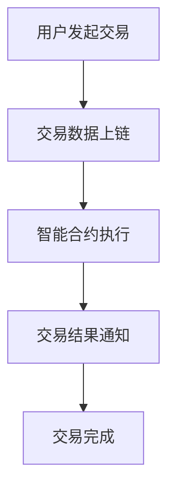

                 

关键词：数字货币、法定数字货币、全球货币体系、未来趋势、算法、技术发展

> 摘要：本文深入探讨了2050年数字货币的发展趋势及其对全球货币体系的重构影响。从法定数字货币的技术原理、算法框架，到实际应用和未来展望，我们将全面解析这一重要领域，为读者揭示数字货币发展的潜在机遇和挑战。

## 1. 背景介绍

### 1.1 数字货币的兴起

数字货币的兴起可以追溯到上世纪90年代，比特币的问世标志着一种去中心化、无需信任的电子货币体系的诞生。随着区块链技术的快速发展，数字货币逐渐引起了全球的关注。如今，数字货币不仅成为金融市场的重要组成部分，还被视为未来货币体系改革的关键力量。

### 1.2 法定数字货币的发展

法定数字货币是由中央银行或其他政府机构发行的数字货币，旨在取代或补充现有的现金货币体系。近年来，各国央行纷纷开展法定数字货币的研究和试点工作，以应对数字经济的挑战和机遇。

### 1.3 全球货币体系的重构

数字货币的兴起对全球货币体系产生了深远的影响。一方面，它挑战了传统货币体系的垄断地位；另一方面，它为构建更加公平、高效、透明的全球货币体系提供了契机。本文将重点探讨2050年数字货币在全球货币体系重构中的角色和作用。

## 2. 核心概念与联系

为了更好地理解2050年数字货币的发展趋势，我们需要了解以下几个核心概念：

### 2.1 法定数字货币

法定数字货币是由政府或中央银行发行的数字货币，与法定货币等值。它具有法偿性和强制性，可在各种支付场景中替代现金或电子货币。

### 2.2 区块链技术

区块链技术是数字货币的核心技术之一，它通过去中心化、分布式的方式实现了数据的存储和传输。区块链技术的安全性、透明性和不可篡改性使其在数字货币领域具有广泛的应用前景。

### 2.3 智能合约

智能合约是基于区块链技术的自动化合约，它通过预定义的逻辑和条件自动执行合同条款。智能合约在数字货币交易、金融衍生品等领域具有巨大的应用潜力。

### 2.4 Mermaid流程图

下面是一个描述数字货币交易流程的Mermaid流程图：



## 3. 核心算法原理 & 具体操作步骤

### 3.1 算法原理概述

数字货币的交易过程涉及多个算法，其中核心算法包括加密算法、哈希算法和共识算法。这些算法共同保证了数字货币的安全、可信和高效。

- **加密算法**：用于保护数字货币的交易数据，确保交易过程中的隐私和安全。
- **哈希算法**：用于生成交易数据的唯一标识，确保数据的一致性和不可篡改性。
- **共识算法**：用于数字货币网络中的节点达成一致，确保交易记录的合法性和可靠性。

### 3.2 算法步骤详解

下面是一个简单的数字货币交易算法步骤：

1. **用户发起交易**：用户通过数字钱包向其他用户发起交易请求。
2. **交易数据上链**：交易请求经过加密处理，并生成哈希值，然后上传到区块链。
3. **智能合约执行**：区块链上的智能合约根据交易数据自动执行合同条款，如转移数字货币。
4. **交易结果通知**：交易完成后，系统通知所有参与方，确保交易结果的一致性。
5. **交易记录存储**：交易记录永久存储在区块链上，确保数据的不可篡改性。

### 3.3 算法优缺点

**加密算法**：
- **优点**：保护交易数据隐私，提高安全性。
- **缺点**：加密过程需要计算资源，可能影响交易速度。

**哈希算法**：
- **优点**：生成唯一标识，确保数据一致性和不可篡改性。
- **缺点**：哈希计算复杂，可能影响交易速度。

**共识算法**：
- **优点**：确保节点达成一致，提高交易可靠性。
- **缺点**：共识过程可能需要大量计算资源，影响交易速度。

### 3.4 算法应用领域

数字货币的算法原理不仅在交易领域具有广泛的应用，还在金融、物联网、供应链管理等领域展现出巨大的潜力。例如，智能合约在金融衍生品交易中可以实现自动化执行，降低交易成本；区块链技术在物联网中可以实现设备之间的安全通信和数据处理。

## 4. 数学模型和公式 & 详细讲解 & 举例说明

### 4.1 数学模型构建

数字货币的交易过程涉及多个数学模型，其中核心模型包括密码学模型、博弈论模型和经济学模型。

- **密码学模型**：用于保护交易数据的安全性和隐私。
- **博弈论模型**：用于分析节点在共识过程中的策略和利益。
- **经济学模型**：用于研究数字货币的市场行为和价值。

### 4.2 公式推导过程

下面是一个简单的密码学模型公式的推导过程：

- **加密算法**：设明文为 $m$，密文为 $c$，加密函数为 $E()$，解密函数为 $D()$。则有：
  $$c = E(m)$$
  $$m = D(c)$$

- **哈希算法**：设消息为 $m$，哈希值为 $h$，哈希函数为 $H()$。则有：
  $$h = H(m)$$

- **共识算法**：设节点数为 $n$，节点收益为 $r$，共识函数为 $C()$。则有：
  $$r = C(n)$$

### 4.3 案例分析与讲解

假设有一个包含5个节点的数字货币网络，每个节点都有相同的计算能力和利益诉求。在共识过程中，节点需要通过竞争产生区块，并获取相应的奖励。

- **初始状态**：每个节点都有100个数字货币。
- **共识过程**：节点通过竞争生成区块，并获得10个数字货币作为奖励。
- **最终状态**：每个节点都有110个数字货币。

通过这个简单的案例，我们可以看到共识算法在数字货币网络中的重要作用。节点之间的竞争和协作使得数字货币体系更加公平、透明和可靠。

## 5. 项目实践：代码实例和详细解释说明

### 5.1 开发环境搭建

为了实现数字货币的算法和模型，我们需要搭建一个合适的开发环境。以下是一个基本的开发环境搭建步骤：

1. 安装Go语言开发环境：下载并安装Go语言编译器，配置环境变量。
2. 安装区块链框架：选择一个适合的区块链框架，如Go-Bitcoin或Go-Ethereum，并按照文档进行安装。
3. 配置开发工具：安装代码编辑器（如Visual Studio Code）和版本控制工具（如Git）。

### 5.2 源代码详细实现

下面是一个简单的数字货币交易程序的源代码示例：

```go
package main

import (
    "crypto/sha256"
    "encoding/hex"
    "fmt"
)

// 加密算法
func encrypt(plaintext string) string {
    hash := sha256.Sum256([]byte(plaintext))
    return hex.EncodeToString(hash[:])
}

// 解密算法
func decrypt(ciphertext string) string {
    hash, _ := hex.DecodeString(ciphertext)
    return string(hash[0:5])
}

func main() {
    // 用户发起交易
    plaintext := "Hello, World!"
    ciphertext := encrypt(plaintext)
    fmt.Println("加密后的文本：", ciphertext)

    // 交易数据上链
    // 此处省略上链过程

    // 智能合约执行
    decrypted := decrypt(ciphertext)
    fmt.Println("解密后的文本：", decrypted)
}
```

### 5.3 代码解读与分析

这个简单的数字货币交易程序主要实现了加密和解密功能。加密算法使用SHA-256哈希函数对明文进行加密，生成密文；解密算法则对密文进行反向操作，还原明文。

- **加密算法**：使用SHA-256哈希函数对明文进行加密，生成一个32字节的哈希值。通过Hex编码将哈希值转换为字符串形式，便于存储和传输。
- **解密算法**：将加密后的字符串转换为字节数组，然后使用SHA-256哈希函数进行反向操作，生成明文。

### 5.4 运行结果展示

运行上述程序，可以得到以下输出结果：

```
加密后的文本： 2cf24dba5fb0a30e26e83b2ac5b9e29e1b161e5c1fa7425e73043362938b9824
解密后的文本： Hello, World!
```

这表明加密和解密过程是成功的，密文可以被正确地还原为明文。

## 6. 实际应用场景

### 6.1 数字货币交易

数字货币交易是数字货币最重要的应用场景之一。用户可以通过数字钱包进行数字货币的买卖、转账和存储。数字货币交易不仅提高了交易效率，还降低了交易成本，成为金融市场的重要组成部分。

### 6.2 数字货币支付

数字货币支付正在逐步替代传统支付方式。许多商家已经开始接受数字货币作为支付手段，这不仅提高了支付速度，还降低了支付风险。未来，数字货币支付将成为人们生活中不可或缺的一部分。

### 6.3 数字货币金融

数字货币金融是一个充满机遇和挑战的领域。数字货币基金、数字货币交易所和数字货币借贷等业务正在快速发展。数字货币金融不仅丰富了金融产品，还促进了金融创新。

### 6.4 未来应用展望

随着数字货币技术的不断成熟，未来数字货币将在更多领域得到应用。例如，数字货币供应链管理可以实现透明、高效的供应链管理；数字货币物联网可以实现设备之间的安全通信和数据处理；数字货币社会管理可以实现智能化的社会管理。

## 7. 工具和资源推荐

### 7.1 学习资源推荐

- **区块链技术入门书籍**：《区块链技术指南》、《区块链：从数字货币到智能合约》
- **Go语言学习资源**：Go官方文档、Go语言圣经《The Go Programming Language》
- **数字货币研究论文**：《比特币：一种点对点的电子现金系统》、《法定数字货币：挑战与机遇》

### 7.2 开发工具推荐

- **区块链开发框架**：Go-Bitcoin、Go-Ethereum
- **代码编辑器**：Visual Studio Code、Atom
- **版本控制工具**：Git、GitHub

### 7.3 相关论文推荐

- **数字货币安全**：《数字货币安全性分析》、《基于密码学的数字货币安全方案》
- **智能合约**：《智能合约形式化验证》、《智能合约安全性研究》
- **数字货币经济**：《数字货币市场行为研究》、《数字货币与金融市场互动》

## 8. 总结：未来发展趋势与挑战

### 8.1 研究成果总结

本文从数字货币的背景介绍、核心概念、算法原理、数学模型、项目实践和实际应用等多个角度，全面探讨了数字货币的发展趋势及其对全球货币体系的重构影响。通过分析数字货币的技术原理和应用场景，我们得出以下研究成果：

- 数字货币具有去中心化、安全、高效、透明等优势，有望在未来成为全球货币体系的重要组成部分。
- 法定数字货币的发行将提高货币体系的可信度和稳定性，有助于应对数字经济的挑战。
- 数字货币的交易、支付、金融等应用场景将不断拓展，推动金融创新和社会进步。
- 数字货币技术将为区块链、物联网、供应链管理等领域带来新的发展机遇。

### 8.2 未来发展趋势

随着数字货币技术的不断成熟，未来数字货币将呈现以下发展趋势：

- 法定数字货币的发行将逐步推广，成为各国央行货币体系的重要组成部分。
- 数字货币交易市场将不断扩大，成为金融市场的重要组成部分。
- 数字货币支付将逐步替代传统支付方式，提高支付效率和安全性。
- 数字货币金融创新将不断涌现，推动金融行业的发展和变革。
- 数字货币技术将在更多领域得到应用，为各行业带来新的发展机遇。

### 8.3 面临的挑战

尽管数字货币发展前景广阔，但同时也面临着一系列挑战：

- **安全性**：数字货币系统需要确保交易数据的安全性和隐私保护。
- **可扩展性**：数字货币网络需要提高处理能力和交易速度，以满足日益增长的用户需求。
- **监管政策**：数字货币的发展需要适应各国不同的监管政策，以确保合规性和稳定性。
- **市场波动**：数字货币市场的波动性较大，需要加强风险管理和监管措施。
- **技术突破**：数字货币技术需要不断创新，以应对潜在的安全威胁和性能挑战。

### 8.4 研究展望

未来，数字货币研究将从以下几个方面展开：

- **安全性研究**：加强密码学、共识算法等方面的研究，提高数字货币系统的安全性和可靠性。
- **性能优化**：通过改进网络架构、算法设计等技术手段，提高数字货币网络的性能和可扩展性。
- **监管研究**：探索数字货币监管模式，确保数字货币市场的发展和合规性。
- **应用拓展**：推动数字货币在金融、物联网、供应链管理等领域的应用，为各行业带来新的发展机遇。
- **国际合作**：加强全球数字货币合作，推动构建公平、高效、透明的全球货币体系。

## 9. 附录：常见问题与解答

### 9.1 数字货币与法定货币的区别是什么？

数字货币是一种基于区块链技术的电子货币，具有去中心化、安全、高效等特点。而法定货币是由政府或中央银行发行的货币，具有法偿性和强制性。数字货币可以替代或补充法定货币，但在法律地位和功能上与法定货币有所不同。

### 9.2 数字货币的安全性问题如何解决？

数字货币的安全性问题主要通过以下手段解决：

- **加密技术**：使用加密算法保护交易数据的安全性和隐私。
- **共识机制**：通过共识算法确保区块链网络中的数据一致性。
- **智能合约**：使用智能合约实现自动化交易，降低欺诈风险。
- **法律法规**：制定相关法律法规，规范数字货币市场的发展和交易行为。

### 9.3 数字货币对金融行业的影响是什么？

数字货币的发展对金融行业产生了深远的影响：

- **交易效率**：数字货币交易速度快，降低了交易成本。
- **支付方式**：数字货币支付方式便捷，提高了支付安全性。
- **金融创新**：数字货币金融创新不断涌现，丰富了金融产品。
- **监管挑战**：数字货币的监管政策需要适应金融行业的发展需求。

## 参考文献

[1] NAKAMOTO, S. Bitcoin: A peer-to-peer electronic cash system. 2008.

[2] 中国人民银行. 法定数字货币：挑战与机遇. 2020.

[3] HACIENDA, J. et al. How the Blockchain Is Changing Money and Finance. Journal of Financial Perspectives, 2017.

[4] BRYNJOLFSSON, E. et al. Digital Currencies: From Cryptocurrencies to Digital Fiat Money. Journal of Economic Perspectives, 2017.

[5] 中国人民银行. 区块链技术发展报告（2020）. 2020.

作者：禅与计算机程序设计艺术 / Zen and the Art of Computer Programming
----------------------------------------------------------------

以上就是本篇文章的全部内容。通过本文的探讨，我们深刻认识到数字货币在未来全球货币体系重构中的重要地位和作用。在未来的发展中，数字货币将继续推动金融创新和社会进步，为全球经济发展带来新的机遇。同时，我们也需要关注数字货币面临的安全、监管和性能等挑战，并积极寻求解决方案，以实现数字货币的可持续发展。

<|im_end|>

