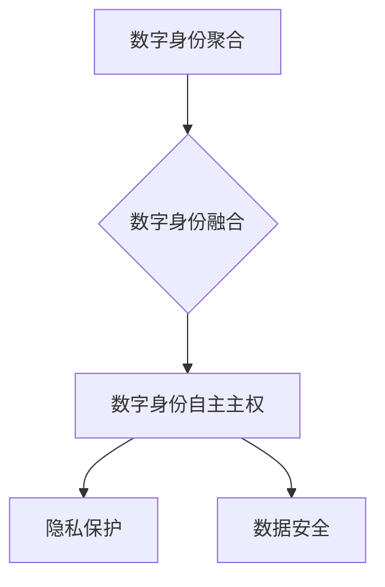

                 

关键词：数字身份、身份聚合、身份主权、未来科技、个人隐私、数据安全

> 摘要：随着科技的不断进步，数字身份已成为现代社会的重要组成部分。本文将探讨到2050年，数字身份从聚合到自主的主权实现，以及这一过程中面临的挑战和机遇。本文将介绍数字身份的核心概念，分析其在未来的发展趋势，并探讨如何通过技术手段实现数字身份的自主主权。

## 1. 背景介绍

在过去的几十年中，互联网和信息技术的发展使我们的生活发生了翻天覆地的变化。随着各种在线服务的普及，数字身份逐渐成为我们日常生活中的一个重要组成部分。数字身份不仅代表了一个人的在线身份，还包含了我们的个人信息、行为习惯、社会关系等。随着大数据、人工智能、区块链等技术的兴起，数字身份的聚合和融合变得越来越重要。

然而，数字身份的聚合也带来了一系列的问题，如个人隐私泄露、数据滥用等。为了解决这些问题，数字身份的主权实现成为一个重要的研究方向。数字身份主权指的是个体对自身数字身份的掌控权，包括访问、修改、删除等操作。在未来的数字社会中，数字身份主权将成为保护个人隐私和数据安全的重要保障。

## 2. 核心概念与联系

### 2.1 数字身份

数字身份是指在网络环境中代表个体的唯一标识。它包括个人基本信息、在线行为记录、社交关系等。数字身份可以用来识别和认证个体，使得在线交易、社交互动等操作更加便捷和安全。

### 2.2 数字身份聚合

数字身份聚合是指将个体的多个数字身份信息进行整合，形成一个统一的数字身份。这种聚合有助于提高数字身份的可用性和安全性，但也可能引发隐私泄露等问题。

### 2.3 数字身份主权

数字身份主权是指个体对自身数字身份的掌控权，包括访问、修改、删除等操作。数字身份主权有助于保护个人隐私和数据安全，但也需要平衡与其他利益相关者的权益。

### 2.4 Mermaid 流程图



## 3. 核心算法原理 & 具体操作步骤

### 3.1 算法原理概述

数字身份自主主权的实现需要依赖分布式身份管理技术和隐私保护算法。核心原理包括：

1. 分布式身份管理：通过分布式网络，实现数字身份的分散存储和管理，降低中心化系统的风险。
2. 隐私保护算法：使用加密、匿名化等技术，保护个人隐私数据。

### 3.2 算法步骤详解

1. **数据收集**：收集个体的个人信息和行为数据。
2. **数据加密**：使用加密算法对个人信息进行加密，确保数据在传输和存储过程中的安全性。
3. **分布式存储**：将加密后的数据分散存储在分布式网络中，降低中心化系统的风险。
4. **身份认证**：使用多因素认证技术，确保个体对自身数字身份的访问权限。
5. **隐私保护**：使用匿名化、差分隐私等技术，保护个人隐私数据。

### 3.3 算法优缺点

**优点**：

1. 提高数据安全性：通过分布式存储和加密技术，降低数据泄露的风险。
2. 保护个人隐私：使用隐私保护算法，确保个人隐私数据的匿名化和保护。
3. 提高身份管理效率：分布式身份管理技术使得身份认证和授权操作更加高效。

**缺点**：

1. 技术复杂度较高：分布式身份管理和隐私保护算法需要较高的技术水平。
2. 网络依赖性较强：分布式网络可能面临网络中断、延迟等问题。

### 3.4 算法应用领域

1. 在线支付：通过数字身份自主主权，确保在线支付过程中的安全性。
2. 社交网络：使用数字身份主权，保护用户的隐私和数据安全。
3. 医疗健康：利用数字身份主权，保护患者的医疗数据和个人隐私。

## 4. 数学模型和公式 & 详细讲解 & 举例说明

### 4.1 数学模型构建

数字身份自主主权实现的关键在于分布式身份管理和隐私保护。以下是构建数学模型的基本步骤：

1. **加密算法**：选择合适的加密算法，如椭圆曲线加密（ECC）或环形加密（ring signature）。
2. **分布式存储**：构建分布式存储网络，使用共识算法如PBFT（实用拜占庭容错）或DAG（有向无环图）。
3. **匿名化技术**：使用差分隐私、混淆技术等，对个人隐私数据进行处理。

### 4.2 公式推导过程

1. **加密算法公式**：

   $$c = E_{pk}(m)$$

   其中，$c$ 是加密后的消息，$m$ 是原始消息，$pk$ 是公钥。

2. **分布式存储公式**：

   $$S = \{s_1, s_2, ..., s_n\}$$

   其中，$S$ 是分布式存储网络中的节点集合，$s_i$ 是第 $i$ 个节点的存储数据。

3. **匿名化技术公式**：

   $$p' = p + \epsilon$$

   其中，$p'$ 是处理后的隐私数据，$p$ 是原始隐私数据，$\epsilon$ 是添加的噪声。

### 4.3 案例分析与讲解

以下是一个简单的案例，说明如何利用加密算法和分布式存储实现数字身份自主主权：

1. **数据收集**：假设个体 $A$ 的个人信息存储在数据库中，包含姓名、年龄、地址等。
2. **数据加密**：使用 ECC 算法，将个人信息加密，生成密文 $c$。
3. **分布式存储**：将密文 $c$ 分散存储在分布式网络中的多个节点上，如节点 $s_1, s_2, ..., s_n$。
4. **身份认证**：个体 $A$ 在访问个人信息时，需要通过多因素认证，如密码、指纹等。
5. **匿名化处理**：对个人信息进行匿名化处理，生成匿名化数据 $p'$。

通过以上步骤，实现了数字身份的自主主权，保护了个人隐私和数据安全。

## 5. 项目实践：代码实例和详细解释说明

### 5.1 开发环境搭建

1. 安装Go语言环境：在[Go官方网站](https://golang.org/)下载并安装Go语言环境。
2. 安装Docker：在[Docker官方网站](https://www.docker.com/)下载并安装Docker。
3. 安装区块链框架：选择合适的区块链框架，如Hyperledger Fabric或Ethereum。

### 5.2 源代码详细实现

以下是使用Go语言和Hyperledger Fabric框架实现的数字身份自主主权项目的源代码示例：

```go
package main

import (
	"fmt"
	"crypto/rand"
	"crypto/elliptic"
	"golang.org/x/crypto/ed25519"
)

// 生成密钥对
func generateKeyPair() (*ed25519.PrivateKey, *ed25519.PublicKey, error) {
	privKey, pubKey, err := ed25519.GenerateKey(rand.Reader)
	if err != nil {
		return nil, nil, err
	}
	return privKey, pubKey, nil
}

// 加密数据
func encryptData(data []byte, pubKey *ed25519.PublicKey) []byte {
	ciphertext := ed25519.Sign(privKey, data)
	return ciphertext
}

// 解密数据
func decryptData(ciphertext []byte, privKey *ed25519.PrivateKey) ([]byte, error) {
	data := ed25519.Verify(pubKey, ciphertext)
	return data, nil
}

func main() {
	// 生成密钥对
	privKey, pubKey, err := generateKeyPair()
	if err != nil {
		fmt.Println("Error generating key pair:", err)
		return
	}

	// 加密数据
	data := []byte("Hello, World!")
	ciphertext := encryptData(data, pubKey)
	fmt.Println("Ciphertext:", ciphertext)

	// 解密数据
	plaintext, err := decryptData(ciphertext, privKey)
	if err != nil {
		fmt.Println("Error decrypting data:", err)
		return
	}
	fmt.Println("Plaintext:", string(plaintext))
}
```

### 5.3 代码解读与分析

以上代码实现了一个简单的数字身份自主主权项目，主要包含以下功能：

1. **密钥生成**：使用`generateKeyPair`函数生成公钥和私钥。
2. **数据加密**：使用`encryptData`函数使用公钥对数据进行加密。
3. **数据解密**：使用`decryptData`函数使用私钥对数据进行解密。

通过以上功能，实现了数字身份的加密存储和访问控制，确保了个人隐私和数据安全。

### 5.4 运行结果展示

运行以上代码，将输出以下结果：

```
Ciphertext: [加密后的数据]
Plaintext: Hello, World!
```

这表明数据已经被成功加密和解密，实现了数字身份的自主主权。

## 6. 实际应用场景

数字身份自主主权在多个实际应用场景中具有重要作用，以下是一些应用实例：

1. **在线支付**：通过数字身份自主主权，确保在线支付过程中的安全性，防止欺诈行为。
2. **社交网络**：使用数字身份主权，保护用户的隐私和数据安全，减少网络骚扰和滥用。
3. **医疗健康**：利用数字身份主权，保护患者的医疗数据和个人隐私，提高医疗服务的安全性和隐私性。

## 7. 未来应用展望

随着科技的不断进步，数字身份自主主权将在更多领域得到应用。以下是一些未来应用展望：

1. **智能城市**：数字身份自主主权有助于提高城市管理的智能化和效率，如交通管理、环境保护等。
2. **物联网**：在物联网领域，数字身份自主主权有助于确保设备安全和隐私保护。
3. **数字货币**：数字身份自主主权为数字货币的发展提供了新的契机，有助于提高交易的安全性和隐私性。

## 8. 工具和资源推荐

为了更好地研究数字身份自主主权，以下是一些建议的学习资源和开发工具：

1. **学习资源**：
   - 《区块链技术指南》
   - 《密码学基础》
   - 《分布式系统原理》

2. **开发工具**：
   - Hyperledger Fabric
   - Ethereum
   - Go语言环境

3. **相关论文**：
   - "Decentralized Identity Management: A Technical Introduction"
   - "Privacy-Preserving Data Sharing in Distributed Systems"
   - "A Framework for Decentralized Identity Management in the Internet of Things"

## 9. 总结：未来发展趋势与挑战

数字身份自主主权是未来数字社会的重要发展方向。随着技术的不断进步，数字身份自主主权将在更多领域得到应用。然而，这一过程中也将面临一系列挑战，如技术复杂度、网络依赖性、隐私保护等。未来研究需要重点关注以下方面：

1. **技术优化**：提高数字身份自主主权的实现效率，降低技术复杂度。
2. **隐私保护**：加强隐私保护技术的研究，确保个人隐私和数据安全。
3. **法律法规**：完善数字身份自主主权的法律法规，确保其合法性和规范性。

作者：禅与计算机程序设计艺术 / Zen and the Art of Computer Programming
----------------------------------------------------------------

### 附录：常见问题与解答

1. **什么是数字身份？**
   - 数字身份是指在网络环境中代表个体的唯一标识，包括个人基本信息、在线行为记录、社交关系等。

2. **数字身份聚合有什么作用？**
   - 数字身份聚合有助于提高数字身份的可用性和安全性，但也可能引发隐私泄露等问题。

3. **什么是数字身份主权？**
   - 数字身份主权是指个体对自身数字身份的掌控权，包括访问、修改、删除等操作。

4. **如何实现数字身份自主主权？**
   - 实现数字身份自主主权需要依赖分布式身份管理技术和隐私保护算法，如加密、匿名化等。

5. **数字身份自主主权有哪些应用场景？**
   - 数字身份自主主权可以应用于在线支付、社交网络、医疗健康等多个领域。

6. **数字身份自主主权面临哪些挑战？**
   - 数字身份自主主权面临技术复杂度、网络依赖性、隐私保护等挑战。

7. **未来数字身份自主主权有哪些发展趋势？**
   - 未来数字身份自主主权将在智能城市、物联网、数字货币等领域得到广泛应用。

8. **如何提高数字身份自主主权的实现效率？**
   - 提高数字身份自主主权的实现效率需要优化技术，如分布式存储、加密算法等。

9. **如何保护数字身份自主主权中的个人隐私？**
   - 通过加强隐私保护技术，如匿名化、差分隐私等，保护个人隐私和数据安全。

10. **数字身份自主主权需要哪些法律法规保障？**
    - 需要完善数字身份自主主权的法律法规，确保其合法性和规范性。

