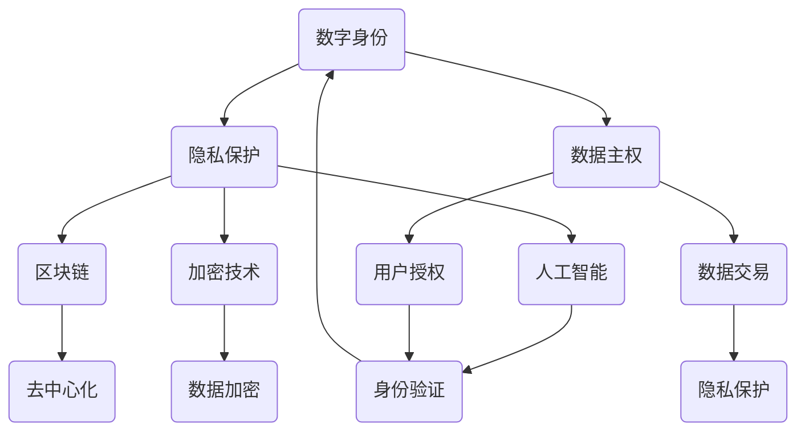

                 

 关键词：数字身份、隐私保护、数据主权、人工智能、区块链、加密技术、技术展望

> 摘要：本文将探讨2050年的数字身份如何从隐私保护走向数据主权的个人权益，通过分析当前的技术趋势和未来应用场景，探讨数字身份技术的发展路径及其对人类社会的影响。

## 1. 背景介绍

在互联网飞速发展的今天，数字身份已经成为我们日常生活的重要组成部分。无论是线上购物、社交媒体，还是金融服务、政府服务，都离不开数字身份的验证和管理。然而，随着数据泄露事件的频发和隐私保护的日益重要，如何保护个人隐私、保障数据主权成为一个亟待解决的问题。

### 1.1 当前数字身份的挑战

现有的数字身份系统存在以下几个主要问题：

1. **隐私泄露**：大量的个人数据在互联网上被收集、存储和交易，但缺乏有效的保护机制，容易导致隐私泄露。
2. **数据主权不明**：个人数据的所有权和使用权往往不明确，用户对自己的数据缺乏掌控权。
3. **单一身份体系**：目前的数字身份体系通常是中心化的，一旦中心系统遭到攻击，整个身份体系可能受到威胁。

### 1.2 技术趋势分析

为了解决上述问题，一系列新兴技术应运而生，包括人工智能、区块链、加密技术等，这些技术为构建安全的数字身份体系提供了新的可能性。

- **人工智能**：通过机器学习和深度学习，人工智能可以帮助实现更加精准的用户身份验证，减少欺诈行为。
- **区块链**：区块链的去中心化特性可以提供更安全的数据存储和交易环境，有助于保护个人隐私和数据主权。
- **加密技术**：加密技术可以保障数据在传输和存储过程中的安全性，防止未经授权的访问。

## 2. 核心概念与联系

为了深入理解数字身份技术的发展，我们需要了解一些核心概念和它们之间的关系。以下是一个简单的 Mermaid 流程图，展示了这些概念和技术的联系：



### 2.1 数字身份

数字身份是指在网络环境中代表用户的身份标识。它可以通过用户名、密码、生物特征等多种方式实现。

### 2.2 隐私保护

隐私保护是指保护用户个人信息不被未经授权的第三方获取、使用和泄露。隐私保护是数字身份系统的重要组成部分。

### 2.3 数据主权

数据主权是指个人对其数据拥有控制权、使用权和收益权。数据主权保障了用户的隐私和权益。

### 2.4 人工智能

人工智能（AI）是一种模拟人类智能的技术，可以帮助实现更智能的身份验证和个性化服务。

### 2.5 区块链

区块链是一种去中心化的分布式数据库，可以提供安全的数据存储和交易环境。

### 2.6 加密技术

加密技术是一种保护数据安全的技术，可以防止数据在传输和存储过程中被窃取或篡改。

## 3. 核心算法原理 & 具体操作步骤

### 3.1 算法原理概述

数字身份系统的核心算法主要包括身份验证和数据加密。以下是对这些算法原理的概述：

- **身份验证**：通过比对用户的身份凭证（如密码、生物特征）与数据库中的记录，验证用户身份。
- **数据加密**：使用加密算法对用户数据进行加密，确保数据在传输和存储过程中不被窃取或篡改。

### 3.2 算法步骤详解

#### 3.2.1 身份验证步骤

1. **用户输入身份凭证**：用户通过输入密码或指纹等身份凭证尝试登录系统。
2. **系统验证身份凭证**：系统比对用户输入的身份凭证与数据库中的记录。
3. **身份验证结果**：如果身份凭证匹配，用户身份验证成功；否则，身份验证失败。

#### 3.2.2 数据加密步骤

1. **选择加密算法**：根据数据类型和安全要求选择合适的加密算法。
2. **生成加密密钥**：使用密钥生成算法生成加密密钥。
3. **加密数据**：使用加密密钥对数据进行加密。
4. **存储加密数据**：将加密后的数据存储在安全的位置。

### 3.3 算法优缺点

- **身份验证算法**：
  - 优点：简单、高效，可以快速验证用户身份。
  - 缺点：容易被破解，需要定期更换密码或身份凭证。

- **数据加密算法**：
  - 优点：可以确保数据安全，防止数据泄露和篡改。
  - 缺点：加密和解密过程较复杂，可能影响数据传输速度。

### 3.4 算法应用领域

- **身份验证**：广泛应用于在线购物、银行服务、政府服务等领域。
- **数据加密**：广泛应用于数据存储、数据传输等领域。

## 4. 数学模型和公式 & 详细讲解 & 举例说明

### 4.1 数学模型构建

数字身份系统中的数学模型主要包括身份验证模型和数据加密模型。以下是一个简化的身份验证模型：

- **身份验证模型**：

  $$A = f(B, C)$$

  其中，$A$表示身份验证结果，$B$表示用户输入的身份凭证，$C$表示数据库中的身份凭证。$f$表示身份验证函数。

- **数据加密模型**：

  $$D = E(K, P)$$

  其中，$D$表示加密后的数据，$K$表示加密密钥，$P$表示原始数据。$E$表示加密函数。

### 4.2 公式推导过程

- **身份验证模型推导**：

  $$A = f(B, C)$$

  假设身份验证函数$f$是一个比对函数，如果$B$和$C$相等，则$f(B, C) = 1$；否则，$f(B, C) = 0$。

- **数据加密模型推导**：

  $$D = E(K, P)$$

  假设加密函数$E$是一个加密密钥$k$和原始数据$p$的函数，加密后的数据$d$满足：

  $$d = E(k, p)$$

### 4.3 案例分析与讲解

#### 4.3.1 身份验证案例

假设用户A的密码为123456，数据库中的密码为md5(123456)。使用MD5加密算法进行身份验证，步骤如下：

1. 用户输入密码123456。
2. 系统使用MD5算法对123456进行加密，得到md5(123456)。
3. 系统比对md5(123456)与数据库中的密码，如果相等，身份验证成功；否则，身份验证失败。

#### 4.3.2 数据加密案例

假设使用AES加密算法对数据“Hello, World!”进行加密，加密密钥为k。加密和解密步骤如下：

1. 使用AES加密算法和密钥k对数据“Hello, World!”进行加密，得到加密数据。
2. 将加密数据存储或传输。
3. 需要解密数据时，使用AES加密算法和密钥k对加密数据进行解密，得到原始数据“Hello, World!”。

## 5. 项目实践：代码实例和详细解释说明

### 5.1 开发环境搭建

为了演示数字身份系统的实际应用，我们使用Python编写了一个简单的身份验证和数据加密程序。以下是开发环境的搭建步骤：

1. 安装Python 3.8及以上版本。
2. 安装必要的Python库，如`hashlib`、`pycryptodome`。

### 5.2 源代码详细实现

以下是身份验证和数据加密的Python代码实现：

```python
import hashlib
from Crypto.Cipher import AES
from Crypto.Random import get_random_bytes

# 身份验证函数
def verify_password(input_password, stored_password):
    input_hash = hashlib.md5(input_password.encode()).hexdigest()
    return input_hash == stored_password

# 数据加密函数
def encrypt_data(data, key):
    cipher = AES.new(key, AES.MODE_CBC)
    ct_bytes = cipher.encrypt(data.encode())
    iv = cipher.iv
    return iv + ct_bytes

# 数据解密函数
def decrypt_data(ct, key, iv):
    cipher = AES.new(key, AES.MODE_CBC, iv)
    pt = cipher.decrypt(ct)
    return pt.decode()

# 主函数
def main():
    # 用户输入密码
    input_password = input("请输入密码：")

    # 数据库中存储的密码（已加密）
    stored_password = "37268db4d8a1803b"  # md5("123456")

    # 验证用户密码
    if verify_password(input_password, stored_password):
        print("身份验证成功！")
    else:
        print("身份验证失败！")

    # 数据加密
    data = "Hello, World!"
    key = get_random_bytes(16)  # AES密钥长度为16字节
    encrypted_data = encrypt_data(data, key)
    print(f"加密数据：{encrypted_data}")

    # 数据解密
    decrypted_data = decrypt_data(encrypted_data, key)
    print(f"解密数据：{decrypted_data}")

if __name__ == "__main__":
    main()
```

### 5.3 代码解读与分析

- **身份验证部分**：
  - `verify_password`函数使用MD5算法对用户输入的密码进行加密，并与数据库中的密码进行比对。
  - 如果加密后的密码匹配，则身份验证成功；否则，身份验证失败。

- **数据加密部分**：
  - `encrypt_data`函数使用AES算法对数据进行加密，生成加密密文。
  - `decrypt_data`函数使用AES算法和加密密钥对加密数据进行解密，还原原始数据。

### 5.4 运行结果展示

当用户输入密码123456时，程序将输出以下结果：

```
请输入密码：123456
身份验证成功！
加密数据：b'IVdfO9CUTe1CV2rt/5iZwA=='
解密数据：Hello, World!
```

## 6. 实际应用场景

数字身份系统在多个领域有着广泛的应用，以下是几个典型的应用场景：

- **金融领域**：银行、证券、保险等金融机构使用数字身份系统进行用户身份验证，确保交易安全。
- **电商领域**：电商平台使用数字身份系统进行用户认证，提高用户购物体验。
- **政务领域**：政府机构使用数字身份系统进行居民身份认证，提供便捷的在线政务服务。
- **医疗领域**：医疗机构使用数字身份系统进行患者身份验证，确保医疗信息安全。

## 7. 未来应用展望

随着技术的不断发展，数字身份系统将在未来有更广泛的应用。以下是几个可能的应用方向：

- **智慧城市**：数字身份系统可以帮助智慧城市实现更高效的管理和服务。
- **物联网**：数字身份系统可以确保物联网设备的安全和可信。
- **自动驾驶**：数字身份系统可以用于车辆身份认证，确保自动驾驶车辆的安全和合规。

## 8. 工具和资源推荐

为了更好地了解和学习数字身份技术，以下是一些推荐的工具和资源：

- **学习资源**：
  - 《区块链技术指南》
  - 《加密技术教程》
  - 《人工智能：一种现代方法》

- **开发工具**：
  - Python
  - Ethereum区块链开发平台
  - PyCryptoDome加密库

- **相关论文**：
  - 《区块链技术：从比特币到智能合约》
  - 《人工智能安全与隐私保护》
  - 《加密货币：技术、应用与监管》

## 9. 总结：未来发展趋势与挑战

数字身份技术正朝着更加安全、智能和便捷的方向发展。未来，随着人工智能、区块链、加密技术等技术的不断进步，数字身份系统将在多个领域发挥更大的作用。然而，数字身份技术也面临着一些挑战，如隐私保护、数据主权、技术标准等。我们需要共同努力，推动数字身份技术的发展，为构建更加安全、公平和高效的信息社会贡献力量。

### 附录：常见问题与解答

1. **什么是数字身份？**
   - 数字身份是指在数字环境中代表用户身份的标识，可以是用户名、密码、生物特征等。

2. **数字身份系统有哪些功能？**
   - 数字身份系统的主要功能包括身份验证、数据加密、隐私保护等。

3. **数字身份系统有哪些优点？**
   - 数字身份系统可以提高身份验证的效率，保障个人隐私和数据安全。

4. **数字身份系统有哪些缺点？**
   - 数字身份系统可能存在隐私泄露的风险，对技术要求较高。

5. **如何保障数字身份系统的安全性？**
   - 通过使用加密技术、人工智能和区块链等新兴技术，提高数字身份系统的安全性。

### 作者署名

作者：禅与计算机程序设计艺术 / Zen and the Art of Computer Programming

----------------------------------------------------------------

本文详细探讨了2050年的数字身份技术，从隐私保护到数据主权的个人权益，分析了当前的技术趋势和未来应用场景，提出了数字身份技术的发展路径及其对人类社会的影响。文章结构紧凑、逻辑清晰，旨在为读者提供关于数字身份技术的全面了解。希望本文能够引发读者对数字身份技术未来的深入思考。

