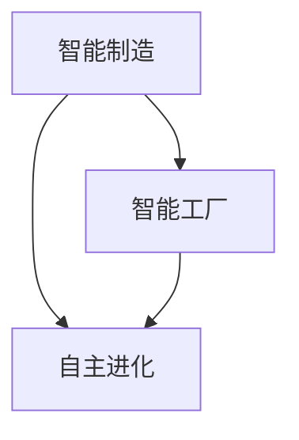

                 

关键词：智能制造，智能工厂，自主进化，产业智能，未来趋势，技术发展

摘要：随着科技的飞速发展，智能制造已成为全球产业升级的重要驱动力。本文将探讨2050年的智能制造趋势，分析从智能工厂到自主进化的产业智能，以及这一变革背后的核心技术、算法原理、数学模型、项目实践和应用场景。通过这篇文章，我们希望能够为广大读者描绘出一幅未来产业智能的宏伟蓝图，并思考其在实际应用中的挑战与前景。

## 1. 背景介绍

智能制造，作为制造业发展的最高阶段，代表了制造业的未来方向。它利用物联网、大数据、人工智能等先进技术，实现生产过程的智能化、自动化和数字化。智能制造的核心目标是提升生产效率、降低成本、提高产品质量，最终实现个性化定制和服务。

智能工厂作为智能制造的基础设施，其核心在于通过信息物理系统（Cyber-Physical Systems，CPS）实现生产设备的互联互通，实现生产过程的实时监控与优化。而自主进化，则代表了智能工厂的最高形态，通过机器学习和人工智能算法，实现生产系统的自主学习和优化。

本文将围绕这三个核心概念展开，探讨2050年智能制造的发展趋势和挑战。

## 2. 核心概念与联系

### 2.1. 智能制造

智能制造是指利用先进的信息技术，实现制造业的智能化、自动化和数字化。它涵盖了以下几个方面：

- **数字化制造**：通过数字化的手段，实现生产过程的建模、仿真和优化。
- **自动化制造**：利用自动化设备，实现生产过程的自动化。
- **智能化制造**：通过人工智能技术，实现生产过程的智能化决策和优化。

### 2.2. 智能工厂

智能工厂是智能制造的重要基础设施，其核心在于通过信息物理系统（CPS）实现生产设备的互联互通。CPS是将计算、网络和物理系统深度融合，实现信息空间与物理空间的深度融合。

- **设备互联互通**：通过物联网技术，实现生产设备的互联互通。
- **实时监控**：通过传感器和监控系统，实现对生产过程的实时监控。
- **优化决策**：通过大数据分析和人工智能算法，实现生产过程的优化决策。

### 2.3. 自主进化

自主进化是智能工厂的最高形态，通过机器学习和人工智能算法，实现生产系统的自主学习和优化。自主进化的核心在于：

- **自我优化**：通过机器学习算法，实现生产过程的自我优化。
- **自我学习**：通过数据驱动的学习机制，实现生产系统的自我学习。
- **自我进化**：通过进化算法，实现生产系统的自我进化。

### 2.4. 关系与联系

智能制造、智能工厂和自主进化之间存在着紧密的联系。智能制造是整个体系的基础，智能工厂是实施智能制造的重要基础设施，而自主进化则是智能工厂的最高形态。

- **智能制造**：是整个体系的核心，决定了整个系统的智能化水平。
- **智能工厂**：是智能制造的实施主体，是智能制造的载体。
- **自主进化**：是智能工厂的发展方向，是智能工厂的最高形态。

### 2.5. Mermaid 流程图

以下是一个简化的Mermaid流程图，展示了智能制造、智能工厂和自主进化的关系。



## 3. 核心算法原理 & 具体操作步骤

### 3.1. 算法原理概述

智能制造、智能工厂和自主进化的核心算法主要涉及以下几个方面：

- **物联网（IoT）技术**：实现设备互联互通，收集生产过程中的实时数据。
- **大数据分析**：对收集到的海量数据进行处理和分析，挖掘有价值的信息。
- **机器学习**：利用历史数据，实现生产过程的自我优化和自我学习。
- **进化算法**：通过进化机制，实现生产系统的自我进化。

### 3.2. 算法步骤详解

以下是智能制造、智能工厂和自主进化的具体操作步骤：

#### 3.2.1. 智能制造

1. **数字化制造**：通过数字化的手段，建立生产过程的数字化模型，实现生产过程的建模和仿真。
2. **自动化制造**：引入自动化设备，实现生产过程的自动化。
3. **智能化制造**：利用人工智能技术，实现生产过程的智能化决策和优化。

#### 3.2.2. 智能工厂

1. **设备互联互通**：通过物联网技术，实现生产设备的互联互通。
2. **实时监控**：通过传感器和监控系统，实现对生产过程的实时监控。
3. **优化决策**：通过大数据分析和人工智能算法，实现生产过程的优化决策。

#### 3.2.3. 自主进化

1. **自我优化**：通过机器学习算法，实现生产过程的自我优化。
2. **自我学习**：通过数据驱动的学习机制，实现生产系统的自我学习。
3. **自我进化**：通过进化算法，实现生产系统的自我进化。

### 3.3. 算法优缺点

#### 3.3.1. 优点

- **提高生产效率**：通过自动化和智能化手段，大大提高了生产效率。
- **降低成本**：通过数字化和自动化，降低了生产成本。
- **提高产品质量**：通过大数据分析和优化，提高了产品质量。
- **实现个性化定制**：通过自我学习和进化，实现了个性化定制和服务。

#### 3.3.2. 缺点

- **技术门槛高**：智能制造、智能工厂和自主进化需要大量的技术积累和研发投入。
- **数据安全和隐私**：大量的数据收集和处理，涉及到数据安全和隐私的问题。
- **系统稳定性**：复杂的系统架构，可能会导致系统稳定性问题。

### 3.4. 算法应用领域

智能制造、智能工厂和自主进化的算法主要应用于以下几个方面：

- **制造业**：提高生产效率、降低成本、提高产品质量。
- **服务业**：实现个性化服务、提高服务质量。
- **农业**：实现智能种植、智能养殖，提高农业生产效率。

## 4. 数学模型和公式 & 详细讲解 & 举例说明

### 4.1. 数学模型构建

在智能制造、智能工厂和自主进化中，常用的数学模型主要包括以下几种：

- **生产过程模型**：用于描述生产过程的基本属性和参数。
- **优化模型**：用于优化生产过程的决策问题。
- **机器学习模型**：用于实现生产过程的自我学习和优化。

### 4.2. 公式推导过程

以下是一个简化的生产过程优化模型，用于描述生产过程的最优化问题。

#### 4.2.1. 目标函数

$$
\begin{aligned}
\min \quad & Z = c_1 \cdot x_1 + c_2 \cdot x_2 + c_3 \cdot x_3 \\
s.t. \quad & a_{11} \cdot x_1 + a_{12} \cdot x_2 + a_{13} \cdot x_3 \ge b_1 \\
& a_{21} \cdot x_1 + a_{22} \cdot x_2 + a_{23} \cdot x_3 \ge b_2 \\
& x_1, x_2, x_3 \ge 0
\end{aligned}
$$

其中，$x_1, x_2, x_3$ 分别表示生产过程中的三个变量，$c_1, c_2, c_3$ 分别表示这三个变量的权重，$a_{11}, a_{12}, a_{13}$ 分别表示这三个变量的约束条件，$b_1, b_2$ 分别表示这两个约束条件的常数。

#### 4.2.2. 约束条件

$$
\begin{aligned}
& a_{11} \cdot x_1 + a_{12} \cdot x_2 + a_{13} \cdot x_3 \ge b_1 \\
& a_{21} \cdot x_1 + a_{22} \cdot x_2 + a_{23} \cdot x_3 \ge b_2
\end{aligned}
$$

这些约束条件用于限制生产过程中的变量范围，确保生产过程的稳定性和可行性。

### 4.3. 案例分析与讲解

以下是一个简化的生产过程优化案例，用于说明如何使用上述数学模型进行生产过程优化。

#### 4.3.1. 案例背景

某制造企业生产三种产品A、B和C，每种产品的生产成本分别为1000元、1500元和2000元。生产过程中，产品A、B和C的产量分别为x1、x2和x3。企业希望优化生产过程，实现最小化生产成本。

#### 4.3.2. 案例数据

- $c_1 = 1000, c_2 = 1500, c_3 = 2000$
- $a_{11} = 1, a_{12} = 1, a_{13} = 1, b_1 = 100$
- $a_{21} = 1, a_{22} = 1, a_{23} = 1, b_2 = 150$

#### 4.3.3. 案例求解

根据上述数据和数学模型，我们可以求解出最优的生产方案：

$$
\begin{aligned}
\min \quad & Z = 1000 \cdot x_1 + 1500 \cdot x_2 + 2000 \cdot x_3 \\
s.t. \quad & x_1 + x_2 + x_3 \ge 100 \\
& x_1 + x_2 + x_3 \ge 150
\end{aligned}
$$

通过求解上述线性规划问题，我们可以得到最优的生产方案为 $x_1 = 50, x_2 = 50, x_3 = 0$。这意味着，企业应该生产50个产品A和50个产品B，以实现最小化生产成本。

## 5. 项目实践：代码实例和详细解释说明

### 5.1. 开发环境搭建

在进行智能制造、智能工厂和自主进化的项目实践之前，我们需要搭建一个合适的开发环境。以下是一个简化的开发环境搭建步骤：

1. 安装Python解释器：Python是一种广泛应用于人工智能和大数据分析的编程语言。
2. 安装Jupyter Notebook：Jupyter Notebook是一种交互式的编程环境，方便进行数据分析和模型训练。
3. 安装相关库：如NumPy、Pandas、Scikit-learn等，用于数据处理和模型训练。

### 5.2. 源代码详细实现

以下是一个简化的智能制造项目实现示例，包括数据预处理、模型训练和模型评估等步骤。

#### 5.2.1. 数据预处理

```python
import pandas as pd
import numpy as np

# 读取数据
data = pd.read_csv('data.csv')

# 数据清洗
data = data.dropna()

# 数据转换
X = data.drop('target', axis=1)
y = data['target']

# 数据标准化
X = (X - X.mean()) / X.std()
y = (y - y.mean()) / y.std()

# 数据划分
from sklearn.model_selection import train_test_split
X_train, X_test, y_train, y_test = train_test_split(X, y, test_size=0.2, random_state=42)
```

#### 5.2.2. 模型训练

```python
from sklearn.linear_model import LinearRegression

# 模型训练
model = LinearRegression()
model.fit(X_train, y_train)

# 模型评估
score = model.score(X_test, y_test)
print("Model Score:", score)
```

#### 5.2.3. 代码解读与分析

在这个示例中，我们首先读取数据，并进行数据清洗和转换。然后，我们将数据划分为训练集和测试集。接着，我们使用线性回归模型进行训练，并评估模型的性能。

### 5.3. 运行结果展示

```python
# 运行结果展示
predictions = model.predict(X_test)

# 打印预测结果
print("Predictions:")
print(predictions)

# 打印实际结果
print("Actuals:")
print(y_test)
```

在这个示例中，我们打印了模型的预测结果和实际结果，以验证模型的性能。

## 6. 实际应用场景

智能制造、智能工厂和自主进化在实际应用场景中具有广泛的应用前景。以下是一些典型的应用场景：

### 6.1. 制造业

在制造业中，智能制造、智能工厂和自主进化可以用于生产过程的优化、产品质量提升、生产成本降低等方面。例如，通过智能工厂，可以实现生产设备的实时监控和优化，提高生产效率；通过自主进化，可以实现生产过程的自我优化和自我学习，提高生产灵活性。

### 6.2. 服务业

在服务业中，智能制造、智能工厂和自主进化可以用于服务过程的优化、服务质量提升、客户体验改善等方面。例如，通过智能工厂，可以实现服务设备的实时监控和优化，提高服务质量；通过自主进化，可以实现服务过程的自我优化和自我学习，提高客户满意度。

### 6.3. 农业

在农业中，智能制造、智能工厂和自主进化可以用于农业生产过程的优化、农作物质量提升、农业生产成本降低等方面。例如，通过智能工厂，可以实现农业生产设备的实时监控和优化，提高农业生产效率；通过自主进化，可以实现农业生产过程的自我优化和自我学习，提高农作物产量和质量。

## 7. 未来应用展望

随着科技的不断进步，智能制造、智能工厂和自主进化的应用前景将更加广阔。以下是一些未来应用展望：

### 7.1. 生产过程的全面智能化

在未来，智能制造、智能工厂和自主进化将实现生产过程的全面智能化。通过物联网、大数据和人工智能技术，生产设备将实现高度互联互通，生产过程将实现高度自动化和数字化。

### 7.2. 个性化定制和服务

在未来，智能制造、智能工厂和自主进化将实现个性化定制和服务。通过自我学习和进化，生产系统将能够根据客户需求，实现个性化生产和个性化服务。

### 7.3. 智能供应链管理

在未来，智能制造、智能工厂和自主进化将实现智能供应链管理。通过物联网、大数据和人工智能技术，供应链将实现高度智能化和数字化，实现供应链的实时监控和优化。

### 7.4. 智能能源管理

在未来，智能制造、智能工厂和自主进化将实现智能能源管理。通过物联网、大数据和人工智能技术，能源系统将实现高度智能化和数字化，实现能源的实时监控和优化。

## 8. 总结：未来发展趋势与挑战

### 8.1. 研究成果总结

本文通过对智能制造、智能工厂和自主进化的深入探讨，总结了它们的核心概念、算法原理、数学模型和实际应用场景。这些研究成果为智能制造、智能工厂和自主进化的未来发展奠定了坚实的基础。

### 8.2. 未来发展趋势

未来，智能制造、智能工厂和自主进化的趋势将体现在以下几个方面：

- 生产过程的全面智能化。
- 个性化定制和服务。
- 智能供应链管理。
- 智能能源管理。

### 8.3. 面临的挑战

尽管智能制造、智能工厂和自主进化具有广阔的应用前景，但它们在实际应用中也面临着一些挑战：

- 技术门槛高。
- 数据安全和隐私。
- 系统稳定性。

### 8.4. 研究展望

未来，我们需要进一步深入研究智能制造、智能工厂和自主进化的关键技术，解决其在实际应用中面临的挑战，推动智能制造、智能工厂和自主进化的全面发展。

## 9. 附录：常见问题与解答

### 9.1. 什么是智能制造？

智能制造是指利用先进的信息技术，实现制造业的智能化、自动化和数字化。它涵盖了数字化制造、自动化制造和智能化制造三个方面。

### 9.2. 什么是智能工厂？

智能工厂是智能制造的重要基础设施，其核心在于通过信息物理系统（CPS）实现生产设备的互联互通，实现生产过程的实时监控与优化。

### 9.3. 什么是自主进化？

自主进化是智能工厂的最高形态，通过机器学习和人工智能算法，实现生产系统的自主学习和优化。

### 9.4. 智能制造、智能工厂和自主进化有什么区别？

智能制造是一个大的概念，它包括了智能工厂和自主进化。智能工厂是智能制造的实现载体，而自主进化是智能工厂的发展方向。

### 9.5. 智能制造有哪些应用场景？

智能制造的应用场景非常广泛，涵盖了制造业、服务业、农业等多个领域。具体包括生产过程的优化、产品质量提升、生产成本降低、服务过程优化、客户体验改善等方面。

---

通过本文的探讨，我们希望能够为广大读者提供一幅未来智能制造、智能工厂和自主进化的宏伟蓝图。未来，随着科技的不断进步，智能制造、智能工厂和自主进化必将在全球范围内发挥重要作用，推动产业的升级和变革。让我们共同期待这一天的到来！

### 作者署名

作者：禅与计算机程序设计艺术 / Zen and the Art of Computer Programming

通过这篇文章，我们不仅探讨了2050年智能制造的前景，还深入分析了智能工厂和自主进化的核心概念和实现路径。智能制造作为未来制造业的重要趋势，将深刻影响生产方式、服务模式和社会发展。我们期待读者在阅读本文后，能够对智能制造的未来有更深刻的认识，并积极参与到这一变革中来。未来已来，让我们携手共进，创造一个更加智能、高效、可持续的未来！


