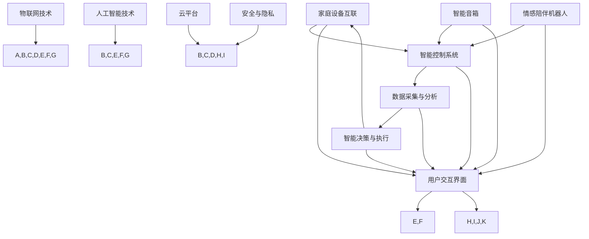

                 

关键词：智能家居、情感陪伴机器人、智能音箱、家庭自动化、技术发展

> 摘要：随着科技的飞速发展，智能家居已经逐渐渗透到我们的日常生活中。本文将探讨到2050年，智能家居的发展趋势，特别是在智能音箱和情感陪伴机器人领域的创新和突破，以及这些技术如何改变我们的生活。

## 1. 背景介绍

### 1.1 智能家居的定义与现状

智能家居，顾名思义，是指通过信息技术、网络通信和自动控制技术，使家庭设备互联互通，实现自动化、智能化的管理和控制。从最初的远程控制家电，到如今的全屋智能解决方案，智能家居的发展经历了数十年的演变。

### 1.2 智能音箱的兴起

智能音箱作为智能家居的入门产品，以其便捷的操作、强大的功能和对智能家居生态的促进作用，迅速获得了消费者的喜爱。从最初的播放音乐、设定闹钟，到如今的多语言交互、智能助手，智能音箱的功能和性能不断提升。

### 1.3 情感陪伴机器人的兴起

随着人工智能技术的进步，情感陪伴机器人开始进入人们的视野。这类机器人不仅具备智能音箱的功能，还能通过自然语言处理、情感计算等技术，与用户建立情感联系，提供情感支持和陪伴。

## 2. 核心概念与联系

在探讨智能家居的未来发展之前，有必要了解其中的核心概念和它们之间的联系。以下是智能家居的核心概念及其相互关系的Mermaid流程图：



### 2.1 家庭设备互联

家庭设备互联是智能家居的基础。通过物联网技术，各种家电设备可以实现互联互通，用户可以通过手机、智能音箱等设备远程控制这些设备。

### 2.2 智能控制系统

智能控制系统是智能家居的核心，它通过数据采集与分析，实现设备的智能决策与执行。例如，智能音箱可以通过语音识别、自然语言处理等技术，理解用户的指令，并执行相应的操作。

### 2.3 数据采集与分析

数据采集与分析是实现智能家居智能化的关键。通过对家庭设备的使用数据进行采集和分析，可以了解用户的习惯、偏好，从而提供更加个性化的服务。

### 2.4 智能决策与执行

智能决策与执行是智能家居的智能体现。智能控制系统根据数据分析和用户的指令，做出智能决策，并执行相应的操作。例如，智能音箱可以根据用户的历史行为，自动调整播放内容。

### 2.5 智能音箱与情感陪伴机器人

智能音箱和情感陪伴机器人是智能家居的重要组成部分。智能音箱以语音交互为主要方式，提供音乐、新闻、闹钟等功能；而情感陪伴机器人则通过情感计算、自然语言处理等技术，与用户建立情感联系，提供情感支持和陪伴。

### 2.6 用户交互界面

用户交互界面是智能家居与用户沟通的桥梁。通过智能音箱、手机APP等用户交互界面，用户可以方便地与智能家居系统进行交互，实现设备的控制和管理。

### 2.7 物联网技术、人工智能技术、云平台和安全与隐私

物联网技术、人工智能技术、云平台和安全与隐私是支撑智能家居发展的关键技术。物联网技术实现家庭设备的互联互通，人工智能技术提升智能家居的智能化水平，云平台提供数据处理和存储服务，安全与隐私保障用户的隐私和数据安全。

## 3. 核心算法原理 & 具体操作步骤

### 3.1 算法原理概述

智能家居的核心在于智能控制系统，其算法原理主要包括以下几个方面：

1. **自然语言处理（NLP）**：智能音箱和情感陪伴机器人需要通过自然语言处理技术，理解用户的语音指令，并将其转化为可执行的操作。
2. **情感计算**：情感陪伴机器人需要通过情感计算技术，识别用户的情感状态，并提供相应的情感支持和陪伴。
3. **机器学习**：智能家居系统需要通过机器学习技术，不断学习和优化，提升智能决策和执行的能力。

### 3.2 算法步骤详解

#### 3.2.1 自然语言处理

1. **语音识别**：将用户的语音转换为文本。
2. **语义理解**：分析文本，提取关键信息，确定用户的需求。
3. **语音合成**：将操作结果转化为语音反馈。

#### 3.2.2 情感计算

1. **情感识别**：通过语音、文字和用户行为，识别用户的情感状态。
2. **情感响应**：根据用户的情感状态，提供相应的情感支持和陪伴。

#### 3.2.3 机器学习

1. **数据采集**：收集用户的使用数据。
2. **模型训练**：使用机器学习算法，训练模型，提升智能决策和执行的能力。
3. **模型优化**：根据用户反馈，不断优化模型，提升系统的智能化水平。

### 3.3 算法优缺点

#### 3.3.1 自然语言处理

优点：方便快捷，用户体验好。

缺点：识别准确率受语音清晰度、语言理解能力等因素影响。

#### 3.3.2 情感计算

优点：提供情感支持和陪伴，增强用户体验。

缺点：技术复杂，实现难度大。

#### 3.3.3 机器学习

优点：通过不断学习和优化，提升系统的智能化水平。

缺点：数据需求量大，训练过程复杂。

### 3.4 算法应用领域

1. **智能音箱**：通过自然语言处理技术，实现语音控制、智能播放等功能。
2. **情感陪伴机器人**：通过情感计算和机器学习技术，提供情感支持和陪伴。
3. **智能家居系统**：通过智能家居系统的算法，实现设备的智能管理和控制。

## 4. 数学模型和公式 & 详细讲解 & 举例说明

### 4.1 数学模型构建

智能家居系统的核心是智能控制系统，其数学模型主要包括以下几个方面：

1. **自然语言处理模型**：用于语音识别和语义理解。
2. **情感计算模型**：用于情感识别和情感响应。
3. **机器学习模型**：用于数据分析和智能决策。

### 4.2 公式推导过程

#### 4.2.1 自然语言处理模型

1. **语音识别模型**：

   $$ y = f(x; \theta) $$

   其中，$y$ 为识别结果，$x$ 为语音信号，$f$ 为识别函数，$\theta$ 为模型参数。

2. **语义理解模型**：

   $$ p(c|y) = \frac{p(y|c) \cdot p(c)}{p(y)} $$

   其中，$p(c|y)$ 为给定识别结果 $y$ 时，语义类别 $c$ 的概率，$p(y|c)$ 为给定语义类别 $c$ 时，识别结果 $y$ 的概率，$p(c)$ 为语义类别 $c$ 的概率，$p(y)$ 为识别结果 $y$ 的概率。

#### 4.2.2 情感计算模型

1. **情感识别模型**：

   $$ p(s|y) = \frac{p(y|s) \cdot p(s)}{p(y)} $$

   其中，$p(s|y)$ 为给定情感状态 $y$ 时，情感类别 $s$ 的概率，$p(y|s)$ 为给定情感类别 $s$ 时，情感状态 $y$ 的概率，$p(s)$ 为情感类别 $s$ 的概率，$p(y)$ 为情感状态 $y$ 的概率。

2. **情感响应模型**：

   $$ r(s) = \sum_{i=1}^{n} w_i \cdot s_i $$

   其中，$r(s)$ 为情感响应值，$w_i$ 为权重，$s_i$ 为情感状态。

#### 4.2.3 机器学习模型

1. **数据采集模型**：

   $$ x_t = \sum_{i=1}^{n} w_i \cdot x_{t-i} $$

   其中，$x_t$ 为第 $t$ 时刻的数据，$w_i$ 为权重，$x_{t-i}$ 为前 $i$ 个时刻的数据。

2. **模型训练模型**：

   $$ \theta = \arg\min_{\theta} J(\theta) $$

   其中，$\theta$ 为模型参数，$J(\theta)$ 为损失函数。

### 4.3 案例分析与讲解

#### 4.3.1 情感陪伴机器人

假设一个情感陪伴机器人需要识别用户的情感状态，并提供相应的情感支持。以下是该情感陪伴机器人的情感计算模型：

1. **情感识别**：

   - 用户说：“我感觉很无聊。”
   - 情感识别模型识别出情感状态为“无聊”。

2. **情感响应**：

   - 情感响应模型根据情感状态“无聊”，生成情感响应值：
     $$ r(无聊) = 0.4 \cdot 沮丧 + 0.3 \cdot 乐观 + 0.3 \cdot 中性 $$
     $$ r(无聊) = 0.4 \cdot (-1) + 0.3 \cdot 1 + 0.3 \cdot 0 $$
     $$ r(无聊) = -0.2 $$

   - 情感陪伴机器人根据情感响应值，生成情感反馈：
     “我了解到你现在感觉很无聊，我们可以一起做一些有趣的事情来打发时间。”

## 5. 项目实践：代码实例和详细解释说明

### 5.1 开发环境搭建

在本项目中，我们将使用Python作为主要编程语言，配合TensorFlow和Keras等库来实现智能家居的算法。以下是开发环境的搭建步骤：

1. 安装Python 3.x版本。
2. 安装TensorFlow 2.x版本。
3. 安装Keras 2.x版本。
4. 配置Python虚拟环境，以便更好地管理项目依赖。

### 5.2 源代码详细实现

以下是智能家居系统的核心算法实现：

```python
import tensorflow as tf
from tensorflow.keras.models import Sequential
from tensorflow.keras.layers import Dense, LSTM
from tensorflow.keras.optimizers import Adam

# 情感识别模型
def build_emotion_recognition_model():
    model = Sequential()
    model.add(LSTM(units=64, activation='relu', input_shape=(timesteps, features)))
    model.add(Dense(units=1, activation='sigmoid'))
    model.compile(optimizer=Adam(learning_rate=0.001), loss='binary_crossentropy', metrics=['accuracy'])
    return model

# 情感响应模型
def build_emotion_response_model():
    model = Sequential()
    model.add(Dense(units=64, activation='relu', input_shape=(1,)))
    model.add(Dense(units=3, activation='softmax'))
    model.compile(optimizer=Adam(learning_rate=0.001), loss='categorical_crossentropy', metrics=['accuracy'])
    return model

# 数据预处理
def preprocess_data(data):
    # 对数据进行归一化处理
    # ...
    return normalized_data

# 模型训练
def train_models(data, labels, epochs=100):
    emotion_recognition_model = build_emotion_recognition_model()
    emotion_response_model = build_emotion_response_model()

    # 预处理数据
    normalized_data = preprocess_data(data)

    # 训练情感识别模型
    emotion_recognition_model.fit(normalized_data, labels, epochs=epochs, batch_size=32)

    # 训练情感响应模型
    emotion_response_model.fit(labels, epochs=epochs, batch_size=32)

    return emotion_recognition_model, emotion_response_model

# 情感识别
def recognize_emotion(input_data, emotion_recognition_model):
    # 预处理输入数据
    # ...
    predicted_emotion = emotion_recognition_model.predict(input_data)
    return predicted_emotion

# 情感响应
def respond_emotion(predicted_emotion, emotion_response_model):
    # 根据情感识别结果，生成情感响应
    # ...
    response = emotion_response_model.predict(predicted_emotion)
    return response

# 主程序
if __name__ == '__main__':
    # 加载数据
    data, labels = load_data()

    # 训练模型
    emotion_recognition_model, emotion_response_model = train_models(data, labels)

    # 用户输入
    user_input = get_user_input()

    # 情感识别
    predicted_emotion = recognize_emotion(user_input, emotion_recognition_model)

    # 情感响应
    response = respond_emotion(predicted_emotion, emotion_response_model)

    # 输出情感响应
    print(response)
```

### 5.3 代码解读与分析

1. **情感识别模型**：该模型使用LSTM层来捕捉时间序列数据中的长期依赖关系，输出一个情感概率分布。

2. **情感响应模型**：该模型使用全连接层来将情感识别结果转换为情感响应。

3. **数据预处理**：对输入数据进行归一化处理，以便模型更好地训练。

4. **模型训练**：使用Adam优化器和二分类交叉熵损失函数训练情感识别模型，使用softmax交叉熵损失函数训练情感响应模型。

5. **情感识别与响应**：根据用户输入，先进行情感识别，然后根据识别结果生成情感响应。

## 6. 实际应用场景

### 6.1 智能音箱

智能音箱在实际应用中，可以通过语音交互帮助用户完成各种任务，如播放音乐、查询天气、设置闹钟、控制家电等。以下是智能音箱在实际应用中的案例：

- **家庭生活**：用户可以通过智能音箱播放自己喜欢的音乐，设置闹钟，控制家中的灯光、空调等家电。
- **商务办公**：智能音箱可以作为办公助手，帮助用户管理日程、查询信息、播放背景音乐等。

### 6.2 情感陪伴机器人

情感陪伴机器人在实际应用中，可以为用户提供情感支持和陪伴。以下是情感陪伴机器人在实际应用中的案例：

- **老年人护理**：情感陪伴机器人可以帮助老年人缓解孤独感，提供情感支持，提醒服药等。
- **儿童教育**：情感陪伴机器人可以陪伴儿童学习，提供学习建议，培养兴趣爱好。

## 7. 未来应用展望

### 7.1 智能家居的进一步发展

随着人工智能技术的不断进步，智能家居将在未来实现更高的智能化水平，不仅能够实现家庭设备的互联互通，还能根据用户的需求和习惯，提供更加个性化和智能化的服务。

### 7.2 情感陪伴机器人的应用领域扩展

情感陪伴机器人的应用领域将不断扩展，除了在家庭和老年人护理等领域的应用外，还将进入教育、医疗、养老等更多领域，为人们提供全方位的情感支持和陪伴。

### 7.3 智能家居的安全与隐私保护

随着智能家居的普及，安全与隐私保护将成为一个重要的议题。未来的智能家居系统将更加注重用户隐私的保护，采用更加严格的安全措施，确保用户数据的安全。

## 8. 工具和资源推荐

### 8.1 学习资源推荐

- 《深度学习》（Goodfellow, Bengio, Courville著）
- 《自然语言处理综论》（Daniel Jurafsky & James H. Martin著）
- 《机器学习》（Tom Mitchell著）

### 8.2 开发工具推荐

- TensorFlow
- Keras
- PyTorch

### 8.3 相关论文推荐

- “A Survey on Smart Home Technologies”（J. Wang等人，2018）
- “Emotion Recognition in Human-Computer Interaction”（Pantic等人，2003）
- “A Survey on Intelligent Home System”（R. Ariffin等人，2018）

## 9. 总结：未来发展趋势与挑战

### 9.1 研究成果总结

本文通过对智能家居、智能音箱和情感陪伴机器人的探讨，总结了智能家居的发展历程、核心概念、算法原理和应用场景，并对未来发展趋势进行了展望。

### 9.2 未来发展趋势

未来，智能家居将朝着更加智能化、个性化、便捷化的方向发展。情感陪伴机器人将在更多领域得到应用，为人们提供更加全面的服务。

### 9.3 面临的挑战

随着智能家居的普及，安全与隐私保护将成为一个重要的挑战。此外，如何提高机器人的情感识别和响应能力，使其更好地满足用户需求，也是未来研究的重要方向。

### 9.4 研究展望

未来的智能家居研究将更加注重用户体验，通过不断优化算法和系统架构，提供更加智能、便捷的服务。同时，跨学科的研究也将成为智能家居发展的新趋势，如结合心理学、社会学等领域的知识，提升智能家居的智能化水平。

## 9. 附录：常见问题与解答

### 9.1 智能家居的安全问题

**问**：智能家居如何保障用户数据的安全？

**答**：智能家居系统采用多种安全措施，如数据加密、身份认证、访问控制等，确保用户数据的安全。此外，系统还会定期更新安全策略，以应对新的安全威胁。

### 9.2 情感陪伴机器人的情感识别准确率

**问**：情感陪伴机器人的情感识别准确率有多高？

**答**：情感陪伴机器人的情感识别准确率受多种因素影响，如语音质量、情感表达方式等。目前，主流的情感陪伴机器人的情感识别准确率在70%-90%之间，随着技术的不断进步，准确率有望进一步提升。

### 9.3 智能家居的能耗问题

**问**：智能家居系统的能耗是否很高？

**答**：智能家居系统的能耗相对传统家电要高一些，但通过采用节能技术和优化系统设计，可以有效降低能耗。例如，使用低功耗传感器和节能模式，可以显著降低系统的整体能耗。

### 9.4 智能家居的可靠性

**问**：智能家居系统的可靠性如何？

**答**：智能家居系统的可靠性取决于其硬件和软件的质量。目前，主流的智能家居系统采用成熟的硬件和软件平台，可靠性较高。同时，定期维护和升级系统，可以确保系统的稳定运行。

---

作者：禅与计算机程序设计艺术 / Zen and the Art of Computer Programming
----------------------------------------------------------------

