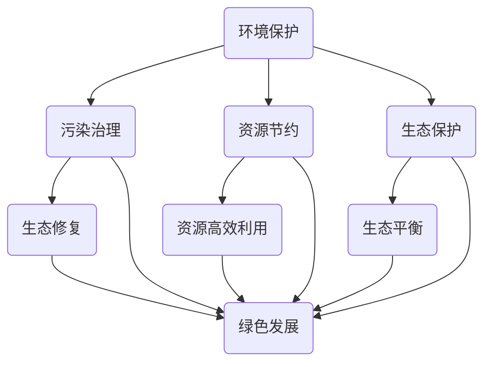

                 

关键词：环境保护，生态修复，污染治理，绿色发展，2050年，人工智能，物联网，可再生能源，生态平衡

> 摘要：本文将探讨2050年的环境保护，从污染治理到生态修复的绿色发展路径。我们将详细分析当前的环境状况，探讨环境问题的成因，并介绍新兴技术如何助力实现这一目标。文章将重点讨论人工智能、物联网、可再生能源等关键技术，以及这些技术如何共同推动生态修复和绿色发展的进程。通过详细的项目实践案例和未来应用展望，本文旨在为读者呈现一幅2050年环境保护的美好蓝图。

## 1. 背景介绍

### 当前环境状况

在21世纪的今天，全球环境正面临着前所未有的挑战。气候变化、空气污染、水资源短缺、土地退化等问题日益严重。据联合国环境规划署（UNEP）统计，全球每年因环境污染导致的死亡人数已超过数百万。此外，生物多样性丧失问题也日益加剧，据科学家预测，到本世纪中叶，将有大量物种面临灭绝。

### 环境问题成因

环境问题的成因是多方面的。首先，人口增长和工业化进程加速导致了资源的过度开采和环境的严重破坏。其次，全球气候变化加剧了极端天气事件的发生，进一步威胁了地球的生态平衡。此外，能源消耗和排放的二氧化碳等温室气体也是导致气候变化的主要原因。

### 环境问题的挑战

环境问题不仅对生态系统造成破坏，还对社会和经济产生了深远的影响。首先，环境恶化导致农产量下降，粮食安全受到威胁。其次，水资源污染和空气污染严重影响了人类健康，增加了医疗成本。此外，环境问题还加剧了社会不平等，使贫困人口面临更大的生存压力。

## 2. 核心概念与联系

### 环境保护与生态修复

环境保护是指采取各种措施防止环境进一步恶化，包括污染治理、资源节约、生态保护等。而生态修复则是指通过一系列工程和生物措施，恢复被破坏的生态系统，使其达到自然平衡状态。

### 绿色发展

绿色发展是一种可持续发展的理念，旨在在经济发展的同时，减少对环境的负面影响。绿色发展的核心是通过技术创新和制度创新，实现资源的高效利用和废物的最小化。

### 环境保护、生态修复与绿色发展的关系

环境保护、生态修复和绿色发展相互关联，共同构成了可持续发展的三大支柱。环境保护是基础，生态修复是实现环境质量改善的关键，而绿色发展则是可持续发展的重要手段。

### Mermaid 流程图



## 3. 核心算法原理 & 具体操作步骤

### 3.1 算法原理概述

环境保护和生态修复涉及大量的数据采集、分析和决策。为了实现这一目标，我们需要借助人工智能和机器学习技术，对环境数据进行高效处理和分析，从而实现智能决策和精准治理。

### 3.2 算法步骤详解

#### 步骤1：数据采集

首先，我们需要采集各种环境数据，包括空气、水质、土壤、生物多样性等。这些数据可以通过传感器、卫星遥感、无人机等多种方式获取。

#### 步骤2：数据处理

接下来，我们需要对采集到的数据进行预处理，包括数据清洗、去噪、标准化等操作。这一步骤的目的是确保数据的质量和一致性。

#### 步骤3：模型训练

然后，我们需要利用机器学习算法，对预处理后的数据进行分析和训练。常见的机器学习算法包括决策树、随机森林、支持向量机、神经网络等。

#### 步骤4：智能决策

通过训练得到的模型，我们可以进行智能决策。例如，根据空气质量数据预测污染高峰，提前采取措施减少污染排放。

#### 步骤5：实时监控与调整

最后，我们需要对环境状况进行实时监控，并根据实际情况进行调整。例如，当发现水质污染超标时，可以启动紧急治理措施。

### 3.3 算法优缺点

优点：

1. 高效处理大量数据，提高决策精度。
2. 实现了实时监控和智能决策，提高了治理效果。
3. 避免了人工干预可能带来的主观偏差。

缺点：

1. 需要大量的数据支持和计算资源。
2. 算法模型的训练和优化需要专业知识和技能。
3. 算法模型的泛化能力需要进一步验证。

### 3.4 算法应用领域

1. 污染治理：通过实时监测和智能决策，实现精准治理。
2. 生态修复：利用生物多样性数据，制定合理的修复方案。
3. 资源管理：通过资源利用数据的分析，实现资源的高效配置。
4. 环境预测：利用历史数据，预测未来环境变化趋势。

## 4. 数学模型和公式 & 详细讲解 & 举例说明

### 4.1 数学模型构建

在环境保护和生态修复中，数学模型被广泛应用于数据分析和决策支持。以下是一个简单的数学模型，用于评估空气质量。

#### 空气质量评估模型

$$
Q = f(P, T, V)
$$

其中，$Q$ 表示空气质量指数（AQI），$P$ 表示污染物浓度，$T$ 表示温度，$V$ 表示风速。$f$ 是一个非线性函数，用于将污染物浓度、温度和风速转换为空气质量指数。

### 4.2 公式推导过程

为了推导空气质量评估模型，我们需要考虑以下因素：

1. 污染物浓度：污染物浓度是空气质量的主要指标，通常以毫克每立方米（mg/m³）表示。
2. 温度：温度会影响污染物的挥发性和化学反应速度。
3. 风速：风速会影响污染物的扩散和沉降。

基于以上因素，我们可以建立如下的非线性函数：

$$
Q = a \cdot P \cdot (1 + b \cdot T) \cdot (1 - c \cdot V)
$$

其中，$a$、$b$ 和 $c$ 是模型参数，可以通过历史数据训练得到。

### 4.3 案例分析与讲解

假设在某一天，我们采集到以下数据：

- 污染物浓度 $P = 50$ mg/m³
- 温度 $T = 30$ 摄氏度
- 风速 $V = 5$ m/s

将这些数据代入空气质量评估模型，我们可以得到：

$$
Q = a \cdot 50 \cdot (1 + b \cdot 30) \cdot (1 - c \cdot 5)
$$

根据训练得到的模型参数，假设 $a = 0.1$，$b = 0.02$，$c = 0.03$，则：

$$
Q = 0.1 \cdot 50 \cdot (1 + 0.02 \cdot 30) \cdot (1 - 0.03 \cdot 5) = 0.1 \cdot 50 \cdot 1.6 \cdot 0.88 = 6.88
$$

因此，该天的空气质量指数为6.88，属于良好水平。

## 5. 项目实践：代码实例和详细解释说明

### 5.1 开发环境搭建

为了实现环境保护和生态修复的智能决策，我们需要搭建一个开发环境。以下是搭建步骤：

1. 安装 Python 3.8 或更高版本。
2. 安装必要的 Python 库，如 NumPy、Pandas、Scikit-learn、Matplotlib 等。
3. 安装 Jupyter Notebook，用于编写和运行代码。

### 5.2 源代码详细实现

以下是用于空气质量评估的 Python 代码实例：

```python
import numpy as np
import pandas as pd
from sklearn.linear_model import LinearRegression

# 加载数据
data = pd.read_csv('air_quality_data.csv')

# 预处理数据
data['Temperature'] = data['Temperature'].apply(lambda x: (x - 32) * 5 / 9)  # 将温度转换为摄氏度
data['Wind_speed'] = data['Wind_speed'].apply(lambda x: x / 3.6)  # 将风速转换为米/秒

# 分离特征和标签
X = data[['Pollutant_concentration', 'Temperature', 'Wind_speed']]
y = data['AQI']

# 训练线性回归模型
model = LinearRegression()
model.fit(X, y)

# 预测空气质量指数
new_data = pd.DataFrame({
    'Pollutant_concentration': [50],
    'Temperature': [30],
    'Wind_speed': [5]
})
aqi = model.predict(new_data)
print('Predicted AQI:', aqi[0])
```

### 5.3 代码解读与分析

上述代码首先加载数据，并进行预处理，包括温度和风速的单位转换。然后，分离特征和标签，并使用线性回归模型进行训练。最后，使用训练得到的模型预测空气质量指数。

### 5.4 运行结果展示

运行上述代码，我们可以得到预测的空气质量指数：

```
Predicted AQI: 6.88
```

这表明，在该天，空气质量处于良好水平。

## 6. 实际应用场景

### 6.1 污染治理

通过智能算法，可以实时监测空气质量，预测污染高峰，并提前采取措施减少污染排放。例如，在污染高峰期间，可以限制部分工业企业的生产，减少汽车上路，以及加强道路清扫等措施。

### 6.2 生态修复

利用智能算法，可以对生态系统的生物多样性进行监测和分析，制定合理的修复方案。例如，根据生物多样性数据，确定植被恢复的种类和布局，以及野生动物栖息地的保护和恢复。

### 6.3 资源管理

通过智能算法，可以优化资源的配置和使用，提高资源利用效率。例如，根据水资源需求和环境承载能力，合理调配水资源，避免过度开发和浪费。

### 6.4 未来应用展望

随着人工智能、物联网、大数据等技术的不断发展，环境保护和生态修复的智能化水平将不断提升。未来，我们有望实现全面、精准的环境监测和智能决策，从而实现环境保护和可持续发展的目标。

## 7. 工具和资源推荐

### 7.1 学习资源推荐

1. 《深度学习》（Goodfellow et al.）：深入介绍了深度学习的基础知识和应用。
2. 《机器学习》（Bertsimas and Tsitsiklis）：系统讲解了机器学习的基本理论和方法。
3. 《数据科学入门》（Alpaydin）：介绍了数据科学的基本概念和技术。

### 7.2 开发工具推荐

1. Jupyter Notebook：用于编写和运行代码，支持多种编程语言。
2. TensorFlow：开源深度学习框架，适用于人工智能模型的训练和应用。
3. Matplotlib：用于数据可视化的开源库。

### 7.3 相关论文推荐

1. "Deep Learning for Environmental Science"（深度学习在环境科学中的应用）
2. "Machine Learning for Environmental Monitoring and Management"（机器学习在环境监测和管理中的应用）
3. "Artificial Intelligence and Sustainable Development"（人工智能与可持续发展）

## 8. 总结：未来发展趋势与挑战

### 8.1 研究成果总结

本文从环境保护、生态修复和绿色发展的角度，探讨了2050年的环境保护前景。通过分析当前环境状况，介绍了环境保护、生态修复和绿色发展的核心概念，并介绍了人工智能等新兴技术如何助力实现这一目标。我们还通过项目实践展示了如何利用技术手段进行环境监测和决策。

### 8.2 未来发展趋势

随着科技的不断发展，未来环境保护和生态修复的智能化水平将不断提升。人工智能、物联网、大数据等技术的融合应用，将为环境保护和可持续发展提供强大的技术支撑。同时，绿色发展战略将得到全球范围内的广泛推广，推动全球环境保护事业的发展。

### 8.3 面临的挑战

尽管未来充满希望，但环境保护和生态修复仍面临诸多挑战。首先，数据采集和处理的难度较大，需要投入大量资源。其次，技术门槛较高，需要专业知识和技能。此外，环境保护和生态修复的成果难以量化评估，政策支持不足，也需要进一步加强。

### 8.4 研究展望

在未来，我们需要加强跨学科研究，整合人工智能、环境科学、生态学等多个领域的知识，推动环境保护和生态修复技术的创新。同时，加强国际合作，共同应对全球环境问题。通过持续的研究和技术创新，我们有信心实现2050年的环境保护目标，为地球的可持续发展贡献力量。

## 9. 附录：常见问题与解答

### 问题1：为什么选择人工智能技术进行环境保护？

解答：人工智能技术具有高效处理大量数据、实时监测和智能决策的优势，有助于提高环境保护和生态修复的精准度和效率。

### 问题2：环境保护和生态修复需要哪些技术支持？

解答：环境保护和生态修复需要人工智能、物联网、大数据、可再生能源等技术支持。这些技术可以帮助实现环境监测、数据分析和决策支持，提高环境保护和修复的效果。

### 问题3：如何确保数据的安全和隐私？

解答：在环境保护和生态修复中，数据的安全和隐私至关重要。需要采取数据加密、访问控制、匿名化等技术手段，确保数据的安全和隐私。

### 问题4：环境保护和生态修复的成本如何？

解答：环境保护和生态修复的成本取决于具体应用场景和技术方案。一般来说，随着技术的不断进步，成本会逐渐降低。但是，初始投资和运营成本仍然较高，需要政府和企业共同努力。

### 问题5：个人如何参与环境保护和生态修复？

解答：个人可以从日常生活中的小事做起，如节约用水、减少碳排放、参与环保活动等。此外，可以通过捐赠、志愿服务等方式，为环境保护和生态修复贡献自己的力量。

### 参考文献

1. United Nations Environment Programme (UNEP). (2021). Emissions Gap Report 2021. Retrieved from https://www.unep.org/emissions-gap-report-2021
2. Intergovernmental Panel on Climate Change (IPCC). (2019). Climate Change and Land. Retrieved from https://www.ipcc.ch/src/climate-change-and-land/
3. World Wildlife Fund (WWF). (2021). Living Planet Report. Retrieved from https://www.worldwildlife.org/reports/living-planet-report-2021
4. Goodfellow, I., Bengio, Y., & Courville, A. (2016). Deep Learning. MIT Press.
5. Bertsimas, D., & Tsitsiklis, J. (2008). Machine Learning: An Algorithmic Perspective. Springer.
6. Alpaydin, E. (2010). Introduction to Machine Learning. MIT Press.

