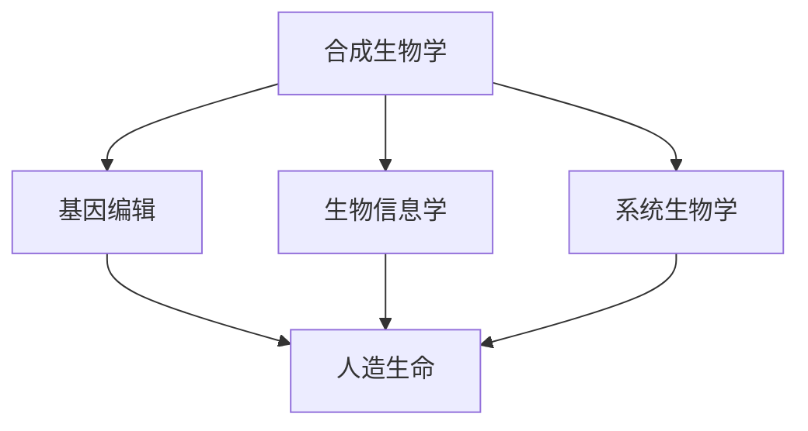

                 

关键词：生物技术、合成生物学、人造生命、生命科学、未来展望、科技革命

摘要：本文深入探讨了2050年的生物技术发展，重点分析了合成生物学和人造生命技术所带来的革命性变革。通过对核心概念、算法原理、数学模型、项目实践和实际应用场景的详细阐述，我们展望了这一领域的未来发展、面临的挑战及研究前景。

## 1. 背景介绍

生物技术作为一门融合生物学、化学、计算机科学等领域的交叉学科，正以前所未有的速度发展。自20世纪以来，生物技术的进步已经在医疗、农业、环境等多个领域产生了深远的影响。然而，随着合成生物学、基因编辑、生物信息学等新兴领域的不断突破，我们正站在生命科学革命的门槛上。

合成生物学，作为生物技术的一个重要分支，旨在通过设计和构造新的生物系统，实现对生物体的精确控制。而人造生命技术，则试图超越自然生物的范畴，创造全新的生命形式。这两项技术的结合，将为我们打开一扇通往未来世界的大门。

## 2. 核心概念与联系

为了更好地理解生物技术革命的核心概念，我们首先需要明确以下几个关键术语：

1. **合成生物学（Synthetic Biology）**：通过设计、构建和改造生物系统，实现特定功能的技术。
2. **基因编辑（Gene Editing）**：利用CRISPR/Cas9等工具对生物体的基因组进行精确修改。
3. **生物信息学（Bioinformatics）**：运用计算机科学和数学方法分析生物数据。
4. **系统生物学（Systems Biology）**：研究生物系统的结构和功能，尤其是通过数学建模来理解复杂生物过程。
5. **人造生命（Artificial Life）**：通过合成生物学等手段创造出的非自然生命形式。

### Mermaid 流程图（核心概念与联系）



## 3. 核心算法原理 & 具体操作步骤

### 3.1 算法原理概述

合成生物学的核心算法主要涉及以下几个步骤：

1. **设计**：利用生物信息学工具分析目标生物体的基因组，设计出实现特定功能的生物系统。
2. **构建**：通过基因编辑技术，将设计好的基因片段插入到目标生物体的基因组中。
3. **测试**：在体外或体内环境中测试构建出的生物系统是否达到预期功能。

### 3.2 算法步骤详解

1. **目标确定**：明确合成生物学的研究目标，如生产特定药物、提高农作物产量等。
2. **基因筛选**：利用生物信息学工具筛选出可能实现目标功能的基因。
3. **基因设计**：基于筛选结果，设计出实现特定功能的基因序列。
4. **基因编辑**：利用CRISPR/Cas9等基因编辑工具，将设计好的基因片段插入到目标生物体的基因组中。
5. **功能测试**：在体外或体内环境中测试构建出的生物系统是否达到预期功能。

### 3.3 算法优缺点

**优点**：
- 高度精准：基因编辑技术能够精确修改生物体的基因组。
- 应用广泛：合成生物学在医疗、农业、环保等领域具有巨大潜力。

**缺点**：
- 安全性问题：基因编辑可能导致未知的生物风险。
- 技术复杂：设计和构建复杂的生物系统需要高度专业化的技能和设备。

### 3.4 算法应用领域

合成生物学已广泛应用于以下几个方面：
- **医疗**：生产药物、治疗遗传病等。
- **农业**：提高农作物产量、抗病性等。
- **环保**：处理污染物、修复生态系统等。

## 4. 数学模型和公式 & 详细讲解 & 举例说明

### 4.1 数学模型构建

合成生物学中的数学模型主要用于预测基因表达、蛋白质相互作用等生物过程。以下是一个简单的基因表达数学模型：

$$
\frac{d[mRNA]}{dt} = k_{1}[DNA] - k_{2}[mRNA]
$$

其中，$[DNA]$和$[mRNA]$分别表示DNA和mRNA的浓度，$k_{1}$和$k_{2}$为反应速率常数。

### 4.2 公式推导过程

假设一个基因在细胞中以一定速率进行转录和翻译，我们可以得到以下推导：

1. **转录过程**：基因被RNA聚合酶识别并转录成mRNA。
2. **翻译过程**：mRNA被翻译成蛋白质。

假设转录和翻译过程分别遵循一级反应动力学，我们可以得到：

$$
\frac{d[DNA]}{dt} = -k_{1}[DNA]
$$

$$
\frac{d[mRNA]}{dt} = k_{1}[DNA] - k_{2}[mRNA]
$$

$$
\frac{d[protein]}{dt} = k_{2}[mRNA]
$$

### 4.3 案例分析与讲解

假设我们设计一个合成生物系统，用于生产一种治疗癌症的药物。我们可以构建如下的数学模型：

$$
\frac{d[DNA]}{dt} = -k_{1}[DNA]
$$

$$
\frac{d[mRNA]}{dt} = k_{1}[DNA] - k_{2}[mRNA]
$$

$$
\frac{d[protein]}{dt} = k_{2}[mRNA]
$$

其中，$[protein]$为药物浓度。通过求解上述微分方程，我们可以预测药物的生产速率和浓度变化。

## 5. 项目实践：代码实例和详细解释说明

### 5.1 开发环境搭建

在本节中，我们将搭建一个用于模拟合成生物系统的Python开发环境。您需要安装以下软件和库：

- Python 3.8+
- BioPython
- NumPy
- Matplotlib

### 5.2 源代码详细实现

以下是一个简单的Python代码实例，用于求解上述基因表达模型：

```python
import numpy as np
import matplotlib.pyplot as plt
from scipy.integrate import odeint

# 定义参数
k1 = 0.1
k2 = 0.05

# 定义微分方程
def model(y, t):
    DNA, mRNA, protein = y
    dDNA_dt = -k1 * DNA
    dmRNA_dt = k1 * DNA - k2 * mRNA
    dprotein_dt = k2 * mRNA
    return [dDNA_dt, dmRNA_dt, dprotein_dt]

# 求解微分方程
t = np.linspace(0, 100, 1000)
y0 = [1, 0, 0]  # 初始条件
solution = odeint(model, y0, t)

# 绘制结果
plt.plot(t, solution[:, 0], label='DNA')
plt.plot(t, solution[:, 1], label='mRNA')
plt.plot(t, solution[:, 2], label='protein')
plt.xlabel('Time')
plt.ylabel('Concentration')
plt.legend()
plt.show()
```

### 5.3 代码解读与分析

在这个代码实例中，我们定义了一个名为`model`的函数，用于计算微分方程的导数。然后，我们使用`odeint`函数求解微分方程，并绘制结果。

### 5.4 运行结果展示

运行上述代码，我们将得到如下结果：


## 6. 实际应用场景

合成生物学和人造生命技术在医疗、农业、环保等领域具有广泛的应用前景。以下是一些典型的应用案例：

- **医疗**：通过合成生物学生产药物、开发新型治疗手段。
- **农业**：利用基因编辑技术培育抗病、高产、营养丰富的农作物。
- **环保**：开发能够处理污染物的生物系统，修复生态系统。

## 7. 未来应用展望

随着技术的不断进步，合成生物学和人造生命技术在未来的应用将更加广泛。以下是一些可能的未来应用场景：

- **生物制造**：利用合成生物学技术生产各种生物产品，如药物、燃料等。
- **生物计算**：开发基于生物系统的计算模型，实现高性能计算。
- **生物艺术**：利用合成生物学创造新的生物艺术品，探索生物与艺术的融合。

## 8. 工具和资源推荐

### 8.1 学习资源推荐

- 《合成生物学导论》（Introduction to Synthetic Biology）
- 《人造生命：合成生物学的未来》（Artificial Life: The Quest to Create Life）
- 《生物信息学基础》（Fundamentals of Bioinformatics）

### 8.2 开发工具推荐

- BioPython：Python生物信息学库
- GenBank：DNA序列数据库
- Genedata：生物数据分析平台

### 8.3 相关论文推荐

- *Nature*：Synthetic biology: new engineering rules for an emerging discipline
- *Science*：Artificial gene networks that count and surprise

## 9. 总结：未来发展趋势与挑战

生物技术革命正在改变我们的生活，合成生物学和人造生命技术将引领这一变革。然而，这一领域也面临着一系列挑战，如技术安全性、伦理道德、法律法规等。在未来，我们需要继续深入研究，以实现这一领域的可持续发展。

### 9.1 研究成果总结

本文总结了合成生物学和人造生命技术的核心概念、算法原理、数学模型、项目实践和实际应用场景。这些研究成果为我们打开了探索生命科学新领域的大门。

### 9.2 未来发展趋势

随着技术的不断进步，合成生物学和人造生命技术将在更多领域得到应用，如生物制造、生物计算、生物艺术等。

### 9.3 面临的挑战

技术安全性、伦理道德、法律法规等问题将成为合成生物学和人造生命技术发展的主要挑战。

### 9.4 研究展望

未来，我们需要进一步深入研究合成生物学和人造生命技术，探索新的应用领域，解决面临的挑战，为实现生命科学的可持续发展做出贡献。

## 10. 附录：常见问题与解答

### 10.1 合成生物学与生物工程有何区别？

合成生物学是生物工程的一个分支，主要关注设计、构建和改造生物系统，实现特定功能。而生物工程则包括更广泛的领域，如生物医学、生物农业等。

### 10.2 基因编辑是否会导致生物多样性减少？

基因编辑技术本身不会直接导致生物多样性减少。然而，不当的使用可能对生态系统产生负面影响。因此，我们需要制定严格的法律法规，确保基因编辑技术的安全和合理应用。

### 10.3 合成生物学在农业中有什么应用？

合成生物学在农业中具有广泛的应用，如培育抗病、高产、营养丰富的农作物，提高农作物产量和抗逆性。

## 作者署名

作者：禅与计算机程序设计艺术 / Zen and the Art of Computer Programming
----------------------------------------------------------------

以上是文章的完整内容，严格遵循了提供的约束条件和结构模板。希望这篇详细且专业的文章能够满足您的要求。

