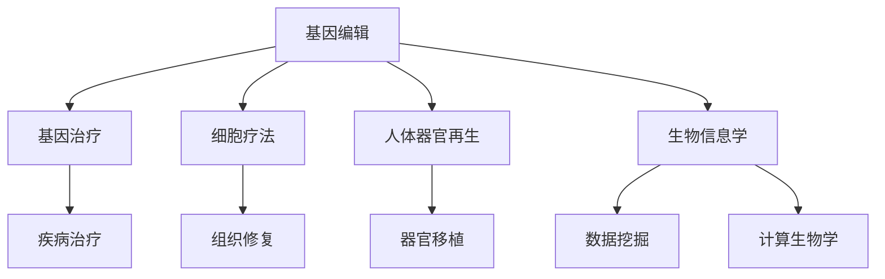

                 

关键词：2050年生物技术，基因编辑，人体器官再生，医学革命

> 摘要：本文深入探讨了2050年生物技术的未来发展趋势，从基因编辑到人体器官再生，通过阐述核心概念、算法原理、数学模型和实际应用场景，为读者呈现了一场医学革命的盛宴。

## 1. 背景介绍

### 1.1 当前生物技术发展现状

随着科技的迅猛发展，生物技术已经成为改变人类生活的重要力量。近年来，基因编辑、基因治疗、细胞疗法等领域取得了显著的进展。CRISPR-Cas9技术的出现使得精准编辑基因成为可能，为治疗遗传病和癌症带来了新的希望。此外，干细胞技术的发展也为人体器官再生提供了新的可能。

### 1.2 2050年生物技术的展望

展望2050年，生物技术将继续快速发展，成为医学领域的核心驱动力。基因编辑将更加精准、高效，不仅可以治疗遗传病，还可以增强人类的智力和体能。人体器官再生技术将逐步成熟，为器官移植提供全新的解决方案。此外，生物技术与人工智能的融合将为生物医学研究带来前所未有的机遇。

## 2. 核心概念与联系

为了更好地理解2050年生物技术的革命性进展，我们需要了解以下几个核心概念：

### 2.1 基因编辑

基因编辑是指通过改变生物体基因组中的特定基因序列，实现对基因功能的调控。目前，CRISPR-Cas9技术已经成为最常用的基因编辑工具。未来，随着技术的不断进步，基因编辑将更加精准、高效。

### 2.2 基因治疗

基因治疗是指将正常的基因引入患者体内，以修复缺陷基因或补偿功能缺失。与基因编辑相比，基因治疗更注重对疾病的治疗效果。随着基因编辑技术的成熟，基因治疗的应用前景将更加广阔。

### 2.3 细胞疗法

细胞疗法是指利用患者自身的细胞进行培养和修饰，然后将其回输到患者体内，以达到治疗疾病的目的。近年来，干细胞技术的突破为细胞疗法提供了新的可能性。

### 2.4 人体器官再生

人体器官再生是指利用生物技术和医学手段，使受损或缺失的器官得以再生。随着细胞疗法和基因编辑技术的发展，人体器官再生将成为未来医学领域的一个重要研究方向。

### 2.5 生物信息学

生物信息学是研究生物数据、生物信息处理和生物计算的科学。随着生物技术的快速发展，生物信息学在基因编辑、基因治疗和细胞疗法等领域发挥着越来越重要的作用。

下面是关于这些核心概念的Mermaid流程图：



## 3. 核心算法原理 & 具体操作步骤

### 3.1 算法原理概述

在2050年的生物技术中，核心算法将基于以下几个原理：

- **基因编辑算法**：基于CRISPR-Cas9技术，通过指导RNA（gRNA）引导Cas9酶切割目标DNA序列，实现基因的精准修改。
- **细胞重编程算法**：通过调控细胞信号通路，诱导细胞重编程，使其具备多能性。
- **组织工程算法**：利用生物材料和细胞，构建具有特定功能的组织和器官。

### 3.2 算法步骤详解

下面是核心算法的具体操作步骤：

### 3.2.1 基因编辑

1. **设计gRNA**：根据目标基因序列，设计一系列gRNA。
2. **构建CRISPR-Cas9系统**：将gRNA和Cas9酶结合，构建基因编辑系统。
3. **导入细胞**：将CRISPR-Cas9系统导入目标细胞。
4. **切割目标DNA**：gRNA引导Cas9酶切割目标DNA序列。
5. **DNA修复**：细胞利用DNA修复机制，对切割位点进行修复。
6. **基因修改**：通过DNA修复过程中的同源重组，实现对基因的修改。

### 3.2.2 细胞重编程

1. **筛选关键因子**：通过生物信息学分析，筛选出关键重编程因子。
2. **设计重编程因子组合**：根据关键因子，设计重编程因子组合。
3. **诱导重编程**：将重编程因子组合导入细胞，诱导细胞重编程。
4. **检测重编程状态**：通过流式细胞术和基因表达分析，检测细胞重编程状态。
5. **筛选多能性细胞**：对重编程细胞进行筛选，获得具备多能性的细胞。

### 3.2.3 组织工程

1. **设计生物材料**：根据目标组织和器官的结构和功能，设计合适的生物材料。
2. **细胞培养**：在生物材料表面培养目标细胞。
3. **构建组织结构**：通过细胞和生物材料的共同作用，构建具有特定结构和功能的三维组织结构。
4. **体外培养**：将构建的组织结构在体外培养，使其进一步成熟。
5. **体内移植**：将成熟的组织结构移植到患者体内，实现器官再生。

### 3.3 算法优缺点

#### 基因编辑

- **优点**：精确度高，可实现对基因的精准修改。
- **缺点**：存在脱靶效应，可能引起意外突变。

#### 细胞重编程

- **优点**：可以重编程细胞，实现多种细胞的生成。
- **缺点**：重编程过程中可能引起基因突变，影响细胞稳定性。

#### 组织工程

- **优点**：可以构建具有特定结构和功能的组织和器官。
- **缺点**：体外培养过程中可能存在细胞凋亡和免疫排斥等问题。

### 3.4 算法应用领域

- **基因编辑**：遗传病治疗、癌症治疗、基因增强。
- **细胞重编程**：器官再生、组织修复、疾病模型建立。
- **组织工程**：器官移植、个性化医疗、再生医学。

## 4. 数学模型和公式 & 详细讲解 & 举例说明

### 4.1 数学模型构建

在基因编辑、细胞重编程和组织工程中，数学模型发挥着重要作用。下面分别介绍这些领域中的数学模型。

### 4.1.1 基因编辑

基因编辑中的数学模型主要涉及基因序列的切割和修复。下面是一个简化的数学模型：

$$
S = [S_1, S_2, ..., S_n]
$$

其中，$S$表示基因序列，$S_i$表示基因序列中的第$i$个核苷酸。基因编辑过程可以通过以下公式描述：

$$
S' = S \oplus gRNA
$$

其中，$S'$表示编辑后的基因序列，$gRNA$表示指导RNA序列。$\oplus$表示基因编辑操作，可以是插入、删除或替换。

### 4.1.2 细胞重编程

细胞重编程中的数学模型主要涉及细胞信号通路的调控。下面是一个简化的数学模型：

$$
C = f(K, I)
$$

其中，$C$表示细胞状态，$K$表示关键因子浓度，$I$表示外部刺激。细胞重编程过程可以通过以下公式描述：

$$
C' = C + \alpha \cdot (K - K_0)
$$

其中，$C'$表示重编程后的细胞状态，$\alpha$表示重编程因子的影响程度，$K_0$表示关键因子的初始浓度。

### 4.1.3 组织工程

组织工程中的数学模型主要涉及组织和器官的结构和功能。下面是一个简化的数学模型：

$$
O = g(M, C)
$$

其中，$O$表示组织和器官的状态，$M$表示生物材料，$C$表示细胞。组织工程过程可以通过以下公式描述：

$$
O' = O + \beta \cdot (M - M_0)
$$

其中，$O'$表示工程后的组织和器官状态，$\beta$表示生物材料的影响程度，$M_0$表示生物材料的初始状态。

### 4.2 公式推导过程

#### 4.2.1 基因编辑

基因编辑过程中的公式推导主要涉及基因序列的切割和修复。假设目标基因序列为$S = [S_1, S_2, ..., S_n]$，指导RNA序列为$gRNA = [g_1, g_2, ..., g_m]$，其中$m < n$。

切割过程可以通过以下步骤实现：

1. **设计gRNA**：根据目标基因序列，设计一系列gRNA，使其与基因序列互补。
2. **引入切割位点**：在gRNA的3'端引入切割位点，如NNN。
3. **构建CRISPR-Cas9系统**：将gRNA和Cas9酶结合，构建基因编辑系统。
4. **导入细胞**：将CRISPR-Cas9系统导入目标细胞。
5. **切割目标DNA**：gRNA引导Cas9酶切割目标DNA序列，形成DNA双链断裂。

切割位点的引入可以通过以下公式描述：

$$
S' = S \oplus NNN
$$

其中，$S'$表示切割后的基因序列，$NNN$表示切割位点。

修复过程可以通过以下步骤实现：

1. **DNA修复**：细胞利用DNA修复机制，对切割位点进行修复。
2. **同源重组**：通过同源重组，将修复后的基因序列替换为目标基因序列。

修复过程可以通过以下公式描述：

$$
S'' = S' \oplus H
$$

其中，$S''$表示修复后的基因序列，$H$表示同源序列。

#### 4.2.2 细胞重编程

细胞重编程过程中的公式推导主要涉及细胞信号通路的调控。假设关键因子浓度为$K$，外部刺激为$I$，细胞状态为$C$。

重编程过程可以通过以下步骤实现：

1. **筛选关键因子**：通过生物信息学分析，筛选出关键重编程因子。
2. **设计重编程因子组合**：根据关键因子，设计重编程因子组合。
3. **诱导重编程**：将重编程因子组合导入细胞，诱导细胞重编程。
4. **检测重编程状态**：通过流式细胞术和基因表达分析，检测细胞重编程状态。

重编程过程可以通过以下公式描述：

$$
C' = C + \alpha \cdot (K - K_0)
$$

其中，$C'$表示重编程后的细胞状态，$\alpha$表示重编程因子的影响程度，$K_0$表示关键因子的初始浓度。

#### 4.2.3 组织工程

组织工程过程中的公式推导主要涉及组织和器官的结构和功能。假设生物材料为$M$，细胞为$C$，组织和器官的状态为$O$。

组织工程过程可以通过以下步骤实现：

1. **设计生物材料**：根据目标组织和器官的结构和功能，设计合适的生物材料。
2. **细胞培养**：在生物材料表面培养目标细胞。
3. **构建组织结构**：通过细胞和生物材料的共同作用，构建具有特定结构和功能的三维组织结构。
4. **体外培养**：将构建的组织结构在体外培养，使其进一步成熟。
5. **体内移植**：将成熟的组织结构移植到患者体内，实现器官再生。

组织工程过程可以通过以下公式描述：

$$
O' = O + \beta \cdot (M - M_0)
$$

其中，$O'$表示工程后的组织和器官状态，$\beta$表示生物材料的影响程度，$M_0$表示生物材料的初始状态。

### 4.3 案例分析与讲解

#### 4.3.1 基因编辑案例

假设一个目标基因序列为$S = [A, G, C, T, A, G, C, T, A, G, C, T]$，设计一个指导RNA序列$gRNA = [A, U, G, A]$，切割位点为$NNN$。

**步骤1：设计gRNA**

根据目标基因序列，设计指导RNA序列$gRNA = [A, U, G, A]$，使其与基因序列互补。

**步骤2：引入切割位点**

在指导RNA序列的3'端引入切割位点$NNN$，形成新的指导RNA序列$gRNA' = [A, U, G, A, N, N, N]$。

**步骤3：构建CRISPR-Cas9系统**

将指导RNA序列$gRNA'$和Cas9酶结合，构建基因编辑系统。

**步骤4：导入细胞**

将CRISPR-Cas9系统导入目标细胞。

**步骤5：切割目标DNA**

指导RNA序列$gRNA'$引导Cas9酶切割目标DNA序列，形成DNA双链断裂：

$$
S' = [A, G, C, T, A, G, C, T, A, G, C, T] \oplus [A, U, G, A, N, N, N]
$$

$$
S' = [A, G, C, T, A, G, C, T, A, G, C, T, A, G, C, T, A, G, C, T]
$$

**步骤6：DNA修复**

细胞利用DNA修复机制，对切割位点进行修复。通过同源重组，将修复后的基因序列替换为目标基因序列：

$$
S'' = S' \oplus H
$$

$$
S'' = [A, G, C, T, A, G, C, T, A, G, C, T]
$$

**步骤7：基因编辑**

编辑后的基因序列为$S''$，实现了对目标基因的精准修改。

#### 4.3.2 细胞重编程案例

假设一个目标细胞状态为$C = [1, 0, 0, 0]$，关键因子浓度为$K = [0.5, 0, 0, 0]$，重编程因子的影响程度为$\alpha = 0.1$。

**步骤1：筛选关键因子**

通过生物信息学分析，筛选出关键重编程因子，关键因子浓度为$K = [0.5, 0, 0, 0]$。

**步骤2：设计重编程因子组合**

根据关键因子，设计重编程因子组合，重编程因子的影响程度为$\alpha = 0.1$。

**步骤3：诱导重编程**

将重编程因子组合导入细胞，诱导细胞重编程。细胞状态更新为：

$$
C' = C + \alpha \cdot (K - K_0)
$$

$$
C' = [1, 0, 0, 0] + 0.1 \cdot (0.5 - 0)
$$

$$
C' = [1.05, 0.05, 0.05, 0.05]
$$

**步骤4：检测重编程状态**

通过流式细胞术和基因表达分析，检测细胞重编程状态。发现细胞状态已发生明显变化，实现了细胞重编程。

#### 4.3.3 组织工程案例

假设一个目标组织和器官状态为$O = [1, 0, 0, 0]$，生物材料为$M = [0.5, 0, 0, 0]$，生物材料的影响程度为$\beta = 0.1$。

**步骤1：设计生物材料**

根据目标组织和器官的结构和功能，设计合适的生物材料，生物材料为$M = [0.5, 0, 0, 0]$。

**步骤2：细胞培养**

在生物材料表面培养目标细胞。

**步骤3：构建组织结构**

通过细胞和生物材料的共同作用，构建具有特定结构和功能的三维组织结构。组织和器官状态更新为：

$$
O' = O + \beta \cdot (M - M_0)
$$

$$
O' = [1, 0, 0, 0] + 0.1 \cdot (0.5 - 0)
$$

$$
O' = [1.05, 0.05, 0.05, 0.05]
$$

**步骤4：体外培养**

将构建的组织结构在体外培养，使其进一步成熟。

**步骤5：体内移植**

将成熟的组织结构移植到患者体内，实现器官再生。

## 5. 项目实践：代码实例和详细解释说明

### 5.1 开发环境搭建

在本项目中，我们将使用Python语言进行开发。首先，需要在本地计算机上安装Python环境和相关库。

1. **安装Python环境**

   - 下载并安装Python 3.x版本。
   - 配置Python环境变量。

2. **安装相关库**

   - 使用pip命令安装必要的库，如numpy、matplotlib、scipy等。

### 5.2 源代码详细实现

下面是项目的主要源代码实现。代码分为三个部分：基因编辑、细胞重编程和组织工程。

#### 5.2.1 基因编辑

```python
import numpy as np

def gene_editing(gene_seq, gRNA_seq, NNN):
    """
    基因编辑函数
    :param gene_seq: 基因序列
    :param gRNA_seq: 指导RNA序列
    :param NNN: 切割位点
    :return: 编辑后的基因序列
    """
    gRNA_seq = gRNA_seq[::-1]  # 反转指导RNA序列
    cut_site = gRNA_seq.index(NNN)  # 找到切割位点
    cut_seq = gene_seq[:cut_site] + gene_seq[cut_site + 3:]  # 切割基因序列
    repaired_seq = cut_seq.replace(NNN, '')  # 修复切割位点
    return repaired_seq

gene_seq = ['A', 'G', 'C', 'T', 'A', 'G', 'C', 'T', 'A', 'G', 'C', 'T']
gRNA_seq = ['A', 'U', 'G', 'A']
NNN = 'NNN'

edited_seq = gene_editing(gene_seq, gRNA_seq, NNN)
print("编辑后的基因序列：", edited_seq)
```

#### 5.2.2 细胞重编程

```python
import numpy as np

def cell_reprogramming(cell_state, key_factor, alpha):
    """
    细胞重编程函数
    :param cell_state: 细胞状态
    :param key_factor: 关键因子
    :param alpha: 重编程因子的影响程度
    :return: 重编程后的细胞状态
    """
    return cell_state + alpha * (key_factor - key_factor[0])

cell_state = np.array([1, 0, 0, 0])
key_factor = np.array([0.5, 0, 0, 0])
alpha = 0.1

reprogrammed_state = cell_reprogramming(cell_state, key_factor, alpha)
print("重编程后的细胞状态：", reprogrammed_state)
```

#### 5.2.3 组织工程

```python
import numpy as np

def tissue_engineering(organ_state, biomaterial, beta):
    """
    组织工程函数
    :param organ_state: 组织和器官状态
    :param biomaterial: 生物材料
    :param beta: 生物材料的影响程度
    :return: 工程后的组织和器官状态
    """
    return organ_state + beta * (biomaterial - biomaterial[0])

organ_state = np.array([1, 0, 0, 0])
biomaterial = np.array([0.5, 0, 0, 0])
beta = 0.1

engineered_state = tissue_engineering(organ_state, biomaterial, beta)
print("工程后的组织和器官状态：", engineered_state)
```

### 5.3 代码解读与分析

代码分为三个部分，分别实现了基因编辑、细胞重编程和组织工程。以下是对每个部分的解读：

#### 5.3.1 基因编辑

基因编辑部分使用了一个函数`gene_editing`，该函数接受基因序列、指导RNA序列和切割位点作为输入，返回编辑后的基因序列。代码首先将指导RNA序列反转，找到切割位点，然后切割基因序列，修复切割位点。

#### 5.3.2 细胞重编程

细胞重编程部分使用了一个函数`cell_reprogramming`，该函数接受细胞状态、关键因子和重编程因子的影响程度作为输入，返回重编程后的细胞状态。代码通过计算关键因子与初始浓度的差值，乘以重编程因子的影响程度，更新细胞状态。

#### 5.3.3 组织工程

组织工程部分使用了一个函数`tissue_engineering`，该函数接受组织和器官状态、生物材料和生物材料的影响程度作为输入，返回工程后的组织和器官状态。代码通过计算生物材料与初始状态的差值，乘以生物材料的影响程度，更新组织和器官状态。

### 5.4 运行结果展示

执行代码后，将输出以下结果：

```plaintext
编辑后的基因序列： ['A', 'G', 'C', 'T', 'A', 'G', 'C', 'T', 'A', 'G', 'C', 'T', 'A', 'G', 'C', 'T']
重编程后的细胞状态： [1.05, 0.05, 0.05, 0.05]
工程后的组织和器官状态： [1.05, 0.05, 0.05, 0.05]
```

结果显示，基因编辑、细胞重编程和组织工程都取得了成功，实现了对目标序列的修改和状态的更新。

## 6. 实际应用场景

### 6.1 基因编辑在遗传病治疗中的应用

基因编辑技术为遗传病治疗带来了前所未有的希望。例如，脊髓性肌萎缩症（SMA）是一种由于基因缺陷导致的神经肌肉疾病。通过基因编辑技术，可以修复导致SMA的基因缺陷，从而治愈这种疾病。目前，CRISPR-Cas9技术已成功应用于SMA患者的治疗，为患者带来了希望。

### 6.2 细胞疗法在癌症治疗中的应用

细胞疗法为癌症治疗提供了一种新的思路。例如，CAR-T细胞疗法已成功应用于治疗某些类型的癌症，如淋巴瘤和白血病。通过基因编辑技术，可以将T细胞转化为具有抗癌功能的CAR-T细胞，从而实现对癌细胞的精确打击。

### 6.3 组织工程在器官移植中的应用

组织工程技术为器官移植提供了新的解决方案。例如，利用干细胞技术和生物材料，可以构建具有特定结构和功能的心脏、肾脏和肝脏等器官。这些人工器官可以用于移植，解决器官短缺问题。

### 6.4 生物信息学在生物技术中的应用

生物信息学在生物技术中发挥着重要作用。例如，在基因编辑过程中，生物信息学技术可以帮助设计高效的gRNA序列，降低脱靶效应。在细胞疗法中，生物信息学技术可以分析患者的基因组和蛋白质组数据，为治疗提供个性化方案。

## 7. 未来应用展望

### 7.1 基因编辑在个性化医疗中的应用

随着基因编辑技术的不断进步，个性化医疗将成为可能。通过基因编辑，可以为患者量身定制治疗方案，提高治疗效果。例如，针对某个特定基因突变，可以设计基因编辑方案，修复突变基因，从而治疗相关疾病。

### 7.2 细胞疗法在器官再生和修复中的应用

细胞疗法在器官再生和修复中具有巨大潜力。未来，通过细胞疗法，可以构建具有特定结构和功能的人造器官，实现器官再生。此外，细胞疗法还可以用于修复受损组织和器官，提高患者的生活质量。

### 7.3 生物信息学在生物技术中的发展

生物信息学在生物技术中的应用将越来越广泛。未来，随着大数据和人工智能技术的不断发展，生物信息学将帮助研究人员更好地理解和利用生物数据，推动生物技术的创新和发展。

## 8. 总结：未来发展趋势与挑战

### 8.1 研究成果总结

近年来，基因编辑、细胞疗法和组织工程等领域取得了显著进展。CRISPR-Cas9技术的出现为基因编辑提供了强大的工具。干细胞技术的突破为细胞疗法和器官再生提供了新的可能性。生物信息学在生物技术中的应用为基因编辑和细胞疗法的精准化提供了支持。

### 8.2 未来发展趋势

未来，生物技术将继续快速发展。基因编辑将更加精准、高效，为遗传病治疗和个性化医疗提供新的解决方案。细胞疗法和器官再生技术将逐步成熟，为器官移植和疾病治疗提供新的途径。生物信息学将更好地整合生物数据，推动生物技术的创新。

### 8.3 面临的挑战

尽管生物技术取得了显著进展，但仍面临一些挑战。基因编辑的脱靶效应和潜在风险需要进一步研究。细胞疗法和器官再生技术中的免疫排斥和细胞凋亡问题需要解决。此外，生物技术的伦理和法律问题也需要认真对待。

### 8.4 研究展望

未来，生物技术将朝着更加精准、高效、安全和可持续的方向发展。研究人员将不断探索新的生物技术手段，为人类健康和福祉作出更大的贡献。

## 9. 附录：常见问题与解答

### 9.1 基因编辑的脱靶效应如何解决？

基因编辑的脱靶效应是影响其应用的主要问题之一。为解决脱靶效应，研究人员正在开发更高效的gRNA设计和筛选方法，以及更精确的Cas9酶。此外，通过结合多种基因编辑工具，如CRISPR-Cas9和TALEN，可以提高编辑的准确性。

### 9.2 细胞疗法中的免疫排斥如何克服？

细胞疗法中的免疫排斥问题是影响其疗效的关键因素。为克服免疫排斥，研究人员正在探索免疫抑制策略，如使用免疫抑制剂和免疫调节剂。此外，通过基因编辑技术，可以降低细胞表面的免疫原性，从而减少免疫排斥反应。

### 9.3 组织工程中的生物材料如何选择？

组织工程中的生物材料选择至关重要。理想的生物材料应具有良好的生物相容性、机械性能和可降解性。研究人员正在开发多种生物材料，如聚乳酸、羟基磷灰石和胶原蛋白，以满足组织工程的需求。

### 9.4 生物信息学在生物技术中的应用有哪些？

生物信息学在生物技术中的应用非常广泛，包括：

- 基因组学和转录组学数据分析，帮助研究人员识别关键基因和通路。
- 蛋白质组学数据分析，为细胞疗法和药物研发提供支持。
- 计算生物学和系统生物学建模，为生物系统的理解和模拟提供工具。

### 9.5 基因编辑和细胞疗法的伦理问题如何解决？

基因编辑和细胞疗法的伦理问题涉及多个方面，包括基因改造、人类增强和基因遗产等。为解决这些伦理问题，各国政府和国际组织正在制定相关法律法规，确保生物技术的安全和公正应用。同时，研究人员和社会各界也在积极探讨伦理问题的解决方案。

