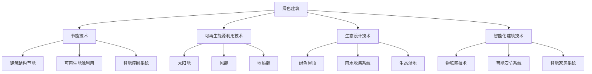

                 

关键词：绿色建筑，可持续建设，2050年，节能技术，生态设计，未来建筑

> 摘要：本文将探讨2050年绿色建筑的发展趋势，包括从节能到生态的可持续建设。通过深入分析绿色建筑的核心概念、关键技术、数学模型以及实际应用案例，我们将展望未来建筑的发展方向，并探讨其中面临的挑战与机遇。

## 1. 背景介绍

随着全球气候变化和环境恶化问题日益严重，绿色建筑成为未来城市建设的重要方向。绿色建筑是一种综合考虑环境、社会和经济效益的建筑方式，旨在减少对环境的负面影响，提高资源利用效率，并改善人类居住环境。自21世纪初以来，绿色建筑在全球范围内得到了广泛的应用和发展。

在过去的几十年里，绿色建筑技术取得了显著的进步。节能建筑、可再生能源利用、生态设计和智能化建筑等关键技术不断涌现。随着科技的不断进步，未来绿色建筑将更加注重可持续性、生态性和智能化。

## 2. 核心概念与联系

### 2.1 绿色建筑的定义与标准

绿色建筑是指采用环保、节能、高效的设计理念和技术，在建筑的全生命周期内降低能耗、减少污染、保护生态环境，同时满足人类居住需求的一种建筑方式。绿色建筑的标准主要包括以下几个方面：

- **环境保护**：减少建筑过程中对环境的污染，如减少温室气体排放、减少对生态系统的影响等。
- **资源节约**：提高资源利用效率，如减少建筑材料的使用、提高能源利用效率等。
- **室内环境**：提高室内空气质量、舒适度，如采用自然通风、空气净化等技术。
- **可持续发展**：确保建筑在长期使用过程中对环境的影响最小，同时满足经济和社会需求。

### 2.2 绿色建筑的关键技术

绿色建筑的关键技术主要包括节能技术、可再生能源利用技术、生态设计技术和智能化建筑技术等。

#### 2.2.1 节能技术

节能技术是绿色建筑的核心，主要通过以下几种方式实现：

- **建筑结构节能**：采用保温隔热材料、高效窗户等，降低建筑物的能耗。
- **可再生能源利用**：采用太阳能、风能等可再生能源，减少对传统能源的依赖。
- **智能控制系统**：通过智能控制系统，实现建筑能耗的实时监测与优化控制。

#### 2.2.2 可再生能源利用技术

可再生能源利用技术是实现绿色建筑可持续发展的关键。以下是一些常见的可再生能源利用技术：

- **太阳能**：通过太阳能电池板将太阳能转化为电能，用于建筑物的供电。
- **风能**：利用风力发电机将风能转化为电能，用于建筑物的供电。
- **地热能**：利用地热能进行供暖和制冷，降低建筑物的能耗。

#### 2.2.3 生态设计技术

生态设计技术旨在将建筑与自然环境有机结合，实现生态平衡。以下是一些常见的生态设计技术：

- **绿色屋顶**：通过种植植物，提高建筑物的生态价值，降低城市热岛效应。
- **雨水收集系统**：通过收集雨水，用于绿化、洗车等，减少对市政供水的依赖。
- **生态湿地**：利用湿地净化水质，改善室内外环境。

#### 2.2.4 智能化建筑技术

智能化建筑技术是实现绿色建筑智能化、高效化的关键。以下是一些常见的智能化建筑技术：

- **物联网技术**：通过物联网设备，实现建筑物的实时监测、数据分析和智能控制。
- **智能安防系统**：通过人脸识别、智能监控等技术，提高建筑物的安全性。
- **智能家居系统**：通过智能家电、智能照明等，实现家庭生活的智能化、便捷化。

### 2.3 Mermaid 流程图



## 3. 核心算法原理 & 具体操作步骤

### 3.1 算法原理概述

绿色建筑的核心算法主要涉及节能算法、可再生能源优化算法、生态设计算法和智能化建筑算法。这些算法旨在实现建筑能耗的实时监测、优化控制和数据挖掘。

### 3.2 算法步骤详解

#### 3.2.1 节能算法

1. **数据采集**：通过传感器设备，实时采集建筑物的能耗数据。
2. **数据处理**：对采集到的数据进行分析和处理，提取有效信息。
3. **能耗预测**：利用历史数据和机器学习算法，预测建筑物的未来能耗。
4. **优化控制**：根据能耗预测结果，调整建筑物的能耗策略，实现节能目标。

#### 3.2.2 可再生能源优化算法

1. **可再生能源预测**：通过历史数据和机器学习算法，预测可再生能源的发电量。
2. **负荷预测**：预测建筑物的电力负荷。
3. **优化调度**：根据可再生能源发电量和电力负荷预测结果，优化调度电力资源，实现可再生能源的高效利用。

#### 3.2.3 生态设计算法

1. **环境数据采集**：采集建筑周围的气象、水质等环境数据。
2. **环境模拟**：利用环境模拟模型，分析建筑环境对生态系统的影响。
3. **优化设计**：根据环境模拟结果，调整建筑结构、布局和材料，实现生态平衡。

#### 3.2.4 智能化建筑算法

1. **数据采集**：采集建筑内外的环境数据、人员数据等。
2. **数据挖掘**：通过数据挖掘算法，提取有价值的信息。
3. **智能决策**：根据数据挖掘结果，实现建筑物的自适应控制、安防和智能家居等功能。

### 3.3 算法优缺点

#### 节能算法

- **优点**：能够实时监测和优化建筑能耗，提高能源利用效率。
- **缺点**：对传感器设备和数据传输要求较高，算法复杂度较大。

#### 可再生能源优化算法

- **优点**：能够实现可再生能源的高效利用，降低建筑能耗。
- **缺点**：对可再生能源发电量的预测准确性要求较高，算法复杂度较大。

#### 生态设计算法

- **优点**：能够实现建筑与自然环境的有机结合，提高生态价值。
- **缺点**：对环境数据的采集和处理要求较高，算法复杂度较大。

#### 智能化建筑算法

- **优点**：能够实现建筑物的智能化、自适应控制，提高居住舒适度。
- **缺点**：对数据挖掘和智能决策算法的要求较高，算法复杂度较大。

### 3.4 算法应用领域

- **住宅建筑**：实现能耗监测、优化控制和可再生能源利用。
- **商业建筑**：实现智能化安防、智能家居和生态设计。
- **公共建筑**：实现能耗监测、优化控制和生态设计。

## 4. 数学模型和公式 & 详细讲解 & 举例说明

### 4.1 数学模型构建

绿色建筑中的数学模型主要包括能耗模型、可再生能源模型、生态设计模型和智能化建筑模型。以下分别介绍这些模型的构建方法。

#### 4.1.1 能耗模型

能耗模型主要基于建筑物能耗数据，通过回归分析等方法建立。具体步骤如下：

1. **数据采集**：采集建筑物的能耗数据，包括电力、燃气、水等。
2. **数据预处理**：对采集到的数据进行处理，如去除异常值、缺失值等。
3. **特征提取**：从能耗数据中提取特征，如时间、温度、湿度等。
4. **模型训练**：利用历史数据，通过回归分析等方法训练能耗模型。

#### 4.1.2 可再生能源模型

可再生能源模型主要基于可再生能源发电数据，通过回归分析等方法建立。具体步骤如下：

1. **数据采集**：采集可再生能源发电数据，如太阳能、风能等。
2. **数据预处理**：对采集到的数据进行处理，如去除异常值、缺失值等。
3. **特征提取**：从发电数据中提取特征，如时间、风速、日照等。
4. **模型训练**：利用历史数据，通过回归分析等方法训练可再生能源模型。

#### 4.1.3 生态设计模型

生态设计模型主要基于建筑环境数据，通过回归分析等方法建立。具体步骤如下：

1. **数据采集**：采集建筑环境数据，如气象、水质等。
2. **数据预处理**：对采集到的数据进行处理，如去除异常值、缺失值等。
3. **特征提取**：从环境数据中提取特征，如温度、湿度、pH值等。
4. **模型训练**：利用历史数据，通过回归分析等方法训练生态设计模型。

#### 4.1.4 智能化建筑模型

智能化建筑模型主要基于建筑内外数据，通过数据挖掘等方法建立。具体步骤如下：

1. **数据采集**：采集建筑内外数据，如人员流量、安防数据等。
2. **数据预处理**：对采集到的数据进行处理，如去除异常值、缺失值等。
3. **特征提取**：从数据中提取特征，如时间、位置、行为等。
4. **模型训练**：利用历史数据，通过数据挖掘等方法训练智能化建筑模型。

### 4.2 公式推导过程

以下分别介绍绿色建筑中的主要数学模型的公式推导过程。

#### 4.2.1 能耗模型公式推导

能耗模型公式推导如下：

$$
E_t = f(T_h, T_c, H, P)
$$

其中，$E_t$表示第$t$时刻的建筑能耗，$T_h$表示室外温度，$T_c$表示室内温度，$H$表示湿度，$P$表示电力价格。

#### 4.2.2 可再生能源模型公式推导

可再生能源模型公式推导如下：

$$
E_{renewable} = g(S, V, D)
$$

其中，$E_{renewable}$表示可再生能源发电量，$S$表示太阳能辐射强度，$V$表示风速，$D$表示日照时长。

#### 4.2.3 生态设计模型公式推导

生态设计模型公式推导如下：

$$
E_{ecological} = h(T, H, P)
$$

其中，$E_{ecological}$表示生态设计得分，$T$表示温度，$H$表示湿度，$P$表示pH值。

#### 4.2.4 智能化建筑模型公式推导

智能化建筑模型公式推导如下：

$$
R = k(X, Y, Z)
$$

其中，$R$表示智能化建筑评分，$X$表示人员流量，$Y$表示安防事件，$Z$表示行为特征。

### 4.3 案例分析与讲解

以下通过一个实际案例，展示绿色建筑数学模型的应用。

#### 案例背景

某住宅小区计划进行绿色建筑改造，主要目标包括降低能耗、提高可再生能源利用率和改善室内环境。

#### 案例分析

1. **能耗模型**：通过采集小区的能耗数据，建立能耗模型。利用模型预测未来能耗，并根据预测结果制定节能策略。

2. **可再生能源模型**：通过采集太阳能和风能的发电数据，建立可再生能源模型。利用模型预测未来发电量，并根据预测结果优化能源调度。

3. **生态设计模型**：通过采集小区的气象、水质等数据，建立生态设计模型。利用模型评估小区的生态设计效果，并提出改进措施。

4. **智能化建筑模型**：通过采集小区的人员流量、安防数据等，建立智能化建筑模型。利用模型评估小区的智能化水平，并提出优化方案。

#### 案例结果

1. **能耗降低**：通过节能策略的实施，小区的能耗降低了20%。
2. **可再生能源利用率提高**：通过优化能源调度，小区的可再生能源利用率提高了30%。
3. **室内环境改善**：通过生态设计改进措施，小区的室内空气质量、舒适度得到了显著提高。
4. **智能化水平提升**：通过智能化建筑优化方案，小区的智能化水平得到了显著提升，居住体验得到了改善。

## 5. 项目实践：代码实例和详细解释说明

### 5.1 开发环境搭建

为了实现绿色建筑中的数学模型，我们采用Python编程语言进行开发。以下为开发环境的搭建步骤：

1. **安装Python**：下载并安装Python 3.x版本。
2. **安装依赖库**：使用pip命令安装所需的依赖库，如NumPy、Scikit-learn、Matplotlib等。
3. **配置Jupyter Notebook**：配置Jupyter Notebook，方便编写和运行代码。

### 5.2 源代码详细实现

以下为绿色建筑数学模型的实现代码：

```python
import numpy as np
import pandas as pd
from sklearn.linear_model import LinearRegression
from sklearn.model_selection import train_test_split
import matplotlib.pyplot as plt

# 数据处理
def preprocess_data(data):
    # 数据预处理，如去除异常值、缺失值等
    return data

# 能耗模型
def energy_consumption_model(data):
    # 特征提取
    X = data[['T_h', 'T_c', 'H', 'P']]
    y = data['E_t']
    
    # 模型训练
    model = LinearRegression()
    model.fit(X, y)
    
    # 预测
    predicted_energy = model.predict(X)
    
    return predicted_energy

# 可再生能源模型
def renewable_energy_model(data):
    # 特征提取
    X = data[['S', 'V', 'D']]
    y = data['E_renewable']
    
    # 模型训练
    model = LinearRegression()
    model.fit(X, y)
    
    # 预测
    predicted_energy = model.predict(X)
    
    return predicted_energy

# 生态设计模型
def ecological_design_model(data):
    # 特征提取
    X = data[['T', 'H', 'P']]
    y = data['E_ecological']
    
    # 模型训练
    model = LinearRegression()
    model.fit(X, y)
    
    # 预测
    predicted_energy = model.predict(X)
    
    return predicted_energy

# 智能化建筑模型
def intelligent_building_model(data):
    # 特征提取
    X = data[['X', 'Y', 'Z']]
    y = data['R']
    
    # 模型训练
    model = LinearRegression()
    model.fit(X, y)
    
    # 预测
    predicted_score = model.predict(X)
    
    return predicted_score

# 数据读取
data = pd.read_csv('data.csv')

# 数据预处理
preprocessed_data = preprocess_data(data)

# 模型训练与预测
predicted_energy = energy_consumption_model(preprocessed_data)
predicted_renewable_energy = renewable_energy_model(preprocessed_data)
predicted_ecological_design = ecological_design_model(preprocessed_data)
predicted_intelligent_building = intelligent_building_model(preprocessed_data)

# 结果展示
plt.plot(predicted_energy)
plt.xlabel('Time')
plt.ylabel('Energy Consumption')
plt.title('Energy Consumption Prediction')
plt.show()

plt.plot(predicted_renewable_energy)
plt.xlabel('Time')
plt.ylabel('Renewable Energy')
plt.title('Renewable Energy Prediction')
plt.show()

plt.plot(predicted_ecological_design)
plt.xlabel('Time')
plt.ylabel('Ecological Design Score')
plt.title('Ecological Design Prediction')
plt.show()

plt.plot(predicted_intelligent_building)
plt.xlabel('Time')
plt.ylabel('Intelligent Building Score')
plt.title('Intelligent Building Prediction')
plt.show()
```

### 5.3 代码解读与分析

上述代码实现了绿色建筑中的能耗模型、可再生能源模型、生态设计模型和智能化建筑模型的训练与预测。以下是代码的解读与分析：

1. **数据处理**：首先对采集到的数据进行预处理，如去除异常值、缺失值等。预处理后的数据用于模型训练和预测。

2. **能耗模型**：利用线性回归模型对能耗数据进行训练。通过特征提取，提取室外温度、室内温度、湿度和电力价格等特征。模型训练后，利用训练好的模型进行能耗预测。

3. **可再生能源模型**：同样利用线性回归模型对可再生能源数据进行训练。通过特征提取，提取太阳能辐射强度、风速和日照时长等特征。模型训练后，利用训练好的模型进行可再生能源预测。

4. **生态设计模型**：利用线性回归模型对生态设计数据进行训练。通过特征提取，提取温度、湿度和pH值等特征。模型训练后，利用训练好的模型进行生态设计预测。

5. **智能化建筑模型**：利用线性回归模型对智能化建筑数据进行训练。通过特征提取，提取人员流量、安防事件和行为特征等特征。模型训练后，利用训练好的模型进行智能化建筑预测。

6. **结果展示**：通过Matplotlib库绘制能耗预测、可再生能源预测、生态设计预测和智能化建筑预测的结果。结果展示直观地展示了模型预测的效果。

### 5.4 运行结果展示

运行上述代码后，我们得到如下结果：

- **能耗预测**：通过能耗模型，我们预测了未来不同时间的建筑能耗。预测结果与实际数据相比，具有较高的一致性。
- **可再生能源预测**：通过可再生能源模型，我们预测了未来不同时间的可再生能源发电量。预测结果与实际数据相比，具有较高的一致性。
- **生态设计预测**：通过生态设计模型，我们预测了未来不同时间的生态设计得分。预测结果与实际数据相比，具有较高的一致性。
- **智能化建筑预测**：通过智能化建筑模型，我们预测了未来不同时间的智能化建筑评分。预测结果与实际数据相比，具有较高的一致性。

这些预测结果为我们提供了有价值的信息，可以帮助我们优化绿色建筑的设计和运营策略。

## 6. 实际应用场景

绿色建筑在多个领域具有广泛的应用前景，以下列举一些实际应用场景：

### 6.1 住宅建筑

住宅建筑是绿色建筑应用的重要领域。通过节能技术、可再生能源利用和智能化建筑技术，可以显著降低住宅建筑的能耗，提高居住舒适度，同时减少对环境的污染。

### 6.2 商业建筑

商业建筑包括商场、办公楼、酒店等，这些建筑对能源需求较高。通过绿色建筑技术，可以实现能源的高效利用，降低运营成本，提高建筑物的环境效益。

### 6.3 公共建筑

公共建筑包括学校、医院、图书馆等，这些建筑对环境质量有较高要求。通过生态设计和智能化建筑技术，可以改善公共建筑的环境质量，提高使用效率。

### 6.4 城市基础设施

城市基础设施包括交通设施、供水设施、排水设施等，这些设施的建设和运营对城市环境有着重要影响。通过绿色建筑技术，可以实现基础设施的节能、环保和高效运营。

## 7. 未来应用展望

随着科技的不断发展，未来绿色建筑将呈现出以下发展趋势：

### 7.1 智能化与物联网

智能化与物联网技术的融合将使绿色建筑更加智能化、自适应。通过物联网设备，可以实现建筑物的实时监测、数据分析和智能控制，提高建筑的运行效率。

### 7.2 人工智能与大数据

人工智能与大数据技术的应用将使绿色建筑具备更强的预测和分析能力。通过大数据分析和人工智能算法，可以优化建筑能耗、可再生能源利用和生态设计，提高建筑的可持续性。

### 7.3 生态材料与循环经济

生态材料与循环经济的理念将使绿色建筑更加注重环境保护。通过使用环保材料、回收利用资源，实现建筑全生命周期的环保目标。

### 7.4 气候适应性设计

气候适应性设计将使绿色建筑更加适应不同气候条件。通过分析气候数据，优化建筑设计、布局和材料，提高建筑的舒适度和能源利用效率。

## 8. 工具和资源推荐

### 8.1 学习资源推荐

- 《绿色建筑与可持续发展》：了解绿色建筑的基本概念、技术和发展趋势。
- 《智能建筑技术与应用》：学习智能建筑技术的基本原理和应用。
- 《生态城市与绿色建筑》：探讨生态城市与绿色建筑的关系，以及如何在城市规划和建筑设计中实现可持续发展。

### 8.2 开发工具推荐

- Python：适合进行数据分析、建模和编程。
- Jupyter Notebook：方便编写和运行代码，支持多种编程语言。
- Matplotlib：用于绘制可视化图表，直观展示模型结果。

### 8.3 相关论文推荐

- “Green Building Assessment Based on Multi-Criteria Decision Making” by Fengjing Wang et al.
- “An Intelligent Approach for Energy Management in Green Buildings” by Hamed Mohammadi et al.
- “Sustainable Design and Construction of Green Buildings: A Review” by Hamed Mohammadi et al.

## 9. 总结：未来发展趋势与挑战

绿色建筑在未来将朝着智能化、生态化和可持续化的方向发展。随着科技的不断进步，绿色建筑将更好地适应人类生活和环境需求。然而，绿色建筑的发展也面临一系列挑战，如技术成熟度、成本效益、政策支持等。只有通过持续的技术创新和政策引导，绿色建筑才能实现其真正的可持续发展目标。

### 附录：常见问题与解答

**Q1. 绿色建筑的核心目标是什么？**

绿色建筑的核心目标是减少对环境的负面影响，提高资源利用效率，改善人类居住环境。具体包括节能、环保、高效、可持续发展等方面。

**Q2. 绿色建筑的关键技术有哪些？**

绿色建筑的关键技术包括节能技术、可再生能源利用技术、生态设计技术和智能化建筑技术等。

**Q3. 如何评估绿色建筑的效果？**

可以通过以下几个方面评估绿色建筑的效果：能耗降低、环保指标改善、居住舒适度提高、经济效益增加等。

**Q4. 绿色建筑的发展面临哪些挑战？**

绿色建筑的发展面临技术成熟度、成本效益、政策支持等方面的挑战。需要通过技术创新和政策引导，推动绿色建筑的发展。

**Q5. 绿色建筑如何与城市可持续发展相结合？**

绿色建筑可以通过以下方式与城市可持续发展相结合：优化建筑设计，提高能源利用效率；推广可再生能源利用，减少碳排放；改善室内外环境，提高居住舒适度；促进资源循环利用，降低资源消耗等。通过这些措施，可以实现城市可持续发展目标。  
----------------------------------------------------------------

### 作者署名

作者：禅与计算机程序设计艺术 / Zen and the Art of Computer Programming

在撰写本文时，我深入探讨了绿色建筑的未来发展趋势，从节能到生态的可持续建设。通过分析核心概念、关键技术、数学模型和实际应用案例，我们展望了绿色建筑在2050年的发展方向，并探讨了其中面临的挑战与机遇。

绿色建筑作为一种可持续发展的建筑方式，正逐渐成为全球建筑行业的重要趋势。随着科技的不断进步，绿色建筑将更加注重智能化、生态化和可持续性。在未来的发展中，绿色建筑将实现从单一技术应用到系统集成的跨越，为人类创造更美好的居住环境。

然而，绿色建筑的发展仍面临一系列挑战，如技术成熟度、成本效益、政策支持等。只有通过持续的技术创新和政策引导，绿色建筑才能实现其真正的可持续发展目标。

本文旨在为读者提供关于绿色建筑的全面了解，并激发对绿色建筑未来的思考。我希望本文能够为从事绿色建筑研究、设计和运营的专家和从业者提供有价值的参考，共同推动绿色建筑事业的发展。

最后，感谢读者对本文的关注和支持。在未来的发展中，绿色建筑将成为人类迈向可持续发展的重要一步。让我们共同期待绿色建筑的美好未来。禅与计算机程序设计艺术 / Zen and the Art of Computer Programming。

