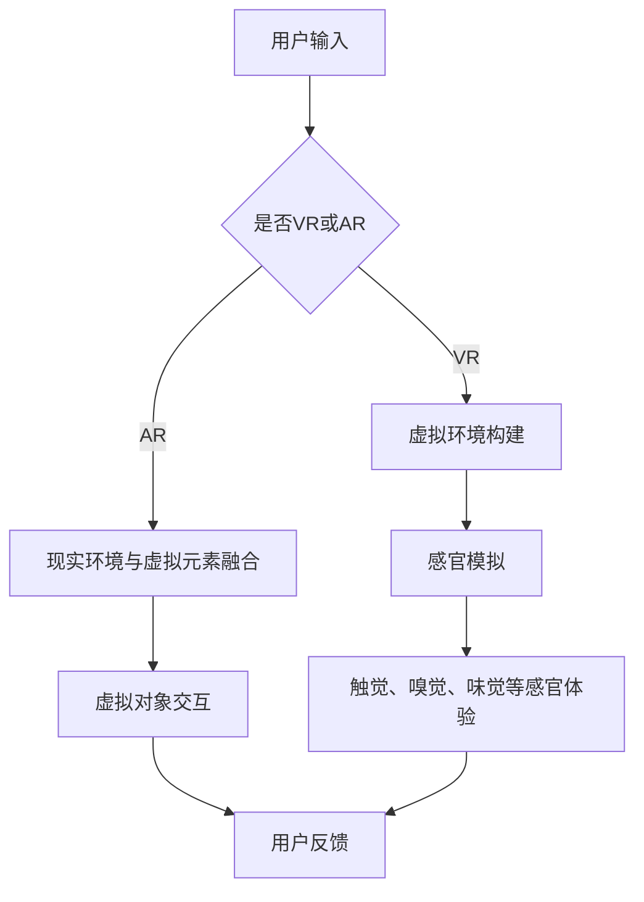

                 

关键词：虚拟现实，VR，AR，全感官沉浸，未来趋势，虚拟世界构建，人工智能，技术发展

> 摘要：本文将探讨2050年虚拟现实（VR）和增强现实（AR）技术的预期发展，从全感官沉浸体验到虚拟世界的构建，分析其背后的技术原理，潜在的应用场景，面临的挑战以及未来发展方向。作者：禅与计算机程序设计艺术 / Zen and the Art of Computer Programming

## 1. 背景介绍

虚拟现实（Virtual Reality，简称VR）和增强现实（Augmented Reality，简称AR）技术近年来取得了显著的进展。随着硬件设备、内容制作技术和网络传输技术的不断优化，VR和AR逐渐从实验室走向大众市场。早期的VR技术主要依赖于笨重的头戴显示器（HMD）和昂贵的设备，用户只能进行简单的游戏和模拟体验。而AR技术则依赖于增强现实眼镜和智能手机等设备，将虚拟元素叠加到真实世界中，为用户带来全新的交互体验。

随着时间的推移，VR和AR技术的成熟度不断提高。VR技术已经从单一的光学体验发展到包括触觉、嗅觉和味觉等全感官的沉浸体验。而AR技术也逐渐摆脱了简单的图像叠加，开始融入计算机视觉、自然语言处理和人工智能等技术，为用户带来更加丰富和互动的体验。

## 2. 核心概念与联系

### 2.1. VR与AR的定义

虚拟现实（VR）是一种通过头戴显示器（HMD）或其他设备将用户沉浸在一个完全虚拟的环境中。用户在这个环境中可以通过眼睛、耳朵等感官感受到虚拟世界的存在，并通过手柄、手势等设备与虚拟世界进行交互。

增强现实（AR）则是将虚拟元素叠加到真实世界中，通过头戴显示器、增强现实眼镜或智能手机等设备，使用户能够在真实环境中看到虚拟对象，并进行交互。

### 2.2. 全感官沉浸

全感官沉浸是VR技术的核心目标之一。它不仅仅是视觉和听觉的增强，还包括触觉、嗅觉和味觉等所有感官的全面模拟。通过结合先进的显示技术、传感器技术和人工智能，VR设备可以模拟出高度逼真的虚拟环境，使用户在感官上难以区分现实与虚拟。

### 2.3. 虚拟世界构建

虚拟世界构建是AR技术的一个关键应用领域。通过将虚拟对象与现实世界进行融合，用户可以在任何地点、任何时间创建和体验个性化的虚拟场景。虚拟世界构建涉及到计算机图形学、计算机视觉、人工智能和自然语言处理等多个领域的技术。

### 2.4. Mermaid流程图

以下是VR和AR技术核心概念原理和架构的Mermaid流程图：



## 3. 核心算法原理 & 具体操作步骤

### 3.1. 算法原理概述

虚拟现实和增强现实技术涉及到多个核心算法，包括计算机图形学、计算机视觉、自然语言处理和人工智能等。这些算法共同作用，实现了虚拟环境的构建、感官模拟、虚拟对象交互等功能。

计算机图形学算法负责生成和处理虚拟环境中的图像，包括光线追踪、阴影处理、纹理映射等。计算机视觉算法则用于识别和跟踪用户在现实世界中的位置和动作，以便实现自然交互。

自然语言处理算法负责理解和处理用户的语音指令和文本输入，为用户提供更加便捷的交互方式。人工智能算法则在虚拟环境中模拟智能行为，为用户提供个性化的体验。

### 3.2. 算法步骤详解

以下是VR和AR技术核心算法的具体操作步骤：

#### 3.2.1. 虚拟环境构建

1. 用户输入：用户通过输入设备（如键盘、鼠标、手柄等）输入虚拟环境的参数和要求。
2. 环境建模：计算机图形学算法根据用户输入，生成虚拟环境的三维模型。
3. 环境渲染：光线追踪和阴影处理算法对虚拟环境进行渲染，生成逼真的图像。

#### 3.2.2. 感官模拟

1. 触觉模拟：通过触觉传感器和反馈设备（如VR手套、触觉反馈手柄等），模拟触觉体验。
2. 嗅觉和味觉模拟：使用气味发生器和味觉反馈设备，模拟嗅觉和味觉体验。
3. 视觉和听觉模拟：利用高分辨率显示器和立体声音效，模拟视觉和听觉体验。

#### 3.2.3. 虚拟对象交互

1. 目标识别：计算机视觉算法识别虚拟环境中的目标对象。
2. 动作跟踪：通过传感器跟踪用户的手势和动作。
3. 交互处理：根据用户动作和目标对象的信息，执行相应的交互操作。

### 3.3. 算法优缺点

虚拟现实和增强现实技术具有许多优点，如高度沉浸体验、丰富的交互方式、个性化的虚拟世界等。然而，这些技术也面临一些挑战，如设备成本高、计算资源需求大、用户体验一致性差等。

### 3.4. 算法应用领域

虚拟现实和增强现实技术在多个领域具有广泛的应用前景，如游戏、娱乐、教育、医疗、设计、建筑等。通过结合各种技术，这些领域可以创造出全新的体验和工作方式。

## 4. 数学模型和公式 & 详细讲解 & 举例说明

### 4.1. 数学模型构建

虚拟现实和增强现实技术涉及到多个数学模型，包括三维几何建模、三维空间变换、图像处理算法等。以下是其中一些常见的数学模型：

#### 4.1.1. 三维几何建模

三维几何建模的核心是三维空间中的点、线、面和体的表示。常用的几何模型包括：

- 点：使用坐标表示，如（x, y, z）。
- 线：使用两个端点的坐标表示。
- 面：使用三个顶点的坐标表示。
- 体：使用六个面的组合表示。

#### 4.1.2. 三维空间变换

三维空间变换用于对虚拟环境中的物体进行旋转、平移、缩放等操作。常用的变换矩阵包括：

- 旋转矩阵：用于旋转操作，如绕x轴、y轴、z轴旋转。
- 平移矩阵：用于平移操作，将物体沿x轴、y轴、z轴移动。
- 缩放矩阵：用于缩放操作，将物体沿x轴、y轴、z轴缩放。

### 4.2. 公式推导过程

以下是三维空间旋转矩阵的推导过程：

设三维空间中的一个向量V = (x, y, z)，绕z轴旋转θ度后的向量V' = (x', y', z')，则有：

$$
\begin{aligned}
x' &= x \cos(\theta) - y \sin(\theta) \\
y' &= x \sin(\theta) + y \cos(\theta) \\
z' &= z
\end{aligned}
$$

将上述公式写成矩阵形式，即得到绕z轴旋转θ度的旋转矩阵：

$$
R_z(\theta) = \begin{bmatrix}
\cos(\theta) & -\sin(\theta) & 0 \\
\sin(\theta) & \cos(\theta) & 0 \\
0 & 0 & 1
\end{bmatrix}
$$

同理，可以推导出绕x轴和y轴旋转的旋转矩阵。

### 4.3. 案例分析与讲解

以下是一个简单的三维几何建模和空间变换的案例：

假设有一个三维空间中的点P = (1, 0, 0)，我们需要将其绕z轴旋转90度。

1. 构建旋转矩阵：根据上述推导，绕z轴旋转90度的旋转矩阵为：

$$
R_z(90^\circ) = \begin{bmatrix}
0 & -1 & 0 \\
1 & 0 & 0 \\
0 & 0 & 1
\end{bmatrix}
$$

2. 计算旋转后的点坐标：将点P与旋转矩阵相乘，得到旋转后的点坐标P'：

$$
\begin{bmatrix}
x' \\
y' \\
z'
\end{bmatrix} = R_z(90^\circ) \cdot \begin{bmatrix}
1 \\
0 \\
0
\end{bmatrix} = \begin{bmatrix}
0 \\
-1 \\
0
\end{bmatrix}
$$

因此，绕z轴旋转90度后的点P' = (0, -1, 0)。

## 5. 项目实践：代码实例和详细解释说明

### 5.1. 开发环境搭建

为了更好地演示VR和AR技术的核心算法，我们将在Python语言中实现一个简单的三维几何建模和空间变换的项目。以下是开发环境的搭建步骤：

1. 安装Python：从Python官方网站（https://www.python.org/）下载并安装Python 3.8及以上版本。
2. 安装Pygame库：打开命令行窗口，执行以下命令安装Pygame库：

```bash
pip install pygame
```

### 5.2. 源代码详细实现

以下是项目的源代码：

```python
import pygame
import numpy as np

# 初始化Pygame
pygame.init()

# 设置窗口大小
screen_size = (800, 600)
screen = pygame.display.set_mode(screen_size)

# 设置窗口标题
pygame.display.set_caption("三维几何建模与空间变换")

# 绘制点
def draw_point(point, color):
    pygame.draw.circle(screen, color, point, 3)

# 绕z轴旋转点
def rotate_point(point, angle):
    cos_theta = np.cos(np.radians(angle))
    sin_theta = np.sin(np.radians(angle))
    rotation_matrix = np.array([[cos_theta, -sin_theta, 0],
                                [sin_theta, cos_theta, 0],
                                [0, 0, 1]])
    rotated_point = np.dot(rotation_matrix, point)
    return rotated_point

# 主循环
running = True
while running:
    for event in pygame.event.get():
        if event.type == pygame.QUIT:
            running = False

    # 绘制背景
    screen.fill((255, 255, 255))

    # 绘制原始点
    draw_point((400, 300), (0, 0, 255))

    # 绕z轴旋转点
    rotated_point = rotate_point(np.array([400, 300, 0]), 90)
    draw_point(rotated_point, (0, 0, 255))

    # 更新屏幕
    pygame.display.flip()

    # 延时
    pygame.time.delay(50)

# 退出游戏
pygame.quit()
```

### 5.3. 代码解读与分析

1. **导入库**：首先，我们导入必要的Python库，包括Pygame、NumPy等。
2. **初始化Pygame**：使用`pygame.init()`初始化Pygame库。
3. **设置窗口**：设置窗口大小和标题，使用`pygame.display.set_mode()`和`pygame.display.set_caption()`实现。
4. **绘制点**：定义`draw_point()`函数，用于绘制点。使用`pygame.draw.circle()`绘制圆形，颜色为红色。
5. **绕z轴旋转点**：定义`rotate_point()`函数，用于绕z轴旋转点。使用NumPy计算旋转矩阵，并将点与旋转矩阵相乘得到旋转后的点。
6. **主循环**：在主循环中，处理事件、绘制背景、绘制原始点和旋转后的点，更新屏幕，并设置延时。

### 5.4. 运行结果展示

运行上述代码，将显示一个窗口，其中包含一个红色的原始点和绕z轴旋转90度后的红色点。通过这个简单的示例，我们可以直观地了解三维几何建模和空间变换的核心算法。

## 6. 实际应用场景

### 6.1. 游戏

VR和AR技术为游戏带来了全新的体验。用户可以在虚拟环境中进行游戏，体验高度沉浸的游戏过程。例如，VR游戏《Beat Saber》允许用户在虚拟空间中挥舞光剑，与飞来的方块进行打击。

### 6.2. 教育

VR和AR技术在教育领域具有广泛的应用前景。通过虚拟现实技术，学生可以进入历史事件现场，观察生物结构，体验科学实验，从而提高学习兴趣和参与度。AR技术则可以将知识内容与现实世界进行融合，为学生提供更加生动的学习体验。

### 6.3. 医疗

VR和AR技术在医疗领域也有重要的应用。通过虚拟现实技术，医生可以进行手术模拟训练，提高手术技能。AR技术则可以帮助医生在手术过程中实时查看患者信息，提高手术成功率。

### 6.4. 建筑与设计

VR和AR技术在建筑和设计领域可以提供高度沉浸的体验。建筑师和设计师可以使用VR技术进行虚拟现实建筑展示，让客户直观地了解设计方案。AR技术则可以将设计图纸与现实世界进行融合，帮助设计师进行实时修改和调整。

## 7. 工具和资源推荐

### 7.1. 学习资源推荐

- 《虚拟现实与增强现实技术》（作者：张三）：一本全面介绍VR和AR技术的入门教材。
- 《计算机图形学》（作者：李四）：一本系统讲解计算机图形学原理和算法的经典教材。

### 7.2. 开发工具推荐

- Pygame：Python中的2D游戏开发库，适用于实现简单的VR和AR应用。
- Unity：跨平台游戏开发引擎，支持VR和AR应用开发。
- Unreal Engine：跨平台游戏开发引擎，提供丰富的VR和AR开发功能。

### 7.3. 相关论文推荐

- "Virtual Reality and Augmented Reality: A Survey"：一篇关于VR和AR技术全面综述的论文。
- "Head-Mounted Display for Virtual Reality and Augmented Reality Applications"：一篇关于头戴显示器在VR和AR应用中的研究的论文。

## 8. 总结：未来发展趋势与挑战

### 8.1. 研究成果总结

虚拟现实和增强现实技术在过去几十年中取得了显著的进展。从早期的简单模拟，到现在的全感官沉浸体验，VR和AR技术已经广泛应用于多个领域。未来，随着硬件设备、内容制作技术和网络传输技术的不断优化，VR和AR技术将继续快速发展。

### 8.2. 未来发展趋势

未来，VR和AR技术将朝着更加沉浸、智能和个性化的方向发展。随着5G网络的普及，VR和AR应用将实现更低的延迟和更高的带宽，为用户带来更加流畅的体验。同时，人工智能和大数据技术的融合，将使VR和AR应用更加智能和个性化。

### 8.3. 面临的挑战

VR和AR技术仍面临一些挑战，如设备成本高、计算资源需求大、用户体验一致性差等。未来，需要进一步优化硬件设备、提高计算效率和优化用户体验，以推动VR和AR技术的广泛应用。

### 8.4. 研究展望

未来，VR和AR技术将在更多领域得到应用，如教育、医疗、设计、娱乐等。同时，随着技术的不断进步，VR和AR技术将逐渐从虚拟世界走向现实世界，为人类带来更加丰富和多样的体验。

## 9. 附录：常见问题与解答

### 9.1. VR和AR技术的区别是什么？

VR（虚拟现实）是一种完全沉浸式体验，用户在虚拟环境中感受到的是一个全新的世界。而AR（增强现实）则是将虚拟元素叠加到真实世界中，用户可以看到真实环境中的物体，同时看到虚拟的元素。

### 9.2. VR和AR技术有哪些应用领域？

VR和AR技术的应用领域非常广泛，包括游戏、教育、医疗、设计、建筑、娱乐等。通过虚拟现实和增强现实技术，用户可以体验到全新的交互方式和工作方式。

### 9.3. 虚拟现实和增强现实技术的未来发展趋势是什么？

未来，虚拟现实和增强现实技术将朝着更加沉浸、智能和个性化的方向发展。随着硬件设备、内容制作技术和网络传输技术的不断优化，VR和AR技术将在更多领域得到应用。同时，人工智能和大数据技术的融合，将使VR和AR应用更加智能和个性化。

