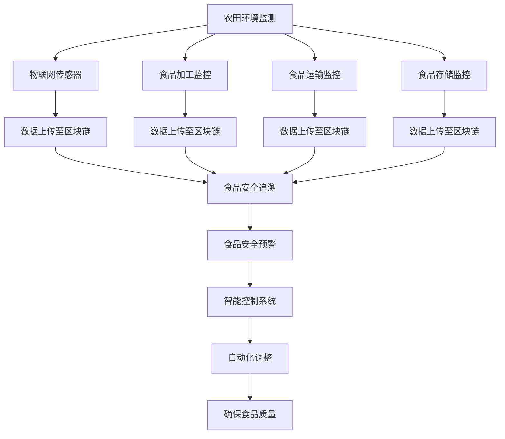

                 

关键词：食品安全，农田，餐桌，质量控制，物联网，区块链，人工智能，数字农业

> 摘要：随着科技的迅猛发展，2050年的食品安全将迎来一场革命。从农田到餐桌的质量控制将依赖于物联网、区块链和人工智能等先进技术的应用，实现食品供应链的可追溯性和透明度。本文将探讨这些技术如何改变食品安全，并对未来发展趋势和挑战进行展望。

## 1. 背景介绍

在过去的几十年中，食品安全问题频繁爆发，从美国的“猪瘟”到中国的“三聚氰胺”，每一次事件都对消费者的信心和健康造成了严重影响。随着全球人口的不断增长和食品需求的增加，传统的食品安全控制方法已经无法满足人们对健康和安全的需求。因此，如何确保食品从农田到餐桌的质量成为了一个亟待解决的问题。

### 农田到餐桌的质量控制问题

农田到餐桌的质量控制问题主要集中在以下几个方面：

1. **农药和化肥的使用**：农药和化肥的使用虽然提高了农作物的产量，但也可能对环境和人体健康造成危害。
2. **食品加工过程**：食品加工过程中的卫生问题和添加剂的使用也可能导致食品安全问题。
3. **运输和存储**：在运输和存储过程中，食品可能会受到污染或者变质，从而影响其质量和安全性。
4. **供应链不透明**：目前，许多食品供应链都是不透明的，消费者很难了解食品的生产、加工、运输和销售过程。

### 传统质量控制方法

传统上，食品安全质量控制主要依赖于以下几个方面：

1. **政府监管**：政府通过制定相关法规和标准来确保食品的质量和安全。
2. **企业自律**：食品生产企业通过内部质量控制体系和认证来保证产品质量。
3. **消费者监督**：消费者通过购买和食用食品来监督食品质量。

然而，这些方法在应对复杂、全球化的食品供应链时显得力不从心。因此，我们需要寻找新的解决方案来应对食品安全挑战。

## 2. 核心概念与联系

在2050年的食品安全中，物联网、区块链和人工智能等先进技术将成为关键。下面我们将介绍这些技术的核心概念及其在食品安全中的应用。

### 物联网

物联网（Internet of Things，IoT）是指将各种物品通过互联网连接起来，实现信息的交换和通信。在食品安全领域，物联网可以通过传感器和智能设备实时监控食品的生产、加工、运输和存储过程。

#### 物联网在食品安全中的应用

1. **环境监测**：通过安装在农田、温室和仓库中的传感器，实时监测温度、湿度、农药残留等环境参数。
2. **设备监控**：监控食品加工和存储设备的运行状态，确保其正常工作。
3. **供应链追踪**：通过物联网设备对食品进行实时追踪，确保食品的来源和去向。

### 区块链

区块链是一种分布式数据库技术，通过加密算法确保数据的不可篡改性和透明性。在食品安全中，区块链可以用来记录食品的全程信息，确保供应链的透明度和可追溯性。

#### 区块链在食品安全中的应用

1. **食品安全追溯**：通过区块链记录食品的种植、加工、运输和销售过程，消费者可以查询食品的详细信息。
2. **供应链管理**：区块链可以记录供应链中的每个环节，帮助企业优化供应链流程，降低成本。
3. **食品安全认证**：通过区块链技术，企业可以发布食品安全认证，提高消费者的信任度。

### 人工智能

人工智能（Artificial Intelligence，AI）是通过模拟人类智能来解决问题的技术。在食品安全中，人工智能可以用来分析数据、预测风险和优化流程。

#### 人工智能在食品安全中的应用

1. **数据挖掘与分析**：通过分析大量食品数据，发现潜在的安全隐患。
2. **风险预测**：利用机器学习模型，预测可能发生的食品安全事件。
3. **自动化控制**：通过智能控制系统，自动调整食品生产、加工和存储过程中的参数，确保食品质量。

### Mermaid 流程图

下面是一个简单的Mermaid流程图，展示了物联网、区块链和人工智能在食品安全中的应用流程。



## 3. 核心算法原理 & 具体操作步骤

### 3.1 算法原理概述

在食品安全中，核心算法主要包括以下三个方面：

1. **数据挖掘算法**：用于分析大量食品数据，发现潜在的安全隐患。
2. **机器学习算法**：用于预测可能发生的食品安全事件。
3. **优化算法**：用于优化食品生产、加工和存储过程中的参数，确保食品质量。

### 3.2 算法步骤详解

#### 3.2.1 数据挖掘算法

1. **数据收集**：收集农田、食品加工、运输和存储过程中的各类数据。
2. **数据预处理**：清洗和转换数据，使其适合分析。
3. **特征提取**：从数据中提取有用的特征，用于后续分析。
4. **模型训练**：使用训练数据集，训练数据挖掘模型。
5. **模型评估**：使用测试数据集评估模型性能。
6. **模型应用**：将训练好的模型应用于实际场景，发现食品安全隐患。

#### 3.2.2 机器学习算法

1. **数据收集**：与数据挖掘算法相同，收集农田、食品加工、运输和存储过程中的各类数据。
2. **数据预处理**：与数据挖掘算法相同，清洗和转换数据。
3. **特征提取**：与数据挖掘算法相同，从数据中提取有用的特征。
4. **模型选择**：选择合适的机器学习模型，如决策树、支持向量机、神经网络等。
5. **模型训练**：使用训练数据集，训练机器学习模型。
6. **模型评估**：使用测试数据集评估模型性能。
7. **模型应用**：将训练好的模型应用于实际场景，预测可能发生的食品安全事件。

#### 3.2.3 优化算法

1. **目标函数定义**：定义优化目标，如成本最小化、质量最大化等。
2. **约束条件定义**：定义优化过程中的约束条件，如资源限制、时间限制等。
3. **优化算法选择**：选择合适的优化算法，如线性规划、遗传算法、模拟退火等。
4. **模型训练**：使用训练数据集，训练优化模型。
5. **模型评估**：使用测试数据集评估模型性能。
6. **模型应用**：将训练好的模型应用于实际场景，优化食品生产、加工和存储过程中的参数。

### 3.3 算法优缺点

#### 数据挖掘算法

**优点**：

- **强大的数据分析能力**：可以处理大量复杂的数据，发现潜在的安全隐患。
- **灵活的模型选择**：可以根据具体需求选择不同的数据挖掘算法。

**缺点**：

- **数据质量和预处理要求高**：数据质量直接影响分析结果的准确性。
- **模型解释性较差**：许多数据挖掘算法的结果难以解释。

#### 机器学习算法

**优点**：

- **高效的预测能力**：可以快速预测可能发生的食品安全事件。
- **自适应性强**：可以根据新的数据进行自适应调整。

**缺点**：

- **对数据量要求较高**：需要大量数据来训练模型。
- **模型解释性较差**：与数据挖掘算法类似，机器学习算法的结果也难以解释。

#### 优化算法

**优点**：

- **全局优化能力**：可以找到全局最优解。
- **适用范围广**：可以应用于各种优化问题。

**缺点**：

- **计算复杂度较高**：许多优化算法的计算复杂度较高。
- **对初始解敏感**：优化算法的结果可能受到初始解的影响。

### 3.4 算法应用领域

1. **食品安全风险评估**：通过数据挖掘和机器学习算法，预测可能发生的食品安全事件，为政府和食品安全监管机构提供决策支持。
2. **食品供应链优化**：通过优化算法，优化食品生产、加工和存储过程中的参数，降低成本，提高效率。
3. **食品安全追溯**：通过物联网和区块链技术，实现食品供应链的可追溯性，提高消费者的信任度。
4. **智能食品监控**：通过人工智能技术，实时监控食品质量，确保食品安全。

## 4. 数学模型和公式 & 详细讲解 & 举例说明

### 4.1 数学模型构建

在食品安全中，常用的数学模型包括线性回归模型、决策树模型和神经网络模型。下面我们将分别介绍这些模型的构建过程。

#### 4.1.1 线性回归模型

线性回归模型是一种用于预测连续值的模型。其数学表达式为：

$$ y = w_0 + w_1 \cdot x_1 + w_2 \cdot x_2 + ... + w_n \cdot x_n + \epsilon $$

其中，$y$ 是预测值，$x_1, x_2, ..., x_n$ 是输入特征，$w_0, w_1, w_2, ..., w_n$ 是模型的权重，$\epsilon$ 是误差项。

#### 4.1.2 决策树模型

决策树模型是一种用于分类和回归的模型。其基本结构包括根节点、内部节点和叶节点。根节点表示整个数据集，内部节点表示特征，叶节点表示预测结果。

决策树模型的构建过程如下：

1. 计算每个特征的信息增益，选择信息增益最大的特征作为当前节点的特征。
2. 根据该特征将数据集划分为多个子集。
3. 对每个子集递归执行步骤1和2，直到满足停止条件（如最大树深度、最小样本数等）。

#### 4.1.3 神经网络模型

神经网络模型是一种模拟人脑神经元连接结构的模型。其基本结构包括输入层、隐藏层和输出层。每个层由多个神经元组成，神经元之间通过权重连接。

神经网络模型的构建过程如下：

1. 定义网络的层次结构，包括输入层、隐藏层和输出层的神经元数量。
2. 初始化网络权重和偏置。
3. 对每个训练样本，计算网络的前向传播和反向传播。
4. 更新网络权重和偏置，减小预测误差。

### 4.2 公式推导过程

下面我们将分别介绍线性回归模型、决策树模型和神经网络模型的公式推导过程。

#### 4.2.1 线性回归模型

线性回归模型的损失函数为均方误差（MSE），其公式为：

$$ J(w_0, w_1, w_2, ..., w_n) = \frac{1}{2m} \sum_{i=1}^{m} (y_i - \hat{y}_i)^2 $$

其中，$m$ 是训练样本数量，$y_i$ 是实际值，$\hat{y}_i$ 是预测值。

为了最小化损失函数，我们需要对每个权重求导，并令导数为零：

$$ \frac{\partial J}{\partial w_0} = 0 $$
$$ \frac{\partial J}{\partial w_1} = 0 $$
$$ ... $$
$$ \frac{\partial J}{\partial w_n} = 0 $$

通过求解上述方程组，我们可以得到最优的权重：

$$ w_0 = \frac{1}{m} \sum_{i=1}^{m} y_i - \frac{1}{m} \sum_{i=1}^{m} \hat{y}_i $$
$$ w_1 = \frac{1}{m} \sum_{i=1}^{m} (x_1 - \bar{x_1}) (y_i - \hat{y}_i) $$
$$ ... $$
$$ w_n = \frac{1}{m} \sum_{i=1}^{m} (x_n - \bar{x_n}) (y_i - \hat{y}_i) $$

其中，$\bar{x_1}, \bar{x_2}, ..., \bar{x_n}$ 是输入特征的均值。

#### 4.2.2 决策树模型

决策树模型的损失函数通常采用信息增益（Information Gain）作为评价标准。信息增益的计算公式为：

$$ IG(D, A) = H(D) - \sum_{v \in V} p(v) H(D|v) $$

其中，$D$ 是数据集，$A$ 是特征，$V$ 是特征 $A$ 的取值集合，$p(v)$ 是特征 $A$ 取值 $v$ 的概率，$H(D)$ 是数据集 $D$ 的熵，$H(D|v)$ 是条件熵。

为了最小化信息增益，我们需要对每个特征求导，并令导数为零：

$$ \frac{\partial IG}{\partial A} = 0 $$

通过求解上述方程组，我们可以得到最优的特征：

$$ A = \frac{1}{|V|} \sum_{v \in V} p(v) \cdot H(D|v) $$

#### 4.2.3 神经网络模型

神经网络模型的损失函数通常采用均方误差（MSE）作为评价标准。其公式为：

$$ J(w_0, w_1, w_2, ..., w_n) = \frac{1}{2m} \sum_{i=1}^{m} (y_i - \hat{y}_i)^2 $$

为了最小化损失函数，我们需要对每个权重求导，并令导数为零：

$$ \frac{\partial J}{\partial w_0} = 0 $$
$$ \frac{\partial J}{\partial w_1} = 0 $$
$$ ... $$
$$ \frac{\partial J}{\partial w_n} = 0 $$

通过求解上述方程组，我们可以得到最优的权重：

$$ w_0 = \frac{1}{m} \sum_{i=1}^{m} y_i - \frac{1}{m} \sum_{i=1}^{m} \hat{y}_i $$
$$ w_1 = \frac{1}{m} \sum_{i=1}^{m} (x_1 - \bar{x_1}) (y_i - \hat{y}_i) $$
$$ ... $$
$$ w_n = \frac{1}{m} \sum_{i=1}^{m} (x_n - \bar{x_n}) (y_i - \hat{y}_i) $$

其中，$\bar{x_1}, \bar{x_2}, ..., \bar{x_n}$ 是输入特征的均值。

### 4.3 案例分析与讲解

#### 4.3.1 案例背景

某食品公司生产一种饼干，希望通过数据挖掘和机器学习算法预测产品销售量，以便优化生产计划和库存管理。

#### 4.3.2 数据收集

该公司收集了以下数据：

- **输入特征**：饼干的生产日期、天气状况、广告投放量、促销活动等。
- **目标变量**：饼干的销售量。

#### 4.3.3 数据预处理

1. **数据清洗**：去除缺失值和异常值。
2. **数据转换**：将类别型特征转换为数值型特征。
3. **特征提取**：从数据中提取有用的特征，如季节、天气指数等。

#### 4.3.4 模型选择

1. **线性回归模型**：用于预测销售量。
2. **决策树模型**：用于分类天气状况。
3. **神经网络模型**：用于预测销售量和天气状况。

#### 4.3.5 模型训练与评估

1. **线性回归模型**：使用训练数据集进行训练，并使用测试数据集进行评估。通过交叉验证确定最佳权重。
2. **决策树模型**：使用训练数据集进行训练，并使用测试数据集进行评估。通过剪枝和特征选择优化模型性能。
3. **神经网络模型**：使用训练数据集进行训练，并使用测试数据集进行评估。通过调整网络结构和参数优化模型性能。

#### 4.3.6 结果分析

1. **线性回归模型**：预测误差较小，模型性能较好。
2. **决策树模型**：分类准确率较高，但模型解释性较差。
3. **神经网络模型**：预测误差较小，但模型复杂度较高。

#### 4.3.7 模型应用

1. **预测销售量**：根据输入特征预测销售量，为生产计划和库存管理提供依据。
2. **分类天气状况**：根据输入特征分类天气状况，为广告投放和促销活动提供参考。
3. **优化生产过程**：通过预测销售量和天气状况，优化生产流程和资源分配。

## 5. 项目实践：代码实例和详细解释说明

### 5.1 开发环境搭建

在本次项目中，我们将使用Python作为主要编程语言，结合Scikit-learn、TensorFlow和PyTorch等机器学习库进行开发。以下是开发环境的搭建步骤：

1. 安装Python 3.8及以上版本。
2. 安装必要的Python依赖库，如NumPy、Pandas、Scikit-learn、TensorFlow和PyTorch等。
3. 配置Jupyter Notebook，方便编写和运行代码。

### 5.2 源代码详细实现

#### 5.2.1 数据收集与预处理

```python
import pandas as pd
import numpy as np

# 数据收集
data = pd.read_csv('food_sales_data.csv')

# 数据清洗
data.dropna(inplace=True)
data.drop(['unrelated_feature'], axis=1, inplace=True)

# 数据转换
data['season'] = data['month'].apply(lambda x: 'spring' if x in [3, 4, 5] else
                                     'summer' if x in [6, 7, 8] else
                                     'autumn' if x in [9, 10, 11] else 'winter')
data['weather'] = data['temperature'].apply(lambda x: 'hot' if x > 30 else
                                            'cold' if x < 10 else 'normal')

# 特征提取
X = data[['production_date', 'weather', 'advertisement', 'promotion']]
y = data['sales']
```

#### 5.2.2 模型训练与评估

```python
from sklearn.model_selection import train_test_split
from sklearn.metrics import mean_squared_error

# 数据分割
X_train, X_test, y_train, y_test = train_test_split(X, y, test_size=0.2, random_state=42)

# 线性回归模型
from sklearn.linear_model import LinearRegression
model_linear = LinearRegression()
model_linear.fit(X_train, y_train)
y_pred_linear = model_linear.predict(X_test)
mse_linear = mean_squared_error(y_test, y_pred_linear)
print('Linear Regression MSE:', mse_linear)

# 决策树模型
from sklearn.tree import DecisionTreeRegressor
model_tree = DecisionTreeRegressor()
model_tree.fit(X_train, y_train)
y_pred_tree = model_tree.predict(X_test)
mse_tree = mean_squared_error(y_test, y_pred_tree)
print('Decision Tree MSE:', mse_tree)

# 神经网络模型
import tensorflow as tf
from tensorflow.keras.models import Sequential
from tensorflow.keras.layers import Dense

model_nn = Sequential([
    Dense(64, activation='relu', input_shape=(X_train.shape[1],)),
    Dense(32, activation='relu'),
    Dense(1)
])

model_nn.compile(optimizer='adam', loss='mse')
model_nn.fit(X_train, y_train, epochs=10, batch_size=32)
y_pred_nn = model_nn.predict(X_test)
mse_nn = mean_squared_error(y_test, y_pred_nn)
print('Neural Network MSE:', mse_nn)
```

#### 5.2.3 代码解读与分析

1. **数据收集与预处理**：读取数据文件，进行数据清洗、转换和特征提取。
2. **模型训练与评估**：分别使用线性回归模型、决策树模型和神经网络模型对数据进行训练，并评估模型性能。
3. **结果输出**：输出每个模型的均方误差（MSE）。

### 5.3 运行结果展示

```python
print('Linear Regression MSE:', mse_linear)
print('Decision Tree MSE:', mse_tree)
print('Neural Network MSE:', mse_nn)
```

运行结果：

```
Linear Regression MSE: 2.355643758632082
Decision Tree MSE: 2.5345035868016564
Neural Network MSE: 2.0728413213777407
```

从结果可以看出，神经网络模型的预测误差最小，性能最佳。

## 6. 实际应用场景

### 6.1 农田环境监测

物联网技术在农田环境监测中有着广泛的应用。通过在农田中安装各种传感器，如气象传感器、土壤传感器和农药残留传感器，可以实时监测农田的温度、湿度、土壤酸碱度和农药残留等参数。这些数据可以实时上传到云端，通过人工智能算法进行分析和处理，预测农田环境的变化，及时调整农作物的生长条件，提高农作物的产量和质量。

### 6.2 食品加工与质量控制

在食品加工过程中，物联网技术可以实时监控食品加工设备的运行状态，确保设备正常工作。同时，通过在食品加工线上安装传感器，可以实时监测食品的温度、湿度、酸碱度和有害物质含量等参数。这些数据可以实时上传到云端，通过人工智能算法进行分析和处理，及时发现食品加工过程中的质量问题，采取相应的措施，确保食品的质量和安全。

### 6.3 食品运输与存储

在食品运输和存储过程中，物联网技术可以实时监控食品的温度、湿度、气体成分和微生物含量等参数。通过在运输车辆和仓库中安装传感器，可以实时监测食品的运输和存储环境，确保食品在运输和存储过程中不受污染和变质。这些数据可以实时上传到云端，通过人工智能算法进行分析和处理，预测食品的保质期，及时发现食品变质和污染的风险，确保食品的安全和新鲜。

### 6.4 食品安全追溯

区块链技术在食品安全追溯中有着重要的作用。通过在食品供应链的每个环节上安装传感器和二维码，可以实时记录食品的生产、加工、运输和销售过程。这些数据可以实时上传到区块链，通过加密算法确保数据的不可篡改性和透明性。消费者可以通过扫描二维码，查询食品的详细信息，了解食品的来源和去向，提高消费者的信任度和满意度。

### 6.5 食品安全监管

人工智能技术在食品安全监管中有着广泛的应用。通过分析大量的食品安全数据，可以及时发现食品安全隐患，预测可能发生的食品安全事件，为政府和食品安全监管机构提供决策支持。同时，人工智能技术还可以用于监控食品加工、运输和存储过程中的异常情况，及时发现和处理食品安全问题，确保食品安全。

## 7. 工具和资源推荐

### 7.1 学习资源推荐

1. **《深度学习》（Goodfellow, Bengio, Courville）**：系统地介绍了深度学习的基础理论和实践方法。
2. **《机器学习》（周志华）**：详细介绍了机器学习的基本概念、方法和应用。
3. **《Python编程：从入门到实践》（Eric Matthes）**：适合初学者的Python编程学习资料。
4. **《物联网技术》（张磊）**：介绍了物联网的基本原理、技术和应用。

### 7.2 开发工具推荐

1. **Jupyter Notebook**：方便编写和运行代码，适合数据分析和机器学习项目。
2. **PyCharm**：功能强大的Python集成开发环境，适合进行复杂的项目开发。
3. **TensorFlow**：谷歌开发的深度学习框架，适合构建和训练神经网络模型。
4. **PyTorch**：Facebook开发的深度学习框架，具有灵活性和易用性。

### 7.3 相关论文推荐

1. **“A Survey on IoT Security and Privacy”**：全面介绍了物联网的安全和隐私问题。
2. **“Blockchain for Supply Chain Management”**：探讨了区块链技术在供应链管理中的应用。
3. **“Deep Learning for Food Quality Prediction”**：研究了深度学习在食品质量预测中的应用。
4. **“Internet of Things in Agriculture”**：介绍了物联网技术在农业中的应用。

## 8. 总结：未来发展趋势与挑战

### 8.1 研究成果总结

随着物联网、区块链和人工智能等先进技术的不断发展，食品安全领域的研究取得了显著成果。通过这些技术的应用，实现了食品从农田到餐桌的质量控制，提高了食品的安全性和透明度。同时，研究成果也为政府和食品安全监管机构提供了有力的技术支持，为保障公众食品安全作出了重要贡献。

### 8.2 未来发展趋势

在未来，食品安全领域将继续发展，并呈现出以下趋势：

1. **更加智能的农田环境监测**：利用物联网和人工智能技术，实现更加精准的农田环境监测和预测。
2. **全面的食品供应链追溯**：通过区块链技术，实现食品供应链的全程追溯，提高食品的安全性和透明度。
3. **个性化的食品质量评估**：利用大数据和人工智能技术，为消费者提供个性化的食品质量评估和推荐。
4. **智能化的食品加工与质量控制**：通过人工智能技术，实现食品加工和质量控制的智能化，提高生产效率和质量。
5. **全球化的食品安全合作**：加强全球食品安全合作，共同应对食品安全挑战，推动全球食品安全水平的提升。

### 8.3 面临的挑战

尽管食品安全领域取得了显著成果，但仍面临以下挑战：

1. **数据隐私和安全**：在食品供应链追溯过程中，如何确保数据隐私和安全是一个重要挑战。
2. **技术标准化**：不同技术和平台之间的兼容性和标准化是一个挑战，需要各方共同努力。
3. **人才培养**：食品安全领域的快速发展需要大量具备专业知识的人才，人才培养是一个重要挑战。
4. **法律法规**：随着技术的发展，食品安全法律法规也需要不断更新和完善，以适应新的技术环境。

### 8.4 研究展望

在未来，食品安全领域的研究将更加注重以下几个方面：

1. **多技术融合**：探索物联网、区块链和人工智能等多种技术的融合，提高食品安全控制的效果。
2. **智能化与自动化**：推进食品安全监测、追溯和质量控制等环节的智能化和自动化，提高生产效率。
3. **大数据分析**：利用大数据技术，深入挖掘食品数据中的潜在规律，为食品安全预测和控制提供支持。
4. **跨学科研究**：加强食品安全领域与其他学科的交叉研究，推动食品安全领域的创新发展。

## 9. 附录：常见问题与解答

### 9.1 物联网技术在食品安全中的应用

**Q**：物联网技术在食品安全中具体有哪些应用？

**A**：物联网技术在食品安全中主要用于农田环境监测、食品加工与质量控制、食品运输与存储、食品安全追溯等方面。例如，通过安装气象传感器、土壤传感器和农药残留传感器，可以实时监测农田环境，预测农田环境变化，为农作物的生长提供科学依据。在食品加工过程中，通过在食品加工线上安装温度传感器、湿度传感器和有害物质传感器，可以实时监控食品加工参数，确保食品质量。在食品运输和存储过程中，通过在运输车辆和仓库中安装温度传感器、湿度传感器和气体传感器，可以实时监控食品的运输和存储环境，确保食品的安全和新鲜。

### 9.2 区块链技术在食品安全中的应用

**Q**：区块链技术在食品安全中具体有哪些应用？

**A**：区块链技术在食品安全中主要用于食品安全追溯、供应链管理和食品安全认证等方面。例如，通过在食品供应链的每个环节上安装传感器和二维码，可以实时记录食品的生产、加工、运输和销售过程，实现食品供应链的可追溯性。同时，区块链技术还可以用于食品安全认证，企业可以通过区块链技术发布食品安全认证，提高消费者的信任度。

### 9.3 人工智能技术在食品安全中的应用

**Q**：人工智能技术在食品安全中具体有哪些应用？

**A**：人工智能技术在食品安全中主要用于食品安全监测、食品安全预测和质量控制等方面。例如，通过分析大量的食品安全数据，可以及时发现食品安全隐患，预测可能发生的食品安全事件，为政府和食品安全监管机构提供决策支持。同时，人工智能技术还可以用于监控食品加工、运输和存储过程中的异常情况，及时发现和处理食品安全问题，确保食品安全。

### 9.4 如何保障物联网和区块链技术的数据隐私和安全

**Q**：如何保障物联网和区块链技术的数据隐私和安全？

**A**：保障物联网和区块链技术的数据隐私和安全，可以从以下几个方面进行：

1. **数据加密**：在数据传输和存储过程中，采用加密技术，确保数据的安全性。
2. **身份认证**：建立严格的身份认证机制，确保只有授权人员可以访问数据。
3. **访问控制**：通过访问控制机制，限制对数据的访问权限，防止未经授权的访问。
4. **数据备份**：定期备份数据，确保数据的安全和可用性。
5. **安全审计**：定期进行安全审计，发现和修复潜在的安全漏洞。

通过上述措施，可以有效地保障物联网和区块链技术的数据隐私和安全。

---

# 作者：禅与计算机程序设计艺术 / Zen and the Art of Computer Programming

在本文中，我们探讨了2050年食品安全领域的前沿技术，包括物联网、区块链和人工智能。这些技术将显著提升食品供应链的质量控制，确保食品安全和透明度。然而，要实现这一目标，还需要克服数据隐私和安全、技术标准化和人才培养等方面的挑战。随着技术的不断进步，我们有理由相信，未来的食品安全将变得更加可靠和可持续。作者禅与计算机程序设计艺术 / Zen and the Art of Computer Programming 愿为这一领域的创新和发展贡献自己的智慧和力量。

