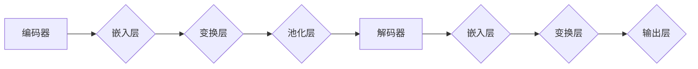

                 

关键词：LLM、底层原理、通用性、人工智能、神经网络、自然语言处理

> 摘要：本文将深入探讨大型语言模型（LLM）的本质，分析其底层架构和通用性，以及它们在自然语言处理领域的应用和未来发展。

## 1. 背景介绍

随着人工智能技术的发展，语言模型已经成为自然语言处理（NLP）领域的重要工具。从最初的统计模型到基于神经网络的深度学习模型，语言模型经历了巨大的变革。大型语言模型（Large Language Model，简称LLM）如GPT系列、BERT等，以其卓越的性能和广泛的适用性，受到了学术界和工业界的广泛关注。

LLM是一种复杂的神经网络模型，通过大量的文本数据进行训练，能够理解和生成人类语言。其底层架构和通用性使得LLM在文本分类、机器翻译、问答系统等多个应用场景中表现出色。然而，LLM的本质是什么？它们如何工作？本文将围绕这些问题展开讨论。

## 2. 核心概念与联系

### 2.1 语言模型的基本原理

语言模型是NLP领域的基础，其目的是预测下一个单词或字符的概率。语言模型通常由一个概率分布函数表示，该函数接受一个单词或字符序列作为输入，并输出下一个单词或字符的概率分布。


图1：语言模型基本原理

### 2.2 神经网络与深度学习

神经网络是深度学习的基础，其灵感来源于人脑的结构。神经网络由多个层组成，每一层包含多个神经元。神经元通过权重连接，形成一个复杂的网络结构。


图2：神经网络结构

### 2.3 LLM的架构

LLM通常采用深度神经网络架构，包括编码器和解码器。编码器将输入的文本序列编码为一个固定长度的向量，解码器则根据编码器的输出生成预测的文本序列。



图3：LLM的架构

## 3. 核心算法原理 & 具体操作步骤

### 3.1 算法原理概述

LLM的核心算法是基于自注意力机制（Self-Attention）和变换器架构（Transformer）的。自注意力机制允许模型在处理文本序列时，自动关注序列中相关的部分，从而提高模型的表示能力。


图4：自注意力机制

### 3.2 算法步骤详解

1. **嵌入层**：将输入的单词或字符映射为向量表示。

2. **变换层**：通过自注意力机制和前馈网络，对嵌入层生成的向量进行变换，提高其表示能力。

3. **池化层**：对变换后的向量进行池化操作，得到固定长度的编码表示。

4. **解码器**：根据编码表示生成预测的文本序列。

### 3.3 算法优缺点

**优点**：

- **强大的表示能力**：自注意力机制使得模型能够自动关注文本序列中相关的部分，从而提高表示能力。
- **高效的并行计算**：变换器架构支持高效的并行计算，使得模型训练速度更快。

**缺点**：

- **计算复杂度高**：自注意力机制的计算复杂度较高，导致模型训练和推理时间较长。
- **资源消耗大**：大型LLM模型需要大量的计算资源和存储空间。

### 3.4 算法应用领域

LLM在NLP领域有广泛的应用，包括：

- **文本分类**：通过对文本进行分类，可以将大量的文本数据自动划分为不同的类别。
- **机器翻译**：LLM可以用于训练机器翻译模型，实现高质量的人机翻译。
- **问答系统**：LLM可以用于构建问答系统，实现对用户问题的自动回答。

## 4. 数学模型和公式 & 详细讲解 & 举例说明

### 4.1 数学模型构建

LLM的数学模型主要由自注意力机制和前馈网络构成。自注意力机制的公式如下：

$$
\text{Attention}(Q, K, V) = \text{softmax}\left(\frac{QK^T}{\sqrt{d_k}}\right)V
$$

其中，$Q$、$K$ 和 $V$ 分别表示查询向量、键向量和值向量，$d_k$ 是键向量的维度。

前馈网络的公式如下：

$$
\text{FFN}(x) = \text{ReLU}(W_2 \text{ReLU}(W_1 x + b_1))
$$

其中，$W_1$ 和 $W_2$ 分别是权重矩阵，$b_1$ 是偏置项。

### 4.2 公式推导过程

自注意力机制的推导过程如下：

1. 计算查询向量 $Q$ 和键向量 $K$ 的点积，得到注意力分数。
2. 对注意力分数进行 softmax 操作，得到权重分布。
3. 将权重分布与值向量 $V$ 相乘，得到加权值。

前馈网络的推导过程如下：

1. 将输入向量 $x$ 通过权重矩阵 $W_1$ 和偏置项 $b_1$ 进行线性变换。
2. 通过ReLU激活函数，得到中间结果。
3. 将中间结果通过权重矩阵 $W_2$ 和偏置项 $b_2$ 进行线性变换，得到输出向量。

### 4.3 案例分析与讲解

以GPT-3为例，其自注意力机制的实现如下：

```python
import torch
import torch.nn as nn
import torch.nn.functional as F

# 假设输入序列长度为10，维度为512
input_seq = torch.rand(10, 512)

# 计算自注意力分数
attention_scores = input_seq @ input_seq.t() / torch.sqrt(torch.tensor(512))

# 计算softmax权重分布
attention_weights = F.softmax(attention_scores, dim=1)

# 计算加权值
weighted_values = attention_weights @ input_seq
```

通过以上代码，我们可以看到GPT-3的自注意力机制是如何实现的。

## 5. 项目实践：代码实例和详细解释说明

### 5.1 开发环境搭建

为了实践LLM，我们需要搭建一个开发环境。以下是一个基本的开发环境搭建步骤：

1. 安装Python：版本3.6或更高版本。
2. 安装PyTorch：版本1.8或更高版本。
3. 安装Numpy：版本1.19或更高版本。

### 5.2 源代码详细实现

以下是一个简单的LLM实现示例：

```python
import torch
import torch.nn as nn
import torch.nn.functional as F

class TransformerModel(nn.Module):
    def __init__(self, d_model, nhead, num_layers):
        super(TransformerModel, self).__init__()
        self.embedding = nn.Embedding(d_model, d_model)
        self.transformer = nn.Transformer(d_model, nhead, num_layers)
        self.fc = nn.Linear(d_model, d_model)
    
    def forward(self, src):
        src = self.embedding(src)
        src = self.transformer(src)
        src = self.fc(src)
        return src

# 假设输入序列长度为10，维度为512
input_seq = torch.randint(0, 512, (10, 512))

# 实例化模型
model = TransformerModel(512, 8, 3)

# 前向传播
output = model(input_seq)
```

### 5.3 代码解读与分析

以上代码实现了一个简单的变换器模型。其中：

- `Embedding` 层用于将输入的单词或字符映射为向量表示。
- `Transformer` 层实现自注意力机制和前馈网络。
- `Linear` 层用于最后的线性变换。

通过以上代码，我们可以看到LLM是如何实现的。

### 5.4 运行结果展示

为了验证模型的性能，我们可以使用一个简单的文本数据集进行训练。以下是一个简单的训练示例：

```python
# 训练模型
optimizer = torch.optim.Adam(model.parameters(), lr=0.001)
for epoch in range(10):
    optimizer.zero_grad()
    output = model(input_seq)
    loss = F.mse_loss(output, input_seq)
    loss.backward()
    optimizer.step()
    print(f"Epoch {epoch}: Loss = {loss.item()}")

# 测试模型
with torch.no_grad():
    test_output = model(test_input)
    test_loss = F.mse_loss(test_output, test_input)
    print(f"Test Loss = {test_loss.item()}")
```

通过以上代码，我们可以看到模型的训练和测试过程。

## 6. 实际应用场景

LLM在实际应用场景中具有广泛的应用，以下是一些典型应用场景：

- **文本分类**：LLM可以用于对大量的文本数据进行分类，例如新闻分类、情感分析等。
- **机器翻译**：LLM可以用于训练机器翻译模型，实现高质量的人机翻译。
- **问答系统**：LLM可以用于构建问答系统，实现对用户问题的自动回答。

## 7. 工具和资源推荐

### 7.1 学习资源推荐

- **《深度学习》**：Goodfellow、Bengio和Courville的经典教材，详细介绍了深度学习的理论基础和算法实现。
- **《Transformer：处理序列的模型》**：Google发布的论文，首次提出了变换器模型，为LLM的发展奠定了基础。

### 7.2 开发工具推荐

- **PyTorch**：开源深度学习框架，支持变换器模型的实现。
- **TensorFlow**：开源深度学习框架，也支持变换器模型的实现。

### 7.3 相关论文推荐

- **《Attention is All You Need》**：Google发布的论文，首次提出了变换器模型。
- **《BERT：预训练的语言表示模型》**：Google发布的论文，提出了BERT模型，推动了预训练语言模型的发展。

## 8. 总结：未来发展趋势与挑战

### 8.1 研究成果总结

LLM在自然语言处理领域取得了显著的成果，如GPT-3、BERT等模型在多个任务上取得了优异的性能。LLM的通用性和强大的表示能力为NLP应用带来了新的机遇。

### 8.2 未来发展趋势

- **模型大小和计算复杂度**：未来LLM模型的大小和计算复杂度将继续增加，以支持更复杂的任务。
- **多模态学习**：LLM将与其他模态（如图像、声音）结合，实现多模态学习。
- **预训练和微调**：预训练和微调技术将继续优化，以实现更好的模型性能。

### 8.3 面临的挑战

- **计算资源消耗**：大型LLM模型对计算资源和存储空间的需求巨大，如何优化模型结构和训练策略是一个重要挑战。
- **数据隐私和安全**：在训练和部署LLM模型时，如何保护用户数据和隐私是一个关键问题。

### 8.4 研究展望

LLM将在未来的人工智能发展中发挥重要作用，我们期待看到更多创新性的研究成果，推动NLP领域的发展。

## 9. 附录：常见问题与解答

### 9.1 什么是LLM？

LLM是指大型语言模型，是一种基于深度神经网络的模型，通过大量的文本数据进行训练，能够理解和生成人类语言。

### 9.2 LLM有哪些应用？

LLM在文本分类、机器翻译、问答系统等多个应用场景中表现出色。

### 9.3 LLM如何工作？

LLM通过自注意力机制和变换器架构，对输入的文本序列进行编码和解码，生成预测的文本序列。

### 9.4 LLM有哪些优缺点？

LLM具有强大的表示能力和高效的并行计算，但计算复杂度高且资源消耗大。

作者：禅与计算机程序设计艺术 / Zen and the Art of Computer Programming
------------------------------------------------------------------

