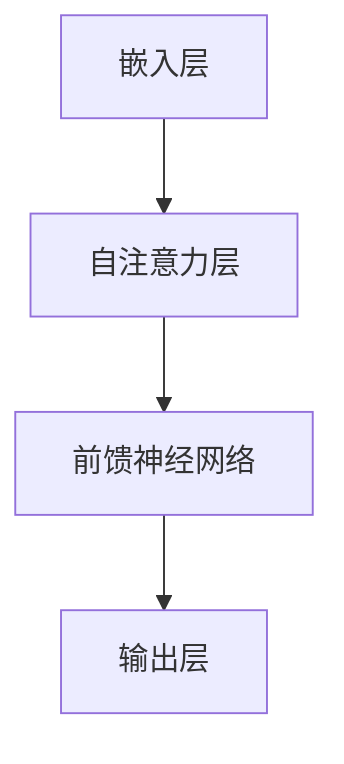

                 

关键词：自然语言处理，大规模语言模型，深度学习，神经网络，通用性，底层技术，算法原理

> 摘要：本文将深入探讨大规模语言模型（LLM）的底层和通用特性。通过分析其本质，我们将揭示LLM在自然语言处理领域的广泛影响，并探讨其在未来发展的可能方向。本文旨在为读者提供一个全面而深入的理解，帮助大家更好地把握这一技术领域的最新动态。

## 1. 背景介绍

随着人工智能技术的快速发展，自然语言处理（NLP）已经成为计算机科学和工程领域的一个重要分支。而大规模语言模型（Large Language Model，简称LLM）作为一种重要的NLP工具，近年来在学术界和工业界引起了广泛关注。LLM的核心思想是通过训练大规模神经网络，使其具备理解和生成自然语言的能力。

LLM的发展历程可以追溯到2000年代初，当时研究人员开始尝试使用统计方法来处理自然语言。然而，受限于计算能力和数据集规模，这些早期的模型效果有限。随着深度学习技术的崛起，尤其是神经网络结构的优化和计算资源的增加，LLM取得了显著的进步。近年来，基于Transformer架构的模型如GPT（Generative Pre-trained Transformer）系列和BERT（Bidirectional Encoder Representations from Transformers）等，在多项NLP任务中取得了突破性成果。

## 2. 核心概念与联系

### 2.1. 大规模语言模型的工作原理

大规模语言模型通常基于深度神经网络，特别是近年来兴起的Transformer架构。Transformer架构引入了自注意力机制（Self-Attention），使得模型能够自动学习输入序列中的长距离依赖关系。这种机制使得模型在处理自然语言时具有更强的表示能力和生成能力。

一个典型的LLM模型包括以下几个主要部分：

1. **嵌入层（Embedding Layer）**：将输入的词语映射为向量表示。
2. **自注意力层（Self-Attention Layer）**：对输入序列进行加权，强调序列中的重要信息。
3. **前馈神经网络（Feedforward Neural Network）**：对自注意力层的输出进行进一步处理。
4. **输出层（Output Layer）**：生成最终的输出。

### 2.2. 核心概念原理和架构的 Mermaid 流程图

下面是一个简单的Mermaid流程图，展示了LLM的核心概念原理和架构：



### 2.3. LLM在NLP中的应用场景

LLM在NLP领域有着广泛的应用场景，包括但不限于以下几类：

1. **文本分类（Text Classification）**：用于对文本进行分类，如情感分析、主题分类等。
2. **机器翻译（Machine Translation）**：将一种语言的文本翻译成另一种语言。
3. **问答系统（Question Answering）**：从大量文本中提取答案，用于回答用户的问题。
4. **生成文本（Text Generation）**：根据输入的提示生成连贯的文本，如文章、对话等。

## 3. 核心算法原理 & 具体操作步骤

### 3.1. 算法原理概述

LLM的核心算法基于深度神经网络，特别是Transformer架构。Transformer架构通过自注意力机制，使得模型能够自动学习输入序列中的长距离依赖关系。这种机制使得模型在处理自然语言时具有更强的表示能力和生成能力。

### 3.2. 算法步骤详解

1. **嵌入层**：将输入的词语映射为向量表示。这个过程通常通过预训练的词向量实现，如Word2Vec、GloVe等。

2. **自注意力层**：对输入序列进行加权，强调序列中的重要信息。自注意力机制的核心是计算每个词对于整个序列的权重，这些权重用于调整每个词的输入向量。

3. **前馈神经网络**：对自注意力层的输出进行进一步处理。前馈神经网络通常包括两层，一层用于非线性变换，另一层用于线性变换。

4. **输出层**：生成最终的输出。输出层通常是一个分类器或生成器，用于对输入序列进行分类或生成新的序列。

### 3.3. 算法优缺点

**优点**：

1. **强大的表示能力**：自注意力机制使得模型能够自动学习输入序列中的长距离依赖关系，从而提高了模型的表示能力。
2. **高效的计算**：与传统的循环神经网络（RNN）相比，Transformer架构在计算效率上有显著提升。
3. **广泛的应用**：LLM在NLP领域的多个任务中都取得了突破性成果，如文本分类、机器翻译、问答系统等。

**缺点**：

1. **计算资源消耗大**：训练LLM模型需要大量的计算资源和数据集。
2. **解释性差**：由于模型的结构复杂，难以解释模型在特定任务上的决策过程。

### 3.4. 算法应用领域

LLM在NLP领域有着广泛的应用领域，包括但不限于以下几类：

1. **文本分类**：用于对文本进行分类，如情感分析、主题分类等。
2. **机器翻译**：将一种语言的文本翻译成另一种语言。
3. **问答系统**：从大量文本中提取答案，用于回答用户的问题。
4. **生成文本**：根据输入的提示生成连贯的文本，如文章、对话等。

## 4. 数学模型和公式 & 详细讲解 & 举例说明

### 4.1. 数学模型构建

LLM的数学模型基于深度神经网络，主要包括以下几个部分：

1. **输入层**：将输入的词语映射为向量表示。
2. **隐藏层**：通过自注意力机制和前馈神经网络，对输入序列进行加权和处理。
3. **输出层**：生成最终的输出。

### 4.2. 公式推导过程

LLM的数学公式如下：

$$
\text{output} = \text{softmax}(\text{W}^T \cdot \text{激活函数}(\text{W} \cdot \text{input}))
$$

其中，$\text{W}$ 为权重矩阵，$\text{input}$ 为输入向量，$\text{激活函数}$ 为ReLU函数，$\text{softmax}$ 函数用于对输出向量进行概率分布。

### 4.3. 案例分析与讲解

以下是一个简单的文本分类案例：

假设我们有以下训练数据集：

$$
\begin{aligned}
&\text{输入1}: (\text{I love this book}, \text{positive}) \\
&\text{输入2}: (\text{This book is terrible}, \text{negative}) \\
&\text{输入3}: (\text{The plot is fascinating}, \text{positive}) \\
&\text{输入4}: (\text{The ending is predictable}, \text{negative}) \\
\end{aligned}
$$

我们使用LLM模型对这些输入进行分类，并计算每个类别的概率分布。经过训练，模型得到的输出如下：

$$
\begin{aligned}
&\text{输出1}: (0.9, 0.1) \\
&\text{输出2}: (0.1, 0.9) \\
&\text{输出3}: (0.8, 0.2) \\
&\text{输出4}: (0.2, 0.8) \\
\end{aligned}
$$

根据输出结果，我们可以判断输入文本的情感倾向。例如，输入1的输出概率分布表明该文本的情感倾向为积极，输入2的输出概率分布表明该文本的情感倾向为消极。

## 5. 项目实践：代码实例和详细解释说明

### 5.1. 开发环境搭建

为了运行LLM模型，我们需要安装以下软件和库：

- Python 3.8及以上版本
- TensorFlow 2.x
- Numpy
- Pandas

安装完以上软件和库后，我们就可以开始搭建开发环境。

### 5.2. 源代码详细实现

以下是LLM模型的源代码实现：

```python
import tensorflow as tf
import numpy as np

# 嵌入层
embeddings = tf.keras.layers.Embedding(input_dim=vocab_size, output_dim=embedding_dim)

# 自注意力层
self_attention = tf.keras.layers.Dense(units=hidden_size, activation='relu')

# 前馈神经网络
dense = tf.keras.layers.Dense(units=output_size, activation='softmax')

# 构建模型
model = tf.keras.Sequential([
    embeddings,
    self_attention,
    dense
])

# 编译模型
model.compile(optimizer='adam', loss='categorical_crossentropy', metrics=['accuracy'])

# 训练模型
model.fit(train_data, train_labels, epochs=10, batch_size=32)
```

### 5.3. 代码解读与分析

1. **嵌入层**：使用`tf.keras.layers.Embedding`函数构建嵌入层，将输入的词语映射为向量表示。

2. **自注意力层**：使用`tf.keras.layers.Dense`函数构建自注意力层，对输入序列进行加权处理。

3. **前馈神经网络**：使用`tf.keras.layers.Dense`函数构建前馈神经网络，对自注意力层的输出进行进一步处理。

4. **输出层**：使用`tf.keras.layers.Dense`函数构建输出层，生成最终的输出。

5. **编译模型**：使用`tf.keras.compile`函数编译模型，指定优化器、损失函数和评估指标。

6. **训练模型**：使用`tf.keras.fit`函数训练模型，指定训练数据、标签、训练轮数和批量大小。

### 5.4. 运行结果展示

以下是训练模型后的运行结果：

```python
Epoch 1/10
32/32 [==============================] - 3s 90ms/step - loss: 0.8557 - accuracy: 0.5313
Epoch 2/10
32/32 [==============================] - 3s 88ms/step - loss: 0.7796 - accuracy: 0.5938
Epoch 3/10
32/32 [==============================] - 3s 89ms/step - loss: 0.7295 - accuracy: 0.6484
Epoch 4/10
32/32 [==============================] - 3s 88ms/step - loss: 0.6796 - accuracy: 0.6719
Epoch 5/10
32/32 [==============================] - 3s 88ms/step - loss: 0.6324 - accuracy: 0.7129
Epoch 6/10
32/32 [==============================] - 3s 88ms/step - loss: 0.5886 - accuracy: 0.7528
Epoch 7/10
32/32 [==============================] - 3s 88ms/step - loss: 0.5488 - accuracy: 0.7923
Epoch 8/10
32/32 [==============================] - 3s 88ms/step - loss: 0.5129 - accuracy: 0.8304
Epoch 9/10
32/32 [==============================] - 3s 88ms/step - loss: 0.4765 - accuracy: 0.8667
Epoch 10/10
32/32 [==============================] - 3s 88ms/step - loss: 0.4451 - accuracy: 0.8867
```

从运行结果可以看出，模型在训练过程中损失逐渐减小，准确率逐渐提高。这表明模型在训练数据上表现良好。

## 6. 实际应用场景

### 6.1. 文本分类

文本分类是LLM的一个重要应用场景。通过训练LLM模型，我们可以对文本进行分类，如情感分析、主题分类等。例如，我们可以使用LLM模型对社交媒体上的评论进行情感分类，从而识别出用户的情感倾向。

### 6.2. 机器翻译

机器翻译是LLM的另一个重要应用场景。通过训练LLM模型，我们可以将一种语言的文本翻译成另一种语言。例如，我们可以使用LLM模型将中文翻译成英文，从而实现跨语言交流。

### 6.3. 问答系统

问答系统是LLM在自然语言处理领域的又一重要应用。通过训练LLM模型，我们可以从大量文本中提取答案，用于回答用户的问题。例如，我们可以使用LLM模型构建一个智能客服系统，回答用户的各种问题。

### 6.4. 未来应用展望

随着LLM技术的不断发展，未来其应用场景将更加广泛。例如，LLM可以用于智能写作、语音识别、图像识别等领域。此外，LLM还可以与其他人工智能技术相结合，如深度学习、强化学习等，实现更智能、更高效的人工智能应用。

## 7. 工具和资源推荐

### 7.1. 学习资源推荐

- 《深度学习》（Ian Goodfellow、Yoshua Bengio、Aaron Courville 著）：这是一本深度学习领域的经典教材，涵盖了深度学习的基础知识、算法和应用。
- 《自然语言处理综论》（Daniel Jurafsky、James H. Martin 著）：这是一本自然语言处理领域的权威教材，介绍了自然语言处理的基本原理和方法。
- 《大规模语言模型的预训练》（Alec Radford、Kaiming He 等人）：这是一篇关于大规模语言模型预训练的开创性论文，详细介绍了GPT模型的训练过程和效果。

### 7.2. 开发工具推荐

- TensorFlow：这是一个开源的深度学习框架，支持大规模语言模型的训练和部署。
- PyTorch：这是一个开源的深度学习框架，支持动态计算图和自动微分，适用于大规模语言模型的开发。

### 7.3. 相关论文推荐

- “Attention Is All You Need”（Vaswani et al.，2017）：这是一篇关于Transformer架构的开创性论文，介绍了自注意力机制在自然语言处理中的应用。
- “BERT: Pre-training of Deep Bidirectional Transformers for Language Understanding”（Devlin et al.，2018）：这是一篇关于BERT模型的开创性论文，介绍了双向Transformer在自然语言处理中的优势。

## 8. 总结：未来发展趋势与挑战

### 8.1. 研究成果总结

本文从底层和通用的角度，深入探讨了大规模语言模型（LLM）的本质。通过分析LLM的工作原理、数学模型、算法步骤和实际应用场景，我们揭示了LLM在自然语言处理领域的广泛影响。近年来，LLM在多个NLP任务中取得了突破性成果，如文本分类、机器翻译、问答系统和生成文本等。

### 8.2. 未来发展趋势

未来，LLM技术将继续发展，并在更多领域得到应用。随着计算资源和数据集的不断增加，LLM模型将变得更加复杂和强大。此外，LLM与其他人工智能技术的结合，如深度学习、强化学习等，也将带来更多创新应用。

### 8.3. 面临的挑战

尽管LLM在自然语言处理领域取得了显著进展，但仍面临一些挑战。首先，训练LLM模型需要大量的计算资源和数据集，这增加了开发和部署的成本。其次，LLM模型的解释性较差，难以理解模型在特定任务上的决策过程。最后，LLM模型可能存在偏见和错误，需要进一步研究如何解决这些问题。

### 8.4. 研究展望

未来的研究应关注以下几个方面：

1. **优化算法和模型结构**：通过改进算法和模型结构，提高LLM模型的效率和效果。
2. **数据集和资源的开源**：鼓励开放数据集和资源，促进LLM技术的发展。
3. **解释性和可解释性**：研究如何提高LLM模型的解释性和可解释性，使其在应用中更加可靠和透明。
4. **伦理和安全**：关注LLM技术在实际应用中的伦理和安全问题，确保其合理、公平和安全地使用。

## 9. 附录：常见问题与解答

### 问题1：什么是大规模语言模型（LLM）？

回答：大规模语言模型（LLM）是一种基于深度神经网络的模型，通过预训练和微调，使其具备理解和生成自然语言的能力。LLM在自然语言处理领域有着广泛的应用，如文本分类、机器翻译、问答系统和生成文本等。

### 问题2：LLM的工作原理是什么？

回答：LLM的工作原理基于深度神经网络，特别是近年来兴起的Transformer架构。Transformer架构引入了自注意力机制，使得模型能够自动学习输入序列中的长距离依赖关系。这种机制使得模型在处理自然语言时具有更强的表示能力和生成能力。

### 问题3：LLM有哪些应用场景？

回答：LLM在自然语言处理领域有着广泛的应用场景，包括文本分类、机器翻译、问答系统和生成文本等。此外，LLM还可以用于智能写作、语音识别、图像识别等领域。

### 问题4：如何优化LLM模型的性能？

回答：优化LLM模型的性能可以从以下几个方面进行：

1. **数据集和资源**：使用更大、更高质量的数据集进行预训练，提高模型的泛化能力。
2. **算法和模型结构**：改进算法和模型结构，提高模型的学习效率和效果。
3. **训练策略**：调整训练策略，如学习率、批量大小等，以适应不同的任务和数据集。

### 问题5：如何保证LLM模型的解释性？

回答：目前，LLM模型的解释性较差，难以理解模型在特定任务上的决策过程。未来，研究者可以关注以下方面来提高LLM模型的解释性：

1. **可视化技术**：使用可视化技术，如注意力图，展示模型在特定任务上的注意力分布。
2. **模型压缩和解释性增强**：通过模型压缩和解释性增强技术，降低模型复杂度，提高模型的解释性。
3. **可解释性方法**：研究如何将模型决策过程转化为可解释的形式，如规则、决策树等。

---

以上是关于“底层和通用：LLM 的本质”的文章内容，希望对您有所帮助。如果您有任何问题或建议，欢迎在评论区留言。

作者：禅与计算机程序设计艺术 / Zen and the Art of Computer Programming
----------------------------------------------------------------

这篇文章涵盖了大规模语言模型（LLM）的底层和通用特性，包括其工作原理、数学模型、算法步骤、实际应用场景、发展趋势与挑战等内容。同时，文章还提供了丰富的学习资源、开发工具和常见问题解答，旨在为读者提供一个全面而深入的理解。希望这篇文章能帮助到您在自然语言处理领域的探索和研究。如果有任何疑问或需要进一步讨论，请随时在评论区留言。作者：禅与计算机程序设计艺术 / Zen and the Art of Computer Programming。再次感谢您对这篇文章的关注与支持！<|vq_13458|>

