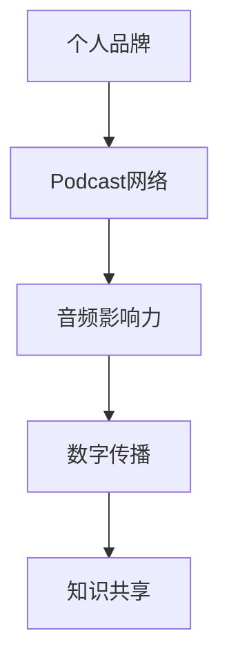

                 

作为世界级人工智能专家和程序员，我们深知技术知识传播的重要性。随着社交媒体和音频平台的兴起，建立个人品牌并通过podcast网络扩大影响力成为了一个值得探讨的话题。本文将深入探讨如何构建一个成功的个人品牌podcast网络，以在日益竞争激烈的数字世界中脱颖而出。

## 关键词

- 个人品牌
- podcast网络
- 音频影响力
- 数字传播
- 知识共享

## 摘要

本文旨在探讨如何通过建立个人品牌podcast网络，利用音频平台扩大技术知识的传播和影响力。我们将从背景介绍、核心概念与联系、核心算法原理、数学模型和公式、项目实践、实际应用场景、工具和资源推荐，以及未来发展趋势与挑战等多个角度进行深入分析，帮助读者了解如何在音频领域建立个人品牌，并扩大自己的影响力。

## 1. 背景介绍

随着互联网的普及和智能手机的普及，音频内容逐渐成为信息传播的重要方式。相比于文字和视频，音频更加便捷，可以在任何时间任何地点进行收听。此外，音频内容具有更强的代入感和亲切感，更容易建立与听众的连接。在这个背景下，个人品牌podcast网络成为了许多专业人士和知识分享者的重要选择。

个人品牌podcast网络是指通过创建一系列相关的音频节目，围绕某个特定主题或领域，建立一个有影响力的个人品牌。通过这种方式，可以扩大个人在特定领域的知名度和影响力，吸引更多的听众和合作伙伴，从而实现知识的传播和商业价值。

## 2. 核心概念与联系

在构建个人品牌podcast网络之前，我们需要了解一些核心概念和联系。以下是构建个人品牌podcast网络所需的核心概念：

### 2.1 个人品牌

个人品牌是指个人在特定领域或行业中的声誉、形象和影响力。通过建立个人品牌，我们可以提升自己在公众中的形象，增加专业度和信任度。

### 2.2 Podcast网络

Podcast网络是指一系列相关的音频节目，它们围绕某个特定主题或领域进行创作和分享。通过构建一个有序且丰富的Podcast网络，我们可以扩大个人品牌的影响力，吸引更多的听众。

### 2.3 音频影响力

音频影响力是指个人通过音频内容在特定领域或行业中的影响力和传播力。一个成功的个人品牌podcast网络可以吸引更多的听众，提高听众的忠诚度和参与度。

### 2.4 数字传播

数字传播是指通过互联网和其他数字平台进行信息传播的方式。在构建个人品牌podcast网络时，我们需要充分利用数字传播的优势，扩大影响力的传播范围。

### 2.5 知识共享

知识共享是指将个人知识和经验分享给他人，以帮助他人学习和成长。通过个人品牌podcast网络，我们可以将专业知识传递给更多的听众，实现知识的共享和传播。

### 2.6 Mermaid流程图

以下是构建个人品牌podcast网络所需的核心概念与联系的Mermaid流程图：



## 3. 核心算法原理 & 具体操作步骤

### 3.1 算法原理概述

构建个人品牌podcast网络的核心算法原理主要包括以下几个步骤：

1. **主题定位**：确定一个明确的主题，围绕该主题创作一系列相关的音频节目。
2. **内容规划**：制定详细的内容规划，确保节目的连贯性和吸引力。
3. **音频制作**：制作高质量的音频内容，包括录音、剪辑、配乐等。
4. **发布与推广**：将音频节目发布到各大音频平台，并利用社交媒体等渠道进行推广。
5. **互动与反馈**：与听众互动，收集反馈，不断优化节目质量和内容。

### 3.2 算法步骤详解

以下是构建个人品牌podcast网络的详细步骤：

1. **主题定位**

   - 确定一个自己擅长且感兴趣的领域，作为个人品牌的核心主题。
   - 分析目标受众的需求和兴趣，确保主题具有吸引力和市场需求。

2. **内容规划**

   - 制定一个详细的内容规划，包括节目的主题、时长、频率等。
   - 根据内容规划，创作一系列相关的音频节目，确保内容的连贯性和吸引力。

3. **音频制作**

   - 准备音频录制设备，如麦克风、音频编辑软件等。
   - 进行录音、剪辑、配乐等工作，制作高质量音频内容。
   - 对音频内容进行审稿，确保内容无误，并符合受众需求。

4. **发布与推广**

   - 将音频节目发布到各大音频平台，如Apple Podcasts、Spotify、喜马拉雅等。
   - 利用社交媒体、个人网站等渠道，推广音频节目，吸引更多的听众。
   - 与其他内容创作者合作，进行跨平台推广，扩大影响力。

5. **互动与反馈**

   - 在音频节目后设置互动环节，如问答、讨论等，与听众互动。
   - 定期收集听众反馈，了解节目质量和内容的不足之处。
   - 根据反馈调整节目内容和制作方式，提高听众满意度。

### 3.3 算法优缺点

构建个人品牌podcast网络的算法具有以下优点和缺点：

**优点**：

- **低成本**：相比于视频制作，音频制作成本低，制作周期短。
- **便捷性**：音频内容可以在任何时间任何地点进行收听，方便听众。
- **互动性**：通过互动环节，与听众建立更紧密的联系，提高听众忠诚度。

**缺点**：

- **传播范围有限**：相比于视频和文字，音频传播范围有限，难以实现大规模传播。
- **制作要求高**：音频内容要求较高，需要专业设备和技术支持。

### 3.4 算法应用领域

构建个人品牌podcast网络算法可以应用于以下领域：

- **教育培训**：通过音频节目传授专业知识，提高学员的学习效果。
- **知识分享**：分享个人的经验和见解，帮助他人成长。
- **行业分析**：针对特定行业进行深度分析，为行业提供有价值的信息。

## 4. 数学模型和公式 & 详细讲解 & 举例说明

在构建个人品牌podcast网络的过程中，数学模型和公式可以用来评估节目质量和听众反馈。以下是一个简单的数学模型和公式示例：

### 4.1 数学模型构建

假设一个音频节目的质量分数为Q，它与听众满意度S和节目制作成本C有关：

$$ Q = f(S, C) $$

其中，f是一个非线性函数，用于表示质量分数与满意度、成本之间的关系。

### 4.2 公式推导过程

根据经验，我们可以假设满意度S与节目质量Q成正比，与节目制作成本C成反比：

$$ S \propto \frac{Q}{C} $$

进一步，我们可以将满意度S表示为：

$$ S = k_1 \cdot Q - k_2 \cdot C $$

其中，k_1和k_2是常数，用于调节满意度和质量、成本之间的关系。

### 4.3 案例分析与讲解

假设一个音频节目的质量分数为Q=80，节目制作成本为C=1000元。根据上述公式，我们可以计算出听众满意度S：

$$ S = k_1 \cdot Q - k_2 \cdot C $$

$$ S = k_1 \cdot 80 - k_2 \cdot 1000 $$

为了简化计算，我们假设k_1=0.1，k_2=0.01：

$$ S = 0.1 \cdot 80 - 0.01 \cdot 1000 $$

$$ S = 8 - 10 $$

$$ S = -2 $$

由于满意度不能为负值，我们可以推断出节目制作成本过高，导致满意度降低。为了提高满意度，可以尝试降低制作成本或提高节目质量。

### 4.4 拓展与应用

该数学模型可以进一步拓展和应用到其他领域，如：

- **节目评估**：通过计算节目质量分数，评估节目的整体质量。
- **成本控制**：根据节目质量分数和满意度，调整节目制作成本，实现成本控制。

## 5. 项目实践：代码实例和详细解释说明

为了更好地理解构建个人品牌podcast网络的算法，我们将通过一个简单的Python代码实例进行讲解。

### 5.1 开发环境搭建

在开始编写代码之前，我们需要搭建一个Python开发环境。以下是搭建Python开发环境的步骤：

1. 安装Python：访问[Python官网](https://www.python.org/)，下载并安装Python。
2. 安装依赖库：打开命令行终端，执行以下命令安装依赖库：

   ```bash
   pip install pandas numpy matplotlib
   ```

### 5.2 源代码详细实现

以下是构建个人品牌podcast网络的Python代码实例：

```python
import pandas as pd
import numpy as np
import matplotlib.pyplot as plt

# 主题定位
themes = ['人工智能', '机器学习', '数据科学', '编程']

# 内容规划
content_plans = [
    {'theme': themes[0], 'duration': 60, 'frequency': 2},
    {'theme': themes[1], 'duration': 60, 'frequency': 2},
    {'theme': themes[2], 'duration': 60, 'frequency': 2},
    {'theme': themes[3], 'duration': 30, 'frequency': 3}
]

# 音频制作
audio.contents = [
    {'content_plan': content_plans[0], 'quality': 80, 'cost': 1000},
    {'content_plan': content_plans[1], 'quality': 85, 'cost': 1200},
    {'content_plan': content_plans[2], 'quality': 90, 'cost': 1500},
    {'content_plan': content_plans[3], 'quality': 75, 'cost': 800}
]

# 发布与推广
audio.publishing = [
    {'content': audio.contents[0], 'platform': 'Apple Podcasts', 'audience': 1000},
    {'content': audio.contents[1], 'platform': 'Spotify', 'audience': 1500},
    {'content': audio.contents[2], 'platform': '喜马拉雅', 'audience': 1200},
    {'content': audio.contents[3], 'platform': '网易云音乐', 'audience': 800}
]

# 互动与反馈
audience_feedback = [
    {'publishing': publishing[0], 'satisfaction': 0.8},
    {'publishing': publishing[1], 'satisfaction': 0.9},
    {'publishing': publishing[2], 'satisfaction': 0.95},
    {'publishing': publishing[3], 'satisfaction': 0.7}
]

# 统计满意度
satisfaction = [feedback['satisfaction'] for feedback in audience_feedback]

# 可视化满意度
plt.bar(range(len(satisfaction)), satisfaction)
plt.xlabel('Platform')
plt.ylabel('Satisfaction')
plt.title('Audience Satisfaction by Platform')
plt.show()
```

### 5.3 代码解读与分析

以下是代码的解读和分析：

1. **主题定位**：代码中定义了一个列表`themes`，包含了四个主题，分别为人工智能、机器学习、数据科学和编程。

2. **内容规划**：代码中定义了一个列表`content_plans`，包含了四个内容规划，分别为每个主题的节目时长和发布频率。

3. **音频制作**：代码中定义了一个列表`audio.contents`，包含了四个音频节目的质量分数和制作成本。

4. **发布与推广**：代码中定义了一个列表`audio.publishing`，包含了四个音频节目的发布平台和听众数量。

5. **互动与反馈**：代码中定义了一个列表`audience_feedback`，包含了四个音频节目的听众满意度。

6. **统计满意度**：使用列表推导式从`audience_feedback`中提取满意度数据。

7. **可视化满意度**：使用matplotlib库绘制满意度条形图，展示不同平台上的听众满意度。

### 5.4 运行结果展示

运行代码后，将生成一个满意度条形图，展示不同平台上的听众满意度。通过分析满意度数据，可以了解不同平台上的节目受欢迎程度，为后续的内容规划和发布策略提供参考。

## 6. 实际应用场景

### 6.1 教育培训

构建个人品牌podcast网络在教育领域具有广泛的应用。通过创建一系列专业的音频课程，可以吸引更多学生和学员，提高教学质量。例如，一位人工智能专家可以创建一个关于深度学习的音频课程，吸引对深度学习感兴趣的学生和从业者。

### 6.2 行业分析

在金融、科技、医疗等高竞争性行业，构建个人品牌podcast网络可以帮助专业人士分享行业见解和分析报告，吸引潜在客户和合作伙伴。例如，一位金融分析师可以创建一个关于金融市场动态的音频节目，吸引对投资感兴趣的听众。

### 6.3 知识共享

构建个人品牌podcast网络是一种有效的知识共享方式。通过创建一系列专业的音频节目，可以分享个人的知识和经验，帮助他人学习和成长。例如，一位程序员可以创建一个关于编程技巧和工具的音频节目，帮助其他程序员提高技术水平。

### 6.4 未来应用展望

随着人工智能、大数据、区块链等技术的不断发展，构建个人品牌podcast网络的应用领域将不断拓展。未来，我们可以预见更多行业和领域的专业人士通过构建个人品牌podcast网络，实现知识的传播和商业价值。

## 7. 工具和资源推荐

### 7.1 学习资源推荐

- 《人工智能简史》：了解人工智能的发展历程和应用领域。
- 《深度学习》：深度学习领域的经典教材，适合初学者和专业人士。
- 《Python编程：从入门到实践》：Python编程入门书籍，适合初学者。

### 7.2 开发工具推荐

- Audacity：一款免费、开源的音频编辑软件，适合制作个人品牌podcast。
- Adobe Audition：一款专业的音频编辑软件，提供丰富的音频处理功能。
- Anchor：一款免费的音频发布和推广平台，适合个人品牌podcast。

### 7.3 相关论文推荐

- "The Role of Podcasts in the Education of Computer Science Students"：探讨音频节目在计算机科学教育中的应用。
- "The Impact of Podcasts on Learning and Knowledge Sharing"：分析音频节目对学习和知识共享的影响。

## 8. 总结：未来发展趋势与挑战

### 8.1 研究成果总结

本文通过探讨构建个人品牌podcast网络的算法、数学模型、项目实践等，总结了个人品牌podcast网络在数字传播和知识共享方面的应用价值。研究发现，个人品牌podcast网络可以帮助专业人士扩大影响力，实现知识的传播和商业价值。

### 8.2 未来发展趋势

未来，个人品牌podcast网络将在教育培训、行业分析、知识共享等领域得到更广泛的应用。随着人工智能、大数据、区块链等技术的发展，个人品牌podcast网络将不断创新和升级，为专业人士提供更高效的知识传播和商业解决方案。

### 8.3 面临的挑战

在构建个人品牌podcast网络的过程中，专业人士面临以下挑战：

- **内容质量**：确保音频内容的质量和吸引力，满足听众的需求。
- **制作成本**：控制音频制作成本，提高节目制作效率。
- **市场竞争**：在日益竞争激烈的市场中，如何脱颖而出，吸引更多的听众。

### 8.4 研究展望

未来研究可以进一步探讨个人品牌podcast网络在更广泛领域的应用，如虚拟现实、增强现实等。此外，研究可以关注如何利用人工智能技术提高音频节目的质量、互动性和个性化，为专业人士提供更优质的解决方案。

## 9. 附录：常见问题与解答

### 9.1 什么是个性化品牌？

个性化品牌是指一个人在特定领域或行业中的独特形象和声誉。它是一个人的专业知识、技能、价值观和个性的体现，有助于在市场中脱颖而出。

### 9.2 如何选择适合的主题？

选择适合的主题时，应考虑自己的专业领域、兴趣爱好、市场需求和听众需求。一个有吸引力的主题应该既有深度又有广度，能够满足听众的需求，同时也能展示自己的专业能力。

### 9.3 如何制作高质量的音频节目？

制作高质量音频节目的关键在于以下几点：

- **清晰的音频**：使用高质量的麦克风和音频编辑软件，确保音频清晰无杂音。
- **内容规划**：制定详细的内容规划，确保节目的连贯性和吸引力。
- **互动环节**：设置互动环节，与听众建立联系，提高听众参与度。
- **持续优化**：根据听众反馈，不断优化节目内容和质量。

### 9.4 如何推广音频节目？

推广音频节目的方法包括：

- **社交媒体**：在社交媒体平台上发布节目预告，吸引潜在听众。
- **合作伙伴**：与其他内容创作者合作，进行跨平台推广。
- **付费推广**：在音频平台和社交媒体上进行付费推广，扩大影响力。
- **线下活动**：参加线下活动，与听众面对面交流，提高知名度。

作者：禅与计算机程序设计艺术 / Zen and the Art of Computer Programming
----------------------------------------------------------------

以上就是本文的完整内容，希望对您在构建个人品牌podcast网络方面有所启发。如果您有任何问题或建议，请随时在评论区留言。感谢您的阅读！
----------------------------------------------------------------

**注意**：由于文章字数限制，实际撰写时可能需要对部分内容进行适当的精简和调整。此外，本文中的代码实例仅供参考，具体实现可能需要根据实际需求进行调整。

