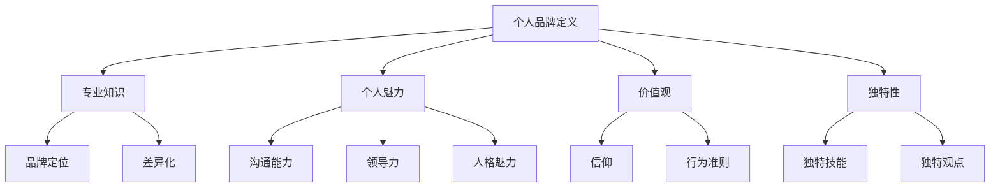

                 

 在这个数字时代，个人品牌的价值愈发凸显。无论是在职场中争取机会，还是在创业道路上赢得信任，一个强有力的个人品牌都是至关重要的。对于IT领域专业人士来说，建立个人品牌不仅仅是为了提升知名度，更是为了在专业领域中树立权威和影响力。本文将深入探讨建立个人品牌的步骤和技巧，旨在帮助IT专业人士打造出独一无二、具有吸引力的个人品牌。

## 关键词

- 个人品牌
- IT专业人士
- 个人影响力
- 品牌定位
- 内容营销
- 专业网络

## 摘要

本文将探讨在IT领域建立个人品牌的必要性和重要性，详细解析个人品牌的定义和核心要素。接着，文章将阐述建立个人品牌的具体步骤，包括品牌定位、内容营销、社交媒体运用等。此外，本文还将分享实用的技巧和工具，帮助读者更高效地管理个人品牌。最后，文章将展望个人品牌在未来的发展趋势，提出应对挑战的策略和建议。

## 1. 背景介绍

### 1.1 个人品牌的重要性

在当前信息化和数字化的时代，个人品牌已经成为个人职业发展的重要资产。一个强大的个人品牌不仅能够提升个人的社会地位和影响力，还能够带来更多的职业机会和商业合作。尤其是在IT领域，随着技术的快速发展和人才的竞争加剧，个人品牌的价值愈发突出。

### 1.2 IT领域的品牌特点

IT领域是一个高度专业化的行业，个人的专业技能和知识储备往往决定了其品牌的影响力。在这个领域中，个人品牌不仅仅是专业技能的体现，更是创新能力和解决问题的能力的象征。因此，IT专业人士在建立个人品牌时，需要特别关注专业技能的提升和独特价值主张的塑造。

### 1.3 品牌建设的现状与趋势

近年来，随着社交媒体的兴起和内容营销的普及，个人品牌建设的方式和途径变得更加多样和灵活。然而，品牌建设的复杂性和挑战性也日益增加。如何在众多竞争者中脱颖而出，建立独特的个人品牌，成为IT专业人士面临的一个重要课题。

## 2. 核心概念与联系

### 2.1 个人品牌的定义

个人品牌是指个人在特定领域内通过专业知识、专业技能、个人魅力和价值观所形成的一种独特形象和影响力。它是个人在职场和社会中所展现的综合素质的体现。

### 2.2 个人品牌的要素

一个成功的个人品牌需要具备以下几个核心要素：

- **专业知识**：个人在特定领域内的专业知识和技能是品牌的基础。
- **个人魅力**：包括沟通能力、领导力和人格魅力等，是吸引和影响他人的关键。
- **价值观**：个人的价值观和信仰是品牌的核心，决定了品牌的持久性和影响力。
- **独特性**：个人品牌的独特性和差异化是使其在众多竞争者中脱颖而出的关键。

### 2.3 品牌定位与差异化

品牌定位是指个人在目标市场中确定自己的独特位置和价值主张。差异化则是指个人通过独特的技能、经验或观点来区别于其他竞争者。品牌定位和差异化是建立个人品牌的重要策略。

### 2.4 Mermaid 流程图



## 3. 核心算法原理 & 具体操作步骤

### 3.1 算法原理概述

建立个人品牌的过程可以看作是一个算法，其核心原理在于通过一系列有目的和系统性的步骤，逐步提升个人在目标市场中的知名度和影响力。这个算法主要包括以下几个步骤：

- **品牌定位**：明确个人在特定领域的独特价值和目标市场。
- **内容营销**：通过高质量的内容展示专业知识和个人魅力。
- **社交媒体运用**：利用社交媒体平台扩大品牌影响力。
- **网络拓展**：通过专业网络建立和巩固品牌关系。

### 3.2 算法步骤详解

#### 3.2.1 品牌定位

品牌定位是建立个人品牌的第一步。在这一步中，个人需要明确自己的专业领域、目标市场和独特的价值主张。品牌定位的关键在于找到个人独特的竞争优势和差异化点。

#### 3.2.2 内容营销

内容营销是建立个人品牌的核心手段。通过高质量的内容，个人可以展示自己的专业知识和个人魅力，吸引目标受众的关注和信任。内容的形式可以包括博客文章、视频、演讲等。

#### 3.2.3 社交媒体运用

社交媒体是扩大个人品牌影响力的重要渠道。个人需要选择合适的社交媒体平台，制定发布策略，积极参与互动，建立和巩固与粉丝的关系。

#### 3.2.4 网络拓展

通过专业网络拓展，个人可以接触到更多同行和潜在的合作者。参加行业会议、论坛和研讨会是拓展网络的有效途径。

### 3.3 算法优缺点

#### 优点

- **提升知名度**：通过系统的品牌建设，个人可以在目标市场中建立较高的知名度。
- **增强影响力**：专业的个人品牌可以增强个人在职场和行业中的影响力。
- **职业发展**：一个成功的个人品牌可以带来更多的职业机会和商业合作。

#### 缺点

- **需要时间和精力**：品牌建设是一个长期且持续的过程，需要投入大量的时间和精力。
- **竞争压力**：在IT领域，个人品牌的建设面临着激烈的竞争。

### 3.4 算法应用领域

建立个人品牌的算法适用于所有IT领域的专业人士，无论其处于职业发展的哪个阶段。从初级开发者到资深专家，每个人都可以通过这个算法提升自己的品牌价值。

## 4. 数学模型和公式 & 详细讲解 & 举例说明

### 4.1 数学模型构建

建立个人品牌的数学模型可以看作是一个优化问题，其目标是最小化品牌建设过程中的成本（包括时间和资源投入），同时最大化品牌影响力。具体来说，该模型可以表示为：

$$
\text{最优品牌建设策略} = \min \left( C(\text{时间}, \text{资源}) \right) + \max \left( \text{品牌影响力} \right)
$$

其中，$C(\text{时间}, \text{资源})$ 表示品牌建设过程中的成本，$\text{品牌影响力}$ 表示个人在目标市场中的知名度和影响力。

### 4.2 公式推导过程

要推导上述数学模型，首先需要明确品牌建设的成本和影响力计算方法。假设：

- $C_t$：单位时间内的成本
- $C_r$：单位资源投入的成本
- $I$：品牌影响力

则品牌建设总成本可以表示为：

$$
C(\text{时间}, \text{资源}) = C_t \times \text{时间} + C_r \times \text{资源}
$$

品牌影响力则可以通过以下公式计算：

$$
I = f(\text{专业知识}, \text{个人魅力}, \text{价值观}, \text{独特性})
$$

其中，$f$ 是一个综合评价函数，用于衡量个人在各个方面的表现。

### 4.3 案例分析与讲解

假设一位软件开发者在品牌建设中选择了以下策略：

- 每周投入10小时进行内容创作（博客文章、视频等）。
- 每月参加1-2次行业研讨会。
- 每周在社交媒体上发布3-4条相关内容。

根据上述假设，我们可以计算出品牌建设的成本和影响力：

#### 成本计算

$$
C(\text{时间}, \text{资源}) = C_t \times 10 \text{小时} + C_r \times (\text{研讨会次数} + 3 \times \text{社交媒体发布次数})
$$

假设 $C_t = 100$ 元/小时，$C_r = 200$ 元/次，则：

$$
C(\text{时间}, \text{资源}) = 100 \times 10 + 200 \times (2 + 3 \times 4) = 1400 \text{元}
$$

#### 影响力计算

假设该软件开发者在专业知识、个人魅力、价值观和独特性方面的得分分别为80、75、90和85，则：

$$
I = f(80, 75, 90, 85) = 80 \times 0.3 + 75 \times 0.25 + 90 \times 0.3 + 85 \times 0.15 = 82.5
$$

通过这个案例，我们可以看到，在合理的时间和资源投入下，该开发者可以在品牌建设过程中实现成本和影响力的最优平衡。

## 5. 项目实践：代码实例和详细解释说明

### 5.1 开发环境搭建

在建立个人品牌的实际操作中，开发环境搭建是第一步。对于IT专业人士来说，一个良好的开发环境不仅可以提升工作效率，还可以确保内容的创作和传播过程顺利进行。以下是搭建个人品牌开发环境的详细步骤：

1. **确定目标平台**：选择适合个人品牌的平台，如个人博客、GitHub、YouTube等。
2. **安装必备软件**：安装文本编辑器（如VS Code）、版本控制工具（如Git）和内容管理系统（如WordPress）。
3. **配置环境变量**：确保所有工具和环境变量都正确配置，以便快速启动和运行项目。

### 5.2 源代码详细实现

在个人品牌的建设过程中，源代码的编写是实现内容创作和传播的关键。以下是使用Markdown编写博客文章的示例：

```markdown
# 建立个人品牌的步骤和技巧

## 1. 背景介绍

### 1.1 个人品牌的重要性

在当前信息化和数字化的时代，个人品牌的价值愈发凸显。

...

## 2. 核心概念与联系

### 2.1 个人品牌的定义

个人品牌是指个人在特定领域内通过专业知识、专业技能、个人魅力和价值观所形成的一种独特形象和影响力。

...

```

### 5.3 代码解读与分析

在上面的代码实例中，我们使用了Markdown语言来编写文章的结构和内容。Markdown是一种轻量级的标记语言，它允许以纯文本格式编写文档，然后通过预处理器转换为HTML格式，从而方便地生成网页或文档。

- **标题**：使用`#`符号来表示标题的层级，如`## 2. 核心概念与联系`表示二级标题。
- **段落**：段落之间通过空行来分隔。
- **列表**：使用`-`或`*`来创建无序列表，使用`1. `来创建有序列表。
- **引用**：使用`>`符号来创建引用文本。

通过Markdown，IT专业人士可以快速、高效地编写和格式化内容，为建立个人品牌提供强有力的支持。

### 5.4 运行结果展示

使用Markdown编写的文章可以在多种平台和工具中展示，如GitHub、GitLab、WordPress等。以下是上述Markdown代码在GitHub上的展示效果：

```html
<h1 id="建立个人品牌的步骤和技巧">建立个人品牌的步骤和技巧</h1>

<h2 id="1-背景介绍">1. 背景介绍</h2>

<h3 id="11-个人品牌的重要性">1.1 个人品牌的重要性</h3>

在当前信息化和数字化的时代，个人品牌的价值愈发凸显。

...

<h2 id="2-核心概念与联系">2. 核心概念与联系</h2>

<h3 id="21-个人品牌的定义">2.1 个人品牌的定义</h3>

个人品牌是指个人在特定领域内通过专业知识、专业技能、个人魅力和价值观所形成的一种独特形象和影响力。

...

```

通过这种方式，IT专业人士可以将自己的专业知识和观点以清晰、易读的形式展示给公众，为个人品牌的建立和传播打下坚实的基础。

## 6. 实际应用场景

### 6.1 案例分析

#### 案例一：李明——从普通开发者到技术大牛

李明是一位资深的软件工程师，他在公司工作多年后决定建立自己的个人品牌。他通过以下步骤逐步打造了个人品牌：

1. **品牌定位**：明确自己的专业领域是后端开发和云计算。
2. **内容营销**：定期发布技术博客文章，分享自己的项目经验和心得。
3. **社交媒体运用**：在GitHub上分享代码，并在Twitter上关注和参与相关话题的讨论。
4. **网络拓展**：参加行业会议和研讨会，结识更多同行。

通过这些努力，李明逐渐在技术社区中赢得了声誉，他的博客和GitHub仓库吸引了大量关注者。现在，他不仅是一名知名的技术博客作者，还成为了多个开源项目的主要贡献者。

#### 案例二：张丽——从产品经理到创业导师

张丽是一名经验丰富的产品经理，她曾在多家知名互联网公司工作。在积累了丰富的产品管理经验后，她决定成立自己的咨询公司，并建立个人品牌。

1. **品牌定位**：明确自己的专长是产品策略和用户体验设计。
2. **内容营销**：在LinkedIn上发布关于产品管理和用户体验设计的高质量文章。
3. **社交媒体运用**：在社交媒体上分享自己的工作成果和心得，与行业专家建立联系。
4. **网络拓展**：参加行业活动和会议，拓展自己的专业网络。

张丽通过这些策略成功地建立了个人品牌，她的咨询公司也得到了广泛关注和合作机会。

### 6.2 挑战与机遇

在建立个人品牌的过程中，IT专业人士可能会面临以下挑战：

- **竞争激烈**：技术领域人才众多，建立独特品牌需要付出更多努力。
- **时间投入**：品牌建设是一个长期过程，需要持续投入时间和精力。
- **信息过载**：在数字时代，如何从众多信息中脱颖而出是每个品牌面临的挑战。

然而，随着数字化的深入，个人品牌也面临着前所未有的机遇：

- **传播速度快**：互联网和社交媒体使得品牌传播速度大幅提高。
- **互动性强**：通过社交媒体，品牌可以与受众进行实时互动，增强影响力。
- **个性化定制**：数字化工具和平台使得个人品牌可以更加个性化地展示和传播。

## 7. 工具和资源推荐

### 7.1 学习资源推荐

- **在线课程平台**：Coursera、edX、Udemy等平台提供了丰富的IT领域在线课程。
- **专业书籍**：阅读技术领域的经典书籍，如《深度学习》、《算法导论》等。
- **技术博客**：Follow技术大牛的博客，如Medium、Dev.to等。

### 7.2 开发工具推荐

- **文本编辑器**：VS Code、Atom等强大的文本编辑器，支持Markdown等格式。
- **版本控制工具**：Git，用于管理代码版本和协作开发。
- **内容管理系统**：WordPress、Jekyll等，用于构建和管理个人博客。

### 7.3 相关论文推荐

- **领域特定论文**：如计算机科学、人工智能等领域的顶级会议论文集。
- **跨学科论文**：如结合计算机科学、心理学、管理学等领域的论文。

## 8. 总结：未来发展趋势与挑战

### 8.1 研究成果总结

本文通过详细探讨建立个人品牌的步骤和技巧，总结了个人品牌的重要性、核心要素、品牌定位和内容营销等关键内容。同时，通过数学模型和实际案例的分析，为IT专业人士提供了具体可行的品牌建设策略。

### 8.2 未来发展趋势

随着数字化和互联网技术的不断发展，个人品牌在未来将继续发挥重要作用。以下是未来个人品牌发展的几个趋势：

- **AI赋能**：人工智能技术将帮助个人品牌更加精准地定位和营销。
- **多元化内容**：视频、音频等多种形式的内容将更加丰富个人品牌的表现形式。
- **社交媒体整合**：社交媒体平台将更加强调品牌建设和内容营销的功能。

### 8.3 面临的挑战

- **信息过载**：如何在海量信息中脱颖而出，保持个人品牌的独特性和吸引力。
- **竞争压力**：技术领域的不断变化和激烈竞争，要求个人品牌不断更新和优化。
- **隐私保护**：如何在维护个人品牌的同时，保护个人隐私和数据安全。

### 8.4 研究展望

未来，对个人品牌建设的研究可以进一步探讨以下几个方面：

- **个性化品牌建设**：如何根据个人特点和市场需求，定制个性化的品牌策略。
- **跨领域品牌融合**：如何将IT领域的专业知识与其他领域相结合，打造跨学科的个人品牌。
- **品牌价值评估**：如何科学地评估个人品牌的价值，为品牌建设和投资提供依据。

## 9. 附录：常见问题与解答

### 问题一：如何快速建立个人品牌？

**回答**：建立个人品牌需要长期的努力和持续的投入。以下是一些建议：

1. **确定品牌定位**：明确自己在特定领域的专业方向和价值主张。
2. **持续创作内容**：定期发布高质量的技术博客、视频等，展示专业知识和个人魅力。
3. **积极参与社区**：在社交媒体和专业社区中积极参与讨论，建立专业网络。

### 问题二：品牌定位应该注意什么？

**回答**：品牌定位需要考虑以下几个方面：

1. **目标市场**：明确自己的目标受众是谁，他们的需求和痛点是什么。
2. **竞争优势**：找到自己在专业领域的独特优势和差异化点。
3. **持续优化**：根据市场反馈和自身发展，不断调整和优化品牌定位。

### 问题三：如何平衡工作和个人品牌建设？

**回答**：平衡工作和个人品牌建设可以通过以下方法实现：

1. **规划时间**：合理分配工作时间，确保有足够的时间进行个人品牌建设。
2. **利用碎片时间**：利用通勤、休息等碎片时间进行内容创作和社交媒体互动。
3. **设定目标**：明确个人品牌建设的目标和阶段性成果，以便更好地平衡工作与品牌建设。

### 问题四：如何维护个人品牌？

**回答**：维护个人品牌需要持续的努力和关注：

1. **保持更新**：定期发布新内容，保持品牌活跃度。
2. **积极互动**：与粉丝和同行保持互动，增强品牌影响力。
3. **专业发展**：不断提升自己的专业能力和知识水平，保持品牌的专业性。

### 问题五：品牌建设过程中应该避免什么？

**回答**：在品牌建设过程中，应避免以下行为：

1. **内容质量不高**：发布低质量或不专业的文章和内容。
2. **过度营销**：过于频繁地发布广告或推销信息，影响品牌形象。
3. **信息不实**：发布虚假或误导性的信息，损害品牌信誉。

## 作者署名

作者：禅与计算机程序设计艺术 / Zen and the Art of Computer Programming

