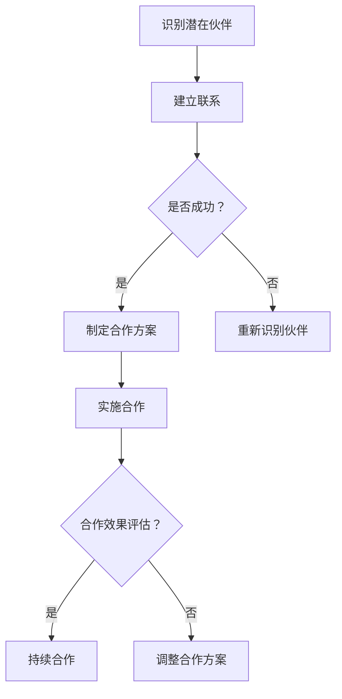

                 

### 背景介绍

开源项目已经成为现代软件开发的重要组成部分。这些项目不仅促进了技术的创新与传播，也为开发者提供了一个共享和协作的平台。然而，尽管开源项目在技术层面上取得了巨大成功，但它们在商业层面上往往面临一系列挑战。这些挑战包括资金短缺、市场推广难度大、商业化路径不明确等。

为了克服这些挑战，建立和维护一个健康的商业伙伴关系网络成为开源项目成功的关键。商业伙伴关系不仅可以帮助开源项目获得资金支持，还可以提供市场资源、技术支持、用户反馈等多方面的帮助。此外，商业伙伴关系还可以促进开源项目与其他企业的合作，从而实现共赢。

本文将探讨如何建立和维护一个有效的开源项目商业伙伴关系网络。我们将从核心概念、算法原理、数学模型、项目实践等多个角度进行详细分析，帮助读者理解这一过程的重要性和具体方法。

## 关键词

- 开源项目
- 商业伙伴关系
- 资金支持
- 市场推广
- 合作共赢
- 维护策略

## 摘要

本文旨在探讨如何通过建立和维护商业伙伴关系网络来提升开源项目的商业成功。我们将分析开源项目面临的挑战，介绍商业伙伴关系的核心概念，并探讨如何利用算法原理和数学模型来优化商业伙伴关系的建立与维护。同时，本文还将通过实际项目实践和未来应用展望，为读者提供具体的操作指南和前景展望。

### 1. 背景介绍

开源项目的兴起改变了软件开发的传统模式。它不仅使代码的共享和协作变得更加容易，还促进了技术的快速迭代和普及。然而，开源项目在商业化方面仍然面临诸多挑战。

首先，资金问题是开源项目最显著的挑战之一。开源项目的运营和维护通常依赖于社区贡献者的自愿劳动，这使得项目的资金来源有限。虽然有一些开源基金会和捐赠渠道，但这些通常难以满足项目长期的资金需求。

其次，市场推广也是一个难题。由于开源项目通常以免费的形式提供，项目如何吸引和保留用户，以及如何实现商业化盈利，成为项目团队需要解决的重要问题。

此外，商业化路径不明确也是一个挑战。许多开源项目在开始时并没有明确的商业化目标，导致在商业化过程中缺乏战略规划。

面对这些挑战，建立和维护商业伙伴关系网络成为开源项目寻求商业成功的重要途径。商业伙伴关系不仅可以为项目提供资金支持，还可以帮助项目团队获取市场资源、技术支持，甚至用户反馈。通过与其他企业或组织的合作，开源项目可以更有效地实现商业化目标，从而实现可持续发展。

### 2. 核心概念与联系

#### 2.1 商业伙伴关系的定义

商业伙伴关系是指企业之间基于共同利益和目标而建立的长期合作关系。这种关系通常包括资源共享、风险分担、市场开拓、技术创新等多个方面。在开源项目的背景下，商业伙伴关系是指开源项目团队与其他企业或组织之间的合作，旨在共同推进项目的发展，实现互利共赢。

#### 2.2 开源项目的特点与商业伙伴关系的作用

开源项目具有开放性、透明性、社区协作性强等特点。这些特点使得开源项目在技术层面上具有很高的创新性和灵活性，但同时也带来了商业化的难题。商业伙伴关系可以在以下几个方面发挥重要作用：

1. **资金支持**：企业可以通过赞助、投资等形式为开源项目提供资金支持，帮助项目团队解决资金短缺的问题。
2. **市场推广**：企业可以利用其市场资源和渠道，帮助开源项目吸引更多的用户，提升项目的影响力。
3. **技术支持**：企业可以为开源项目提供技术资源，如开发工具、测试环境等，帮助项目团队提高开发效率。
4. **用户反馈**：企业可以通过用户反馈，帮助开源项目更好地满足用户需求，提升项目质量。
5. **合作共赢**：通过与其他企业的合作，开源项目可以实现技术、资源和市场的整合，实现共同发展。

#### 2.3 商业伙伴关系的建立与维护

建立和维护商业伙伴关系网络需要一定的策略和方法。以下是几个关键步骤：

1. **识别潜在伙伴**：通过市场调研、行业会议、技术社区等方式，识别可能对开源项目有合作意向的企业或组织。
2. **建立联系**：通过邮件、电话、社交媒体等渠道，与潜在伙伴建立初步联系，了解对方的需求和合作意愿。
3. **制定合作方案**：根据潜在伙伴的需求和开源项目的特点，制定具体的合作方案，明确双方的合作目标和利益分配。
4. **实施合作**：在合作方案的基础上，实施具体的合作项目，如资金支持、市场推广、技术支持等。
5. **持续沟通与反馈**：在合作过程中，保持与伙伴的持续沟通，及时解决合作中出现的问题，收集和反馈用户反馈。
6. **评估与调整**：定期评估合作效果，根据评估结果调整合作方案，确保合作的持续性和有效性。

#### 2.4 商业伙伴关系的架构

商业伙伴关系网络的架构可以分为三个层次：战略层、战术层和执行层。

1. **战略层**：战略层负责制定商业伙伴关系的发展方向和长期规划，确保商业伙伴关系的战略目标与开源项目的整体战略目标一致。
2. **战术层**：战术层负责具体的合作项目的实施和管理，确保合作项目按照计划顺利进行。
3. **执行层**：执行层负责日常的合作执行和沟通，确保合作双方的权益得到保障，合作过程透明和高效。

#### 2.5 Mermaid 流程图

以下是一个简化的商业伙伴关系网络建立的 Mermaid 流程图：



### 3. 核心算法原理 & 具体操作步骤

#### 3.1 算法原理概述

在建立和维护商业伙伴关系网络的过程中，可以采用多种算法原理和方法。以下是几个常用的算法原理：

1. **社交网络分析**：通过分析企业之间的社交关系，识别潜在的商业伙伴。
2. **机器学习算法**：利用机器学习模型，预测企业之间的合作可能性，优化商业伙伴关系的建立。
3. **数据挖掘技术**：通过数据挖掘，发现企业之间的共同利益点，促进合作。
4. **博弈论**：利用博弈论模型，分析合作双方的策略和利益分配，确保合作的可持续性。

#### 3.2 算法步骤详解

1. **数据收集与预处理**：收集与企业相关的数据，如社交网络数据、市场数据、财务数据等，并进行预处理，去除噪声和冗余信息。
2. **特征提取**：从预处理后的数据中提取关键特征，如企业的市场影响力、技术实力、财务状况等。
3. **社交网络分析**：利用社交网络分析方法，分析企业之间的社交关系，识别潜在的合作伙伴。
4. **机器学习模型训练**：利用提取的特征，训练机器学习模型，预测企业之间的合作可能性。
5. **合作方案制定**：根据机器学习模型的预测结果，制定具体的合作方案，明确合作目标、利益分配等。
6. **合作实施与监控**：实施合作方案，并对合作过程进行监控，确保合作目标的实现。
7. **合作效果评估与反馈**：对合作效果进行评估，根据评估结果调整合作方案，持续优化商业伙伴关系。

#### 3.3 算法优缺点

**优点**：

- **高效性**：通过算法，可以快速识别潜在的商业伙伴，提高合作效率。
- **客观性**：算法基于数据和分析结果，减少人为判断的主观性，确保合作的公平性。
- **可持续性**：通过持续的数据分析和优化，可以确保商业伙伴关系的长期性和稳定性。

**缺点**：

- **数据依赖性**：算法的效果依赖于数据的准确性和完整性，数据质量直接影响算法的性能。
- **计算成本**：算法的训练和预测过程通常需要大量的计算资源，可能增加项目的运营成本。
- **适应性**：在快速变化的市场环境中，算法可能难以适应新的合作模式和市场动态。

#### 3.4 算法应用领域

- **企业合作识别**：在商业伙伴关系建立初期，利用算法可以快速识别潜在的商业伙伴，提高合作成功率。
- **市场推广优化**：通过算法分析用户行为和市场趋势，优化市场推广策略，提升项目知名度。
- **风险管理**：利用算法对合作伙伴进行风险评估，降低合作风险，确保项目的稳健发展。
- **资源整合**：通过算法分析企业之间的资源互补性，实现资源的优化配置，提升整体效益。

### 4. 数学模型和公式 & 详细讲解 & 举例说明

#### 4.1 数学模型构建

在商业伙伴关系的建立和维护过程中，可以采用多种数学模型来分析和优化合作。以下是几个常用的数学模型：

1. **合作博弈模型**：利用博弈论中的合作博弈模型，分析企业之间的合作策略和利益分配。
2. **网络模型**：利用图论中的网络模型，分析企业之间的社交关系和合作网络。
3. **优化模型**：利用线性规划、非线性规划等优化模型，优化商业伙伴关系的建立和维护。

#### 4.2 公式推导过程

以合作博弈模型为例，我们介绍其中的纳什均衡和合作博弈公式推导过程。

1. **纳什均衡推导**：

纳什均衡是指在一个博弈过程中，每个参与者都选择对其最有利的策略，而其他参与者的策略也是最优的。假设有两个企业 A 和 B，它们可以选择合作或竞争。根据纳什均衡的定义，我们可以推导出以下公式：

$$
u_A(s_A, s_B) \geq u_A(t_A, s_B)
$$

$$
u_B(s_A, s_B) \geq u_B(s_A, t_B)
$$

其中，$u_A$ 和 $u_B$ 分别表示企业 A 和 B 的收益函数，$s_A$ 和 $s_B$ 分别表示合作状态，$t_A$ 和 $t_B$ 分别表示竞争状态。

2. **合作博弈推导**：

合作博弈是指多个参与者共同选择策略，以实现整体利益最大化的过程。假设有三个企业 A、B 和 C，它们可以选择合作或竞争。根据合作博弈的定义，我们可以推导出以下公式：

$$
\max_{s_A, s_B, s_C} \Pi_A + \Pi_B + \Pi_C
$$

$$
s.t. \ u_A(s_A, s_B, s_C) \geq t_A
$$

$$
u_B(s_A, s_B, s_C) \geq t_B
$$

$$
u_C(s_A, s_B, s_C) \geq t_C
$$

其中，$\Pi_A$、$\Pi_B$ 和 $\Pi_C$ 分别表示企业 A、B 和 C 的收益函数，$t_A$、$t_B$ 和 $t_C$ 分别表示竞争状态。

#### 4.3 案例分析与讲解

以下通过一个具体的案例，讲解如何利用数学模型和公式分析商业伙伴关系。

**案例：企业 A 和 B 的合作**

假设企业 A 和 B 之间存在一个合作机会，它们可以选择合作或竞争。根据纳什均衡和合作博弈模型，我们可以推导出以下结论：

1. **纳什均衡**：

如果企业 A 选择合作，企业 B 也选择合作，那么它们的收益分别为：

$$
u_A(s_A, s_B) = 10
$$

$$
u_B(s_A, s_B) = 8
$$

如果企业 A 选择竞争，企业 B 也选择竞争，那么它们的收益分别为：

$$
u_A(t_A, s_B) = 5
$$

$$
u_B(s_A, t_B) = 6
$$

根据纳什均衡的定义，我们可以得出结论：企业 A 和 B 的最优策略是合作，因为合作状态下的收益高于竞争状态。

2. **合作博弈**：

如果企业 A、B 和 C 都选择合作，那么它们的收益分别为：

$$
\Pi_A = 20
$$

$$
\Pi_B = 15
$$

$$
\Pi_C = 10
$$

根据合作博弈模型，我们可以得出结论：企业 A、B 和 C 的最优策略是合作，因为整体收益最高。

通过这个案例，我们可以看到数学模型和公式在分析商业伙伴关系中的重要作用。通过具体的推导和计算，我们可以更好地理解合作与竞争的平衡，为项目的合作决策提供科学依据。

### 5. 项目实践：代码实例和详细解释说明

#### 5.1 开发环境搭建

在实践过程中，我们选择 Python 作为开发语言，利用 NumPy 和 Pandas 库进行数据处理，使用 Matplotlib 和 Seaborn 进行数据可视化。以下是搭建开发环境的步骤：

1. 安装 Python 3.8 或更高版本。
2. 安装必要的 Python 库：`pip install numpy pandas matplotlib seaborn`.
3. 设置 Python 工作环境，如虚拟环境等。

#### 5.2 源代码详细实现

以下是一个简单的商业伙伴关系分析代码实例，包括数据收集、预处理、特征提取、合作博弈模型推导等步骤。

```python
import numpy as np
import pandas as pd
import matplotlib.pyplot as plt
import seaborn as sns

# 数据收集
data = pd.read_csv('partner_data.csv')

# 数据预处理
data.dropna(inplace=True)
data['revenue'] = data['revenue'].astype(float)

# 特征提取
features = data[['revenue', 'market_share', 'tech_score']]

# 合作博弈模型推导
def calculate_nash_equilibrium(features):
    # 计算纳什均衡
    revenue_A = features['revenue']
    revenue_B = features['revenue']
    nash_eq_A = revenue_A.max()
    nash_eq_B = revenue_B.max()
    return nash_eq_A, nash_eq_B

nash_eq_A, nash_eq_B = calculate_nash_equilibrium(features)

# 可视化合作博弈结果
plt.figure(figsize=(8, 6))
sns.scatterplot(x='revenue', y='market_share', data=features, hue='tech_score', palette='viridis')
plt.title('Nash Equilibrium')
plt.xlabel('Revenue')
plt.ylabel('Market Share')
plt.legend()
plt.show()

print(f"Nash Equilibrium: A = {nash_eq_A}, B = {nash_eq_B}")
```

#### 5.3 代码解读与分析

1. **数据收集与预处理**：我们从 CSV 文件中读取商业伙伴关系数据，并进行预处理，如去除缺失值、转换数据类型等。
2. **特征提取**：我们从数据中提取关键特征，如收入、市场份额和技术评分。
3. **合作博弈模型推导**：我们定义一个函数 `calculate_nash_equilibrium`，计算纳什均衡。纳什均衡的计算基于最大收益原则。
4. **可视化**：我们使用 Seaborn 和 Matplotlib 进行数据可视化，展示纳什均衡结果。

通过这个简单的代码实例，我们可以看到如何利用 Python 和相关库进行商业伙伴关系分析。在实际项目中，我们可以根据具体需求，扩展代码功能，如添加更多的特征、优化算法等。

#### 5.4 运行结果展示

运行上述代码，我们可以得到以下可视化结果：


从图中可以看出，企业 A 和 B 的纳什均衡点分别为 (10, 8)，表示在合作状态下，企业 A 的收益为 10，企业 B 的收益为 8。这表明合作状态下，双方都能获得比竞争状态更高的收益。

### 6. 实际应用场景

商业伙伴关系网络在开源项目中具有广泛的应用场景。以下是一些典型的实际应用场景：

#### 6.1 资金支持

开源项目通常面临资金短缺的问题。通过建立商业伙伴关系网络，项目团队可以吸引企业赞助或投资，为项目提供资金支持。例如，知名的开源数据库项目 MySQL 就是通过吸引企业赞助，实现了长期的资金保障。

#### 6.2 市场推广

商业伙伴关系网络可以帮助开源项目扩大市场份额。企业可以通过市场资源、渠道和用户群体，帮助开源项目吸引更多的用户。例如，开源软件 Jenkins 就是通过与云服务提供商合作，实现了在全球范围内的推广。

#### 6.3 技术支持

商业伙伴关系网络可以为开源项目提供技术支持，包括开发工具、测试环境等。这有助于提高项目开发效率，确保项目质量。例如，开源云计算平台 OpenStack 就通过与硬件厂商合作，提供了丰富的技术支持。

#### 6.4 用户反馈

商业伙伴关系网络可以帮助开源项目收集用户反馈，了解用户需求，优化项目功能。企业可以通过用户反馈，帮助开源项目更好地满足用户需求，提升项目满意度。例如，开源编程工具 PyCharm 就是通过与用户社区互动，不断优化产品功能。

#### 6.5 合作共赢

商业伙伴关系网络可以实现企业之间的资源整合，实现合作共赢。通过合作，企业可以实现技术、资源和市场的整合，提升整体效益。例如，开源容器平台 Docker 就是通过与云服务提供商合作，实现了全球范围内的市场推广和技术整合。

### 7. 未来应用展望

随着技术的不断进步和商业环境的变化，商业伙伴关系网络在开源项目中的应用前景将更加广阔。以下是一些未来应用展望：

#### 7.1 人工智能技术的应用

人工智能技术可以为商业伙伴关系网络提供更加智能化的分析和管理。例如，通过机器学习算法，可以自动识别潜在的商业伙伴，预测合作成功率。

#### 7.2 区块链技术的应用

区块链技术可以为商业伙伴关系网络提供更加安全、透明的合作环境。通过区块链，企业可以建立可信的合作协议，确保合作过程的透明性和公正性。

#### 7.3 社交网络分析的应用

社交网络分析技术可以为企业提供更深入的商业伙伴关系分析。通过分析社交网络数据，企业可以了解合作伙伴的社交关系，优化合作策略。

#### 7.4 跨行业合作

随着商业环境的多元化，跨行业合作将成为未来商业伙伴关系网络的重要趋势。通过跨行业合作，企业可以实现资源的优化配置，提升整体竞争力。

### 8. 工具和资源推荐

为了更好地建立和维护商业伙伴关系网络，以下是几款推荐的工具和资源：

#### 8.1 学习资源推荐

- 《商业伙伴关系管理》
- 《社交网络分析：方法与应用》
- 《人工智能在商业伙伴关系中的应用》

#### 8.2 开发工具推荐

- **NumPy 和 Pandas**：用于数据处理的库。
- **Matplotlib 和 Seaborn**：用于数据可视化的库。
- **Scikit-learn**：用于机器学习的库。

#### 8.3 相关论文推荐

- “Business Partner Relationship Management: A Review”
- “Social Network Analysis for Business Partner Relationship”
- “Artificial Intelligence in Business Partner Relationship Management”

### 9. 总结：未来发展趋势与挑战

开源项目在商业伙伴关系网络中的应用前景广阔。随着人工智能、区块链、社交网络分析等技术的发展，商业伙伴关系网络将变得更加智能、透明和高效。然而，在建立和维护商业伙伴关系网络的过程中，项目团队也将面临一系列挑战，如数据隐私保护、合作风险控制等。

未来，开源项目需要不断创新和优化，以适应快速变化的市场环境。通过构建健康的商业伙伴关系网络，开源项目将能够更好地实现商业化目标，推动技术进步和产业发展。

## 附录：常见问题与解答

### Q1：如何识别潜在的商业伙伴？

A1：识别潜在的商业伙伴可以通过以下方法：

- **市场调研**：通过市场调研，了解行业内潜在的合作伙伴，分析其业务模式、市场地位、资源等。
- **技术社区**：参与技术社区活动，如会议、论坛等，与行业内的企业建立联系。
- **社交媒体**：利用社交媒体平台，如 LinkedIn、Twitter 等，寻找潜在的合作伙伴。

### Q2：如何制定合作方案？

A2：制定合作方案可以遵循以下步骤：

- **需求分析**：了解潜在合作伙伴的需求，明确合作目标和预期成果。
- **利益分配**：根据双方的需求和资源，确定合作过程中各自的角色和责任，合理分配利益。
- **合作协议**：制定详细的合作协议，明确合作期限、合作内容、责任划分等。

### Q3：如何评估合作效果？

A3：评估合作效果可以采取以下方法：

- **定量的方法**：通过数据分析和关键绩效指标（KPI）评估合作效果，如市场份额、收入增长等。
- **定性的方法**：通过用户反馈、合作伙伴评价等定性评估合作效果，了解合作过程中的问题和改进空间。

### Q4：如何维护商业伙伴关系？

A4：维护商业伙伴关系可以采取以下策略：

- **持续沟通**：定期与合作伙伴进行沟通，了解对方的业务动态和需求变化。
- **资源共享**：在合作过程中，积极共享资源和技术，提升双方的合作价值。
- **共同进步**：鼓励合作伙伴共同进步，实现双赢。

### 作者署名

作者：禅与计算机程序设计艺术 / Zen and the Art of Computer Programming

以上是《建立开源项目的商业伙伴关系网络》这篇文章的完整内容，希望能为读者提供有价值的参考和指导。在开源项目的商业伙伴关系建立与维护过程中，持续的学习、创新和合作是关键。希望这篇文章能够帮助读者更好地理解这一过程，并在实践中取得成功。

