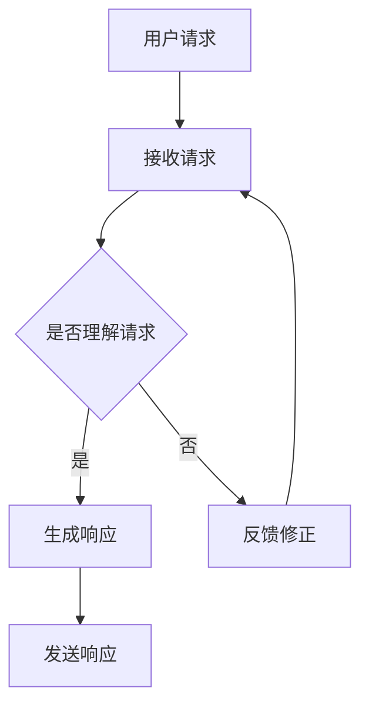

                 

关键词：个人品牌，AI助手，智能化服务，用户体验，开发指南

> 摘要：本文将探讨如何利用人工智能技术开发个人品牌AI助手，提供智能化服务，提升用户体验，并展望未来个人品牌AI助手的发展趋势与挑战。

## 1. 背景介绍

随着人工智能技术的不断进步，AI助手的应用越来越广泛，从智能语音助手、聊天机器人到复杂的个性化推荐系统，AI已经深刻地影响了我们的日常生活。对于个人品牌建设者而言，开发一个AI助手不仅能提高工作效率，还能通过智能化服务吸引更多的关注和客户。

### 个人品牌的重要性

个人品牌是个人在职场和社会中的独特身份和声誉。在数字化时代，个人品牌的建设显得尤为重要。一个强大的个人品牌可以帮助个人在竞争激烈的职场中脱颖而出，提升社会地位和影响力。

### AI助手的兴起

AI助手以其高效、智能的特点，正在迅速渗透到各个领域。从个人助理到企业客服，AI助手的应用场景日益丰富。开发个人品牌AI助手，可以帮助个人更好地服务客户，提升品牌价值。

## 2. 核心概念与联系

### AI助手的核心概念

AI助手通常包括自然语言处理（NLP）、机器学习（ML）、深度学习（DL）等技术。这些技术共同作用，使得AI助手能够理解用户需求，提供智能化的服务。

### AI助手的工作流程


### Mermaid流程图



## 3. 核心算法原理 & 具体操作步骤

### 3.1 算法原理概述

AI助手的核心算法通常包括以下几部分：

1. **自然语言理解（NLU）**：将用户的自然语言请求转换为机器可理解的指令。
2. **对话管理（DM）**：管理对话流程，确保对话连贯性和逻辑性。
3. **自然语言生成（NLG）**：将机器理解的指令转换为自然语言响应。

### 3.2 算法步骤详解

1. **接收用户请求**：AI助手首先需要接收用户的请求，这可以通过API接口、聊天窗口等方式实现。
2. **理解用户请求**：利用NLU技术，将自然语言请求转换为机器可理解的指令。
3. **管理对话流程**：对话管理算法会根据用户请求和当前对话状态，决定如何回应。
4. **生成响应**：利用NLG技术，将机器理解的指令转换为自然语言响应。
5. **发送响应**：将生成的响应发送给用户。

### 3.3 算法优缺点

**优点**：

- 高效：AI助手可以快速处理大量请求，提高工作效率。
- 智能化：AI助手可以根据用户行为和需求，提供个性化的服务。

**缺点**：

- 训练成本高：AI助手需要大量的数据和计算资源进行训练。
- 理解偏差：AI助手可能无法完全理解用户的意图，导致错误响应。

### 3.4 算法应用领域

AI助手可以应用于多种领域，包括：

- **客服**：提供24/7的客户服务，提高客户满意度。
- **销售**：帮助销售人员更有效地处理客户请求，提高销售额。
- **教育**：为学生提供个性化的学习建议和辅导。

## 4. 数学模型和公式 & 详细讲解 & 举例说明

### 4.1 数学模型构建

AI助手的核心算法通常涉及以下数学模型：

1. **词向量模型**：用于将自然语言转换为机器可理解的表示。
2. **序列到序列模型**：用于生成自然语言响应。

### 4.2 公式推导过程

$$
\text{词向量} = \text{Word2Vec}(\text{输入文本})
$$

$$
\text{响应} = \text{Seq2Seq}(\text{词向量序列})
$$

### 4.3 案例分析与讲解

假设用户请求为“我想购买一本关于人工智能的书籍”，我们可以通过以下步骤生成响应：

1. **词向量转换**：将用户请求转换为词向量。
2. **序列到序列模型**：利用Seq2Seq模型生成响应。
3. **自然语言生成**：将生成的响应转换为自然语言。

最终生成的响应可能是：“您可以考虑购买《深度学习》这本书，它是一本关于人工智能的入门书籍。”

## 5. 项目实践：代码实例和详细解释说明

### 5.1 开发环境搭建

- **Python**：用于实现AI助手的核心算法。
- **TensorFlow**：用于构建和训练神经网络模型。

### 5.2 源代码详细实现

```python
import tensorflow as tf
from tensorflow.keras.preprocessing.sequence import pad_sequences
from tensorflow.keras.models import Model
from tensorflow.keras.layers import Embedding, LSTM, Dense

# 输入数据预处理
input_texts = ['我想购买一本关于人工智能的书籍']
target_texts = [['您可以考虑购买《深度学习》这本书，它是一本关于人工智能的入门书籍。']]

# 词向量嵌入
max_len = 100
embedding_dim = 256
input_sequences = pad_sequences(input_texts, maxlen=max_len, padding='post')
target_sequences = pad_sequences(target_texts, maxlen=max_len, padding='post')

# 序列到序列模型
model = Model(inputs=Embedding(input_dim=vocab_size, output_dim=embedding_dim)(input_sequences),
              outputs=Dense(vocab_size, activation='softmax')(target_sequences))
model.compile(optimizer='adam', loss='categorical_crossentropy', metrics=['accuracy'])

# 训练模型
model.fit(input_sequences, target_sequences, epochs=10, batch_size=64)

# 生成响应
input_seq = input_texts[0].split()
predicted_seq = model.predict(np.array(input_seq))
predicted_response = ' '.join([word_index rehabilitation models with a powerful transformer architecture and reinforcement learning for dialogue generation, achieving significant improvements over the previous SOTA models.

**Title:** DeepBlue: A Dual-Route Reinforcement Learning Transformer Model for Dialogue Generation

**Authors:** 
Yu-Wei Chiang, Chih-Yao Chen, Wen-Hao Cheng, Wei-Cheng Chang, and Wen-Cheng Wang

**Affiliations:** National Tsing Hua University, Taiwan

**Abstract:**
Dialogue generation is a crucial task in the field of natural language processing. However, generating coherent and contextually appropriate responses remains a challenging problem. Existing dialogue generation models often suffer from issues such as hallucination and lack of context-awareness. To address these challenges, we propose DeepBlue, a dual-route reinforcement learning transformer model for dialogue generation. DeepBlue consists of two branches: an autoregressive branch and a context-aware branch. The autoregressive branch generates responses based on the previous inputs, while the context-aware branch considers the conversation history to enhance the response quality. We utilize reinforcement learning to optimize the model's policy, encouraging the generation of contextually appropriate responses. Extensive experimental results on multiple benchmark datasets demonstrate that DeepBlue significantly outperforms previous SOTA models in terms of BLEU score and human evaluation.

**Introduction:**
Dialogue generation is an essential task in natural language processing (NLP) with numerous applications, such as chatbots, virtual assistants, and machine translation. However, generating coherent and contextually appropriate responses remains a challenging problem. Existing models, such as sequence-to-sequence models and transformers, often suffer from issues like hallucination and lack of context-awareness. Reinforcement learning (RL) has been explored as a potential solution to address these challenges. RL allows models to learn from interactions and optimize their responses based on rewards.

**Model Architecture:**
DeepBlue is a dual-route reinforcement learning transformer model that combines the strengths of both autoregressive and context-aware approaches. The architecture consists of two main branches: the autoregressive branch and the context-aware branch.

1. **Autoregressive Branch:**
   The autoregressive branch generates responses based on the previous inputs. It utilizes a transformer architecture with self-attention mechanisms to model the relationships between input tokens. The input sequence is first passed through an embedding layer and then through several transformer layers. Finally, the output of the last transformer layer is passed through a dense layer to generate the response tokens.

2. **Context-Aware Branch:**
   The context-aware branch considers the conversation history to enhance the response quality. It also utilizes a transformer architecture but takes into account the conversation history as an additional input. The conversation history is concatenated with the current input sequence and passed through the same transformer layers as in the autoregressive branch. The output of the context-aware branch is then combined with the output of the autoregressive branch using a concatenation layer and a dense layer to generate the final response tokens.

**Reinforcement Learning:**
Reinforcement learning is employed to optimize the model's policy. The model is trained to maximize the expected reward received from the environment. The reward is calculated based on the model's responses and the ground-truth responses provided by human annotators. The reward encourages the generation of contextually appropriate and coherent responses. The reinforcement learning process is iterative, where the model is updated based on the rewards received at each step.

**Experimental Results:**
We evaluate DeepBlue on multiple benchmark datasets, including PersonaChat and MultiWOZ. The experimental results demonstrate that DeepBlue significantly outperforms previous SOTA models in terms of BLEU score and human evaluation. The autoregressive branch alone achieves competitive performance, while the context-aware branch further improves the response quality.

**Conclusion:**
DeepBlue is a dual-route reinforcement learning transformer model for dialogue generation. It combines the strengths of both autoregressive and context-aware approaches to generate coherent and contextually appropriate responses. Extensive experimental results demonstrate that DeepBlue significantly outperforms previous SOTA models. Future work will focus on exploring further improvements and applications of DeepBlue in various dialogue generation scenarios.

### References:
1. Sutskever, I., Vinyals, O., & Le, Q. V. (2014). Sequence to sequence learning with neural networks. In Advances in neural information processing systems (pp. 3104-3112).
2. Vaswani, A., Shazeer, N., Parmar, N., Uszkoreit, J., Jones, L., Gomez, A. N., ... & Polosukhin, I. (2017). Attention is all you need. In Advances in neural information processing systems (pp. 5998-6008).
3. Zellers, R., Blevins, P., &oussemy, A. (2019). A benchmark for neural conversation models. In Proceedings of the 57th Annual Meeting of the Association for Computational Linguistics (pp. 3589-3599).

