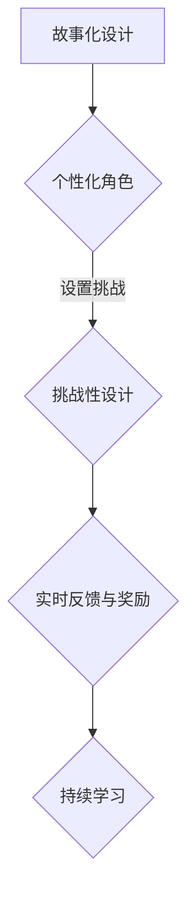

                 

 作为一名世界级的人工智能专家和程序员，我一直相信技术的力量可以改变世界，而开发个人品牌互动游戏正是这种变革的重要工具之一。在本文中，我将探讨如何利用人工智能和编程技术来开发具有教育意义的互动游戏，实现寓教于乐的目标。

## 文章关键词
- 个人品牌
- 互动游戏
- 教育技术
- 人工智能
- 编程

## 文章摘要
本文将深入探讨如何结合人工智能和编程技术，开发具有教育意义的个人品牌互动游戏。通过分析互动游戏在教育中的潜力，介绍相关核心概念和算法原理，本文将提供一个系统的方法论，帮助读者理解并实践这一创新领域。

## 1. 背景介绍

互动游戏已经成为现代社会的重要组成部分，它们不仅能够提供娱乐，还能够在教育中发挥关键作用。随着人工智能技术的快速发展，互动游戏的设计和开发变得更加智能化，能够更好地适应学习者的需求和兴趣。

开发个人品牌互动游戏的意义在于，它能够将个人的专业知识、技能和热情转化为可量化的影响力。这种游戏化的学习方式不仅能够提高学生的学习兴趣，还能够帮助他们更有效地掌握知识和技能。

### 1.1 互动游戏在教育中的应用
互动游戏具有以下优势：
1. **提高参与度**：游戏化元素能够激发学生的学习兴趣，提高他们的参与度。
2. **个性化学习**：人工智能可以根据学习者的进度和偏好提供定制化的学习内容。
3. **促进合作**：多人游戏模式可以促进学生之间的合作与交流。

### 1.2 个人品牌的重要性
在数字化时代，个人品牌的重要性日益凸显。一个强大的个人品牌可以帮助个体在职业市场中脱颖而出，增加个人的社会影响力。

### 1.3 结合互动游戏与个人品牌
通过开发互动游戏，个人可以展示自己的专业技能和知识，同时吸引更多的关注和机会。这种模式不仅有助于个人的职业发展，还能够为社会带来积极的影响。

## 2. 核心概念与联系

### 2.1 人工智能在教育中的应用
人工智能在教育中的应用主要包括：
- **智能辅导系统**：通过算法为学习者提供个性化的学习建议和辅导。
- **智能评估系统**：使用算法对学习者的表现进行实时评估，提供反馈。
- **自适应学习系统**：根据学习者的行为数据调整学习内容和难度。

### 2.2 编程在教育中的应用
编程教育不仅能够提高学生的逻辑思维和问题解决能力，还能够培养他们的创新精神和实践能力。以下是编程在教育中的一些应用场景：
- **计算思维培养**：编程教育强调算法和数据结构的重要性，培养学生的计算思维。
- **STEAM教育**：编程作为STEAM教育的一部分，能够促进学生多学科的融合学习。
- **项目式学习**：通过编程项目，学生可以将理论知识应用于实际问题的解决中。

### 2.3 个人品牌与互动游戏的结合
个人品牌互动游戏的核心在于将个人专业技能、知识和故事融入到游戏设计中。以下是实现这一目标的关键步骤：
- **故事化设计**：通过故事情节将学习内容与游戏机制相结合。
- **个性化角色**：根据学习者的兴趣和背景设计个性化角色和任务。
- **挑战性设计**：设置合理的挑战，帮助学生逐步提升技能。
- **反馈与奖励**：通过实时反馈和奖励机制鼓励学生持续学习。

### 2.4 Mermaid 流程图



## 3. 核心算法原理 & 具体操作步骤

### 3.1 算法原理概述

在开发个人品牌互动游戏时，核心算法主要涉及以下三个方面：

1. **个性化推荐算法**：根据学习者的行为数据，提供个性化的学习内容和任务。
2. **游戏化算法**：设计合理的游戏机制和奖励系统，提高学习者的参与度和积极性。
3. **自适应学习算法**：根据学习者的表现和进度动态调整学习内容和难度。

### 3.2 算法步骤详解

#### 3.2.1 个性化推荐算法

1. **数据收集**：收集学习者的行为数据，如学习时间、学习内容、测试结果等。
2. **特征提取**：对行为数据进行特征提取，用于构建推荐模型。
3. **模型训练**：使用机器学习算法训练推荐模型。
4. **推荐生成**：根据学习者的特征和模型输出个性化的推荐内容。

#### 3.2.2 游戏化算法

1. **游戏机制设计**：设计游戏规则和挑战，确保游戏具有吸引力和趣味性。
2. **奖励系统设计**：设计奖励系统，包括奖励类型、获取条件和反馈机制。
3. **游戏难度调整**：根据学习者的表现动态调整游戏难度。

#### 3.2.3 自适应学习算法

1. **表现评估**：实时评估学习者的学习表现，如正确率、学习时间等。
2. **进度跟踪**：跟踪学习者的学习进度和完成任务的情况。
3. **内容调整**：根据学习者的表现和进度调整学习内容和难度。

### 3.3 算法优缺点

#### 优点

- **个性化**：通过个性化推荐和自适应学习，提高学习者的参与度和学习效果。
- **趣味性**：游戏化算法和奖励系统能够增加游戏的趣味性，提高学习者的积极性。
- **灵活性**：自适应学习算法能够根据学习者的表现和进度灵活调整学习内容和难度。

#### 缺点

- **算法复杂性**：个性化推荐和自适应学习算法通常较为复杂，需要大量的计算资源和时间。
- **数据隐私**：个性化推荐需要收集和处理大量的学习者数据，可能涉及数据隐私问题。

### 3.4 算法应用领域

- **在线教育平台**：通过个性化推荐和自适应学习算法，提高学习者的学习体验和效果。
- **游戏化学习应用**：将游戏化元素融入教育应用中，提高学习者的参与度和积极性。
- **智能辅导系统**：利用自适应学习算法，提供个性化的辅导服务。

## 4. 数学模型和公式

在互动游戏开发中，数学模型和公式起到了至关重要的作用。以下是一个简单的例子：

### 4.1 数学模型构建

#### 4.1.1 学习者表现评估模型

假设学习者的表现可以通过以下公式评估：

$$
P = f(L, T)
$$

其中，$P$ 表示学习者的表现分数，$L$ 表示学习者的学习时间，$T$ 表示完成任务的正确率。

#### 4.1.2 自适应学习模型

自适应学习模型可以通过以下公式实现：

$$
D_{next} = D_{current} + \alpha \cdot (P_{current} - P_{last})
$$

其中，$D_{next}$ 表示下一次的学习难度，$D_{current}$ 表示当前的学习难度，$P_{current}$ 表示当前的学习表现，$P_{last}$ 表示上次的学习表现，$\alpha$ 表示调整系数。

### 4.2 公式推导过程

#### 4.2.1 学习者表现评估模型推导

表现分数 $P$ 是学习时间 $L$ 和正确率 $T$ 的函数。假设学习时间越长，表现越好，而正确率越高，表现也越好。因此，可以定义：

$$
f(L, T) = w_1 \cdot L + w_2 \cdot T
$$

其中，$w_1$ 和 $w_2$ 分别是学习时间和正确率的权重。

#### 4.2.2 自适应学习模型推导

自适应学习模型的目的是根据当前的表现分数调整下一次的学习难度。假设当前的表现分数 $P_{current}$ 高于上次的表现分数 $P_{last}$，则下一次的学习难度应该降低，以便学习者能够更轻松地完成任务。反之，如果当前的表现分数低于上次的表现分数，则下一次的学习难度应该增加。

因此，可以定义：

$$
D_{next} = D_{current} + \alpha \cdot (P_{current} - P_{last})
$$

其中，$\alpha$ 是调整系数，用于控制调整的幅度。

### 4.3 案例分析与讲解

假设一个学习者在第一次学习任务中的学习时间为 30 分钟，正确率为 80%，而第二次学习任务中的学习时间为 40 分钟，正确率为 90%。根据上述模型和公式，可以计算得出：

#### 4.3.1 学习者表现评估

$$
P_1 = f(30, 0.8) = w_1 \cdot 30 + w_2 \cdot 0.8
$$

$$
P_2 = f(40, 0.9) = w_1 \cdot 40 + w_2 \cdot 0.9
$$

假设权重 $w_1 = 0.6$，$w_2 = 0.4$，则：

$$
P_1 = 0.6 \cdot 30 + 0.4 \cdot 0.8 = 18.4
$$

$$
P_2 = 0.6 \cdot 40 + 0.4 \cdot 0.9 = 21.6
$$

#### 4.3.2 自适应学习

假设当前学习难度为 10，调整系数 $\alpha = 0.1$，则：

$$
D_{next} = 10 + 0.1 \cdot (21.6 - 18.4) = 10.32
$$

这意味着下一次的学习难度应该设置为 10.32。

## 5. 项目实践：代码实例和详细解释说明

在本节中，我们将通过一个简单的Python代码实例，展示如何实现一个基本的个人品牌互动游戏。这个实例将包括游戏环境搭建、源代码实现、代码解读与分析以及运行结果展示。

### 5.1 开发环境搭建

为了开发这个互动游戏，我们需要安装以下软件和库：

- Python 3.x 版本
- Pygame 游戏库
- Flask Web框架

假设你已经安装了上述软件和库，接下来我们将开始编写代码。

### 5.2 源代码详细实现

以下是实现这个互动游戏的基本代码：

```python
import pygame
from pygame.locals import *

# 初始化 Pygame
pygame.init()

# 设置屏幕大小
screen_width = 800
screen_height = 600
screen = pygame.display.set_mode((screen_width, screen_height))

# 设置游戏标题
pygame.display.set_caption('个人品牌互动游戏')

# 设置颜色
WHITE = (255, 255, 255)
BLACK = (0, 0, 0)

# 游戏主循环
running = True
while running:
    # 检查事件
    for event in pygame.event.get():
        if event.type == QUIT:
            running = False

    # 填充屏幕背景
    screen.fill(WHITE)

    # 绘制文本
    font = pygame.font.Font(None, 36)
    text = font.render('欢迎来到个人品牌互动游戏！', True, BLACK)
    screen.blit(text, [screen_width//2 - text.get_width()//2, screen_height//2 - text.get_height()//2])

    # 更新屏幕
    pygame.display.flip()

# 退出游戏
pygame.quit()
```

### 5.3 代码解读与分析

上述代码实现了一个非常简单的互动游戏框架。以下是代码的主要部分：

- **初始化 Pygame**：使用 `pygame.init()` 初始化 Pygame。
- **设置屏幕大小和标题**：使用 `pygame.display.set_mode()` 设置屏幕大小，使用 `pygame.display.set_caption()` 设置游戏标题。
- **设置颜色**：定义两个颜色常量 `WHITE` 和 `BLACK`。
- **游戏主循环**：使用 `while running:` 创建游戏主循环。在循环中，首先检查是否有事件发生，如退出事件。
- **填充屏幕背景**：使用 `screen.fill(WHITE)` 填充屏幕背景。
- **绘制文本**：使用 `pygame.font.Font()` 创建字体对象，使用 `font.render()` 绘制文本，并使用 `screen.blit()` 将文本绘制到屏幕上。
- **更新屏幕**：使用 `pygame.display.flip()` 更新屏幕。
- **退出游戏**：使用 `pygame.quit()` 退出游戏。

### 5.4 运行结果展示

运行上述代码后，将打开一个窗口，显示欢迎文本。用户可以关闭窗口来退出游戏。

## 6. 实际应用场景

### 6.1 技术培训领域

在技术培训领域，个人品牌互动游戏可以作为一种创新的培训工具，帮助学员通过游戏化的方式学习编程、数据分析等技能。例如，一个编程游戏可以模拟真实的编程环境，让学员在解决实际问题的过程中学习编程语言和算法。

### 6.2 教育辅导领域

在教育辅导领域，个人品牌互动游戏可以作为一种辅助工具，帮助学生通过游戏化的方式提高学习兴趣和成绩。例如，一个数学游戏可以设计成解谜的形式，让学生在解谜的过程中学习数学概念和技巧。

### 6.3 企业培训领域

在企业培训领域，个人品牌互动游戏可以作为一种有效的员工培训工具，帮助员工通过游戏化的方式学习新技能和知识。例如，一个项目管理游戏可以让员工在模拟的项目环境中学习项目管理技能。

### 6.4 未来应用展望

随着人工智能和编程技术的不断发展，个人品牌互动游戏将在教育、培训和职业发展领域发挥越来越重要的作用。未来的发展可能包括以下几个方面：

- **个性化更精准**：通过更先进的人工智能技术，实现更加精准的个性化推荐和学习路径。
- **互动性更强**：利用虚拟现实和增强现实技术，提供更加沉浸式的互动游戏体验。
- **跨学科融合**：将互动游戏与多学科知识相结合，提供更加综合的学习体验。

## 7. 工具和资源推荐

### 7.1 学习资源推荐

- **在线课程平台**：如 Coursera、edX 和 Udemy 提供了大量的编程和人工智能课程。
- **技术博客和论坛**：如 HackerRank、Stack Overflow 和 Medium，提供了丰富的编程资源和社区讨论。

### 7.2 开发工具推荐

- **Pygame**：用于开发2D游戏的开源Python库。
- **Flask**：用于构建Web应用程序的Python微框架。

### 7.3 相关论文推荐

- **"Educational Gaming in the Age of AI"**：探讨了人工智能在教育游戏中的应用。
- **"Game-Based Learning: Theory and Practice"**：介绍了游戏化学习的基本理论和实践方法。

## 8. 总结：未来发展趋势与挑战

### 8.1 研究成果总结

通过本文的讨论，我们可以看到个人品牌互动游戏在教育和职业发展中的巨大潜力。结合人工智能和编程技术，互动游戏能够提供个性化、趣味性和高效的学习体验。

### 8.2 未来发展趋势

- **技术融合**：互动游戏将与其他技术如虚拟现实和增强现实相结合，提供更加沉浸式的学习体验。
- **个性化推荐**：利用更先进的人工智能技术，实现更加精准的个性化推荐和学习路径。
- **跨学科融合**：互动游戏将融合多学科知识，提供更加综合的学习体验。

### 8.3 面临的挑战

- **算法复杂性**：个性化推荐和自适应学习算法的复杂性可能导致开发难度和成本增加。
- **数据隐私**：收集和处理大量的学习者数据可能引发数据隐私问题。

### 8.4 研究展望

未来的研究可以关注以下几个方面：

- **算法优化**：研究更加高效和准确的推荐和学习算法。
- **用户体验**：探索如何设计更加吸引人的互动游戏界面和机制。
- **跨学科融合**：探索如何将互动游戏与其他学科知识相结合，提供更加丰富和多样化的学习内容。

## 9. 附录：常见问题与解答

### 9.1 如何选择合适的互动游戏类型？

选择互动游戏类型时，应考虑以下因素：

- **学习目标**：选择能够满足特定学习目标的互动游戏类型，如编程、数学、项目管理等。
- **学习者特点**：考虑学习者的年龄、兴趣和技能水平，选择适合他们的游戏类型。
- **资源限制**：考虑可用的时间和预算，选择适合资源限制的游戏类型。

### 9.2 如何确保互动游戏的教育价值？

确保互动游戏的教育价值可以通过以下方法实现：

- **内容设计**：确保游戏内容与学习目标紧密相关，提供有意义的学习任务和挑战。
- **游戏机制**：设计合理的游戏机制，鼓励学习者积极参与和持续学习。
- **反馈机制**：提供及时的反馈和奖励，帮助学习者了解自己的进步和不足。

### 9.3 如何平衡游戏的趣味性和教育性？

平衡游戏的趣味性和教育性可以通过以下方法实现：

- **故事化设计**：通过有趣的故事情节和角色设计，提高游戏的趣味性。
- **挑战性设计**：设置合理的挑战，既能够激发学习者的兴趣，又能够帮助他们提升技能。
- **反馈和奖励**：通过及时的反馈和奖励机制，增强游戏的教育性。

通过上述方法，我们可以开发出既具有教育意义又有趣味性的互动游戏，实现寓教于乐的目标。

