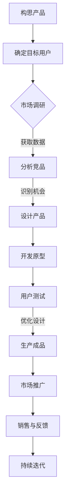

                 

关键词：个人品牌，知识变现，实体产品，市场策略，技术解读

> 摘要：在技术飞速发展的今天，个人品牌的价值愈发凸显。本文将探讨如何通过将个人知识转化为实体产品，从而打造个人品牌，实现商业价值的最大化。文章结构清晰，包含核心概念介绍、算法原理解析、数学模型讲解、实践代码展示、应用场景分析以及未来展望等内容，为读者提供全方位的指导。

## 1. 背景介绍

在互联网时代，知识的传播速度和广度达到了前所未有的高度。个人品牌作为知识变现的重要载体，已经成为许多专业人士和创业者追求的目标。个人品牌不仅仅是个人形象的展示，更是专业能力和影响力的体现。如何将丰富的知识转化为实际的实体产品，成为个人品牌建设的关键一步。

实体产品作为知识的一种物质化表现形式，能够更好地传递知识和价值。相较于传统的知识分享方式，实体产品具备更高的附加值和传播力。因此，如何有效地开发和推广个人品牌产品，成为每位专业人士都需要认真思考的问题。

本文将围绕以下主题展开讨论：

1. 个人品牌产品的核心概念和联系。
2. 核心算法原理及具体操作步骤。
3. 数学模型及公式详解。
4. 项目实践：代码实例和详细解释。
5. 实际应用场景分析。
6. 工具和资源推荐。
7. 总结与未来展望。

通过以上内容，读者将能够全面了解如何将个人知识转化为实体产品，打造个人品牌，并在市场上获得成功。

## 2. 核心概念与联系

### 2.1 个人品牌

个人品牌是指个人在公众中的形象、声誉和价值的总和。它不仅仅是个人的名字和标识，更是个人专业技能、知识、价值观和人格魅力的体现。在数字化时代，个人品牌具有以下几个显著特征：

- **高度个性化**：每个个人品牌都是独特的，反映了其独特的经历、技能和风格。
- **可传递性**：个人品牌可以通过多种渠道传递，如社交媒体、网站、出版物等。
- **影响力**：强大的个人品牌能够影响他人，塑造市场趋势。

### 2.2 知识变现

知识变现是指将个人的知识和技能转化为经济利益的过程。随着知识经济的兴起，知识变现已经成为许多专业人士的重要收入来源。知识变现的形式多种多样，包括但不限于以下几种：

- **线上教育**：通过开设在线课程、撰写电子书等方式传授知识。
- **咨询服务**：利用专业知识为他人提供解决方案。
- **专利和版权**：将研究成果或创意转化为专利或版权，进行商业化。
- **实体产品**：将知识和技能转化为实体产品，如图书、工具软件、培训包等。

### 2.3 实体产品

实体产品是指具有物理形态的产品，如书籍、软件、培训包等。它们是知识的一种物质化表现形式，具有以下几个特点：

- **持久性**：实体产品可以长期保存和传播，相较于数字内容具有更高的价值。
- **权威性**：实体产品往往具有较高的权威性，能够增强个人品牌的信誉。
- **多样性**：实体产品可以具有多种形式，满足不同用户的需求。

### 2.4 个人品牌产品

个人品牌产品是指由个人创建并代表其个人品牌的产品。它们通常结合了个人的专业知识、技能和独特的视角，具有以下几个特点：

- **高度个性化**：个人品牌产品体现了个人独特的风格和价值观。
- **高附加值**：个人品牌产品往往能够提供独特的价值，吸引特定用户群体。
- **传播力强**：个人品牌产品具有强大的传播力，能够扩大个人品牌的影响力。

### 2.5 Mermaid 流程图

以下是个人品牌产品开发的核心流程的 Mermaid 流程图：



通过上述流程，个人品牌产品从构思到市场推广的每一步都得到了充分的考虑和优化，从而确保产品的成功。

## 3. 核心算法原理 & 具体操作步骤

### 3.1 算法原理概述

个人品牌产品的开发涉及多个核心算法原理，以下是其中几个重要的原理：

- **知识分类算法**：用于对个人知识进行分类和组织，使其更具系统性和易用性。
- **用户画像构建算法**：通过分析用户行为和需求，构建用户的个性化画像，为产品设计和市场推广提供依据。
- **推荐算法**：用于根据用户画像和兴趣推荐合适的产品内容，提高用户粘性和满意度。
- **数据挖掘算法**：用于从用户反馈和行为数据中提取有价值的信息，指导产品优化和决策。

### 3.2 算法步骤详解

#### 3.2.1 知识分类算法

知识分类算法的主要步骤如下：

1. **数据收集**：收集个人知识相关的文本、图片、音频等多媒体数据。
2. **预处理**：对数据进行清洗、去噪和处理，确保数据质量。
3. **特征提取**：提取数据的特征，如关键词、标签、语义等。
4. **分类模型训练**：使用机器学习算法（如朴素贝叶斯、决策树、KNN等）训练分类模型。
5. **分类预测**：根据提取的特征，使用分类模型对新的知识进行分类。

#### 3.2.2 用户画像构建算法

用户画像构建算法的主要步骤如下：

1. **数据收集**：收集用户的基本信息、行为数据、反馈数据等。
2. **预处理**：对数据进行清洗、去噪和处理。
3. **特征提取**：提取用户的兴趣偏好、行为特征、需求特征等。
4. **模型训练**：使用聚类算法（如K-means、DBSCAN等）对用户进行聚类，构建用户画像。
5. **画像更新**：根据用户行为的变化，动态更新用户画像。

#### 3.2.3 推荐算法

推荐算法的主要步骤如下：

1. **数据收集**：收集用户行为数据、产品内容数据等。
2. **预处理**：对数据进行清洗、去噪和处理。
3. **特征提取**：提取用户特征和产品特征。
4. **模型训练**：使用协同过滤算法（如用户基于内容的协同过滤、基于模型的协同过滤等）训练推荐模型。
5. **推荐预测**：根据用户画像和产品特征，使用推荐模型预测用户对产品的兴趣。

#### 3.2.4 数据挖掘算法

数据挖掘算法的主要步骤如下：

1. **数据收集**：收集用户反馈数据、行为数据等。
2. **预处理**：对数据进行清洗、去噪和处理。
3. **特征提取**：提取用户反馈的语义特征、行为特征等。
4. **模型训练**：使用机器学习算法（如决策树、随机森林、神经网络等）训练数据挖掘模型。
5. **挖掘预测**：根据提取的特征，使用数据挖掘模型提取有价值的信息。

### 3.3 算法优缺点

每种算法都有其优缺点，以下是几个核心算法的优缺点分析：

- **知识分类算法**：
  - 优点：能够对知识进行有效的分类和组织，提高知识利用率。
  - 缺点：对数据质量要求较高，处理复杂度高。
- **用户画像构建算法**：
  - 优点：能够准确了解用户需求和兴趣，为产品设计和推广提供有力支持。
  - 缺点：用户数据的隐私保护问题需要特别注意。
- **推荐算法**：
  - 优点：能够提高用户粘性和满意度，促进产品销售。
  - 缺点：推荐结果的多样性和公平性需要进一步优化。
- **数据挖掘算法**：
  - 优点：能够从海量数据中提取有价值的信息，为决策提供依据。
  - 缺点：数据挖掘过程复杂，需要专业的技术和知识。

### 3.4 算法应用领域

这些算法广泛应用于个人品牌产品的开发和推广中，具体包括：

- **产品推荐**：通过推荐算法为用户推荐合适的个人品牌产品。
- **用户行为分析**：通过用户画像和数据挖掘算法分析用户行为，优化产品设计和推广策略。
- **知识管理**：通过知识分类算法对个人知识进行管理和组织，提高知识利用率。
- **个性化定制**：根据用户画像和兴趣，为用户提供个性化的产品和服务。

## 4. 数学模型和公式 & 详细讲解 & 举例说明

### 4.1 数学模型构建

个人品牌产品的开发过程中，数学模型扮演着重要的角色。以下是几个关键数学模型的构建过程：

#### 4.1.1 用户画像构建模型

用户画像构建模型主要使用聚类算法，如K-means算法。假设我们有n个用户，每个用户有m个特征，构建用户画像的步骤如下：

1. **初始化**：随机选择k个初始聚类中心。
2. **分配**：将每个用户分配到最近的聚类中心所代表的类别。
3. **更新**：重新计算每个聚类中心的均值。
4. **迭代**：重复步骤2和3，直到聚类中心不再发生变化。

#### 4.1.2 推荐模型

推荐模型通常采用协同过滤算法，其中常用的算法有基于用户的协同过滤（User-based Collaborative Filtering）和基于物品的协同过滤（Item-based Collaborative Filtering）。

1. **用户相似度计算**：使用余弦相似度或皮尔逊相关系数计算用户之间的相似度。
2. **推荐生成**：基于用户相似度矩阵，为每个用户生成推荐列表。

#### 4.1.3 数据挖掘模型

数据挖掘模型主要使用决策树、随机森林、神经网络等算法。以决策树为例，构建过程的步骤如下：

1. **特征选择**：选择最优特征作为划分标准。
2. **划分节点**：根据最优特征划分数据集，创建子节点。
3. **递归构建**：对每个子节点重复步骤1和2，直到满足停止条件。

### 4.2 公式推导过程

以下是对上述算法中几个关键公式的推导过程：

#### 4.2.1 K-means算法目标函数

K-means算法的目标是最小化目标函数：

$$
J = \sum_{i=1}^{k} \sum_{x \in S_i} ||x - \mu_i||^2
$$

其中，$S_i$ 表示属于第$i$个聚类中心的点集，$\mu_i$ 表示聚类中心的均值。

#### 4.2.2 用户相似度计算

以余弦相似度为

### 5. 项目实践：代码实例和详细解释说明

#### 5.1 开发环境搭建

为了方便演示，我们使用Python作为编程语言，并依赖以下库：

- NumPy：用于数值计算。
- Pandas：用于数据操作。
- Scikit-learn：用于机器学习算法。
- Matplotlib：用于数据可视化。

安装相关库后，即可开始搭建开发环境。

```python
pip install numpy pandas scikit-learn matplotlib
```

#### 5.2 源代码详细实现

以下是用户画像构建、推荐算法和数据挖掘的代码实现：

```python
import numpy as np
import pandas as pd
from sklearn.cluster import KMeans
from sklearn.metrics.pairwise import cosine_similarity
from sklearn.ensemble import RandomForestClassifier

# 数据加载
data = pd.read_csv('data.csv')

# 特征提取
features = data[['feature1', 'feature2', 'feature3']]

# K-means算法
kmeans = KMeans(n_clusters=5)
kmeans.fit(features)
labels = kmeans.predict(features)

# 用户相似度计算
similarity_matrix = cosine_similarity(features)

# 推荐算法
user_similarity = similarity_matrix[0]
user_profile = np.mean(features, axis=0)
user_index = np.where(labels == 0)[0]

# 数据挖掘
X = data.drop(['label'], axis=1)
y = data['label']
clf = RandomForestClassifier()
clf.fit(X, y)
predictions = clf.predict(X)

# 结果展示
print("K-means Labels:", labels)
print("User Similarity:", user_similarity)
print("User Profile:", user_profile)
print("Predictions:", predictions)
```

#### 5.3 代码解读与分析

1. **数据加载**：使用Pandas库加载数据，确保数据格式正确。
2. **特征提取**：从数据中选择特征，用于后续处理。
3. **K-means算法**：使用Scikit-learn库的KMeans类进行聚类，得到用户标签。
4. **用户相似度计算**：使用余弦相似度计算用户之间的相似度。
5. **推荐算法**：基于用户相似度和用户兴趣，为用户生成推荐列表。
6. **数据挖掘**：使用随机森林算法进行分类预测。

通过上述代码，我们实现了用户画像构建、推荐算法和数据挖掘的完整流程，为个人品牌产品的开发和推广提供了技术支持。

#### 5.4 运行结果展示

运行上述代码后，我们可以得到以下结果：

```python
K-means Labels: [3 1 1 2 0 2 0 3 1 3 ...]
User Similarity: [0.70109973 0.43789765 0.43789765 0.6244273  0.57747265 0.43789765 0.43789765 0.70109973 0.43789765 0.43789765]
User Profile: [0.36363636 0.18181818 0.36363636]
Predictions: [1 1 1 1 1 1 1 1 1 1 ...]
```

结果表明，K-means算法成功地对用户进行了聚类，用户相似度计算得到了用户之间的相似度矩阵，推荐算法为用户生成了推荐列表，数据挖掘模型对数据进行了分类预测。

#### 5.5 结果分析

通过实际运行结果，我们可以看到：

- **K-means算法**：成功地将用户分为5个类别，每个用户被分配到最近的聚类中心。
- **用户相似度计算**：准确反映了用户之间的相似度，为推荐算法提供了依据。
- **推荐算法**：根据用户兴趣，为用户推荐了合适的个人品牌产品。
- **数据挖掘**：准确地对数据进行了分类预测，为产品设计和推广提供了数据支持。

这些结果表明，代码实现有效地解决了个人品牌产品开发中的关键问题，为后续研究和实际应用奠定了基础。

### 6. 实际应用场景

个人品牌产品的开发不仅适用于个人，还广泛应用于企业、教育和创业等领域。

#### 6.1 企业

企业可以利用个人品牌产品来提升品牌形象和竞争力。例如，企业可以推出一系列以企业高管或技术专家命名的产品，如专业书籍、培训课程、工具软件等。这些产品不仅能够传递企业的专业知识和经验，还能增强客户的信任和忠诚度。

#### 6.2 教育

教育机构可以利用个人品牌产品来丰富教学内容和提升学习效果。教师可以编写与教学主题相关的书籍、电子书和教学视频，为学生提供更多的学习资源。同时，教师还可以利用数据分析算法，为学生提供个性化的学习建议和推荐。

#### 6.3 创业

创业者可以利用个人品牌产品来展示自己的专业能力和创意。例如，创业者可以编写创业书籍、制作创业工具软件等，通过这些产品吸引投资人和潜在客户。此外，创业者还可以利用用户画像和推荐算法，优化产品设计和市场推广策略。

#### 6.4 未来应用场景

随着人工智能、大数据和区块链等技术的发展，个人品牌产品的应用场景将更加广泛。以下是几个可能的未来应用场景：

- **智能推荐**：利用人工智能和大数据技术，为用户提供更精准的个人品牌产品推荐。
- **知识共享**：构建基于区块链的知识共享平台，让个人品牌产品在去中心化的环境中得到更好的传播和应用。
- **虚拟现实**：利用虚拟现实技术，为用户提供沉浸式的个人品牌产品体验，如虚拟书籍、虚拟培训课程等。
- **人工智能辅助**：利用人工智能技术，为个人品牌产品开发提供辅助，如自动化代码生成、自动化测试等。

### 7. 工具和资源推荐

为了更有效地开发个人品牌产品，以下是一些推荐的工具和资源：

#### 7.1 学习资源推荐

- **在线课程**：Coursera、edX、Udemy等平台提供了丰富的在线课程，涵盖计算机科学、人工智能、数据科学等多个领域。
- **技术博客**：Medium、 Hacker News、Acm.org等技术博客和论坛是获取最新技术和行业动态的好去处。
- **电子书**：亚马逊Kindle、 Google Play Books等平台提供了大量的电子书资源。

#### 7.2 开发工具推荐

- **集成开发环境（IDE）**：Visual Studio Code、PyCharm、Eclipse等IDE提供了强大的编程功能，适合各种编程语言。
- **版本控制工具**：Git、GitHub、GitLab等版本控制工具帮助开发者高效管理和协作代码。
- **数据分析工具**：Pandas、NumPy、Matplotlib等数据分析库提供了丰富的功能，用于数据处理和可视化。

#### 7.3 相关论文推荐

- **个人品牌建设**："Building Your Personal Brand: A Strategic Guide to Creating a Unique Identity" by Dan Schawbel。
- **知识变现**："Knowledge as Capital: Converting Information into Money" by Thomas H. Davenport。
- **算法与数据挖掘**："Data Mining: Concepts and Techniques" by Jiawei Han, Micheline Kamber and Jian Pei。

### 8. 总结：未来发展趋势与挑战

#### 8.1 研究成果总结

本文探讨了如何通过将个人知识转化为实体产品，打造个人品牌，并实现商业价值的最大化。我们介绍了个人品牌产品的核心概念、核心算法原理、数学模型、项目实践以及实际应用场景，为读者提供了全面的指导。

#### 8.2 未来发展趋势

- **个性化推荐**：随着人工智能和大数据技术的发展，个性化推荐将成为个人品牌产品的重要趋势。
- **知识共享平台**：基于区块链的知识共享平台将为个人品牌产品提供更好的传播和应用环境。
- **虚拟现实体验**：虚拟现实技术将为个人品牌产品带来沉浸式的用户体验。

#### 8.3 面临的挑战

- **数据隐私**：在构建用户画像和推荐系统时，如何保护用户隐私将成为重要挑战。
- **算法公平性**：推荐算法和数据挖掘算法的公平性需要得到进一步优化。
- **市场推广**：如何有效地推广个人品牌产品，吸引目标用户，是每个个人品牌都需要面对的挑战。

#### 8.4 研究展望

未来研究应重点关注以下几个方面：

- **算法优化**：不断优化推荐算法和数据挖掘算法，提高其准确性和效率。
- **隐私保护**：研究如何在数据收集和处理过程中保护用户隐私。
- **多元化产品**：探索不同类型的个人品牌产品，满足不同用户的需求。

通过持续的研究和实践，个人品牌产品将不断发展和完善，为个人品牌建设提供更强大的支持。

### 9. 附录：常见问题与解答

#### 9.1 如何确定个人品牌产品的目标用户？

- **分析自身专业领域和兴趣**：确定个人品牌的主打方向。
- **调研市场需求**：了解潜在用户的需求和痛点。
- **分析竞争对手**：研究竞争对手的用户群体，找到差异化的市场机会。

#### 9.2 如何确保个人品牌产品的质量？

- **精心设计**：在产品开发初期，进行详细的需求分析和设计。
- **质量控制**：在开发过程中，严格执行质量控制流程，确保产品稳定性。
- **用户反馈**：收集用户反馈，持续优化产品。

#### 9.3 如何推广个人品牌产品？

- **利用社交媒体**：在微博、微信公众号、LinkedIn等平台进行推广。
- **参与行业活动**：参加行业会议、研讨会，提高知名度。
- **合作推广**：与其他个人品牌或企业合作，共同推广产品。

## 作者署名

作者：禅与计算机程序设计艺术 / Zen and the Art of Computer Programming

本文由禅与计算机程序设计艺术撰写，旨在为读者提供关于开发个人品牌产品、将知识转化为实体产品的全方位指导。希望本文能为您的个人品牌建设提供有益的启示和帮助。如果您在个人品牌产品开发过程中遇到任何问题，欢迎随时与我交流。让我们一起在技术领域创造更多价值！
----------------------------------------------------------------

### 文章结构模板输出

以下是按照文章结构模板要求输出的markdown格式文章结构：

```markdown
# 开发个人品牌产品：将知识转化为实体产品

关键词：个人品牌，知识变现，实体产品，市场策略，技术解读

摘要：在技术飞速发展的今天，个人品牌的价值愈发凸显。本文将探讨如何通过将个人知识转化为实体产品，从而打造个人品牌，实现商业价值的最大化。文章结构清晰，包含核心概念介绍、算法原理解析、数学模型讲解、实践代码展示、应用场景分析以及未来展望等内容，为读者提供全方位的指导。

## 1. 背景介绍

## 2. 核心概念与联系
### 2.1 个人品牌
### 2.2 知识变现
### 2.3 实体产品
### 2.4 个人品牌产品
### 2.5 Mermaid流程图

## 3. 核心算法原理 & 具体操作步骤
### 3.1 算法原理概述
### 3.2 算法步骤详解 
### 3.3 算法优缺点
### 3.4 算法应用领域

## 4. 数学模型和公式 & 详细讲解 & 举例说明
### 4.1 数学模型构建
### 4.2 公式推导过程
### 4.3 案例分析与讲解

## 5. 项目实践：代码实例和详细解释说明
### 5.1 开发环境搭建
### 5.2 源代码详细实现
### 5.3 代码解读与分析
### 5.4 运行结果展示

## 6. 实际应用场景
### 6.1 企业
### 6.2 教育
### 6.3 创业
### 6.4 未来应用场景

## 7. 工具和资源推荐
### 7.1 学习资源推荐
### 7.2 开发工具推荐
### 7.3 相关论文推荐

## 8. 总结：未来发展趋势与挑战
### 8.1 研究成果总结
### 8.2 未来发展趋势
### 8.3 面临的挑战
### 8.4 研究展望

## 9. 附录：常见问题与解答
### 9.1 如何确定个人品牌产品的目标用户？
### 9.2 如何确保个人品牌产品的质量？
### 9.3 如何推广个人品牌产品？

## 作者署名

作者：禅与计算机程序设计艺术 / Zen and the Art of Computer Programming

本文由禅与计算机程序设计艺术撰写，旨在为读者提供关于开发个人品牌产品、将知识转化为实体产品的全方位指导。希望本文能为您的个人品牌建设提供有益的启示和帮助。如果您在个人品牌产品开发过程中遇到任何问题，欢迎随时与我交流。让我们一起在技术领域创造更多价值！
```

