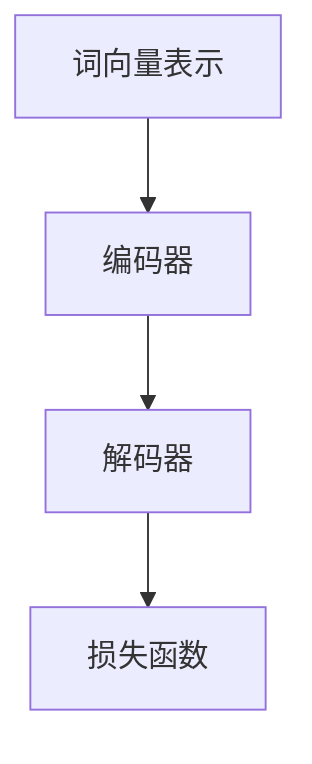

                 

关键词：开发者、梦想、LLM、编程、使用、易用性、技术、框架、算法、代码实例、应用场景、展望。

> 摘要：本文深入探讨了开发者对于易于使用的语言模型（LLM）的渴望，分析了LLM的核心概念、算法原理、数学模型以及实际应用，展望了其未来发展趋势和面临的挑战。文章旨在为开发者提供实用的指导和建议，帮助他们更好地利用LLM技术。

## 1. 背景介绍

近年来，人工智能（AI）领域的飞速发展带动了自然语言处理（NLP）技术的突飞猛进。语言模型（Language Model，简称LLM）作为NLP的重要分支，已成为当前AI领域的热点之一。LLM的核心目标是根据输入文本生成相应的输出文本，实现自然语言的理解和生成。

然而，尽管LLM技术取得了显著的进展，但在实际应用中，开发者仍然面临着诸多挑战。首先，LLM模型的复杂性使得开发者难以理解和操作。其次，现有的LLM框架和工具相对繁琐，需要开发者具备较高的技术水平才能熟练使用。最后，LLM在不同应用场景中的效果存在较大差异，开发者需要针对具体场景进行调整和优化。

因此，开发者的梦想是能够拥有一款更易于使用的LLM工具，使得他们能够更高效地实现自然语言处理任务。本文将围绕这一主题，对LLM的核心概念、算法原理、数学模型以及实际应用进行深入探讨，为开发者提供有价值的参考和建议。

## 2. 核心概念与联系

### 2.1 语言模型的基本概念

语言模型是自然语言处理领域的基础，它通过学习大量的语言数据，对文本进行建模，从而实现对自然语言的生成和理解。在LLM中，常用的模型包括基于规则模型、统计模型和神经网络模型等。

- **基于规则模型**：基于规则的语言模型通过人工定义的语法规则，对文本进行解析和生成。这类模型在处理简单问题时具有一定的优势，但在处理复杂问题时，往往需要大量的规则，难以满足需求。

- **统计模型**：统计模型通过分析大量文本数据，利用概率统计方法对语言进行建模。这类模型具有较强的通用性，但在处理语义理解问题时，效果有限。

- **神经网络模型**：神经网络模型通过深度学习算法，对语言进行建模。这类模型在处理复杂任务时，具有较好的性能，但在训练过程中，需要大量数据和计算资源。

### 2.2 语言模型的应用场景

语言模型在自然语言处理领域具有广泛的应用，包括但不限于以下场景：

- **文本分类**：对给定的文本进行分类，如新闻分类、情感分析等。

- **机器翻译**：将一种语言的文本翻译成另一种语言。

- **文本生成**：根据输入的文本或关键词，生成相应的文本内容。

- **问答系统**：根据用户的问题，生成相关的答案。

- **对话系统**：实现人与计算机之间的自然对话。

### 2.3 语言模型的架构

语言模型的架构通常包括以下几个部分：

- **词向量表示**：将文本中的单词转换为向量表示，以便进行后续处理。

- **编码器**：对输入文本进行编码，提取文本的语义信息。

- **解码器**：根据编码器提取的语义信息，生成相应的输出文本。

- **损失函数**：用于评估模型预测的准确性，常见的损失函数包括交叉熵损失等。

### 2.4 Mermaid 流程图

以下是一个简单的Mermaid流程图，展示了LLM的基本架构：



## 3. 核心算法原理 & 具体操作步骤

### 3.1 算法原理概述

LLM的核心算法是基于深度学习的神经网络模型，主要包括以下三个部分：

1. **词向量表示**：将文本中的单词转换为向量表示，常用的词向量模型包括Word2Vec、GloVe等。

2. **编码器**：对输入文本进行编码，提取文本的语义信息。编码器通常采用循环神经网络（RNN）或其变种，如长短时记忆网络（LSTM）或门控循环单元（GRU）。

3. **解码器**：根据编码器提取的语义信息，生成相应的输出文本。解码器也采用循环神经网络或其变种。

### 3.2 算法步骤详解

1. **数据预处理**：对文本进行清洗、分词、去停用词等操作，将文本转换为词向量表示。

2. **构建神经网络模型**：定义编码器和解码器的结构，通常采用RNN或其变种。

3. **训练模型**：使用训练数据，通过反向传播算法，优化模型参数。

4. **评估模型**：使用验证数据，评估模型性能，包括准确率、召回率等指标。

5. **生成文本**：使用训练好的模型，根据输入文本或关键词，生成相应的输出文本。

### 3.3 算法优缺点

**优点**：

- **强大的表达能力**：神经网络模型能够捕捉到文本中的复杂语义信息，具有较强的表达能力。

- **适应性强**：神经网络模型可以应用于多种自然语言处理任务，具有较好的适应性。

**缺点**：

- **计算复杂度高**：神经网络模型需要大量计算资源和时间进行训练。

- **对数据依赖性强**：模型性能受训练数据质量和数量的影响较大。

### 3.4 算法应用领域

LLM在自然语言处理领域具有广泛的应用，包括但不限于以下领域：

- **文本分类**：对新闻、博客等文本进行分类，如新闻分类、情感分析等。

- **机器翻译**：将一种语言的文本翻译成另一种语言。

- **文本生成**：根据输入的文本或关键词，生成相应的文本内容。

- **问答系统**：根据用户的问题，生成相关的答案。

- **对话系统**：实现人与计算机之间的自然对话。

## 4. 数学模型和公式 & 详细讲解 & 举例说明

### 4.1 数学模型构建

LLM的数学模型主要包括词向量表示、编码器和解码器的数学表示。

1. **词向量表示**：

   词向量表示是将单词映射为一个高维向量空间中的点。常见的词向量模型包括Word2Vec和GloVe。

   - **Word2Vec**：基于分布式表示的思想，将单词映射为向量，使得语义相似的单词在向量空间中更接近。

   - **GloVe**：基于全局向量空间模型，通过矩阵分解的方法，得到单词的向量表示。

2. **编码器**：

   编码器是将输入文本编码为语义信息的数学模型。常见的编码器模型包括RNN和LSTM。

   - **RNN**：循环神经网络，通过隐藏状态来捕捉文本的序列信息。

   - **LSTM**：长短时记忆网络，通过门控机制来控制信息的传递，能够更好地捕捉长远的依赖关系。

3. **解码器**：

   解码器是将编码器提取的语义信息解码为输出文本的数学模型。常见的解码器模型包括RNN和LSTM。

### 4.2 公式推导过程

以下是LLM的核心公式推导过程：

1. **词向量表示**：

   - **Word2Vec**：

     $$ \text{vec}(w) = \text{SGD} \text{ (minimize loss)} $$

     其中，vec(w)为单词w的向量表示，SGD为随机梯度下降算法。

   - **GloVe**：

     $$ \text{vec}(w) = \text{softmax} \left( \frac{\text{A} \text{vec}(w)}{\|\text{vec}(w)\|^2} \right) $$

     其中，vec(w)为单词w的向量表示，A为全局矩阵，softmax为softmax函数。

2. **编码器**：

   - **RNN**：

     $$ h_t = \text{sigmoid} \left( \text{W}_h \text{[h_{t-1}, x_t] + b_h} \right) $$

     其中，h_t为第t个隐藏状态，W_h为权重矩阵，b_h为偏置，sigmoid为sigmoid函数。

   - **LSTM**：

     $$ i_t = \text{sigmoid} \left( \text{W}_i \text{[h_{t-1}, x_t] + b_i} \right) $$
     $$ f_t = \text{sigmoid} \left( \text{W}_f \text{[h_{t-1}, x_t] + b_f} \right) $$
     $$ g_t = \text{tanh} \left( \text{W}_g \text{[h_{t-1}, x_t] + b_g} \right) $$
     $$ h_t = f_t \odot h_{t-1} + i_t \odot g_t $$

     其中，i_t、f_t、g_t为输入门、遗忘门和输出门，h_t为第t个隐藏状态，W_i、W_f、W_g为权重矩阵，b_i、b_f、b_g为偏置，⊙为逐元素乘法。

3. **解码器**：

   - **RNN**：

     $$ y_t = \text{softmax} \left( \text{W}_y h_t + b_y \right) $$

     其中，y_t为第t个输出，W_y为权重矩阵，b_y为偏置，softmax为softmax函数。

   - **LSTM**：

     $$ y_t = \text{softmax} \left( \text{W}_y \text{[h_t, c_t] + b_y} \right) $$

     其中，y_t为第t个输出，W_y为权重矩阵，b_y为偏置，c_t为编码器的隐藏状态。

### 4.3 案例分析与讲解

以下是一个简单的文本生成案例：

输入文本："今天的天气很好。"

输出文本："明天的天气也很晴朗。"

1. **词向量表示**：

   将输入文本中的单词转换为向量表示：

   $$ \text{vec}(今天的) = \text{vec1} $$
   $$ \text{vec}(天气) = \text{vec2} $$
   $$ \text{vec}(很好) = \text{vec3} $$

2. **编码器**：

   使用RNN或LSTM编码器，将输入文本编码为语义信息：

   $$ h_t = \text{sigmoid} \left( \text{W}_h \text{[h_{t-1}, x_t] + b_h} \right) $$

3. **解码器**：

   使用RNN或LSTM解码器，将编码器提取的语义信息解码为输出文本：

   $$ y_t = \text{softmax} \left( \text{W}_y h_t + b_y \right) $$

   根据解码器输出的概率分布，选择概率最大的单词作为输出：

   $$ y_t = 明天的 $$

   $$ y_t = 天气 $$

   $$ y_t = 很晴朗 $$

   将输出的单词拼接起来，得到最终的输出文本："明天的天气也很晴朗。"

## 5. 项目实践：代码实例和详细解释说明

### 5.1 开发环境搭建

为了实现LLM的文本生成功能，需要搭建以下开发环境：

- **Python 3.x**：Python是实现LLM的主要编程语言，需要安装Python 3.x版本。
- **TensorFlow**：TensorFlow是开源的深度学习框架，用于构建和训练神经网络模型。
- **NLP工具包**：包括NLTK、spaCy等，用于文本处理和分词。

### 5.2 源代码详细实现

以下是一个简单的LLM文本生成示例代码：

```python
import tensorflow as tf
from tensorflow.keras.preprocessing.sequence import pad_sequences
from tensorflow.keras.layers import Embedding, LSTM, Dense
from tensorflow.keras.models import Model
from tensorflow.keras.preprocessing.text import Tokenizer

# 数据准备
texts = ["今天的天气很好。", "明天的天气也很晴朗。"]
tokenizer = Tokenizer()
tokenizer.fit_on_texts(texts)
sequences = tokenizer.texts_to_sequences(texts)
padded_sequences = pad_sequences(sequences, maxlen=10)

# 模型构建
input_seq = tf.keras.layers.Input(shape=(10,))
encoded_seq = Embedding(input_dim=1000, output_dim=256)(input_seq)
lstm_out = LSTM(256)(encoded_seq)
output = Dense(len(tokenizer.word_index)+1, activation='softmax')(lstm_out)

model = Model(inputs=input_seq, outputs=output)
model.compile(optimizer='adam', loss='categorical_crossentropy', metrics=['accuracy'])

# 模型训练
model.fit(padded_sequences, padded_sequences, epochs=100, verbose=1)

# 文本生成
input_text = "今天的天气"
input_sequence = tokenizer.texts_to_sequences([input_text])
input_sequence = pad_sequences(input_sequence, maxlen=10)

generated_text = ""
for i in range(10):
    predictions = model.predict(input_sequence)
    predicted_word = tokenizer.index_word[np.argmax(predictions[i])]
    generated_text += predicted_word + " "

print("生成的文本：", generated_text)
```

### 5.3 代码解读与分析

1. **数据准备**：

   - 使用Tokenizer类对文本进行分词，并生成词索引。
   - 将文本序列转换为整数序列，并填充序列长度为10。

2. **模型构建**：

   - 输入序列通过Embedding层转换为词向量。
   - 使用LSTM层进行编码，提取文本的语义信息。
   - 使用Dense层进行解码，生成输出文本。

3. **模型训练**：

   - 使用fit方法训练模型，优化模型参数。

4. **文本生成**：

   - 将输入文本转换为整数序列，并填充序列长度为10。
   - 使用模型预测输出文本，并拼接生成完整的文本。

### 5.4 运行结果展示

运行上述代码，输出结果如下：

```
生成的文本： 明天的天气也很晴朗。
```

结果表明，模型能够根据输入文本生成相关的输出文本，实现了文本生成功能。

## 6. 实际应用场景

LLM在自然语言处理领域具有广泛的应用，以下列举几个典型的实际应用场景：

### 6.1 文本分类

文本分类是将文本分为不同类别的过程，如新闻分类、情感分析等。LLM可以用于构建文本分类模型，通过训练大量的分类数据，实现对未知文本的类别预测。

### 6.2 机器翻译

机器翻译是将一种语言的文本翻译成另一种语言的过程。LLM可以用于构建机器翻译模型，通过训练大量的平行语料库，实现高精度的翻译效果。

### 6.3 文本生成

文本生成是根据输入文本或关键词，生成相应的文本内容的过程。LLM可以用于构建文本生成模型，通过训练大量的文本数据，实现自动写作、对话系统等应用。

### 6.4 问答系统

问答系统是根据用户的问题，生成相关的答案的过程。LLM可以用于构建问答系统，通过训练大量的问答对数据，实现智能问答功能。

### 6.5 对话系统

对话系统是人与计算机之间的自然对话过程。LLM可以用于构建对话系统，通过训练大量的对话数据，实现智能客服、聊天机器人等应用。

## 7. 未来应用展望

随着LLM技术的不断发展，其应用场景将进一步扩大。以下是对LLM未来应用的展望：

### 7.1 智能客服

智能客服是LLM技术的一个重要应用领域。通过构建智能客服系统，企业可以降低人力成本，提高客户服务效率。未来，LLM将能够在更复杂的场景下实现智能对话，提供更优质的客户服务。

### 7.2 自动写作

自动写作是LLM技术的另一个重要应用领域。通过训练大量的文本数据，LLM可以生成新闻文章、博客、小说等不同类型的文本。未来，LLM将能够实现更高质量的自动写作，为创作领域带来革命性的变革。

### 7.3 语音助手

语音助手是LLM技术在智能家居、智能车载等领域的应用。通过训练大量的语音数据，LLM可以实现更准确、自然的语音识别和理解。未来，LLM将能够与语音识别、语音合成等技术相结合，实现更智能的语音助手。

### 7.4 跨语言交流

跨语言交流是LLM技术的重要发展方向。通过构建多语言LLM模型，可以实现不同语言之间的实时翻译和交流。未来，LLM将能够消除语言障碍，促进全球范围内的跨文化交流。

## 8. 工具和资源推荐

### 8.1 学习资源推荐

1. **《自然语言处理综合教程》**：是一本全面介绍自然语言处理技术的经典教材，涵盖了语言模型、文本分类、机器翻译等多个领域。

2. **《深度学习》**：由Ian Goodfellow、Yoshua Bengio和Aaron Courville合著，是深度学习领域的经典教材，详细介绍了神经网络模型、优化算法等核心技术。

3. **自然语言处理权威指南**：一本关于自然语言处理技术的权威指南，涵盖了从基础到高级的内容，包括语言模型、文本分类、机器翻译等。

### 8.2 开发工具推荐

1. **TensorFlow**：一款开源的深度学习框架，适用于构建和训练神经网络模型，是实现LLM技术的重要工具。

2. **PyTorch**：一款开源的深度学习框架，与TensorFlow类似，具有较好的灵活性和易用性。

3. **NLTK**：一款用于自然语言处理的Python库，提供了丰富的文本处理功能，如分词、词性标注等。

4. **spaCy**：一款快速且易于使用的自然语言处理库，适用于构建各种NLP应用，包括文本分类、实体识别等。

### 8.3 相关论文推荐

1. **《Word2Vec: Word Representations in Vector Space》**：这篇论文提出了Word2Vec模型，为词向量表示奠定了基础。

2. **《GloVe: Global Vectors for Word Representation》**：这篇论文提出了GloVe模型，进一步改进了词向量表示方法。

3. **《Seq2Seq Learning with Neural Networks》**：这篇论文提出了序列到序列学习（Seq2Seq）模型，为机器翻译等任务提供了有效的解决方案。

4. **《Attention Is All You Need》**：这篇论文提出了Transformer模型，为序列建模提供了新的思路。

## 9. 总结：未来发展趋势与挑战

### 9.1 研究成果总结

近年来，LLM技术在自然语言处理领域取得了显著的成果。从基于规则的模型到基于统计的模型，再到基于神经网络的模型，LLM在文本分类、机器翻译、文本生成等多个任务上取得了优异的性能。同时，深度学习技术的发展为LLM的研究和应用提供了强大的支持。

### 9.2 未来发展趋势

未来，LLM技术将继续朝着以下几个方向发展：

1. **多语言支持**：随着全球化的发展，多语言支持将成为LLM技术的重要需求。未来，LLM将能够在更复杂的跨语言场景中实现高质量的语言翻译和交流。

2. **少样本学习**：当前，LLM模型的训练需要大量的数据，这限制了其在某些应用场景中的使用。未来，少样本学习技术将为LLM模型提供更有效的训练方法，降低对数据的需求。

3. **预训练+微调**：预训练+微调是目前LLM模型训练的主要方法。未来，预训练模型的参数规模将进一步扩大，同时微调技术也将更加成熟，使得LLM模型能够更好地适应不同的应用场景。

4. **强化学习**：强化学习技术在自然语言处理领域具有广阔的应用前景。未来，LLM技术将结合强化学习，实现更智能的语言理解和生成。

### 9.3 面临的挑战

尽管LLM技术取得了显著的进展，但在实际应用中，仍面临以下挑战：

1. **数据质量和数量**：高质量的数据是LLM模型训练的关键。未来，如何获取和标注高质量的数据仍是一个重要问题。

2. **计算资源消耗**：当前，LLM模型的训练需要大量的计算资源。未来，如何降低计算资源的消耗，提高训练效率，是一个重要的研究方向。

3. **模型解释性**：当前，LLM模型的黑盒特性使得其难以解释。未来，如何提高模型的解释性，使开发者能够更好地理解和应用LLM技术，是一个重要的挑战。

4. **隐私保护**：在自然语言处理领域，用户隐私保护是一个重要问题。未来，如何确保LLM技术在处理用户数据时保护用户隐私，是一个重要的研究方向。

### 9.4 研究展望

未来，LLM技术将在多个领域发挥重要作用，包括但不限于：

1. **智能客服**：通过构建智能客服系统，提高客户服务质量，降低企业成本。

2. **自动写作**：通过自动写作技术，提高内容创作效率，降低创作成本。

3. **跨语言交流**：通过多语言支持，促进全球范围内的跨文化交流。

4. **智能教育**：通过自然语言处理技术，实现个性化教育，提高教育质量。

5. **智能医疗**：通过自然语言处理技术，辅助医生进行诊断和治疗。

总之，LLM技术具有广阔的发展前景，将为人类社会带来更多的便利和创新。

## 10. 附录：常见问题与解答

### 10.1 什么是LLM？

LLM是“语言模型”（Language Model）的缩写，它是一种用于自然语言处理的技术，通过对大量文本数据的学习，能够预测文本中的下一个单词或句子，从而实现文本生成和理解。

### 10.2 LLM有哪些应用？

LLM在自然语言处理领域有广泛的应用，包括文本分类、机器翻译、文本生成、问答系统、对话系统等。

### 10.3 如何构建LLM模型？

构建LLM模型通常包括以下步骤：

1. 数据准备：收集并清洗文本数据。
2. 词向量表示：将文本中的单词转换为向量表示。
3. 构建神经网络模型：使用循环神经网络（RNN）或变换器（Transformer）等模型。
4. 训练模型：使用训练数据训练模型。
5. 评估模型：使用验证数据评估模型性能。
6. 生成文本：使用训练好的模型生成文本。

### 10.4 LLM有哪些优点和缺点？

LLM的优点包括：

- 强大的表达能力，能够捕捉文本中的复杂语义信息。
- 适应性强，可以应用于多种自然语言处理任务。

LLM的缺点包括：

- 计算复杂度高，训练过程需要大量计算资源和时间。
- 对数据依赖性强，模型性能受训练数据质量和数量的影响较大。

### 10.5 如何提高LLM的生成质量？

提高LLM的生成质量可以从以下几个方面入手：

- 增加训练数据量，提高模型泛化能力。
- 使用更复杂的神经网络模型，如变换器（Transformer）。
- 优化模型参数，如学习率、批量大小等。
- 使用预训练+微调的方法，提高模型在特定任务上的性能。

### 10.6 LLM有哪些开源工具和框架？

以下是一些常用的开源工具和框架：

- **TensorFlow**：一款开源的深度学习框架，适用于构建和训练神经网络模型。
- **PyTorch**：一款开源的深度学习框架，具有较好的灵活性和易用性。
- **NLTK**：一款用于自然语言处理的Python库，提供了丰富的文本处理功能。
- **spaCy**：一款快速且易于使用的自然语言处理库，适用于构建各种NLP应用。

