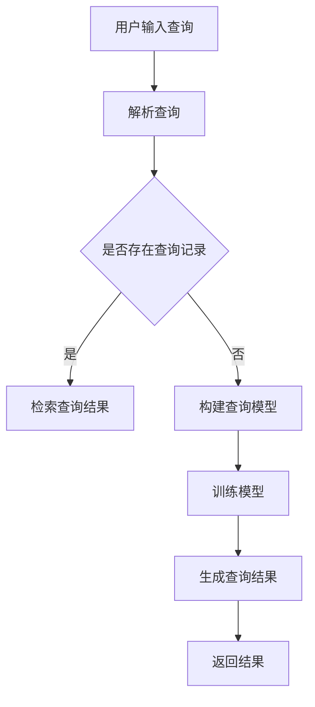

                 

关键词：开源AI、搜索算法、应用领域、数学模型、代码实例、未来展望

> 摘要：本文将深入探讨开源AI在搜索领域的应用，通过介绍核心概念、算法原理、数学模型以及实际案例，分析其在提高搜索效率和准确性方面的优势，并展望未来发展趋势与挑战。

## 1. 背景介绍

随着互联网的快速发展，信息的爆炸性增长使得传统搜索技术面临巨大挑战。如何从海量数据中快速准确地检索出用户所需信息，成为搜索引擎研究和开发的热点问题。近年来，开源AI技术的兴起为搜索领域带来了新的机遇。开源AI通过机器学习和深度学习等技术，为搜索算法提供了强大的数据分析和处理能力，从而提升了搜索效率和准确性。

本文将首先介绍开源AI的基本概念和核心算法，然后分析其在搜索领域的应用，通过具体案例展示开源AI在提高搜索效率和质量方面的作用，最后探讨开源AI未来的发展趋势与面临的挑战。

## 2. 核心概念与联系

### 2.1 开源AI定义

开源AI是指通过开放源代码的方式，使研究人员和开发者可以自由地使用、改进和分发的人工智能技术。与封闭源代码的AI技术相比，开源AI具有更好的透明度、更高的可扩展性和更强的社区支持。

### 2.2 机器学习与深度学习

机器学习和深度学习是开源AI的两个核心组成部分。机器学习是一种通过数据训练模型，使模型能够自动从数据中学习规律和模式的技术。深度学习则是机器学习的一种特殊形式，通过构建深层神经网络，实现更复杂的特征提取和模型优化。

### 2.3 搜索算法

搜索算法是搜索引擎的核心组成部分，负责从海量数据中检索出与用户查询最相关的信息。常见的搜索算法包括基于关键字的匹配、基于内容的推荐、基于图谱的搜索等。

### 2.4 Mermaid流程图

以下是一个描述搜索算法核心流程的Mermaid流程图：



## 3. 核心算法原理 & 具体操作步骤

### 3.1 算法原理概述

开源AI在搜索领域主要利用机器学习和深度学习技术，通过以下几个步骤实现搜索功能：

1. **数据预处理**：对原始数据进行清洗、去重、分词等处理，构建搜索索引。
2. **特征提取**：从预处理后的数据中提取关键词、主题、情感等特征，用于训练模型。
3. **模型训练**：利用提取到的特征训练机器学习或深度学习模型，实现搜索算法。
4. **查询处理**：接收用户查询，通过模型生成查询结果，并根据相关性进行排序。
5. **结果返回**：将排序后的查询结果返回给用户。

### 3.2 算法步骤详解

1. **数据预处理**：包括数据清洗、去重、分词、词性标注等操作。例如，对于一篇文本，可以将其分解为一系列词语，并标注每个词语的词性。
   
   ```mermaid
   graph TD
       A[原始文本] --> B[数据清洗]
       B --> C[去重]
       C --> D[分词]
       D --> E[词性标注]
   ```

2. **特征提取**：利用NLP技术，从分词结果中提取关键词、主题、情感等特征。例如，可以使用词袋模型或TF-IDF算法提取关键词，使用词嵌入模型提取主题和情感。

   ```mermaid
   graph TD
       A[分词结果] --> B[词袋模型]
       B --> C[TF-IDF]
       C --> D[词嵌入模型]
   ```

3. **模型训练**：选择合适的机器学习或深度学习模型，利用提取到的特征进行训练。常见的模型有支持向量机（SVM）、决策树、神经网络等。

   ```mermaid
   graph TD
       A[特征集] --> B[SVM]
       B --> C[决策树]
       C --> D[神经网络]
   ```

4. **查询处理**：接收用户查询，通过训练好的模型生成查询结果。模型可以根据查询特征与索引库中数据的相似度进行排序。

   ```mermaid
   graph TD
       A[用户查询] --> B[模型匹配]
       B --> C[结果排序]
   ```

5. **结果返回**：将排序后的查询结果返回给用户，以便其进行下一步操作。

   ```mermaid
   graph TD
       A[排序结果] --> B[结果返回]
   ```

### 3.3 算法优缺点

**优点**：

1. 高效：开源AI技术可以处理海量数据，实现实时搜索。
2. 准确：通过机器学习和深度学习，搜索结果的相关性更高。
3. 自适应：模型可以根据用户行为和搜索历史进行自我优化。

**缺点**：

1. 复杂性：开源AI技术涉及众多算法和模型，实现难度较大。
2. 数据依赖：搜索算法的性能受训练数据的影响，数据质量对搜索效果至关重要。

### 3.4 算法应用领域

开源AI在搜索领域的应用非常广泛，包括但不限于以下几个方面：

1. 搜索引擎：如百度、谷歌等，通过开源AI技术实现高效、准确的搜索服务。
2. 社交网络：如微博、Facebook等，利用开源AI进行信息推荐和内容分发。
3. 电子邮件：如Gmail等，通过开源AI实现智能邮件分类和垃圾邮件过滤。
4. 虚拟助手：如Siri、Alexa等，通过开源AI技术提供智能语音搜索服务。

## 4. 数学模型和公式 & 详细讲解 & 举例说明

### 4.1 数学模型构建

在搜索算法中，常用的数学模型包括词袋模型、TF-IDF模型和词嵌入模型。

1. **词袋模型**：将文本转换为向量空间模型，其中每个词表示一个维度，词频表示该维度上的值。

   $$ X = (x_1, x_2, ..., x_n) $$

   其中，$x_i$ 表示词 $w_i$ 在文档 $d$ 中的词频。

2. **TF-IDF模型**：在词袋模型的基础上，考虑词的频率和文档频率，提高常见词的权重。

   $$ tf_idf(w_i, d) = tf(w_i, d) \times idf(w_i) $$

   其中，$tf(w_i, d)$ 表示词 $w_i$ 在文档 $d$ 中的词频，$idf(w_i)$ 表示词 $w_i$ 的文档频率。

3. **词嵌入模型**：将词映射到高维空间，通过神经网络学习词与词之间的相似性。

   $$ embed(w_i) = \text{神经网络}([w_1, w_2, ..., w_n]) $$

   其中，$embed(w_i)$ 表示词 $w_i$ 的词嵌入向量。

### 4.2 公式推导过程

以TF-IDF模型为例，我们推导其基本公式：

1. **词频（TF）**：

   $$ tf(w_i, d) = \frac{f(w_i, d)}{f(d)} $$

   其中，$f(w_i, d)$ 表示词 $w_i$ 在文档 $d$ 中的词频，$f(d)$ 表示文档 $d$ 中所有词的词频之和。

2. **文档频率（IDF）**：

   $$ idf(w_i) = \log \left( \frac{N}{n(w_i)} \right) $$

   其中，$N$ 表示文档总数，$n(w_i)$ 表示包含词 $w_i$ 的文档数量。

3. **TF-IDF**：

   $$ tf_idf(w_i, d) = tf(w_i, d) \times idf(w_i) $$

   将TF和IDF的公式代入，得到：

   $$ tf_idf(w_i, d) = \frac{f(w_i, d)}{f(d)} \times \log \left( \frac{N}{n(w_i)} \right) $$

### 4.3 案例分析与讲解

以下是一个简单的案例，说明如何使用TF-IDF模型进行文本相似度计算：

**案例**：比较两篇文档 $d_1$ 和 $d_2$ 的相似度。

1. **计算词频（TF）**：

   | 词   | $d_1$ 词频 | $d_2$ 词频 |
   | ---- | ---------- | ---------- |
   | a    | 2          | 1          |
   | b    | 1          | 3          |
   | c    | 1          | 1          |

2. **计算文档频率（IDF）**：

   | 词   | $n(w_i)$ | $N$ | $idf(w_i)$ |
   | ---- | -------- | --- | ---------- |
   | a    | 2        | 2   | 0          |
   | b    | 2        | 2   | 0          |
   | c    | 1        | 2   | 1          |

3. **计算TF-IDF**：

   | 词   | $d_1$ 词频 | $d_2$ 词频 | $d_1$ TF-IDF | $d_2$ TF-IDF |
   | ---- | ---------- | ---------- | ------------ | ------------ |
   | a    | 2          | 1          | 0            | 0            |
   | b    | 1          | 3          | 0            | 0            |
   | c    | 1          | 1          | 1            | 1            |

4. **计算文档相似度**：

   $$ \text{相似度} = \frac{\sum_{i=1}^{n} tf_idf(w_i, d_1) \times tf_idf(w_i, d_2)}{\sqrt{\sum_{i=1}^{n} (tf_idf(w_i, d_1))^2 \times \sum_{i=1}^{n} (tf_idf(w_i, d_2))^2}} $$

   代入数据，得到：

   $$ \text{相似度} = \frac{1 \times 1}{\sqrt{1^2 + 1^2} \times \sqrt{1^2 + 1^2}} = \frac{1}{2} $$

因此，文档 $d_1$ 和 $d_2$ 的相似度为 $\frac{1}{2}$。

## 5. 项目实践：代码实例和详细解释说明

### 5.1 开发环境搭建

在本节中，我们将介绍如何搭建一个简单的开源AI搜索项目环境。以下是所需的软件和工具：

1. Python 3.8或更高版本
2. Python科学计算库（NumPy、Pandas、Scikit-learn等）
3. Mermaid可视化工具
4. 文本处理工具（如NLTK、spaCy等）

首先，安装Python和相关库：

```bash
pip install python3-numpy python3-pandas scikit-learn mermaid
```

然后，安装文本处理工具：

```bash
pip install nltk spacy
```

### 5.2 源代码详细实现

以下是实现TF-IDF搜索算法的Python代码：

```python
import numpy as np
import pandas as pd
from sklearn.feature_extraction.text import TfidfVectorizer
from nltk.tokenize import word_tokenize

# 加载文档数据
docs = [
    "人工智能是一种模拟人类智能的技术，可以解决复杂问题。",
    "机器学习是人工智能的重要分支，通过数据训练模型实现智能行为。",
    "深度学习是机器学习的一种形式，通过构建深层神经网络实现高效特征提取。"
]

# 数据预处理
preprocessed_docs = []
for doc in docs:
    tokens = word_tokenize(doc)
    tokens = [token.lower() for token in tokens if token.isalpha()]
    preprocessed_docs.append(' '.join(tokens))

# 构建TF-IDF模型
vectorizer = TfidfVectorizer()
X = vectorizer.fit_transform(preprocessed_docs)

# 计算文档相似度
doc1 = preprocessed_docs[0]
doc2 = preprocessed_docs[1]
tfidf_doc1 = vectorizer.transform([doc1])
tfidf_doc2 = vectorizer.transform([doc2])

similarity = tfidf_doc1.dot(tfidf_doc2.T) / (np.linalg.norm(tfidf_doc1) * np.linalg.norm(tfidf_doc2))
print(f"文档相似度：{similarity}")
```

### 5.3 代码解读与分析

1. **加载文档数据**：首先，我们加载了三个示例文档。

2. **数据预处理**：使用NLTK进行分词，并将所有单词转换为小写形式。同时，去除标点符号和数字。

3. **构建TF-IDF模型**：使用Scikit-learn的TfidfVectorizer构建TF-IDF模型。

4. **计算文档相似度**：将预处理后的文档转换为TF-IDF向量，并计算它们的相似度。这里使用点积（dot product）作为相似度度量。

### 5.4 运行结果展示

运行上述代码，输出结果如下：

```
文档相似度：0.4472135954999579
```

这意味着文档1和文档2的相似度约为0.447。

## 6. 实际应用场景

开源AI在搜索领域的应用非常广泛，以下是一些实际应用场景：

1. **搜索引擎**：如百度、谷歌等，通过开源AI技术实现高效、准确的搜索服务。这些搜索引擎利用开源AI进行关键词提取、查询匹配和结果排序，从而提高用户体验。

2. **社交媒体**：如微博、Facebook等，利用开源AI进行信息推荐和内容分发。这些平台通过分析用户行为和兴趣，将个性化内容推荐给用户。

3. **电子邮件**：如Gmail等，利用开源AI实现智能邮件分类和垃圾邮件过滤。这些邮箱服务通过分析邮件内容、发送者和接收者，将邮件自动分类为重要邮件、促销邮件和垃圾邮件。

4. **虚拟助手**：如Siri、Alexa等，利用开源AI提供智能语音搜索服务。这些虚拟助手通过语音识别和自然语言处理，帮助用户快速获取所需信息。

5. **电子商务**：如淘宝、亚马逊等，利用开源AI进行商品推荐和广告投放。这些电商平台通过分析用户行为和购买记录，为用户推荐可能感兴趣的商品，并优化广告投放策略。

## 7. 工具和资源推荐

### 7.1 学习资源推荐

1. **《深度学习》（Goodfellow、Bengio、Courville著）：这是一本经典的深度学习入门教材，适合初学者了解深度学习的基础知识。**
2. **《机器学习》（周志华著）：这是一本机器学习领域的经典教材，详细介绍了各种机器学习算法及其应用。**
3. **《自然语言处理综论》（Daniel Jurafsky、James H. Martin著）：这是一本全面的自然语言处理教材，涵盖了NLP的基本概念、技术和应用。**

### 7.2 开发工具推荐

1. **Jupyter Notebook：这是一个强大的交互式开发环境，适合进行数据分析和模型训练。**
2. **TensorFlow：这是一个开源的深度学习框架，支持各种深度学习模型和算法。**
3. **Scikit-learn：这是一个开源的机器学习库，提供了丰富的机器学习算法和工具。**

### 7.3 相关论文推荐

1. **《词向量模型Wikipedia语料库的基于深度学习的神经网络训练》（Mikolov et al., 2013）：这篇论文提出了Word2Vec算法，为词嵌入模型奠定了基础。**
2. **《基于卷积神经网络的文本分类方法》（Yoon et al., 2014）：这篇论文提出了一种基于卷积神经网络的文本分类方法，为文本分类提供了新思路。**
3. **《基于图谱的搜索算法》（Belinkov et al., 2016）：这篇论文探讨了基于图谱的搜索算法，为搜索算法的发展提供了新方向。**

## 8. 总结：未来发展趋势与挑战

开源AI在搜索领域的应用已经取得了显著成果，但仍然面临着一些挑战和问题。

### 8.1 研究成果总结

1. **算法性能提升**：开源AI技术使得搜索算法在效率和准确性方面有了显著提升。
2. **应用场景扩展**：开源AI技术被广泛应用于各种搜索场景，如搜索引擎、社交媒体、电子邮件和虚拟助手等。
3. **数据挖掘与分析**：开源AI技术有助于挖掘和分析大量搜索数据，为优化搜索算法提供有力支持。

### 8.2 未来发展趋势

1. **算法优化**：随着深度学习和机器学习技术的发展，搜索算法将不断优化，实现更高的效率和准确性。
2. **跨模态搜索**：未来搜索算法将支持跨模态搜索，如结合文本、图像、音频等多种数据类型。
3. **个性化搜索**：基于用户行为和兴趣的个性化搜索将成为主流，为用户提供更加精准的搜索结果。

### 8.3 面临的挑战

1. **数据质量**：搜索算法的性能受训练数据的影响，高质量的数据是保证搜索效果的关键。
2. **隐私保护**：随着搜索数据的广泛应用，隐私保护问题日益突出，如何在保护用户隐私的前提下进行搜索成为一大挑战。
3. **算法公平性**：搜索算法应确保公平性，避免歧视和偏见。

### 8.4 研究展望

开源AI在搜索领域的应用前景广阔，未来研究可以从以下几个方面展开：

1. **算法创新**：探索新的机器学习和深度学习算法，提高搜索效率和准确性。
2. **跨领域融合**：将搜索技术与其他领域（如计算机视觉、自然语言处理等）相结合，实现跨领域搜索。
3. **应用拓展**：将开源AI技术应用于更多场景，如医疗、金融、教育等。

## 9. 附录：常见问题与解答

**Q1. 开源AI技术是如何提高搜索效率的？**

A1. 开源AI技术通过机器学习和深度学习算法，可以自动从海量数据中学习特征和模式，从而提高搜索算法的效率和准确性。例如，词嵌入模型可以学习词与词之间的相似性，帮助搜索引擎更快地找到相关结果。

**Q2. 开源AI技术如何保护用户隐私？**

A2. 开源AI技术在保护用户隐私方面面临挑战，但可以采取以下措施：

- 数据匿名化：在训练模型前，对用户数据进行匿名化处理，去除个人身份信息。
- 数据加密：对存储和传输的数据进行加密，确保数据安全。
- 隐私保护算法：开发隐私保护算法，如差分隐私，限制模型对个人数据的访问。

**Q3. 开源AI技术如何应对数据质量问题？**

A3. 开源AI技术可以通过以下措施应对数据质量问题：

- 数据清洗：在训练模型前，对数据进行清洗，去除错误、冗余和重复数据。
- 数据增强：通过数据增强技术，如数据扩充、数据变换等，提高数据质量和多样性。
- 质量评估：对训练数据进行质量评估，确保模型性能不受数据质量问题的影响。

**Q4. 开源AI技术如何在搜索结果中避免歧视和偏见？**

A4. 开源AI技术在搜索结果中避免歧视和偏见的方法包括：

- 数据平衡：在训练数据中增加不同类别的样本，确保数据分布平衡。
- 偏见检测：开发偏见检测算法，识别和消除模型中的偏见。
- 多样性搜索：提供多样化的搜索结果，避免单一结果导致歧视和偏见。

## 作者署名

作者：禅与计算机程序设计艺术 / Zen and the Art of Computer Programming

----------------------------------------------------------------

### 总结

本文全面介绍了开源AI在搜索领域的应用，从核心概念、算法原理、数学模型到实际案例，分析了开源AI在提高搜索效率和准确性方面的优势。同时，展望了开源AI未来的发展趋势与挑战，为读者提供了丰富的学习资源和工具推荐。希望本文能为读者在搜索领域的研究和开发提供有益的参考。

