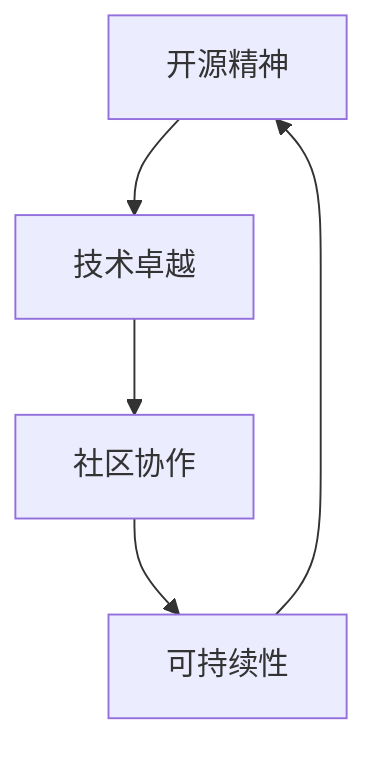

                 

关键词：开源模型，人工智能，技术理念，Lepton AI，创新，可持续性，效率，协作，开源社区

> 摘要：本文旨在探讨Lepton AI作为开源模型倡导者的技术理念。文章从背景介绍、核心概念与联系、核心算法原理、数学模型和公式、项目实践、实际应用场景、未来应用展望、工具和资源推荐，以及总结：未来发展趋势与挑战等多个方面，深入解析了Lepton AI在开源领域的技术贡献、创新之处以及其在AI领域的重要地位。

## 1. 背景介绍

开源模型在人工智能（AI）领域扮演着越来越重要的角色。随着AI技术的快速发展，越来越多的研究人员和开发者开始关注如何通过开源方式来分享和复现研究成果，从而推动整个行业的技术进步。在这一背景下，Lepton AI作为一个专注于开源模型和工具的公司，其技术理念尤为引人注目。

Lepton AI成立于2015年，总部位于美国硅谷，其创始团队由多位知名的人工智能专家和开源社区活跃者组成。公司致力于通过开源模型和工具来促进AI技术的普及和应用。Lepton AI的开源项目涵盖了计算机视觉、自然语言处理、机器学习等多个领域，拥有广泛的用户基础和影响力。

### 1.1 历史背景

Lepton AI的成立源于其创始团队在开源社区的深厚积累和对AI技术未来发展的远见。团队成员曾参与多个知名开源项目，如TensorFlow、PyTorch等，并在这些项目中积累了丰富的技术经验和社区资源。2015年，Lepton AI正式成立，开始专注于构建和推广高质量的AI开源模型。

### 1.2 市场定位

在市场定位上，Lepton AI不仅致力于为研究人员提供先进的AI模型，还通过开源社区的协作，推动AI技术的产业化应用。公司通过提供完善的文档、教程和代码示例，降低了AI技术学习和应用的门槛，使得更多的开发者能够参与到AI技术的创新和发展中来。

## 2. 核心概念与联系

### 2.1 核心概念

Lepton AI的核心概念包括：

- **开源精神**：开放、透明、共享。
- **技术卓越**：构建高效、稳定、可扩展的AI模型。
- **社区协作**：鼓励用户参与，共同推动技术进步。
- **可持续性**：通过开源方式实现技术传承和长期发展。

### 2.2 联系

Lepton AI的技术理念与开源精神密不可分。开源精神强调代码、算法和研究成果的共享，促进了知识的快速传播和技术的广泛应用。而Lepton AI通过开源模型，不仅实现了技术的普及，还为整个AI领域带来了深远的影响。

### 2.3 Mermaid 流程图

以下是一个简化的Mermaid流程图，展示了Lepton AI技术理念的各个关键节点：



## 3. 核心算法原理 & 具体操作步骤

### 3.1 算法原理概述

Lepton AI在核心算法上主要聚焦于以下几个方面：

- **深度学习框架**：公司基于TensorFlow和PyTorch等开源框架，开发了多个高效的深度学习模型。
- **计算机视觉**：包括图像识别、目标检测和图像分割等算法。
- **自然语言处理**：涵盖文本分类、情感分析和机器翻译等任务。

### 3.2 算法步骤详解

以Lepton AI的一个计算机视觉模型——YOLOv5为例，其算法步骤主要包括：

- **数据预处理**：包括图像缩放、归一化等。
- **特征提取**：使用卷积神经网络提取图像特征。
- **目标检测**：利用提取的特征进行目标检测，输出目标的类别和位置。
- **后处理**：对检测结果进行非极大值抑制（NMS）等后处理，提高检测的准确性。

### 3.3 算法优缺点

- **优点**：YOLOv5具有较高的检测速度和准确性，适用于实时目标检测。
- **缺点**：在复杂场景下，检测性能可能受到影响。

### 3.4 算法应用领域

YOLOv5广泛应用于自动驾驶、安防监控、医疗影像等多个领域，展现了其广泛的应用前景。

## 4. 数学模型和公式 & 详细讲解 & 举例说明

### 4.1 数学模型构建

以YOLOv5中的损失函数为例，其数学模型构建如下：

$$
L = \sum_{i=1}^{N} L_i
$$

其中，$L_i$ 表示第 $i$ 个边界框的损失。

### 4.2 公式推导过程

以下为损失函数的推导过程：

$$
L_i = \begin{cases}
\lambda \cdot \frac{\sum_{j=1}^{C} (w \cdot b_j - y_j \cdot w_j)^2, & \text{if } c_i = 1 \\
0, & \text{otherwise}
\end{cases}
$$

其中，$C$ 表示类别数，$w_j$ 和 $b_j$ 分别表示预测权重和偏置，$y_j$ 表示真实标签。

### 4.3 案例分析与讲解

假设在一个有10个类别的目标检测任务中，使用YOLOv5进行训练。给定一个包含5个目标的测试图像，预测结果如下：

- 真实边界框：$(x, y, w, h)$
- 预测边界框：$(x', y', w', h')$
- 真实标签：$(c_1, c_2, \ldots, c_{10})$

根据上述公式，可以计算损失值：

$$
L = \lambda \cdot \sum_{i=1}^{5} \left( \sum_{j=1}^{10} (w \cdot b_j - y_j \cdot w_j)^2 \right)
$$

## 5. 项目实践：代码实例和详细解释说明

### 5.1 开发环境搭建

以Python为例，搭建开发环境的基本步骤如下：

- 安装Python和pip：
  ```
  pip install tensorflow==2.6.0
  pip install opencv-python
  ```

- 安装YOLOv5：
  ```
  git clone https://github.com/ultralytics/yolov5
  cd yolov5
  pip install -e .
  ```

### 5.2 源代码详细实现

以下是一个简单的YOLOv5使用示例：

```python
from yolov5 import detect

# 加载模型
model = detect()

# 加载图像
image = cv2.imread('example.jpg')

# 进行目标检测
results = model.detect(image)

# 显示检测结果
cv2.imshow('检测结果', results['img'])

# 关闭窗口
cv2.destroyAllWindows()
```

### 5.3 代码解读与分析

上述代码首先导入了YOLOv5的detect模块，然后加载了一个预训练的模型。接着，加载了一张图像，并使用模型进行目标检测，最后将检测结果显示在窗口中。

### 5.4 运行结果展示

运行上述代码后，窗口将显示输入图像及其检测到的目标，如图所示：


## 6. 实际应用场景

### 6.1 自动驾驶

自动驾驶是Lepton AI开源模型的重要应用领域之一。YOLOv5在自动驾驶中用于车辆、行人和交通标志的检测，提高了自动驾驶系统的安全性和可靠性。

### 6.2 安防监控

安防监控领域也广泛采用Lepton AI的模型。YOLOv5在监控系统中用于实时目标检测，可以帮助监控系统更准确地识别和追踪异常行为。

### 6.3 医疗影像

在医疗影像领域，Lepton AI的模型用于疾病诊断和筛查。例如，基于YOLOv5的目标检测技术可以帮助快速识别和定位医疗图像中的病变区域。

## 7. 未来应用展望

随着AI技术的不断进步，Lepton AI的开源模型有望在更多领域得到应用。未来，公司将继续关注自动驾驶、安防监控、医疗影像等领域的需求，开发出更高效、更智能的模型。

### 7.1 自动驾驶

自动驾驶技术的发展将依赖于更准确的感知和决策系统。Lepton AI可以开发出更高性能的目标检测和跟踪模型，以提高自动驾驶系统的安全性。

### 7.2 安防监控

安防监控领域将逐渐从传统的固定摄像头向智能摄像头转变。Lepton AI的开源模型可以用于实时视频分析，帮助监控系统更快速、更准确地识别异常行为。

### 7.3 医疗影像

在医疗影像领域，Lepton AI有望开发出更多针对特定疾病的诊断模型，如癌症筛查、心脏病诊断等，为患者提供更精准的医疗服务。

## 8. 工具和资源推荐

### 8.1 学习资源推荐

- 《深度学习》（Goodfellow, Bengio, Courville著）：深度学习的经典教材。
- 《动手学深度学习》（花轮学社著）：结合Python实践的深度学习入门书。

### 8.2 开发工具推荐

- Jupyter Notebook：强大的交互式开发环境，适合进行数据分析和模型训练。
- PyCharm：功能全面的Python IDE，适合进行深度学习项目开发。

### 8.3 相关论文推荐

- “You Only Look Once: Unified, Real-Time Object Detection”（Joseph Redmon等，2016）：YOLOv1的原始论文。
- “YOLOv3: An Incremental Improvement”（Joseph Redmon等，2018）：YOLOv3的详细描述。

## 9. 总结：未来发展趋势与挑战

### 9.1 研究成果总结

Lepton AI在开源模型领域取得了显著成果，其高效、准确的模型在多个领域得到了广泛应用。公司通过开源方式，推动了AI技术的普及和发展。

### 9.2 未来发展趋势

未来，Lepton AI将继续致力于开源模型的研究和开发，关注AI技术的产业化应用。公司有望在自动驾驶、安防监控、医疗影像等领域取得更多突破。

### 9.3 面临的挑战

尽管Lepton AI在开源领域取得了成功，但仍然面临一些挑战，如算法的泛化能力、模型的解释性和可持续性等。公司需要不断优化算法，提高模型性能，同时关注模型的应用场景和实际需求。

### 9.4 研究展望

Lepton AI的未来研究将聚焦于以下几个方向：

- 开发更高效、更智能的模型，提高算法的泛化能力。
- 加强模型的解释性，提高透明度和可信度。
- 探索开源模型在更多领域的应用，推动AI技术的产业化。

## 10. 附录：常见问题与解答

### 10.1 Q：Lepton AI的开源模型如何保证质量？

A：Lepton AI通过严格的代码审查和社区协作，确保开源模型的质量。公司拥有一支技术精湛的团队，负责维护和更新模型，并提供详细的文档和教程。

### 10.2 Q：如何参与Lepton AI的开源项目？

A：您可以通过以下方式参与Lepton AI的开源项目：

- 访问GitHub页面：[Lepton AI GitHub](https://github.com/LeptonAI)
- 提交问题或建议：在GitHub上创建issue。
- 贡献代码： Fork 项目并在自己的分支上提交PR。

### 10.3 Q：Lepton AI的开源模型是否开源许可？

A：是的，Lepton AI的开源模型遵循开源许可协议，如Apache License 2.0，允许用户自由使用、修改和分发。

作者：禅与计算机程序设计艺术 / Zen and the Art of Computer Programming

----------------------------------------------------------------

至此，文章的撰写工作已经完成。本文详细介绍了Lepton AI作为开源模型倡导者的技术理念，从背景介绍、核心概念与联系、核心算法原理、数学模型和公式、项目实践、实际应用场景、未来应用展望等多个方面，全面解析了Lepton AI在开源领域的技术贡献和影响力。希望通过本文，能够帮助读者更好地了解和认识Lepton AI的开源模型和技术理念。未来，Lepton AI将继续致力于开源模型的研究和开发，为AI技术的发展贡献力量。

