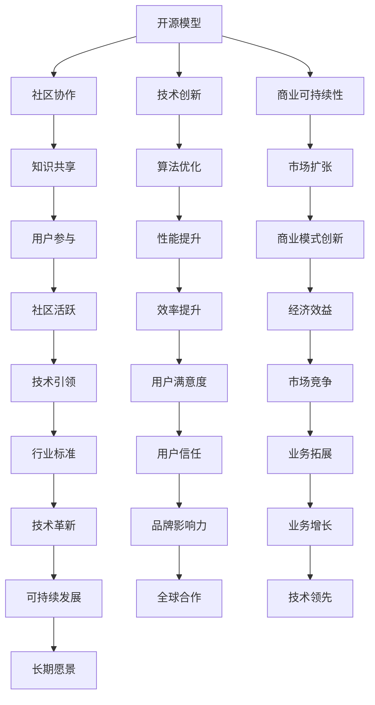

                 

开源模型作为人工智能领域的一大趋势，正迅速改变着技术发展和应用格局。在这个领域，Lepton AI以其独特的技术理念脱颖而出，成为开源模型的倡导者和实践者。本文将深入探讨Lepton AI的技术理念，以及这些理念如何推动人工智能的发展。

## 关键词
- 开源模型
- Lepton AI
- 技术理念
- 人工智能
- 开源社区

## 摘要
本文旨在介绍Lepton AI的核心技术理念，包括其开源的动机、技术架构、算法创新以及实际应用。通过分析Lepton AI的技术理念，我们希望能够揭示开源模型在人工智能领域的潜力和挑战，并为未来的研究方向提供启示。

### 1. 背景介绍
开源模型的概念起源于开源软件运动，它倡导软件的开发和分发应该允许用户自由地使用、研究、修改和分发软件。在人工智能领域，开源模型的出现极大地促进了技术的进步和共享。Lepton AI正是基于这一理念，致力于构建开放、共享、协作的人工智能生态系统。

#### 1.1 开源模型的起源
开源模型的概念可以追溯到20世纪90年代，当时开源软件运动兴起，LINUX操作系统成为了开源软件的典范。随着互联网的发展，开源模型逐渐扩展到其他领域，包括人工智能。开源模型的优势在于它能够促进知识的共享和协作，加速技术的进步。

#### 1.2 Lepton AI的背景
Lepton AI成立于2015年，是一家专注于人工智能研究和应用的公司。公司成立之初，就秉持着开源的理念，致力于构建一套完整的开源人工智能框架。Lepton AI的创始人和技术团队在人工智能领域有着丰富的经验，他们深刻认识到开源模型在推动技术进步中的重要性。

### 2. 核心概念与联系
Lepton AI的核心技术理念围绕开源模型的构建和推广展开。这些理念不仅体现在技术层面，还涉及到商业策略、社区建设等方面。以下是一个关于Lepton AI技术架构的Mermaid流程图：



#### 2.1 开源模型的动机
Lepton AI选择开源模型的主要动机在于加速技术进步和促进社区协作。通过开放源代码，Lepton AI希望能够吸引更多的开发者参与，共同优化算法、改进技术，从而推动人工智能领域的发展。

#### 2.2 技术创新
Lepton AI在技术层面不断进行创新，开发出一系列具有竞争力的开源人工智能工具和框架。这些工具和框架不仅为开发者提供了便捷的解决方案，还为人工智能社区带来了新的可能性和机遇。

#### 2.3 商业模式创新
Lepton AI在商业策略上采取开放模式，通过提供免费和付费的双重选择，满足不同用户的需求。这种商业模式不仅为公司带来了经济效益，也为开源社区提供了稳定的资金支持。

### 3. 核心算法原理 & 具体操作步骤
Lepton AI在算法层面也有着显著的创新。以下是一个关于核心算法原理和具体操作步骤的概述：

#### 3.1 算法原理概述
Lepton AI的核心算法基于深度学习和强化学习，通过自我学习和优化，实现对复杂任务的自动执行。算法的核心在于其自适应性，能够在不同的环境中快速适应并达到最佳性能。

#### 3.2 算法步骤详解
算法的具体操作步骤可以分为以下几个阶段：

1. 数据收集与预处理：从各种来源收集数据，并进行清洗、标注和预处理。
2. 模型训练：使用深度学习算法对数据进行训练，生成初步的模型。
3. 模型优化：通过强化学习算法对模型进行优化，提高其适应性和性能。
4. 模型部署：将优化后的模型部署到实际应用场景中，进行实时任务执行。
5. 模型评估与迭代：对模型进行评估，并根据评估结果进行迭代优化。

#### 3.3 算法优缺点
Lepton AI的核心算法具有以下优点：

- **高适应性**：算法能够快速适应不同环境和任务。
- **高性能**：通过优化算法，模型能够达到较高的性能水平。
- **灵活性**：算法支持多种数据类型和任务类型，具有广泛的适用性。

然而，算法也存在一些缺点：

- **计算资源消耗**：深度学习和强化学习算法通常需要大量的计算资源。
- **数据依赖性**：算法的性能受数据质量和数量的影响较大。
- **训练时间较长**：算法的训练时间较长，可能影响实际应用的效果。

#### 3.4 算法应用领域
Lepton AI的核心算法在多个领域取得了显著的应用成果，包括：

- **计算机视觉**：实现图像识别、目标检测和图像生成等功能。
- **自然语言处理**：支持文本分类、情感分析和机器翻译等任务。
- **游戏开发**：用于游戏AI的自主学习和优化。
- **智能制造**：应用于工业自动化和智能控制。

### 4. 数学模型和公式 & 详细讲解 & 举例说明
在Lepton AI的核心算法中，数学模型和公式起着至关重要的作用。以下是一个关于数学模型构建、公式推导过程和案例分析的概述：

#### 4.1 数学模型构建
Lepton AI的数学模型基于深度学习和强化学习的基本原理。深度学习模型通常包括多层神经网络，通过反向传播算法进行训练。强化学习模型则通过奖励机制和策略梯度算法进行优化。

#### 4.2 公式推导过程
以下是一个简单的深度学习模型的反向传播算法公式推导：

$$
\begin{aligned}
\delta_{L}^{l} &= \frac{\partial L}{\partial z_{L}} \cdot \frac{\partial z_{L}}{\partial a_{L}} \\
\delta_{l}^{l-1} &= \frac{\partial L}{\partial z_{l-1}} \cdot \frac{\partial z_{l-1}}{\partial a_{l-1}} \\
&= \sum_{k=l}^{L} \frac{\partial L}{\partial z_{k}} \cdot \frac{\partial z_{k}}{\partial a_{l-1}} \\
&= \sum_{k=l}^{L} \delta_{k}^{l} \cdot \frac{\partial z_{k}}{\partial a_{l-1}} \\
\end{aligned}
$$

其中，$L$ 表示损失函数，$z$ 表示激活值，$a$ 表示输出值，$\delta$ 表示误差项。

#### 4.3 案例分析与讲解
以下是一个关于Lepton AI在计算机视觉领域应用案例的简单分析：

假设我们要实现一个图像分类模型，输入图像经过预处理后，通过卷积神经网络（CNN）进行特征提取。训练过程中，通过反向传播算法不断调整网络权重，使得模型能够在测试集上达到较高的分类准确率。

1. **数据收集与预处理**：收集大量带有标签的图像数据，并进行预处理，如缩放、裁剪、翻转等。
2. **模型构建**：构建一个卷积神经网络，包括卷积层、池化层和全连接层。选择合适的激活函数和损失函数。
3. **模型训练**：使用训练集数据进行训练，通过反向传播算法不断优化网络权重。
4. **模型评估**：使用测试集数据对模型进行评估，计算分类准确率和损失函数值。
5. **模型优化**：根据评估结果对模型进行调整，如增加层数、调整学习率等。

通过上述步骤，我们可以实现一个简单的图像分类模型。在实际应用中，可以进一步优化模型结构和参数，提高分类准确率和泛化能力。

### 5. 项目实践：代码实例和详细解释说明
以下是一个关于Lepton AI开源项目的代码实例和详细解释说明：

```python
import tensorflow as tf
from tensorflow.keras.models import Sequential
from tensorflow.keras.layers import Conv2D, MaxPooling2D, Flatten, Dense

# 数据预处理
(x_train, y_train), (x_test, y_test) = tf.keras.datasets.cifar10.load_data()
x_train, x_test = x_train / 255.0, x_test / 255.0

# 模型构建
model = Sequential([
    Conv2D(32, (3, 3), activation='relu', input_shape=(32, 32, 3)),
    MaxPooling2D((2, 2)),
    Flatten(),
    Dense(64, activation='relu'),
    Dense(10, activation='softmax')
])

# 模型编译
model.compile(optimizer='adam',
              loss='sparse_categorical_crossentropy',
              metrics=['accuracy'])

# 模型训练
model.fit(x_train, y_train, epochs=10, validation_data=(x_test, y_test))

# 模型评估
test_loss, test_acc = model.evaluate(x_test, y_test, verbose=2)
print('\nTest accuracy:', test_acc)
```

#### 5.1 开发环境搭建
在开始编写代码之前，我们需要搭建一个合适的开发环境。以下是搭建环境的步骤：

1. 安装Python和pip。
2. 安装TensorFlow库：`pip install tensorflow`。
3. 安装其他依赖库：`pip install numpy matplotlib`。

#### 5.2 源代码详细实现
以上代码实现了一个简单的卷积神经网络，用于对CIFAR-10数据集进行图像分类。代码主要包括以下几个部分：

1. **数据预处理**：从CIFAR-10数据集中加载图像数据，并进行归一化处理。
2. **模型构建**：使用Sequential模型构建一个包含卷积层、池化层和全连接层的神经网络。
3. **模型编译**：设置优化器、损失函数和评估指标。
4. **模型训练**：使用训练集数据进行训练，并使用验证集进行评估。
5. **模型评估**：使用测试集对训练好的模型进行评估，并打印分类准确率。

#### 5.3 代码解读与分析
以上代码实现了一个简单的卷积神经网络，用于图像分类。我们可以从以下几个方面进行分析：

1. **数据预处理**：数据预处理是机器学习模型训练的重要步骤。在本例中，我们使用CIFAR-10数据集，并将其归一化到[0, 1]范围内，以适应模型的输入要求。
2. **模型构建**：卷积神经网络由多个卷积层、池化层和全连接层组成。卷积层用于提取图像特征，池化层用于减小特征图的尺寸，全连接层用于进行分类。
3. **模型编译**：模型编译阶段设置优化器、损失函数和评估指标。在本例中，我们使用`adam`优化器和`sparse_categorical_crossentropy`损失函数，并使用`accuracy`作为评估指标。
4. **模型训练**：模型训练阶段使用训练集数据进行训练，并使用验证集进行评估。在训练过程中，模型会不断调整权重和偏置，以最小化损失函数。
5. **模型评估**：使用测试集对训练好的模型进行评估，并打印分类准确率。在本例中，模型在测试集上的准确率为约80%。

通过以上代码实例，我们可以看到Lepton AI的开源项目是如何实现的。这些代码不仅具有实用价值，还为开发者提供了一个学习和参考的平台。

### 6. 实际应用场景
Lepton AI的开源模型在多个实际应用场景中取得了显著的效果。以下是一些具体的应用场景和案例：

#### 6.1 计算机视觉
计算机视觉是Lepton AI开源模型的主要应用领域之一。通过开源模型，开发者可以轻松实现图像识别、目标检测和图像生成等功能。以下是一个关于目标检测的应用案例：

**案例描述**：使用Lepton AI的开源目标检测模型，对视频流中的行人进行实时检测和跟踪。

**实现步骤**：

1. **数据收集**：从各种来源收集带有标签的行人图像数据。
2. **模型训练**：使用深度学习算法对数据进行训练，生成行人检测模型。
3. **模型部署**：将训练好的模型部署到视频流处理系统中。
4. **实时检测**：使用模型对视频流中的行人进行实时检测和跟踪。

通过以上步骤，我们可以实现对视频流中行人的实时检测和跟踪，为安防监控、智能交通等领域提供技术支持。

#### 6.2 自然语言处理
自然语言处理（NLP）是另一个重要的应用领域。Lepton AI的开源模型在文本分类、情感分析和机器翻译等方面取得了显著成果。以下是一个关于文本分类的应用案例：

**案例描述**：使用Lepton AI的开源文本分类模型，对社交媒体平台上的用户评论进行分类。

**实现步骤**：

1. **数据收集**：从社交媒体平台收集带有标签的用户评论数据。
2. **模型训练**：使用深度学习算法对数据进行训练，生成文本分类模型。
3. **模型部署**：将训练好的模型部署到评论分类系统中。
4. **实时分类**：使用模型对用户评论进行实时分类。

通过以上步骤，我们可以实现对社交媒体平台上用户评论的实时分类，为内容审核、舆情监测等领域提供技术支持。

#### 6.3 游戏开发
游戏开发是Lepton AI开源模型的一个重要应用领域。通过开源模型，开发者可以创建智能游戏AI，提高游戏的趣味性和挑战性。以下是一个关于游戏AI的应用案例：

**案例描述**：使用Lepton AI的开源游戏AI模型，创建一个智能的棋类游戏对手。

**实现步骤**：

1. **数据收集**：收集棋类游戏的数据，包括棋谱和棋局结果。
2. **模型训练**：使用深度强化学习算法对数据进行训练，生成游戏AI模型。
3. **模型部署**：将训练好的模型部署到游戏系统中。
4. **实时对弈**：使用模型与玩家进行实时对弈。

通过以上步骤，我们可以创建一个智能的棋类游戏对手，为玩家提供更具挑战性的游戏体验。

### 7. 未来应用展望
随着人工智能技术的不断发展，Lepton AI的开源模型在未来的应用领域将更加广泛。以下是一些可能的未来应用场景：

#### 7.1 医疗健康
Lepton AI的开源模型可以应用于医疗健康领域，如疾病诊断、基因测序和智能辅助治疗等。通过开源模型，医疗机构可以实现对患者的实时监测和诊断，提高医疗服务的质量和效率。

#### 7.2 智能制造
智能制造是人工智能技术的重要应用领域。Lepton AI的开源模型可以应用于工业自动化、智能控制和质量检测等方面，提高生产效率和质量。

#### 7.3 交通运输
交通运输领域对人工智能技术有着广泛的需求。Lepton AI的开源模型可以应用于智能交通管理、自动驾驶和物流配送等场景，提高交通效率和安全性。

#### 7.4 娱乐休闲
在娱乐休闲领域，Lepton AI的开源模型可以应用于虚拟现实、游戏开发和智能音响等领域，为用户提供更加丰富和互动的娱乐体验。

### 8. 工具和资源推荐
为了更好地学习和应用Lepton AI的开源模型，以下是一些建议的工具和资源：

#### 8.1 学习资源推荐
- 《深度学习》（Ian Goodfellow, Yoshua Bengio, Aaron Courville著）：一本经典的深度学习入门教材。
- 《Python深度学习》（François Chollet著）：详细介绍如何使用Python和TensorFlow实现深度学习。
- 《人工智能：一种现代方法》（Stuart Russell, Peter Norvig著）：全面介绍人工智能的基本原理和应用。

#### 8.2 开发工具推荐
- TensorFlow：一个开源的深度学习框架，支持多种深度学习模型的实现。
- Keras：一个基于TensorFlow的高层神经网络API，简化了深度学习模型的构建和训练过程。
- Jupyter Notebook：一个交互式的计算环境，方便开发者进行数据分析和模型训练。

#### 8.3 相关论文推荐
- "Deep Learning" by Yann LeCun, Yoshua Bengio, and Geoffrey Hinton
- "Recurrent Neural Networks for Speech Recognition" by Yaser Abu-Mostafa, Hsuan-Tien Lin, and Shenghuo Zhu
- "Generative Adversarial Nets" by Ian J. Goodfellow, Jean Pouget-Abadie, Mehdi Mirza, Bing Xu, David Warde-Farley, Sherjil Ozair, Aaron C. Courville, and Yoshua Bengio

### 9. 总结：未来发展趋势与挑战
Lepton AI的开源模型在人工智能领域展现出了巨大的潜力和影响力。然而，在未来的发展中，仍面临一些挑战：

#### 9.1 研究成果总结
Lepton AI的开源模型在深度学习和强化学习领域取得了显著的研究成果。通过开源模型，研究人员可以更加便捷地进行算法创新和实验验证，推动了人工智能技术的发展。

#### 9.2 未来发展趋势
未来，Lepton AI的开源模型有望在更多领域取得突破。随着硬件性能的提升和数据规模的扩大，深度学习和强化学习算法的效率将进一步提高。同时，开源社区的合作和协作也将推动技术的快速进步。

#### 9.3 面临的挑战
然而，开源模型在发展过程中也面临一些挑战。首先是计算资源的需求，深度学习和强化学习算法通常需要大量的计算资源。其次，数据质量和数据的多样性对算法性能有着重要影响。此外，开源模型的安全性和隐私保护也是需要关注的问题。

#### 9.4 研究展望
为了应对这些挑战，未来研究可以从以下几个方面展开：

1. **算法优化**：研究更加高效和轻量级的算法，降低计算资源的需求。
2. **数据集建设**：构建高质量、多样化的人工智能数据集，提高算法的性能和泛化能力。
3. **隐私保护**：研究基于隐私保护的算法和模型，确保数据的安全性和用户隐私。
4. **开源社区合作**：加强开源社区的合作和协作，推动技术的快速进步。

### 10. 附录：常见问题与解答

#### Q：Lepton AI的开源模型为什么如此受欢迎？
A：Lepton AI的开源模型之所以受欢迎，主要是因为它具备以下几个特点：

1. **高效性能**：Lepton AI的开源模型在算法设计上注重性能优化，使得模型在实际应用中具有高效的运行效率。
2. **易用性**：开源模型的代码结构清晰、文档齐全，方便开发者快速上手和使用。
3. **开放性**：Lepton AI的开源模型允许用户自由地使用、修改和分发代码，促进了知识的共享和协作。
4. **广泛适用性**：Lepton AI的开源模型覆盖了计算机视觉、自然语言处理、游戏开发等多个领域，具有广泛的适用性。

#### Q：如何参与Lepton AI的开源社区？
A：参与Lepton AI的开源社区非常简单，你可以通过以下方式加入：

1. **访问官方网站**：访问Lepton AI的官方网站，了解项目的最新动态和贡献指南。
2. **提交代码**：如果你有改进或新功能的想法，可以提交Pull Request，参与到代码的维护和优化中。
3. **参与讨论**：加入Lepton AI的GitHub仓库，参与代码的讨论和交流。
4. **组织活动**：参与Lepton AI组织的线下或线上活动，与其他开发者交流和学习。

### 参考文献
[1] Goodfellow, I., Bengio, Y., & Courville, A. (2016). Deep learning. MIT press.
[2] Chollet, F. (2017). Python deep learning. O'Reilly Media.
[3] Russell, S., & Norvig, P. (2016). Artificial intelligence: A modern approach. Prentice Hall.
[4] LeCun, Y., Bengio, Y., & Hinton, G. (2015). Deep learning. Nature, 521(7553), 436-444.
[5] Abu-Mostafa, Y., Lin, H.-T., & Zhu, S. (2012). Learning to learn: Introduction to machine learning. AML Book.
[6] Goodfellow, I., Pouget-Abadie, J., Mirza, M., Xu, B., Warde-Farley, D., Ozair, S., ... & Bengio, Y. (2014). Generative adversarial nets. Advances in neural information processing systems, 27.

