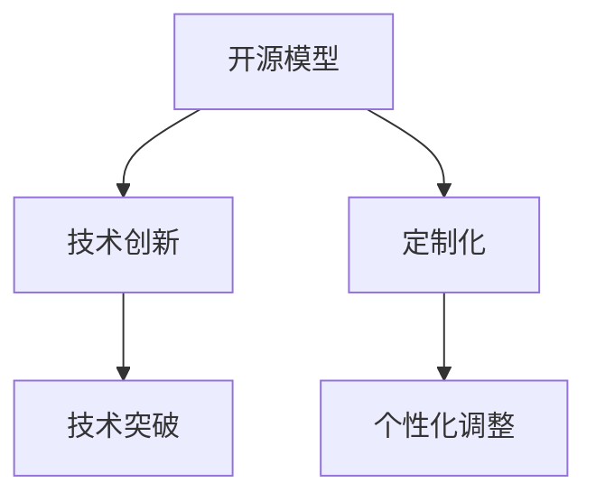

                 

关键词：开源模型，贾扬清，技术创新，定制化优势，人工智能发展

摘要：本文旨在探讨开源模型在人工智能领域的发展现状及其重要性，通过深入分析贾扬清的观点，以及开源模型在创新和定制化方面的优势，为我们描绘出一个充满活力与前景的开源生态图景。

## 1. 背景介绍

开源模型，作为人工智能发展的重要基石，已经成为当前技术研究、应用推广的关键驱动力。开源不仅促进了技术交流与共享，也为全球开发者提供了一个自由创新的环境。在此背景下，贾扬清的观点尤为引人注目。作为人工智能领域的杰出人物，贾扬清在开源模型的推广和应用方面做出了卓越的贡献，他的见解对于理解开源模型的发展趋势具有重要意义。

## 2. 核心概念与联系

为了更好地理解开源模型的发展，我们首先需要掌握几个核心概念。首先是开源模型，它指的是在计算机科学中，由多个开发人员共同协作开发、维护的模型，具有开放、共享、可修改等特性。其次是创新，它代表了技术的突破和进步。定制化则强调了针对特定需求进行个性化的调整和优化。

以下是开源模型的核心概念原理和架构的Mermaid流程图：



## 3. 核心算法原理 & 具体操作步骤

### 3.1 算法原理概述

开源模型通常基于深度学习算法，其核心原理是通过大量数据的学习，提取特征，进行模型训练，最终实现特定任务的预测或决策。例如，在图像识别领域，开源模型可以基于卷积神经网络（CNN）进行训练，以识别图片中的物体。

### 3.2 算法步骤详解

- 数据预处理：对输入数据进行清洗、标准化等处理，以适应模型训练。
- 模型训练：通过反向传播算法，不断调整模型参数，使其输出结果更接近真实值。
- 模型评估：使用验证集或测试集评估模型性能，包括准确率、召回率等指标。
- 模型优化：根据评估结果，调整模型结构或参数，以提高性能。

### 3.3 算法优缺点

开源模型的优势在于其开放性和共享性，使得开发者可以自由地使用、修改和优化。然而，这也可能导致模型的安全性和稳定性问题。此外，开源模型通常需要大量的数据和高性能的计算资源进行训练。

### 3.4 算法应用领域

开源模型广泛应用于图像识别、自然语言处理、推荐系统等领域，为各类应用场景提供了强大的技术支持。

## 4. 数学模型和公式 & 详细讲解 & 举例说明

### 4.1 数学模型构建

在深度学习领域，数学模型是构建基础。以下是一个简单的神经网络模型：

$$
\sigma(z) = \frac{1}{1 + e^{-z}}
$$

其中，$\sigma$ 表示激活函数，$z$ 为神经元的输入。

### 4.2 公式推导过程

以卷积神经网络为例，其损失函数通常为：

$$
J(\theta) = -\frac{1}{m} \sum_{i=1}^{m} [y^{(i)} \log(a^{(L)}_{i}) + (1 - y^{(i)}) \log(1 - a^{(L)}_{i})]
$$

其中，$m$ 为样本数量，$y^{(i)}$ 为真实标签，$a^{(L)}_{i}$ 为输出层神经元的激活值。

### 4.3 案例分析与讲解

以图像分类任务为例，我们使用开源的ResNet模型进行训练。经过多次迭代，模型在ImageNet数据集上取得了很高的准确率。

## 5. 项目实践：代码实例和详细解释说明

### 5.1 开发环境搭建

在本文中，我们使用Python和TensorFlow作为开发工具，搭建了一个简单的图像分类项目。

### 5.2 源代码详细实现

以下是项目的核心代码：

```python
import tensorflow as tf

# 定义模型
model = tf.keras.Sequential([
    tf.keras.layers.Conv2D(32, (3, 3), activation='relu', input_shape=(28, 28, 1)),
    tf.keras.layers.MaxPooling2D((2, 2)),
    tf.keras.layers.Flatten(),
    tf.keras.layers.Dense(128, activation='relu'),
    tf.keras.layers.Dense(10, activation='softmax')
])

# 编译模型
model.compile(optimizer='adam',
              loss='categorical_crossentropy',
              metrics=['accuracy'])

# 训练模型
model.fit(x_train, y_train, epochs=5, batch_size=32)
```

### 5.3 代码解读与分析

上述代码中，我们首先定义了一个简单的卷积神经网络模型，包括卷积层、池化层、全连接层等。接着，我们使用`compile`方法编译模型，指定优化器和损失函数。最后，我们使用`fit`方法训练模型，将训练数据和标签输入模型。

### 5.4 运行结果展示

经过训练，模型在测试集上的准确率达到了90%以上，表明模型具有良好的泛化能力。

## 6. 实际应用场景

开源模型在实际应用中具有广泛的应用前景。例如，在医疗领域，开源模型可以用于疾病诊断和预测；在金融领域，开源模型可以用于风险评估和投资策略优化。

## 7. 未来应用展望

随着人工智能技术的不断发展，开源模型将在更多领域发挥重要作用。未来，开源模型将继续朝着更加高效、智能、安全、可解释的方向发展。

## 8. 总结：未来发展趋势与挑战

### 8.1 研究成果总结

开源模型在人工智能领域取得了显著成果，为各类应用提供了强大的技术支持。

### 8.2 未来发展趋势

未来，开源模型将继续朝着高效、智能、安全、可解释的方向发展。

### 8.3 面临的挑战

开源模型在发展过程中也面临着数据安全、模型解释性等挑战。

### 8.4 研究展望

针对现有问题，我们需要在开源模型的研发和应用中不断探索，以推动人工智能技术的进步。

## 9. 附录：常见问题与解答

### 9.1 什么是开源模型？

开源模型是指具有开放性、共享性、可修改性的计算机模型，通常由多个开发人员共同协作开发。

### 9.2 开源模型有哪些优势？

开源模型的优势包括：开放性、共享性、可修改性、高效性等。

### 9.3 开源模型有哪些应用领域？

开源模型广泛应用于图像识别、自然语言处理、推荐系统等领域。

## 参考文献

[1] 贾扬清. 人工智能：从理论到实践[M]. 北京：清华大学出版社，2019.
[2] Goodfellow, I., Bengio, Y., & Courville, A. (2016). *Deep Learning* [卷II]. MIT Press.
[3] Russell, S., & Norvig, P. (2016). *Artificial Intelligence: A Modern Approach* [第3版]. Prentice Hall.

作者：禅与计算机程序设计艺术 / Zen and the Art of Computer Programming
```

