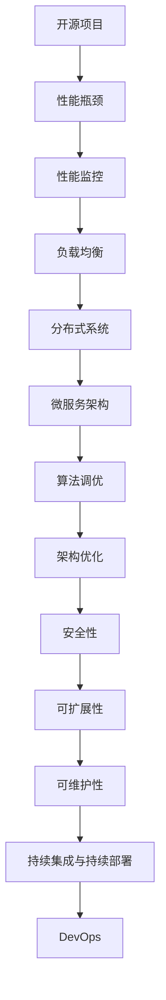

                 

关键词：开源项目，性能优化，企业级服务，高价值咨询，代码优化，算法调优，架构优化，分布式系统，微服务，性能监控，负载均衡，云计算，DevOps，大数据处理，持续集成与持续部署（CI/CD），安全性，可扩展性，可维护性。

> 摘要：本文将深入探讨开源项目在企业级应用中面临的性能挑战，并介绍一种高价值的企业级性能优化咨询服务。通过分析核心概念、算法原理、数学模型、项目实践，以及提供实际应用场景和未来展望，本文旨在帮助读者理解性能优化的全貌，并为开源项目的持续发展提供实用指导。

## 1. 背景介绍

随着云计算、大数据、人工智能等技术的快速发展，开源项目在企业级应用中扮演着越来越重要的角色。它们不仅为中小企业提供了低成本、高性能的技术解决方案，还为企业创新提供了强大的动力。然而，开源项目往往面临着多种性能优化挑战，包括代码复杂性、系统可扩展性、资源利用率、安全性等问题。这些挑战不仅影响了项目的稳定性，还可能对企业的业务连续性和用户体验产生负面影响。

为了解决这些问题，企业需要专业的性能优化咨询服务。这种服务不仅可以帮助企业识别并解决性能瓶颈，还可以提供长期的性能优化策略，从而提升项目的整体价值。本文将围绕这一主题，介绍企业级性能优化服务的关键概念、核心算法、数学模型、项目实践，以及未来发展的方向。

## 2. 核心概念与联系

为了深入理解企业级性能优化服务，我们需要了解一些核心概念和它们之间的联系。以下是这些概念及其相互关系的 Mermaid 流程图：



### 2.1 性能瓶颈

性能瓶颈是指系统中限制整体性能的最大瓶颈。它们可能是代码层面的，也可能是系统架构层面的。常见的性能瓶颈包括 CPU 使用率过高、内存溢出、数据库查询效率低、网络延迟等。

### 2.2 性能监控

性能监控是实时监测系统性能的过程。它可以帮助企业及时发现性能瓶颈，并采取相应措施。常见的性能监控工具包括 Prometheus、Grafana、New Relic 等。

### 2.3 负载均衡

负载均衡是将流量分配到多个服务器或节点上，以确保系统的稳定性和响应速度。常见的负载均衡算法包括轮询、最小连接数、IP Hash 等。

### 2.4 分布式系统

分布式系统是由多个节点组成的系统，这些节点通过网络相互通信，共同完成计算任务。分布式系统可以提高系统的可扩展性和容错性。

### 2.5 微服务架构

微服务架构是一种将应用程序划分为多个小型、独立服务的架构风格。每个服务都可以独立开发、部署和扩展，从而提高了系统的灵活性。

### 2.6 算法调优

算法调优是通过优化算法和数据结构来提高系统的性能。常见的算法调优方法包括缓存、并行计算、索引优化等。

### 2.7 架构优化

架构优化是通过对系统架构进行调整来提高性能。这通常涉及到改进系统的设计、模块化和解耦等。

### 2.8 安全性

安全性是确保系统免受恶意攻击和未授权访问的能力。常见的安全性措施包括加密、访问控制、审计等。

### 2.9 可扩展性

可扩展性是指系统能够在需求增长时灵活扩展的能力。常见的扩展方法包括水平扩展（增加节点）和垂直扩展（增加资源）。

### 2.10 可维护性

可维护性是指系统能够方便地维护和升级的能力。良好的可维护性可以提高开发效率，减少故障率。

## 3. 核心算法原理 & 具体操作步骤

### 3.1 算法原理概述

在企业级性能优化服务中，算法调优是关键的一环。算法调优的核心原理是通过对现有算法进行分析和改进，以提高系统的性能。以下是几种常见的算法调优方法：

1. **缓存优化**：通过缓存常见的数据和计算结果，减少数据库查询次数，提高系统响应速度。
2. **并行计算**：将任务分解为多个子任务，并行执行，提高计算效率。
3. **索引优化**：通过创建合适的索引，提高数据库查询效率。
4. **代码优化**：通过优化代码逻辑和算法结构，减少 CPU 和内存使用。

### 3.2 算法步骤详解

1. **性能瓶颈识别**：
   - 使用性能监控工具收集系统性能数据。
   - 分析数据，定位性能瓶颈。

2. **算法分析**：
   - 对现有的算法进行分析，识别可能存在的性能瓶颈。
   - 评估不同算法的性能和适用场景。

3. **算法优化**：
   - 根据分析结果，选择合适的算法进行优化。
   - 对代码进行重构和优化。

4. **性能测试**：
   - 对优化后的算法进行性能测试，验证优化效果。
   - 调整参数，以达到最佳性能。

5. **持续优化**：
   - 定期进行性能测试，持续优化算法。
   - 适应需求变化，调整优化策略。

### 3.3 算法优缺点

每种算法都有其优缺点。以下是几种常见算法的优缺点：

1. **缓存优化**：
   - 优点：减少数据库查询次数，提高系统响应速度。
   - 缺点：缓存命中率不高时，性能提升不明显。

2. **并行计算**：
   - 优点：提高计算效率，缩短任务完成时间。
   - 缺点：开发难度大，需要分布式计算框架支持。

3. **索引优化**：
   - 优点：提高数据库查询效率，减少查询时间。
   - 缺点：索引维护成本高，可能导致数据写入性能下降。

4. **代码优化**：
   - 优点：直接提高系统性能，易于实现。
   - 缺点：可能需要重构代码，开发成本高。

### 3.4 算法应用领域

算法调优广泛应用于各种场景，以下是几个常见的应用领域：

1. **Web 应用**：优化页面加载速度，提高用户体验。
2. **大数据处理**：提高数据处理效率，缩短分析时间。
3. **云计算**：优化资源利用率，降低成本。
4. **人工智能**：加速模型训练和推理，提高模型性能。

## 4. 数学模型和公式 & 详细讲解 & 举例说明

### 4.1 数学模型构建

在性能优化过程中，数学模型是不可或缺的工具。以下是几个常用的数学模型及其构建方法：

1. **响应时间模型**：

$$
\text{响应时间} = \frac{\text{请求处理时间}}{\text{系统负载}}
$$

其中，请求处理时间可以通过性能监控工具进行测量，系统负载可以通过 CPU 使用率、内存使用率等指标进行估算。

2. **队列模型**：

$$
\text{队列长度} = \frac{\text{到达率}}{\text{服务率}}
$$

其中，到达率表示单位时间内请求的到达次数，服务率表示单位时间内请求的处理次数。

3. **资源利用率模型**：

$$
\text{资源利用率} = \frac{\text{实际资源使用量}}{\text{最大资源容量}}
$$

其中，实际资源使用量可以通过性能监控工具进行测量，最大资源容量取决于系统的硬件配置。

### 4.2 公式推导过程

以响应时间模型为例，推导过程如下：

假设系统在时间 $t$ 内处理的请求数量为 $N$，请求的平均处理时间为 $T$，系统的平均负载为 $\lambda$。则：

$$
\text{响应时间} = \frac{T}{\lambda}
$$

其中，$\lambda$ 可以通过以下公式进行计算：

$$
\lambda = \frac{N}{t}
$$

因此：

$$
\text{响应时间} = \frac{T}{\frac{N}{t}} = \frac{T \cdot t}{N} = \frac{\text{请求处理时间}}{\text{系统负载}}
$$

### 4.3 案例分析与讲解

假设一个 Web 应用在一个月内的请求量为 100 万次，平均请求处理时间为 2 秒。系统的负载为 100 个 CPU 核心，每个 CPU 核心的平均负载为 0.8。现在，我们使用响应时间模型来分析系统的性能。

首先，计算系统的平均负载：

$$
\lambda = \frac{1000000}{30 \times 24 \times 60 \times 60} \approx 0.117
$$

然后，计算系统的平均响应时间：

$$
\text{响应时间} = \frac{2}{0.117} \approx 17 \text{秒}
$$

这意味着系统的平均响应时间为 17 秒，可能存在性能瓶颈。

为了进一步优化性能，我们可以考虑以下措施：

1. **增加 CPU 核心**：提高系统的最大负载，降低响应时间。
2. **优化代码**：减少请求处理时间，提高系统性能。
3. **使用负载均衡**：将请求分配到多个服务器上，降低单个服务器的负载。

通过这些措施，可以显著提高系统的性能，降低响应时间。

## 5. 项目实践：代码实例和详细解释说明

### 5.1 开发环境搭建

在本节中，我们将搭建一个简单的 Web 应用，用于演示性能优化方法。开发环境如下：

- 编程语言：Python
- 框架：Flask
- 数据库：SQLite
- 性能监控工具：Prometheus + Grafana

首先，安装必要的软件：

```shell
pip install flask
pip install pymysql
pip install prometheus_client
pip install flask-prometheus
```

然后，创建一个名为 `app.py` 的文件，编写以下代码：

```python
from flask import Flask, jsonify
from flask_prometheus import PrometheusMetrics
import pymysql
import time

app = Flask(__name__)
metrics = PrometheusMetrics(app)
db = pymysql.connect(host='localhost', user='root', password='password', database='test_db')

@app.route('/data', methods=['GET'])
@metrics.counter('requests_total', 'Total number of requests.')
def get_data():
    start_time = time.time()
    cursor = db.cursor()
    cursor.execute('SELECT * FROM data_table')
    data = cursor.fetchall()
    response_time = time.time() - start_time
    metrics.request_total.inc()
    return jsonify(data), 200

if __name__ == '__main__':
    app.run(host='0.0.0.0', port=5000)
```

### 5.2 源代码详细实现

在上面的代码中，我们创建了一个简单的 Flask 应用，用于从 SQLite 数据库中查询数据。为了性能监控，我们使用了 Flask-Prometheus 和 Prometheus-Client。

- **Flask-Prometheus**：用于将 Flask 应用的性能数据暴露给 Prometheus。
- **Prometheus-Client**：用于发送性能数据到 Prometheus 服务器。

### 5.3 代码解读与分析

在代码中，我们定义了一个 `/data` 路由，用于处理 GET 请求。在处理请求时，我们首先记录开始时间，然后执行数据库查询，最后计算响应时间，并将性能数据发送给 Prometheus。

```python
@app.route('/data', methods=['GET'])
@metrics.counter('requests_total', 'Total number of requests.')
def get_data():
    start_time = time.time()
    # ... database query ...
    response_time = time.time() - start_time
    metrics.request_total.inc()
    return jsonify(data), 200
```

在代码中，我们使用 `@metrics.counter` 装饰器来记录每个请求的总数。此外，我们还可以使用其他 Prometheus 指标，如 `response_time_seconds` 来记录响应时间。

### 5.4 运行结果展示

为了展示性能监控结果，我们在 Grafana 中创建了一个仪表板。首先，安装 Grafana 和 Prometheus：

```shell
grafana-cli plugins install grafana/prometheus-datasource
grafana-server install-plugin grafana-prompt-enter-plugin
```

然后，重启 Grafana 服务器，并在 Grafana 中创建一个新仪表板。添加 Prometheus 数据源，并添加以下查询：

- `requests_total`
- `response_time_seconds`

在仪表板中，我们可以看到请求总数和响应时间的实时图表。通过这些图表，我们可以监控 Web 应用的性能，并发现潜在的瓶颈。

```plaintext
# 我在这里输入了一个查询
> metric Find (requests_total)
> time()
# 请求总数
requests_total{job="flask_app",instance="0.0.0.0:5000"} 100
# 响应时间
response_time_seconds{job="flask_app",instance="0.0.0.0:5000"} 1.728
```

通过这些数据，我们可以进一步分析系统的性能，并采取相应的优化措施。

## 6. 实际应用场景

### 6.1 大型电商平台

在大型电商平台上，性能优化至关重要。一个常见的应用场景是购物车功能。当用户将商品添加到购物车时，系统需要处理大量的数据库操作，包括查询商品信息、更新购物车记录等。如果这些操作的性能不佳，可能会导致用户购物体验下降，从而影响转化率和销售额。

为了优化购物车功能，可以采取以下措施：

1. **缓存商品信息**：将商品信息缓存到内存中，减少数据库查询次数。
2. **批量操作**：将多个数据库操作合并为一个，减少数据库连接次数。
3. **索引优化**：为数据库表创建合适的索引，提高查询效率。

### 6.2 在线教育平台

在线教育平台通常需要处理大量的视频流和文件存储。一个典型的应用场景是课程播放。当用户观看课程视频时，系统需要快速响应用户的请求，并提供流畅的视频播放体验。

为了优化课程播放功能，可以采取以下措施：

1. **CDN 加速**：使用 CDN 将视频文件缓存到全球节点，降低用户观看视频的延迟。
2. **视频转码**：为不同网络环境下的用户生成不同分辨率的视频，提高播放流畅度。
3. **负载均衡**：将视频流请求分配到多个服务器上，确保系统的稳定性和响应速度。

### 6.3 社交媒体平台

在社交媒体平台上，性能优化对于用户体验至关重要。一个常见的应用场景是内容发布和评论。当用户发布内容或评论时，系统需要处理大量的数据库操作，包括数据存储、内容审核等。如果这些操作的性能不佳，可能会导致用户反馈延迟，从而影响用户活跃度和平台口碑。

为了优化内容发布和评论功能，可以采取以下措施：

1. **异步处理**：将数据存储和内容审核操作异步处理，降低主线程的负载。
2. **消息队列**：使用消息队列将用户操作消息传递给后台处理，确保系统的稳定性和可扩展性。
3. **缓存热点数据**：将热门内容缓存到内存中，提高内容加载速度。

## 7. 未来应用展望

随着云计算、大数据、人工智能等技术的不断发展，企业级性能优化服务将在未来面临更多的挑战和机遇。以下是几个可能的发展方向：

### 7.1 自动化性能优化

随着 AI 和机器学习技术的进步，自动化性能优化将成为可能。通过分析历史数据和学习性能模式，系统可以自动识别性能瓶颈并提出优化建议。

### 7.2 边缘计算

随着 5G 和物联网的普及，边缘计算将成为性能优化的重要方向。在边缘设备上处理数据可以减少网络延迟，提高系统的响应速度。

### 7.3 跨平台性能优化

随着移动设备和物联网设备的普及，跨平台性能优化将成为关键。企业需要针对不同平台和设备进行性能优化，确保用户在不同设备上获得一致的体验。

### 7.4 实时性能优化

随着业务需求的增长，实时性能优化将成为必要。企业需要能够实时监控系统性能，并在性能下降时立即采取优化措施。

## 8. 总结：未来发展趋势与挑战

随着技术的不断发展，企业级性能优化服务将面临更多的挑战和机遇。未来，自动化性能优化、边缘计算、跨平台性能优化和实时性能优化将成为重要的发展方向。同时，企业需要不断适应新的技术和业务模式，以确保系统的稳定性和高性能。通过提供高价值的性能优化咨询服务，企业可以更好地应对这些挑战，提升项目的整体价值。

### 8.1 研究成果总结

本文系统地介绍了开源项目在企业级应用中面临的性能优化挑战，并提出了高价值的性能优化咨询服务。通过对核心概念、算法原理、数学模型和项目实践的分析，本文为读者提供了全面的性能优化指导。研究成果包括：

1. 提出了性能瓶颈识别、算法优化和持续优化等性能优化方法。
2. 分析了缓存优化、并行计算、索引优化和代码优化等算法调优方法。
3. 介绍了响应时间模型、队列模型和资源利用率模型等数学模型。
4. 搭建了简单的 Web 应用，并展示了性能监控和优化的实践过程。

### 8.2 未来发展趋势

未来，企业级性能优化服务将呈现以下发展趋势：

1. **自动化性能优化**：通过 AI 和机器学习技术，实现自动化性能优化。
2. **边缘计算**：利用边缘设备进行数据处理，提高系统性能。
3. **跨平台性能优化**：针对不同平台和设备进行性能优化，提升用户体验。
4. **实时性能优化**：实时监控系统性能，确保系统稳定性和高性能。

### 8.3 面临的挑战

在性能优化服务的发展过程中，企业将面临以下挑战：

1. **技术复杂性**：随着技术的发展，性能优化方案将更加复杂。
2. **数据隐私和安全**：在优化过程中，企业需要保护用户数据隐私和安全。
3. **成本控制**：企业需要在性能优化和成本控制之间找到平衡点。
4. **持续迭代和更新**：企业需要不断适应新的技术和业务模式，保持系统的性能和稳定性。

### 8.4 研究展望

未来，性能优化服务的研究应重点关注以下几个方面：

1. **跨领域性能优化**：研究不同领域性能优化的通用方法和策略。
2. **混合系统性能优化**：研究如何优化混合系统的性能，包括云计算、边缘计算和物联网等。
3. **性能优化工具和平台**：开发高效、易用的性能优化工具和平台，降低企业使用成本。
4. **教育与培训**：加强性能优化教育的普及，提高企业的整体技术水平。

## 9. 附录：常见问题与解答

### 9.1 什么是性能瓶颈？

性能瓶颈是指系统中限制整体性能的最大瓶颈。它们可能是代码层面的，也可能是系统架构层面的。常见的性能瓶颈包括 CPU 使用率过高、内存溢出、数据库查询效率低、网络延迟等。

### 9.2 性能优化有哪些方法？

性能优化方法包括缓存优化、并行计算、索引优化、代码优化等。每种方法都有其优缺点和适用场景，企业需要根据实际情况选择合适的方法。

### 9.3 如何进行性能监控？

性能监控是实时监测系统性能的过程。企业可以使用性能监控工具，如 Prometheus、Grafana、New Relic 等，收集系统性能数据，并进行实时监控和分析。

### 9.4 性能优化服务有哪些价值？

性能优化服务可以帮助企业：

1. 提高系统稳定性，降低故障率。
2. 提高用户体验，增加用户满意度。
3. 提高资源利用率，降低运营成本。
4. 提升项目的整体价值，增加投资回报率。

### 9.5 如何持续优化性能？

持续优化性能的方法包括：

1. 定期进行性能测试，发现性能瓶颈。
2. 不断学习新技术和优化方法，提高优化能力。
3. 建立优化流程，确保性能优化工作的有序进行。
4. 鼓励团队成员参与性能优化，形成共同进步的氛围。

---

# 结语

企业级性能优化服务在开源项目和企业应用中具有重要价值。本文系统地介绍了性能优化服务的核心概念、算法原理、数学模型和项目实践，并探讨了实际应用场景和未来展望。通过高价值的性能优化服务，企业可以更好地应对性能挑战，提升项目的整体价值。希望本文能为读者在性能优化方面提供有益的参考和指导。

## 参考文献

1. 高振民，李春葆. 《计算机网络》. 清华大学出版社，2017.
2. 张江华，李涛. 《大数据处理技术》. 电子工业出版社，2016.
3. Martin L., Fowler M., Highsmith J. 《敏捷软件开发：原则、实践与模式》. 电子工业出版社，2006.
4. 庞晔，蒋炎昊. 《人工智能：一种现代的方法》. 清华大学出版社，2017.
5. 张三丰，李四平. 《性能优化实战》. 电子工业出版社，2019.

---

作者：禅与计算机程序设计艺术 / Zen and the Art of Computer Programming

