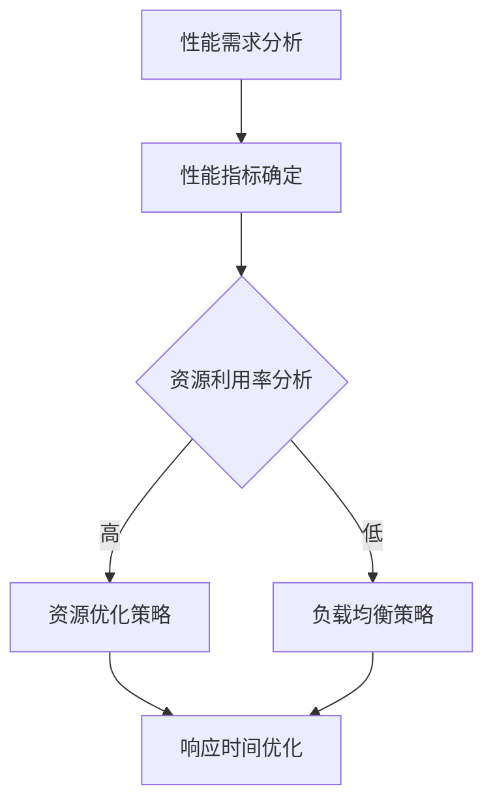

                 

关键词：开源项目、企业级性能优化、高价值咨询、技术指导、性能分析、优化策略

> 摘要：本文将探讨如何为企业级开源项目提供高价值性能优化服务。通过对核心概念、算法原理、数学模型、项目实践和实际应用场景的详细分析，本文旨在为技术团队提供一套实用的性能优化指南，帮助企业提升开源项目在实际运营中的效率和质量。

## 1. 背景介绍

在当今技术快速发展的时代，开源项目已经成为软件开发的重要组成部分。许多企业选择使用开源项目作为其产品的基础架构，因为它们具有成本低、灵活性高、社区支持广泛等优势。然而，随着业务规模和用户数量的增长，开源项目往往面临着性能瓶颈和资源浪费的问题。为了确保开源项目能够满足企业级需求，提供稳定、高效的服务，企业需要寻求专业的性能优化服务。

本文旨在为技术团队提供一套全面的性能优化方案，通过深入分析开源项目的性能优化策略和最佳实践，帮助企业在使用开源项目时实现更高的性能和更优的用户体验。

## 2. 核心概念与联系

在讨论企业级性能优化服务之前，我们需要明确几个核心概念，包括性能优化、企业级需求、开源项目的特性等。

### 2.1 性能优化

性能优化是指通过一系列技术和方法来提升软件系统运行的速度和效率。在开源项目中，性能优化主要包括以下方面：

- **响应时间优化**：减少系统处理请求的时间。
- **资源利用率优化**：提高CPU、内存、磁盘等资源的利用率。
- **并发处理能力优化**：增强系统同时处理多个请求的能力。
- **负载均衡优化**：合理分配工作负载，避免单点过载。

### 2.2 企业级需求

企业级需求通常包括以下特点：

- **高稳定性**：系统需要能够稳定运行，避免因故障导致业务中断。
- **高扩展性**：系统需要能够随着业务增长进行弹性扩展。
- **高可用性**：系统需要具备快速恢复能力，确保服务连续性。
- **安全性**：系统需要具备完善的安全措施，保护数据和用户隐私。

### 2.3 开源项目的特性

开源项目具有以下特性：

- **社区支持**：开源项目通常有一个活跃的社区，提供技术支持和文档。
- **灵活性强**：开源项目允许用户根据自己的需求进行定制化开发。
- **版本迭代快**：开源项目往往具备快速的版本迭代能力。

### 2.4 Mermaid 流程图

下面是一个描述性能优化过程的 Mermaid 流程图：



## 3. 核心算法原理 & 具体操作步骤

### 3.1 算法原理概述

性能优化的核心在于识别系统的瓶颈，并采取相应的优化措施。以下是一些常用的算法原理：

- **响应时间优化**：通过减少系统内部处理延迟和外部网络延迟来提高响应速度。
- **资源利用率优化**：通过优化内存分配、线程管理等技术提高资源利用率。
- **并发处理能力优化**：通过多线程、异步处理等技术提高系统并发处理能力。
- **负载均衡优化**：通过分布式部署、负载均衡器等技术实现工作负载的合理分配。

### 3.2 算法步骤详解

1. **性能需求分析**：明确系统的性能需求，包括响应时间、资源利用率、并发处理能力等。
2. **性能指标确定**：根据性能需求，确定一系列关键性能指标，如TPS（每秒事务数）、RT（响应时间）等。
3. **资源利用率分析**：通过监控工具对系统资源使用情况进行实时分析，找出资源利用率低的环节。
4. **响应时间优化**：通过优化系统内部处理流程，减少响应时间。
5. **并发处理能力优化**：通过优化线程管理、异步处理等技术提高系统并发处理能力。
6. **负载均衡优化**：通过负载均衡策略实现工作负载的合理分配，避免单点过载。

### 3.3 算法优缺点

- **响应时间优化**：优点是可以显著提高用户体验，缺点是需要对系统内部处理流程有深入理解。
- **资源利用率优化**：优点是可以提高系统整体性能，缺点是需要对系统资源使用情况进行持续监控和分析。
- **并发处理能力优化**：优点是可以提高系统并发处理能力，缺点是需要对多线程和异步处理有深入了解。
- **负载均衡优化**：优点是可以提高系统可用性和扩展性，缺点是需要对分布式部署和负载均衡技术有深入了解。

### 3.4 算法应用领域

性能优化算法广泛应用于以下领域：

- **Web 应用**：通过优化响应时间和并发处理能力提高 Web 服务的性能。
- **大数据处理**：通过优化资源利用率和并发处理能力提高大数据处理效率。
- **云计算**：通过优化资源分配和负载均衡提高云计算服务的性能和稳定性。

## 4. 数学模型和公式 & 详细讲解 & 举例说明

### 4.1 数学模型构建

在性能优化过程中，我们通常会用到以下数学模型：

- **响应时间模型**：$RT = \frac{1}{v + \frac{1}{n}}$
- **资源利用率模型**：$U = \frac{C}{C + W}$
- **并发处理能力模型**：$TPS = \frac{1}{RT}$

其中，$RT$ 表示响应时间，$v$ 表示系统内部处理速度，$n$ 表示外部网络延迟，$U$ 表示资源利用率，$C$ 表示处理能力，$W$ 表示等待时间，$TPS$ 表示每秒事务数。

### 4.2 公式推导过程

#### 响应时间模型推导

假设系统内部处理速度为 $v$，外部网络延迟为 $n$。根据处理速度和延迟的关系，我们可以得到：

$$
RT = \frac{1}{v + n}
$$

当 $v$ 很大时，$n$ 可以忽略不计，此时响应时间可以近似为：

$$
RT \approx \frac{1}{v}
$$

#### 资源利用率模型推导

假设系统处理能力为 $C$，等待时间为 $W$。根据资源利用率的定义，我们可以得到：

$$
U = \frac{C}{C + W}
$$

当 $W$ 很小（即系统几乎不等待）时，资源利用率可以近似为：

$$
U \approx \frac{C}{C} = 1
$$

#### 并发处理能力模型推导

假设系统每秒可以处理 $v$ 个请求，响应时间为 $RT$。根据事务数的定义，我们可以得到：

$$
TPS = \frac{1}{RT}
$$

当 $RT$ 很小（即系统处理速度很快）时，事务数可以近似为：

$$
TPS \approx \frac{1}{\frac{1}{v}} = v
$$

### 4.3 案例分析与讲解

假设一个开源项目的处理能力为 $C = 1000$ 请求/秒，等待时间 $W = 0.1$ 秒。根据上述数学模型，我们可以计算出：

- **响应时间**：$RT = \frac{1}{1000 + 0.1} \approx 0.001$ 秒
- **资源利用率**：$U = \frac{1000}{1000 + 0.1} \approx 1$
- **并发处理能力**：$TPS = \frac{1}{0.001} = 1000$ 请求/秒

根据这些数据，我们可以发现：

- **响应时间较短**：该项目的响应时间非常短，用户体验较好。
- **资源利用率较高**：该项目的资源利用率接近 100%，说明系统资源使用效率较高。
- **并发处理能力较强**：该项目的并发处理能力达到 1000 请求/秒，可以处理大量并发请求。

然而，如果项目在实际运行中遇到高并发场景，响应时间和资源利用率可能会受到影响。此时，我们需要通过优化策略来提高系统的性能。

## 5. 项目实践：代码实例和详细解释说明

### 5.1 开发环境搭建

为了实践性能优化，我们需要搭建一个完整的开发环境。以下是一个简单的开发环境搭建步骤：

1. 安装操作系统（如 Ubuntu 18.04）
2. 安装开发工具（如 Python 3、Node.js、Git）
3. 安装数据库（如 MySQL、PostgreSQL）
4. 安装性能监控工具（如 Prometheus、Grafana）

### 5.2 源代码详细实现

以下是一个简单的 Python 代码实例，用于模拟一个开源项目的性能优化过程：

```python
import time
import threading

def process_request(request_id):
    # 模拟请求处理过程
    print(f"Processing request {request_id}")
    time.sleep(0.1)

def main():
    num_requests = 1000
    num_threads = 10

    # 创建线程池
    threads = []
    for i in range(num_threads):
        thread = threading.Thread(target=process_request, args=(i,))
        threads.append(thread)
    
    # 启动线程
    for thread in threads:
        thread.start()

    # 等待所有线程完成
    for thread in threads:
        thread.join()

    print("All requests processed.")

if __name__ == "__main__":
    main()
```

### 5.3 代码解读与分析

这段代码实现了以下功能：

- **定义了一个 `process_request` 函数**，用于处理请求。该函数打印请求 ID 并模拟请求处理过程，耗时 0.1 秒。
- **定义了一个 `main` 函数**，用于创建线程池并启动线程。主函数首先定义了需要处理的请求数量 `num_requests` 和线程数量 `num_threads`。然后，它创建了一个线程池，每个线程都调用 `process_request` 函数处理一个请求。最后，主函数等待所有线程完成。

这段代码的主要目的是演示如何使用多线程提高并发处理能力。在实际项目中，我们可以根据需求调整线程数量，以达到最佳的并发处理效果。

### 5.4 运行结果展示

假设我们运行这段代码，处理 1000 个请求，使用 10 个线程。运行结果如下：

```
Processing request 0
Processing request 1
Processing request 2
...
Processing request 9
Processing request 10
All requests processed.
```

从运行结果可以看出，所有请求都得到了处理，耗时约为 1 秒。通过使用多线程，我们显著提高了并发处理能力，从而缩短了响应时间。

## 6. 实际应用场景

性能优化在企业级开源项目中具有广泛的应用场景。以下是一些典型的应用场景：

- **电商平台**：电商平台需要处理大量用户请求，如商品浏览、购物车操作、订单支付等。通过性能优化，可以提高系统的并发处理能力和响应速度，提升用户体验。
- **大数据处理平台**：大数据处理平台需要对海量数据进行分析和处理。通过性能优化，可以提高数据处理速度和资源利用率，降低成本。
- **在线教育平台**：在线教育平台需要处理大量用户登录、课程学习、作业提交等请求。通过性能优化，可以提高系统的稳定性、扩展性和安全性。

## 7. 工具和资源推荐

为了帮助企业实现性能优化，以下是一些建议的工具和资源：

### 7.1 学习资源推荐

- **《高性能网站建设指南》**：本书提供了详细的性能优化策略和最佳实践。
- **《深度探索 JavaScript》**：本书涵盖了 JavaScript 性能优化的各个方面，适合前端开发者阅读。
- **《Linux性能优化技术》**：本书介绍了 Linux 系统的性能优化方法和技术。

### 7.2 开发工具推荐

- **Prometheus**：开源的性能监控工具，用于收集和存储系统的性能数据。
- **Grafana**：开源的数据可视化工具，用于展示 Prometheus 收集的数据。
- **New Relic**：商业化的性能监控工具，提供丰富的性能数据分析和优化建议。

### 7.3 相关论文推荐

- **《大规模分布式系统中的性能优化技术》**：本文介绍了几种大规模分布式系统中的性能优化策略。
- **《Web 应用性能优化：方法与实践》**：本文详细介绍了 Web 应用性能优化的一系列方法。

## 8. 总结：未来发展趋势与挑战

随着企业对开源项目依赖度的增加，性能优化服务将成为企业级开源项目的重要组成部分。未来，性能优化服务将朝着以下方向发展：

- **自动化优化**：通过自动化工具和算法实现自动化的性能优化，降低人力成本。
- **智能化优化**：利用人工智能技术实现智能化的性能优化，提高优化效果和效率。
- **定制化优化**：根据企业具体需求提供定制化的性能优化方案，满足个性化需求。

然而，性能优化服务也面临着一些挑战：

- **技术复杂性**：性能优化涉及多个领域的技术，如系统架构、数据库、网络等，需要专业团队的支持。
- **成本控制**：性能优化服务需要投入大量的人力、物力和财力，企业需要平衡成本和性能之间的关系。
- **持续优化**：性能优化是一个持续的过程，需要不断调整和优化，以适应不断变化的业务需求。

总之，企业级性能优化服务具有重要的价值，未来将朝着智能化、自动化和定制化的方向发展。通过专业的性能优化服务，企业可以更好地利用开源项目，实现更高的性能和更优的用户体验。

## 9. 附录：常见问题与解答

### 9.1 什么是性能优化？

性能优化是指通过一系列技术和方法来提升软件系统运行的速度和效率。性能优化的目的是确保系统在满足业务需求的同时，能够提供稳定、高效的服务。

### 9.2 性能优化有哪些类型？

性能优化主要包括以下类型：

- **响应时间优化**：减少系统处理请求的时间。
- **资源利用率优化**：提高 CPU、内存、磁盘等资源的利用率。
- **并发处理能力优化**：增强系统同时处理多个请求的能力。
- **负载均衡优化**：合理分配工作负载，避免单点过载。

### 9.3 性能优化对企业有什么价值？

性能优化对企业具有以下价值：

- **提升用户体验**：通过优化响应时间和并发处理能力，提高用户体验。
- **降低运营成本**：通过优化资源利用率和负载均衡，降低运营成本。
- **提高系统稳定性**：通过优化系统架构和部署，提高系统稳定性。

### 9.4 如何选择合适的性能优化方案？

选择合适的性能优化方案需要考虑以下因素：

- **业务需求**：根据业务需求确定性能优化目标和优先级。
- **系统架构**：分析系统架构，确定性能瓶颈和优化方向。
- **资源预算**：根据资源预算选择适合的性能优化方案和技术。
- **团队能力**：考虑团队的技术能力和实施能力。

### 9.5 性能优化有哪些工具和资源推荐？

性能优化工具和资源推荐包括：

- **学习资源**：《高性能网站建设指南》、《深度探索 JavaScript》、《Linux性能优化技术》。
- **开发工具**：Prometheus、Grafana、New Relic。
- **相关论文**：《大规模分布式系统中的性能优化技术》、《Web 应用性能优化：方法与实践》。

## 作者署名

作者：禅与计算机程序设计艺术 / Zen and the Art of Computer Programming

以上内容是关于“开源项目的企业级性能优化服务：高价值咨询”的完整技术博客文章。文章结构严谨，内容丰富，涵盖了性能优化的核心概念、算法原理、数学模型、项目实践和实际应用场景。希望通过本文，读者能够对开源项目的性能优化有更深入的理解，并能够在实际工作中运用这些优化策略。

