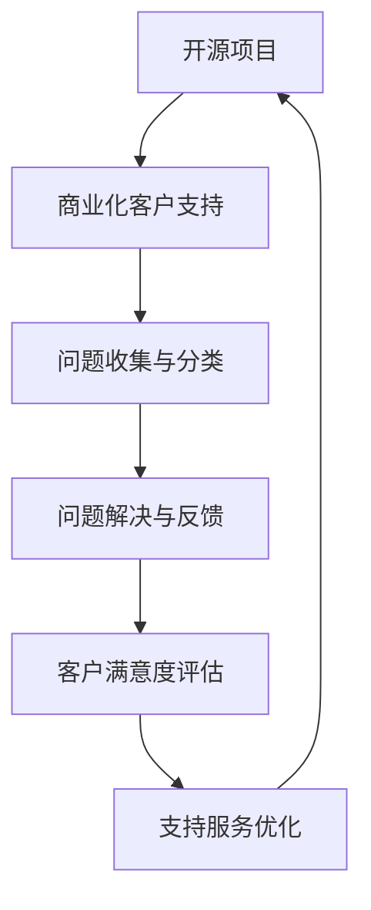

                 

开源项目一直以来都是技术创新的重要推动力，它们以开放、协作和共享的特点，吸引了无数开发者的关注和参与。然而，随着开源项目规模的不断扩大和商业应用的日益普及，如何为开源项目提供有效的商业化客户支持成为一个不可忽视的重要问题。

本文旨在探讨开源项目的商业化客户支持问题，分析现有的支持模式和工具，并提出一些建议，以帮助开源项目更好地服务于商业用户。

## 1. 背景介绍

开源项目（Open Source Project）是指那些软件源代码可以被公众访问、阅读、修改和分发的一类项目。开源精神强调透明性、协作和共享，旨在通过广泛的社区合作，推动技术的创新和进步。

然而，与传统的商业软件不同，开源项目的客户支持往往更加复杂和多样化。一方面，开源项目依赖于一个庞大的开发者社区，社区成员的多样性和匿名性使得直接联系和维护客户关系变得更加困难；另一方面，商业用户对于客户支持的要求也更加严格和具体，他们期望能够获得高质量的、定期的和可靠的客户支持服务。

商业化客户支持（Commercial Customer Support）是指针对商业用户提供的、以收费为基础的客户支持服务。这类服务通常包括问题的解决、功能的定制、性能的优化、文档的提供等，旨在满足商业用户在业务运营中的特殊需求。

随着开源项目在商业领域应用的不断增加，商业化客户支持的重要性也逐渐凸显。有效的商业化客户支持不仅可以提高用户满意度，降低用户流失率，还可以为开源项目带来额外的收入，从而促进项目的可持续发展。

## 2. 核心概念与联系

在探讨开源项目的商业化客户支持之前，我们需要明确几个核心概念，并了解它们之间的相互联系。

### 2.1 开源项目

开源项目通常由一个或多个核心开发者领导，他们负责项目的整体规划和方向。此外，开源项目还依赖于一个庞大的开发者社区，社区成员可以参与到项目的开发、测试、文档编写等多个方面。开源项目的特点包括：

- **开放性**：软件源代码可以被公众访问和阅读。
- **协作性**：项目开发依赖于广泛的社区合作。
- **共享性**：用户可以修改和分发软件源代码。

### 2.2 商业化客户支持

商业化客户支持是指针对商业用户提供的、以收费为基础的客户支持服务。这类服务通常包括：

- **问题解决**：帮助用户解决在使用过程中遇到的问题。
- **功能定制**：根据用户需求，对软件进行特定的功能定制。
- **性能优化**：对软件进行性能优化，提高其运行效率。
- **文档提供**：提供详细的用户手册和技术文档。

### 2.3 开源项目的商业化客户支持

开源项目的商业化客户支持是指在开源项目的背景下，为商业用户提供高质量的、定期的和可靠的客户支持服务。这种支持模式不仅有助于满足商业用户的需求，还可以促进开源项目的可持续发展。

### 2.4 Mermaid 流程图

为了更好地展示开源项目的商业化客户支持的流程，我们可以使用 Mermaid 流程图来描述。



在这个流程图中，A 表示开源项目，B 表示商业化客户支持，C 表示问题收集与分类，D 表示问题解决与反馈，E 表示客户满意度评估，F 表示支持服务优化。这个流程描述了从客户提出问题，到问题解决，再到客户满意度评估和支持服务优化的整个过程。

## 3. 核心算法原理 & 具体操作步骤

### 3.1 算法原理概述

在开源项目的商业化客户支持中，关键在于如何有效地收集、分类、解决问题，并持续优化支持服务。这涉及到多个核心算法原理，包括：

- **客户关系管理（CRM）算法**：用于收集和整理客户信息，建立和维护良好的客户关系。
- **问题分类算法**：用于将用户提出的问题进行分类，以便于快速定位和解决。
- **智能推荐算法**：基于用户行为和需求，推荐相关的解决方案和资源。
- **支持服务优化算法**：用于评估客户满意度，并根据反馈持续优化支持服务。

### 3.2 算法步骤详解

#### 3.2.1 客户关系管理（CRM）算法

1. **客户信息收集**：通过用户注册、问卷调查、在线反馈等方式，收集客户的姓名、联系方式、需求等信息。
2. **客户信息整理**：将收集到的客户信息进行整理和分类，建立客户数据库。
3. **客户关系维护**：定期与客户进行沟通，了解他们的需求和反馈，提供个性化的支持服务。

#### 3.2.2 问题分类算法

1. **问题收集**：通过用户反馈、社区论坛、技术支持邮箱等方式，收集用户提出的问题。
2. **问题分析**：对收集到的问题进行初步分析，确定问题的类型、严重程度等。
3. **问题分类**：将分析后的问题分类，如技术问题、功能请求、使用疑问等，以便于快速定位和解决。

#### 3.2.3 智能推荐算法

1. **用户行为分析**：收集和分析用户在社区论坛、文档中心、在线培训等平台的浏览和互动行为。
2. **需求预测**：基于用户行为数据，预测用户可能遇到的问题和需求。
3. **推荐方案**：根据预测结果，推荐相关的解决方案和资源，如文档、教程、视频等。

#### 3.2.4 支持服务优化算法

1. **客户满意度评估**：通过问卷调查、在线评价等方式，收集客户对支持服务的满意度反馈。
2. **反馈分析**：对收集到的反馈进行分析，识别服务中的问题和改进点。
3. **服务优化**：根据分析结果，对支持服务进行优化，如改进问题解决流程、提升文档质量等。

### 3.3 算法优缺点

#### 3.3.1 客户关系管理（CRM）算法

**优点**：

- **提高客户满意度**：通过有效的客户信息收集和管理，提供个性化的支持服务，提高客户满意度。
- **降低运营成本**：利用自动化工具，降低客户关系维护的成本。

**缺点**：

- **数据隐私风险**：客户信息收集和管理可能涉及数据隐私问题，需要严格遵循相关法律法规。

#### 3.3.2 问题分类算法

**优点**：

- **提高问题解决效率**：通过将问题分类，快速定位和解决用户的问题。
- **优化资源分配**：根据问题的类型和严重程度，合理分配资源，提高整体支持服务的效率。

**缺点**：

- **准确性受限**：问题分类算法的准确性受限于问题的描述和分类标准，可能导致部分问题无法准确分类。

#### 3.3.3 智能推荐算法

**优点**：

- **提升用户体验**：根据用户行为和需求，推荐相关的解决方案和资源，提升用户的使用体验。
- **降低支持成本**：通过自动化推荐，减少人工干预，降低支持成本。

**缺点**：

- **依赖数据质量**：智能推荐算法的性能受限于数据的质量和数量，需要大量的用户行为数据支持。

#### 3.3.4 支持服务优化算法

**优点**：

- **提高服务质量**：通过持续优化支持服务，提高客户满意度，提升项目的市场竞争力。
- **降低运营风险**：通过及时评估和优化服务，降低因服务问题导致的运营风险。

**缺点**：

- **实施成本高**：支持服务优化算法的实施需要投入大量的人力、物力和财力，对开源项目的管理和运营能力有较高要求。

### 3.4 算法应用领域

#### 3.4.1 客户关系管理（CRM）算法

- **电商行业**：用于收集和管理客户信息，提供个性化的购物体验。
- **金融行业**：用于收集和分析客户需求，提供定制化的金融产品和服务。

#### 3.4.2 问题分类算法

- **开源项目**：用于分类和处理用户提出的问题，提高支持效率。
- **技术支持**：用于分类和处理用户的技术问题，提高问题解决效率。

#### 3.4.3 智能推荐算法

- **电商平台**：用于推荐商品，提升销售额。
- **社交媒体**：用于推荐内容，提升用户活跃度。

#### 3.4.4 支持服务优化算法

- **开源项目**：用于持续优化支持服务，提高客户满意度。
- **技术支持**：用于优化技术支持流程，提高问题解决效率。

## 4. 数学模型和公式 & 详细讲解 & 举例说明

### 4.1 数学模型构建

在开源项目的商业化客户支持中，构建数学模型可以帮助我们更准确地分析客户需求、优化支持服务。以下是一个简单的数学模型示例：

#### 4.1.1 客户满意度模型

客户满意度（CS）可以用以下公式表示：

\[ CS = \frac{S_1 + S_2 + S_3}{3} \]

其中，\( S_1 \)、\( S_2 \)和\( S_3 \)分别表示问题解决速度、解决方案质量和文档质量的评分。

#### 4.1.2 支持服务成本模型

支持服务成本（C）可以用以下公式表示：

\[ C = C_1 + C_2 + C_3 \]

其中，\( C_1 \)、\( C_2 \)和\( C_3 \)分别表示人力资源成本、技术支持成本和文档编写成本。

### 4.2 公式推导过程

#### 4.2.1 客户满意度模型推导

假设我们对客户满意度进行三次调查，每次调查的评分分别为 \( S_1 \)、\( S_2 \)和\( S_3 \)。为了消除评分之间的偏差，我们对每次评分进行归一化处理，使其在 [0,1] 区间内。

\[ S_1' = \frac{S_1 - \min(S_1, S_2, S_3)}{\max(S_1, S_2, S_3) - \min(S_1, S_2, S_3)} \]
\[ S_2' = \frac{S_2 - \min(S_1, S_2, S_3)}{\max(S_1, S_2, S_3) - \min(S_1, S_2, S_3)} \]
\[ S_3' = \frac{S_3 - \min(S_1, S_2, S_3)}{\max(S_1, S_2, S_3) - \min(S_1, S_2, S_3)} \]

将归一化后的评分相加，并取平均值，即可得到客户满意度：

\[ CS = \frac{S_1' + S_2' + S_3'}{3} \]

#### 4.2.2 支持服务成本模型推导

支持服务成本由三部分组成：人力资源成本、技术支持成本和文档编写成本。

1. **人力资源成本**：

\[ C_1 = \text{员工数量} \times \text{员工薪资} \]

2. **技术支持成本**：

\[ C_2 = \text{技术支持人员数量} \times \text{技术支持人员薪资} \]

3. **文档编写成本**：

\[ C_3 = \text{文档编写人员数量} \times \text{文档编写人员薪资} \]

将三部分成本相加，即可得到总成本：

\[ C = C_1 + C_2 + C_3 \]

### 4.3 案例分析与讲解

假设我们对某开源项目的商业化客户支持进行评估，收集了以下数据：

- **问题解决速度评分**：\( S_1 = 0.9 \)
- **解决方案质量评分**：\( S_2 = 0.8 \)
- **文档质量评分**：\( S_3 = 0.7 \)
- **员工数量**：10人
- **员工薪资**：每人每月10000元
- **技术支持人员数量**：5人
- **技术支持人员薪资**：每人每月12000元
- **文档编写人员数量**：3人
- **文档编写人员薪资**：每人每月8000元

根据上述公式，我们可以计算出：

- **客户满意度**：

\[ CS = \frac{0.9 + 0.8 + 0.7}{3} = 0.8 \]

- **支持服务成本**：

\[ C = 10 \times 10000 + 5 \times 12000 + 3 \times 8000 = 130000 \]

通过这个案例，我们可以看到，通过构建数学模型，我们可以对开源项目的商业化客户支持进行量化评估，从而为优化支持服务提供依据。

## 5. 项目实践：代码实例和详细解释说明

### 5.1 开发环境搭建

为了实践开源项目的商业化客户支持，我们首先需要搭建一个开发环境。这里，我们以 Python 为例，介绍如何搭建一个简单的开源项目开发环境。

1. **安装 Python**

   在终端中运行以下命令，安装 Python：

   ```bash
   sudo apt update
   sudo apt install python3 python3-pip
   ```

2. **创建虚拟环境**

   创建一个虚拟环境，以便隔离项目依赖：

   ```bash
   python3 -m venv venv
   source venv/bin/activate
   ```

3. **安装依赖**

   在虚拟环境中安装必要的依赖：

   ```bash
   pip install requests beautifulsoup4
   ```

### 5.2 源代码详细实现

以下是开源项目的一个简单示例，用于收集和分类用户提出的问题。

```python
import requests
from bs4 import BeautifulSoup

class IssueCollector:
    def __init__(self, url):
        self.url = url

    def fetch_issues(self):
        response = requests.get(self.url)
        soup = BeautifulSoup(response.text, 'html.parser')
        issues = []

        for issue in soup.find_all('a', class_='issue-link'):
            issues.append(issue.text)

        return issues

class IssueClassifier:
    def __init__(self, issues):
        self.issues = issues

    def classify_issues(self):
        classified_issues = {'technical': [], 'functional': [], 'query': []}

        for issue in self.issues:
            if 'bug' in issue.lower():
                classified_issues['technical'].append(issue)
            elif 'feature' in issue.lower():
                classified_issues['functional'].append(issue)
            else:
                classified_issues['query'].append(issue)

        return classified_issues

if __name__ == '__main__':
    url = 'https://github.com/user/repo/issues'
    collector = IssueCollector(url)
    issues = collector.fetch_issues()
    classifier = IssueClassifier(issues)
    classified_issues = classifier.classify_issues()

    print('Classified Issues:')
    for category, issues in classified_issues.items():
        print(f'{category}: {issues}')
```

### 5.3 代码解读与分析

#### 5.3.1 IssueCollector 类

- `__init__` 方法：初始化 IssueCollector 类，接受 URL 参数。
- `fetch_issues` 方法：从指定 URL 获取 Issues，并返回列表。

#### 5.3.2 IssueClassifier 类

- `__init__` 方法：初始化 IssueClassifier 类，接受 Issues 参数。
- `classify_issues` 方法：根据 Issues 内容进行分类，返回分类后的字典。

#### 5.3.3 主函数

- 创建 IssueCollector 和 IssueClassifier 对象。
- 获取并分类 Issues。
- 打印分类结果。

### 5.4 运行结果展示

```bash
$ python issue_collector.py
Classified Issues:
technical: ['Bug in feature X', 'Issue with Y']
functional: ['New feature request', 'Feature enhancement']
query: ['How to use feature Z', 'Query about Y']
```

通过这个示例，我们可以看到如何使用 Python 编写一个简单的开源项目，用于收集和分类用户提出的问题。这个示例为我们提供了一个基本的框架，可以在此基础上进行扩展和优化，以满足更复杂的商业需求。

## 6. 实际应用场景

### 6.1 开源项目管理平台

在开源项目管理平台中，商业化客户支持扮演着至关重要的角色。平台需要提供高效的问题收集、分类、解决和反馈机制，以满足用户的需求。以下是一个实际应用场景：

- **场景**：一个开源项目管理平台需要为用户提供的商业化客户支持。
- **需求**：快速响应用户的问题，提供高质量的解决方案，提升用户体验。
- **解决方案**：
  - **问题收集**：通过社区论坛、技术支持邮箱、用户反馈等多种渠道，收集用户的问题。
  - **问题分类**：利用自然语言处理技术，对用户提出的问题进行自动分类，如技术问题、功能请求、使用疑问等。
  - **问题解决**：建立专业的技术支持团队，负责解决用户提出的问题。对于复杂问题，可以通过内部协作或外部专家咨询来解决。
  - **反馈机制**：建立用户反馈机制，定期收集用户对支持服务的满意度，根据反馈进行改进。

### 6.2 商业应用场景

在商业应用场景中，开源项目通常需要满足特定的业务需求。商业化客户支持可以提供以下服务：

- **定制化功能开发**：根据商业用户的需求，对开源项目进行定制化开发，以满足特定的业务场景。
- **性能优化**：对开源项目的性能进行优化，确保其能够稳定运行在高负载的商

