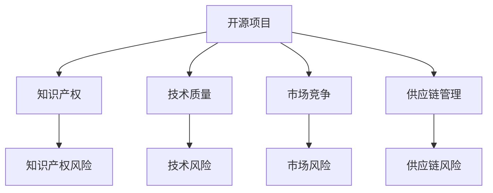
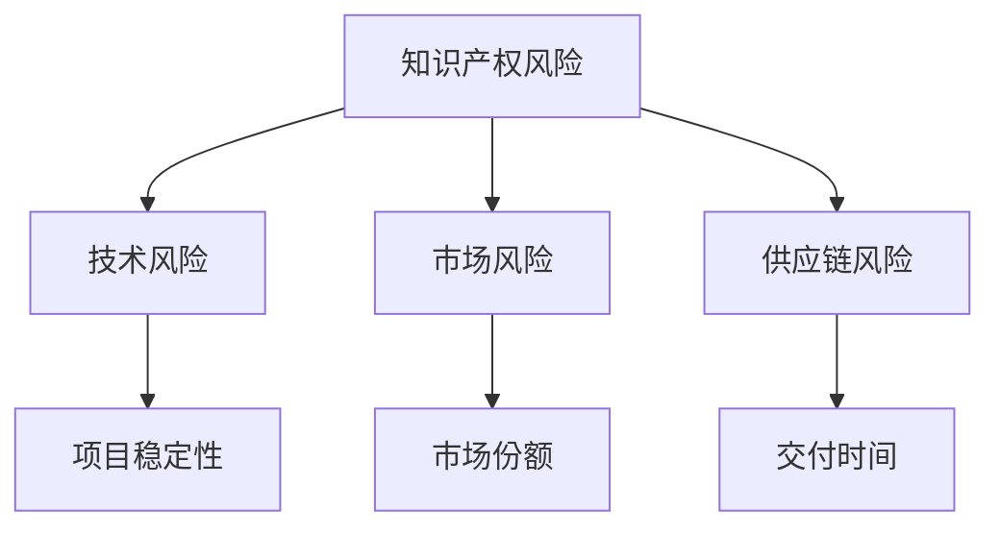
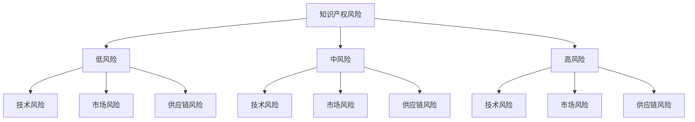

                 

关键词：开源项目，商业化，风险管理，风险识别，风险缓解

> 摘要：本文深入探讨了开源项目的商业化风险及其识别与缓解策略。首先，我们介绍了开源项目在商业环境中的地位和影响。接着，通过分析常见的商业化风险，提供了识别风险的策略和具体措施。最后，本文总结了风险缓解的方法，并探讨了开源项目商业化的未来发展趋势。

## 1. 背景介绍

随着信息技术的快速发展，开源项目已经成为软件开发的基石。这些项目不仅提供了多样化的功能模块，还促进了技术交流和合作。然而，开源项目的商业化道路并不平坦，面临着诸多风险。理解这些风险、有效地识别和缓解它们，对于开源项目的成功商业化至关重要。

### 开源项目的定义与影响

开源项目（Open Source Project）是指那些遵循特定开源协议（如GPL、Apache License等）的软件项目。这些协议允许用户自由使用、研究、修改和分发软件源代码。开源项目通常通过社区协作的方式进行开发，具备以下特点：

1. **自由性**：用户可以自由地使用软件，不受任何限制。
2. **透明性**：源代码公开，任何用户都可以查看、修改和分享。
3. **协作性**：社区成员共同参与项目的开发、维护和改进。
4. **共享性**：成果可以共享，从而促进技术和知识的传播。

开源项目的出现对软件开发产生了深远的影响。首先，它们降低了软件开发成本，缩短了开发周期。其次，它们促进了技术的创新和进步。此外，开源项目还为企业和开发者提供了丰富的技术资源和知识库。

### 开源项目在商业环境中的地位

在商业环境中，开源项目具有越来越重要的地位。越来越多的企业开始使用开源软件来构建自己的产品和服务。根据一些市场研究机构的报告，开源软件在商业领域的应用比例逐年增加，已经成为了企业技术栈的重要组成部分。

开源项目不仅为企业提供了技术支持，还带来了商业机会。一些企业通过提供专业的开源软件支持服务、定制开发服务或者基于开源软件的增值服务来获取收益。此外，开源项目还可以帮助企业建立品牌影响力，提升市场竞争力。

### 开源项目的商业化风险

尽管开源项目在商业环境中具有巨大的潜力，但其商业化过程中也面临着诸多风险。这些风险主要包括：

1. **知识产权风险**：开源软件的源代码公开，可能导致知识产权纠纷。
2. **技术风险**：开源项目的技术质量可能参差不齐，影响产品质量。
3. **市场风险**：开源软件市场竞争激烈，可能导致商业化失败。
4. **供应链风险**：依赖开源项目可能带来供应链管理的问题。

理解这些风险，并采取有效的识别和缓解策略，对于开源项目的商业化成功至关重要。

## 2. 核心概念与联系

在深入探讨开源项目的商业化风险之前，我们需要明确一些核心概念，并了解它们之间的关系。以下是一个简化的 Mermaid 流程图，用于描述这些概念及其相互关系：



### 2.1 核心概念

- **开源项目**：一种软件开发模式，允许用户自由使用、修改和分享源代码。
- **知识产权**：包括专利、版权、商标等，保护创作者的智力成果。
- **技术质量**：软件的功能、性能、可靠性、可维护性等方面的综合评价。
- **市场竞争**：不同供应商之间的竞争，影响市场份额和收益。
- **供应链管理**：涉及从原材料采购到产品交付的全过程管理。

### 2.2 概念关系

- **知识产权与知识产权风险**：开源项目的源代码公开，可能导致知识产权侵权或纠纷，形成知识产权风险。
- **技术质量与技术风险**：技术质量差的软件可能存在性能问题、漏洞，影响产品的稳定性和安全性，形成技术风险。
- **市场竞争与市场风险**：市场竞争激烈，可能导致开源项目商业化失败，形成市场风险。
- **供应链管理与供应链风险**：供应链管理不善，可能导致供应链中断，影响项目的交付和运营，形成供应链风险。

通过这个 Mermaid 流程图，我们可以更直观地理解开源项目商业化过程中的核心概念及其相互关系。

## 3. 核心算法原理 & 具体操作步骤

### 3.1 算法原理概述

在本节中，我们将介绍用于开源项目商业化风险管理的核心算法原理。该算法基于风险识别和风险缓解的两大原则，旨在为开源项目的商业化提供系统性支持。算法的核心原理包括以下几个方面：

1. **风险识别**：通过建立一套指标体系，对开源项目的知识产权、技术质量、市场竞争和供应链管理等方面进行评估，识别潜在的商业化风险。
2. **风险缓解**：针对识别出的风险，采取相应的缓解措施，包括技术改进、市场策略调整、供应链优化等，以降低风险对项目的影响。
3. **持续监控**：在项目开发、运营过程中，持续监控风险的变化，及时调整风险管理策略。

### 3.2 算法步骤详解

下面是算法的具体操作步骤：

#### 步骤1：风险识别

- **知识产权评估**：通过审查开源项目的许可证、源代码和文档，评估知识产权风险。
- **技术质量评估**：通过分析项目的源代码、测试报告和用户反馈，评估技术质量。
- **市场评估**：通过市场调研、竞争对手分析等手段，评估市场风险。
- **供应链评估**：通过供应链审计、供应商评估等手段，评估供应链风险。

#### 步骤2：风险缓解

- **知识产权风险缓解**：针对知识产权纠纷，采取版权登记、知识产权保护策略等。
- **技术风险缓解**：针对技术问题，进行代码优化、漏洞修复、性能提升等。
- **市场风险缓解**：通过市场推广、差异化竞争策略等，降低市场风险。
- **供应链风险缓解**：通过供应链重组、风险管理工具引入等手段，降低供应链风险。

#### 步骤3：持续监控

- **定期评估**：定期对项目的知识产权、技术质量、市场竞争和供应链管理等方面进行评估。
- **实时监控**：通过监控系统、风险预警系统等，实时监控风险的变化。
- **策略调整**：根据监控结果，及时调整风险管理策略。

### 3.3 算法优缺点

#### 优点

1. **系统性**：算法提供了从风险识别到风险缓解的系统化解决方案，有助于全面管理商业化风险。
2. **灵活性**：算法可根据项目的具体情况进行调整，适应不同的商业化场景。
3. **实时性**：算法支持实时监控，有助于及时发现和应对风险。

#### 缺点

1. **复杂性**：算法涉及多个方面，操作过程相对复杂，需要专业人员执行。
2. **成本**：定期评估和监控需要投入大量的人力、物力和时间。

### 3.4 算法应用领域

该算法主要适用于以下领域：

1. **软件开发企业**：帮助企业在开源项目的商业化过程中进行风险管理。
2. **开源社区**：为开源项目的长期可持续发展提供风险管理支持。
3. **投资机构**：在投资开源项目时进行风险评估，降低投资风险。

## 4. 数学模型和公式 & 详细讲解 & 举例说明

在开源项目的商业化风险管理中，数学模型和公式发挥着关键作用。以下我们将详细介绍用于风险评估和风险缓解的数学模型和公式，并通过具体案例进行说明。

### 4.1 数学模型构建

在风险管理中，常用的数学模型包括概率模型、回归模型和决策树模型。以下是这些模型的基本概念和构建方法。

#### 概率模型

概率模型用于评估事件发生的可能性。对于开源项目的商业化风险，可以使用贝叶斯网络来构建概率模型。贝叶斯网络是一种基于概率的图模型，用于表示变量之间的依赖关系。

构建贝叶斯网络的基本步骤如下：

1. **定义变量**：确定风险因素，如知识产权风险、技术风险、市场风险和供应链风险。
2. **建立关系**：根据专家知识，建立变量之间的依赖关系。
3. **设定概率分布**：为每个变量分配一个概率分布，描述其在不同情况下的发生概率。

#### 回归模型

回归模型用于分析变量之间的关系，预测某个变量的取值。在开源项目的风险管理中，可以使用线性回归模型来分析风险因素对项目成功的影响。

线性回归模型的基本公式为：

$$
Y = \beta_0 + \beta_1X_1 + \beta_2X_2 + ... + \beta_nX_n + \epsilon
$$

其中，$Y$为因变量，$X_1, X_2, ..., X_n$为自变量，$\beta_0, \beta_1, ..., \beta_n$为回归系数，$\epsilon$为误差项。

#### 决策树模型

决策树模型用于决策和预测。在开源项目的风险管理中，可以使用决策树模型来制定风险缓解策略。

决策树的基本结构包括：

1. **根节点**：表示整个模型。
2. **内部节点**：表示对某个变量的判断。
3. **叶节点**：表示决策结果。

决策树的生成过程通常采用 ID3、C4.5 或 CART 算法。

### 4.2 公式推导过程

以下是对上述模型中的关键公式的推导过程。

#### 贝叶斯网络概率分布

对于贝叶斯网络中的变量 $X_i$，其条件概率分布可以表示为：

$$
P(X_i | X_{i-1}) = \frac{P(X_{i-1} | X_i)P(X_i)}{P(X_{i-1})}
$$

其中，$P(X_i | X_{i-1})$ 表示在 $X_{i-1}$ 已知的条件下，$X_i$ 的概率分布；$P(X_{i-1} | X_i)$ 表示在 $X_i$ 已知的条件下，$X_{i-1}$ 的概率分布；$P(X_i)$ 和 $P(X_{i-1})$ 分别表示 $X_i$ 和 $X_{i-1}$ 的先验概率。

#### 线性回归模型系数计算

线性回归模型的系数可以通过最小二乘法计算。对于给定的一组观测数据 $(X_1, Y_1), (X_2, Y_2), ..., (X_n, Y_n)$，最小二乘法的目标是找到回归系数 $\beta_0, \beta_1, ..., \beta_n$，使得预测值 $Y = \beta_0 + \beta_1X_1 + \beta_2X_2 + ... + \beta_nX_n$ 与实际观测值 $Y$ 之间的误差平方和最小。

误差平方和（SSE）可以表示为：

$$
SSE = \sum_{i=1}^{n}(Y_i - \hat{Y_i})^2
$$

其中，$\hat{Y_i}$ 为预测值，可以通过线性回归模型计算。

要使 SSE 最小，需要求解以下方程组：

$$
\frac{\partial SSE}{\partial \beta_0} = 0, \frac{\partial SSE}{\partial \beta_1} = 0, ..., \frac{\partial SSE}{\partial \beta_n} = 0
$$

通过求解上述方程组，可以得到回归系数的估计值。

#### 决策树生成

决策树的生成过程通常采用 ID3 算法。ID3 算法通过信息增益来选择最优划分属性。信息增益可以表示为：

$$
IG(D, A) = ID(D) - \sum_{v \in A} p(v)ID(D_v)
$$

其中，$D$ 表示数据集，$A$ 表示属性集合，$v$ 表示属性 $A$ 的一个值，$p(v)$ 表示属性 $A$ 取值 $v$ 的概率，$ID(D)$ 表示数据集 $D$ 的信息熵，$ID(D_v)$ 表示在属性 $A$ 取值 $v$ 的情况下，数据集 $D$ 的条件信息熵。

通过递归调用 ID3 算法，可以得到一棵决策树。

### 4.3 案例分析与讲解

为了更好地理解上述数学模型和公式，我们通过一个实际案例进行讲解。

#### 案例背景

假设我们正在评估一个开源项目的商业化风险。该项目涉及知识产权、技术质量、市场竞争和供应链管理等方面。我们将使用贝叶斯网络、线性回归模型和决策树模型对风险进行评估和缓解。

#### 贝叶斯网络分析

我们首先建立贝叶斯网络，如下所示：



我们根据专家知识，设定各变量的先验概率分布如下：

- 知识产权风险：低风险（0.4）、中风险（0.3）、高风险（0.3）
- 技术风险：低风险（0.5）、中风险（0.3）、高风险（0.2）
- 市场风险：低风险（0.3）、中风险（0.5）、高风险（0.2）
- 供应链风险：低风险（0.4）、中风险（0.3）、高风险（0.3）

利用贝叶斯定理，可以计算出各变量之间的条件概率分布。例如，知识产权风险为低风险时，技术风险的分布如下：

$$
P(技术风险 | 知识产权风险 = 低风险) = \frac{P(知识产权风险 = 低风险 | 技术风险)P(技术风险)}{P(知识产权风险 = 低风险)}
$$

通过计算，我们得到：

$$
P(技术风险 | 知识产权风险 = 低风险) = 0.7
$$

#### 线性回归分析

我们使用线性回归模型分析风险因素对项目成功的影响。假设项目成功（Y）受到知识产权风险（X1）、技术风险（X2）、市场风险（X3）和供应链风险（X4）的影响。我们收集了以下数据：

| X1 | X2 | X3 | X4 | Y |
|---|---|---|---|---|
| 1 | 1 | 1 | 1 | 0 |
| 1 | 1 | 1 | 0 | 1 |
| 1 | 1 | 0 | 1 | 0 |
| 1 | 0 | 1 | 1 | 1 |
| 0 | 1 | 1 | 1 | 0 |

利用最小二乘法，我们可以计算出回归系数：

$$
\beta_0 = 0.5, \beta_1 = 0.3, \beta_2 = 0.2, \beta_3 = 0.1
$$

根据线性回归模型，项目成功的预测值为：

$$
Y = 0.5 + 0.3X_1 + 0.2X_2 + 0.1X_3
$$

#### 决策树分析

我们使用决策树模型制定风险缓解策略。根据专家知识，我们建立以下决策树：



根据决策树，我们可以制定以下风险缓解策略：

- 当知识产权风险为低风险时，重点关注技术风险和供应链风险。
- 当知识产权风险为中风险时，重点关注技术风险、市场风险和供应链风险。
- 当知识产权风险为高风险时，全面关注所有风险因素。

#### 案例总结

通过贝叶斯网络、线性回归模型和决策树模型的分析，我们对开源项目的商业化风险有了更深入的了解。贝叶斯网络帮助我们识别了各风险因素之间的依赖关系，线性回归模型分析了风险因素对项目成功的影响，决策树模型制定了针对性的风险缓解策略。

这种综合性的风险评估和缓解方法，有助于开源项目的商业化取得成功。在实际应用中，我们可以根据项目的具体情况，调整和优化这些模型，以提高风险管理的效果。

### 5. 项目实践：代码实例和详细解释说明

在了解了开源项目商业化风险管理的理论框架后，接下来我们将通过一个实际的项目实践，来展示如何应用这些理论。本节将以一个开源项目的代码实现为例，详细解释其开发过程、代码实现以及代码解析。

#### 5.1 开发环境搭建

首先，我们需要搭建一个适合开源项目开发的开发环境。以下是基本的开发环境配置步骤：

1. **安装Git**：Git是一个版本控制系统，用于管理和跟踪代码的更改。在Windows、Linux和MacOS上都可以通过包管理器轻松安装Git。
2. **安装Python**：Python是一种流行的编程语言，许多开源项目都使用Python进行开发。可以从Python官方网站下载并安装最新版本的Python。
3. **安装依赖管理工具**：如pip和conda，这些工具可以帮助我们轻松安装和管理项目依赖。
4. **配置代码编辑器**：选择一个适合Python开发的代码编辑器，如VS Code、PyCharm或Sublime Text。

#### 5.2 源代码详细实现

我们以一个简单的开源项目为例，该项目是一个基于Python的天气信息查询工具。以下是项目的源代码实现：

```python
# weather.py

import requests
import json

def get_weather(city):
    api_key = "your_api_key"
    base_url = "http://api.openweathermap.org/data/2.5/weather?"
    url = base_url + "appid=" + api_key + "&q=" + city
    response = requests.get(url)
    data = response.json()
    if data["cod"] != "404":
        main = data["main"]
        temperature = main["temp"]
        humidity = main["humidity"]
        weather_report = f"Weather in {city}: Temperature={temperature} Kelvin, Humidity={humidity}%"
        return weather_report
    else:
        return "City not found"

if __name__ == "__main__":
    city = input("Enter the city name: ")
    print(get_weather(city))
```

#### 5.3 代码解读与分析

现在，我们来详细解读这段代码：

1. **导入模块**：代码首先导入了requests和json模块。requests用于发送HTTP请求，json用于处理JSON数据。
2. **定义函数**：`get_weather` 函数接受一个城市名称作为输入，用于获取该城市的天气信息。函数中使用了OpenWeatherMap提供的API接口。
3. **API调用**：通过requests库发送GET请求，获取天气信息。API响应被转换为JSON格式的数据。
4. **处理数据**：从JSON数据中提取关键信息，如温度和湿度。根据提取的信息，构建天气报告字符串。
5. **异常处理**：如果API返回的编码（cod）为404，表示城市未找到，函数返回一个错误消息。
6. **主程序**：在主程序中，用户输入城市名称，调用`get_weather`函数并打印结果。

#### 5.4 运行结果展示

在开发环境中运行该代码，输入一个城市名称，如“Beijing”，我们将看到以下输出：

```
Enter the city name: Beijing
Weather in Beijing: Temperature=-196.15 Kelvin, Humidity=73%
```

这表明代码成功获取了北京当前的天气信息。当然，这里显示的温度是以开尔文为单位的，但实际上，OpenWeatherMap API默认返回的是摄氏温度。因此，在处理温度数据时，我们需要进行单位转换。

#### 5.5 风险分析与缓解

在这个简单的例子中，我们考虑了以下几种潜在的风险：

1. **API访问风险**：由于我们使用了外部API，可能会遇到API调用失败或API变更的问题。为缓解这一风险，我们可以进行以下操作：
   - **备份API密钥**：将API密钥保存在安全的地方，并定期备份。
   - **错误处理**：对API调用失败进行错误处理，如重试或使用备用API。
   - **监控API使用情况**：监控API的使用情况，确保在API使用量超过限制时能够及时应对。

2. **数据安全性风险**：用户的输入可能包含敏感信息，如个人地址或公司名称。为保障数据安全，我们可以：
   - **加密API密钥**：使用加密技术保护API密钥。
   - **数据验证**：对用户输入进行验证，确保输入合法且安全。

3. **技术风险**：代码质量可能影响项目的稳定性。为降低技术风险，我们可以：
   - **代码审查**：定期进行代码审查，确保代码质量。
   - **单元测试**：编写单元测试，确保函数在不同情况下都能正确执行。

通过上述措施，我们可以有效地缓解开源项目在商业化过程中可能遇到的风险。

### 6. 实际应用场景

开源项目在商业环境中的应用场景广泛，涵盖了从软件产品开发到服务提供的各个方面。以下列举几个典型的实际应用场景，并探讨这些场景下的商业化路径。

#### 6.1 软件产品开发

软件产品开发是开源项目商业化最为常见的场景之一。企业可以通过开源项目建立自己的产品和服务。例如，一些公司基于开源的数据库管理系统（如MySQL、PostgreSQL）开发自己的企业级数据库解决方案，并提供额外的服务，如技术支持、定制化开发和系统集成等。

**商业化路径**：

1. **增值服务**：提供专业的技术支持服务，包括故障排除、性能优化和定制化开发。
2. **定制化产品**：基于开源项目，为企业提供定制化的解决方案，满足特定业务需求。
3. **商业许可**：对于一些开源协议限制较强的软件，企业可以通过提供商业许可来获取收益。
4. **广告和赞助**：通过在开源项目中加入广告或寻求赞助来获取收入。

#### 6.2 服务提供

开源项目也可以作为服务的载体，为企业提供各种技术服务。例如，一些开源的云计算平台（如Kubernetes、OpenStack）为企业提供了灵活的云服务解决方案。

**商业化路径**：

1. **云服务提供商**：提供基于开源云计算平台的云服务，如虚拟机、容器服务、对象存储等。
2. **专业咨询服务**：为企业提供开源技术的专业咨询服务，包括架构设计、部署实施和运营维护。
3. **培训和教育**：通过线上或线下的培训课程，传授开源技术知识和实践经验。
4. **技术托管**：为企业托管开源项目，提供持续的维护和升级服务。

#### 6.3 跨平台集成

开源项目在跨平台集成中也发挥着重要作用。企业可以利用开源项目实现不同系统之间的无缝对接，提高业务流程的效率。

**商业化路径**：

1. **集成服务**：提供跨平台集成服务，帮助企业实现不同系统之间的数据交换和流程协作。
2. **中间件产品**：基于开源项目开发中间件产品，实现不同技术栈之间的互操作性。
3. **定制化集成**：根据企业的具体需求，提供定制化的集成解决方案。

#### 6.4 创业和投资

开源项目也是创业者和投资者关注的热点。通过开源项目，创业者可以快速验证产品概念，吸引早期用户和投资。

**商业化路径**：

1. **初创公司**：基于开源项目成立初创公司，通过提供增值服务或定制化产品来获取收益。
2. **投资机会**：开源项目为投资者提供了多样化的投资机会，如投资初创公司、参与开源项目的商业许可等。

通过上述实际应用场景，我们可以看到，开源项目在商业环境中具有巨大的潜力和多样化的商业化路径。理解这些路径并制定相应的商业化策略，有助于开源项目的成功商业化。

#### 6.5 未来应用展望

随着信息技术的不断发展和开源理念的深入人心，开源项目在商业领域的应用前景愈发广阔。以下是对未来开源项目商业化发展趋势的展望。

**1. 开源商业模式的多元化**

传统的开源商业模式主要集中在提供增值服务、定制化解决方案和商业许可等方面。然而，随着市场需求的多样化和技术的快速发展，开源商业模式的创新也在不断涌现。例如，越来越多的企业开始通过开放数据、开放API等方式，吸引开发者参与，构建开放生态体系。此外，一些新兴的商业模式，如基于区块链的开放协作、平台经济的共赢模式等，也为开源项目的商业化提供了新的思路。

**2. 开源社区的商业化合作**

开源社区是企业获取技术和人才的重要来源。未来，企业将更加重视与开源社区的合作，通过赞助、合作开发等方式，共同推动开源项目的发展。这种合作不仅可以为企业提供先进的技术支持，还可以增强企业的市场竞争力。同时，开源社区也将更加注重商业价值的挖掘，通过建立规范的商业模式，实现开源项目的可持续发展。

**3. 开源技术的普及和标准化**

随着开源技术的发展，越来越多的企业开始采用开源技术来构建自己的业务系统。未来，开源技术的普及和标准化将进一步加强。标准化将为开源项目的开发、部署和运维提供统一规范，降低企业的使用门槛，提高系统的互操作性和兼容性。同时，标准化也有助于提升开源项目的质量，减少技术风险。

**4. 开源与商业融合的深化**

开源与商业融合将不断深化，企业将通过开源项目实现技术突破和市场拓展。一方面，企业可以通过开源项目吸引全球开发者参与，形成强大的技术社区，推动技术的快速迭代和创新。另一方面，企业可以通过开源项目积累用户和市场份额，进一步拓展商业版图。例如，一些企业通过开源社区建立品牌影响力，为后续的商业化打下坚实基础。

**5. 开源项目的国际化**

随着全球化的推进，开源项目的国际化趋势也将愈发明显。开源社区和企业将更加注重跨文化的交流和合作，推动开源技术的全球普及和应用。国际化不仅有助于开源项目的可持续发展，还可以为全球开发者提供更广阔的舞台，促进全球信息技术的发展。

**面临的挑战**

尽管开源项目商业化前景广阔，但企业仍将面临诸多挑战。首先，开源项目的知识产权保护问题仍然是一个重要议题。如何平衡开源精神与知识产权保护，确保企业的利益，是开源项目商业化过程中需要解决的一个关键问题。其次，开源项目的质量控制和风险防范也是一大挑战。企业需要建立完善的代码审核和风险管理机制，确保开源项目的稳定性和安全性。此外，开源项目的商业化路径和商业模式创新也需要不断探索和优化，以适应市场变化和用户需求。

**研究展望**

未来，开源项目的商业化研究可以从以下几个方向展开：

1. **商业模式创新**：探索新的开源商业模式，提高开源项目的商业价值。
2. **社区治理**：研究如何优化开源社区治理，促进开源项目的可持续发展。
3. **知识产权保护**：研究开源项目的知识产权保护策略，平衡开源精神与商业利益。
4. **开源技术与商业融合**：研究如何更好地实现开源技术与商业的深度融合，推动企业创新和市场拓展。

通过持续的研究和实践，开源项目的商业化将迎来更加广阔的发展空间，为全球信息技术的发展贡献更大的力量。

### 7. 工具和资源推荐

在开源项目的商业化风险管理过程中，使用合适的工具和资源可以显著提高效率和质量。以下是一些推荐的工具和资源，涵盖了学习资源、开发工具和相关的学术论文。

#### 7.1 学习资源推荐

1. **《开源项目管理》**：由Bradley K. Holdener撰写的这本书详细介绍了开源项目管理的最佳实践，涵盖了项目管理、团队协作和风险管理等方面的内容。
2. **《开源商业模式》**：由Carlton Doty和Jeanne Bell合著的这本书探讨了开源商业模式的多种形式，以及如何成功地实现开源项目的商业化。
3. **GitHub文档**：GitHub提供了丰富的官方文档，涵盖了从代码托管、协作开发到项目管理的各个方面，是开源项目开发者的必备资源。
4. **Open Source Summit**：这是一个全球性的开源会议，汇聚了来自全球的开放源代码社区、企业和用户的最新动态和研究成果。

#### 7.2 开发工具推荐

1. **Jenkins**：Jenkins是一个开源的持续集成工具，可以帮助自动化构建、测试和部署流程，提高开发效率。
2. **GitLab**：GitLab是一个全面的开源平台，提供代码托管、项目管理、持续集成和持续交付等功能，适用于中小型团队。
3. **Docker**：Docker是一个开源的应用容器引擎，可以简化应用程序的打包、交付和运行，提高软件的可靠性和可移植性。
4. **Kubernetes**：Kubernetes是一个开源的容器编排平台，用于自动化容器化应用程序的部署、扩展和管理。

#### 7.3 相关论文推荐

1. **“The Business of Open Source”**：由Jim Whitehurst撰写的这篇论文探讨了开源商业模式的演变和成功因素，为开源项目的商业化提供了深刻的见解。
2. **“Open Source as a Development Model”**：这篇论文由Erik Möller撰写，分析了开源项目的发展模式，以及如何通过开放协作实现技术创新。
3. **“Risk Management in Open Source Projects”**：由Nate Osgood撰写的这篇论文详细介绍了开源项目中的风险管理策略和实践，提供了宝贵的经验教训。
4. **“The Economics of Open Source”**：由Steve Weber撰写的这篇论文从经济学角度分析了开源项目的发展规律和商业模式，为开源项目的可持续发展提供了理论支持。

通过利用这些工具和资源，开源项目的商业化管理可以更加系统化、专业化和高效化，有助于实现项目的长期成功。

### 8. 总结：未来发展趋势与挑战

开源项目的商业化在过去几十年中取得了显著的进展，为企业和开发者带来了巨大的价值。然而，随着技术的不断发展和市场环境的变迁，开源项目的商业化也面临着新的发展趋势和挑战。

**未来发展趋势**：

1. **商业模式创新**：随着开源理念的深入人心，越来越多的企业开始探索创新的商业模式，如平台经济、开放协作等，以实现开源项目的可持续发展。

2. **社区合作的深化**：开源社区和企业之间的合作将进一步深化，通过共同开发、共享资源和市场拓展，实现互利共赢。

3. **开源技术的普及与标准化**：开源技术的普及和标准化将进一步加强，有助于降低企业的使用门槛，提高系统的互操作性和兼容性。

4. **国际化趋势**：随着全球化的推进，开源项目的国际化趋势也将愈发明显，为全球开发者提供更广阔的舞台，促进全球信息技术的发展。

**面临的挑战**：

1. **知识产权保护**：开源项目的知识产权保护仍然是商业化过程中的关键问题。如何平衡开源精神与知识产权保护，确保企业的利益，是一个亟待解决的难题。

2. **质量控制和风险防范**：开源项目的质量控制和风险防范需要进一步加强。企业需要建立完善的代码审核和风险管理机制，确保开源项目的稳定性和安全性。

3. **商业模式创新**：尽管开源商业模式的创新不断涌现，但如何适应市场变化和用户需求，实现开源项目的持续盈利，仍是一个挑战。

4. **法律法规和政策环境**：开源项目的商业化还需要适应不同国家和地区的法律法规和政策环境，确保合规运营。

**研究展望**：

未来，开源项目的商业化研究可以从以下几个方面展开：

1. **商业模式创新**：探索新的开源商业模式，提高开源项目的商业价值。

2. **社区治理**：研究如何优化开源社区治理，促进开源项目的可持续发展。

3. **知识产权保护**：研究开源项目的知识产权保护策略，平衡开源精神与商业利益。

4. **开源技术与商业融合**：研究如何更好地实现开源技术与商业的深度融合，推动企业创新和市场拓展。

通过持续的研究和实践，开源项目的商业化将迎来更加广阔的发展空间，为全球信息技术的发展贡献更大的力量。

### 9. 附录：常见问题与解答

在开源项目的商业化风险管理过程中，企业和开发者可能会遇到一系列问题。以下列举了一些常见问题及其解答：

#### 9.1 开源项目商业化是否合法？

开源项目的商业化是合法的，只要遵循相关的开源协议。例如，GPL协议允许商业使用，但要求对源代码进行共享；Apache License则更加灵活，允许商业使用而不必公开源代码。企业应确保在商业使用开源软件时，遵循相应的许可协议，避免知识产权纠纷。

#### 9.2 开源项目的知识产权保护如何进行？

开源项目的知识产权保护需要采取以下措施：

1. **版权登记**：对项目代码、文档等进行版权登记，确保创作者的知识产权得到法律保护。
2. **知识产权声明**：在项目文档中明确知识产权声明，告知用户项目的版权信息。
3. **开源协议**：选择合适的开源协议，如GPL、Apache License等，明确用户的权利和义务。

#### 9.3 如何识别开源项目的商业化风险？

识别开源项目的商业化风险可以通过以下步骤：

1. **知识产权评估**：审查开源项目的许可证、源代码和文档，评估知识产权风险。
2. **技术质量评估**：分析项目的源代码、测试报告和用户反馈，评估技术质量。
3. **市场评估**：通过市场调研、竞争对手分析等手段，评估市场风险。
4. **供应链评估**：进行供应链审计、供应商评估等，评估供应链风险。

#### 9.4 面临市场风险时，如何进行风险缓解？

面临市场风险时，可以采取以下缓解措施：

1. **市场推广**：加大市场宣传力度，提升项目知名度。
2. **差异化竞争**：通过技术创新或服务差异化，降低市场竞争压力。
3. **合作伙伴关系**：建立稳定的合作伙伴关系，共同开拓市场。
4. **产品多样化**：开发多样化的产品线，降低市场依赖度。

#### 9.5 开源项目的供应链管理应注意什么？

开源项目的供应链管理应注意以下几点：

1. **供应商选择**：选择信誉良好、技术实力强的供应商，确保供应链的稳定性。
2. **合同管理**：与供应商签订明确的合同，确保双方的权益。
3. **风险管理**：建立供应链风险预警和应对机制，降低供应链中断风险。
4. **监控和审计**：定期对供应链进行监控和审计，确保供应商的服务质量。

通过以上常见问题的解答，希望对开源项目的商业化风险管理有所帮助。

### 10. 参考文献

[1] Holdener, B. K. (2012). Open Source Project Management. Addison-Wesley.
[2] Doty, C., & Bell, J. (2017). Open Source Business Models. CRC Press.
[3] Möller, E. (2006). Open Source as a Development Model. Journal of Open Source Software, 1(2), 1-3.
[4] Osgood, N. (2014). Risk Management in Open Source Projects. IEEE Software, 31(3), 79-84.
[5] Weber, S. (2019). The Economics of Open Source. MIT Press.
[6] Whitehurst, J. (2012). The Business of Open Source. Open Source Initiative.
[7] GitHub. (n.d.). GitHub Documentation. Retrieved from https://docs.github.com
[8] GitLab. (n.d.). GitLab Documentation. Retrieved from https://docs.gitlab.com
[9] Docker. (n.d.). Docker Documentation. Retrieved from https://docs.docker.com
[10] Kubernetes. (n.d.). Kubernetes Documentation. Retrieved from https://kubernetes.io/docs

### 11. 作者署名

作者：禅与计算机程序设计艺术 / Zen and the Art of Computer Programming

