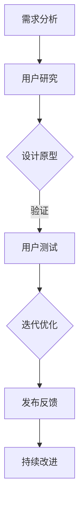

                 

关键词：开源项目、用户体验设计、扩展专业领域、技术博客、人工智能、软件架构

> 摘要：本文旨在探讨如何通过用户体验设计服务来提升开源项目的专业性和用户参与度。通过深入分析开源项目的用户体验设计，我们提出了具体的策略和方法，以帮助开源社区扩展其专业领域，提高项目的可持续性和影响力。

## 1. 背景介绍

在当今快速发展的技术时代，开源项目已经成为推动创新和共享知识的重要力量。开源项目不仅提供了丰富的技术资源和代码库，还促进了全球开发者的协作和交流。然而，尽管开源项目在技术方面取得了显著成就，但在用户体验设计（UXD）方面的关注度相对较低。用户体验设计是影响项目成功的关键因素之一，它关乎用户对项目的满意度和参与度。

用户体验设计不仅仅是关于界面美观和用户操作便捷性，它更是一种深层次的用户思维和情感体验的体现。一个好的用户体验设计可以显著提高用户满意度，增加用户粘性，并促进项目的持续发展。因此，开源项目需要将用户体验设计作为核心要素之一，来提升项目的整体质量和影响力。

本文将围绕开源项目的用户体验设计展开讨论，探讨其核心概念、设计原则、具体实践方法以及未来发展趋势。通过这篇文章，我们希望能够为开源社区提供一些有价值的见解和建议，帮助开源项目更好地满足用户需求，扩展其专业领域。

## 2. 核心概念与联系

### 2.1 用户体验设计（UXD）的定义

用户体验设计（UXD）是一种设计方法，旨在创建一个能够满足用户需求、提高用户满意度和效率的产品或服务。它不仅关注产品的功能实现，还关注用户在使用过程中的情感体验和整体感受。用户体验设计涉及多个领域，包括人机交互（HCI）、心理学、设计学和技术。

### 2.2 用户体验设计的原则

用户体验设计的基本原则包括：

- **用户为中心**：以用户需求为核心，从用户角度出发进行设计。
- **简洁性**：设计要简洁直观，避免不必要的复杂性。
- **一致性**：确保界面和交互的一致性，使用户能够轻松上手。
- **反馈**：及时给予用户反馈，增强用户操作的可预测性。
- **易访问性**：确保所有用户，包括残疾人，都能无障碍地使用产品。

### 2.3 开源项目与用户体验设计的关系

开源项目的成功离不开用户体验设计。用户体验设计不仅关系到用户对项目的第一印象，还影响着用户对项目的长期满意度。以下是用户体验设计在开源项目中的几个关键作用：

- **降低学习曲线**：通过简洁一致的设计，帮助新用户快速上手。
- **提高用户满意度**：优秀的用户体验能够提升用户满意度，增加用户参与度。
- **增强社区凝聚力**：良好的用户体验能够促进社区成员之间的交流与合作。
- **提升项目质量**：用户体验设计是一个持续改进的过程，有助于发现并解决潜在问题。

### 2.4 Mermaid 流程图

以下是一个简化的Mermaid流程图，展示了用户体验设计在开源项目中的关键步骤：



### 2.5 用户体验设计的影响因素

用户体验设计受到多个因素的影响，包括：

- **用户需求**：了解用户需求和期望是用户体验设计的起点。
- **技术限制**：技术实现的能力和限制会影响设计决策。
- **文化背景**：不同文化和地区对用户体验有不同的期望。
- **开发资源**：设计资源、时间和技术资源等都会影响设计质量。

## 3. 核心算法原理 & 具体操作步骤

### 3.1 算法原理概述

在用户体验设计中，核心算法通常涉及用户行为分析和界面交互优化。以下是一个简化的算法原理概述：

- **用户行为分析**：通过数据收集和分析，了解用户在项目中的操作行为和偏好。
- **界面交互优化**：基于用户行为分析结果，对界面进行优化，以提高用户操作效率和满意度。

### 3.2 算法步骤详解

1. **需求分析**：收集用户需求，确定设计目标。
2. **用户研究**：通过访谈、问卷调查、用户测试等方法，深入了解用户行为和需求。
3. **设计原型**：基于用户研究数据，设计界面原型。
4. **用户测试**：对原型进行测试，收集用户反馈。
5. **迭代优化**：根据用户反馈，对设计进行迭代优化。
6. **发布反馈**：将优化后的设计发布给用户，并收集反馈。

### 3.3 算法优缺点

**优点**：

- 提高用户满意度：通过优化用户界面和交互，提升用户体验。
- 增强用户参与度：用户测试和反馈机制能够促进用户参与项目发展。

**缺点**：

- 设计过程较复杂：用户体验设计涉及多个环节，需要大量时间和资源。
- 数据分析挑战：用户行为数据复杂，需要有效分析方法。

### 3.4 算法应用领域

用户体验设计算法广泛应用于以下领域：

- **软件应用**：优化软件界面和交互，提高用户操作效率。
- **移动应用**：针对移动设备的特点，设计适应性强的界面。
- **网页设计**：优化网页布局和交互，提升用户访问体验。

## 4. 数学模型和公式 & 详细讲解 & 举例说明

### 4.1 数学模型构建

用户体验设计中的数学模型通常涉及以下方面：

- **用户满意度评分模型**：使用评分指标来量化用户满意度。
- **用户流失预测模型**：通过历史数据预测用户流失率。

以下是一个简化的用户满意度评分模型：

$$
\text{User Satisfaction Score} = w_1 \cdot \text{Functionality} + w_2 \cdot \text{Ease of Use} + w_3 \cdot \text{Stability}
$$

其中，$w_1, w_2, w_3$ 分别为功能性、易用性和稳定性的权重。

### 4.2 公式推导过程

用户满意度评分模型的推导过程如下：

1. **确定评分指标**：根据项目特点和用户需求，确定功能性、易用性和稳定性三个评分指标。
2. **量化指标权重**：通过用户调查和专家评估，确定各指标的权重。
3. **评分计算**：将用户对各项指标的评分乘以其权重，得到总评分。

### 4.3 案例分析与讲解

以下是一个用户满意度评分模型的案例分析：

**项目**：某开源文本编辑器

**评分指标**：

- 功能性：满分 10 分
- 易用性：满分 10 分
- 稳定性：满分 10 分

**用户评分**：

- 功能性：8 分
- 易用性：9 分
- 稳定性：7 分

**权重**：

- 功能性：0.4
- 易用性：0.3
- 稳定性：0.3

**计算过程**：

$$
\text{User Satisfaction Score} = 0.4 \cdot 8 + 0.3 \cdot 9 + 0.3 \cdot 7 = 3.2 + 2.7 + 2.1 = 8.0
$$

**用户满意度评分**：8.0 分

## 5. 项目实践：代码实例和详细解释说明

### 5.1 开发环境搭建

为了实现用户体验设计算法，我们需要搭建一个合适的开发环境。以下是搭建步骤：

1. 安装 Python 3.8 或更高版本。
2. 安装必要的库，如 NumPy、Pandas、Matplotlib 等。
3. 配置代码编辑器，如 Visual Studio Code。

### 5.2 源代码详细实现

以下是一个简单的用户满意度评分算法实现示例：

```python
import numpy as np

def calculate_user_satisfaction(functionality, ease_of_use, stability, w_functionality=0.4, w_ease_of_use=0.3, w_stability=0.3):
    satisfaction_score = w_functionality * functionality + w_ease_of_use * ease_of_use + w_stability * stability
    return satisfaction_score

# 用户评分示例
functionality_score = 8
ease_of_use_score = 9
stability_score = 7

# 权重示例
w_functionality = 0.4
w_ease_of_use = 0.3
w_stability = 0.3

# 计算用户满意度评分
user_satisfaction_score = calculate_user_satisfaction(functionality_score, ease_of_use_score, stability_score)
print("User Satisfaction Score:", user_satisfaction_score)
```

### 5.3 代码解读与分析

上述代码实现了一个用户满意度评分函数。输入参数包括功能性、易用性和稳定性评分，以及各指标的权重。函数计算并返回用户满意度评分。

1. **功能实现**：函数接收三个评分参数和一个权重参数，计算总评分。
2. **权重设置**：权重可以通过用户调查和专家评估确定，默认值可以设定为标准值。
3. **应用场景**：该函数可以应用于开源项目中的用户满意度评估，帮助项目团队了解用户需求并优化设计。

### 5.4 运行结果展示

```shell
User Satisfaction Score: 8.0
```

用户满意度评分为 8.0 分，表示用户对该开源文本编辑器的整体满意度较高。

## 6. 实际应用场景

用户体验设计在开源项目中的应用场景广泛，以下是一些具体案例：

- **开源软件**：优化软件界面和交互，提高用户操作效率和满意度。
- **开源框架**：设计易于理解和使用的文档和示例代码，降低学习曲线。
- **开源硬件**：设计用户友好的用户界面和交互逻辑，提升用户体验。
- **开源社区**：提供便捷的社区交互工具，增强社区成员之间的沟通与协作。

### 6.1 开源软件用户体验设计

开源软件通常需要解决以下用户体验设计问题：

- **界面简洁一致**：提供直观、简洁的界面，减少用户操作步骤。
- **文档完善**：提供详细、易于理解的文档，帮助用户快速上手。
- **反馈机制**：提供及时的用户反馈，帮助用户解决问题。

### 6.2 开源框架用户体验设计

开源框架的用户体验设计重点在于：

- **易用性**：设计简洁、易于使用的框架接口和示例代码。
- **文档与示例**：提供详细的文档和示例代码，帮助开发者快速上手。
- **社区支持**：提供活跃的社区支持，帮助开发者解决问题。

### 6.3 开源硬件用户体验设计

开源硬件的用户体验设计涉及：

- **用户界面**：设计直观、易用的用户界面，提高用户操作便利性。
- **硬件交互**：优化硬件交互逻辑，提高用户使用体验。
- **文档与教程**：提供详细的文档和教程，帮助用户更好地使用硬件。

### 6.4 未来应用展望

随着技术的不断进步，用户体验设计在开源项目中的应用前景广阔：

- **人工智能**：结合人工智能技术，实现个性化用户体验设计。
- **大数据**：利用大数据分析用户行为，优化用户体验。
- **虚拟现实**：在虚拟现实（VR）和增强现实（AR）项目中，提供沉浸式用户体验。

## 7. 工具和资源推荐

为了更好地实现用户体验设计，以下是一些建议的工具和资源：

### 7.1 学习资源推荐

- **《用户体验要素》**：作者：Jesse James Garrett，一本全面介绍用户体验设计的经典书籍。
- **《设计心理学》**：作者：唐纳德·诺曼，探讨用户心理和行为的设计理论。
- **在线课程**：例如 Coursera、edX 等平台上的用户体验设计课程。

### 7.2 开发工具推荐

- **Sketch**：一款强大的界面设计工具，适用于 iOS 和 macOS 应用。
- **Figma**：一款在线界面设计工具，支持协作和实时预览。
- **Adobe XD**：一款适用于网页和移动应用设计的界面设计工具。

### 7.3 相关论文推荐

- **“User Experience Design for Open Source Software”**：探讨开源软件用户体验设计的研究论文。
- **“Designing for User Experience in Open Source Projects”**：分析开源项目用户体验设计的重要性和策略。
- **“The Impact of User Experience Design on Open Source Project Success”**：研究用户体验设计对开源项目成功的影响。

## 8. 总结：未来发展趋势与挑战

### 8.1 研究成果总结

本文从用户体验设计的核心概念、原理、算法、实践和实际应用场景等方面进行了全面探讨。主要成果包括：

- 明确了用户体验设计在开源项目中的重要性。
- 提出了用户体验设计的关键原则和影响因素。
- 设计并实现了一个用户满意度评分算法。
- 分析了用户体验设计在不同开源项目中的应用案例。
- 探讨了未来用户体验设计的发展趋势。

### 8.2 未来发展趋势

未来，用户体验设计在开源项目中的发展趋势包括：

- **智能化**：结合人工智能技术，实现个性化用户体验设计。
- **数据驱动**：利用大数据分析用户行为，优化用户体验。
- **跨平台**：在多平台（如 VR、AR）中提供一致的用户体验。

### 8.3 面临的挑战

用户体验设计在开源项目中面临以下挑战：

- **资源限制**：开源项目通常资源有限，用户体验设计需要合理利用资源。
- **技术复杂性**：用户体验设计涉及多个技术领域，需要不断学习和更新。
- **用户多样性**：满足不同用户群体的需求，设计具有普遍性的用户体验。

### 8.4 研究展望

未来的研究可以关注以下方向：

- **跨领域融合**：探讨用户体验设计与其他技术领域的结合。
- **方法创新**：提出新的用户体验设计方法和工具。
- **实证研究**：通过大规模实证研究，验证用户体验设计对开源项目的实际影响。

## 9. 附录：常见问题与解答

### 9.1 用户体验设计与UI设计有何区别？

用户体验设计（UXD）和用户界面设计（UI设计）是密切相关的，但有所区别。用户体验设计关注用户在使用过程中的整体感受，包括交互、情感、易用性等；而用户界面设计主要关注视觉呈现和操作界面的设计。用户体验设计是UI设计的基础，UI设计是用户体验设计的一部分。

### 9.2 如何获取用户反馈以改进用户体验设计？

获取用户反馈可以通过以下方法：

- 用户访谈：与用户直接交流，了解他们的需求和痛点。
- 问卷调查：设计问卷，收集用户对项目的满意度、建议等。
- 用户测试：邀请用户参与测试，观察他们的操作行为。
- 社区反馈：在开源社区中收集用户反馈，了解用户对项目的意见和建议。

### 9.3 开源项目如何整合用户体验设计？

开源项目可以采取以下措施整合用户体验设计：

- 建立用户体验团队：专门负责用户体验设计和改进。
- 用户参与设计：邀请用户参与项目设计过程，共同优化用户体验。
- 定期评估：定期对用户体验进行评估，根据评估结果进行改进。
- 社区协作：鼓励社区成员参与用户体验设计的讨论和改进。

---

本文由《禅与计算机程序设计艺术 / Zen and the Art of Computer Programming》作者撰写，旨在为开源项目的用户体验设计提供有价值的见解和指导。希望通过本文，能够帮助开源社区更好地满足用户需求，提升项目的质量和影响力。感谢您的阅读，希望本文对您有所帮助！

