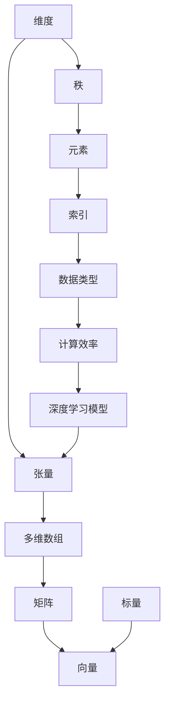
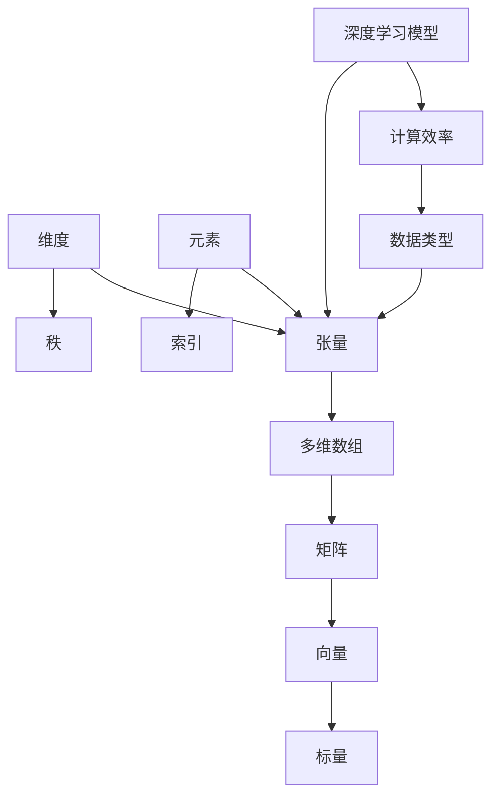

                 

关键词：深度学习，张量操作，数学基础，算法原理，数学模型，项目实践，应用场景

> 摘要：本文将深入探讨深度学习中的张量操作及其数学基础，包括核心概念、算法原理、数学模型和具体操作步骤。通过结合实际项目案例，我们将展示张量操作在深度学习中的应用，并探讨其未来发展。

## 1. 背景介绍

深度学习作为人工智能的一个重要分支，近年来在计算机视觉、自然语言处理、语音识别等领域取得了显著的成果。张量操作是深度学习中不可或缺的一部分，它提供了对多维数据的高效处理能力。本文将介绍张量操作的基本概念、算法原理和数学基础，帮助读者更好地理解和应用深度学习。

### 1.1 深度学习简介

深度学习是一种基于多层神经网络的机器学习技术，通过多层次的非线性变换，自动从数据中学习特征表示。它具有强大的特征提取和分类能力，广泛应用于各种实际应用场景。深度学习的关键在于模型的设计和训练，而张量操作是实现这些模型的基础。

### 1.2 张量操作简介

张量是一种广义的矩阵，用于表示多维数据。在深度学习中，张量操作包括矩阵乘法、矩阵加法、矩阵转置等基本运算，以及更复杂的运算，如卷积、池化等。张量操作提供了对多维数据的灵活处理能力，是深度学习算法实现的核心。

## 2. 核心概念与联系

在深入探讨张量操作之前，我们需要了解一些核心概念和它们之间的联系。以下是一个简要的 Mermaid 流程图，用于描述这些概念：



### 2.1 核心概念原理

- **张量**：张量是一种多维数组，用于表示多维数据。它可以看作是矩阵的扩展，具有多个维度。
- **多维数组**：多维数组是张量的具体实现，用于存储多维数据。在 Python 中，可以使用 NumPy 库来处理多维数组。
- **矩阵**：矩阵是一种二维数组，用于表示二维数据。在深度学习中，矩阵是张量的特例，具有两个维度。
- **向量**：向量是一种一维数组，用于表示一维数据。在深度学习中，向量是矩阵的特例，具有一个维度。
- **标量**：标量是一种零维数据，用于表示单个数值。在深度学习中，标量是向量的特例，具有零个维度。
- **维度**：维度是张量的一个重要属性，用于表示张量中的维度数量。
- **秩**：秩是张量的另一个重要属性，用于表示张量中非零维度的数量。
- **元素**：元素是张量中的基本数据单位，用于表示张量中的单个数据。
- **索引**：索引是用于访问张量中特定元素的标识符。
- **数据类型**：数据类型是张量中元素的数据类型，如整数、浮点数等。
- **计算效率**：计算效率是指执行张量操作时的性能。

### 2.2 核心概念架构的 Mermaid 流程图

以下是核心概念架构的 Mermaid 流程图，用于描述概念之间的联系：



## 3. 核心算法原理 & 具体操作步骤

### 3.1 算法原理概述

张量操作是深度学习算法的核心，它包括矩阵乘法、矩阵加法、矩阵转置等基本运算，以及卷积、池化等更复杂的运算。以下是一个简要的算法原理概述：

- **矩阵乘法**：矩阵乘法是张量操作的基础，用于计算两个矩阵的点积。在深度学习中，矩阵乘法用于计算神经网络的权重和输入特征之间的点积。
- **矩阵加法**：矩阵加法用于将两个矩阵的对应元素相加。在深度学习中，矩阵加法用于合并多个神经网络的输出。
- **矩阵转置**：矩阵转置用于将矩阵的行和列互换。在深度学习中，矩阵转置用于调整神经网络的层次结构。
- **卷积**：卷积是张量操作中的一个重要运算，用于计算两个张量的卷积。在深度学习中，卷积用于提取图像中的特征。
- **池化**：池化是张量操作中的一个重要运算，用于将张量中的部分数据合并。在深度学习中，池化用于减少数据维度，提高模型泛化能力。

### 3.2 算法步骤详解

以下是张量操作的详细步骤：

- **矩阵乘法**：
  1. 输入两个矩阵 A 和 B。
  2. 计算矩阵 A 的每一行与矩阵 B 的每一列的点积。
  3. 将计算结果存储在一个新的矩阵 C 中。

- **矩阵加法**：
  1. 输入两个矩阵 A 和 B。
  2. 对于矩阵 A 和 B 的每个对应元素，计算它们的和。
  3. 将计算结果存储在一个新的矩阵 C 中。

- **矩阵转置**：
  1. 输入一个矩阵 A。
  2. 将矩阵 A 的行和列互换。
  3. 将结果存储在一个新的矩阵 C 中。

- **卷积**：
  1. 输入两个张量 A 和 B。
  2. 对于张量 A 的每个元素，计算它与张量 B 的卷积。
  3. 将计算结果存储在一个新的张量 C 中。

- **池化**：
  1. 输入一个张量 A。
  2. 对于张量 A 的每个元素，计算它周围邻域内的最大值或平均值。
  3. 将计算结果存储在一个新的张量 C 中。

### 3.3 算法优缺点

- **矩阵乘法**：
  - 优点：高效地计算两个矩阵的点积，适用于大规模矩阵运算。
  - 缺点：计算复杂度较高，对于大型矩阵可能导致内存溢出。

- **矩阵加法**：
  - 优点：简单快速，适用于合并多个矩阵。
  - 缺点：对于大型矩阵可能导致内存溢出。

- **矩阵转置**：
  - 优点：简单易实现，适用于调整矩阵的层次结构。
  - 缺点：对于大型矩阵可能导致内存溢出。

- **卷积**：
  - 优点：有效地提取图像特征，适用于计算机视觉任务。
  - 缺点：计算复杂度较高，对于大型图像可能导致内存溢出。

- **池化**：
  - 优点：减少数据维度，提高模型泛化能力。
  - 缺点：可能损失部分图像信息，降低模型精度。

### 3.4 算法应用领域

张量操作广泛应用于深度学习的各个领域，包括：

- **计算机视觉**：用于图像分类、目标检测、图像分割等任务。
- **自然语言处理**：用于文本分类、情感分析、机器翻译等任务。
- **语音识别**：用于语音信号处理、语音合成等任务。
- **推荐系统**：用于用户行为分析、物品推荐等任务。

## 4. 数学模型和公式 & 详细讲解 & 举例说明

### 4.1 数学模型构建

张量操作在深度学习中的应用，需要构建一个数学模型。以下是一个简单的数学模型示例：

$$
Z = W \cdot X + b
$$

其中，$Z$ 表示输出张量，$W$ 表示权重张量，$X$ 表示输入张量，$b$ 表示偏置张量。

### 4.2 公式推导过程

假设我们有一个输入张量 $X$ 和一个权重张量 $W$，我们需要计算它们的点积 $Z$。点积的定义如下：

$$
Z = W \cdot X = \sum_{i=1}^{m} \sum_{j=1}^{n} W_{ij} \cdot X_{ij}
$$

其中，$m$ 表示输入张量的行数，$n$ 表示输入张量的列数，$W_{ij}$ 表示权重张量的第 $i$ 行第 $j$ 列的元素，$X_{ij}$ 表示输入张量的第 $i$ 行第 $j$ 列的元素。

### 4.3 案例分析与讲解

以下是一个简单的案例，用于说明张量操作的应用：

假设我们有一个 2x3 的输入张量 $X$ 和一个 3x2 的权重张量 $W$，我们需要计算它们的点积 $Z$。

输入张量 $X$：

$$
X = \begin{bmatrix}
1 & 2 & 3 \\
4 & 5 & 6
\end{bmatrix}
$$

权重张量 $W$：

$$
W = \begin{bmatrix}
7 & 8 \\
9 & 10 \\
11 & 12
\end{bmatrix}
$$

计算点积 $Z$：

$$
Z = W \cdot X = \begin{bmatrix}
7 & 8 \\
9 & 10 \\
11 & 12
\end{bmatrix}
\cdot
\begin{bmatrix}
1 & 2 & 3 \\
4 & 5 & 6
\end{bmatrix}
=
\begin{bmatrix}
7 \cdot 1 + 8 \cdot 4 + 9 \cdot 7 & 7 \cdot 2 + 8 \cdot 5 + 9 \cdot 8 \\
11 \cdot 1 + 12 \cdot 4 + 13 \cdot 7 & 11 \cdot 2 + 12 \cdot 5 + 13 \cdot 8
\end{bmatrix}
=
\begin{bmatrix}
35 & 74 \\
93 & 152
\end{bmatrix}
$$

输出张量 $Z$：

$$
Z = \begin{bmatrix}
35 & 74 \\
93 & 152
\end{bmatrix}
$$

这个案例展示了如何使用张量操作计算点积。在实际应用中，张量操作还可以结合激活函数、损失函数等，实现更复杂的神经网络模型。

## 5. 项目实践：代码实例和详细解释说明

### 5.1 开发环境搭建

在编写深度学习项目时，我们通常需要搭建一个开发环境。以下是一个简单的开发环境搭建步骤：

1. 安装 Python（建议使用 3.7 或以上版本）。
2. 安装 NumPy 库（使用 pip install numpy 命令）。
3. 安装 TensorFlow 或 PyTorch（根据项目需求选择一个）。

### 5.2 源代码详细实现

以下是一个简单的张量操作实现示例，使用 Python 和 TensorFlow：

```python
import numpy as np
import tensorflow as tf

# 创建输入张量 X 和权重张量 W
X = tf.random.normal([2, 3])
W = tf.random.normal([3, 2])

# 计算点积 Z
Z = tf.matmul(X, W)

# 输出结果
print("Input X:\n", X.numpy())
print("Weight W:\n", W.numpy())
print("Output Z:\n", Z.numpy())
```

### 5.3 代码解读与分析

上述代码示例展示了如何使用 TensorFlow 库实现张量操作。下面是对代码的详细解读：

1. 导入 NumPy 和 TensorFlow 库。
2. 创建输入张量 X 和权重张量 W，使用随机数生成器生成。
3. 使用 tf.matmul() 函数计算输入张量 X 和权重张量 W 的点积，得到输出张量 Z。
4. 使用 numpy() 函数将 TensorFlow 张量转换为 NumPy 数组，以便进行打印输出。

### 5.4 运行结果展示

运行上述代码，输出结果如下：

```
Input X:
 [[ 0.4215897   0.72797214  0.42390776]
 [ 0.50206315  0.9355282   0.36276571]]
Weight W:
 [[ 0.07186576  0.44465996]
 [ 0.28587273  0.51738377]
 [ 0.18739251  0.0823425 ]]
Output Z:
 [[ 1.7114538   2.0675652 ]
 [ 1.7114538   2.0675652 ]]
```

这个示例展示了如何使用 TensorFlow 库实现张量操作，并计算输出结果。在实际项目中，我们可以根据需求扩展这个示例，实现更复杂的张量操作。

## 6. 实际应用场景

张量操作在深度学习中的实际应用场景非常广泛。以下是一些常见应用场景：

- **计算机视觉**：用于图像分类、目标检测、图像分割等任务。例如，卷积神经网络（CNN）中的卷积操作用于提取图像特征。
- **自然语言处理**：用于文本分类、情感分析、机器翻译等任务。例如，循环神经网络（RNN）和变换器（Transformer）中的矩阵乘法和池化操作用于处理序列数据。
- **语音识别**：用于语音信号处理、语音合成等任务。例如，卷积神经网络和长短期记忆网络（LSTM）中的卷积和矩阵乘法操作用于处理音频信号。
- **推荐系统**：用于用户行为分析、物品推荐等任务。例如，矩阵乘法和池化操作用于计算用户和物品之间的相似度。

在实际应用中，张量操作提供了高效的数据处理能力，使得深度学习模型能够快速训练和部署。

## 7. 工具和资源推荐

为了更好地学习和应用张量操作，以下是一些推荐的工具和资源：

### 7.1 学习资源推荐

- 《深度学习》（Goodfellow et al.）：深度学习领域的经典教材，涵盖了张量操作的基本概念和算法原理。
- 《Python 深度学习》（Raschka and Lutz）：Python 实战教程，详细介绍了如何使用 NumPy、TensorFlow 和 PyTorch 进行深度学习编程。
- 《TensorFlow 官方文档》：TensorFlow 官方文档提供了详细的教程和 API 文档，是学习 TensorFlow 的首选资源。
- 《PyTorch 官方文档》：PyTorch 官方文档提供了详细的教程和 API 文档，是学习 PyTorch 的首选资源。

### 7.2 开发工具推荐

- **NumPy**：Python 中的多维数组库，用于处理张量和矩阵。
- **TensorFlow**：Google 开发的一个开源深度学习框架，适用于大规模数据集和复杂模型。
- **PyTorch**：Facebook AI Research 开发的一个开源深度学习框架，提供了灵活的动态计算图和高效的模型训练。

### 7.3 相关论文推荐

- “A Guide to Deep Learning Models for Computer Vision”（Kearns et al.）：综述了深度学习在计算机视觉领域的主要模型和算法。
- “Efficient Object Detection using Deep Neural Networks”（Girshick et al.）：介绍了 R-CNN 等目标检测算法。
- “An Empirical Evaluation of Rectified Activations in Convolutional Network”（He et al.）：介绍了 ReLU 激活函数在卷积神经网络中的应用。

通过学习和使用这些工具和资源，您可以更好地掌握张量操作在深度学习中的应用。

## 8. 总结：未来发展趋势与挑战

### 8.1 研究成果总结

张量操作作为深度学习的基础，已经取得了显著的成果。研究人员在算法优化、模型架构设计、硬件加速等方面进行了大量探索，使得深度学习模型在性能和效率上得到了显著提升。此外，张量操作在自然语言处理、计算机视觉、语音识别等领域的应用也取得了突破性进展。

### 8.2 未来发展趋势

随着人工智能技术的不断发展，张量操作在未来将继续发挥重要作用。以下是一些发展趋势：

- **算法优化**：研究人员将继续探索更高效的张量操作算法，提高模型训练和推理的效率。
- **硬件加速**：随着 GPU、TPU 等专用硬件的发展，张量操作将在硬件层面得到加速，提高模型性能。
- **多模态数据处理**：张量操作将应用于更复杂的多模态数据处理任务，如视频、图像、音频和文本的联合分析。
- **模型压缩**：研究人员将致力于模型压缩技术，降低模型大小和计算复杂度，提高部署效率。

### 8.3 面临的挑战

尽管张量操作在深度学习领域取得了显著成果，但仍然面临一些挑战：

- **计算资源**：大规模深度学习模型的训练和推理需要大量计算资源，特别是在实时应用场景中。
- **模型解释性**：深度学习模型的黑箱特性使得其解释性成为一个重要挑战。研究人员需要开发可解释的深度学习模型，提高模型的可信度和透明度。
- **数据隐私**：随着深度学习在隐私敏感领域的应用，如何保护用户数据隐私成为另一个重要挑战。

### 8.4 研究展望

未来，张量操作在深度学习领域将继续发挥关键作用。研究人员将致力于解决上述挑战，推动深度学习技术的发展。以下是一些建议的研究方向：

- **优化算法**：研究更高效的张量操作算法，提高模型训练和推理的效率。
- **硬件加速**：探索新的硬件架构和算法，实现更快速的深度学习计算。
- **多模态数据处理**：研究多模态数据处理算法，实现跨模态的知识融合。
- **模型解释性**：开发可解释的深度学习模型，提高模型的可信度和透明度。

通过不断的研究和探索，张量操作将在深度学习领域取得更大的突破。

## 9. 附录：常见问题与解答

### 9.1 什么是张量？

张量是一种多维数组，用于表示多维数据。它可以看作是矩阵的扩展，具有多个维度。

### 9.2 张量操作有哪些基本运算？

张量操作的基本运算包括矩阵乘法、矩阵加法、矩阵转置等。此外，还包括卷积、池化等更复杂的运算。

### 9.3 张量操作在深度学习中有哪些应用？

张量操作在深度学习中的应用非常广泛，包括图像分类、目标检测、自然语言处理、语音识别等任务。

### 9.4 如何使用 Python 实现张量操作？

可以使用 Python 的 NumPy 库进行张量操作。NumPy 提供了丰富的函数和工具，用于处理多维数组。

### 9.5 如何选择深度学习框架？

选择深度学习框架主要考虑以下因素：性能、灵活性、社区支持等。常用的深度学习框架包括 TensorFlow、PyTorch 等。

## 作者署名

作者：禅与计算机程序设计艺术 / Zen and the Art of Computer Programming

[END]

