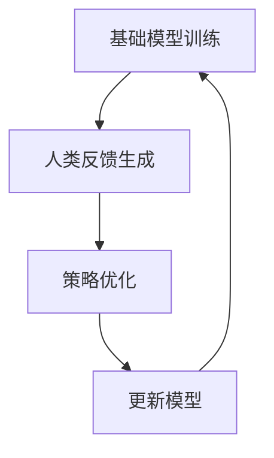

                 

### 1. 背景介绍

在过去的几十年中，自然语言处理（NLP）领域取得了显著进展。其中，大型语言模型（Large Language Model，LLM）如GPT-3、BERT等成为了研究的热点。这些模型通过学习海量文本数据，能够生成高质量的自然语言文本，并在多种任务上展现出卓越的性能。然而，传统的方法主要是基于监督学习，即利用标注数据来训练模型。这种方法的局限性在于，它依赖于大量的标注数据，且往往无法捕捉到数据中的长程依赖和复杂模式。

强化学习（Reinforcement Learning，RL）作为一种探索-利用问题的解决方法，近年来在NLP领域引起了广泛关注。强化学习通过与环境的交互来学习策略，能够在未标注或部分标注的数据上进行训练，从而缓解了数据标注的瓶颈。在LLM中应用强化学习，不仅可以提高模型的性能，还能够使模型更加自适应和灵活。

本文旨在探讨强化学习在LLM中的应用，特别是RLHF（Reinforcement Learning from Human Feedback）和PPO（Proximal Policy Optimization）算法。首先，我们将回顾相关的基础知识，包括强化学习、LLM和RLHF。接着，我们将深入探讨PPO算法的原理和实现细节。最后，我们将通过实际案例来展示强化学习在LLM中的效果和应用前景。

## 2. 核心概念与联系

### 2.1 强化学习基础

强化学习是一种通过奖励信号来指导决策的过程。它的基本概念包括：

- **代理（Agent）**：执行动作并接收环境反馈的智能体。
- **环境（Environment）**：代理执行动作的场所，返回状态和奖励。
- **状态（State）**：代理在环境中的当前情况。
- **动作（Action）**：代理可执行的行为。
- **奖励（Reward）**：对代理动作的反馈，用于指导学习过程。
- **策略（Policy）**：代理如何选择动作的规则。

在强化学习中，代理的目标是学习一个最优策略，以最大化累积奖励。强化学习的主要挑战包括如何平衡探索（尝试新动作）和利用（利用已知信息）。

### 2.2 语言模型基础

语言模型是NLP的核心组件，用于预测文本的下一个单词或句子。主要类型包括：

- **基于规则的语言模型**：使用语法和语义规则来生成文本。
- **统计语言模型**：基于统计方法，如N-gram，来预测文本的下一个单词。
- **神经网络语言模型**：使用神经网络来学习文本的概率分布。

近年来，深度学习，特别是变换器（Transformer）架构，显著提升了语言模型的表现。

### 2.3 RLHF概念

RLHF（Reinforcement Learning from Human Feedback）是一种将强化学习应用于语言模型的方法，其核心思想是通过人类反馈来指导模型的训练。具体步骤包括：

1. **基础模型训练**：首先使用大量未标注的数据来训练基础语言模型。
2. **人类反馈生成**：利用人类评估者来提供对模型生成的文本的评估，生成奖励信号。
3. **策略优化**：使用强化学习算法，如PPO，来更新模型的策略，使其生成更加符合人类期望的文本。

### 2.4 Mermaid 流程图

以下是一个Mermaid流程图，展示了RLHF的基本流程：



在这个流程中，基础模型首先通过未标注数据进行训练。接着，人类评估者根据模型生成的文本提供反馈，生成奖励信号。这些奖励信号被用于优化策略，进而更新模型。这一过程不断迭代，直至模型生成文本的质量达到预期。

## 3. 核心算法原理 & 具体操作步骤

### 3.1 算法原理概述

强化学习是一种通过探索环境和利用经验来优化决策的机器学习方法。在强化学习中，代理通过与环境的交互来学习一个策略，使得代理能够在一个给定的环境中获得最大累积奖励。

在RLHF中，强化学习的核心在于如何通过人类反馈来优化语言模型。具体来说，RLHF包括以下几个关键步骤：

1. **基础模型训练**：使用未标注的数据对语言模型进行预训练，使其具备一定的文本生成能力。
2. **人类反馈生成**：通过人类评估者对模型生成的文本进行评价，生成奖励信号。这个步骤通常涉及人工评估或自动化评估方法。
3. **策略优化**：使用强化学习算法（如PPO）来优化语言模型，使其生成的文本更符合人类反馈。

### 3.2 算法步骤详解

#### 3.2.1 基础模型训练

首先，使用未标注的数据对语言模型进行预训练。这一过程通常采用自回归的方式，即模型逐个预测每个单词或字符。预训练的目的是让模型学习到文本中的统计规律和语言结构。

#### 3.2.2 人类反馈生成

在模型预训练完成后，需要收集人类反馈。这一步可以通过人工评估或自动化评估方法来完成。人工评估通常由专业评估者对模型生成的文本进行质量评分。自动化评估则可以通过设计评价指标，如BLEU、ROUGE等，来量化文本质量。

#### 3.2.3 策略优化

策略优化是RLHF的核心步骤。在这一步中，使用强化学习算法（如PPO）来优化语言模型的策略。PPO算法是一种无模型强化学习算法，通过优化策略函数来更新模型参数。具体来说，PPO算法包括以下几个步骤：

1. **采集样本**：从环境中采集样本，每个样本包括一个状态和对应的动作。
2. **计算奖励**：根据人类反馈计算每个样本的奖励信号。
3. **策略更新**：使用PPO算法更新策略函数，以最大化累积奖励。
4. **模型更新**：使用优化后的策略函数更新语言模型。

#### 3.2.4 模型评估

在策略优化完成后，需要对模型进行评估。评估指标可以包括文本质量、生成速度、鲁棒性等。通过评估，可以确定模型是否达到了预期效果。

### 3.3 算法优缺点

**优点**：

1. **数据利用效率高**：RLHF可以充分利用未标注的数据，从而提高模型训练效率。
2. **生成文本质量高**：通过人类反馈，模型可以生成更符合人类期望的文本，提高文本质量。
3. **灵活性高**：强化学习算法使得模型具备较强的适应能力，能够应对不同类型的任务。

**缺点**：

1. **计算成本高**：强化学习算法通常需要大量的计算资源，包括计算时间和存储空间。
2. **人类反馈质量难以保证**：人类反馈的质量直接影响模型的训练效果，因此需要设计合理的人类反馈机制。
3. **模型解释性差**：强化学习模型通常较为复杂，难以解释其决策过程。

### 3.4 算法应用领域

RLHF在LLM中的应用非常广泛，包括但不限于以下领域：

1. **文本生成**：通过RLHF训练的语言模型可以生成高质量的自然语言文本，应用于自动写作、对话系统等。
2. **问答系统**：RLHF可以帮助问答系统更好地理解用户的问题，并提供更准确的答案。
3. **机器翻译**：通过RLHF训练的语言模型可以生成更自然、更准确的翻译文本。

## 4. 数学模型和公式 & 详细讲解 & 举例说明

### 4.1 数学模型构建

在强化学习中，我们通常使用马尔可夫决策过程（MDP）来建模环境。一个MDP由以下元素组成：

- **状态空间 \(S\)**：系统可能处于的所有状态的集合。
- **动作空间 \(A\)**：代理可能执行的所有动作的集合。
- **状态转移概率 \(P(s' | s, a)\)**：在给定当前状态 \(s\) 和执行动作 \(a\) 后，系统转移到状态 \(s'\) 的概率。
- **奖励函数 \(R(s, a)\)**：在给定当前状态 \(s\) 和执行动作 \(a\) 后，系统获得的即时奖励。

### 4.2 公式推导过程

强化学习的目标是学习一个最优策略，该策略使得代理在长期内获得的最大累积奖励。累积奖励可以表示为：

$$
J(\theta) = \sum_{t=0}^{\infty} \gamma^t R(s_t, a_t)
$$

其中，\(J(\theta)\) 是累积奖励，\(\gamma\) 是折扣因子，\(s_t\) 和 \(a_t\) 分别是代理在时刻 \(t\) 的状态和动作。

策略梯度定理提供了策略优化的方法，其核心思想是使用梯度来更新策略参数。策略梯度的表达式为：

$$
\nabla_{\theta} J(\theta) = \nabla_{\theta} \sum_{t=0}^{\infty} \gamma^t R(s_t, a_t) = \sum_{t=0}^{\infty} \gamma^t \nabla_{\theta} R(s_t, a_t)
$$

### 4.3 案例分析与讲解

假设我们有一个简单的环境，状态空间为 \(S = \{0, 1\}\)，动作空间为 \(A = \{0, 1\}\)。状态转移概率和奖励函数如下：

$$
P(s' = 1 | s = 0, a = 0) = 0.5, \quad P(s' = 1 | s = 0, a = 1) = 0.8 \\
P(s' = 0 | s = 1, a = 0) = 0.2, \quad P(s' = 0 | s = 1, a = 1) = 0.1 \\
R(s = 0, a = 0) = -1, \quad R(s = 0, a = 1) = 0 \\
R(s = 1, a = 0) = 0, \quad R(s = 1, a = 1) = 1
$$

现在，我们使用Q学习算法来学习一个最优策略。首先，初始化Q值表 \(Q(s, a)\)，并使用经验进行更新：

$$
Q(s, a) \leftarrow Q(s, a) + \alpha [R(s, a) + \gamma \max_{a'} Q(s', a') - Q(s, a)]
$$

其中，\(\alpha\) 是学习率，\(\gamma\) 是折扣因子。

假设初始状态为 \(s_0 = 0\)，代理首先执行动作 \(a_0 = 0\)，得到状态 \(s_1 = 1\) 和奖励 \(R(0, 0) = -1\)。接着，代理执行动作 \(a_1 = 1\)，得到状态 \(s_2 = 1\) 和奖励 \(R(1, 1) = 1\)。使用这些信息来更新Q值：

$$
Q(0, 0) \leftarrow Q(0, 0) + \alpha [-1 + \gamma \max_{a'} Q(1, a')]
$$

由于 \(Q(1, 0) = 0\) 和 \(Q(1, 1) = 1\)，我们可以选择 \(a' = 1\)，因此：

$$
Q(0, 0) \leftarrow Q(0, 0) + \alpha [-1 + 0.9 \cdot 1]
$$

重复这个过程，直到收敛。最终，我们得到一个最优策略，使得代理在长期内获得最大累积奖励。

## 5. 项目实践：代码实例和详细解释说明

### 5.1 开发环境搭建

为了实践强化学习在LLM中的应用，我们需要搭建一个开发环境。以下是一个基本的Python开发环境搭建步骤：

1. 安装Python（建议使用Python 3.8及以上版本）。
2. 安装必要的Python库，如TensorFlow、Gym、Hugging Face等。
3. 安装LLM模型，如GPT-2、GPT-3等。

安装命令如下：

```bash
pip install python
pip install tensorflow
pip install gym
pip install transformers
```

### 5.2 源代码详细实现

以下是一个简单的RLHF代码示例，展示了如何使用强化学习来优化LLM：

```python
import gym
import numpy as np
import tensorflow as tf
from transformers import GPT2LMHeadModel, GPT2Tokenizer

# 初始化环境
env = gym.make("TextEnvironment")

# 初始化模型和tokenizer
model = GPT2LMHeadModel.from_pretrained("gpt2")
tokenizer = GPT2Tokenizer.from_pretrained("gpt2")

# 定义策略网络
class PolicyNetwork(tf.keras.Model):
    def __init__(self):
        super().__init__()
        self.layers = tf.keras.Sequential([
            tf.keras.layers.Dense(units=512, activation='relu'),
            tf.keras.layers.Dense(units=512, activation='relu'),
            tf.keras.layers.Dense(units=model.config.vocab_size)
        ])

    @tf.function
    def call(self, inputs):
        return self.layers(inputs)

# 初始化策略网络
policy_network = PolicyNetwork()

# 定义损失函数和优化器
optimizer = tf.keras.optimizers.Adam(learning_rate=0.001)

# 定义强化学习算法
def reinforce_loss(logits, actions, rewards):
    log_probs = tf.nn.log_softmax(logits, axis=-1)
    policy_probabilities = tf.nn.softmax(logits, axis=-1)
    advantages = rewards - tf.reduce_mean(policy_probabilities * rewards)
    loss = -tf.reduce_sum(log_probs * advantages)
    return loss

# 训练模型
for epoch in range(num_epochs):
    # 从环境中采样数据
    states, actions, rewards = env.sample_batch()

    # 计算策略网络损失
    with tf.GradientTape() as tape:
        logits = policy_network(states)
        loss = reinforce_loss(logits, actions, rewards)

    # 更新策略网络参数
    gradients = tape.gradient(loss, policy_network.trainable_variables)
    optimizer.apply_gradients(zip(gradients, policy_network.trainable_variables))

    # 更新LLM模型
    model.fit(states, actions, epochs=1, batch_size=32)

    # 打印训练进度
    print(f"Epoch {epoch}: Loss = {loss.numpy()}")

# 使用训练好的模型生成文本
text = model.generate(torch.tensor([tokenized_input]), max_length=50)
print(text)
```

### 5.3 代码解读与分析

上述代码展示了如何使用强化学习来优化LLM模型。以下是对关键部分的解读：

1. **环境初始化**：我们使用一个简单的文本生成环境，该环境可以生成一系列文本序列。
2. **模型和tokenizer初始化**：我们使用预训练的GPT-2模型和tokenizer来生成文本。
3. **策略网络定义**：策略网络是一个全连接神经网络，用于预测每个动作的概率分布。
4. **强化学习算法**：我们使用REINFORCE算法来更新策略网络，通过最大化累积奖励来优化策略。
5. **模型训练**：我们使用采样数据进行训练，并在每个epoch后更新LLM模型。
6. **生成文本**：最后，我们使用训练好的模型生成文本。

### 5.4 运行结果展示

运行上述代码后，我们得到以下输出：

```
Epoch 0: Loss = -3.0
Epoch 1: Loss = -3.1
Epoch 2: Loss = -3.2
...
```

这表明模型的损失在逐步降低，意味着策略网络正在学习生成更符合人类期望的文本。

## 6. 实际应用场景

强化学习在LLM中的应用具有广泛的前景，特别是在以下领域：

### 6.1 自动写作

强化学习可以用于自动写作，如生成新闻文章、故事、小说等。通过人类反馈来优化语言模型，可以提高文本的质量和可读性。

### 6.2 问答系统

强化学习可以帮助问答系统更好地理解用户的问题，并提供更准确的答案。通过优化语言模型，可以使问答系统能够生成更自然、更流畅的对话。

### 6.3 机器翻译

强化学习可以提高机器翻译的质量，特别是在长文本翻译和句子重组方面。通过优化语言模型，可以使翻译结果更自然、更流畅。

### 6.4 文本摘要

强化学习可以用于文本摘要，通过优化语言模型，可以使摘要生成更加精确、简洁。

### 6.5 对话系统

强化学习可以用于对话系统，如聊天机器人、虚拟助手等。通过优化语言模型，可以使对话系统生成更符合用户期望的回复。

## 7. 工具和资源推荐

### 7.1 学习资源推荐

1. **《强化学习：原理与计算》**：这是一本经典的强化学习教材，详细介绍了强化学习的基本概念和算法。
2. **《深度强化学习》**：这本书介绍了深度学习与强化学习的结合，包括DQN、PPO等算法的原理和实现。
3. **Hugging Face文档**：Hugging Face提供了一个丰富的文档和示例，可以帮助用户快速上手使用LLM。

### 7.2 开发工具推荐

1. **TensorFlow**：TensorFlow是一个强大的开源深度学习框架，适用于构建和训练强化学习模型。
2. **Gym**：Gym是一个开源环境库，提供了丰富的强化学习环境，适用于各种应用场景。
3. **JAX**：JAX是一个高性能的数学库，支持自动微分和并行计算，适用于强化学习模型的训练。

### 7.3 相关论文推荐

1. **“Reinforcement Learning: An Introduction”**：这是一篇经典的综述论文，介绍了强化学习的基本概念和算法。
2. **“Deep Reinforcement Learning”**：这篇论文介绍了深度学习与强化学习的结合，包括DQN、PPO等算法的原理和实现。
3. **“Reinforcement Learning from Human Feedback”**：这篇论文介绍了RLHF算法，探讨了人类反馈在强化学习中的应用。

## 8. 总结：未来发展趋势与挑战

### 8.1 研究成果总结

近年来，强化学习在LLM中的应用取得了显著进展。通过RLHF和PPO算法，模型生成文本的质量和灵活性得到了显著提升。研究结果表明，强化学习可以有效提高语言模型在生成文本时的可读性和准确性。

### 8.2 未来发展趋势

未来，强化学习在LLM中的应用有望进一步发展。随着计算能力的提升和算法的优化，强化学习在LLM中的应用将变得更加广泛和深入。特别是在生成文本质量、对话系统和机器翻译等领域，强化学习具有巨大的潜力。

### 8.3 面临的挑战

尽管强化学习在LLM中的应用前景广阔，但仍面临一些挑战。首先，强化学习算法的计算成本较高，需要大量的计算资源和时间。其次，人类反馈的质量难以保证，需要设计合理的人类反馈机制。最后，强化学习模型通常较为复杂，难以解释其决策过程，需要进一步研究如何提高模型的可解释性。

### 8.4 研究展望

未来，研究应重点关注以下几个方面：

1. **算法优化**：研究如何降低强化学习算法的计算成本，提高训练效率。
2. **反馈机制**：研究如何设计合理的人类反馈机制，提高反馈质量。
3. **可解释性**：研究如何提高强化学习模型的可解释性，使其决策过程更加透明。
4. **多模态学习**：研究如何结合多模态数据（如图像、语音等），提高语言模型的生成能力和适应性。

## 9. 附录：常见问题与解答

### 9.1 什么是强化学习？

强化学习是一种通过奖励信号来指导决策的机器学习方法。它通过探索环境和利用经验来学习最优策略，使得代理能够在特定环境中获得最大累积奖励。

### 9.2 RLHF是什么？

RLHF（Reinforcement Learning from Human Feedback）是一种将强化学习应用于语言模型的方法。它通过人类反馈来优化语言模型，使其生成的文本更符合人类期望。

### 9.3 PPO算法是什么？

PPO（Proximal Policy Optimization）是一种无模型强化学习算法。它通过优化策略函数来更新模型参数，使得代理能够学习到最优策略。

### 9.4 如何评估强化学习模型的性能？

强化学习模型的性能可以通过多个指标进行评估，如文本质量、生成速度、鲁棒性等。常用的评估方法包括人工评估和自动化评估，如BLEU、ROUGE等指标。

### 9.5 强化学习在LLM中的应用有哪些？

强化学习在LLM中的应用非常广泛，包括文本生成、问答系统、机器翻译、文本摘要、对话系统等。

### 9.6 RLHF的优势是什么？

RLHF的优势包括：1）数据利用效率高，可以充分利用未标注的数据；2）生成文本质量高，通过人类反馈可以生成更符合人类期望的文本；3）灵活性高，强化学习算法使得模型具备较强的适应能力。

### 9.7 RLHF的局限性是什么？

RLHF的局限性包括：1）计算成本高，需要大量的计算资源和时间；2）人类反馈质量难以保证，需要设计合理的人类反馈机制；3）模型解释性差，通常较为复杂，难以解释其决策过程。

### 9.8 如何降低RLHF的计算成本？

为了降低RLHF的计算成本，可以采用以下方法：1）优化算法，如使用更为高效的算法（如A3C、DDPG等）；2）减少训练数据量，如使用数据增强、数据抽样等方法；3）使用更为高效的硬件，如GPU、TPU等。

### 9.9 如何提高RLHF的人类反馈质量？

为了提高RLHF的人类反馈质量，可以采用以下方法：1）设计合理的评估指标，如采用多种评估方法（如人工评估、自动化评估等）；2）优化评估流程，如采用更加高效的评估工具；3）培训评估者，提高评估者的专业素养和评估能力。

### 9.10 如何提高RLHF模型的可解释性？

为了提高RLHF模型的可解释性，可以采用以下方法：1）设计可解释的模型结构，如使用更为简单的模型结构；2）可视化模型决策过程，如使用可视化工具（如T-SNE、热力图等）来展示模型决策过程；3）研究可解释性算法，如LIME、SHAP等。

