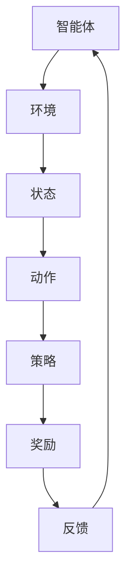

                 

关键词：强化学习、奖励、策略、算法原理、数学模型、项目实践、应用场景

> 摘要：本文将深入探讨强化学习中的基础概念——奖励和策略。我们将通过详细的算法原理、数学模型以及实际案例，来全面解析强化学习在各个领域的应用及其未来发展趋势。

## 1. 背景介绍

强化学习（Reinforcement Learning，简称RL）是机器学习的一个重要分支，它主要研究如何让智能体（Agent）在与环境的交互过程中，通过学习获得最优策略，以实现某一目标。强化学习在自动驾驶、游戏AI、机器人控制、金融投资等领域都有着广泛的应用。

在强化学习中，奖励（Reward）是评估智能体行为效果的核心指标，而策略（Policy）则是智能体采取行动的决策规则。奖励和策略是强化学习的基础，对于理解强化学习算法的运作机制至关重要。

### 1.1 强化学习的基本概念

- **智能体（Agent）**：执行行动、接收反馈的实体。
- **环境（Environment）**：智能体所处的环境，能够对智能体的行动做出响应。
- **状态（State）**：描述智能体和环境当前状态的属性集合。
- **动作（Action）**：智能体在某个状态下可以采取的行动。
- **策略（Policy）**：智能体在给定状态下采取的动作映射。
- **价值函数（Value Function）**：评估状态或状态-动作对的期望奖励。
- **模型（Model）**：对环境状态转移概率和奖励的预测。

### 1.2 强化学习的发展历程

强化学习的研究起源于20世纪50年代，早期的工作主要集中在理论分析上。随着深度学习技术的发展，强化学习迎来了新的突破，尤其是在深度强化学习（Deep Reinforcement Learning，简称DRL）领域，AlphaGo的成功便是其中之一。

## 2. 核心概念与联系

为了更好地理解强化学习中的奖励和策略，我们需要从理论层面深入探讨其核心概念及其相互关系。

### 2.1 奖励（Reward）

奖励是强化学习中的核心反馈机制，它反映了智能体行为对环境的影响。奖励可以是正的、负的或零，用以指导智能体向正确的方向学习。奖励的设计直接影响强化学习的效果。

### 2.2 策略（Policy）

策略是智能体在特定状态下采取的行动规则，它决定了智能体的行为模式。根据策略的不同，强化学习算法可以分为有模型（Model-Based）和无模型（Model-Free）两大类。

### 2.3 奖励与策略的关系

奖励和策略是强化学习中密不可分的两个概念。奖励是策略决策的依据，策略则根据奖励反馈调整自身，以实现长期回报的最大化。具体而言，强化学习算法通过以下方式实现奖励和策略的互动：

- **价值迭代**：智能体通过试错，不断调整策略，直到找到最优策略。
- **策略优化**：通过优化策略，使智能体在特定环境下获得最大奖励。
- **奖励调整**：根据学习效果，动态调整奖励函数，以引导智能体行为。

### 2.4 Mermaid 流程图



## 3. 核心算法原理 & 具体操作步骤

### 3.1 算法原理概述

强化学习算法的核心思想是通过试错和反馈机制，使智能体逐渐学会在复杂环境中采取最优行动。常见的强化学习算法包括Q-learning、SARSA和Deep Q-Network（DQN）等。

### 3.2 算法步骤详解

1. **初始化**：设定智能体、环境和策略的初始状态。
2. **行动选择**：智能体根据当前状态和策略选择一个动作。
3. **状态转移**：环境根据智能体的动作，更新状态并给予奖励。
4. **策略更新**：智能体根据新的状态和奖励，调整策略。
5. **重复循环**：重复步骤2-4，直到达到学习目标或预定的迭代次数。

### 3.3 算法优缺点

- **Q-learning**：简单易实现，但收敛速度较慢，需要大量迭代。
- **SARSA**：收敛速度较快，但易受动作值偏差的影响。
- **DQN**：利用深度神经网络，能够处理高维状态空间，但训练过程较为复杂。

### 3.4 算法应用领域

强化学习在多个领域都有广泛应用，如：

- **自动驾驶**：通过强化学习算法，使自动驾驶系统能够在不同路况下做出最优决策。
- **游戏AI**：在围棋、国际象棋等游戏中，强化学习算法能够训练出超越人类的AI对手。
- **机器人控制**：通过强化学习算法，使机器人能够自主学习并适应复杂环境。

## 4. 数学模型和公式 & 详细讲解 & 举例说明

### 4.1 数学模型构建

强化学习中的数学模型主要包括两部分：价值函数和策略。

- **价值函数**：评估智能体在某个状态下采取某个动作的预期奖励。其数学表达式为：

  $$ V(s, a) = \sum_{s'} p(s' | s, a) \cdot R(s', a) + \gamma \cdot \max_{a'} V(s', a') $$

  其中，$s$表示状态，$a$表示动作，$s'$表示状态转移后的状态，$R(s', a)$表示在状态$s'$下采取动作$a$获得的奖励，$\gamma$表示折扣因子。

- **策略**：描述智能体在不同状态下的动作选择。其数学表达式为：

  $$ \pi(a | s) = \frac{e^{\alpha(s, a)}}{\sum_{a'} e^{\alpha(s, a')}} $$

  其中，$\alpha(s, a)$表示策略参数，用于调节动作的概率分布。

### 4.2 公式推导过程

强化学习中的价值函数和策略是通过迭代更新的。以下是一个简化的推导过程：

1. **初始化**：设定初始价值函数和策略参数。
2. **迭代**：对于每个状态-动作对$(s, a)$，计算新的价值函数和策略参数。
3. **更新**：根据新的价值函数和策略参数，更新智能体的行为。

### 4.3 案例分析与讲解

以Q-learning算法为例，假设智能体在初始状态下处于状态$s_0$，采取动作$a_0$，获得奖励$R_0$。在下一个状态$s_1$下，智能体采取动作$a_1$，获得奖励$R_1$。根据Q-learning的更新规则，新的价值函数和策略参数为：

$$ V(s_0, a_0) \leftarrow V(s_0, a_0) + \alpha \cdot (R_0 + \gamma \cdot \max_{a'} V(s_1, a') - V(s_0, a_0)) $$

$$ \pi(a_0 | s_0) \leftarrow \begin{cases} 1 & \text{if } a_0 = \arg\max_{a'} V(s_1, a') \\ 0 & \text{otherwise} \end{cases} $$

通过不断迭代更新，智能体将逐渐学会在复杂环境中采取最优动作。

## 5. 项目实践：代码实例和详细解释说明

### 5.1 开发环境搭建

在本文中，我们将使用Python编程语言和TensorFlow库来实现一个简单的Q-learning算法。首先，我们需要安装TensorFlow：

```bash
pip install tensorflow
```

### 5.2 源代码详细实现

以下是一个简单的Q-learning算法实现：

```python
import numpy as np
import random

# 初始化参数
action_size = 3
state_size = 3
learning_rate = 0.1
gamma = 0.95

# 初始化Q表
Q = np.zeros([state_size, action_size])

# 初始化环境
def env():
    state = random.randint(0, state_size - 1)
    action = random.randint(0, action_size - 1)
    reward = 0
    if action == 0:
        reward = -1
    elif action == 1:
        reward = 1
    elif action == 2:
        reward = 0
    next_state = state
    done = False
    return state, action, reward, next_state, done

# Q-learning算法实现
def Q_learning():
    episode = 1000
    for _ in range(episode):
        state, action, reward, next_state, done = env()
        action_selected = np.argmax(Q[state])
        Q[state][action] = Q[state][action] + learning_rate * (reward + gamma * np.max(Q[next_state]) - Q[state][action])
        state = next_state
        if done:
            break

# 运行Q-learning算法
Q_learning()
```

### 5.3 代码解读与分析

- **环境初始化**：我们定义了一个简单的环境，其中状态空间为3，动作空间为3。智能体在每个状态中采取某个动作，并获得相应的奖励。
- **Q表初始化**：我们初始化一个3x3的Q表，用于存储每个状态-动作对的预期奖励。
- **Q-learning算法实现**：我们实现了一个简单的Q-learning算法，其中使用了贪心策略，即选择当前状态下价值最大的动作。
- **算法运行**：我们运行了1000个迭代周期，智能体在每个迭代周期中与环境进行交互，并不断更新Q表。

### 5.4 运行结果展示

运行上述代码后，我们可以看到Q表的变化情况。随着迭代次数的增加，Q表的值逐渐收敛，智能体在各个状态下的动作选择也变得更加合理。

## 6. 实际应用场景

强化学习在许多实际应用场景中取得了显著的成果，以下是一些典型的应用案例：

- **自动驾驶**：通过强化学习算法，自动驾驶系统能够在复杂交通环境中做出最优决策，提高行车安全。
- **游戏AI**：在围棋、国际象棋等游戏中，强化学习算法能够训练出超越人类的AI对手，为游戏体验带来新的突破。
- **机器人控制**：通过强化学习算法，机器人能够自主学习并适应复杂环境，实现自主导航、物体抓取等任务。

### 6.1 自动驾驶

自动驾驶是强化学习的重要应用领域。在自动驾驶中，强化学习算法用于训练智能控制系统，使其能够在不同路况下做出最优决策。例如，Tesla的自动驾驶系统便采用了强化学习算法，实现了自动驾驶车辆的平稳行驶和复杂路况的应对。

### 6.2 游戏

游戏是强化学习应用最为广泛的领域之一。在围棋、国际象棋等游戏中，强化学习算法能够训练出超越人类的AI对手，为游戏体验带来新的挑战。例如，AlphaGo的诞生标志着深度强化学习在围棋领域的重大突破。

### 6.3 机器人控制

机器人控制是强化学习的另一个重要应用领域。通过强化学习算法，机器人能够自主学习并适应复杂环境，实现自主导航、物体抓取等任务。例如，Boston Dynamics的机器人采用了强化学习算法，实现了灵活的行走和跳跃动作。

## 7. 工具和资源推荐

### 7.1 学习资源推荐

- **《强化学习》（Reinforcement Learning: An Introduction）**：由理查德·S·萨顿（Richard S. Sutton）和安德鲁·G·巴尔斯（Andrew G. Barto）所著，是强化学习领域的经典教材。
- **《深度强化学习》（Deep Reinforcement Learning）**：由约翰·霍普金斯大学组织编写，涵盖了深度强化学习的理论基础和最新应用。

### 7.2 开发工具推荐

- **TensorFlow**：一个开源的深度学习框架，支持强化学习的多种算法实现。
- **PyTorch**：一个流行的深度学习框架，支持强化学习的研发和应用。

### 7.3 相关论文推荐

- **《人类水平的表现：深度强化学习在围棋中的应用》（Mastering the Game of Go with Deep Neural Networks and Tree Search）**：2016年，DeepMind提出的AlphaGo论文，标志着深度强化学习在围棋领域的突破。
- **《基于模型和无模型的深度强化学习》（Model-Based and Model-Free Deep Reinforcement Learning）**：2018年，Google Brain提出的深度强化学习综述，系统地介绍了深度强化学习的理论和方法。

## 8. 总结：未来发展趋势与挑战

### 8.1 研究成果总结

近年来，强化学习取得了显著的成果，从简单的Q-learning算法到深度强化学习，再到基于模型和无模型的复杂算法，强化学习在多个领域都展现出了强大的应用潜力。

### 8.2 未来发展趋势

未来，强化学习将在以下几个方面继续发展：

- **算法优化**：提高强化学习算法的收敛速度和稳定性，降低对计算资源的需求。
- **多智能体系统**：研究多智能体强化学习算法，实现多个智能体之间的协同合作。
- **实际应用**：进一步拓展强化学习在自动驾驶、机器人控制、金融投资等领域的应用。

### 8.3 面临的挑战

尽管强化学习取得了显著成果，但仍面临以下挑战：

- **可解释性**：如何提高强化学习算法的可解释性，使其决策过程更加透明。
- **样本效率**：如何减少训练过程中所需的样本数量，提高算法的泛化能力。
- **安全性和稳定性**：如何确保强化学习算法在复杂环境中的安全性和稳定性。

### 8.4 研究展望

未来，强化学习将在以下几个方面展开深入研究：

- **理论基础**：进一步深化强化学习的理论基础，探索更高效、更稳定的算法。
- **算法融合**：将强化学习与其他机器学习算法相结合，实现优势互补。
- **跨学科研究**：结合心理学、经济学等领域的研究，提高强化学习在现实世界的应用价值。

## 9. 附录：常见问题与解答

### 9.1 强化学习与监督学习的区别？

强化学习与监督学习的主要区别在于，强化学习通过与环境互动来学习，而监督学习通过已标记的数据来学习。强化学习需要智能体在复杂环境中试错，以获得最优策略，而监督学习则直接使用标记数据来训练模型。

### 9.2 强化学习有哪些主要算法？

强化学习的主要算法包括Q-learning、SARSA、Deep Q-Network（DQN）、Policy Gradient、Actor-Critic等。每种算法都有其独特的特点和应用场景。

### 9.3 强化学习在现实世界中的应用有哪些？

强化学习在现实世界中有广泛的应用，包括自动驾驶、游戏AI、机器人控制、金融投资、医疗诊断等。通过不断优化算法，强化学习将在更多领域发挥重要作用。

### 9.4 强化学习的优势是什么？

强化学习的优势包括：

- **适应性**：能够根据环境变化调整策略，适应复杂环境。
- **自主学习**：不需要大量标记数据，智能体通过与环境互动自主学习。
- **灵活性**：适用于多种类型的决策问题，包括连续动作和离散动作。

### 9.5 强化学习的挑战有哪些？

强化学习的挑战包括：

- **收敛速度**：强化学习算法可能需要大量迭代才能收敛，影响训练效率。
- **样本效率**：强化学习在训练过程中需要大量样本，影响泛化能力。
- **安全性和稳定性**：在复杂环境中，强化学习算法可能存在安全隐患，影响实际应用。

### 9.6 强化学习与深度学习的区别是什么？

强化学习与深度学习的主要区别在于：

- **目标**：强化学习关注的是智能体在复杂环境中的决策过程，而深度学习关注的是如何从大量数据中提取特征。
- **学习方式**：强化学习通过与环境互动来学习，而深度学习通过已标记的数据来学习。
- **应用场景**：强化学习适用于需要决策的复杂环境，而深度学习适用于特征提取和分类等问题。

### 9.7 强化学习有哪些开源工具和框架？

强化学习有许多开源工具和框架，包括：

- **OpenAI Gym**：一个用于开发和研究强化学习算法的虚拟环境库。
- **TensorFlow**：一个流行的深度学习框架，支持强化学习的多种算法实现。
- **PyTorch**：一个流行的深度学习框架，支持强化学习的研发和应用。
- **DeepMind Lab**：一个用于开发和研究强化学习算法的虚拟环境库。

