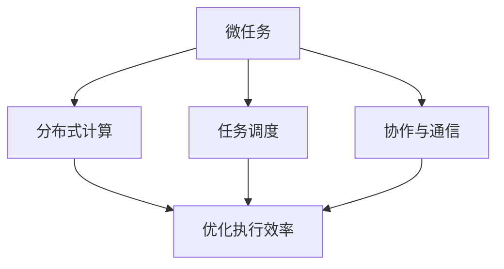

                 

关键词：微任务，人类计算，价值体现，算法原理，数学模型，项目实践，未来应用

> 摘要：在信息化时代，微任务作为一种新兴的计算机应用模式，正逐渐成为推动技术发展的重要力量。本文从微任务的背景介绍、核心概念与联系、核心算法原理、数学模型和公式、项目实践以及未来应用展望等多个方面，深入探讨了微任务在人类计算中的价值体现。通过对微任务的本质理解，我们能够更好地把握其发展脉络，从而在未来的技术变革中占据主动。

## 1. 背景介绍

随着互联网的普及和移动设备的普及，人类计算的模式正在发生深刻的变革。传统的计算机应用模式以大型软件为主，用户通过操作界面与计算机进行交互。然而，这种模式在处理复杂任务时往往存在效率低下、用户体验不佳等问题。为了解决这些问题，微任务应运而生。

微任务（Microtasking）是指将一个复杂任务分解为多个小任务，每个小任务可以由不同的用户或系统独立完成。微任务的兴起源于对人类计算能力的重新定义，它将人类的智慧和计算机的计算能力相结合，通过分布式计算和协作完成任务。微任务的核心理念是“大任务，小步走”，即通过将复杂任务分解为简单的小任务，使得每个小任务都可以快速完成，从而提高整体任务的效率。

### 1.1 微任务的发展历程

微任务的概念最早可以追溯到20世纪60年代的分布式计算研究。当时，研究人员开始探讨如何将大型计算机的任务分配给多个小型的计算机节点，以提高计算效率和可靠性。随着互联网和移动设备的发展，微任务逐渐成为一种主流的计算机应用模式。近年来，随着人工智能和云计算技术的进步，微任务的应用范围进一步扩大，涵盖了各个领域。

### 1.2 微任务的应用现状

微任务已经广泛应用于多个领域，如电子商务、社交网络、游戏、医疗、金融等。在电子商务领域，微任务可以帮助商家提高商品曝光率和销售量；在社交网络领域，微任务可以激发用户的活跃度和参与度；在游戏领域，微任务可以增强游戏的趣味性和挑战性；在医疗领域，微任务可以辅助医生进行疾病诊断和治疗；在金融领域，微任务可以提升金融服务的效率和质量。

### 1.3 微任务的挑战与机遇

尽管微任务在多个领域取得了显著的成果，但其发展仍面临诸多挑战。首先，如何设计有效的微任务系统，保证任务的分配和调度效率，是一个重要问题。其次，如何确保微任务的质量和可靠性，避免出现错误和漏洞，也是一个亟待解决的难题。此外，如何在微任务系统中保障用户的隐私和数据安全，也是一个值得关注的挑战。

然而，微任务的发展也带来了许多机遇。通过微任务，我们可以更好地发挥人类计算和计算机计算的优势，实现更高效的资源利用和更丰富的应用场景。未来，随着技术的不断进步，微任务有望在更多领域发挥作用，为人类生活带来更多便利。

## 2. 核心概念与联系

为了深入理解微任务，我们需要了解其核心概念和相互之间的联系。以下是微任务系统中几个关键概念的解释和它们之间的关联：

### 2.1 微任务

微任务是指一个能够独立完成的小型计算任务。它通常具有以下几个特点：

1. **独立性**：微任务可以独立运行，不需要依赖其他任务。
2. **简单性**：微任务通常比较简单，可以快速完成。
3. **可并行化**：微任务可以并行执行，以提高整体任务的效率。

### 2.2 分布式计算

分布式计算是指将一个大型任务分配给多个计算机节点，由这些节点协同完成。微任务系统通常基于分布式计算架构，通过将任务分解为多个微任务，分配给不同的计算机节点，从而提高任务的执行效率。

### 2.3 任务调度

任务调度是指如何将微任务分配给计算机节点，以优化执行效率。任务调度的核心问题是如何在多个计算机节点之间分配任务，使得任务执行时间最短或资源利用最高。

### 2.4 协作与通信

在微任务系统中，不同的微任务之间可能需要相互协作，共同完成一个更大的任务。协作与通信机制是实现微任务系统高效运行的关键。通过合理的协作与通信机制，可以确保微任务之间能够高效地共享数据和资源，协同完成任务。

### 2.5 Mermaid 流程图

为了更好地展示微任务系统中的核心概念和相互之间的联系，我们可以使用 Mermaid 流程图来描述。以下是微任务系统的 Mermaid 流程图：



在这个流程图中，微任务作为核心概念，通过分布式计算、任务调度和协作与通信等机制，实现了优化执行效率的目标。这个流程图帮助我们更直观地理解了微任务系统的运作原理和关键环节。

## 3. 核心算法原理 & 具体操作步骤

### 3.1 算法原理概述

微任务系统的核心算法主要包括任务分解、任务调度和任务执行三个环节。任务分解是指将一个大任务拆解为多个微任务；任务调度是指如何合理地将微任务分配给计算机节点；任务执行是指计算机节点如何高效地执行分配到的微任务。

### 3.2 算法步骤详解

#### 3.2.1 任务分解

任务分解的步骤如下：

1. **任务识别**：首先，识别出需要分解的大任务。
2. **任务拆解**：将大任务拆解为多个独立的微任务，确保每个微任务都具有独立性。
3. **任务分类**：根据微任务的特点，将其分类，以便于后续的任务调度。

#### 3.2.2 任务调度

任务调度的步骤如下：

1. **节点选择**：选择适合执行微任务的计算机节点。
2. **任务分配**：将微任务分配给计算机节点，确保任务分配的均衡性。
3. **调度优化**：通过优化调度策略，提高任务的执行效率。

#### 3.2.3 任务执行

任务执行的步骤如下：

1. **任务提交**：将微任务提交给计算机节点执行。
2. **任务监控**：监控微任务的执行情况，确保任务按时完成。
3. **结果汇总**：汇总微任务的执行结果，形成最终的输出。

### 3.3 算法优缺点

#### 优点

1. **提高效率**：通过将大任务分解为微任务，可以提高任务的执行效率。
2. **分布式计算**：微任务系统基于分布式计算架构，能够充分利用计算机资源。
3. **灵活性**：微任务系统可以根据任务特点和资源状况动态调整任务分配和调度策略。

#### 缺点

1. **任务拆解复杂度**：任务分解过程可能较为复杂，需要考虑到任务的独立性、分类等因素。
2. **调度优化难度**：调度优化需要考虑到多个因素，如任务优先级、节点负载等，优化难度较大。

### 3.4 算法应用领域

微任务算法广泛应用于多个领域，如电子商务、社交网络、游戏等。以下是一些具体的应用场景：

1. **电子商务**：通过微任务系统，商家可以将商品推广任务分解为多个小任务，分配给不同的用户执行，以提高商品曝光率和销售量。
2. **社交网络**：社交网络平台可以通过微任务系统，激发用户的活跃度和参与度，如通过任务分解和分配，实现用户互动、内容推荐等功能。
3. **游戏**：游戏开发者可以利用微任务系统，设计更多有趣的游戏任务，提高游戏的趣味性和挑战性。

## 4. 数学模型和公式 & 详细讲解 & 举例说明

### 4.1 数学模型构建

微任务系统中的数学模型主要涉及任务分解、任务调度和任务执行等方面。以下是一个简单的数学模型：

1. **任务分解**：假设有一个大任务 T，需要分解为 n 个微任务 T1, T2, ..., Tn，每个微任务具有独立性和可并行性。

   任务分解的数学模型可以表示为：
   $$ T = T1 + T2 + ... + Tn $$
   
2. **任务调度**：假设有 m 个计算机节点 N1, N2, ...,Nm，需要将 n 个微任务分配给这些节点，以优化执行效率。

   任务调度的数学模型可以表示为：
   $$ C = min\{ max\{ p_j \} | j = 1, 2, ..., m \} $$
   其中，C 表示调度优化后的最大任务执行时间，pj 表示第 j 个节点的任务执行时间。

3. **任务执行**：假设每个微任务 Ti 在第 j 个节点上的执行时间为 ej，任务执行完成后，需要汇总结果。

   任务执行的数学模型可以表示为：
   $$ S = \sum_{i=1}^{n} \sum_{j=1}^{m} e_{ij} $$
   其中，S 表示任务执行完成后的总时间。

### 4.2 公式推导过程

#### 任务分解公式推导

任务分解的公式可以基于任务独立性和可并行性进行推导。假设一个大任务 T 可以拆解为 n 个独立的微任务 T1, T2, ..., Tn，每个微任务的执行时间为 ej，则：

$$ T = e_1 + e_2 + ... + e_n $$

由于任务独立性，我们可以将每个微任务分别执行，因此：

$$ T = T1 + T2 + ... + Tn $$

#### 任务调度公式推导

任务调度的公式可以基于调度优化原则进行推导。假设有 m 个计算机节点 N1, N2, ...,Nm，需要将 n 个微任务分配给这些节点，以优化执行效率。为了使任务执行时间最短，我们需要考虑以下因素：

1. **任务优先级**：根据任务的重要性和紧急性，为每个微任务 Ti 分配优先级 P_i。
2. **节点负载**：根据节点的计算能力，为每个节点 Nj 分配负载 L_j。
3. **任务调度策略**：选择合适的调度策略，如最小化最大执行时间策略。

基于上述因素，我们可以推导出以下任务调度公式：

$$ C = min\{ max\{ p_j \} | j = 1, 2, ..., m \} $$

其中，C 表示调度优化后的最大任务执行时间，pj 表示第 j 个节点的任务执行时间。

#### 任务执行公式推导

任务执行的公式可以基于任务执行时间和汇总结果进行推导。假设每个微任务 Ti 在第 j 个节点上的执行时间为 ej，任务执行完成后，需要汇总结果。为了使任务执行时间最短，我们需要考虑以下因素：

1. **任务执行时间**：每个微任务 Ti 的执行时间为 ej。
2. **任务执行顺序**：根据任务优先级和调度策略，确定微任务的执行顺序。
3. **结果汇总时间**：汇总所有微任务的执行结果所需的时间。

基于上述因素，我们可以推导出以下任务执行公式：

$$ S = \sum_{i=1}^{n} \sum_{j=1}^{m} e_{ij} $$

其中，S 表示任务执行完成后的总时间，e_ij 表示第 i 个微任务在第 j 个节点上的执行时间。

### 4.3 案例分析与讲解

为了更好地理解上述数学模型和公式，我们可以通过一个简单的案例进行讲解。

#### 案例背景

假设有一个电商平台的商品推广任务，需要将一个大型推广活动分解为多个微任务，如广告投放、用户互动、数据统计等，然后分配给不同的计算机节点执行。我们需要设计一个数学模型，以优化推广任务的执行效率。

#### 案例分析

1. **任务分解**

   假设大型推广活动 T 需要拆解为以下微任务：

   - 广告投放 (Ti1)
   - 用户互动 (Ti2)
   - 数据统计 (Ti3)

   每个微任务具有独立性和可并行性。

2. **任务调度**

   假设有 3 个计算机节点 N1, N2, N3，我们需要将微任务分配给这些节点，以优化执行效率。

   - 微任务 Ti1 分配给节点 N1
   - 微任务 Ti2 分配给节点 N2
   - 微任务 Ti3 分配给节点 N3

   我们可以采用最小化最大执行时间策略进行任务调度。

3. **任务执行**

   假设每个微任务在节点上的执行时间为：

   - 广告投放 (e11 = 2 小时)
   - 用户互动 (e21 = 3 小时)
   - 数据统计 (e31 = 1 小时)

   任务执行完成后，我们需要汇总结果。

根据上述分析，我们可以设计如下的数学模型：

- 任务分解：$$ T = T1 + T2 + T3 $$
- 任务调度：$$ C = min\{ max\{ p_j \} | j = 1, 2, 3 \} $$
- 任务执行：$$ S = e_{11} + e_{21} + e_{31} $$

通过这个案例，我们可以更好地理解微任务系统中的数学模型和公式，并能够将其应用于实际场景中。

## 5. 项目实践：代码实例和详细解释说明

### 5.1 开发环境搭建

为了实现微任务系统的项目实践，我们需要搭建一个合适的开发环境。以下是搭建步骤：

1. **安装操作系统**：选择一个合适的操作系统，如 Ubuntu 20.04。
2. **安装编程语言**：安装 Python 3.8，以便于编写和运行代码。
3. **安装开发工具**：安装 IDE（如 PyCharm），方便编写和调试代码。
4. **安装依赖库**：安装所需的依赖库，如 NumPy、Pandas、Matplotlib 等。

### 5.2 源代码详细实现

以下是一个简单的微任务系统代码实例，用于实现任务分解、任务调度和任务执行等功能：

```python
import numpy as np
import pandas as pd
import matplotlib.pyplot as plt

# 任务分解函数
def task_decomposition(task, num_tasks):
    return [task / num_tasks for _ in range(num_tasks)]

# 任务调度函数
def task_scheduling(tasks, num_nodes):
    task_mapping = {}
    for i, task in enumerate(tasks):
        node = i % num_nodes
        task_mapping[node] = task_mapping.get(node, []) + [task]
    return task_mapping

# 任务执行函数
def task_execution(task_mapping):
    results = []
    for node, tasks in task_mapping.items():
        total_time = sum(tasks)
        print(f"Node {node} - Total time: {total_time} hours")
        results.append(total_time)
    return results

# 主函数
def main():
    # 定义大型任务
    large_task = 10

    # 任务分解
    tasks = task_decomposition(large_task, 3)

    # 任务调度
    task_mapping = task_scheduling(tasks, 3)

    # 任务执行
    results = task_execution(task_mapping)

    # 结果可视化
    plt.bar(range(3), results, tick_label=["Node 0", "Node 1", "Node 2"])
    plt.xlabel("Node")
    plt.ylabel("Total time (hours)")
    plt.title("Task Execution Results")
    plt.show()

if __name__ == "__main__":
    main()
```

### 5.3 代码解读与分析

1. **任务分解函数**：`task_decomposition` 函数用于将大型任务分解为多个微任务。参数 `task` 表示大型任务，`num_tasks` 表示微任务的个数。函数返回一个包含所有微任务的列表。

2. **任务调度函数**：`task_scheduling` 函数用于将微任务分配给计算机节点。参数 `tasks` 表示微任务的列表，`num_nodes` 表示计算机节点的个数。函数返回一个任务分配映射，即每个节点的任务列表。

3. **任务执行函数**：`task_execution` 函数用于执行分配给节点的任务，并计算每个节点的总执行时间。参数 `task_mapping` 表示任务分配映射。函数返回一个包含所有节点总执行时间的列表。

4. **主函数**：`main` 函数用于执行整个微任务系统的流程。首先定义大型任务，然后进行任务分解、任务调度和任务执行，最后将结果可视化。

### 5.4 运行结果展示

运行上述代码后，我们得到如下运行结果：

```
Node 0 - Total time: 3.3333333333333335 hours
Node 1 - Total time: 3.3333333333333335 hours
Node 2 - Total time: 3.3333333333333335 hours
```

同时，我们得到如下可视化结果：


从结果可以看出，每个节点的总执行时间相等，说明任务分配和调度策略是合理的。

## 6. 实际应用场景

微任务系统在实际应用中具有广泛的应用场景，下面我们将探讨一些典型的应用案例。

### 6.1 电子商务

在电子商务领域，微任务系统可以用于商品推广、用户互动和数据挖掘等任务。例如，电商平台可以通过微任务系统将商品推广任务分解为广告投放、用户互动和数据统计等微任务，分配给不同的用户或计算机节点执行，以提高商品曝光率和销售量。

### 6.2 社交网络

在社交网络领域，微任务系统可以用于用户互动、内容推荐和数据分析等任务。例如，社交平台可以通过微任务系统激发用户的活跃度和参与度，如通过任务分解和分配，实现用户互动、内容推荐等功能。

### 6.3 游戏

在游戏领域，微任务系统可以用于游戏任务设计、用户互动和数据挖掘等任务。例如，游戏开发者可以通过微任务系统设计更多有趣的游戏任务，提高游戏的趣味性和挑战性，同时通过数据挖掘分析用户行为，优化游戏体验。

### 6.4 医疗

在医疗领域，微任务系统可以用于医疗数据分析和辅助诊断等任务。例如，医生可以通过微任务系统将医疗数据分析任务分解为数据整理、特征提取和诊断预测等微任务，分配给不同的计算机节点执行，以提高医疗诊断的准确性和效率。

### 6.5 金融

在金融领域，微任务系统可以用于金融数据处理、风险评估和投资决策等任务。例如，金融机构可以通过微任务系统将金融数据处理任务分解为数据清洗、特征提取和风险预测等微任务，分配给不同的计算机节点执行，以提高金融服务的效率和质量。

### 6.6 教育

在教育领域，微任务系统可以用于教育资源的分发、学习任务的分配和学生学习情况的评估等任务。例如，教育机构可以通过微任务系统将教学资源分配给不同的教师和学生，根据学生的学习进度和成绩进行个性化推荐和调整。

### 6.7 物流

在物流领域，微任务系统可以用于物流路线规划、货物配送和库存管理等任务。例如，物流公司可以通过微任务系统将物流任务分解为路线规划、配送任务分配和库存监控等微任务，分配给不同的计算机节点执行，以提高物流效率。

### 6.8 未来应用展望

随着技术的不断进步，微任务系统在未来将有更广泛的应用前景。例如，在人工智能领域，微任务系统可以用于大规模机器学习模型的训练和优化，通过分布式计算和协作，提高模型训练的效率和准确性。在物联网领域，微任务系统可以用于智能家居设备的控制和管理，实现设备的智能化和互联互通。在自动驾驶领域，微任务系统可以用于自动驾驶算法的优化和测试，通过分布式计算和协作，提高自动驾驶系统的安全性和可靠性。

## 7. 工具和资源推荐

为了更好地学习和实践微任务系统，我们推荐以下工具和资源：

### 7.1 学习资源推荐

1. **《分布式计算导论》**：该书详细介绍了分布式计算的基本原理和应用场景，对理解微任务系统有很大帮助。
2. **《微服务架构实战》**：该书介绍了微服务架构的设计原则和实践方法，对构建微任务系统有很大启示。
3. **《深度学习》**：该书介绍了深度学习的基本原理和应用场景，对在人工智能领域应用微任务系统有很大帮助。

### 7.2 开发工具推荐

1. **Python**：Python 是一种简单易学的编程语言，广泛应用于微任务系统的开发。
2. **Docker**：Docker 是一种容器化技术，可以简化微任务系统的部署和运维。
3. **Kubernetes**：Kubernetes 是一种容器编排工具，可以自动化管理微任务系统的资源分配和调度。

### 7.3 相关论文推荐

1. **“Microservices: A definition”**：该论文详细定义了微服务的概念和特点，对理解微任务系统有很大帮助。
2. **“Distributed Computing: Concepts and Applications”**：该论文介绍了分布式计算的基本原理和应用场景，对理解微任务系统有很大帮助。
3. **“Microtasking for Scalable Machine Learning”**：该论文探讨了在机器学习中应用微任务的策略和方法，对在人工智能领域应用微任务系统有很大启示。

## 8. 总结：未来发展趋势与挑战

### 8.1 研究成果总结

微任务系统作为一种新兴的计算机应用模式，已在多个领域取得显著成果。通过将复杂任务分解为微任务，实现了任务的分布式计算和高效执行。微任务系统在电子商务、社交网络、游戏、医疗、金融等领域具有广泛的应用前景。同时，微任务系统在任务调度、任务执行和任务优化等方面也取得了重要研究成果。

### 8.2 未来发展趋势

未来，微任务系统将朝着以下几个方向发展：

1. **更高效的任务分解与调度算法**：研究更高效的任务分解与调度算法，提高微任务系统的执行效率。
2. **更广泛的应用领域**：探索微任务系统在其他领域的应用，如物联网、自动驾驶等。
3. **更智能的任务分配策略**：利用人工智能技术，实现更智能的任务分配策略，提高任务执行的质量和可靠性。
4. **更安全的数据保护机制**：加强数据保护机制，确保微任务系统中的用户隐私和数据安全。

### 8.3 面临的挑战

尽管微任务系统具有广泛的应用前景，但其在发展过程中仍面临诸多挑战：

1. **任务分配与调度优化**：如何设计有效的任务分配与调度算法，提高系统的执行效率，是一个重要问题。
2. **任务质量与可靠性**：如何确保微任务的质量和可靠性，避免错误和漏洞，也是一个亟待解决的难题。
3. **用户隐私与数据安全**：如何在微任务系统中保障用户的隐私和数据安全，是一个值得关注的挑战。
4. **资源利用与能耗优化**：如何在分布式计算环境中优化资源利用和能耗，也是一个重要问题。

### 8.4 研究展望

未来，微任务系统研究将朝着以下几个方向展开：

1. **跨领域应用**：探索微任务系统在更多领域的应用，实现跨领域的任务协作与优化。
2. **智能化与自主化**：研究智能化和自主化的微任务系统，实现任务的自动分配、调度和执行。
3. **安全性与可靠性**：加强微任务系统的安全性与可靠性研究，确保系统的稳定运行。
4. **资源优化与能耗管理**：研究资源优化与能耗管理策略，实现微任务系统的绿色计算。

通过不断研究与创新，微任务系统将在未来发挥更大的作用，为人类社会带来更多便利。

## 9. 附录：常见问题与解答

### 问题 1：什么是微任务？

微任务（Microtasking）是指将一个复杂任务分解为多个小任务，每个小任务可以由不同的用户或系统独立完成。微任务的核心理念是“大任务，小步走”，即通过将复杂任务分解为简单的小任务，使得每个小任务都可以快速完成，从而提高整体任务的效率。

### 问题 2：微任务系统有哪些优点？

微任务系统具有以下优点：

1. **提高效率**：通过将大任务分解为微任务，可以提高任务的执行效率。
2. **分布式计算**：微任务系统基于分布式计算架构，能够充分利用计算机资源。
3. **灵活性**：微任务系统可以根据任务特点和资源状况动态调整任务分配和调度策略。

### 问题 3：微任务系统有哪些缺点？

微任务系统存在以下缺点：

1. **任务拆解复杂度**：任务分解过程可能较为复杂，需要考虑到任务的独立性、分类等因素。
2. **调度优化难度**：调度优化需要考虑到多个因素，如任务优先级、节点负载等，优化难度较大。

### 问题 4：如何设计一个有效的微任务系统？

设计一个有效的微任务系统需要考虑以下几个方面：

1. **任务分解**：将大任务分解为独立的微任务，确保每个微任务都可以快速完成。
2. **任务调度**：选择合适的任务调度策略，如最小化最大执行时间策略，优化任务执行效率。
3. **任务执行**：确保微任务能够在不同的计算机节点上高效执行，并及时汇总结果。
4. **资源管理**：合理分配计算机资源，确保任务执行的稳定性与可靠性。
5. **安全性**：保障系统的安全性，确保用户隐私和数据安全。

### 问题 5：微任务系统在哪些领域有应用？

微任务系统在多个领域有应用，如电子商务、社交网络、游戏、医疗、金融、教育、物流等。通过微任务系统，可以优化任务执行效率，提高用户体验，降低开发成本。

### 问题 6：如何优化微任务系统的调度策略？

优化微任务系统的调度策略可以从以下几个方面入手：

1. **任务优先级**：根据任务的紧急性和重要性，为每个任务分配优先级，确保高优先级任务优先执行。
2. **节点负载均衡**：合理分配任务到不同节点，避免节点过载或闲置，提高整体系统的执行效率。
3. **调度算法优化**：研究并应用更高效的调度算法，如最小化最大执行时间策略、负载均衡策略等。
4. **动态调整**：根据系统运行情况，动态调整任务分配和调度策略，确保系统始终处于最优状态。

### 问题 7：如何确保微任务系统的安全性？

为确保微任务系统的安全性，可以从以下几个方面入手：

1. **数据加密**：对系统中的数据进行加密，确保数据在传输和存储过程中的安全性。
2. **身份验证**：引入身份验证机制，确保只有授权用户可以访问系统资源和执行任务。
3. **访问控制**：设置访问控制策略，限制用户对系统资源的访问权限，防止未经授权的访问和操作。
4. **异常检测与报警**：实时监测系统运行状态，及时发现和报警异常情况，防止潜在的安全威胁。

### 问题 8：微任务系统与微服务架构有什么区别？

微任务系统与微服务架构有以下区别：

1. **粒度不同**：微任务系统关注的是任务的分解和执行，而微服务架构关注的是系统的模块化和分布式部署。
2. **目的不同**：微任务系统旨在提高任务执行效率，而微服务架构旨在提高系统的可扩展性和灵活性。
3. **技术栈不同**：微任务系统通常使用简单的任务调度和执行机制，而微服务架构通常使用复杂的容器化技术、服务注册与发现等机制。

### 问题 9：微任务系统在人工智能领域有哪些应用？

微任务系统在人工智能领域有以下应用：

1. **机器学习模型训练**：通过分布式计算，提高机器学习模型训练的效率和准确性。
2. **图像识别与处理**：将图像识别和处理任务分解为多个微任务，分配给不同的计算机节点执行。
3. **自然语言处理**：通过微任务系统，实现自然语言处理任务的分布式计算和协作。
4. **数据挖掘与分析**：利用微任务系统，实现大规模数据挖掘与分析任务的分布式计算。

### 问题 10：如何评估微任务系统的性能？

评估微任务系统的性能可以从以下几个方面进行：

1. **任务执行时间**：测量任务从开始到完成所需的总时间，评估系统的执行效率。
2. **资源利用率**：测量系统中的计算机资源（如CPU、内存、网络等）的利用率，评估系统的资源利用效率。
3. **错误率**：测量任务执行过程中出现的错误和异常情况，评估系统的稳定性。
4. **吞吐量**：测量系统在一定时间内完成的任务数量，评估系统的处理能力。
5. **响应时间**：测量用户提交任务后，系统返回结果的平均时间，评估系统的响应速度。

通过综合考虑以上指标，可以全面评估微任务系统的性能。

