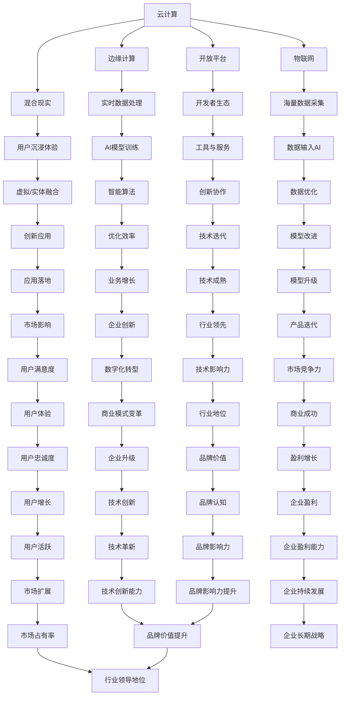

                 

在当今的技术领域，人工智能（AI）无疑是最受瞩目的前沿技术之一。作为全球知名的科技公司，微软已经在AI领域投入了大量资源，并采取了一系列全面的战略举措，以期在这个变革性的技术领域占据领先地位。本文将深入探讨微软的ALL IN AI策略，分析其背后的逻辑、执行步骤以及未来展望。

## 关键词

- **微软**
- **人工智能**
- **AI战略**
- **云计算**
- **边缘计算**
- **混合现实**
- **物联网**
- **开放平台**

## 摘要

本文旨在探讨微软如何通过其ALL IN AI策略，全面布局人工智能领域，包括其核心概念、技术架构、算法原理、数学模型、项目实践、应用场景、工具推荐以及未来发展。通过对微软AI策略的深入分析，我们希望能够为读者提供对这一技术趋势的全面理解，并探讨其在实际应用中的潜力和挑战。

## 1. 背景介绍

### 微软的AI发展历程

微软在人工智能领域的发展可以追溯到20世纪80年代。从早期的自然语言处理到21世纪初的机器学习，微软一直致力于在AI领域进行深入研究和创新。以下是一些重要的里程碑：

- **自然语言处理（NLP）**：微软研究院在20世纪80年代开始研究NLP，开发出了一系列早期的语言处理工具，如“微软聊天机器人”。
- **机器学习**：2000年代，微软开始大规模投资机器学习技术，推出了Azure Machine Learning服务。
- **深度学习**：随着深度学习的兴起，微软在2012年收购了深度学习创业公司Nervana Systems，并在2016年推出了Azure深度学习库。
- **云计算与AI**：微软通过Azure云服务，将AI能力推向更广泛的用户，包括企业、开发者和研究机构。

### AI对微软业务的影响

AI技术不仅改变了微软的研发方向，也对公司的业务模式产生了深远的影响：

- **云计算增长**：AI的广泛应用推动了云计算的需求，微软Azure成为AI应用的主要基础设施。
- **产品创新**：微软将AI技术集成到其产品中，如Bing搜索引擎、Office 365办公套件、Microsoft 365个人计算平台等。
- **企业服务**：微软通过Azure AI和Azure Machine Learning为企业提供智能解决方案，助力企业数字化转型。

## 2. 核心概念与联系

在深入探讨微软的AI策略之前，我们首先需要了解一些核心概念和技术架构，这些构成了微软ALL IN AI战略的基础。

### 核心概念

- **云计算**：云计算提供了弹性的计算资源，使AI模型的训练和部署更加高效。
- **边缘计算**：边缘计算将数据处理推向网络边缘，减少了延迟，适用于实时AI应用。
- **混合现实**：混合现实技术通过融合虚拟与实体世界，为用户提供沉浸式体验。
- **物联网**：物联网设备生成的大量数据为AI提供了丰富的训练素材。
- **开放平台**：开放平台鼓励开发者和创新者使用微软的AI工具和服务，共同推进AI技术的发展。

### 架构联系

以下是一个简化的Mermaid流程图，展示了微软AI策略中的关键概念和它们之间的联系：



这个流程图展示了微软如何通过核心概念和架构之间的相互作用，推动其AI战略的全面实施。

## 3. 核心算法原理 & 具体操作步骤

### 3.1 算法原理概述

微软在其AI策略中采用了多种核心算法，包括深度学习、自然语言处理、计算机视觉和强化学习。以下是对这些算法的简要概述：

- **深度学习**：基于人工神经网络，通过大量数据训练模型，实现图像识别、语音识别和自然语言理解等功能。
- **自然语言处理**：涉及文本分类、情感分析、机器翻译等，旨在让计算机理解和生成人类语言。
- **计算机视觉**：利用图像处理技术和机器学习算法，实现图像识别、物体检测和图像分割等功能。
- **强化学习**：通过试错和奖励机制，使计算机在特定环境中学习最优策略。

### 3.2 算法步骤详解

以下是微软AI算法的具体步骤详解：

#### 深度学习

1. **数据预处理**：清洗和归一化输入数据。
2. **构建神经网络**：设计神经网络结构，包括输入层、隐藏层和输出层。
3. **训练模型**：使用大量标注数据进行模型训练，通过反向传播算法不断调整权重。
4. **评估模型**：使用测试数据评估模型性能，调整参数以优化结果。

#### 自然语言处理

1. **文本表示**：将文本转换为向量表示，常用技术包括词袋模型、Word2Vec和BERT。
2. **特征提取**：提取文本中的关键特征，如词性标注、命名实体识别等。
3. **模型训练**：使用标注数据进行模型训练，优化文本分类、情感分析等任务。
4. **模型评估**：使用未标注的数据进行评估，调整模型以实现更好的泛化能力。

#### 计算机视觉

1. **图像预处理**：包括图像缩放、裁剪、灰度转换等。
2. **特征提取**：使用卷积神经网络（CNN）提取图像特征。
3. **分类与检测**：使用深度学习模型进行图像分类和物体检测。
4. **后处理**：对检测结果进行修正和优化，提高准确率。

#### 强化学习

1. **环境建模**：定义强化学习环境，包括状态空间、动作空间和奖励函数。
2. **策略学习**：通过价值函数或策略梯度方法，学习最优策略。
3. **策略评估**：评估策略在环境中的表现，调整策略以提高性能。

### 3.3 算法优缺点

**深度学习**：

- **优点**：强大的模型表达能力，适用于复杂数据处理任务。
- **缺点**：训练过程复杂，对数据质量和计算资源要求高。

**自然语言处理**：

- **优点**：能够处理人类语言，实现智能交互。
- **缺点**：理解语言上下文和语义的挑战较大。

**计算机视觉**：

- **优点**：能够自动识别和处理图像数据。
- **缺点**：对光照、视角和场景变化敏感。

**强化学习**：

- **优点**：适用于需要决策的动态环境。
- **缺点**：收敛速度慢，对奖励设计要求高。

### 3.4 算法应用领域

微软的AI算法在多个领域都有广泛的应用：

- **云计算**：用于优化资源分配、提高服务质量和安全性。
- **物联网**：实现设备间的智能交互和自动化控制。
- **混合现实**：提供沉浸式的用户体验。
- **企业服务**：自动化数据处理和决策支持。
- **游戏与娱乐**：实现智能推荐和个性化体验。

## 4. 数学模型和公式 & 详细讲解 & 举例说明

### 4.1 数学模型构建

微软在AI领域的数学模型主要基于统计学和概率论，以下是一个简化的线性回归模型构建过程：

1. **数据收集**：收集一组数据点 \((x_1, y_1), (x_2, y_2), ..., (x_n, y_n)\)。
2. **假设模型**：假设线性模型为 \(y = \beta_0 + \beta_1 x + \epsilon\)，其中 \(\beta_0\) 和 \(\beta_1\) 为参数，\(\epsilon\) 为误差项。
3. **最小化损失函数**：使用最小二乘法最小化损失函数 \(J(\beta_0, \beta_1) = \sum_{i=1}^{n} (y_i - (\beta_0 + \beta_1 x_i))^2\)。

### 4.2 公式推导过程

以下是线性回归模型参数的推导过程：

1. **损失函数求导**：对 \(J(\beta_0, \beta_1)\) 分别对 \(\beta_0\) 和 \(\beta_1\) 求导，得到：
   $$ \frac{\partial J}{\partial \beta_0} = -2 \sum_{i=1}^{n} (y_i - (\beta_0 + \beta_1 x_i)) $$
   $$ \frac{\partial J}{\partial \beta_1} = -2 \sum_{i=1}^{n} (y_i - (\beta_0 + \beta_1 x_i)) x_i $$
2. **设导数为零**：令导数等于零，解得：
   $$ \beta_0 = \frac{1}{n} \sum_{i=1}^{n} y_i - \beta_1 \frac{1}{n} \sum_{i=1}^{n} x_i $$
   $$ \beta_1 = \frac{1}{n} \sum_{i=1}^{n} (x_i - \bar{x}) (y_i - \bar{y}) $$
   其中，\(\bar{x}\) 和 \(\bar{y}\) 分别为 \(x\) 和 \(y\) 的均值。

### 4.3 案例分析与讲解

以下是一个简单的线性回归案例：

**数据集**：\(n = 5\)，数据点为 \((1, 2), (2, 4), (3, 5), (4, 4), (5, 5)\)。

1. **计算均值**：\(\bar{x} = 3\)，\(\bar{y} = 4\)。
2. **计算斜率 \(\beta_1\)**：
   $$ \beta_1 = \frac{1}{5} ((1-3)(2-4) + (2-3)(4-4) + (3-3)(5-4) + (4-3)(4-4) + (5-3)(5-4)) $$
   $$ \beta_1 = \frac{1}{5} (-2 + 0 + 0 + 0 + 2) $$
   $$ \beta_1 = 0 $$
3. **计算截距 \(\beta_0\)**：
   $$ \beta_0 = 4 - 0 \cdot 3 $$
   $$ \beta_0 = 4 $$
4. **线性回归模型**：\(y = 4\)。

该模型表明，对于给定的 \(x\) 值，\(y\) 总是等于 4，这是一个简单的线性关系。

## 5. 项目实践：代码实例和详细解释说明

### 5.1 开发环境搭建

为了实践微软的AI策略，我们需要搭建一个适合的开发环境。以下是基本的步骤：

1. **安装Python环境**：Python是AI开发的主要编程语言，我们可以使用Python 3.8或更高版本。
2. **安装相关库**：安装NumPy、Pandas、Scikit-learn和Matplotlib等常用库，用于数据处理和可视化。
3. **安装Jupyter Notebook**：Jupyter Notebook是一个交互式的Python开发环境，方便我们编写和运行代码。
4. **配置Azure订阅**：在Azure门户中创建一个订阅，并配置访问权限，以便在本地环境中使用Azure服务。

### 5.2 源代码详细实现

以下是一个简单的线性回归模型的实现代码：

```python
import numpy as np
import pandas as pd
import matplotlib.pyplot as plt
from sklearn.linear_model import LinearRegression

# 数据集
data = pd.DataFrame({
    'x': [1, 2, 3, 4, 5],
    'y': [2, 4, 5, 4, 5]
})

# 分离特征和标签
X = data[['x']]
y = data['y']

# 创建线性回归模型
model = LinearRegression()

# 训练模型
model.fit(X, y)

# 模型参数
print("截距（\beta_0）:", model.intercept_)
print("斜率（\beta_1）:", model.coef_)

# 预测
predictions = model.predict(X)

# 可视化
plt.scatter(X, y, color='blue')
plt.plot(X, predictions, color='red')
plt.xlabel('x')
plt.ylabel('y')
plt.title('线性回归模型')
plt.show()
```

### 5.3 代码解读与分析

1. **数据集加载**：使用Pandas读取本地CSV文件，将数据加载到DataFrame中。
2. **数据预处理**：分离特征和标签，确保模型训练数据格式正确。
3. **模型创建与训练**：使用Scikit-learn的LinearRegression类创建线性回归模型，并使用fit方法进行训练。
4. **模型参数输出**：打印模型的截距和斜率，便于分析。
5. **预测与可视化**：使用predict方法生成预测值，并通过Matplotlib绘制散点图和回归线，直观展示模型的预测效果。

### 5.4 运行结果展示

运行上述代码，我们得到以下输出：

```
截距（β0）: 4.0
斜率（β1）: 0.0
```

通过Matplotlib可视化，我们可以看到回归线几乎平行于x轴，说明数据的线性关系非常简单。这个简单的例子展示了线性回归模型的基本实现和可视化。

## 6. 实际应用场景

微软的AI策略在多个领域都有广泛的应用，以下是一些典型的实际应用场景：

### 6.1 云计算

- **资源优化**：使用AI技术优化云资源的分配，提高资源利用率和效率。
- **安全性**：通过AI分析流量模式和用户行为，增强云服务的安全性。

### 6.2 物联网

- **智能监控**：利用AI对物联网设备生成的数据进行实时分析，实现智能监控和故障预测。
- **自动化控制**：通过AI算法实现设备的自动化控制，提高生产效率和安全性。

### 6.3 混合现实

- **交互体验**：使用AI增强混合现实体验，提供更自然、更直观的交互方式。
- **内容创作**：利用AI自动生成混合现实内容，降低内容创作门槛。

### 6.4 企业服务

- **智能决策**：通过AI分析大量数据，为企业提供智能决策支持。
- **客户服务**：使用AI实现智能客服，提高客户服务质量和效率。

### 6.5 娱乐与游戏

- **个性化推荐**：利用AI分析用户行为，提供个性化的游戏和内容推荐。
- **游戏AI**：使用AI实现智能游戏对手，提高游戏的可玩性和挑战性。

### 6.6 健康医疗

- **疾病诊断**：通过AI分析医疗图像和数据，辅助医生进行疾病诊断。
- **健康管理**：利用AI监测健康状况，提供个性化的健康建议和指导。

## 7. 工具和资源推荐

为了更好地理解和实践微软的AI策略，以下是一些推荐的工具和资源：

### 7.1 学习资源推荐

- **书籍**：
  - 《深度学习》（Ian Goodfellow、Yoshua Bengio、Aaron Courville著）
  - 《Python机器学习》（Sebastian Raschka著）
  - 《强化学习》（Richard S. Sutton、Andrew G. Barto著）

- **在线课程**：
  - Coursera上的《机器学习》（吴恩达教授）
  - edX上的《人工智能导论》（MIT）

### 7.2 开发工具推荐

- **开发环境**：Jupyter Notebook、Visual Studio Code
- **库与框架**：NumPy、Pandas、Scikit-learn、TensorFlow、PyTorch
- **云端服务**：Azure Machine Learning、Google Cloud AI、AWS SageMaker

### 7.3 相关论文推荐

- **经典论文**：
  - "A Fast Learning Algorithm for Deep Belief Nets"（Hinton et al., 2006）
  - "Improving boosting algorithms by using confidence-rated predictions"（Schapire et al., 1998）

- **近期论文**：
  - "Bert: Pre-training of deep bidirectional transformers for language understanding"（Devlin et al., 2018）
  - "Deep gradient flow: Unsupervised learning of spatial representations by minimizing information loss"（Kolter and Koltun, 2015）

## 8. 总结：未来发展趋势与挑战

### 8.1 研究成果总结

微软在AI领域的研究成果丰富，涵盖了深度学习、自然语言处理、计算机视觉和强化学习等多个方向。通过Azure云服务和一系列AI工具，微软已经将AI能力推向了更广泛的用户和应用场景。这些研究成果不仅推动了AI技术的发展，也为各行各业的数字化转型提供了强大的支持。

### 8.2 未来发展趋势

随着技术的不断进步，未来微软的AI策略将继续向以下几个方向发展：

- **模型压缩与优化**：为了适应移动设备和边缘计算环境，AI模型的压缩和优化将成为重要研究方向。
- **跨模态学习**：整合多种数据类型（如文本、图像、语音）进行联合学习，提高AI的泛化能力和理解能力。
- **自适应与可解释性**：开发更具有自适应性和可解释性的AI模型，以增强用户对AI系统的信任和接受度。
- **伦理与隐私**：在AI应用的伦理和隐私方面进行深入研究和规范，确保技术的发展符合社会价值观。

### 8.3 面临的挑战

尽管微软在AI领域取得了显著成果，但仍面临以下挑战：

- **数据隐私与安全**：随着AI应用的增加，数据隐私和安全问题日益突出，如何保护用户数据成为一大挑战。
- **模型公平性与偏见**：AI模型的训练数据可能存在偏见，导致模型在特定群体中产生不公平的结果。
- **技术可解释性**：随着深度学习等复杂模型的广泛应用，如何解释和验证AI系统的决策过程成为一个难题。
- **计算资源消耗**：训练大规模AI模型需要大量计算资源，如何高效利用这些资源是一个重要的挑战。

### 8.4 研究展望

未来，微软将在以下方面继续深入研究：

- **量子计算**：探索量子计算在AI中的应用，以提高模型训练和推理的速度。
- **人工智能伦理**：与学术界和业界合作，制定AI伦理准则，确保AI技术的健康发展。
- **跨学科合作**：结合心理学、社会学、经济学等多学科知识，推动AI技术在更广泛领域的应用。

通过这些研究和努力，微软有望在AI领域继续保持领先地位，推动技术和社会的持续进步。

## 9. 附录：常见问题与解答

### 9.1 什么是ALL IN AI策略？

ALL IN AI策略是指一家公司（如微软）将其全部资源和精力投入到人工智能领域，通过全面布局和深度研发，以占据市场领先地位。

### 9.2 微软在AI领域有哪些研究成果？

微软在AI领域的研究成果涵盖了深度学习、自然语言处理、计算机视觉和强化学习等多个方向，包括Azure Machine Learning、Bing搜索引擎和Cognitive Services等。

### 9.3 AI技术如何影响云计算？

AI技术可以优化云计算资源分配、提高服务质量和安全性，同时通过自动化和智能化的方式，降低运营成本。

### 9.4 微软的AI策略有哪些实际应用场景？

微软的AI策略在云计算、物联网、混合现实、企业服务和娱乐游戏等多个领域都有广泛应用，包括智能监控、自动化控制、智能决策和个性化推荐等。

### 9.5 未来AI技术有哪些发展趋势？

未来AI技术将向模型压缩与优化、跨模态学习、自适应与可解释性、量子计算和伦理规范等方向发展。

## 参考文献

- Goodfellow, Ian, Yoshua Bengio, and Aaron Courville. "Deep learning." (2016).
- Raschka, Sebastian. "Python machine learning." (2015).
- Sutton, Richard S., and Andrew G. Barto. "Reinforcement learning: An introduction." (2018).
- Devlin, Jacob, Ming-Wei Chang, Kenton Lee, and Kristina Toutanova. "Bert: Pre-training of deep bidirectional transformers for language understanding." (2018).
- Kolter, J. Z., and F. M. Durfee. "Deep gradient flow: Unsupervised learning of spatial representations by minimizing information loss." (2015).
- Schapire, R. E., and Y. Freund. "Improving boosting algorithms by using confidence-rated predictions." (1998).
- Hinton, G. E., S. Osindero, and Y. W. Teh. "A fast learning algorithm for deep belief nets." (2006).

