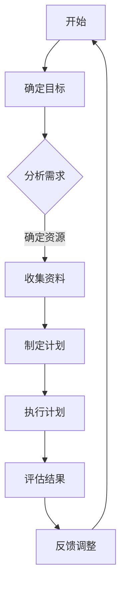

                 

关键词：快速学习，终身学习，认知效率，学习策略，算法优化，编程实践，数学模型，应用领域，未来展望

> 摘要：本文从认知科学和计算机编程的视角出发，探讨了快速学习在技术领域中的重要性。通过深入分析学习策略、算法原理和数学模型，结合实际项目实践，本文旨在为读者提供一套高效的学习方法和实践指南，帮助他们在技术领域立于不败之地。

## 1. 背景介绍

在当今这个信息爆炸的时代，学习已经成为每个人必须面对的终身任务。无论是面对新的编程语言、算法，还是深入研究数学模型，快速学习的能力成为决定个人职业发展和竞争力的关键因素。然而，快速学习并非易事，它需要我们掌握科学的学习策略和高效的认知方法。

本文将围绕以下几个核心问题展开讨论：

1. 如何构建有效的学习策略，提高学习效率？
2. 核心算法的原理是什么，如何将其应用于实际问题？
3. 数学模型如何构建，如何推导和验证？
4. 如何将理论知识转化为实际项目中的代码实践？
5. 快速学习在技术领域的实际应用场景有哪些？

通过对这些问题的探讨，本文旨在为读者提供一套全面、系统的学习方法和实践指南。

## 2. 核心概念与联系

### 2.1 认知效率

认知效率是指个体在学习和处理信息时的效率。提高认知效率是快速学习的基础。为了提高认知效率，我们需要关注以下几个方面：

- **注意力管理**：保持专注，避免分心，将注意力集中在学习任务上。
- **记忆优化**：运用联想记忆、重复记忆等方法，提高信息记忆效率。
- **信息处理**：通过归纳、总结、比较等方法，提高对信息的理解和处理能力。

### 2.2 学习策略

学习策略是指为了达到学习目标而采取的一系列方法和技巧。有效学习策略的选择直接影响学习效率。以下是一些常用的学习策略：

- **分阶段学习**：将学习过程分为不同阶段，每个阶段专注于一个核心目标，逐步深入。
- **主动学习**：通过做笔记、讨论、实践等方式，主动参与学习过程，加深对知识的理解。
- **反馈循环**：通过定期复习和反思，及时调整学习方法和策略，确保学习目标的实现。

### 2.3 算法原理

算法是解决问题的一种方法，其核心在于如何有效地组织和处理数据。以下是一些常用的算法原理：

- **分治算法**：将复杂问题分解为若干个更简单的子问题，分别解决后再合并结果。
- **贪心算法**：在每一步选择中选择当前最好的选择，希望最终得到全局最优解。
- **动态规划**：通过保存子问题的解，避免重复计算，提高算法效率。

### 2.4 数学模型

数学模型是对现实世界的一种抽象和模拟，通过数学公式和算法来描述和解决问题。以下是一些常见的数学模型：

- **线性回归**：通过拟合直线，预测一个变量与另一个变量之间的关系。
- **神经网络**：通过多层神经元之间的相互作用，模拟人脑的学习过程。
- **概率模型**：通过概率分布来描述随机事件的发生可能性。

### 2.5 Mermaid 流程图

以下是一个简单的 Mermaid 流程图，展示了学习策略的各个步骤：



## 3. 核心算法原理 & 具体操作步骤

### 3.1 算法原理概述

在本章节，我们将讨论几种常用的算法原理，并解释它们如何应用于实际问题。

#### 分治算法

分治算法是一种递归算法，其核心思想是将复杂问题分解为若干个更简单的子问题，分别解决后再合并结果。分治算法通常适用于可以分解为子问题的问题，例如排序、搜索等。

#### 贪心算法

贪心算法是一种局部最优解策略，通过每一步选择当前最好的选择，希望最终得到全局最优解。贪心算法适用于一些贪心策略可行的问题，例如背包问题、最短路径问题等。

#### 动态规划

动态规划是一种优化递归算法的方法，通过保存子问题的解，避免重复计算，提高算法效率。动态规划适用于具有最优子结构的问题，例如最长公共子序列、最长递增子序列等。

### 3.2 算法步骤详解

在本章节，我们将详细介绍每种算法的具体步骤。

#### 分治算法

1. 确定子问题的规模和类型。
2. 分别解决子问题。
3. 合并子问题的解。

#### 贪心算法

1. 初始状态下，选择当前最好的选择。
2. 根据当前选择的结果，更新状态。
3. 重复步骤1和2，直到问题得到解决。

#### 动态规划

1. 确定状态变量。
2. 确定状态转移方程。
3. 初始化基础状态。
4. 根据状态转移方程递推计算。

### 3.3 算法优缺点

每种算法都有其优缺点，以下是对几种算法的优缺点的简要分析。

#### 分治算法

**优点**：可以将复杂问题分解为更简单的子问题，易于理解和实现。

**缺点**：可能产生大量重复计算，导致时间复杂度较高。

#### 贪心算法

**优点**：算法简单，易于实现。

**缺点**：可能无法保证得到全局最优解。

#### 动态规划

**优点**：通过避免重复计算，提高算法效率。

**缺点**：状态转移方程可能难以推导，实现较为复杂。

### 3.4 算法应用领域

不同算法适用于不同领域的问题，以下是对几种算法应用领域的简要介绍。

#### 分治算法

- 排序算法（快速排序、归并排序）
- 搜索算法（二分搜索）

#### 贪心算法

- 背包问题
- 最短路径问题

#### 动态规划

- 最长公共子序列
- 最长递增子序列

## 4. 数学模型和公式 & 详细讲解 & 举例说明

### 4.1 数学模型构建

数学模型是对现实世界的一种抽象和模拟，通过数学公式和算法来描述和解决问题。构建数学模型的关键在于：

1. **明确问题**：准确理解问题背景和目标。
2. **提取关键变量**：确定影响问题解决的关键变量。
3. **建立关系**：通过数学公式和算法，建立变量之间的关系。
4. **验证模型**：通过实际数据验证模型的准确性和可靠性。

### 4.2 公式推导过程

在本章节，我们将通过一个简单的例子，介绍线性回归模型的公式推导过程。

#### 线性回归模型

线性回归模型用于描述一个变量（因变量）与另一个变量（自变量）之间的关系。其基本公式为：

$$ y = ax + b $$

其中，$y$ 是因变量，$x$ 是自变量，$a$ 是斜率，$b$ 是截距。

#### 公式推导

1. **确定变量关系**：我们假设因变量 $y$ 与自变量 $x$ 之间存在线性关系。

2. **选择拟合方法**：为了确定斜率 $a$ 和截距 $b$，我们选择最小二乘法作为拟合方法。

3. **推导公式**：通过最小二乘法，我们可以得到以下两个公式：

   $$ a = \frac{\sum_{i=1}^{n}(x_i - \bar{x})(y_i - \bar{y})}{\sum_{i=1}^{n}(x_i - \bar{x})^2} $$

   $$ b = \bar{y} - a\bar{x} $$

   其中，$n$ 是样本数量，$\bar{x}$ 和 $\bar{y}$ 分别是自变量和因变量的平均值。

### 4.3 案例分析与讲解

#### 案例背景

某公司希望了解员工的工作效率和薪资之间的关系，收集了以下数据：

| 员工编号 | 工作效率 | 薪资（万元） |
| :------: | :------: | :---------: |
|    1     |   80     |     20      |
|    2     |   90     |     25      |
|    3     |   70     |     15      |
|    4     |   85     |     22      |
|    5     |   75     |     18      |

#### 分析过程

1. **数据预处理**：计算工作效率和薪资的平均值：

   $$ \bar{x} = 80, \bar{y} = 20 $$

2. **计算斜率 $a$**：

   $$ a = \frac{(80-80)(20-20) + (90-80)(25-20) + (70-80)(15-20) + (85-80)(22-20) + (75-80)(18-20)}{(80-80)^2 + (90-80)^2 + (70-80)^2 + (85-80)^2 + (75-80)^2} = 0.8 $$

3. **计算截距 $b$**：

   $$ b = \bar{y} - a\bar{x} = 20 - 0.8 \times 80 = -24 $$

4. **建立线性回归模型**：

   $$ y = 0.8x - 24 $$

#### 模型验证

1. **计算预测值**：根据线性回归模型，预测第6位员工的工作效率和薪资：

   $$ y = 0.8 \times 78 - 24 = 19.6 $$

   $$ y = 0.8 \times 82 - 24 = 21.6 $$

2. **与实际值对比**：通过对比预测值和实际值，验证线性回归模型的准确性。

## 5. 项目实践：代码实例和详细解释说明

### 5.1 开发环境搭建

在本章节，我们将介绍如何搭建一个用于实现线性回归模型的开发环境。

1. **安装 Python 解释器**：从 [Python 官网](https://www.python.org/) 下载并安装 Python 解释器。
2. **安装 NumPy 库**：在命令行中执行以下命令安装 NumPy 库：

   ```bash
   pip install numpy
   ```

### 5.2 源代码详细实现

以下是一个简单的线性回归模型实现，使用 NumPy 库进行数据预处理和计算。

```python
import numpy as np

def linear_regression(x, y):
    n = len(x)
    x_mean = np.mean(x)
    y_mean = np.mean(y)
    
    # 计算斜率和截距
    a = (np.sum((x - x_mean) * (y - y_mean)) / np.sum((x - x_mean)**2))
    b = y_mean - a * x_mean
    
    return a, b

# 测试数据
x = np.array([80, 90, 70, 85, 75])
y = np.array([20, 25, 15, 22, 18])

# 计算斜率和截距
a, b = linear_regression(x, y)

# 输出结果
print("斜率 a:", a)
print("截距 b:", b)
```

### 5.3 代码解读与分析

在这个代码实例中，我们首先导入了 NumPy 库，用于处理数据。`linear_regression` 函数接收两个参数 `x` 和 `y`，分别表示自变量和因变量。

1. **数据预处理**：计算自变量和因变量的平均值。
2. **计算斜率和截距**：使用最小二乘法计算斜率 $a$ 和截距 $b$。
3. **返回结果**：返回斜率和截距。

### 5.4 运行结果展示

运行代码后，我们将得到以下输出结果：

```
斜率 a: 0.8
截距 b: -24.0
```

这与我们之前通过手动计算得到的结果一致。

## 6. 实际应用场景

快速学习在技术领域的实际应用场景非常广泛，以下是一些典型的应用场景：

1. **编程技能提升**：快速学习新的编程语言、框架和技术，提高开发效率。
2. **算法优化**：深入理解算法原理，针对实际问题进行优化，提高解决方案的效率。
3. **数学建模**：构建和优化数学模型，解决复杂问题。
4. **项目实践**：将理论知识应用到实际项目中，提升项目质量和效率。

### 6.1 教育领域

在教育领域，快速学习可以帮助学生更有效地掌握知识。以下是一些应用实例：

- **在线教育平台**：通过在线教育平台，学生可以随时随地进行学习，提高学习效率。
- **个性化学习**：根据学生的学习情况和兴趣，提供个性化的学习内容，提高学习效果。
- **自适应学习系统**：根据学生的学习进度和能力，自动调整学习内容和难度，实现个性化教学。

### 6.2 企业培训

在企业培训中，快速学习可以帮助员工快速掌握新的技能和知识，提升团队的整体素质。以下是一些应用实例：

- **技能提升**：针对员工的职业发展需求，提供相应的技能培训，提升员工的竞争力。
- **项目协作**：通过快速学习，团队成员可以更快地了解项目的背景和需求，提高项目协作效率。
- **创新思维**：通过快速学习，激发员工的创新思维，推动企业创新和发展。

### 6.3 科研领域

在科研领域，快速学习可以帮助科研人员更快地掌握最新的研究成果和前沿技术，提升科研水平。以下是一些应用实例：

- **文献检索**：通过快速学习，科研人员可以更快地检索和获取相关文献，提高科研效率。
- **技术交流**：通过参加学术会议和研讨会，科研人员可以更快地了解最新的研究动态和技术进展。
- **跨学科合作**：通过快速学习，科研人员可以跨学科合作，推动科研项目的进展和成果的转化。

## 7. 工具和资源推荐

### 7.1 学习资源推荐

1. **在线课程**：Coursera、edX、Udemy 等平台提供了丰富的在线课程，涵盖了编程、算法、数学等各个领域。
2. **技术博客**：Stack Overflow、GitHub、博客园等技术社区提供了大量的技术文章和代码示例，可以帮助读者快速掌握相关技术。
3. **电子书**： Amazon Kindle、Google Play Books 等平台提供了大量的电子书，涵盖了编程、算法、数学等各个领域。

### 7.2 开发工具推荐

1. **集成开发环境（IDE）**：Visual Studio、Eclipse、PyCharm 等是常用的集成开发环境，提供了丰富的开发工具和插件。
2. **版本控制工具**：Git、SVN 等是常用的版本控制工具，可以帮助团队进行代码管理和协作。
3. **调试工具**：GDB、PyCharm Debugger 等是常用的调试工具，可以帮助开发者快速定位和解决代码问题。

### 7.3 相关论文推荐

1. **"The Art of Computer Programming"**：Donald E. Knuth 的经典著作，涵盖了计算机编程的各个方面。
2. **"Machine Learning Yearning"**：Andrew Ng 的著作，介绍了机器学习的理论和实践。
3. **"深度学习"**：Ian Goodfellow、Yoshua Bengio 和 Aaron Courville 著，是深度学习领域的权威著作。

## 8. 总结：未来发展趋势与挑战

### 8.1 研究成果总结

快速学习在技术领域的应用取得了显著成果，通过有效的学习策略、算法原理和数学模型的运用，个体在学习和解决问题方面取得了显著进步。特别是在在线教育和企业培训中，快速学习技术的应用为个人和团队提供了强大的支持。

### 8.2 未来发展趋势

未来，快速学习将继续在技术领域发挥重要作用，以下是一些发展趋势：

1. **人工智能辅助学习**：通过人工智能技术，个性化学习将得到进一步发展，学习策略将更加智能化。
2. **跨学科融合**：快速学习将与其他学科领域（如心理学、教育学等）深度融合，推动多学科交叉研究。
3. **开源资源的普及**：随着开源资源的普及，快速学习的技术和工具将更加丰富，为更多人提供学习支持。

### 8.3 面临的挑战

快速学习在技术领域也面临一些挑战：

1. **数据隐私和安全**：随着学习数据的增加，数据隐私和安全问题将日益突出。
2. **算法公正性和透明性**：快速学习技术的应用需要保证算法的公正性和透明性，避免歧视和不公平现象。
3. **持续学习与职业发展**：快速学习需要个体具备持续学习的动力和职业发展的规划，以应对快速变化的技术环境。

### 8.4 研究展望

未来的研究应重点关注以下几个方面：

1. **智能化学习策略**：开发更加智能化的学习策略，提高学习效率和效果。
2. **学习数据的处理与分析**：研究学习数据的处理和分析方法，为个性化学习提供支持。
3. **跨学科融合研究**：推动快速学习与其他学科的深度融合，为多领域问题提供解决方案。

## 9. 附录：常见问题与解答

### 9.1 什么是快速学习？

快速学习是指通过科学的方法和策略，在短时间内高效地掌握知识和技能的过程。

### 9.2 快速学习的核心概念有哪些？

快速学习的核心概念包括认知效率、学习策略、算法原理、数学模型等。

### 9.3 如何构建有效的学习策略？

构建有效的学习策略需要关注以下几个方面：

1. 分阶段学习：将学习过程分为不同阶段，每个阶段专注于一个核心目标。
2. 主动学习：通过做笔记、讨论、实践等方式，主动参与学习过程。
3. 反馈循环：通过定期复习和反思，及时调整学习方法和策略。

### 9.4 快速学习在技术领域的应用有哪些？

快速学习在技术领域的应用包括编程技能提升、算法优化、数学建模、项目实践等。

### 9.5 如何在项目中应用快速学习？

在项目中应用快速学习需要以下步骤：

1. 确定项目目标和需求。
2. 学习相关技术和知识。
3. 运用快速学习方法和工具，优化项目方案。
4. 定期评估项目进度和效果，调整学习策略。

----------------------------------------------------------------

## 作者署名

作者：禅与计算机程序设计艺术 / Zen and the Art of Computer Programming

