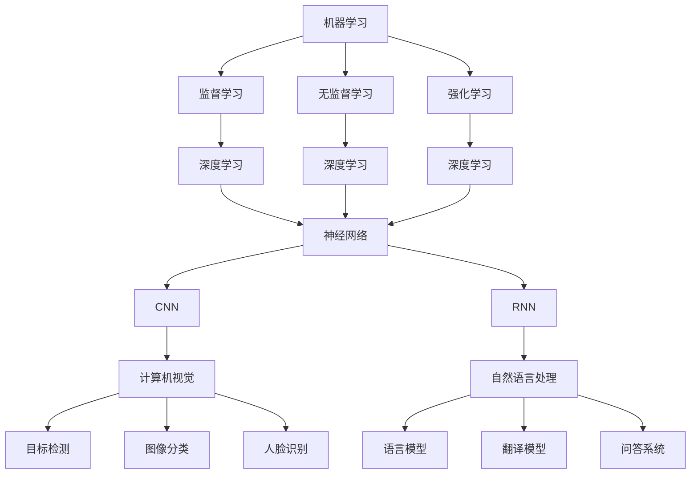

                 

在当今快速发展的信息技术时代，不断学习新技能已成为职场人士的必备能力。然而，面对海量的知识和复杂的技术领域，如何高效地快速掌握一门新专业，成为了许多学习者和从业者共同面临的问题。本文将围绕这一主题，探讨快速学习的方法和策略，帮助您在9个月内掌握一门新专业。

## 关键词

- 快速学习
- 新专业
- 学习策略
- 技术掌握
- 效率提升

## 摘要

本文将详细介绍如何通过科学的学习方法和高效的学习策略，在9个月的时间内快速掌握一门新专业。文章将从背景介绍、核心概念与联系、核心算法原理、数学模型与公式、项目实践、实际应用场景、工具和资源推荐、未来发展趋势与挑战等多个方面进行阐述，旨在为您的学习之路提供有益的指导。

## 1. 背景介绍

### 1.1 技术发展的速度

随着互联网、大数据、人工智能等技术的飞速发展，IT行业日新月异，新技术的涌现使得旧有技术迅速过时。这种快速变化要求从业者必须不断学习新知识、掌握新技术，以适应市场需求。

### 1.2 职场竞争压力

在竞争激烈的职场环境中，拥有多样化的技能不仅能够提高个人的竞争力，还能为职业发展提供更多机会。快速掌握新专业，成为许多职场人士的迫切需求。

### 1.3 学习者的需求

无论是为了职业发展，还是出于个人兴趣，学习者都希望能够高效地学习新知识，迅速提升自己的技术水平。因此，如何实现快速学习，成为了广大学习者关注的问题。

## 2. 核心概念与联系

在快速学习一门新专业之前，了解其核心概念和基本架构是非常重要的。以下是某个技术领域（如人工智能）的核心概念与联系：

### 2.1 机器学习

- **监督学习**
- **无监督学习**
- **强化学习**

### 2.2 深度学习

- **神经网络**
- **卷积神经网络（CNN）**
- **循环神经网络（RNN）**

### 2.3 计算机视觉

- **目标检测**
- **图像分类**
- **人脸识别**

### 2.4 自然语言处理

- **语言模型**
- **翻译模型**
- **问答系统**

### 2.5 Mermaid 流程图



## 3. 核心算法原理 & 具体操作步骤

### 3.1 算法原理概述

以深度学习为例，其核心算法原理主要基于多层神经网络。神经网络通过输入层、隐藏层和输出层进行信息的传递和处理，通过反向传播算法不断调整权重，以达到对数据的分类、回归等任务。

### 3.2 算法步骤详解

1. **数据预处理**：对输入数据进行标准化、归一化等处理，以便神经网络能够更好地学习。
2. **模型构建**：设计并构建神经网络模型，包括确定网络结构、选择激活函数等。
3. **模型训练**：通过训练样本对模型进行训练，调整网络权重，使模型对数据有更好的拟合。
4. **模型评估**：使用验证集对训练好的模型进行评估，调整参数，提高模型性能。
5. **模型部署**：将训练好的模型部署到实际应用场景中，进行预测和决策。

### 3.3 算法优缺点

- **优点**：深度学习具有强大的建模能力和泛化能力，能够处理大规模数据，适应各种复杂任务。
- **缺点**：训练过程复杂，需要大量计算资源和时间；模型可解释性较差，难以理解其内部机制。

### 3.4 算法应用领域

深度学习在计算机视觉、自然语言处理、语音识别等领域有广泛的应用，如图像分类、目标检测、语音识别、机器翻译等。

## 4. 数学模型和公式 & 详细讲解 & 举例说明

### 4.1 数学模型构建

深度学习的数学模型主要包括多层感知机（MLP）、卷积神经网络（CNN）、循环神经网络（RNN）等。

### 4.2 公式推导过程

以卷积神经网络为例，其核心公式为：

$$
\hat{y} = \text{softmax}(\text{激活函数}(\text{权重} \cdot \text{输入特征} + \text{偏置}))
$$

其中，$\hat{y}$ 为预测结果，激活函数通常采用 ReLU 函数。

### 4.3 案例分析与讲解

以图像分类任务为例，我们可以使用卷积神经网络进行训练，以下是一个简单的示例：

```python
import tensorflow as tf

# 定义输入层
inputs = tf.keras.Input(shape=(28, 28, 1))

# 添加卷积层
conv1 = tf.keras.layers.Conv2D(filters=32, kernel_size=(3, 3), activation='relu')(inputs)
pool1 = tf.keras.layers.MaxPooling2D(pool_size=(2, 2))(conv1)

# 添加全连接层
dense = tf.keras.layers.Flatten()(pool1)
outputs = tf.keras.layers.Dense(units=10, activation='softmax')(dense)

# 构建模型
model = tf.keras.Model(inputs=inputs, outputs=outputs)

# 编译模型
model.compile(optimizer='adam', loss='categorical_crossentropy', metrics=['accuracy'])

# 训练模型
model.fit(x_train, y_train, batch_size=32, epochs=10, validation_data=(x_val, y_val))
```

## 5. 项目实践：代码实例和详细解释说明

### 5.1 开发环境搭建

在本地计算机上安装 TensorFlow、Keras 等库，并配置 Python 环境。

### 5.2 源代码详细实现

以下是一个简单的图像分类项目的实现：

```python
import tensorflow as tf
from tensorflow import keras

# 加载数据集
(x_train, y_train), (x_test, y_test) = keras.datasets.mnist.load_data()

# 数据预处理
x_train = x_train / 255.0
x_test = x_test / 255.0

# 将标签转换为 one-hot 编码
y_train = keras.utils.to_categorical(y_train, 10)
y_test = keras.utils.to_categorical(y_test, 10)

# 构建模型
model = keras.Sequential([
    keras.layers.Conv2D(filters=32, kernel_size=(3, 3), activation='relu', input_shape=(28, 28, 1)),
    keras.layers.MaxPooling2D(pool_size=(2, 2)),
    keras.layers.Flatten(),
    keras.layers.Dense(units=10, activation='softmax')
])

# 编译模型
model.compile(optimizer='adam', loss='categorical_crossentropy', metrics=['accuracy'])

# 训练模型
model.fit(x_train, y_train, batch_size=32, epochs=10, validation_data=(x_test, y_test))

# 评估模型
model.evaluate(x_test, y_test)
```

### 5.3 代码解读与分析

以上代码实现了基于卷积神经网络的简单手写数字分类任务。通过加载数据集、数据预处理、构建模型、编译模型、训练模型和评估模型等步骤，完成了整个图像分类项目。

## 6. 实际应用场景

### 6.1 图像识别

在安防、医疗、工业等领域，图像识别技术具有广泛的应用。例如，人脸识别技术可以用于身份验证和安防监控；医学图像分析可以帮助医生诊断疾病。

### 6.2 自然语言处理

自然语言处理技术在智能客服、机器翻译、内容审核等领域有广泛应用。例如，智能客服可以用于企业客户服务，提高客户满意度；机器翻译可以降低语言障碍，促进国际交流。

### 6.3 语音识别

语音识别技术在智能语音助手、语音控制、语音合成等领域有广泛应用。例如，智能语音助手可以帮助用户完成各种任务，提高生活便利性。

## 7. 工具和资源推荐

### 7.1 学习资源推荐

- 《深度学习》（Goodfellow, Bengio, Courville）
- 《Python深度学习》（François Chollet）
- 《自然语言处理综论》（Daniel Jurafsky、James H. Martin）

### 7.2 开发工具推荐

- TensorFlow
- Keras
- PyTorch

### 7.3 相关论文推荐

- 《A Tutorial on Deep Learning for NLP》
- 《Attention Is All You Need》
- 《Bert: Pre-training of Deep Neural Networks for Language Understanding》

## 8. 总结：未来发展趋势与挑战

### 8.1 研究成果总结

深度学习在计算机视觉、自然语言处理、语音识别等领域取得了显著成果，但仍有很大发展空间。

### 8.2 未来发展趋势

随着硬件性能的提升和算法的优化，深度学习在更多领域的应用将得到进一步拓展。

### 8.3 面临的挑战

深度学习模型的可解释性、数据隐私保护、伦理问题等方面仍需深入研究。

### 8.4 研究展望

未来，深度学习有望在更多领域取得突破，推动人工智能技术的发展。

## 9. 附录：常见问题与解答

### 9.1 如何选择学习资源？

建议根据个人兴趣和需求选择合适的教材和课程。

### 9.2 如何解决学习中遇到的问题？

可以通过查阅资料、参加线上或线下课程、请教专业人士等方式解决问题。

### 9.3 如何评估学习效果？

可以通过完成实际项目、参加竞赛、撰写论文等方式评估学习效果。

---

本文从背景介绍、核心概念与联系、核心算法原理、数学模型与公式、项目实践、实际应用场景、工具和资源推荐、未来发展趋势与挑战等多个方面，详细阐述了如何快速学习一门新专业。希望对您的学习之路有所帮助。

## 作者署名

作者：禅与计算机程序设计艺术 / Zen and the Art of Computer Programming

