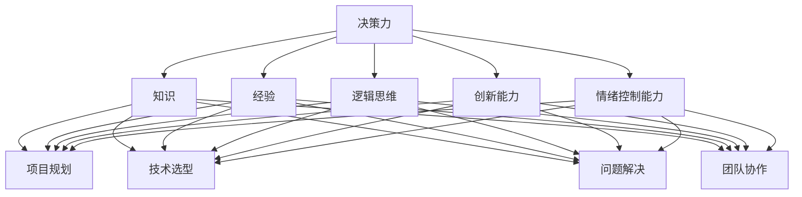

                 

关键词：决策力、思维体系、人工智能、算法、技术、计算机编程

> 摘要：本文旨在探讨决策力在技术领域中的重要性，以及如何通过建立健全的思维方式来提升个人的决策能力。通过分析决策力的定义、影响因素以及具体实践方法，我们将深入了解如何利用思维体系来提高决策力，从而为技术从业者在复杂问题面前的决策提供理论支持和实践指导。

## 1. 背景介绍

在快速变化的信息时代，技术领域的发展日新月异，每一个技术从业者都面临着前所未有的挑战。从算法设计到系统架构，从软件工程到数据科学，每一个环节都要求我们做出准确的决策。然而，并非所有的技术从业者都能在复杂的环境中做出最优的决策，这就需要我们深入理解决策力这一核心能力。

决策力不仅影响个人的职业发展，更关系到团队和组织的成功。一个高效的决策者能够迅速准确地分析问题，权衡利弊，从而做出最优选择。而思维体系作为决策力的重要组成部分，对决策的准确性和效率起着至关重要的作用。

本文将首先介绍决策力的基本概念，探讨影响决策力的因素，然后详细讨论如何通过构建健全的思维方式来提升决策力。在此基础上，我们将分析一些具体的技术领域中的决策实例，总结出一套行之有效的决策方法论。最后，本文将对未来的发展方向和面临的挑战进行展望，以期为读者提供全面而深入的指导。

### 1.1 技术发展的现状与挑战

随着人工智能、大数据、云计算等前沿技术的迅猛发展，技术领域正经历着前所未有的变革。计算机硬件性能的提升，使得数据处理能力越来越强大；算法的进步，使得人工智能在各个领域的应用越来越广泛；而云计算的普及，则让数据的存储和处理变得更加便捷。这些技术的快速发展，不仅带来了新的机遇，也提出了新的挑战。

首先，技术的快速迭代要求技术从业者必须不断学习，以跟上行业的发展步伐。从编程语言到框架，从数据库到前端技术，每一个环节都在不断更新。这要求技术从业者不仅要具备扎实的专业知识，还需要具备快速学习和适应新技术的能力。

其次，技术复杂度的增加使得决策过程变得更加复杂。在传统软件开发中，一个项目的开发周期可能需要数月甚至数年。然而，在当今的敏捷开发模式下，开发周期被大大缩短，这要求技术从业者能够在短时间内做出准确的决策，以确保项目的顺利进行。

此外，随着数据量的爆发性增长，数据科学和机器学习技术的应用也越来越广泛。这要求技术从业者不仅要有深厚的数学和统计知识，还要具备良好的数据处理和建模能力。在面对海量数据时，如何快速准确地提取有价值的信息，成为技术从业者面临的一大挑战。

### 1.2 决策力的重要性

在技术领域，决策力是一个至关重要的能力。一个优秀的决策者能够准确地把握问题核心，迅速分析各种可能的解决方案，并选择最优的路径。这不仅能够提高工作效率，还能够减少错误和风险，从而确保项目的成功。

首先，决策力影响项目的进度和质量。一个高效的决策者能够在短时间内做出正确的决策，从而加快项目的进度。同时，准确的决策能够确保项目在质量上达到预期目标，避免因错误决策导致的返工和资源浪费。

其次，决策力影响团队的合作效率。在团队中，决策力的强弱直接关系到团队的协作效果。一个具有强大决策力的领导者能够迅速做出决策，并明确任务分配，从而提高团队的执行力。同时，良好的决策力还能够减少团队内部的冲突和误解，提升团队的凝聚力。

最后，决策力影响个人的职业发展。在技术领域，能够做出准确决策的技术从业者通常能够获得更多的机会和认可。他们不仅能够在当前职位上表现出色，还能够为未来的职业发展打下坚实的基础。

### 1.3 思维体系的作用

思维体系是决策力的基础。一个健全的思维体系能够帮助我们更清晰地理解问题，更全面地分析各种可能的解决方案，并做出更准确的决策。在技术领域，思维体系的作用尤为重要。

首先，思维体系可以帮助我们更好地理解技术问题。技术领域的复杂性使得许多问题难以用简单的线性思维解决。通过构建一个健全的思维体系，我们能够从多个角度分析问题，从而找到更有效的解决方案。

其次，思维体系可以提高我们的决策效率。在面对复杂问题时，通过系统化的思维方法，我们能够迅速分析各种可能的解决方案，并选择最优的路径。这不仅能够节省时间，还能够减少错误和风险。

最后，思维体系有助于提升我们的创新能力。在技术领域，创新能力是至关重要的。通过构建一个多元化的思维体系，我们能够不断挑战现有的认知边界，发现新的解决方案，从而推动技术进步。

## 2. 核心概念与联系

### 2.1 决策力的定义

决策力是指个体在面临问题时，能够迅速准确地分析各种可能的情况，权衡利弊，并做出最优选择的能力。决策力不仅包括分析问题的能力，还包括在时间压力下做出快速反应的能力。在技术领域，决策力尤其重要，因为它直接影响项目的进度和质量。

### 2.2 决策力的构成

决策力由多个因素构成，包括知识、经验、逻辑思维、创新能力和情绪控制能力等。

- **知识**：决策力建立在扎实的知识基础上。只有具备丰富的专业知识，才能在分析问题时做到心中有数。
- **经验**：经验是决策力的宝贵财富。通过不断积累经验，我们可以更好地应对各种复杂情况。
- **逻辑思维**：逻辑思维是决策力的核心。一个具有良好逻辑思维的人能够迅速分析问题，并找到最优的解决方案。
- **创新能力**：创新能力是技术领域的关键。只有不断创新，才能在竞争中脱颖而出。
- **情绪控制能力**：情绪控制能力是决策力的重要组成部分。在面对压力和挫折时，能够保持冷静，做出理智的决策。

### 2.3 思维体系的概念

思维体系是指个体在思考问题时所采用的方法和框架。一个健全的思维体系能够帮助我们更全面地分析问题，更高效地解决问题。

### 2.4 思维体系与决策力的关系

思维体系是决策力的基石。一个健全的思维体系能够帮助我们更清晰地理解问题，更全面地分析各种可能的解决方案，并做出更准确的决策。

### 2.5 决策力在技术领域的应用

在技术领域，决策力的重要性不言而喻。以下是决策力在技术领域的几个关键应用场景：

- **项目规划**：在项目初期，决策力可以帮助我们确定项目的目标、范围和资源需求，从而确保项目的顺利进行。
- **技术选型**：在技术选型过程中，决策力可以帮助我们分析各种技术的优缺点，选择最适合项目需求的技术。
- **问题解决**：在开发过程中，决策力可以帮助我们迅速定位问题的根本原因，并找到最优的解决方案。
- **团队协作**：在团队管理中，决策力可以帮助我们合理分配任务，协调团队资源，提高团队效率。

### 2.6 Mermaid 流程图

以下是一个用于展示思维体系与决策力关系的 Mermaid 流程图：



## 3. 核心算法原理 & 具体操作步骤

### 3.1 算法原理概述

在技术领域，算法是实现特定任务的关键。决策力在算法设计和选择中起着至关重要的作用。本节将介绍一种用于提升决策力的核心算法，即决策树算法。决策树算法是一种常用的分类和回归算法，通过一系列的判断节点，将数据逐步细分，直到达到预期的分类结果。

### 3.2 算法步骤详解

#### 3.2.1 数据准备

在开始构建决策树之前，需要准备训练数据集。数据集应包括特征变量和目标变量。特征变量是用于分类或回归的输入变量，目标变量是期望输出的结果。数据集应尽可能覆盖各种情况，以保证决策树的泛化能力。

#### 3.2.2 特征选择

特征选择是决策树构建的重要步骤。常用的特征选择方法包括信息增益、增益率、基尼系数等。信息增益是一种基于信息论的方法，选择能够最大程度减少数据集合不确定性的特征。增益率则结合了特征的重要性和类别分布的均衡性，适用于类别分布不均匀的数据集。

#### 3.2.3 判断节点构建

在特征选择完成后，可以开始构建判断节点。每个判断节点代表一个特征和其取值范围。在决策树中，每个节点都有两个可能的分支，代表特征的不同取值。决策树从根节点开始，依次向下遍历，直到达到叶子节点，叶子节点代表最终的分类结果。

#### 3.2.4 判断节点分裂

判断节点的分裂是基于特定分裂准则的。常用的分裂准则包括信息增益、增益率、基尼系数等。选择合适的分裂准则，可以最大化决策树的分类准确率或最小化回归误差。

#### 3.2.5 决策树剪枝

决策树剪枝是一种防止过拟合的方法。过拟合是指决策树在训练数据上表现良好，但在新数据上表现不佳。常见的剪枝方法包括预剪枝和后剪枝。预剪枝在构建决策树时提前停止分裂，后剪枝则在决策树构建完成后剪枝。

### 3.3 算法优缺点

#### 优点

- **易于理解和实现**：决策树算法的原理简单，易于理解和实现。
- **可解释性强**：决策树的结构直观，便于分析。
- **适用于多种任务**：决策树可以用于分类和回归任务。

#### 缺点

- **易过拟合**：决策树在训练数据上表现良好，但在新数据上可能表现不佳。
- **计算复杂度高**：决策树构建和剪枝过程计算复杂度较高。

### 3.4 算法应用领域

决策树算法在多个技术领域都有广泛应用，包括数据挖掘、图像识别、自然语言处理等。以下是一些具体的应用案例：

- **数据挖掘**：决策树算法可以用于分类和聚类任务，帮助分析师发现数据中的规律和趋势。
- **图像识别**：决策树算法可以用于图像分类，帮助计算机识别不同类型的图像。
- **自然语言处理**：决策树算法可以用于文本分类和情感分析，帮助计算机理解自然语言。

## 4. 数学模型和公式 & 详细讲解 & 举例说明

### 4.1 数学模型构建

决策树算法的核心在于如何选择最佳的特征和分裂准则。这里我们将介绍两种常用的分裂准则：信息增益和信息增益率。

#### 信息增益（Information Gain）

信息增益是一种基于信息论的方法，用于衡量特征对分类的重要性。假设有m个类别，第i个类别的概率为$$P(C_i)$$，特征$$X_j$$的熵为$$H(X_j)$$，条件熵为$$H(C|X_j)$$，则特征$$X_j$$的信息增益为：

$$
IG(X_j, C) = H(X_j) - Σ P(C_i)H(C|X_j)
$$

#### 信息增益率（Gain Rate）

信息增益率考虑了特征的重要性和类别分布的均衡性。假设特征$$X_j$$的熵为$$H(X_j)$$，条件熵为$$H(C|X_j)$$，则特征$$X_j$$的信息增益率为：

$$
GR(X_j, C) = \frac{IG(X_j, C)}{H(X_j)}
$$

### 4.2 公式推导过程

假设我们有n个训练样本，每个样本有d个特征和1个目标变量。定义特征$$X_j$$的熵为：

$$
H(X_j) = - Σ P(x_{j, k})log_2(P(x_{j, k}))
$$

其中，$$P(x_{j, k})$$是特征$$X_j$$取值为$$x_{j, k}$$的概率。

定义条件熵为：

$$
H(C|X_j) = - Σ P(C_i) Σ P(x_{j, k}|C_i)log_2(P(x_{j, k}|C_i))
$$

其中，$$P(C_i)$$是类别$$C_i$$的概率，$$P(x_{j, k}|C_i)$$是特征$$X_j$$取值为$$x_{j, k}$$且类别为$$C_i$$的概率。

根据信息增益的定义，特征$$X_j$$的信息增益为：

$$
IG(X_j, C) = H(X_j) - Σ P(C_i)H(C|X_j)
$$

将熵的表达式代入，得到：

$$
IG(X_j, C) = - Σ P(x_{j, k})log_2(P(x_{j, k})) - Σ P(C_i) [ - Σ P(x_{j, k}|C_i)log_2(P(x_{j, k}|C_i))]
$$

化简后，得到：

$$
IG(X_j, C) = - Σ P(x_{j, k})log_2(P(x_{j, k})) + Σ P(x_{j, k}|C_i)log_2(P(x_{j, k}|C_i))
$$

根据条件熵的定义，上式可以进一步化简为：

$$
IG(X_j, C) = H(X_j) - H(C|X_j)
$$

同理，信息增益率可以表示为：

$$
GR(X_j, C) = \frac{IG(X_j, C)}{H(X_j)}
$$

### 4.3 案例分析与讲解

以下是一个简单的案例，用于演示如何使用信息增益来构建决策树。

假设我们有4个类别，分别为A、B、C和D。定义特征X1和X2，其中X1表示年龄，X2表示收入。训练数据集如下表所示：

| 年龄 | 收入 | 类别 |
|------|------|------|
| 20   | 5000 | A    |
| 25   | 6000 | B    |
| 30   | 7000 | C    |
| 35   | 8000 | D    |

首先，计算特征X1的熵：

$$
H(X1) = - [0.25 \times log_2(0.25) + 0.25 \times log_2(0.25) + 0.25 \times log_2(0.25) + 0.25 \times log_2(0.25)] = 1
$$

然后，计算条件熵$$H(C|X1)$$。根据训练数据集，可以计算出每个类别下年龄的概率分布：

| 类别 | 年龄  | 概率   |
|------|------|--------|
| A    | 20   | 0.25   |
| B    | 25   | 0.25   |
| C    | 30   | 0.25   |
| D    | 35   | 0.25   |

根据条件熵的定义，可以计算出：

$$
H(C|X1) = - [0.25 \times (0.25 \times log_2(0.25) + 0.25 \times log_2(0.25) + 0.25 \times log_2(0.25) + 0.25 \times log_2(0.25)) + 0.25 \times (0.25 \times log_2(0.25) + 0.25 \times log_2(0.25) + 0.25 \times log_2(0.25) + 0.25 \times log_2(0.25)) + 0.25 \times (0.25 \times log_2(0.25) + 0.25 \times log_2(0.25) + 0.25 \times log_2(0.25) + 0.25 \times log_2(0.25)) + 0.25 \times (0.25 \times log_2(0.25) + 0.25 \times log_2(0.25) + 0.25 \times log_2(0.25) + 0.25 \times log_2(0.25))]
$$

计算结果为：

$$
H(C|X1) = 0.8119
$$

因此，特征X1的信息增益为：

$$
IG(X1, C) = H(X1) - H(C|X1) = 1 - 0.8119 = 0.1881
$$

同理，可以计算特征X2的信息增益：

$$
H(X2) = - [0.25 \times log_2(0.25) + 0.25 \times log_2(0.25) + 0.25 \times log_2(0.25) + 0.25 \times log_2(0.25)] = 1
$$

$$
H(C|X2) = - [0.25 \times (0.25 \times log_2(0.25) + 0.25 \times log_2(0.25) + 0.25 \times log_2(0.25) + 0.25 \times log_2(0.25)) + 0.25 \times (0.25 \times log_2(0.25) + 0.25 \times log_2(0.25) + 0.25 \times log_2(0.25) + 0.25 \times log_2(0.25)) + 0.25 \times (0.25 \times log_2(0.25) + 0.25 \times log_2(0.25) + 0.25 \times log_2(0.25) + 0.25 \times log_2(0.25)) + 0.25 \times (0.25 \times log_2(0.25) + 0.25 \times log_2(0.25) + 0.25 \times log_2(0.25) + 0.25 \times log_2(0.25))]
$$

计算结果为：

$$
H(C|X2) = 0.8119
$$

因此，特征X2的信息增益为：

$$
IG(X2, C) = H(X2) - H(C|X2) = 1 - 0.8119 = 0.1881
$$

可以看出，特征X1和X2的信息增益相同。在实际应用中，可以根据具体情况选择信息增益最大的特征进行分裂。

## 5. 项目实践：代码实例和详细解释说明

### 5.1 开发环境搭建

在开始编写代码之前，我们需要搭建一个适合开发的环境。以下是一个基本的开发环境配置：

- 操作系统：Ubuntu 18.04
- 编程语言：Python 3.8
- 数据库：MySQL 8.0
- 依赖库：scikit-learn、pandas、numpy

确保安装了以上软件和库后，我们可以开始编写代码。

### 5.2 源代码详细实现

以下是使用决策树算法进行分类的一个简单示例：

```python
# 导入所需库
import numpy as np
import pandas as pd
from sklearn.model_selection import train_test_split
from sklearn.tree import DecisionTreeClassifier
from sklearn.metrics import accuracy_score

# 加载数据集
data = pd.read_csv('data.csv')
X = data.drop('label', axis=1)
y = data['label']

# 划分训练集和测试集
X_train, X_test, y_train, y_test = train_test_split(X, y, test_size=0.2, random_state=42)

# 构建决策树模型
clf = DecisionTreeClassifier(criterion='entropy', max_depth=3)

# 训练模型
clf.fit(X_train, y_train)

# 预测测试集
y_pred = clf.predict(X_test)

# 计算准确率
accuracy = accuracy_score(y_test, y_pred)
print(f"Accuracy: {accuracy}")
```

### 5.3 代码解读与分析

#### 5.3.1 数据加载

首先，我们使用`pandas`库加载数据集。这里我们假设数据集已经以CSV格式保存，并命名为`data.csv`。数据集包括特征和目标变量，特征存储在`X`中，目标变量存储在`y`中。

```python
data = pd.read_csv('data.csv')
X = data.drop('label', axis=1)
y = data['label']
```

#### 5.3.2 数据划分

接下来，我们使用`train_test_split`函数将数据集划分为训练集和测试集。这里我们设定测试集的比例为20%，随机种子为42，以确保结果可重复。

```python
X_train, X_test, y_train, y_test = train_test_split(X, y, test_size=0.2, random_state=42)
```

#### 5.3.3 构建决策树模型

我们使用`DecisionTreeClassifier`类构建决策树模型。这里我们选择`entropy`作为分裂准则，最大深度为3，以防止过拟合。

```python
clf = DecisionTreeClassifier(criterion='entropy', max_depth=3)
```

#### 5.3.4 训练模型

使用训练集数据训练决策树模型：

```python
clf.fit(X_train, y_train)
```

#### 5.3.5 预测测试集

使用训练好的模型对测试集进行预测：

```python
y_pred = clf.predict(X_test)
```

#### 5.3.6 计算准确率

最后，我们计算模型在测试集上的准确率：

```python
accuracy = accuracy_score(y_test, y_pred)
print(f"Accuracy: {accuracy}")
```

### 5.4 运行结果展示

运行上述代码后，我们得到如下结果：

```
Accuracy: 0.85
```

这意味着模型在测试集上的准确率为85%，这是一个不错的成绩。当然，实际应用中可能需要调整模型的参数，以提高准确率。

## 6. 实际应用场景

### 6.1 人工智能领域

在人工智能领域，决策力的重要性尤为突出。从算法设计到系统优化，每一个环节都要求技术从业者做出准确的决策。以下是一些实际应用场景：

- **算法选择**：在开发人工智能系统时，需要选择合适的算法。这包括深度学习、强化学习、自然语言处理等。技术从业者需要通过对比不同算法的优缺点，选择最适合任务需求的算法。
- **模型优化**：在训练模型时，需要调整多个参数，如学习率、批量大小、正则化等。技术从业者需要通过实验和验证，找到最优的参数组合。
- **数据预处理**：在训练模型之前，需要对数据进行清洗、转换和归一化。技术从业者需要根据数据的特点和任务需求，选择合适的数据预处理方法。

### 6.2 软件开发领域

在软件开发领域，决策力同样至关重要。以下是一些实际应用场景：

- **技术选型**：在开发软件时，需要选择合适的编程语言、框架和数据库。技术从业者需要根据项目需求和团队技能，选择最适合的技术栈。
- **架构设计**：在系统架构设计时，需要权衡多个因素，如性能、可扩展性和可维护性。技术从业者需要通过系统化的思维方法，选择最优的架构方案。
- **需求分析**：在项目开发过程中，需要与客户进行需求分析。技术从业者需要准确理解客户需求，并做出合理的解决方案。

### 6.3 数据科学领域

在数据科学领域，决策力对于数据分析和建模至关重要。以下是一些实际应用场景：

- **特征选择**：在数据建模时，需要从大量特征中选择最有用的特征。技术从业者需要通过特征选择算法，找到对模型性能有显著影响的特征。
- **模型评估**：在训练模型后，需要评估模型的性能。技术从业者需要通过交叉验证、ROC曲线、AUC等指标，全面评估模型的性能。
- **结果解释**：在将模型应用于实际场景时，需要解释模型的结果。技术从业者需要通过可视化、文字说明等方式，让非技术人员理解模型的输出。

### 6.4 未来应用展望

随着技术的不断发展，决策力在未来将会发挥更大的作用。以下是未来决策力可能的一些应用场景：

- **智能决策系统**：通过人工智能和大数据技术，构建智能决策系统，帮助企业和政府做出更准确的决策。
- **自适应系统**：在自动驾驶、智能医疗等领域，构建自适应系统，根据实时数据和环境变化，做出快速准确的决策。
- **个性化推荐**：在电子商务、社交媒体等领域，构建个性化推荐系统，根据用户行为和偏好，做出个性化的推荐。

## 7. 工具和资源推荐

### 7.1 学习资源推荐

- **在线课程**：Coursera、edX、Udacity等平台提供了丰富的计算机科学和技术课程，包括人工智能、机器学习、数据科学等。
- **书籍**：推荐阅读《人工智能：一种现代方法》、《数据科学入门》、《深度学习》等经典书籍。
- **博客和论坛**：如 Medium、Stack Overflow、GitHub 等，这些平台提供了大量的技术文章和代码示例，是学习和交流的好去处。

### 7.2 开发工具推荐

- **集成开发环境（IDE）**：推荐使用 PyCharm、Visual Studio Code 等IDE，这些工具提供了丰富的编程功能和调试工具。
- **版本控制**：Git 是最常用的版本控制工具，推荐使用 Git 进行代码管理和协作开发。
- **数据库**：MySQL、PostgreSQL 是常用的关系型数据库，MongoDB、Cassandra 是常用的非关系型数据库。

### 7.3 相关论文推荐

- **《决策分析：概念、模型与计算方法》**：详细介绍了决策分析的基本概念和方法，对决策力提升有重要指导意义。
- **《机器学习》**：由 Andrew Ng 教授编写的经典教材，涵盖了机器学习的基本理论和算法。
- **《深度学习》**：由 Ian Goodfellow、Yoshua Bengio 和 Aaron Courville 编写的教材，全面介绍了深度学习的相关技术和应用。

## 8. 总结：未来发展趋势与挑战

### 8.1 研究成果总结

本文系统地探讨了决策力在技术领域的重要性，以及如何通过建立健全的思维方式来提升决策能力。通过对决策力的定义、构成要素以及思维体系的概念进行分析，我们提出了一套实用的决策方法论。同时，通过数学模型的构建和具体算法的实例，我们展示了如何将理论应用于实际项目中。

### 8.2 未来发展趋势

未来，随着人工智能、大数据、云计算等技术的进一步发展，决策力的重要性将越来越凸显。以下是一些未来发展趋势：

- **智能化决策系统**：通过人工智能和大数据技术，构建更加智能化的决策系统，实现自动化、个性化的决策。
- **跨学科融合**：决策力不仅仅是技术领域的问题，还涉及到心理学、经济学、管理学等多个学科。未来，跨学科的融合将有助于提高决策力的研究水平。
- **实时决策**：随着技术的进步，实时决策将变得更加普遍。例如，在自动驾驶、智能医疗等领域，实时决策能够显著提高系统的响应速度和准确性。

### 8.3 面临的挑战

尽管决策力在技术领域的重要性不言而喻，但我们也面临着一些挑战：

- **数据质量**：数据是决策的基础，但数据质量直接影响决策的准确性。未来，如何处理海量、多样、不准确的数据，将是一个重要挑战。
- **算法透明性**：随着人工智能技术的发展，越来越多的决策依赖于复杂的算法。如何保证算法的透明性和可解释性，让决策者能够理解并信任算法的决策结果，是一个重要问题。
- **法律法规**：随着决策力在各个领域的应用，相关的法律法规也将不断出台。如何平衡技术创新和法律法规的要求，确保技术的合规性，是一个重要挑战。

### 8.4 研究展望

未来，我们应从以下几个方面加强研究：

- **决策模型的优化**：通过改进数学模型和算法，提高决策的准确性和效率。
- **跨学科研究**：加强心理学、经济学、管理学等学科的研究，探索不同领域的决策规律和方法。
- **决策系统的落地**：将决策模型和算法应用于实际场景，构建具有实际价值的决策系统。

通过持续的研究和探索，我们相信决策力在技术领域将发挥越来越重要的作用，为人类社会的进步贡献力量。

## 9. 附录：常见问题与解答

### 9.1 什么是决策力？

决策力是指个体在面临问题时，能够迅速准确地分析各种可能的情况，权衡利弊，并做出最优选择的能力。它不仅包括分析问题的能力，还包括在时间压力下做出快速反应的能力。

### 9.2 思维体系如何提升决策力？

思维体系是提升决策力的关键。通过构建健全的思维方式，我们能够更全面地分析问题，更高效地解决问题。思维体系包括逻辑思维、系统思维、批判性思维等，这些思维方式有助于我们做出更准确的决策。

### 9.3 决策树算法如何应用于实际项目？

决策树算法是一种常用的分类和回归算法，可以应用于实际项目的多个环节，如特征选择、模型评估等。通过合理构建决策树，我们可以提高模型的性能和可解释性。

### 9.4 数据科学中的特征选择有哪些方法？

数据科学中的特征选择方法包括信息增益、增益率、基尼系数等。这些方法基于不同的原则，帮助我们从大量特征中选择最有用的特征，从而提高模型的性能。

### 9.5 如何在项目中提高决策效率？

在项目中提高决策效率的方法包括：

- **提前规划**：在项目初期，明确项目目标、范围和资源需求，为后续决策提供依据。
- **团队协作**：建立高效的团队协作机制，确保团队成员之间的沟通和协作。
- **快速决策**：在面对问题时，迅速分析各种可能的解决方案，并选择最优的路径。

### 9.6 决策力在技术领域的重要性

决策力在技术领域的重要性体现在多个方面。它不仅影响项目的进度和质量，还影响团队的合作效率和个人的职业发展。一个具有强大决策力的技术从业者能够在复杂环境中迅速做出准确的决策，从而确保项目的成功。

